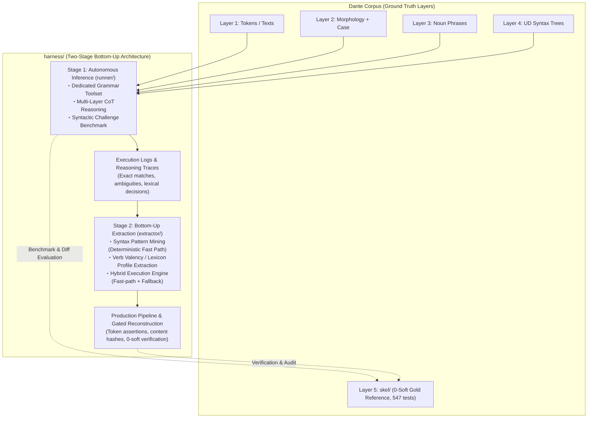

# Grammar Agent Harness: Overall Architecture & Master Plan

## Handoff — resume here

Working notes for the next session only — write what's in flight or about to
start, and clear an entry once it's been acted on. Durable state does not belong
here: it goes to **Current Status** (live numbers), **Orientation for Fresh
Sessions** (context and operational facts that outlive any stage), §2's table
(what a stage settled), or the stage's own `stages/<NN>.md` (everything else).

**Stage 8 closed and Stage 9 opened, both 2026-09-05.** Level 2 reached its close
condition (`make fix-level FIX=2` at 0) on S8.5; opening
[`stages/09.md`](stages/09.md) performed the close. Details in
[`stages/08.md`](stages/08.md) §5 and §2's table below — not repeated here.

**This session (2026-09-05)** read out the second `--fix 2` pass as **S8.4**
(`a466a43`, eight recon TSVs), wrote **S8.5** after the operator's re-run
falsified S8.4's claim that the residue was unreachable (`c2cd5ec`), closed
Stage 8 and opened Stage 9 (`2621264`), updated the root plan (`8902d81`), and
reorganized this file so per-stage detail lives only in the stage documents.

- **Next open item — one**: Stage 9's $O$, a per-iteration improvement signal
  admissible under §4 item 1. The soft counter is **not** (registry-mediated;
  88 of its 130 rules fitted against gold's own divergence); schema verdicts and
  `derive.py` observations are. [`stages/09.md`](stages/09.md) §5 states the
  question, §8 states what a first record owes — including that §1's
  measurements predate S5.5 and want re-measuring before they are acted on.

## Current Status

Every stage's status, dates and outcome are in §2's table; this section holds
the open stage and the live numbers only.

- [ ] **Stage 9 — Fixed-Context Execution** — the open stage (drafted
      2026-09-04, **OPENED 2026-09-05**). Replace the per-unit tool-calling
      session, on the reconstruction and repair path, with a fixed-length
      execution context whose per-request size does not grow with the number of
      iterations. **Its central question is deliberately unanswered at open**:
      the loop needs an admissible per-iteration signal, and finding one is the
      stage's first work rather than a precondition it inherited. §2 below and
      [`stages/09.md`](stages/09.md) carry the measurement it rests on and the
      direction set at open.
- **Corpus** (the harness's own recon TSVs, not gold): **0 hard / 3,138 soft**,
  `make check` exits 0, `make fix-level` **0** at both levels.
- **Gold agreement** (readout only, Standing Invariant §1): **0.7607**
  corpus-wide — inferno 0.7642, purgatorio 0.7592, paradiso 0.7586.
- **Test suite**: **1,001 passed**. Its composition and full history live in
  [`stages/04.md`](stages/04.md)'s pre-launch note, which is where that
  arithmetic has always been kept.

---

## Orientation for Fresh Sessions

Durable context for picking up mining/extraction work cold — not tied to
any one session, so it survives across Handoff clearings.

1. **Read first**: [`extractor/PLAN.md`](extractor/PLAN.md) (§3–§5), then
   [`../ARCHITECTURE.md`](../ARCHITECTURE.md) §4–§6 (observability + log
   contract; `reconstruct.py` already ships it incl. resume).
   The Stage-1→2 interface stays the trace contract:
   `UnitResult.trace_record()` (`runner/agent.py`) embedded as `"trace"` in
   every benchmark case record. The hybrid seam is callable-level:
   `HybridEngine.run_unit(..., fallback=agent_fallback(model=...))`;
   `reconstruct.main(..., fallback=...)` accepts an injected callable for
   deterministic work.
2. **Mining inputs — four complete 87-case JSONL run logs on disk** (all
   gitignored, disk-only; regenerate rather than re-mine if lost):
   M1.4 originals (`harness/bench-unit.log`, `harness/bench-predicate.log`)
   plus the instrumented re-runs (`harness/bench-unit-retry.log`,
   `harness/bench-predicate-retry.log`; finished 2026-08-24). The engine's
   `mine_artifacts()` regenerates rule table + lexicon from them in seconds;
   no mined artifact needs to be frozen on disk.
3. **Error structure to mine around** (details in
   [`stages/01.md`](stages/01.md), M1.4 entries):
   systematic gold-convention divergence on verbless frames dominates
   `historical` misses; bare-`obl` over-assignment (74 fps) and `xcomp`
   over-generation are the top noise sources; `obl:di` / `obl:in` recall
   0.54–0.60 fed lexicon_builder directly (140 frames at 100% consistency
   mined, incl. fare+di / avere+di / sedere+in — see [`stages/02.md`](stages/02.md),
   M2.2 Ledger entry).
   The 31 well-formed unit-side `upstream_feedback` records await HUMAN
   triage — never auto-retag.
4. **Boundaries that hold**: `extractor/` consumes traces + operator-side
   gold (`skel.io`) like `benchmark.py` does; agent-side masking (§4 item 1
   of Standing Invariants below) applies to anything that runs *as* an
   agent — the engine's execution face and `reconstruct.py`'s
   execution/commit faces never open gold at all (adversarially tested),
   only evaluation faces (`evaluate_fast_path`, `--verify-gold`) do;
   `fixtures/challenge_cases.py` stays data-only. Tests live at repo root
   (`tests/test_harness_*.py`). `skel/` is protected: reconstruction writes
   need the explicit `--write` flag on top of passing all three gates,
   canto-atomically.
5. **Wire/cost instrumentation** (shipped across Stages 2–3, live-proven on
   every run): the fallback appends one `llm_request`/`llm_response` JSONL
   pair per backend LLM call — timestamps, model, session/unit coordinates,
   attempt, context/new/output/thought byte sizes, provider token counts
   (`input/output/thought/total_tokens`), duration, `paced_seconds`,
   `max_length_retries`; join key `(session, messages, attempt)`;
   429/quality retries inside `Client` stay transparent to the wire records,
   counted by the `wait_retry` counters. Every `canto_complete` carries
   `elapsed_seconds`, summed into the summary's `wall_clock_seconds`. All
   canto-scoped like every other record. Since S5.5 the log is **append-only
   and never read back** — resume state is the canto's TSV, and `unit`
   records (`row_keys`, `adopted_invalid`, gate verdicts) are read afterwards
   for analysis, not replayed.
6. **Running a `--fix` level.** Standing operational facts from every level-1
   and level-2 run, for whichever level runs next. They belong here rather than
   under a stage because they held across Stages 6 and 8 alike:
   - **A `--fix` run cannot leave the corpus worse than it found it.** Only the
     level's own findings are selectable, and a unit whose answer fails the
     acceptance test keeps its recorded rows — confirmed on repeat passes (S6.5,
     S6.9) and again across level 2's two corpus-wide runs (S8.2, S8.4), with no
     canto and no unit ending worse than it started.
   - **Repeating `make fix` corpus-wide is cheap; re-asking one unit is what
     costs** (S8.4). A canto with no finding at the level makes no model call and
     closes in 0.1 s, so ten whole-corpus passes came to ~2 h wall and 127
     requests. Budget a residue by the units in it, not by the cantos swept.
   - **Repeated identical refusals do not mean a residue is out of reach**
     (S8.5). They bound its per-attempt success rate from above, never at zero —
     one unit settled on its eleventh attempt after ten identical answers. Only
     a mechanism argument (a row the splice cannot take, a gate that refuses what
     a level asks) establishes unreachability.
   - **Sweep the per-canto logs before each corpus-wide fix run**, deliberately,
     so the run's telemetry is unambiguous (S6.7's logs mixed two runs and had to
     be reconstructed from timestamps). Dedupe `unit` records by `(canticle,
     canto, line_start, line_end)` across the whole file, keeping the last — the
     rule that survives both a clean single-segment log and a relaunched one with
     duplicate spans — and key the dedup by the log's *path*, not its basename
     (`01.log` exists in all three canticles). An unswept log can still be read:
     it segments cleanly at its `summary` records (S8.4).
   - **The tool-result console echo is on by default** (400 payload chars,
     `reconstruct.py --tool-result-chars`, 0 = off); `recon/Makefile`'s `%.tsv`
     recipe does not pass the flag, so changing it for corpus runs means editing
     the recipe.
   - **`make check` exits 0** — the corpus has been hard-clean since S5.7, so a
     non-zero `make check` from here on is a regression signal, not an expected
     state (through S5.6 the checker's contract kept it red by design).
   - **A closed level does not stay closed.** The level table is a standing
     selection, not a one-time sweep, so any later live run over a canto may
     re-open positions at either level (S8.1's regression note). Read
     `make fix-level` at every level after a pass, not just the one you ran.
   - The **S5.3-era standing discipline for any rule** (gold-benchmark-not-target,
     schema/derivation authority, `make agree` as readout-only, read positions
     before aggregates) is unchanged and lives in [`stages/05.md`](stages/05.md)
     §5 and §4 below — not repeated here.

---

## Milestone Ledger

**There is no ledger in this file.** Every stage's records live in its own
`stages/<NN>.md` — §2's table is the index. What stays here are the four
conventions that still bind:

1. **A stage writes into its own document from the moment it opens** (decided
   2026-08-29, as this file had grown too large), rather than accumulating here
   and splitting off at close — the pattern Stages 1–4 used. PLAN.md is the
   overall plan: basic architecture, standing rules, and the outlook. Per-stage
   detail is not duplicated here.
2. **File layout** (2026-09-03, as the stage count approached two digits): the
   documents live in `harness/stages/` as zero-padded `<NN>.md`, which keeps the
   growing archive out of `harness/`'s top level and keeps `01.md` … `10.md` in
   reading order. Record IDs stay **unpadded** (`S7.2`, and `S10.1` when it
   comes): they are cited in prose over a hundred times and padding buys them
   nothing.
3. **Cite a stage document with its directory** — `stages/07.md` from
   `harness/`, `../stages/07.md` from a subpackage — even where the shorter link
   would resolve, because `07.md` is not a distinctive string to grep for.
4. **A close is performed by opening the successor's document.** True of every
   stage but 7, whose close had to wait on the rename into `stages/`; Stage 8's
   close restored the convention.

*Stage 1's records are the one split across two files: the toolcall gates T1–T5
have their protocol ledger in [`TOOLCALL.md`](TOOLCALL.md) §8, alongside
milestones 1.1–1.4 in [`stages/01.md`](stages/01.md).*

---

## 1. Overview & Paradigm Shift: Generalizable Layer 5 Reconstruction

`harness/` is a dedicated **Grammar Agent Harness for Local LLMs** (e.g., **Gemma 4 31B**), designed to systematically reconstruct Layer 5 predicate-argument skeletons (`skel/`) from multi-layer grammatical contexts (Layer 1 text/tokens, quotes hierarchy, Layer 2 morphology, pronoun case annex, Layer 3 noun phrase spans, and Layer 4 Universal Dependencies syntax trees).

### Motivation & Rationale
1. **Historical Context & Limitations of `skel/`**:
   - Layer 5 (`skel/`) was historically produced by a **small local LLM**
     (`ollama:gemma4:31b-it-qat`, pinned in `model.mk`) driving the driver's
     `--fix` regeneration loop; its residual errors were then triaged through an
     interactive, semi-manual process in which a frontier LLM (Claude Opus 5,
     later switched to Gemini 3.7 Flash at the end of Phase 8) and human
     operators read the outlier positions to formulate 130 deterministic rules
     (Rules A–EI) and hand-apply the corrections recorded in
     [`CORRECTIONS.md`](../skel/CORRECTIONS.md).
   - Throughout, the small model was granted **no autonomy**: it ran on rails
     laid down by the larger model — executing repairs inside a checker/rule
     system it did not shape, with everything beyond those rails escalated to
     the frontier-LLM/human triage loop.
   - Although this successfully produced a 100% clean corpus (**0 hard / 0 soft violations across all 100 cantos**, 547 pytest passing), the **construction methodology itself was ad hoc, bespoke to Dante's Italian, and insufficiently automated**.
   - As a result, the Phase 5–8 methodology cannot be directly generalized to other texts, genres, or languages (such as Latin).
2. **Mission of `harness/`**:
   - The gist of `harness/` is to grant the local model that missing **autonomy**: remove the hand-laid rails and let it reason from linguistic first principles, deciding its own path through multi-layer context and closed tools instead of executing rules handed down by a larger model.
   - `harness/` embeds this autonomous agent in a **reproducible, fully automated, and generalizable reconstruction pipeline**.
   - Preserving `skel/` as an **immutable Gold Standard (Ground Truth)** for benchmark evaluation, `harness/` demonstrates how local LLMs can autonomously project Layer 4 UD syntax onto predicate-argument frames (Stage 1) and empirically induce syntax rules and valency lexicons (Stage 2).

---

## 2. Staged Strategy: Bottom-Up Core + Scale-Out

In contrast to the top-down methodology used in Phases 5–8 — where frontier LLMs
deduced abstract rules that the local executor then followed mechanically,
without autonomy of its own — `harness/` hands agency to the local model and
adopts an empirical **bottom-up strategy (instance-level inference ➔ pattern
induction)** across Stages 1–2, then scales it out and holds it to the layer's
own contract in the stages that follow.

**Stages 1–8 are closed.** Each row's document holds the design work, the
running detail and the milestone ledger; none of it is repeated here.

| Stage | Period | What it settled | Record |
|---|---|---|---|
| **1** Autonomous inference & benchmark (`runner/`) | – 2026-08-24 | XML wire protocol adopted (probe 0.957, parity 24/24 twice); 87-case benchmarks at quality parity, micro F1 0.711 unit vs 0.708 predicate; traces pooled for Stage 2 | [`stages/01.md`](stages/01.md), [`TOOLCALL.md`](TOOLCALL.md) §8 |
| **2** Rule & lexicon extraction (`extractor/`) | – 2026-08-24 | The >80% fast-path target measured **MISS at 7.0%**, so agent fallback stays the primary path and the gated pipeline's honest output is protection | [`stages/02.md`](stages/02.md) |
| **3** Context optimization | 08-24 → 08-25 | Transcript compaction **cut** from the design (0.5% of the wire, at the cost of the model's own history); the byte reduction moved into the prompt instead (10,706 → 8,954 B); pacing + a 6,000-char generation cap; confirmation re-run passed every criterion | [`stages/03.md`](stages/03.md) |
| **4** Full-corpus verification | 08-25 → 08-29 | The 99-canto scale-out on three canticle-parallel streams, behind every Stage-3 gate; verify-gold micro F1 **0.7219** corpus-wide | [`stages/04.md`](stages/04.md) |
| **5** Corpus durability | 08-29 → 08-30 | The recon TSV becomes the committed artifact *and* the run's resume state; the corpus's 897 hard violations turn out to be exactly the three schema checks the agent's own gate was missing, which move into the session → **0 hard** | [`stages/05.md`](stages/05.md) |
| **6** Soft divergence reduction | 08-30 → 09-02 | The graded `--fix <level>` run, the one sanctioned in-session exception to S5.5; level 1 **377 → 0** over five corpus-wide runs, closed by S6.10 finding the agent's gate narrower than the contract it transcribed | [`stages/06.md`](stages/06.md) |
| **7** Refactoring | 09-02 → 09-03 | The agent's knowledge moves from Python literals to skill files (byte-exact, digested); `reconstruct.py`'s 1,934 lines split into seven modules, putting gold behind a **file** boundary. Also: Warp's improver half refused, on Standing Invariant §1 | [`stages/07.md`](stages/07.md) |
| **8** Soft level 2 | 09-03 → 09-05 | Level 2 = `omitted_l4_argument`, argued from `derive.py` with gold unopened; **1,128 → 0** findings, corpus **4,624 → 3,138** soft, gold agreement 0.7389 → 0.7607; `salvage_by_row` added as a third acceptance scope | [`stages/08.md`](stages/08.md) |

**Reading any soft number**: the count is a conformance measure against
derivation-plus-registry, not a quality one — gold itself clears the bar only
because 88 of the 130 registry rules excuse the 3,250 positions where gold
diverges from `derive_unit`, and those tolerances were fitted by measuring that
diff. It is not even a distance: it double-counts relocated arguments and *rises*
when a missing predicate is registered. S6.1 established this and it governs
every later stage; the evidence is in [`SOFT.md`](SOFT.md) and
[`stages/06.md`](stages/06.md).

### Stage 9: Fixed-Context Execution (drafted 2026-09-04, OPENED 2026-09-05)

**The open stage**, and the only one with prose here. Opening it closed Stage 8.

**The finding it rests on**, measured rather than proposed: **both backends
punish a request past roughly 16 KB** — the API spends quota and pays it back as
429 retries, the local `ollama` path pays it in prefill on a weak GPU — and that
ceiling, not `SESSION_MAX_TURNS = 12`, is what caps a unit's session at ~3 turns.
The tool apparatus the ceiling is spent on is **6,176 B, 61.3%** of a 9,769 B
fixed prompt, against 3,656 B of domain knowledge and 2.8 KB of the unit's own
evidence — and the tools it buys are barely used (`search_corpus`: 4 calls across
348 sessions). So the harness does not iterate on a unit because iterating is
priced out, not because three turns suffice.

**The shape**: no tools; a fixed context of specification + frozen-layer evidence
+ the artifact's current rows + a verdict; the rewritten rows as the only output.
That also makes the schema gate a runtime step rather than a tool the model may
decline to call, and collapses reconstruction and `--fix` into one loop
distinguished only by its initial state.

**Set at open (2026-09-05)**: the fixed context carries **all** the evidence the
masking rule permits — drawing the gold boundary once, rather than re-arguing per
`--fix` class which frozen-layer evidence a notice may render, as Stage 8 had to
do twice.

**Open, and it is the stage's first work**: an admissible per-iteration signal
$O$. The cheap one is not — the soft counter is registry-mediated (see the
caveat above §2's table), so feeding it back each turn is §4 item 1 through one
indirection. Schema verdicts and `derive.py` observations are admissible. The
draft made this a precondition for opening; the operator opened the stage
regardless, so it is work rather than a gate someone else passed.

[`stages/09.md`](stages/09.md) carries everything else: the measurements with
their provenance limits (the logs predate S5.5), what S7.1's skills gain (the
run-wording digest goes from 36.2% coverage to essentially all of it), the
re-reading of S3.7, a candidate Standing Invariant §7 for the budget, and §2.1's
statement of the loop as types — where `fixrun.py`'s standing guarantee turns out
to be that every step is an endomorphism on $\Sigma$ whose failure case is the
identity, a property a new mode inherits by construction or not at all.

### Beyond Layer 5 (design notes)

Directions that open up **after** the `skel/` reconstruction — a layer swap
(same machinery, different target layer), a vertical whole-stack slice, and the
horizon of reconstructing grammar for a language with no available description
— are kept out of this plan in [`FUTURE.md`](FUTURE.md). None of it is
scheduled work; `PLAN.md` remains the source of truth for status and
milestones.

### Transport & backend policy

Decision record (2026-08-22): measured at roughly 3× the local speed, **XML
(`PromptXmlTransport`) was adopted as the official wire format for Stage 1/2
production runs; native Ollama tool calling (`OllamaNativeTransport`) stays
implemented and gated for comparison experiments** (re-run
`harness.toolcall.parity` when revisiting local-only deployments). Backend
choice remains free: `google:gemma-4-31b-it` when wall clock matters,
`ollama:gemma4:31b-it-qat` for offline/cost-constrained work — both validated
end-to-end over the XML protocol during the T4/T5 gates.

Adapter policy (2026-08-24): the stateful `llm7shi.Client` adapter is the
common model-access specification; the stateless probe/parity adapters and the
skel drivers' disposable-Client pattern are legacy from the trial-and-error
phase. The standing rules live in [`../ARCHITECTURE.md`](../ARCHITECTURE.md)
(§2 Model access, §3 Wire protocol).

---

## 3. Separation of Concerns

The directory map lives in [`README.md`](README.md#directory-structure) —
single source, not duplicated here. The boundaries it encodes:

- **`skel/` is protected, not a dependency.** Gold TSVs, the 130-rule registry,
  and [`CORRECTIONS.md`](../skel/CORRECTIONS.md) are the evaluation reference
  and are masked from agents structurally (§4 item 1); only operator-side
  benchmark code reads them.
- **`toolcall/` is a layer- and task-agnostic protocol library.** It knows
  nothing about grammar: wire format, transports, and the multi-turn loop only.
  Everything grammatical lives in `runner/`.
- **`runner/` (Stage 1) produces traces; `extractor/` (Stage 2) consumes
  them.** The contract between the stages is `UnitResult.trace_record()`, not
  shared internals.
- **`fixtures/` is data, read operator-side only.** Nothing under `runner/`
  imports it, so the agent path cannot see the benchmark's case selection.
- **Tests live at the repo root** (`tests/test_harness_*.py`) alongside the
  corpus suite, so the harness stays inside one pytest run.

---

## Environment & Artifacts (reference)

- **Python always runs through `uv`** (`uv run python ...`, `uv run pytest ...`);
  never invoke a bare `python3`. Every command below follows this.
- **Session division of labor**: assistant sessions execute deterministic,
  LLM-free work only (tests, extraction/mining, artifact inspection); every
  LLM-in-the-loop command (the probe / parity / benchmark / agent /
  reconstruction CLIs) is run by the human operator, not by the assistant.
- Live probe: `uv run python -m harness.toolcall.probe --model <model> --repeat N --log
  harness/probe.log` — streaming JSONL: one scenario record per completed scenario,
  summary record last (a log without the summary line = interrupted run);
  `*.log` is gitignored.
- Migration parity check (T5, live run PASSED 2026-08-22): `uv run python -m
  harness.toolcall.parity
  --model <model> [--repeat N] [--log harness/parity.log]` — same log semantics;
  hard gate = canonical interop on both transports.
- Single-unit session CLI (live smoke tests): `uv run python -m harness.runner.agent
  --canticle inferno --canto 1 --line-start 1 [--line-end N] [--trace trace.jsonl]`.
- Benchmark CLI (milestone 1.3): `uv run python -m harness.runner.benchmark [--category
  C]... [--case-id ID]... [--limit N] [--list] [--log bench.log] [--full-transcript]`.
  An existing `--log` resumes: completed cases reload into the aggregate and are
  skipped; the summary sums per-session durations across all attempts.

---

## 4. Standing Invariants & Disciplines

1. **Strict Masking of Gold Layer 5**:
   - `runner/` agents are strictly forbidden access to gold `skel/*.tsv`, the 130-rule registry, and historical correction records ([`CORRECTIONS.md`](../skel/CORRECTIONS.md)).
   - **Gold is the benchmark, never the target — and that binds operator-side
     work too** (added 2026-08-29 on the operator's correction during S5.3;
     rationale in [`stages/05.md`](stages/05.md) §5). Structural masking keeps gold
     out of the *agent's* inputs; this keeps it out of the *pipeline's
     construction* at every level. No deterministic rule, repair, threshold,
     or heuristic anywhere in `harness/` may be chosen by reading gold and
     matching it — that is teaching to the test: it voids every
     gold-referenced number the project reports (Stage 1's micro F1, S4.3's
     verify-gold readout, `recon/agree.py`) and reinstates the top-down
     rails methodology §1 says `harness/` exists to replace. Rules derive
     from the layer's own published contract instead —
     `dante_corpus/skel/validate.py`'s schema invariants and `derive.py`'s
     L1–L4 derivation. Gold-referenced scores are **readouts taken
     afterwards**, never acceptance criteria.
2. **No Free-Form Bash Execution**:
   - Agents operate strictly via closed, structured Tool Calling (`tools.py`) without shell execution privileges.
3. **Preservation of the 0-Soft Regression Gate**:
   - Benchmark and evaluation modes operate strictly in-memory or write to scratch buffers; gold TSVs in `skel/` are never overwritten during benchmark runs.
4. **Upstream Discrepancy Channel**:
   - Discrepancies identified in upstream layers (Layer 2 morphology or Layer 4 UD syntax) are emitted as structured `upstream_feedback` records for human audit and triage.
5. **Live-Run Observability & Log Durability**:
   - LLM-in-the-loop runs are inherently slow (minutes per turn on local
     models, hours per benchmark), and an unwatchable run is an unusable run:
     every operator-facing CLI must keep progress **visible by default**, not
     silent-until-finished.
    - The standing specification — stderr streaming, session separators and the
      optional `HarnessStatusLine` status bar, per-turn timings rolled into
      summaries (`turn_seconds`, `slow_turns`, `api_retries`), turn-granularity
      discipline, log durability independent of shell redirection, and the
      streaming JSONL log contract with its summary-last completion marker and
      resume semantics — lives in [`../ARCHITECTURE.md`](../ARCHITECTURE.md)
      (§4 Live-run observability, §5 Streaming JSONL log contract, §6 Reporting
      shape). It is a standing requirement, not a one-off patch: new live entry
      points (Stage 2's `extractor/` CLIs included) must ship it from day one,
      keep the human-facing progress display on stderr by convention — the
      status bar's shared console excepted, since it carries streamed model
      output too — (JSONL logs go to their own `--log` files, never to
      redirected console output), and any future transport must preserve it.
    - The concrete wiring — status-bar labeling (Canticle Canto Line), the
      shared console the model-access layer streams into (markup parsing off,
      llm7shi's own default since 0.15.0), the run clock threaded in as
      `progress(started_at=...)`, `wait_retry` snapshot/delta accounting, and
      the new-`Client` blank-line spacing — is the ARCHITECTURE.md §4 standard
      itself now, not a pattern restated per plan; `reconstruct.py`
      (2026-08-24) is where it first shipped end-to-end and stays the template
      to copy.
6. **Session Semantics Stability**:
   - Session semantics (prompt wording, tool schema, protocol behavior) may
     change *between* runs but never *mid-run*: a live run's semantics stay
     fixed for its whole duration once launched. Established during Stage 3's
     launch hardening, standing for every later stage.
