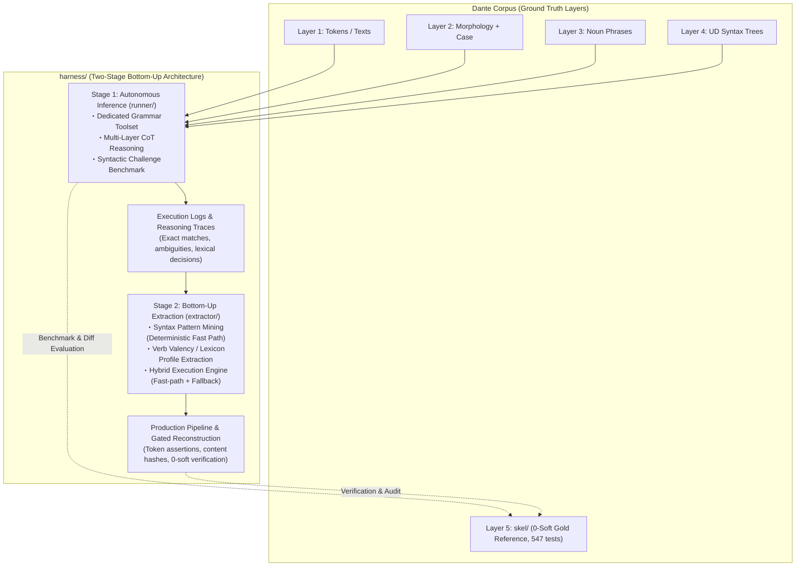

# Grammar Agent Harness: Overall Architecture & Master Plan

## Handoff — resume here

Working notes for the next session only — write what's in flight or about
to start, and clear an entry once it's been acted on (folded into Current
Status, §2, a stage document, or Orientation for Fresh Sessions). Durable
state that should survive indefinitely does not belong here: it belongs in
**Current Status**, **Orientation for Fresh Sessions**, the **Milestone
Ledger**, or §2's per-stage records.

**IN FLIGHT — the operator is running `make fix` over the whole corpus**
(launched 2026-08-30, level `max` = 1). The next session's job is to **read out
that run and write record S6.3**, not to design anything new. Nothing else should
touch `harness/recon/*.tsv` until it lands.

*Baseline it started from* (`ef0bf47` + the S6.2 commit, working tree clean):
**0 hard / 5,014 soft**, level-1 findings **377**, and the run reopens
**337 units across 95 cantos** (inferno 33 cantos/120 units/134 findings;
purgatorio 32/140/156; paradiso 30/77/87). One live session per reopened unit;
the other ~3,140 units cost no model call. Gold agreement stood at **0.7309** —
a readout for afterwards, never a criterion (discipline 4).

*Reading it out, in this order:*

1. `make check` — **0 hard is the regression signal**; soft should fall from
   5,014. Per S6.1 §4.4 the count is not a distance, so do not report the delta
   alone.
2. `make fix-level` — how many of the 377 survive. This is the level's own
   measure, and the honest headline.
3. The per-canto logs (`<canticle>/NN.log`, freshly written by this run and
   gitignored — the first telemetry on disk since S5.8 swept everything):
   `canto_complete.fix` carries units reopened, `verdict:accepted` vs the
   refusals (`no_improvement` / `hard` / `new_class:<name>`), findings and soft
   before → after, and `rows_relabelled` / `rows_added` / `rows_removed`. Every
   `unit` record of a reopened span carries its own `fix.verdict`. **Read these
   before the logs are lost** — nothing else holds the mechanism.
4. `git diff --stat harness/recon` — the run edits committed TSVs in place, so
   the diff *is* the artifact-level record of what changed. Expect only role
   relabels on reopened units; an added or deleted row anywhere is a finding
   worth explaining.
5. `make agree` **last**, as a readout. It may not be cited as the reason the
   level was shipped.
6. Watch `adopted_invalid` (a session that ended on rows its own gate rejected)
   and the revert rate: a high `no_improvement` share would say the notice or
   the gate, not the model, is the limiting factor — that is the interesting
   negative result, and it should be reported as one rather than retried away.

Record S6.3 in [`STAGE6.md`](STAGE6.md) with the mechanism, not just the delta
(discipline 6), and only then consider level 2.

**Stage 5 closed 2026-08-30 at 0 hard** ([`STAGE5.md`](STAGE5.md) S5.8)
and **Stage 6 opened on the soft residue** ([`STAGE6.md`](STAGE6.md)), whose first
record S6.1 is the audit of the classification that would otherwise drive it
([`SOFT.md`](SOFT.md)). Record **S6.2** then shipped the reduction mechanism:
soft classes are **graded**, and `reconstruct --fix <level>` reopens the units of
a committed TSV carrying a finding at that level, shows the session its own
recorded rows plus the invariants they break, and **replaces** those rows with
what it re-solves — nothing deleted, and a unit whose answer fails the acceptance
test keeps the rows it had. **Level 1 is `oblique_qualification`: 377 findings**,
bare `obl` where the derivation determines `obl:<prep>`.

The corpus was untouched by that record — **0 hard, 5,014 soft**, `make check`
exits 0 — and the operator's `make fix` above is the separate act that applies
it. `make fix-level` prints the per-canto launch list for free, and `FIX`
defaults to `max`, resolved by the level table itself (`fixlevel.resolve_level`)
so the Makefile carries no copy of how far repair reaches.

This reverses one S5.5 decision on purpose and the reversal is scoped: soft
findings do now reach a session, but only as **the invariant and the frozen-layer
evidence** for a position ("this oblique argument carries a Layer-4 `case` child
(3.1 'come')"). The derived label never crosses, in the notice or in the gate —
a test asserts its absence — so the model re-derives the qualification rather
than transcribing `derive_unit`. Everything else in Stage 6 remains deterministic
work over the committed TSVs.

| class | count | | top `role_mismatch` (given vs derived) | |
|---|---:|---|---|---:|
| `extra_arg` | 2,114 | | `obl` vs `obl:di` | 129 |
| `missing_arg` | 1,646 | | `obl` vs `obl:in` | 83 |
| `role_mismatch` | 573 | | `obl` vs `obl:come` | 70 |
| `missing_tuple` | 490 | | `obj` vs `subj` | 45 |
| `membership` | 146 | | `subj` vs `obj` | 29 |
| `extra_tuple` | 43 | | `obl` vs `obl:a` | 24 |

**Read S6.1 before picking a class** ([`STAGE6.md`](STAGE6.md) §2–§3 carry the
standing version; [`SOFT.md`](SOFT.md) the evidence). The short version: the findings are real
and evidence-anchored (96.7% of `missing_arg` are arguments L4 itself attaches
to the predicate; zero checker misfires), but **the counter's zero point is not
neutral**. Gold reaches 0 soft only because 88 registry tolerance rules excuse
the 3,250 positions where gold itself diverges from `derive_unit`, and those
tolerances were written by measuring that diff — six of them fire exactly once
on gold apiece. So soft is a *conformance* measure against derivation +
registry, not a correctness measure, and it is not a distance either: one
relocated argument scores twice, and registering a `missing_tuple` predicate
(a strict improvement) *raises* the count at 227 of 490 positions.

**What that makes eligible**, in order:

1. `role_mismatch`'s 377 oblique-refinement findings (bare `obl` vs
   `obl:<prep>`) and `missing_arg`'s 1,592 L4-anchored omissions — the
   derivation determines the answer from the frozen layers, so discipline 3
   applies cleanly. A dry run of the two rewrites
   `dante_corpus/skel/repairs.py` already licenses (`role_label`,
   `null_subject`) takes soft to **3,949** with 720 rewrites, nothing deleted.
2. `extra_arg`'s 568 `advcl`-read-as-`obl` — a systematic argument/adjunct
   disagreement sitting next to an existing tolerance (rule T). This is a
   candidate for a *tolerance*, not a repair, and it is the exact shape
   [`../skel/PHASE5.md`](../skel/PHASE5.md) §1.2 records Phase 5 misdiagnosing
   as "LLM error" when the derivation was merely silent.
3. The 614 pro-drop `subj (0,0)` `extra_arg` findings sit under
   `_apply_subj_authority`, the contract's own declaration that the subject
   slot is LLM-authoritative — read that before rewriting anything there.

**One decision is open and is the operator's** ([`STAGE6.md`](STAGE6.md) §3).
Is `dante_corpus/skel/repairs.py` an admissible authority under discipline 3?
It opens no gold file and its rewrites are re-derivable from `derive.py`
(`_oblique_role_of` determines `obl:<prep>`; `null_subject` is gated on
`dep.subject_agreement`), but it is the same `skel/` toolchain that built gold.
Either it is used directly, or the rules are re-derived independently in
`harness/recon/repair.py` from `derive.py` alone.

**A readout, not a criterion** (SOFT.md §6, gold opened deliberately
afterwards): that same dry run moves gold agreement 0.7309 → **0.7475**
(+0.0166, +687 rows; 687 of 720 rewrites land on a gold row), against
0.7307 → 0.7309 flat across the entire hard track. It does not choose the rule
and may not be cited as the reason to ship one.

The prompt-side lever (`runner/prompts.py`) is still deliberately untouched.
It stayed out of S5.5–S5.7 so those records measured the gate alone; it is now
free to use, but on this evidence it should be aimed at something soft
findings can actually judge, not at more hard-class work — there is none left.

**Standing discipline for any rule, established by S5.3's two operator
corrections** ([`STAGE5.md`](STAGE5.md) §5):

1. `check.py`'s counts *select* the work but never decide it. Gold scores
   0/0 under the same checker, so the bar is calibrated — but every hard
   class clears by deleting rows, so the counter rewards deletion.
2. **Gold decides nothing either.** It is `harness/`'s benchmark, not its
   target; fitting rules to it is teaching to the test, voids every
   gold-referenced number the project reports, and reinstates the very
   top-down methodology `harness/` exists to replace (§1). Design each rule
   with gold unopened.
3. A rule's authority comes from the layer's own contract —
   `dante_corpus/skel/validate.py`'s schema invariants and `derive.py`'s
   derivation. Admissible when the schema declares the current row
   impossible *and* the contract determines what may stand in its place;
   where it is silent, withdraw the void assertion rather than invent one;
   where a derivable alternative exists, deletion is wrong.
4. `make agree` is a **readout run afterwards**, never an acceptance
   criterion.
5. Read positions, not aggregates, before writing the rule — the same
   discipline Phase 5 learned the hard way
   ([`../skel/PHASE5.md`](../skel/PHASE5.md) §1.3, §5.2).
6. **On the soft side the counter is a conformance measure, not a referee**
   (added 2026-08-30 on record S6.1, [`SOFT.md`](SOFT.md) §4.2). Its zero is
   "every disagreement with `derive_unit` has a shape the 130-rule registry
   names", and those shapes were fitted by measuring gold's own diff. A soft
   finding is therefore a report that two readings differ, and each candidate
   class has three possible outcomes — the artifact is wrong, the derivation
   is silent (a *tolerance* is missing), or the two notations are equivalent.
   Only the first licenses editing the corpus. Report the mechanism with any
   reduction, not just the delta: the count is non-monotonic under partial
   completion and double-counts relocated arguments.

**Ordering constraint** (now largely moot, kept as the reason): `repair`
edits the committed TSVs in place, so anything that regenerates a TSV from a
log rolls its repairs back. That is half of why `convert` lost its Makefile
target on 2026-08-30 — and the logs themselves are gone, so nothing can
regenerate a committed TSV today.

**State at the S6.1 session's close (2026-08-30).** The session was
documentation only: new [`SOFT.md`](SOFT.md) and [`STAGE6.md`](STAGE6.md), plus
edits to this file, [`STAGE5.md`](STAGE5.md) (closed, S5.9 moved out to S6.1),
[`HARD.md`](HARD.md) (the §4.3 correction and the SOFT.md cross-link) and
[`README.md`](README.md) (its doc index had stopped at Stage 3, and the
`recon/` map still described pre-S5.8 log semantics). No code changed, the
suite is unchanged at 938 (not re-run), and the corpus is untouched:
`make check` still reports 0 hard / 5,014 soft. 55 of the 100 TSVs
carry in-session output — inferno 1 (S5.6) plus the 52 clausal cantos and the 3
fast-path units of S5.7; the remaining 45 are exactly as S5.3 left them. S5.8
was housekeeping around the corpus rather than on it (the log demoted to a
by-product, the `convert` target removed, `readout`'s re-run double-count
fixed, all 100 logs swept) and closed Stage 5; S6.1 audited the soft
classification without touching anything, and Stage 5's ledger was left at S5.8
so the soft work reads as the new stage it is.

- **Two corrections to earlier records, deliberately left unrepaired** (S6.1):
  `derive_unit`'s own output carries one hard violation —
  `paradiso 18:83 [clausal] xcomp argument (84,3) is not a predicate`, a
  gapped-coordination `orphan` cited but never promoted — so
  [`HARD.md`](HARD.md) §4.3's "impossible by construction" is falsified (the
  closure holds at 3,476 of 3,477 units); and `unknown_role` is emitted as a
  soft `tag` although it is an exception-free format impossibility with no
  tolerance behind it (0 occurrences today, so latent).

- **Two fix gestures now.** `--fix <level>` replaces a unit's rows in place
  (S6.2) and is the one to reach for on the soft side. Deletion still means
  "regenerate this stretch from scratch", and there it has line granularity:
  Deleting a violating *row* leaves
  its line present, and `TsvArtifact`'s settled-unit test is line-number
  presence — so the canto re-runs nothing and no model is called. Delete
  every row of the line. S5.7 hit this first time round and lost a run to it.
- **The tool-result console echo is on by default** (400 payload chars,
  `reconstruct.py --tool-result-chars`, 0 = off). It takes effect from the
  next run, and `recon/Makefile`'s `%.tsv` recipe does not pass the flag — so
  changing it for corpus runs means editing the recipe.
- **`make check` now exits 0** — the corpus is hard-clean (0 hard, 5,014
  soft), so from here a non-zero `make check` *is* a regression signal and
  should be read as one. That is new: through S5.6 the checker's contract
  (non-zero on any hard violation) kept it red by design.
- **Carry-over caveat on S5.3's own two rules** ([`STAGE5.md`](STAGE5.md)
  §5): they satisfy discipline 2–3 above and `repair.py` opens no gold file,
  but gold *was* consulted while they were being designed, before the
  operator's correction landed. Their agreement gain is therefore a
  consistency check, not independent evidence that schema-driven repair
  converges on gold. S5.5/S5.7's gate checks are transcriptions of
  `validate.py` and gold-closed by construction, and S5.6–S5.7 answered the
  convergence question honestly at last: agreement went 0.7307 → 0.7309 over
  the whole hard track, so **no such claim is available** — the schema
  contract and gold agree only about what is impossible, not about what is
  right.
- **Process note, still standing**: applying anything to the committed
  corpus is a separate act from designing and implementing it, and needs its
  own go-ahead. A reduction pass can always be measured without writing —
  show those numbers first.

Two things a fresh session should still know before touching
`harness/recon/`:

- **There were no logs on this machine** (`make clean-log`, S5.8), and with
  them went all Stage-4/5 run telemetry — cost accounting, per-unit routing,
  gate detail. §2 had accepted that as ephemeral, so it was that decision
  carried out rather than a new one, but it is irreversible: those headline
  numbers survive *only* as prose in [`STAGE5.md`](STAGE5.md) S5.1/S5.5–S5.7
  and [`STAGE4.md`](STAGE4.md) S4.3. **The `make fix` run in flight writes new
  ones** for every canto it touches, and they are the only copy of that run's
  mechanism — read them into S6.3 before anything sweeps them again. `recon/readout.py` and `recon/convert.py`
  are kept and tested but have no input until a future run writes new logs,
  and neither has a Makefile target that touches the corpus.
- `make <canticle>` is **TSV-goaled and TSV-gated: the log is neither goal
  nor prerequisite, only a by-product** (S5.8). Since S5.5 the TSV is the
  resume state, so a complete TSV costs no model calls whether or not a log
  sits beside it, and a fresh clone re-runs nothing — it only pays
  reconstruct's startup mining per invocation. Deleting a TSV (or a stretch
  of its lines) is how you ask for that canto back; do it deliberately, since
  a full canticle is tens of hours of live model time. Work on the other 99
  cantos should still read/edit the committed TSVs directly, not relaunch the
  model.

## Current Status

Stages 1–5 are COMPLETE/CLOSED; their status, dates, and record pointers
live in §2's per-stage subsections below, not repeated here. This section
holds only what's still open.

- [ ] **Stage 6 — Soft Divergence Reduction** (OPENED 2026-08-30 by
      operator, on Stage 5's close). Everything left in the recon corpus is
      soft: **5,014 findings**, deterministic work over the committed TSVs,
      never reported into an agent session. Record S6.1 audited the
      classification before letting it drive anything ([`SOFT.md`](SOFT.md)):
      the findings are evidence-anchored and the checker does not misfire
      (96.7% of `missing_arg` are arguments L4 itself attaches to the
      predicate; `derive_unit`'s own output scores 0 soft), but **the
      counter's zero point is tolerance-mediated** — gold reaches 0 only
      because 88 of the 130 registry rules excuse the 3,250 positions where
      gold itself diverges from `derive_unit`, and those tolerances were
      fitted by measuring that diff. So soft is a conformance measure rather
      than a correctness measure, and not a distance either (it double-counts
      relocated arguments and rises when a missing predicate is registered).
      Each class must therefore be resolved to one of three outcomes — the
      artifact is wrong, the derivation is silent (a *tolerance* is missing),
      or the notations are equivalent — and only the first licenses an edit.
      Record S6.2 then shipped the graded `--fix` mechanism and its first
      level (`oblique_qualification`, 377 findings), corpus untouched.
      Next: the operator's pilot canto, then a level 2 argued the same way;
      one authority question is still open for the operator. Scope, the
      standing method, class eligibility and the ledger in
      [`STAGE6.md`](STAGE6.md).
- Test suite: **955 passed** (876 + 11 from S5.1 + 8 from S5.2 + 21 from
  S5.3 + 9 from S5.5 + 9 from S5.7 + 4 from S5.8 + 17 from S6.2).
  Composition and history (TokenBucket removal,
  mid-canto kill resilience, the readout tool's own tests) in
  [`STAGE4.md`](STAGE4.md)'s pre-launch note and record S4.3.

---

## Orientation for Fresh Sessions

Durable context for picking up mining/extraction work cold — not tied to
any one session, so it survives across Handoff clearings.

1. **Read first**: [`extractor/PLAN.md`](extractor/PLAN.md) (§3–§5), then
   [`../ARCHITECTURE.md`](../ARCHITECTURE.md) §4–§6 (observability + log
   contract; `reconstruct.py` already ships it incl. resume).
   The Stage-1→2 interface stays the trace contract:
   `UnitResult.trace_record()` (`runner/agent.py`) embedded as `"trace"` in
   every benchmark case record. The hybrid seam is callable-level:
   `HybridEngine.run_unit(..., fallback=agent_fallback(model=...))`;
   `reconstruct.main(..., fallback=...)` accepts an injected callable for
   deterministic work.
2. **Mining inputs — four complete 87-case JSONL run logs on disk** (all
   gitignored, disk-only; regenerate rather than re-mine if lost):
   M1.4 originals (`harness/bench-unit.log`, `harness/bench-predicate.log`)
   plus the instrumented re-runs (`harness/bench-unit-retry.log`,
   `harness/bench-predicate-retry.log`; finished 2026-08-24). The engine's
   `mine_artifacts()` regenerates rule table + lexicon from them in seconds;
   no mined artifact needs to be frozen on disk.
3. **Error structure to mine around** (details in
   [`STAGE1.md`](STAGE1.md), M1.4 entries):
   systematic gold-convention divergence on verbless frames dominates
   `historical` misses; bare-`obl` over-assignment (74 fps) and `xcomp`
   over-generation are the top noise sources; `obl:di` / `obl:in` recall
   0.54–0.60 fed lexicon_builder directly (140 frames at 100% consistency
   mined, incl. fare+di / avere+di / sedere+in — see [`STAGE2.md`](STAGE2.md),
   M2.2 Ledger entry).
   The 31 well-formed unit-side `upstream_feedback` records await HUMAN
   triage — never auto-retag.
4. **Boundaries that hold**: `extractor/` consumes traces + operator-side
   gold (`skel.io`) like `benchmark.py` does; agent-side masking (§4 item 1
   of Standing Invariants below) applies to anything that runs *as* an
   agent — the engine's execution face and `reconstruct.py`'s
   execution/commit faces never open gold at all (adversarially tested),
   only evaluation faces (`evaluate_fast_path`, `--verify-gold`) do;
   `fixtures/challenge_cases.py` stays data-only. Tests live at repo root
   (`tests/test_harness_*.py`). `skel/` is protected: reconstruction writes
   need the explicit `--write` flag on top of passing all three gates,
   canto-atomically.
5. **Wire/cost instrumentation** (shipped across Stages 2–3, live-proven on
   every run): the fallback appends one `llm_request`/`llm_response` JSONL
   pair per backend LLM call — timestamps, model, session/unit coordinates,
   attempt, context/new/output/thought byte sizes, provider token counts
   (`input/output/thought/total_tokens`), duration, `paced_seconds`,
   `max_length_retries`; join key `(session, messages, attempt)`;
   429/quality retries inside `Client` stay transparent to the wire records,
   counted by the `wait_retry` counters. Every `canto_complete` carries
   `elapsed_seconds`, summed into the summary's `wall_clock_seconds`. All
   canto-scoped like every other record. Since S5.5 the log is **append-only
   and never read back** — resume state is the canto's TSV, and `unit`
   records (`row_keys`, `adopted_invalid`, gate verdicts) are read afterwards
   for analysis, not replayed.

---

## Milestone Ledger

*Documentation convention (from Stage 5 on, decided 2026-08-29 as PLAN.md
grew too large): each stage now writes design work, running detail, and
its milestone ledger directly into its own `STAGE<N>.md` from the moment
it opens, rather than accumulating in PLAN.md and splitting off at close
(the pattern Stages 1–4 used, kept below for their archived records).
PLAN.md stays the overall plan — Handoff and Current Status are kept
current every session; per-stage detail is not duplicated here.*

*Stage-1 records (toolcall T1–T5, milestones 1.1–1.4 + carry-over
resolutions) live in [`STAGE1.md`](STAGE1.md) and [`TOOLCALL.md`](TOOLCALL.md)
§8; the completed Stage-2 record — milestones 2.1–2.5 incl. the inferno-1
pilot and the closing recheck readout — was split off on 2026-08-24 to
[`STAGE2.md`](STAGE2.md). All Stage-3 records S3.1–S3.11 live in
[`STAGE3.md`](STAGE3.md)'s ledger (S3.1 moved there verbatim at stage close,
2026-08-25; stage closed on S3.11); all Stage-4 records S4.1–S4.3 live in
[`STAGE4.md`](STAGE4.md)'s ledger (stage closed 2026-08-29 on S4.3); all
Stage-5 records S5.1–S5.8 live in [`STAGE5.md`](STAGE5.md)'s ledger, written
there from the start (stage closed 2026-08-30 on S5.8); Stage-6 records accrue
the same way in [`STAGE6.md`](STAGE6.md).*

---

## 1. Overview & Paradigm Shift: Generalizable Layer 5 Reconstruction

`harness/` is a dedicated **Grammar Agent Harness for Local LLMs** (e.g., **Gemma 4 31B**), designed to systematically reconstruct Layer 5 predicate-argument skeletons (`skel/`) from multi-layer grammatical contexts (Layer 1 text/tokens, quotes hierarchy, Layer 2 morphology, pronoun case annex, Layer 3 noun phrase spans, and Layer 4 Universal Dependencies syntax trees).

### Motivation & Rationale
1. **Historical Context & Limitations of `skel/`**:
   - Layer 5 (`skel/`) was historically produced by a **small local LLM**
     (`ollama:gemma4:31b-it-qat`, pinned in `model.mk`) driving the driver's
     `--fix` regeneration loop; its residual errors were then triaged through an
     interactive, semi-manual process in which a frontier LLM (Claude Opus 5,
     later switched to Gemini 3.7 Flash at the end of Phase 8) and human
     operators read the outlier positions to formulate 130 deterministic rules
     (Rules A–EI) and hand-apply the corrections recorded in
     [`CORRECTIONS.md`](../skel/CORRECTIONS.md).
   - Throughout, the small model was granted **no autonomy**: it ran on rails
     laid down by the larger model — executing repairs inside a checker/rule
     system it did not shape, with everything beyond those rails escalated to
     the frontier-LLM/human triage loop.
   - Although this successfully produced a 100% clean corpus (**0 hard / 0 soft violations across all 100 cantos**, 547 pytest passing), the **construction methodology itself was ad hoc, bespoke to Dante's Italian, and insufficiently automated**.
   - As a result, the Phase 5–8 methodology cannot be directly generalized to other texts, genres, or languages (such as Latin).
2. **Mission of `harness/`**:
   - The gist of `harness/` is to grant the local model that missing **autonomy**: remove the hand-laid rails and let it reason from linguistic first principles, deciding its own path through multi-layer context and closed tools instead of executing rules handed down by a larger model.
   - `harness/` embeds this autonomous agent in a **reproducible, fully automated, and generalizable reconstruction pipeline**.
   - Preserving `skel/` as an **immutable Gold Standard (Ground Truth)** for benchmark evaluation, `harness/` demonstrates how local LLMs can autonomously project Layer 4 UD syntax onto predicate-argument frames (Stage 1) and empirically induce syntax rules and valency lexicons (Stage 2).

---

## 2. Staged Strategy: Bottom-Up Core + Scale-Out

In contrast to the top-down methodology used in Phases 5–8 — where frontier LLMs deduced abstract rules that the local executor then followed mechanically, without autonomy of its own — `harness/` hands agency to the local model and adopts an empirical **bottom-up strategy (instance-level inference ➔ pattern induction)** across Stages 1–2, with Stage 3 as context optimization + launch hardening (closed 2026-08-25), Stage 4 as the operational scale-out (closed 2026-08-29), Stage 5 as the corpus-durability track that also took the corpus hard-clean (closed 2026-08-30), and Stage 6 as the soft divergence reduction that remains.

### Stage 1: Autonomous Local Inference & Capability Benchmark (`harness/runner/`)
- **Approach**: For each parse unit, the agent receives the multi-layer context (L1–L4, quotes, case) and autonomously solves predicate-argument frames on the fly using Chain-of-Thought (CoT) and a dedicated Tool Calling API (`validate_candidate`, etc.).
- **Objectives**:
  - Quantitatively benchmark local LLM capabilities (1-shot exact match rate, multi-turn self-correction convergence rate, role-level F1) against the 0-soft Gold Standard (`skel/`).
  - Capture comprehensive execution logs, successful syntax projections, and lexical decision traces (e.g., argument vs. adjunct discrimination, reflexive pronouns, control verbs).
- **Specification**: [`harness/runner/PLAN.md`](runner/PLAN.md).
- **Status**: COMPLETE (2026-08-24); record archived in [`STAGE1.md`](STAGE1.md)
  — XML wire protocol adopted (probe 0.957 ≥ 0.95, parity interop 24/24
  twice), 87-case benchmarks at quality parity for both workflows (micro F1
  0.711 unit vs 0.708 predicate), traces pooled for Stage 2 mining. Protocol
  ledger in [`TOOLCALL.md`](TOOLCALL.md) §8.

### Stage 2: Bottom-Up Rule & Lexicon Extraction (`harness/extractor/`)
- **Approach**: Mine and aggregate the reasoning logs and decision trajectories from Stage 1 to:
  1. Extract stable, deterministic Universal Dependencies patterns as **Syntax Fast-Path Rules**.
  2. Aggregate verb-preposition-case co-occurrences into an empirical **Verb Valency Lexicon**.
  3. Construct a **Hybrid Execution Engine** combining deterministic fast paths (rules + lexicon) with fallback to Stage 1 agent inference for ambiguous or rare contexts.
- **Objectives**:
  - Maximize cross-corpus consistency and reduce inference latency and token overhead (targeting >80% fast-path coverage).
  - Provide a gated production pipeline that reconstructs cantos under strict 0-soft regression verification and content hash updating.
- **Specification**: [`harness/extractor/PLAN.md`](extractor/PLAN.md).
- **Status**: COMPLETE (2026-08-24); record archived in
  [`STAGE2.md`](STAGE2.md) — the >80% fast-path target measured MISS at
  7.0%, so agent fallback remains the primary path and the gated pipeline's
  honest output is protection.

### Stage 3: Context Optimization (opened 2026-08-24, CLOSED 2026-08-25)

Closed on record S3.11 with the full-corpus expansion re-scoped out into
Stage 4. The arc: the S3.1 correlation analysis (two accounting points
corrected by S3.2 — [`STAGE3.md`](STAGE3.md) §1), **the compaction/pacing
design + deterministic gate re-check (record S3.2)**, and **the
implementation (record S3.3)** — spec, gate verdicts, implementation map,
measured deviations, and the stage ledger live in [`STAGE3.md`](STAGE3.md).
**Record S3.7 cut transcript compaction from the design**: measured against
run #1's own records it bought 0.5% of the wire and cost the model its own
session history; the byte reduction moved into the system prompt itself
(tool specs rendered flat: 10,706 → 8,954 B on every call, no wording
changed). Live levers at close: R1 payload serving + prompt size + pacing.
**Record S3.9 read out confirmation re-run #2: every criterion passed, ×3
average 87% unpaced — first pass of that gate**; **S3.10 added the
generation-side runaway cap (6,000 chars default)**; **S3.11 read out the
cap experiment — every criterion PASS — and closed the stage.**

### Stage 4: Full-Corpus Verification (opened 2026-08-25, CLOSED 2026-08-29)

The 99-canto scale-out as its own stage: three canticle-parallel streams
(inferno / purgatorio / paradiso) driven by `harness/recon/Makefile`,
behind every Stage-3 gate, gold immutable, launch configuration carried
from S3.9/S3.11 (interval default 0 + cap 6000, reactive-only — the shared
`TokenBucket` was removed 2026-08-26). Closed on record S4.3: corpus-wide
readout (`harness/recon/readout.py`) gave verify-gold micro F1 inferno
0.7269 / purgatorio 0.7186 / paradiso 0.7201 / corpus-wide 0.7219, with
inferno falling just under the 0.744–0.796 confirmation-run band — operator
decision was to accept and close, scope held to the full-corpus run itself.
Commands, watch items, full readout criteria/results, and the stage ledger
(S4.1–S4.3) live in [`STAGE4.md`](STAGE4.md).

### Stage 5: Corpus Durability (opened 2026-08-29, CLOSED 2026-08-30)

The Stage-4 corpus run's 100 per-canto logs (`harness/recon/<canticle>/
NN.log`) are gitignored, disk-only, and will eventually be lost. Opening
scope: a script converting their settled reconstruction output into
`skel/`-compatible, committable form, plus a separate format for whatever
doesn't map into that shape, so nothing is silently dropped. Record S5.1
ships the first as `<canticle>/NN.tsv` written beside each log, in gold's
byte-exact TSV format (so a plain `diff` against `skel/` is the run's
divergence readout); deterministic, LLM-free and idempotent, so it is a
repeatable step after any future corpus run rather than a one-time
migration. `recon/Makefile`'s per-canto goal moved from the log to the TSV
with it (reconstruct → convert in one target — since S5.5 reconstruct writes
the TSV itself and the conversion step is gone), and since 2026-08-30 the TSV
alone decides what runs: a settled unit is never re-run, so a fresh checkout
never re-runs the corpus for output it already has, and the log is a
by-product with no role in any goal or gate. The second deliverable was cut on operator
review: the logs' remaining content is run telemetry, not corpus content,
and stays out of the repository — accepted as ephemeral. The stage's scope
then extended to **divergence reduction** on S5.2's 897-hard/5,267-soft
readout: S5.3's two deterministic rules brought that to 70 hard / 4,988
soft. The method that record settled matters more than the number — the
violation count is gameable by deletion, and gold is the benchmark rather
than the target, so a rule's authority comes from the layer's own schema and
derivation contract, with `make agree`'s gold score read only afterwards.
Record S5.5 then relocated the work itself: the corpus's 897 hard violations
are *exactly* the three schema checks the agent-side gate
(`validate_candidate`) was missing, so those checks moved into the model's
own session — it corrects its analysis with the unit in front of it, instead
of a downstream rule deciding on its behalf — and the gold-format TSV became
the run's artifact and its resume state, written unit by unit, with deleting
a stretch's lines as the fix gesture. Records S5.6–S5.7 measured that
mechanism on the operator's live re-runs — inferno 1 first, then the 52
cantos that actually hold clausal violations. It works and is cheap: every
unit settled on a submission its own gate accepted, and 67 of the 67 clausal
violations the gate could see were cleared in-session. The 3 that survived
were fast-path units that never open a session, so S5.7 gave the router the
same schema check (`require_schema_valid`) and the corpus reached **0 hard**.
Gold agreement stayed flat throughout (0.7307 → 0.7309), which is the stage's
real finding: hard-clean and gold-close are different targets, and the
remaining distance lives entirely in the 5,014 soft findings. Record S5.8 then
settled the artifact story the stage opened with: the per-canto log is a pure
by-product with no role in any goal or gate, `convert` lost its target, and
the 100 logs were swept — the ephemerality §2 decided on, finally carried out.
**The stage closed there** (2026-08-30, S5.8): its durability deliverable
shipped and the corpus is hard-clean, so the operator re-scoped the soft
residue — the part of §4's divergence-reduction extension that remains — out
into Stage 6 rather than letting this stage's document keep growing. Design
decisions, the conversion contract, and the stage ledger (S5.1–S5.8) live in
[`STAGE5.md`](STAGE5.md) — the first stage to write directly into its own
document as work happens, rather than accruing here first.

### Stage 6: Soft Divergence Reduction (OPENED 2026-08-30 by operator, on Stage 5's close)

What Stage 5 leaves: **0 hard, 5,014 soft** across the 100 committed recon
TSVs. The stage's default mode is deterministic work over the artifacts, and
record S6.2 added the one sanctioned exception: a `--fix <level>` run reopens
just the units carrying that level's findings and repairs them **in session**,
seeing the invariant and the frozen-layer evidence for a position but never the
derivation's answer (the scoped reversal of S5.5's rule). The nominal target is the bar gold meets, 0 soft; record S6.1
is why that target may not be pursued naively, and it is the stage's opening
premise rather than a later discovery. Auditing the classification first — as
S5.4 did for hard, with [`SOFT.md`](SOFT.md) as the evidence record — found the
findings sound but the counter's zero point **tolerance-mediated**: gold clears
this bar only because 88 of the 130 registry rules excuse the 3,250 positions
where gold itself diverges from `derive_unit`, and those tolerances were fitted
by measuring that diff. So the soft count is a conformance measure against
derivation-plus-registry rather than a quality one, and it is not even a
distance — it double-counts relocated arguments and *rises* when a missing
predicate is registered. The burden that puts on every rule: resolve the class
first to one of three outcomes — the artifact is wrong, the derivation is
silent (a *tolerance* is missing, the mistake Phase 5 kept making), or the two
notations are equivalent — and edit only on the first. Scope, the standing
method, class eligibility, the open authority question and the ledger live in
[`STAGE6.md`](STAGE6.md).

### Beyond Layer 5 (design notes)

Directions that open up **after** the `skel/` reconstruction — a layer swap
(same machinery, different target layer), a vertical whole-stack slice, and the
horizon of reconstructing grammar for a language with no available description
— are kept out of this plan in [`FUTURE.md`](FUTURE.md). None of it is
scheduled work; `PLAN.md` remains the source of truth for status and
milestones.

### Transport & backend policy

Decision record (2026-08-22): measured at roughly 3× the local speed, **XML
(`PromptXmlTransport`) was adopted as the official wire format for Stage 1/2
production runs; native Ollama tool calling (`OllamaNativeTransport`) stays
implemented and gated for comparison experiments** (re-run
`harness.toolcall.parity` when revisiting local-only deployments). Backend
choice remains free: `google:gemma-4-31b-it` when wall clock matters,
`ollama:gemma4:31b-it-qat` for offline/cost-constrained work — both validated
end-to-end over the XML protocol during the T4/T5 gates.

Adapter policy (2026-08-24): the stateful `llm7shi.Client` adapter is the
common model-access specification; the stateless probe/parity adapters and the
skel drivers' disposable-Client pattern are legacy from the trial-and-error
phase. The standing rules live in [`../ARCHITECTURE.md`](../ARCHITECTURE.md)
(§2 Model access, §3 Wire protocol).

---

## 3. Separation of Concerns

The directory map lives in [`README.md`](README.md#directory-structure) —
single source, not duplicated here. The boundaries it encodes:

- **`skel/` is protected, not a dependency.** Gold TSVs, the 130-rule registry,
  and [`CORRECTIONS.md`](../skel/CORRECTIONS.md) are the evaluation reference
  and are masked from agents structurally (§4 item 1); only operator-side
  benchmark code reads them.
- **`toolcall/` is a layer- and task-agnostic protocol library.** It knows
  nothing about grammar: wire format, transports, and the multi-turn loop only.
  Everything grammatical lives in `runner/`.
- **`runner/` (Stage 1) produces traces; `extractor/` (Stage 2) consumes
  them.** The contract between the stages is `UnitResult.trace_record()`, not
  shared internals.
- **`fixtures/` is data, read operator-side only.** Nothing under `runner/`
  imports it, so the agent path cannot see the benchmark's case selection.
- **Tests live at the repo root** (`tests/test_harness_*.py`) alongside the
  corpus suite, so the harness stays inside one pytest run.

---

## Environment & Artifacts (reference)

- **Python always runs through `uv`** (`uv run python ...`, `uv run pytest ...`);
  never invoke a bare `python3`. Every command below follows this.
- **Session division of labor**: assistant sessions execute deterministic,
  LLM-free work only (tests, extraction/mining, artifact inspection); every
  LLM-in-the-loop command (the probe / parity / benchmark / agent /
  reconstruction CLIs) is run by the human operator, not by the assistant.
- Live probe: `uv run python -m harness.toolcall.probe --model <model> --repeat N --log
  harness/probe.log` — streaming JSONL: one scenario record per completed scenario,
  summary record last (a log without the summary line = interrupted run);
  `*.log` is gitignored.
- Migration parity check (T5, live run PASSED 2026-08-22): `uv run python -m
  harness.toolcall.parity
  --model <model> [--repeat N] [--log harness/parity.log]` — same log semantics;
  hard gate = canonical interop on both transports.
- Single-unit session CLI (live smoke tests): `uv run python -m harness.runner.agent
  --canticle inferno --canto 1 --line-start 1 [--line-end N] [--trace trace.jsonl]`.
- Benchmark CLI (milestone 1.3): `uv run python -m harness.runner.benchmark [--category
  C]... [--case-id ID]... [--limit N] [--list] [--log bench.log] [--full-transcript]`.
  An existing `--log` resumes: completed cases reload into the aggregate and are
  skipped; the summary sums per-session durations across all attempts.

---

## 4. Standing Invariants & Disciplines

1. **Strict Masking of Gold Layer 5**:
   - `runner/` agents are strictly forbidden access to gold `skel/*.tsv`, the 130-rule registry, and historical correction records ([`CORRECTIONS.md`](../skel/CORRECTIONS.md)).
   - **Gold is the benchmark, never the target — and that binds operator-side
     work too** (added 2026-08-29 on the operator's correction during S5.3;
     rationale in [`STAGE5.md`](STAGE5.md) §5). Structural masking keeps gold
     out of the *agent's* inputs; this keeps it out of the *pipeline's
     construction* at every level. No deterministic rule, repair, threshold,
     or heuristic anywhere in `harness/` may be chosen by reading gold and
     matching it — that is teaching to the test: it voids every
     gold-referenced number the project reports (Stage 1's micro F1, S4.3's
     verify-gold readout, `recon/agree.py`) and reinstates the top-down
     rails methodology §1 says `harness/` exists to replace. Rules derive
     from the layer's own published contract instead —
     `dante_corpus/skel/validate.py`'s schema invariants and `derive.py`'s
     L1–L4 derivation. Gold-referenced scores are **readouts taken
     afterwards**, never acceptance criteria.
2. **No Free-Form Bash Execution**:
   - Agents operate strictly via closed, structured Tool Calling (`tools.py`) without shell execution privileges.
3. **Preservation of the 0-Soft Regression Gate**:
   - Benchmark and evaluation modes operate strictly in-memory or write to scratch buffers; gold TSVs in `skel/` are never overwritten during benchmark runs.
4. **Upstream Discrepancy Channel**:
   - Discrepancies identified in upstream layers (Layer 2 morphology or Layer 4 UD syntax) are emitted as structured `upstream_feedback` records for human audit and triage.
5. **Live-Run Observability & Log Durability**:
   - LLM-in-the-loop runs are inherently slow (minutes per turn on local
     models, hours per benchmark), and an unwatchable run is an unusable run:
     every operator-facing CLI must keep progress **visible by default**, not
     silent-until-finished.
    - The standing specification — stderr streaming, session separators and the
      optional `HarnessStatusLine` status bar, per-turn timings rolled into
      summaries (`turn_seconds`, `slow_turns`, `api_retries`), turn-granularity
      discipline, log durability independent of shell redirection, and the
      streaming JSONL log contract with its summary-last completion marker and
      resume semantics — lives in [`../ARCHITECTURE.md`](../ARCHITECTURE.md)
      (§4 Live-run observability, §5 Streaming JSONL log contract, §6 Reporting
      shape). It is a standing requirement, not a one-off patch: new live entry
      points (Stage 2's `extractor/` CLIs included) must ship it from day one,
      keep the human-facing progress display on stderr by convention — the
      status bar's shared console excepted, since it carries streamed model
      output too — (JSONL logs go to their own `--log` files, never to
      redirected console output), and any future transport must preserve it.
    - The concrete wiring — status-bar labeling (Canticle Canto Line), the
      shared console the model-access layer streams into (markup parsing off,
      llm7shi's own default since 0.15.0), the run clock threaded in as
      `progress(started_at=...)`, `wait_retry` snapshot/delta accounting, and
      the new-`Client` blank-line spacing — is the ARCHITECTURE.md §4 standard
      itself now, not a pattern restated per plan; `reconstruct.py`
      (2026-08-24) is where it first shipped end-to-end and stays the template
      to copy.
6. **Session Semantics Stability**:
   - Session semantics (prompt wording, tool schema, protocol behavior) may
     change *between* runs but never *mid-run*: a live run's semantics stay
     fixed for its whole duration once launched. Established during Stage 3's
     launch hardening, standing for every later stage.
