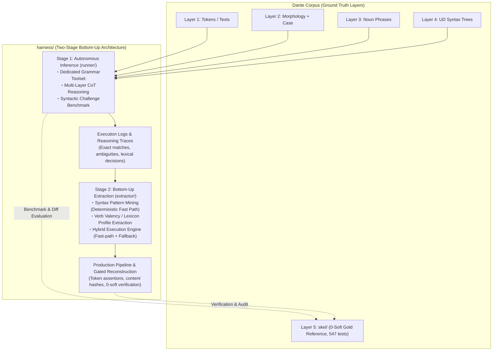

# Grammar Agent Harness: Overall Architecture & Master Plan

## Handoff — resume here

Working notes for the next session only — write what's in flight or about
to start, and clear an entry once it's been acted on (folded into Current
Status, §2, a stage document, or Orientation for Fresh Sessions). Durable
state that should survive indefinitely does not belong here: it belongs in
**Current Status**, **Orientation for Fresh Sessions**, the **Milestone
Ledger**, or §2's per-stage records.

**Nothing is running.** The corpus sits at **0 hard / 4,624 soft** with `make
check` exiting 0, the suite at **987 passed**, and soft level 1 closed at **0
findings**. No fix run is in flight and none is scheduled.

**Stage 7 closed 2026-09-03** on S7.2's live confirmation — both items (S7.1
knowledge-as-files, S7.2 the `reconstruct.py` split) done, committed and
live-confirmed on the operator's inferno-1 re-run. Its whole record, the close,
and the state at close live in [`stages/07.md`](stages/07.md); §2 below carries
the one-paragraph summary.

**Stage 8 is open** ([`stages/08.md`](stages/08.md), 2026-09-03) **and its scope
is soft `--fix` level 2 — design and implementation** (operator's decision, the
same day). It is the item Stage 6 carried forward: level 1 closed at 0 findings
on S6.11, level 2 was left a design question before it is a run. **The concrete
content is the next session's work** — which class or classes level 2 selects,
and how — and is deliberately undecided here.

**Start that session from [`stages/08.md`](stages/08.md) §1**, which states what
level 2 must satisfy before it runs, not from a blank page: the `--fix`
mechanism already exists (S6.2), so what is needed is a class definition and a
selection rule expressible in `extractor/fixlevel.py`; every candidate class
must be argued to one of S6.1's three outcomes from `validate.py` / `derive.py`
**with gold unopened** (candidates and eligibility in
[`stages/06.md`](stages/06.md) §3); and level 1's lesson is to check the
gate/contract alignment *first* — S6.10, not five runs in. §2 there carries the
two items that bear on this scope: the **transcription-drift check** (already
measured — do not re-run the sweeps; its third option is now directly a Stage 8
question) and the standing **`skel/repairs.py` authority question**, which a
level-2 class may force.

**Session closed 2026-09-03; the working tree is clean and nothing is in
flight.** What that session did, in order, so the next one need not reconstruct
it from the log: read out the operator's live inferno-1 re-run and folded it into
S7.2 as the live confirmation that record said was outstanding (`31cb3c7`);
**closed Stage 7** and moved its record out of this file into
[`stages/07.md`](stages/07.md) (`e180024`); **moved the seven stage documents
into `stages/<NN>.md`** with all 192 references rewritten — the layout decision
and its citation rule are in the Milestone Ledger note below, and are the one
thing worth knowing before writing a new stage document (`cf24c20`); then
**opened Stage 8** and set it to level 2 on the operator's decision. The corpus
numbers did not move after the re-run: 0 hard / 4,624 soft, suite 987.

## Current Status

Stages 1–7 are COMPLETE/CLOSED; their status, dates, and record pointers
live in §2's per-stage subsections below, not repeated here. This section
holds only what's still open.

- [ ] **Stage 8 — Soft Level 2** (OPENED 2026-09-03 by operator, after Stage 7's
      close rather than as part of it: the stage documents were about to move
      into `stages/`, so the file was held back rather than created and renamed
      the same day; scope set the same day). Scope: **designing and implementing
      soft `--fix` level 2**, the item Stage 6 carried forward rather than
      closed. **No records yet** — the concrete design is the next session's
      work. [`stages/08.md`](stages/08.md) §1 states what it must satisfy first
      (S6.2's mechanism, S6.1's three-outcome burden with gold unopened,
      [`stages/06.md`](stages/06.md) §3's candidates, and S6.10's lesson about
      checking gate/contract alignment early); §2 carries the two items that
      bear on it — the measured transcription-drift check and the standing
      `skel/repairs.py` authority question. State at open: 0 hard / 4,624 soft,
      suite 987, live path confirmed.
- [x] **Stage 7 — Refactoring** (OPENED 2026-09-02 by operator on Stage 6's
      close, scope re-decided the same day from "level 2" to refactoring and
      narrowed the same day to two items; **CLOSED 2026-09-03** on S7.2's live
      confirmation). It paid down two weights six stages of live-run work left
      behind — the agent's knowledge hidden in Python string literals (S7.1) and
      `extractor/reconstruct.py`'s 1,934 lines (S7.2) — under a standing rule of
      neutrality: behaviour-neutral, and byte-exact wherever the output is
      prompt text. State at close: suite 987, corpus 0 hard / 4,624 soft, the
      live path re-confirmed end-to-end. Both records, the close, the carried
      items and the Warp-pattern argument live in [`stages/07.md`](stages/07.md); §2
      below summarizes. Unlike earlier closes it opened no successor document.
- Test suite: **987 passed** (876 + 11 from S5.1 + 8 from S5.2 + 21 from
  S5.3 + 9 from S5.5 + 9 from S5.7 + 4 from S5.8 + 17 from S6.2 + 2 around
  the llm7shi 0.15.0 status-bar rework + 3 from S6.4 + 9 from S6.6 + 2 from
  S6.8 + 4 from S6.10 + 12 from S7.1; S6.3, S6.5, S6.7, S6.9 and S6.11 added
  none, being corpus runs).
  Composition and history (TokenBucket removal,
  mid-canto kill resilience, the readout tool's own tests) in
  [`stages/04.md`](stages/04.md)'s pre-launch note and record S4.3.

---

## Orientation for Fresh Sessions

Durable context for picking up mining/extraction work cold — not tied to
any one session, so it survives across Handoff clearings.

1. **Read first**: [`extractor/PLAN.md`](extractor/PLAN.md) (§3–§5), then
   [`../ARCHITECTURE.md`](../ARCHITECTURE.md) §4–§6 (observability + log
   contract; `reconstruct.py` already ships it incl. resume).
   The Stage-1→2 interface stays the trace contract:
   `UnitResult.trace_record()` (`runner/agent.py`) embedded as `"trace"` in
   every benchmark case record. The hybrid seam is callable-level:
   `HybridEngine.run_unit(..., fallback=agent_fallback(model=...))`;
   `reconstruct.main(..., fallback=...)` accepts an injected callable for
   deterministic work.
2. **Mining inputs — four complete 87-case JSONL run logs on disk** (all
   gitignored, disk-only; regenerate rather than re-mine if lost):
   M1.4 originals (`harness/bench-unit.log`, `harness/bench-predicate.log`)
   plus the instrumented re-runs (`harness/bench-unit-retry.log`,
   `harness/bench-predicate-retry.log`; finished 2026-08-24). The engine's
   `mine_artifacts()` regenerates rule table + lexicon from them in seconds;
   no mined artifact needs to be frozen on disk.
3. **Error structure to mine around** (details in
   [`stages/01.md`](stages/01.md), M1.4 entries):
   systematic gold-convention divergence on verbless frames dominates
   `historical` misses; bare-`obl` over-assignment (74 fps) and `xcomp`
   over-generation are the top noise sources; `obl:di` / `obl:in` recall
   0.54–0.60 fed lexicon_builder directly (140 frames at 100% consistency
   mined, incl. fare+di / avere+di / sedere+in — see [`stages/02.md`](stages/02.md),
   M2.2 Ledger entry).
   The 31 well-formed unit-side `upstream_feedback` records await HUMAN
   triage — never auto-retag.
4. **Boundaries that hold**: `extractor/` consumes traces + operator-side
   gold (`skel.io`) like `benchmark.py` does; agent-side masking (§4 item 1
   of Standing Invariants below) applies to anything that runs *as* an
   agent — the engine's execution face and `reconstruct.py`'s
   execution/commit faces never open gold at all (adversarially tested),
   only evaluation faces (`evaluate_fast_path`, `--verify-gold`) do;
   `fixtures/challenge_cases.py` stays data-only. Tests live at repo root
   (`tests/test_harness_*.py`). `skel/` is protected: reconstruction writes
   need the explicit `--write` flag on top of passing all three gates,
   canto-atomically.
5. **Wire/cost instrumentation** (shipped across Stages 2–3, live-proven on
   every run): the fallback appends one `llm_request`/`llm_response` JSONL
   pair per backend LLM call — timestamps, model, session/unit coordinates,
   attempt, context/new/output/thought byte sizes, provider token counts
   (`input/output/thought/total_tokens`), duration, `paced_seconds`,
   `max_length_retries`; join key `(session, messages, attempt)`;
   429/quality retries inside `Client` stay transparent to the wire records,
   counted by the `wait_retry` counters. Every `canto_complete` carries
   `elapsed_seconds`, summed into the summary's `wall_clock_seconds`. All
   canto-scoped like every other record. Since S5.5 the log is **append-only
   and never read back** — resume state is the canto's TSV, and `unit`
   records (`row_keys`, `adopted_invalid`, gate verdicts) are read afterwards
   for analysis, not replayed.

---

## Milestone Ledger

*Documentation convention (from Stage 5 on, decided 2026-08-29 as PLAN.md
grew too large): each stage now writes design work, running detail, and
its milestone ledger directly into its own `stages/<NN>.md` from the moment
it opens, rather than accumulating in PLAN.md and splitting off at close
(the pattern Stages 1–4 used, kept below for their archived records).
PLAN.md stays the overall plan — Handoff and Current Status are kept
current every session; per-stage detail is not duplicated here.*

*File layout (2026-09-03, when the stage count was about to reach two
digits): the per-stage documents live in `harness/stages/` as zero-padded
`<NN>.md` — the directory keeps the growing archive out of `harness/`'s
top level, and the padding keeps `01.md` … `10.md` in reading order. The
record IDs stay unpadded (`S7.2`, and `S10.1` when it comes): they are cited
in prose over a hundred times and the padding buys them nothing. Because
`07.md` is not a distinctive string to grep for, **cite a stage document with
its directory** — `stages/07.md` from `harness/`, `../stages/07.md` from a
subpackage — even where the link target itself is shorter.*

*Stage-1 records (toolcall T1–T5, milestones 1.1–1.4 + carry-over
resolutions) live in [`stages/01.md`](stages/01.md) and [`TOOLCALL.md`](TOOLCALL.md)
§8; the completed Stage-2 record — milestones 2.1–2.5 incl. the inferno-1
pilot and the closing recheck readout — was split off on 2026-08-24 to
[`stages/02.md`](stages/02.md). All Stage-3 records S3.1–S3.11 live in
[`stages/03.md`](stages/03.md)'s ledger (S3.1 moved there verbatim at stage close,
2026-08-25; stage closed on S3.11); all Stage-4 records S4.1–S4.3 live in
[`stages/04.md`](stages/04.md)'s ledger (stage closed 2026-08-29 on S4.3); all
Stage-5 records S5.1–S5.8 live in [`stages/05.md`](stages/05.md)'s ledger, written
there from the start (stage closed 2026-08-30 on S5.8); Stage-6 records
S6.1–S6.11 the same way in [`stages/06.md`](stages/06.md) (stage closed 2026-09-02 on
S6.11); Stage-7 records S7.1–S7.2 the same way in [`stages/07.md`](stages/07.md)
(stage closed 2026-09-03 on S7.2); Stage-8 records will accrue the same way in
[`stages/08.md`](stages/08.md), which is open but empty. Every close through
Stage 6 was made by opening the next stage's document; Stage 7's was not — the
rename into `stages/` was pending, so `stages/08.md` was opened separately once
it had landed, with its scope arriving in the same session.*

---

## 1. Overview & Paradigm Shift: Generalizable Layer 5 Reconstruction

`harness/` is a dedicated **Grammar Agent Harness for Local LLMs** (e.g., **Gemma 4 31B**), designed to systematically reconstruct Layer 5 predicate-argument skeletons (`skel/`) from multi-layer grammatical contexts (Layer 1 text/tokens, quotes hierarchy, Layer 2 morphology, pronoun case annex, Layer 3 noun phrase spans, and Layer 4 Universal Dependencies syntax trees).

### Motivation & Rationale
1. **Historical Context & Limitations of `skel/`**:
   - Layer 5 (`skel/`) was historically produced by a **small local LLM**
     (`ollama:gemma4:31b-it-qat`, pinned in `model.mk`) driving the driver's
     `--fix` regeneration loop; its residual errors were then triaged through an
     interactive, semi-manual process in which a frontier LLM (Claude Opus 5,
     later switched to Gemini 3.7 Flash at the end of Phase 8) and human
     operators read the outlier positions to formulate 130 deterministic rules
     (Rules A–EI) and hand-apply the corrections recorded in
     [`CORRECTIONS.md`](../skel/CORRECTIONS.md).
   - Throughout, the small model was granted **no autonomy**: it ran on rails
     laid down by the larger model — executing repairs inside a checker/rule
     system it did not shape, with everything beyond those rails escalated to
     the frontier-LLM/human triage loop.
   - Although this successfully produced a 100% clean corpus (**0 hard / 0 soft violations across all 100 cantos**, 547 pytest passing), the **construction methodology itself was ad hoc, bespoke to Dante's Italian, and insufficiently automated**.
   - As a result, the Phase 5–8 methodology cannot be directly generalized to other texts, genres, or languages (such as Latin).
2. **Mission of `harness/`**:
   - The gist of `harness/` is to grant the local model that missing **autonomy**: remove the hand-laid rails and let it reason from linguistic first principles, deciding its own path through multi-layer context and closed tools instead of executing rules handed down by a larger model.
   - `harness/` embeds this autonomous agent in a **reproducible, fully automated, and generalizable reconstruction pipeline**.
   - Preserving `skel/` as an **immutable Gold Standard (Ground Truth)** for benchmark evaluation, `harness/` demonstrates how local LLMs can autonomously project Layer 4 UD syntax onto predicate-argument frames (Stage 1) and empirically induce syntax rules and valency lexicons (Stage 2).

---

## 2. Staged Strategy: Bottom-Up Core + Scale-Out

In contrast to the top-down methodology used in Phases 5–8 — where frontier LLMs deduced abstract rules that the local executor then followed mechanically, without autonomy of its own — `harness/` hands agency to the local model and adopts an empirical **bottom-up strategy (instance-level inference ➔ pattern induction)** across Stages 1–2, with Stage 3 as context optimization + launch hardening (closed 2026-08-25), Stage 4 as the operational scale-out (closed 2026-08-29), Stage 5 as the corpus-durability track that also took the corpus hard-clean (closed 2026-08-30), Stage 6 as the soft divergence reduction that took level 1 to zero (closed 2026-09-02), and Stage 7 as the refactoring stage that paid down what six stages of live-run work had left behind (closed 2026-09-03), and Stage 8 opening the same day, scoped to soft `--fix` level 2.

### Stage 1: Autonomous Local Inference & Capability Benchmark (`harness/runner/`)
- **Approach**: For each parse unit, the agent receives the multi-layer context (L1–L4, quotes, case) and autonomously solves predicate-argument frames on the fly using Chain-of-Thought (CoT) and a dedicated Tool Calling API (`validate_candidate`, etc.).
- **Objectives**:
  - Quantitatively benchmark local LLM capabilities (1-shot exact match rate, multi-turn self-correction convergence rate, role-level F1) against the 0-soft Gold Standard (`skel/`).
  - Capture comprehensive execution logs, successful syntax projections, and lexical decision traces (e.g., argument vs. adjunct discrimination, reflexive pronouns, control verbs).
- **Specification**: [`harness/runner/PLAN.md`](runner/PLAN.md).
- **Status**: COMPLETE (2026-08-24); record archived in [`stages/01.md`](stages/01.md)
  — XML wire protocol adopted (probe 0.957 ≥ 0.95, parity interop 24/24
  twice), 87-case benchmarks at quality parity for both workflows (micro F1
  0.711 unit vs 0.708 predicate), traces pooled for Stage 2 mining. Protocol
  ledger in [`TOOLCALL.md`](TOOLCALL.md) §8.

### Stage 2: Bottom-Up Rule & Lexicon Extraction (`harness/extractor/`)
- **Approach**: Mine and aggregate the reasoning logs and decision trajectories from Stage 1 to:
  1. Extract stable, deterministic Universal Dependencies patterns as **Syntax Fast-Path Rules**.
  2. Aggregate verb-preposition-case co-occurrences into an empirical **Verb Valency Lexicon**.
  3. Construct a **Hybrid Execution Engine** combining deterministic fast paths (rules + lexicon) with fallback to Stage 1 agent inference for ambiguous or rare contexts.
- **Objectives**:
  - Maximize cross-corpus consistency and reduce inference latency and token overhead (targeting >80% fast-path coverage).
  - Provide a gated production pipeline that reconstructs cantos under strict 0-soft regression verification and content hash updating.
- **Specification**: [`harness/extractor/PLAN.md`](extractor/PLAN.md).
- **Status**: COMPLETE (2026-08-24); record archived in
  [`stages/02.md`](stages/02.md) — the >80% fast-path target measured MISS at
  7.0%, so agent fallback remains the primary path and the gated pipeline's
  honest output is protection.

### Stage 3: Context Optimization (opened 2026-08-24, CLOSED 2026-08-25)

Closed on record S3.11 with the full-corpus expansion re-scoped out into
Stage 4. The arc: the S3.1 correlation analysis (two accounting points
corrected by S3.2 — [`stages/03.md`](stages/03.md) §1), **the compaction/pacing
design + deterministic gate re-check (record S3.2)**, and **the
implementation (record S3.3)** — spec, gate verdicts, implementation map,
measured deviations, and the stage ledger live in [`stages/03.md`](stages/03.md).
**Record S3.7 cut transcript compaction from the design**: measured against
run #1's own records it bought 0.5% of the wire and cost the model its own
session history; the byte reduction moved into the system prompt itself
(tool specs rendered flat: 10,706 → 8,954 B on every call, no wording
changed). Live levers at close: R1 payload serving + prompt size + pacing.
**Record S3.9 read out confirmation re-run #2: every criterion passed, ×3
average 87% unpaced — first pass of that gate**; **S3.10 added the
generation-side runaway cap (6,000 chars default)**; **S3.11 read out the
cap experiment — every criterion PASS — and closed the stage.**

### Stage 4: Full-Corpus Verification (opened 2026-08-25, CLOSED 2026-08-29)

The 99-canto scale-out as its own stage: three canticle-parallel streams
(inferno / purgatorio / paradiso) driven by `harness/recon/Makefile`,
behind every Stage-3 gate, gold immutable, launch configuration carried
from S3.9/S3.11 (interval default 0 + cap 6000, reactive-only — the shared
`TokenBucket` was removed 2026-08-26). Closed on record S4.3: corpus-wide
readout (`harness/recon/readout.py`) gave verify-gold micro F1 inferno
0.7269 / purgatorio 0.7186 / paradiso 0.7201 / corpus-wide 0.7219, with
inferno falling just under the 0.744–0.796 confirmation-run band — operator
decision was to accept and close, scope held to the full-corpus run itself.
Commands, watch items, full readout criteria/results, and the stage ledger
(S4.1–S4.3) live in [`stages/04.md`](stages/04.md).

### Stage 5: Corpus Durability (opened 2026-08-29, CLOSED 2026-08-30)

The Stage-4 corpus run's 100 per-canto logs (`harness/recon/<canticle>/
NN.log`) are gitignored, disk-only, and will eventually be lost. Opening
scope: a script converting their settled reconstruction output into
`skel/`-compatible, committable form, plus a separate format for whatever
doesn't map into that shape, so nothing is silently dropped. Record S5.1
ships the first as `<canticle>/NN.tsv` written beside each log, in gold's
byte-exact TSV format (so a plain `diff` against `skel/` is the run's
divergence readout); deterministic, LLM-free and idempotent, so it is a
repeatable step after any future corpus run rather than a one-time
migration. `recon/Makefile`'s per-canto goal moved from the log to the TSV
with it (reconstruct → convert in one target — since S5.5 reconstruct writes
the TSV itself and the conversion step is gone), and since 2026-08-30 the TSV
alone decides what runs: a settled unit is never re-run, so a fresh checkout
never re-runs the corpus for output it already has, and the log is a
by-product with no role in any goal or gate. The second deliverable was cut on operator
review: the logs' remaining content is run telemetry, not corpus content,
and stays out of the repository — accepted as ephemeral. The stage's scope
then extended to **divergence reduction** on S5.2's 897-hard/5,267-soft
readout: S5.3's two deterministic rules brought that to 70 hard / 4,988
soft. The method that record settled matters more than the number — the
violation count is gameable by deletion, and gold is the benchmark rather
than the target, so a rule's authority comes from the layer's own schema and
derivation contract, with `make agree`'s gold score read only afterwards.
Record S5.5 then relocated the work itself: the corpus's 897 hard violations
are *exactly* the three schema checks the agent-side gate
(`validate_candidate`) was missing, so those checks moved into the model's
own session — it corrects its analysis with the unit in front of it, instead
of a downstream rule deciding on its behalf — and the gold-format TSV became
the run's artifact and its resume state, written unit by unit, with deleting
a stretch's lines as the fix gesture. Records S5.6–S5.7 measured that
mechanism on the operator's live re-runs — inferno 1 first, then the 52
cantos that actually hold clausal violations. It works and is cheap: every
unit settled on a submission its own gate accepted, and 67 of the 67 clausal
violations the gate could see were cleared in-session. The 3 that survived
were fast-path units that never open a session, so S5.7 gave the router the
same schema check (`require_schema_valid`) and the corpus reached **0 hard**.
Gold agreement stayed flat throughout (0.7307 → 0.7309), which is the stage's
real finding: hard-clean and gold-close are different targets, and the
remaining distance lives entirely in the 5,014 soft findings. Record S5.8 then
settled the artifact story the stage opened with: the per-canto log is a pure
by-product with no role in any goal or gate, `convert` lost its target, and
the 100 logs were swept — the ephemerality §2 decided on, finally carried out.
**The stage closed there** (2026-08-30, S5.8): its durability deliverable
shipped and the corpus is hard-clean, so the operator re-scoped the soft
residue — the part of §4's divergence-reduction extension that remains — out
into Stage 6 rather than letting this stage's document keep growing. Design
decisions, the conversion contract, and the stage ledger (S5.1–S5.8) live in
[`stages/05.md`](stages/05.md) — the first stage to write directly into its own
document as work happens, rather than accruing here first.

### Stage 6: Soft Divergence Reduction (opened 2026-08-30, CLOSED 2026-09-02)

What Stage 5 leaves: **0 hard, 5,014 soft** across the 100 committed recon
TSVs. The stage's default mode is deterministic work over the artifacts, and
record S6.2 added the one sanctioned exception: a `--fix <level>` run reopens
just the units carrying that level's findings and repairs them **in session**,
seeing the invariant and the frozen-layer evidence for a position but never the
derivation's answer (the scoped reversal of S5.5's rule). The nominal target is the bar gold meets, 0 soft; record S6.1
is why that target may not be pursued naively, and it is the stage's opening
premise rather than a later discovery. Auditing the classification first — as
S5.4 did for hard, with [`SOFT.md`](SOFT.md) as the evidence record — found the
findings sound but the counter's zero point **tolerance-mediated**: gold clears
this bar only because 88 of the 130 registry rules excuse the 3,250 positions
where gold itself diverges from `derive_unit`, and those tolerances were fitted
by measuring that diff. So the soft count is a conformance measure against
derivation-plus-registry rather than a quality one, and it is not even a
distance — it double-counts relocated arguments and *rises* when a missing
predicate is registered. The burden that puts on every rule: resolve the class
first to one of three outcomes — the artifact is wrong, the derivation is
silent (a *tolerance* is missing, the mistake Phase 5 kept making), or the two
notations are equivalent — and edit only on the first. Scope, the standing
method, class eligibility, the open authority question and the ledger live in
[`stages/06.md`](stages/06.md).

**Standing operational facts carried from the level-1 runs, for whichever
level runs next:**

- **A `--fix` run cannot leave the corpus worse than it found it.** Only the
  level's own findings are selectable, and a unit whose answer fails the
  acceptance test keeps its recorded rows — confirmed on repeat passes (S6.5,
  S6.9) with no canto and no unit ending worse than it started.
- **Sweep the per-canto logs before each corpus-wide fix run**, deliberately,
  so the run's telemetry is unambiguous (S6.7's logs mixed two runs and had to
  be reconstructed from timestamps; S6.9 and S6.11 swept first and needed no
  such reconstruction). Dedupe `unit` records by `(canticle, canto,
  line_start, line_end)` across the whole log file, keeping the last — the
  rule that survives both a clean single-segment log and a relaunched one
  with duplicate spans — and key the dedup by the log's *path*, not its
  basename (`01.log` exists in all three canticles).
- **The tool-result console echo is on by default** (400 payload chars,
  `reconstruct.py --tool-result-chars`, 0 = off); `recon/Makefile`'s `%.tsv`
  recipe does not pass the flag, so changing it for corpus runs means editing
  the recipe.
- **`make check` exits 0** — the corpus has been hard-clean since S5.7, so a
  non-zero `make check` from here on is a regression signal, not an expected
  state (through S5.6 the checker's contract kept it red by design).
- The **S5.3-era standing discipline for any rule** (gold-benchmark-not-target,
  schema/derivation authority, `make agree` as readout-only, read positions
  before aggregates) is unchanged and lives in [`stages/05.md`](stages/05.md) §5 and
  §4 below — not repeated here.

### Stage 7: Refactoring (opened 2026-09-02, CLOSED 2026-09-03)

Six stages of live-run work left the harness working but top-heavy, and the
operator re-scoped Stage 7 from soft level 2 to paying that down. The standing
rule for the whole stage was neutrality — **every step argued behaviour-neutral,
and where the output is prompt text, proven byte-exact** — because Standing
Invariant §6 makes session semantics a run-scoped constant and a refactor that
quietly reworded a prompt would break it while looking like tidying. **S7.1**
moved the agent's domain knowledge out of Python string literals into
`runner/skills/grammar-agent/` behind the task-agnostic loader
`harness/skills.py`, byte-exact across all eight assembled outputs, and put
`skill_digest` in every `canto_complete` so a run's wording can be checked
afterwards rather than assumed. **S7.2** split `extractor/reconstruct.py`'s
1,934 lines into seven modules along the seams already in it; the point beyond
tidying is `goldeval.py` — the execution and commit faces import nothing from
the module that opens gold, so Standing Invariant §4 item 1's boundary is now a
file boundary. Neutrality came from readouts, not a code read: 987 tests
unchanged, corpus unmoved, `--help` byte-identical, and then the operator's live
inferno-1 re-run confirming the path no test reaches — which is what **closed
the stage** (2026-09-03), at 0 hard / 4,624 soft.

Also settled here: the improver half of Warp's self-improving-agent pattern is
**refused for now** — gold cannot be its tuning signal without voiding every
gold-referenced number the project reports (Standing Invariant §1), and a
frontier model rewriting the local model's prompt sits close to the Phase 5–8
rails §1 says `harness/` exists to replace; what the stage took instead were the
pattern's two prerequisites. Both records, that argument, the state at close and
the three items carried forward (the transcription-drift sweeps, soft level 2,
the `repairs.py` authority question) live in [`stages/07.md`](stages/07.md).

### Stage 8: Soft Level 2 (opened 2026-09-03)

Opened after Stage 7's close rather than as part of it — the one break in the
convention that a close is performed by opening the successor's document, and a
deliberate one: the stage files were about to move into `stages/`, so the file
was held back rather than created and immediately renamed.

Scope, set by the operator the same day: **the design and implementation of soft
`--fix` level 2** — what Stage 6 carried forward when level 1 reached 0 findings
on S6.11. The concrete content is the next session's work and is deliberately
undecided; what [`stages/08.md`](stages/08.md) fixes now is the ground it starts
from. The mechanism is not the deliverable — S6.2's graded `--fix` run already
reopens a level's units in session, showing the invariant and the frozen-layer
evidence but never the derivation's answer — so what level 2 owes is a class
definition and a selection rule, argued to one of S6.1's three outcomes (the
artifact is wrong / a tolerance is missing / the notations are equivalent) from
`validate.py` and `derive.py` **with gold unopened**, since the soft counter
measures conformance rather than quality. Candidates and eligibility are in
[`stages/06.md`](stages/06.md) §3. Level 1's arc is the precedent worth reading
first: five corpus-wide runs moved it 377 → 12, and what closed it was S6.10
finding the agent's gate narrower than the contract it transcribed — an
alignment check level 2 should make before its runs, not after them. The two
items carried in with it (the already-measured transcription-drift check, whose
third option is now a Stage 8 question, and the standing `skel/repairs.py`
authority question) are in that document's §2.

### Beyond Layer 5 (design notes)

Directions that open up **after** the `skel/` reconstruction — a layer swap
(same machinery, different target layer), a vertical whole-stack slice, and the
horizon of reconstructing grammar for a language with no available description
— are kept out of this plan in [`FUTURE.md`](FUTURE.md). None of it is
scheduled work; `PLAN.md` remains the source of truth for status and
milestones.

### Transport & backend policy

Decision record (2026-08-22): measured at roughly 3× the local speed, **XML
(`PromptXmlTransport`) was adopted as the official wire format for Stage 1/2
production runs; native Ollama tool calling (`OllamaNativeTransport`) stays
implemented and gated for comparison experiments** (re-run
`harness.toolcall.parity` when revisiting local-only deployments). Backend
choice remains free: `google:gemma-4-31b-it` when wall clock matters,
`ollama:gemma4:31b-it-qat` for offline/cost-constrained work — both validated
end-to-end over the XML protocol during the T4/T5 gates.

Adapter policy (2026-08-24): the stateful `llm7shi.Client` adapter is the
common model-access specification; the stateless probe/parity adapters and the
skel drivers' disposable-Client pattern are legacy from the trial-and-error
phase. The standing rules live in [`../ARCHITECTURE.md`](../ARCHITECTURE.md)
(§2 Model access, §3 Wire protocol).

---

## 3. Separation of Concerns

The directory map lives in [`README.md`](README.md#directory-structure) —
single source, not duplicated here. The boundaries it encodes:

- **`skel/` is protected, not a dependency.** Gold TSVs, the 130-rule registry,
  and [`CORRECTIONS.md`](../skel/CORRECTIONS.md) are the evaluation reference
  and are masked from agents structurally (§4 item 1); only operator-side
  benchmark code reads them.
- **`toolcall/` is a layer- and task-agnostic protocol library.** It knows
  nothing about grammar: wire format, transports, and the multi-turn loop only.
  Everything grammatical lives in `runner/`.
- **`runner/` (Stage 1) produces traces; `extractor/` (Stage 2) consumes
  them.** The contract between the stages is `UnitResult.trace_record()`, not
  shared internals.
- **`fixtures/` is data, read operator-side only.** Nothing under `runner/`
  imports it, so the agent path cannot see the benchmark's case selection.
- **Tests live at the repo root** (`tests/test_harness_*.py`) alongside the
  corpus suite, so the harness stays inside one pytest run.

---

## Environment & Artifacts (reference)

- **Python always runs through `uv`** (`uv run python ...`, `uv run pytest ...`);
  never invoke a bare `python3`. Every command below follows this.
- **Session division of labor**: assistant sessions execute deterministic,
  LLM-free work only (tests, extraction/mining, artifact inspection); every
  LLM-in-the-loop command (the probe / parity / benchmark / agent /
  reconstruction CLIs) is run by the human operator, not by the assistant.
- Live probe: `uv run python -m harness.toolcall.probe --model <model> --repeat N --log
  harness/probe.log` — streaming JSONL: one scenario record per completed scenario,
  summary record last (a log without the summary line = interrupted run);
  `*.log` is gitignored.
- Migration parity check (T5, live run PASSED 2026-08-22): `uv run python -m
  harness.toolcall.parity
  --model <model> [--repeat N] [--log harness/parity.log]` — same log semantics;
  hard gate = canonical interop on both transports.
- Single-unit session CLI (live smoke tests): `uv run python -m harness.runner.agent
  --canticle inferno --canto 1 --line-start 1 [--line-end N] [--trace trace.jsonl]`.
- Benchmark CLI (milestone 1.3): `uv run python -m harness.runner.benchmark [--category
  C]... [--case-id ID]... [--limit N] [--list] [--log bench.log] [--full-transcript]`.
  An existing `--log` resumes: completed cases reload into the aggregate and are
  skipped; the summary sums per-session durations across all attempts.

---

## 4. Standing Invariants & Disciplines

1. **Strict Masking of Gold Layer 5**:
   - `runner/` agents are strictly forbidden access to gold `skel/*.tsv`, the 130-rule registry, and historical correction records ([`CORRECTIONS.md`](../skel/CORRECTIONS.md)).
   - **Gold is the benchmark, never the target — and that binds operator-side
     work too** (added 2026-08-29 on the operator's correction during S5.3;
     rationale in [`stages/05.md`](stages/05.md) §5). Structural masking keeps gold
     out of the *agent's* inputs; this keeps it out of the *pipeline's
     construction* at every level. No deterministic rule, repair, threshold,
     or heuristic anywhere in `harness/` may be chosen by reading gold and
     matching it — that is teaching to the test: it voids every
     gold-referenced number the project reports (Stage 1's micro F1, S4.3's
     verify-gold readout, `recon/agree.py`) and reinstates the top-down
     rails methodology §1 says `harness/` exists to replace. Rules derive
     from the layer's own published contract instead —
     `dante_corpus/skel/validate.py`'s schema invariants and `derive.py`'s
     L1–L4 derivation. Gold-referenced scores are **readouts taken
     afterwards**, never acceptance criteria.
2. **No Free-Form Bash Execution**:
   - Agents operate strictly via closed, structured Tool Calling (`tools.py`) without shell execution privileges.
3. **Preservation of the 0-Soft Regression Gate**:
   - Benchmark and evaluation modes operate strictly in-memory or write to scratch buffers; gold TSVs in `skel/` are never overwritten during benchmark runs.
4. **Upstream Discrepancy Channel**:
   - Discrepancies identified in upstream layers (Layer 2 morphology or Layer 4 UD syntax) are emitted as structured `upstream_feedback` records for human audit and triage.
5. **Live-Run Observability & Log Durability**:
   - LLM-in-the-loop runs are inherently slow (minutes per turn on local
     models, hours per benchmark), and an unwatchable run is an unusable run:
     every operator-facing CLI must keep progress **visible by default**, not
     silent-until-finished.
    - The standing specification — stderr streaming, session separators and the
      optional `HarnessStatusLine` status bar, per-turn timings rolled into
      summaries (`turn_seconds`, `slow_turns`, `api_retries`), turn-granularity
      discipline, log durability independent of shell redirection, and the
      streaming JSONL log contract with its summary-last completion marker and
      resume semantics — lives in [`../ARCHITECTURE.md`](../ARCHITECTURE.md)
      (§4 Live-run observability, §5 Streaming JSONL log contract, §6 Reporting
      shape). It is a standing requirement, not a one-off patch: new live entry
      points (Stage 2's `extractor/` CLIs included) must ship it from day one,
      keep the human-facing progress display on stderr by convention — the
      status bar's shared console excepted, since it carries streamed model
      output too — (JSONL logs go to their own `--log` files, never to
      redirected console output), and any future transport must preserve it.
    - The concrete wiring — status-bar labeling (Canticle Canto Line), the
      shared console the model-access layer streams into (markup parsing off,
      llm7shi's own default since 0.15.0), the run clock threaded in as
      `progress(started_at=...)`, `wait_retry` snapshot/delta accounting, and
      the new-`Client` blank-line spacing — is the ARCHITECTURE.md §4 standard
      itself now, not a pattern restated per plan; `reconstruct.py`
      (2026-08-24) is where it first shipped end-to-end and stays the template
      to copy.
6. **Session Semantics Stability**:
   - Session semantics (prompt wording, tool schema, protocol behavior) may
     change *between* runs but never *mid-run*: a live run's semantics stay
     fixed for its whole duration once launched. Established during Stage 3's
     launch hardening, standing for every later stage.
