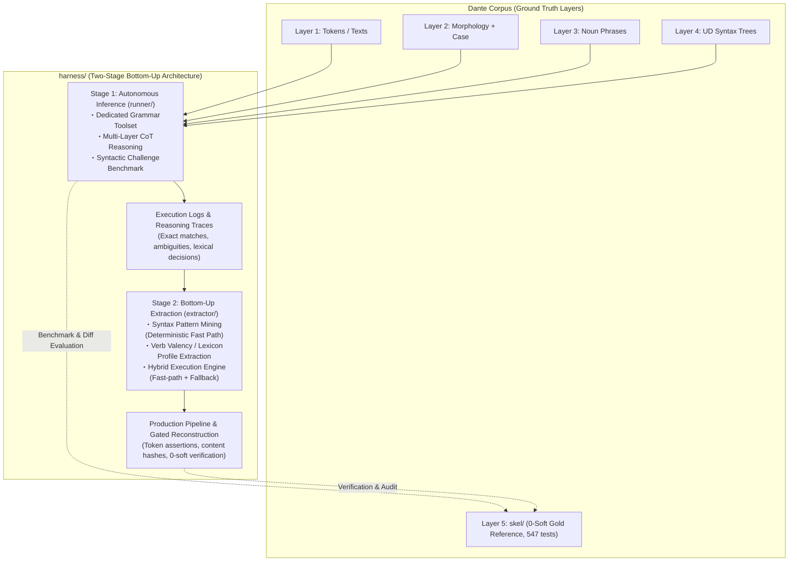

# Grammar Agent Harness: Overall Architecture & Master Plan

## Handoff — resume here

Temporary notes for the next session; durable state lives in **Current Status**
and the **Milestone Ledger** below.

**Next action — Stage 2, milestone 2.5** (full-corpus gold verification,
milestone 2.5 in [`extractor/PLAN.md`](extractor/PLAN.md) §5), **pilot first,
then expand**; both steps OPERATOR-RUN (live agent fallback, hours long):

1. **Pilot — inferno 1 only** (34 units / 136 lines; ~2 h at the M1.4 unit-run
   rate of ~215 s/unit):

   ```bash
   uv run python -m harness.extractor.reconstruct \
       --canticle inferno --canto 1 --verify-gold \
       --model google:gemma-4-31b-it \
       --log harness/recon-pilot-inf1.log
   ```

   Deliberately NO `--write`: this run only reports gate outcomes and the gold
   comparison. What to watch: (a) gate pass rate across fast- vs agent-routed
   units, (b) `--verify-gold` P/R/F1 vs the benchmark's micro F1 ≈ 0.70–0.71
   (the pipeline must reproduce the Stage-1 numbers it inherits), (c) api-retry
   backoffs over a long single-canto session stream — now measured directly:
   `api_retries` / `api_retry_seconds` ride every `canto_complete` record and
   roll into the summary.

2. **Expand to the remaining 99 cantos** once the pilot is sane:
   `uv run python -m harness.extractor.reconstruct --all --verify-gold ...`
   with the same log semantics — the JSONL log resumes at canto granularity,
   so completed cantos are never re-run.

The milestone's "assert 100% equivalence with `skel/`" target needs re-stating
against measured reality first: the fast path alone reproduces ~33% of gold
rows and agent sessions score F1 ≈ 0.71, so equivalence cannot hold today.
The honest form is: reconstruct corpus-wide, record exact-match/P-R-F1 per
canto via `--verify-gold`, confirm the gates keep every failing canto
unwritten (`written_cantos == 0`), and state what engine quality 100%
equivalence would require.

1. **Read first**: [`extractor/PLAN.md`](extractor/PLAN.md) (§3–§5), then
   [`../ARCHITECTURE.md`](../ARCHITECTURE.md) §4–§6 (observability + log
   contract; `reconstruct.py` already ships it incl. resume).
   The Stage-1→2 interface stays the trace contract:
   `UnitResult.trace_record()` (`runner/agent.py`) embedded as `"trace"` in
   every benchmark case record. The hybrid seam is callable-level:
   `HybridEngine.run_unit(..., fallback=agent_fallback(model=...))`;
   `reconstruct.main(..., fallback=...)` accepts an injected callable for
   deterministic work.
2. **Mining inputs — four complete 87-case JSONL run logs on disk** (all
   gitignored, disk-only; regenerate rather than re-mine if lost):
   M1.4 originals (`harness/bench-unit.log`, `harness/bench-predicate.log`)
   plus the instrumented re-runs (`harness/bench-unit-retry.log`,
   `harness/bench-predicate-retry.log`; finished 2026-08-24). The engine's
   `mine_artifacts()` regenerates rule table + lexicon from them in seconds;
   no mined artifact needs to be frozen on disk.
3. **Error structure to mine around** (details in the M1.4 Ledger entries):
   systematic gold-convention divergence on verbless frames dominates
   `historical` misses; bare-`obl` over-assignment (74 fps) and `xcomp`
   over-generation are the top noise sources; `obl:di` / `obl:in` recall
   0.54–0.60 fed lexicon_builder directly (140 frames at 100% consistency
   mined, incl. fare+di / avere+di / sedere+in — see the M2.2 Ledger entry).
   The 31 well-formed unit-side `upstream_feedback` records await HUMAN
   triage — never auto-retag.
4. **Boundaries that hold**: `extractor/` consumes traces + operator-side
   gold (`skel.io`) like `benchmark.py` does; agent-side masking (§4 item 1)
   applies to anything that runs *as* an agent — the engine's execution face
   and `reconstruct.py`'s execution/commit faces never open gold at all
   (adversarially tested), only evaluation faces (`evaluate_fast_path`,
   `--verify-gold`) do; `fixtures/challenge_cases.py` stays data-only. Tests
   live at repo root (`tests/test_harness_*.py`). `skel/` is protected:
   reconstruction writes need the explicit `--write` flag on top of passing
   all three gates, canto-atomically.
5. **Session housekeeping**: milestones 2.1–2.4 are complete; this commit
   carries the 2.4 deliverables (`extractor/reconstruct.py` +
   `tests/test_harness_reconstruct.py`) plus all plan updates — readout in
   the Ledger entry below. The deterministic dry probe wrote nothing: 0/100
   cantos pass the gates today. Milestone 2.5 is the first LIVE full-corpus
   run and stays operator-run. `reconstruct.py` additionally ships the full
   §4-item-5 display stack now (HarnessStatusLine bar over cantos, shared
   console for streamed model output, per-canto api-retry counters) — this is
   the wiring pattern every future live CLI copies (see §4 item 5). Tree
   starts clean. Tests at 827 passed.

---

## Current Status

- [x] **Tool Call Protocol sub-project (T1–T5)** — prompt-instructed XML
      protocol; both live gates PASSED (probe 0.957 ≥ 0.95 over 47 turns;
      parity interop 24/24 twice). Details in [`TOOLCALL.md`](TOOLCALL.md) + Ledger.
- [x] **Milestone 1.1 — Dedicated Grammar Tool API** (`runner/tools.py`; Layer 5
      masked structurally; anti-leakage search; intrinsic validation).
- [x] **Milestone 1.2 — Agent Runner** (`runner/agent.py` + `runner/prompts.py`;
      autonomous grammar sessions incl. the no-call nudge policy).
- [x] **Milestone 1.3 — Benchmark Suite** (`runner/benchmark.py` +
      `fixtures/challenge_cases.py`: 87 curated cases; gold comparison + §5.2
      metric suite; streaming JSONL CLI).
- [x] **Milestone 1.4 pre-flight** — §4-item-5 live-run observability complete
      on every CLI (session separators incl. nudge-resume boundaries, per-turn
      stderr lines with timings, streaming pinned to stderr, JSONL summaries
      carrying total elapsed time + `slow_turns`).
- [x] **Milestone 1.4 — Evaluation execution & trace collection** — full
      87-case benchmarks completed for BOTH workflows (`unit` default + the
      `predicate` contrast pass; quality parity at scale, micro F1 0.711 vs
      0.708; details in the M1.4 Ledger entry) → produces the traces Stage 2
      mines.
- [ ] **Stage 2 — Rule & Lexicon Extraction** (`harness/extractor/`, milestones
      2.1–2.5 in [`extractor/PLAN.md`](extractor/PLAN.md)).
  - [x] **Milestone 2.1 — Syntax Pattern Miner** (`extractor/syntax_miner.py`)
        — COMPLETE (2026-08-24): row-level supervised UD-topology clustering
        over the pooled traces; 183 fast-path rules at 100% precision, corpus
        gold coverage 31.4%; details in the Ledger entry below.
  - [x] **Milestone 2.2 — Verb Valency Lexicon Builder**
        (`extractor/lexicon_builder.py`) — COMPLETE (2026-08-24): shared
        row-level supervision over the same pooled traces; 140 verb×preposition
        frames over 105 verbs at 100% consistency; details in the Ledger entry
        below.
  - [x] **Milestone 2.3 — Hybrid Engine Router** (`extractor/hybrid_engine.py`)
        — COMPLETE (2026-08-24): attached-pair fast path over rule table +
        lexicon with conflict detection, conservative pro-drop-aware routing,
        and a callable agent-fallback seam; corpus probe: fast-path share 7.0%
        (target ≥80%), derivation P 0.925 / R 0.289; details in the Ledger
        entry below.
  - [x] **Milestone 2.4 — Gated Reconstruction Pipeline**
        (`extractor/reconstruct.py`) — COMPLETE (2026-08-24): whole-canto
        rebuild behind the three §4.1 gates (token-stream assertion, 0 hard /
        0 soft via `validate_unit`, content-hash verified atomic commits);
        deterministic dry probe: 0/100 cantos writable, 43/3,477 units
        checker-clean; details in the Ledger entry below.
- Open design question: §7.1 termination tool — the practical half is resolved
  by the nudge policy (Ledger, M1.2); a dedicated `submit_candidate` termination
  tool stays open at the protocol layer.
- Open operational issue (2026-08-23, predicate full run): long agent contexts
  trip the Gemini API's per-model input-token quota (`gemma-4-31b` paid tier:
  16k input tokens/min) — 429 RESOURCE_EXHAUSTED with ~50 s backoffs becomes
  frequent past ~10 turns, because every loop turn resends the whole transcript
  and the predicate workflow accumulates turns fast. Candidate mitigations
  (undecided): local Ollama backend for long sessions (same XML wire format, no
  TPM ceiling — but the ~3× figure was calibrated on short probe/unit-mode
  sessions; with long transcripts every request pays full local prefill, so the
  penalty compounds roughly quadratically with turn count and may far exceed
  3×), client-side pacing, or a transcript-compaction policy (changes session
  semantics — design first, never mid-benchmark). Measurement: llm7shi's
  auto-retry hides these failures from artifacts; since 2026-08-23 the
  `HarnessStatusLine` stream counts them (`api_retries` / `api_retry_seconds`
  in case records and summaries).   `turn_seconds` still absorbs the wait time,
  so quota-affected turns inflate slow-turn counts unless read together with
  the retry counters. Measured on the predicate full run (first instrumented
  run): 103 backoffs / 3,526 s across 40 of 87 cases, worst session 14
   backoffs / 670 s over 19 turns; excluding backoff, its compute matched the
   unit run (~18.8 ks vs 18.7 ks) — the entire +19% wall clock was quota wait.
   Re-measured 2026-08-24 on both instrumented re-runs (Client adapter):
   predicate 103 backoffs / 3,196 s across 47 of 87 cases (14.4% of wall)
   reproduces the tax; the unit side is now measured for the first time at
   55 backoffs / 1,659 s across 36 of 87 cases (8.4%) — half the predicate's
   absolute quota wait, consistent with shorter unit sessions crossing the
   per-minute ceiling less often. Compute-only totals nearly equal: unit
   ≈18.1 ks vs predicate ≈19.0 ks (+5%).
- Test suite: **827 passed** (547 corpus + 41 `test_harness_tools.py` +
  76 `test_harness_toolcall.py` + 29 `test_harness_agent.py` +
  39 `test_harness_benchmark.py` + 23 `test_harness_syntax_miner.py` +
  17 `test_harness_lexicon_builder.py` + 27 `test_harness_hybrid_engine.py` +
  28 `test_harness_reconstruct.py`).

---

## Milestone Ledger

**Milestone 1.1 — Dedicated Grammar Tool API (`runner/tools.py`): COMPLETE.**

- `GrammarToolkit` serves multi-layer context (L1 tokens/texts, quotes hierarchy, L2
  morphology, pronoun case annex, L3 noun phrases, L4 UD trees) through three closed tools,
  with Layer 5 masked **structurally**: `tools.py` never imports `skel.io` / `skel.registry`
  and no code path opens a file under `skel/`.
  - `read_unit`: parse-unit snapping via `dep.sentence_groups` (`MAX_UNIT_LINES = 12`);
    boundary-crossing ranges are rejected with the actual unit bounds.
  - `search_corpus`: conjunctive `word` / `lemma` / `pos` / `deprel` / `case` search with an
    **Anti-Leakage Guard** excluding the active canto (tracked toolkit state, not model-supplied).
  - `validate_candidate`: intrinsic well-formedness — predicate existence + word anchors,
    L3 NP-head / pronoun citations, slot uniqueness with clitic licensing (multi-slot case
    annex rows), frozen role vocabulary — plus an `upstream_feedback` discrepancy log.
  - Tool-call layer: `TOOL_SPECS` / `tool_specs()` (OpenAI-function JSON Schema, prompt-ready)
    and `GrammarToolkit.dispatch()` (accepts dict or JSON-string arguments, coerces numeric
    strings, never raises into the loop — errors return as structured payloads).
- Tests: `tests/test_harness_tools.py` — 36 deterministic tests incl. poisoning
  `skel.io.load_skel` / `skel.registry.rule_active` to prove masking.

**Tool Call Protocol sub-project (`harness/toolcall/`) — T1–T5 COMPLETE, BOTH LIVE GATES
PASSED (T4 probe, T5 parity).**

Gemma cannot use native tool calling on the Gemini API path and its structured output is
unreliable there, so the interim protocol is prompt-instructed `<tool_call>` blocks (one
JSON object per block) converted into OpenAI-compatible tool-call dicts; native Ollama
tool calling is a pure transport swap (`OllamaNativeTransport`, T5). Deliverables:
parser/formatter (`parser.py`), prompt contract + few-shot (`prompts.py`), transports
(`transports.py`), transport-agnostic loop (`loop.py`), live-probe CLI (`probe.py`),
migration-parity CLI (`parity.py`); 74 deterministic tests in
`tests/test_harness_toolcall.py`. Live probing motivated a wire-format simplification
from nested tags to one JSON object per block ([`TOOLCALL.md`](TOOLCALL.md) §3.1);
**final-format pooled run on `google:gemma-4-31b-it` (--repeat 5): 20 scenarios, 47
turns, parse success rate 0.957 ≥ 0.95 gate**, 0 hallucinated tools, 0 dispatch errors,
both observed failure classes benign and prompt-side.

**T5 — Native Transport & Migration Parity (`toolcall/transports.py`,
`toolcall/parity.py`): COMPLETE — live parity run PASSED (2026-08-22).**

- `OllamaNativeTransport` drives an injected chat backend (`(messages, tools) -> message`;
  the library core still never imports ollama — the live adapter lives in
  `parity.ollama_chat` over `ollama.chat(tools=...)`). `normalize_tool_calls` converts
  ollama-style tool-call objects/dicts into canonical dicts with compact JSON-string
  arguments; anything malformed surfaces as a structured error envelope, never a raise.
  Because the loop keeps only assistant *text* in transcripts, the transport re-attaches
  each session turn's calls when rebuilding requests (per-conversation ledger keyed by
  transcript identity; opening-prompt demo turns untouched; nudged resumes start fresh
  transcripts and keep text-only pre-nudge history — documented limitation).
- `parser.format_tool_call(call)` is the canonical→wire inverse; together with
  `parse_tool_calls` it backs the §5.3 interop criterion.
- `parity.py`: runs every probe scenario through both transports (fresh toolkit per
  session; XML side gets contract + demo, native side bare specs). Hard gate = canonical
  round-trip interop on both sides (`ParityReport.parity_pass`); observational =
  call-name sequences + final candidate rows. Streaming JSONL log mirrors the probe.
- **Live verdict (2026-08-22, `ollama:gemma4:31b-it-qat`, `--repeat 3`)**: 12 scenarios,
  interop 24/24 checks — PASS; names-equal 7/12, rows-equal 6/12 (observational);
  xml turns=29/calls=18 vs native turns=31/calls=19, 0 parse errors, 0 exhausted,
  ~148 min wall clock. Bring-up fix: `resolve_ollama_model` strips the CLI provider
  prefix before it reaches the native transport. **Second run** (first with per-turn
  `turn_seconds`): interop 24/24 again; native +32% wall clock fully explained by extra
  validation turns (matched turns are equally fast) plus a native-only empty-response
  pattern; observational equality fluctuates between runs (names 5/12, rows 4/12).
  **Adoption decision: XML is the official wire format (Gemini API ≈3x faster than
  local); native stays for comparison experiments.**
- Tests: 25 new deterministic tests (normalization, history re-attachment, ledger
  isolation, round-trip property, end-to-end stubbed parity); suite total 688 passed.

**Milestone 1.2 — Agent Runner (`harness/runner/agent.py`, `runner/prompts.py`): COMPLETE.**

- `runner/prompts.py`: per-unit system prompt = role intro + skeleton-row conventions +
  the 5-step reasoning protocol (quotes → predicates/agreement → case/UD → NP/control →
  validate & self-correct) + `toolcall.xml_contract_section()` +
  `toolcall.tool_specs_section(TOOL_SPECS)`; `unit_task(...)` opens each session; a
  non-colliding few-shot demo replaces the probe's 'cammin' exchange (T4 carry-over 1).
- `runner/agent.py`: `run_unit(...)` drives one parse-unit session through
  `toolcall.run_tool_loop` over a `PromptXmlTransport` (proven `llm7shi_generate`
  adapter copied from `probe.py`); no-call nudge policy (carry-over 3 in the record below);
  `UnitResult` wraps the loop's final text / outcome envelopes / full transcript and
  derives candidate rows (re-parsed from the last `validate_candidate` submission),
  validation outcomes, upstream-feedback records, compliance flags, and a
  Stage-2-ready `trace_record()`; operator CLI (`python -m harness.runner.agent`) for
  live single-unit smoke runs with optional JSONL trace.
- Tests: `tests/test_harness_agent.py` — 18 deterministic tests over `StubTransport` +
  the real toolkit and prompts: prompt assembly, nudge policy (nudge-once-then-converge,
  no nudge on capability give-up or exhaustion, shared turn budget), transcript-derived
  candidate rows, trace round-trip, adapter forwarding.

**Milestone 1.3 — Benchmark Suite (`harness/runner/benchmark.py`,
`harness/fixtures/challenge_cases.py`): COMPLETE.**

- `fixtures/challenge_cases.py`: 87 curated challenge cases, frozen as verbatim data
  (mined deterministically from the corpus at authoring time): 48 **historical** units
  hosting positions from `skel/CORRECTIONS.md` censuses (§P15 residue closure,
  §P13 spurious clausal complements, §P5 verbless speech frames) plus balanced core
  categories across all three canticles — control (`xcomp`), coordination, relative
  chains (≥2 `acl:relcl`), quotes, and hyperbaton (argument cited ≥45 linear tokens
  from its predicate). Coordinates only; no gold rows are stored, and nothing under
  `runner/` reads the fixtures.
- `runner/benchmark.py`: `evaluate_unit` scores a finished session against gold read
  operator-side (`skel.io.load_skel`; agent-side masking untouched) on row keys
  `(line, token, role, arg_line, arg_token)` restricted to unit bounds; per-unit record
  carries exact-first / exact-final / converged (`CONVERGENCE_TURN_BUDGET = 5`),
  missing/extra diffs, malformed and out-of-unit counts, upstream-feedback
  form-validity precision, and probe-style parse-success turn stats.
  `BenchmarkReport` aggregates the §5.2 suite: one-shot exact-match rate, convergence
  rate, role-level P/R/F1 (per-label + micro/macro), upstream feedback precision,
  pooled parse success vs the 0.95 gate, and per-category breakdowns; streaming JSONL
  CLI mirrors `probe.py` log semantics (case records flushed as they complete,
  summary last).
- Agent-side support: `UnitResult` gained `submissions` / `first_candidate_rows`
  (1-shot metric reads the first submission), plus `opening_len` / `session_messages`
  so turn-level consumers skip the few-shot demo exchange in the opening prompt.
- Tests: `tests/test_harness_benchmark.py` — 22 deterministic tests over
  `StubTransport` + real gold data (fixture integrity incl. sentence-group snapping,
  gold comparison, probe-semantics parse stats, metric aggregation, streaming sink);
  suite total 663 passed.

**Milestone 1.4 — Evaluation Execution & Trace Collection (operator-run):
COMPLETE — both workflows at scale (runs of 2026-08-22/23, `google:gemma-4-31b-it`,
XML path over the Gemini API backend).**

- **Workflow A/B decided: default = `unit`.** Two-case pilots
  (hist-inf14-124 + hist-inf22-097; hist-inf14-124 doubled as the carry-over-4
  regression check — gold-style clausal-complement rows validated cleanly):
  unit beat predicate on `predicate_first_pass_rate` (0.44 vs 0.32), role
  micro F1 (0.705 vs 0.588) and wall clock (586 s vs 689 s); predicate's only
  win was parse robustness (1.0 vs 0.75). Predicate failure shapes:
  premature termination after submitting 2/9 predicates (predicted 5 rows vs
  gold 18), a 37-dispatch ~246 s mega-turn that defeats interleaving, and
  final answers echoing raw `<tool_result>` blocks instead of a summary.
  Shared predicates produced identical extra-row patterns across workflows,
  exposing the systematic error classes below.
- **Full unit-mode run: 87/87 cases clean.** protocol_complete_rate 1.0,
  0 exhausted / 0 nudges / 0 malformed / 0 out-of-unit rows; pooled parse
  success 287/287 turns = 1.0 ≥ the 0.95 gate (watch items a/b/c closed — no
  empty-response turns, max turn 291.8 s just under `SLOW_TURN_SECONDS`);
  ~18.7 ks wall clock (~215 s/unit), mean turn 65.2 s, 114 validate
  dispatches across 287 turns.
- **Headline metrics**: role micro P/R/F1 = 0.693/0.729/**0.711**, macro F1
  0.493; one-shot exact match = convergence = 3/87 (all Inferno 1 units);
  `predicate_first_pass_rate` 0.395; gold 1458 rows vs predicted 1533
  (missing 395 / extra 470 → mild over-prediction).
- **Role structure**: obj F1 0.855 (recall 0.944) and subj F1 0.743 are solid;
  weak spots are bare `obl` F1 0.342 (gold's adverbial-marker convention
  over-assigned, 74 fps), `xcomp` precision 0.55 (over-generation), ccomp F1
  0.538, and prep obliques obl:di / obl:in at recall 0.54–0.60.
- **Category structure**: historical exact 0/48 — dominated by systematic
  gold-convention divergence (§P5 verbless frames anchor the predicate token;
  the model normalizes through the copula), not random noise; hyperbaton
  carries the worst per-unit diff density.
- **Upstream feedback channel live**: 19 records from 11 units, form-validity
  precision 1.0 (e.g., L2 POS on `tòrre`, L3 NP head `via Fiorenza`, L4 nsubj
  misassignments) — awaiting human triage before upstream-retag decisions.
- **Full predicate-mode contrast run: quality parity at scale.** 87/87 cases,
  350 turns / 647 validate dispatches, 0 exhausted / 0 nudges; pfpr 0.413 vs
  unit's 0.395, micro F1 0.708 vs 0.711, macro F1 0.502 vs 0.493, converged
  3/87 on the same cases. The pilots' failure shapes did not reproduce: parse
  success 349/350, only one turn over `SLOW_TURN_SECONDS` (313 s,
  retry-inflated), no coverage collapse (647 submissions vs unit's 114). Two
  sessions ended with an *empty* final text after successful validations
  (protocol_complete 0.977) — the XML path's first empty-response cases
  (watch item a); their accumulated submissions still scored normally.
  Mitigated 2026-08-23: `runner.agent.llm7shi_generate` now mirrors the loop's
  transcript into a per-session `llm7shi.Client` (history + system prompt +
  quality-retry loop), so empty or repetitive replies are regenerated instead
  of ending a session. Session boundaries are explicit — `run_unit` opens each
  session with `transport.reset()` (the Client adapter regenerates its
  instance; the native transport flushes its re-attachment ledgers), with the
  length sync invariant kept as a leak guard for callers that never reset.
  One-shot exact 0.0 is structural under accumulation (the first submission
  covers one predicate), not a regression. Default stays `unit` on two
  grounds: the predicate wall clock (+19%, ~22.3 ks) is almost entirely 429
  backoff (Current Status operational issue), and fine-grained validation
  suppresses the upstream-discovery channel (4 records vs 19).
- Run logs are gitignored disk-only artifacts; the durable numbers above are
  the record. Stage 2 mines traces from both runs.

**Milestone 1.4 addendum — instrumented re-runs (finished 2026-08-24,
`google:gemma-4-31b-it`): COMPLETE.** Both workflows re-run end-to-end with
api-retry instrumentation and the `llm7shi.Client` transport adapter (same
turn budgets as the originals); the unit attempt survived a mid-run server
stall via log-resume, so summaries carry summed per-session durations across
attempts. Readout:

- **Quota tax closed on both sides** (see Current Status operational issue):
  predicate 103 backoffs / 3,196 s across 47/87 cases vs the original
  103 / 3,526 s across 40/87 — reproduces at scale; unit measured for the
  first time at 55 backoffs / 1,659 s across 36/87. Compute-only totals:
  unit ≈18.1 ks, predicate ≈19.0 ks.
- **Empty-final failure mode eliminated**: zero empty final texts in either
  run; `protocol_complete_rate` 1.0 on BOTH workflows (predicate was 0.977
  before the Client adapter) — watch item a from the original predicate pass
  closed in practice.
- **Quality parity holds under variance** (re-runs not head-to-head with the
  originals): unit micro F1 0.704 (P 0.690 / R 0.719), macro 0.489;
  predicate micro F1 0.706 (P 0.687 / R 0.727), macro 0.521; pfpr 0.383 vs
  0.408; one-shot exact = converged = 2/87 on unit, 0/87 and 2/87 on
  predicate; gold 1458 vs predicted 1518 (missing 410 / extra 470, unit) and
  1544 (398 / 484, predicate). No regression signal against M1.4.
- **Protocol health**: unit parse success 286/287 (first sub-1.0 pooled rate,
  still far above the 0.95 gate), predicate 337/337 = 1.0; slow turns 1
  (max turn 338 s) vs 4 (max 532 s, retry-inflated); 0 exhausted / 0 nudges /
  0 malformed / 0 out-of-unit rows on both; wall ≈19.8 ks (unit) vs ≈22.2 ks
  (predicate), mean turn 68.9 s vs 65.8 s.
- **Upstream channel**: unit 12 well-formed records from 8 units vs
  predicate 6 from 5, form-validity precision 1.0 everywhere — unit stays
  the primary discovery channel; all unit-side records now total 31 and await
  human triage.

**Milestone 2.1 — Syntax Pattern Miner (`harness/extractor/syntax_miner.py`):
COMPLETE (2026-08-24).** First Stage-2 deliverable: deterministic, no-model
clustering of the pooled Stage-1 traces into executable fast-path rules
(`extractor/PLAN.md` §2.1).

- **Design decision — row-level supervision.** Unit-level 1-shot exact match is
  statistically starved (3/87), so supervision comes from every case record's
  final diff instead: gold − `missing` labels a correct predicted row, each
  `extra` key labels a wrong one *with its wrong role kept*. All four runs pool
  (dedupe by unit + workflow + timestamp; 348 sessions, 0 duplicates) →
  **3,793 correct / 1,542 wrong labeled rows**, plus pro-drop 427/335 and 5
  unresolved positions — counted, never clustered.
- **The mined pattern** is a UD-topology signature per row:
  `(pred_pos_class, pred_deprel, arg_attachment, arg_deprel, arg_pos_class,
  case_lemma)` where `arg_attachment ∈ {direct, conj, other}` walks `conj`
  chains up to the predicate and `case_lemma` reads the argument's `case`
  child (the preposition that separates `obl:a` / `obl:di` / … from bare
  adverbial `obl`). Pro-drop rows are morphology's business, not syntax rules'.
- **Cluster gate**: support ≥ 3 AND precision = ok / total-per-signature ≥ 1.0;
  the denominator spans *every* role ever predicted under the signature, so a
  competing reading poisons the pattern instead of slipping through (the
  bare-`obl` noise suppresses its own clusters). Result: 601 clusters →
  **183 `SyntaxRule`s at 100% precision**, top by support:
  advcl←direct:nsubj[noun]→subj 154/154, advcl←nsubj[pronoun]→subj 113/113,
  root←nsubj[pronoun]→subj 86/86, advcl←obj[pronoun]→obj 60/60,
  ccomp←nsubj[pronoun]→subj 59/59.
- **Deterministic coverage probe** (rule table applied to every gold row of all
  100 cantos): **10,968 / 34,959 gold rows = 31.4% reproduced exactly**;
  356 conflicts (signature known, role differs — genuine ambiguity signal for
  the hybrid engine), 23,635 unmatched (constructions absent from the 87-unit
  trace pool — mining coverage tracks trace coverage), and 5,305 pro-drop rows
  (15.2% of gold) no syntax rule can own → the morphology tier / agent fallback
  owns those.
- **CLI & observability**: batch-scaled per ARCHITECTURE.md §4–§6 — stderr
  phase progress, streaming JSONL `--log` (one `rule` record per rule,
  summary-last completion marker; truncated on startup as a deliberate
  one-shot-experiment choice under §5), durable `--rules-out` rule table JSON,
  dual-face `MineReport`. Deterministic end to end; nothing here touches a
  model, so it runs inside assistant sessions freely.
- Tests: `tests/test_harness_syntax_miner.py` — 23 deterministic tests over
  synthetic run logs + real frozen artifacts: torn-line/dedupe log parsing,
  TP/FP labeling against real gold, topology features (incl. conj-chain walk
  and case-lemma join), cluster gates (purity, support, relaxed precision),
  coverage partition invariants, CLI end-to-end with summary-last marker, and
  a real-log integration test skipped when logs are absent. Suite total
  **755 passed**.

**Milestone 2.2 — Verb Valency Lexicon Builder
(`harness/extractor/lexicon_builder.py`): COMPLETE (2026-08-24).** Second
Stage-2 deliverable: deterministic, no-model aggregation of the pooled Stage-1
traces into executable verb×preposition argument frames
(`extractor/PLAN.md` §2.2) — the direct lever on the M1.4 `obl:di` / `obl:in`
recall gap (0.54–0.60).

- **Shared loader extracted.** `syntax_miner.iter_labeled_rows` now carries the
  proven session scan (pooled four-run JSONL, dedupe by unit + workflow +
  timestamp, pro-drop counted never yielded, gold-vs-diff row labeling);
  `collect_instances` consumes it unchanged (all 23 miner tests pass untouched)
  and `collect_valency_instances` is the second consumer — one scan, two
  miners.
- **The observation** per labeled `obl:` row is `(verb_lemma at the predicate,
  norm_prep(case child of the argument), role, ok)`; `norm_prep` splits fused
  preposition+article lemmas (`a+il` → `a`, ~1.5k gold rows' largest
  role-vs-case divergence family) and folds spacing/apostrophe variants. The
  key is the UD observable so reconstruction-time lookups need no Layer-5 hint.
- **Pair labeling discipline** (competing readings poison, as in 2.1):
  correct rows agreeing with the case lemma are positives; wrong claims charge
  their own asserted suffix (never the unrelated case lemma the UD showed);
  correct role-vs-case spelling disagreements poison the case-lemma pair.
  Bare-`obl` adjunct verdicts over case-bearing phrases count as negatives but
  barely exist in gold (1 of 872). Out-of-scope rows (subj/obj/ccomp/... and
  bare obl without case child): 4,164 of 5,340 resolved rows — counted, not
  aggregated.
- **Gate**: support ≥ 3 AND consistency = positives / (positives + rejected +
  mismatches + adjuncts) ≥ 1.0. Result: 288 pairs → **140 `ValencyEntry`s
  over 105 verbs at 100% consistency**, top by support: volgere+a 19/19,
  fare+con 14/14, fare+di 13/13, avere+di 12/12, fare+in 11/11; the
  recall-gap targets contribute 44 di/in frames (fare+di, avere+di,
  sedere+in 8/8, apparire+di ...).
- **Deterministic corpus probe** (lexicon looked up for every explicit-argument
  gold `obl:` row of all 100 cantos): **1,381 / 8,889 = 15.5% reproduced**
  (conflict 25, unmatched 7,483 — mining coverage tracks trace coverage, same
  pattern as the rule table's 31.4%; no_preposition 366 rows are the lexicon's
  blind spot by construction; adjunct conflict/unmatched 0/1).
- **CLI & observability**: batch-scaled §4–§6 exactly like the miner — stderr
  phase progress with `[lexicon_builder]` labels, streaming JSONL `--log`
  (one `frame` record per entry, summary-last completion marker, truncated on
  startup as a one-shot experiment under §5), durable `--lexicon-out` lexicon
  JSON, dual-face `LexiconReport`. Deterministic end to end (~1 s full build +
  corpus probe); nothing touches a model.
- Tests: `tests/test_harness_lexicon_builder.py` — 17 deterministic tests:
  prep normalization, in-scope labeling against real inferno-2 gold (incl. the
  wrong-claim-charges-its-own-suffix asymmetry), unresolved counting, frame
  gates (support, poisoned rejected/mismatch/adjunct buckets, relaxed
  consistency), exporter round-trip, coverage partition invariants, report
  faces, CLI end-to-end with summary-last marker, real-log integration
  skipped when logs are absent. Suite total **772 passed**.

**Milestone 2.3 — Hybrid Engine Router
(`harness/extractor/hybrid_engine.py`): COMPLETE (2026-08-24).** Third
Stage-2 deliverable: the two-tier engine of `extractor/PLAN.md` §3 — Tier-1
deterministic derivation from the mined artifacts, Tier-2 routing to the
Stage-1 agent runner through an injected callable.

- **Tier 1 — fast path over attached pairs only.** For every ordered token
  pair inside the parse unit whose argument reaches the predicate via a UD
  edge or a `conj` chain (`RowContext.arg_attachment` direct/conj), the rule
  table decides first and the valency lexicon second (`(verb_lemma,
  norm_prep(case lemma))` → `obl:<prep>`); both sources are consulted
  independently so agreement reinforces (`reinforced_pairs`) and disagreement
  records a `PairConflict` that derives nothing — ambiguity routes upward.
  **Design finding: the mined `other`-attachment rules are not executable.**
  They were learned from gold-row-shaped pairs; on fresh pairs they fire on
  grammatically unrelated tokens — measured P 0.418 all-pairs vs 0.952
  attached-only on inferno 1–5 (840 fps from 18 low-support rules). Their
  signatures stay mining-side ambiguity signals; derivation enumerates
  structurally attached pairs only.
- **Routing — conservative by default** (`RoutePolicy`, checks ordered):
  conflicts → zero derived rows → pro-drop suspects → else fast. A pro-drop
  suspect is a finite personal verb (L2 mood indicative/subjunctive/
  imperative with person) carrying no derived `subj` row — cop/aux heads
  exempt (their subject attaches to the content predicate). Bias is
  deliberately toward the agent: over-routing costs turns, under-routing
  silently loses rows; until the morphology tier exists this keeps fast-path
  output trustworthy.
- **Tier 2 — the fallback seam.** `HybridEngine.run_unit(..., fallback=...)`
  takes any `(canticle=..., canto=..., line_start=..., line_end=...) ->
  UnitResult` callable; open-ended line numbers snap to parse-unit bounds via
  the benchmark's `resolve_unit_bounds`. The agent submission is normalized
  by the benchmark's own `candidate_keys` (malformed / out-of-unit counted),
  so hybrid-scored units are judged exactly like Stage-1 benchmark cases.
  `agent_fallback(model=...)` is the live factory (lazy imports per
  ARCHITECTURE.md §2, one transport/toolkit pair across units);
  `fallback=None` stays dry mode (derivation + decision only).
- **Two gold disciplines in one module.** Execution (`derive_unit`,
  `run_unit`) loads L2/L4 only and never opens a gold artifact — proven
  adversarially by poisoning `load_skel` in both namespaces it could reach;
  evaluation (`evaluate_fast_path` + CLI probe) reads gold operator-side like
  `benchmark.py`. The probe iterates real parse units (`dep.sentence_groups`)
  — the same shape `reconstruct.py` will drive in 2.4.
- **Corpus readout (all 100 cantos, 3,477 units, ~13 s wall)**: fast-path
  share **245 / 3,477 = 7.0%** against the §1 target ≥80% — MISS, honestly
  measured; routing reasons: complete 245, pro-drop suspects 3,041 (87.5% of
  units host at least one), no_rows 185, conflicts 6 corpus-wide (the two
  sources almost never disagree). Derived rows 12,593 at P 0.925 / R 0.289 /
  F1 0.441; tp 11,653 = **33.3% of the 34,959 gold rows** (the miner's 31.4%
  rule coverage plus the lexicon's prepositional frames);
  fast-routed units only: **P 0.968**, R 0.425 — where the router says fast,
  derivation is near-clean. Conclusion recorded for 2.4: agent fallback is
  today's primary path; the fast path is the growing optimization.
- CLI & observability: batch-scaled §4–§6 exactly like the miners — stderr
  phase progress with `[hybrid_engine]` labels, streaming JSONL `--log` (one
  `unit` record per probed parse unit with route/reason + tp/fp/fn, summary
  record last as completion marker, truncated on startup under §5), dual-face
  `EngineReport` whose summary prints the coverage gate
  `(target >= 0.80: PASS|MISS)`. Artifacts load from `--rules-in` /
  `--lexicon-in` or regenerate deterministically via `mine_artifacts()` /
  fresh mining (seconds). Deterministic end to end; nothing here touches a
  model.
- Tests: `tests/test_harness_hybrid_engine.py` — 27 deterministic tests:
  derivation precedence/reinforcement/conflicts on real inferno-2 topology,
  attachment accounting incl. unresolved pairs (stubbed views), pro-drop
  suspect classification (pure + real hosts, cop/aux exemption), routing
  branches and policy toggles, fallback seam (fast path skips the agent,
  agent path normalizes submissions, dry mode, bound snapping),
  masked-gold execution face, artifact mining/loading round-trips, probe
  partition invariants + report faces, CLI end-to-end with summary-last
  marker, capped real-log integration. Suite total **799 passed**.

**Milestone 2.4 — Gated Reconstruction Pipeline
(`harness/extractor/reconstruct.py`): COMPLETE (2026-08-24).** Fourth
Stage-2 deliverable: whole-canto Layer-5 rebuild through
`HybridEngine.run_unit`, every disk write gated on extractor/PLAN.md §4.1's
three criteria.

- **Gate 1 — token-stream assertion.** `build_rows` anchors every accepted
  row key verbatim on the canto's Layer-1 alpha-token stream (predicate and
  argument positions must index it inside the unit bounds); words are taken
  from L1 itself so alignment holds by construction, and bad positions are
  dropped with a report, never raised. Dry corpus probe: 0 assertion errors
  on all 3,477 units — derived rows are always well-anchored.
- **Gate 2 — 0-soft verification.** Each parse unit is checked through the
  proven checker (`skel.validate.validate_unit` running `derive_unit` inside)
  with L2/L3/L4 + the case annex attached, split hard/soft exactly like the
  Phase 5–8 drivers (`driver_ui._classify_violations`: `tag` → soft). A unit
  passes only at **0 hard / 0 soft** — the same standard the committed gold
  meets corpus-wide. This is deliberately stricter than gold comparison:
  candidates must satisfy the *checker*, not merely resemble gold.
- **Gate 3 — content-hash verified commits.** `commit` renders the full-canto
  payload byte-exactly (`render_tsv`, a mirror of `skel.io.write_skel`'s
  format incl. per-line sentinels; parity pinned by a dedicated test),
  digests it *before* writing, lands it through the canonical writer, then
  requires `hashes.canto_hashes()["skel"]` to recompute that digest — proving
  disk now holds byte-for-byte what the gates validated. A mismatch rolls the
  artifact back to its previous bytes (or removes a freshly created file).
  The commit record carries before/after hashes as the audit trail.
- **Design decisions.** (1) Commits are **canto-atomic**: a canto writes only
  when every one of its parse units passes, so an artifact is always wholly
  checker-clean — never a mix of derived and previously-frozen units.
  (2) Writes additionally require explicit `--write`: the plan sketch's bare
  `--all` would have implied writing, but `skel/` is protected gold
  (harness/PLAN.md §3), so the default run reconstructs, verifies, and
  reports without touching disk (`--dry-run` accepted as its explicit
  spelling). (3) Gold discipline mirrors the engine's two faces: execution +
  commit never open a gold artifact (adversarially tested against poisoned
  `load_skel`); `--verify-gold` reads gold operator-side like
  `benchmark.py` and is strictly observational — it never feeds gating or
  writes. (4) The CLI **resumes at canto granularity**: each finished canto
  emits a terminal `canto_complete` marker; on restart completed cantos
  replay into the aggregate and are skipped, and `compact_log` atomically
  strips stale summaries *and* orphaned records of incomplete cantos (so a
  partially-run canto can never double-count after finishing on a later
  attempt) — the M1.4 mid-run-stall lesson applied to Stage 2's longest runs.
  (5) `main(..., fallback=...)` accepts an injected callable, keeping the
  whole pipeline deterministic-testable; without injection it wires the live
  `agent_fallback` factory, so the CLI stays operator-run by construction.
- **Deterministic dry readout (all 100 cantos, 3,477 units, ~18 s, mined
  artifacts, `fallback=None`)**: **0/100 cantos writable today**; 43/3,477
  units pass all gates (1.2%) — all among the 245 fast-routed units, i.e.
  only where rules+lexicon reproduce a unit's whole derivation does the
  checker stay silent; elsewhere 16,874 soft violations (dominated by the
  uncovered-derivation divergences: `missing_tuple` / `missing_arg`) plus 3
  hard. Confirms, at gate granularity, the M2.3 conclusion: agent fallback is
  the primary path, and until engine quality rises the pipeline's honest
  output is protection — gold stays untouched. Milestone 2.5 will measure the
  live-agent variant operator-side.
- **Live-run observability wired (2026-08-24 addendum).** The CLI now carries
  the full §4-item-5 display stack, and this wiring is the standing template
  for every future live entry point: an optional `HarnessStatusLine` Rich bar
  created up front whose numerator counts exactly the canto separators
  (whole-run positions `[offset+i/offset+N]`, resume-aware via
  `progress(total, start=resume_offset)`); *every* human-facing line —
  separators (`toolcall.progress_separator`), per-unit progress inside a
  canto, the artifact-mining notice — routed through its markup-disabled
  stderr console so nothing clobbers the bar; the live fallback's llm7shi
  sink pointed at that same console via the new `agent_fallback(..., file=)`
  parameter, so streamed model output and retry countdowns share one display;
  and auto-retried API backoffs snapshotted/delta'd per unit of work through
  the stream's `wait_retry` hook (`_retry_snapshot` / `_retry_delta`,
  mirroring `runner/benchmark.py`) into `api_retries` / `api_retry_seconds`
  on each `canto_complete` record, aggregated in summary metrics. Untracked
  runs — deterministic injected fallbacks, no rich extra — stay display-free
  and carry none of these keys.
- Tests: `tests/test_harness_reconstruct.py` — 28 deterministic tests: row
  building + token assertions (anchors, out-of-stream/bounds positions, ∅
  subjects), unit partition invariants, gold-validates-clean through the
  pipeline wiring, hard/soft split on crafted breakage, end-to-end pass with
  a gold-serving stub fallback, poisoned-gold execution face, dry-mode
  blocking, refusal to commit blocked cantos, hash-verified write + rollback
  on induced digest mismatch, `render_tsv`↔`write_skel` byte parity, exact /
  degraded gold comparison, report faces incl. record replay, log resume +
   compaction, CLI end-to-end (summary-last, no-write default, refused write
   leaves seed bytes intact), status-line display routing (fake-bar canto
   tracking, resume offset spanning the bar, stderr kept clean), api-retry
   accounting (helpers, report folding, per-canto CLI deltas), capped
   real-artifact integration. Suite total
   **827 passed**.

### Carry-over issues from live probing (record; details in [`TOOLCALL.md`](TOOLCALL.md) T4):
1. ~~**Few-shot echo contamination**~~ — RESOLVED in 1.2: `runner/prompts.py` ships its
   own demonstration exchange with deliberately non-colliding content (a foreign-lemma
   search returning an empty hit list); nothing fixture-shaped remains to echo.
2. ~~**Gate margin is thin**~~ — RESOLVED by the milestone-1.4 full run:
   pooled parse success 287/287 turns = 1.0 ≥ the 0.95 gate at benchmark
   scale (T4's 47-turn margin concern closed; per-session parse stats remain
   in every case record for future re-checks).
3. ~~**No-call turns happen**~~ — RESOLVED in 1.2 via the nudge policy in
   `agent.run_unit`: a final answer with zero successful `validate_candidate` dispatches
   earns up to one protocol reminder (resuming the same transcript through a fresh loop
   run under the shared turn budget); give-ups *after* failed validations are never
   nudged so convergence metrics stay honest. This resolves the practical half of
   TOOLCALL.md §7.1 for Stage 1 — `validate_candidate` doubles as the acceptance gate;
   a dedicated `submit_candidate` termination tool stays open at the protocol layer.
4. ~~**Validator rejects gold-correct complement rows**~~ — RESOLVED (2026-08-22,
   after the first live run): the interrupted benchmark surfaced a model
   `upstream_feedback` report proving `validate_candidate`'s citation rule rejected
   gold-style rows (`elli ccomp←sai`, `sai ccomp←tondo`, `de' xcomp←addur`). Root
   cause: the implementation applied the NP-head/pronoun requirement to *every*
   argument, while the spec (`runner/PLAN.md` §3.3 item 2, and the agent prompt) scopes
   it to **nominal** arguments. A corpus-wide scan put 71% of all rejections on
   non-nominal roles (ccomp/xcomp/attr anchor on predicate tokens by nature; bare
   `obl` is gold's adverbial marker). Fix: `tools.requires_nominal_anchor()` — the
   requirement now covers only subj/obj/iobj/obl:<prep>; clausal roles and bare obl
   pass with existence checks; `word` anchors became optional (~40% smaller calls).
   Residual: nominal-role rows whose anchors are genuinely non-nominal (clausal
   subjects etc.) still reject — measured at 527 rows / 1.7% of anchored nominal rows,
   touching ~100 of 3477 parse units; these stay documented ceilings funneled through
   upstream_feedback rather than spec-violating over-reach.
5. ~~**Submission granularity**~~ — RESOLVED by the milestone-1.4 A/B pilots:
   whole-unit submission (workflow `unit`) is the default. Predicate mode lost
   on every deciding metric except parse robustness (pfpr 0.32 vs 0.44, micro
   F1 0.588 vs 0.705, wall clock +18%) and showed three failure shapes:
   premature termination after submitting 2/9 predicates, a 37-dispatch
   ~246 s mega-turn that defeats interleaving (against the §4-item-5
   turn-granularity spirit), and final answers echoing raw `<tool_result>`
   blocks instead of a summary. It stays implemented for comparison
   experiments. *Scale verdict (2026-08-23 full run): the pilot gap did not
   hold — quality reached parity (see M1.4); `unit` stays default on cost
   and upstream-feedback grounds, not on quality.*

---

## 1. Overview & Paradigm Shift: Generalizable Layer 5 Reconstruction

`harness/` is a dedicated **Grammar Agent Harness for Local LLMs** (e.g., **Gemma 4 31B**), designed to systematically reconstruct Layer 5 predicate-argument skeletons (`skel/`) from multi-layer grammatical contexts (Layer 1 text/tokens, quotes hierarchy, Layer 2 morphology, pronoun case annex, Layer 3 noun phrase spans, and Layer 4 Universal Dependencies syntax trees).

### Motivation & Rationale
1. **Historical Context & Limitations of `skel/`**:
   - Layer 5 (`skel/`) was historically produced by a **small local LLM**
     (`ollama:gemma4:31b-it-qat`, pinned in `model.mk`) driving the driver's
     `--fix` regeneration loop; its residual errors were then triaged through an
     interactive, semi-manual process in which a frontier LLM (Claude Opus 5,
     later switched to Gemini 3.7 Flash at the end of Phase 8) and human
     operators read the outlier positions to formulate 130 deterministic rules
     (Rules A–EI) and hand-apply the corrections recorded in
     [`CORRECTIONS.md`](../skel/CORRECTIONS.md).
   - Throughout, the small model was granted **no autonomy**: it ran on rails
     laid down by the larger model — executing repairs inside a checker/rule
     system it did not shape, with everything beyond those rails escalated to
     the frontier-LLM/human triage loop.
   - Although this successfully produced a 100% clean corpus (**0 hard / 0 soft violations across all 100 cantos**, 547 pytest passing), the **construction methodology itself was ad hoc, bespoke to Dante's Italian, and insufficiently automated**.
   - As a result, the Phase 5–8 methodology cannot be directly generalized to other texts, genres, or languages (such as Latin).
2. **Mission of `harness/`**:
   - The gist of `harness/` is to grant the local model that missing **autonomy**: remove the hand-laid rails and let it reason from linguistic first principles, deciding its own path through multi-layer context and closed tools instead of executing rules handed down by a larger model.
   - `harness/` embeds this autonomous agent in a **reproducible, fully automated, and generalizable reconstruction pipeline**.
   - Preserving `skel/` as an **immutable Gold Standard (Ground Truth)** for benchmark evaluation, `harness/` demonstrates how local LLMs can autonomously project Layer 4 UD syntax onto predicate-argument frames (Stage 1) and empirically induce syntax rules and valency lexicons (Stage 2).



---

## 2. Two-Stage Bottom-Up Strategy

In contrast to the top-down methodology used in Phases 5–8 — where frontier LLMs deduced abstract rules that the local executor then followed mechanically, without autonomy of its own — `harness/` hands agency to the local model and adopts an empirical **bottom-up strategy (instance-level inference ➔ pattern induction)**.

### Stage 1: Autonomous Local Inference & Capability Benchmark (`harness/runner/`)
- **Approach**: For each parse unit, the agent receives the multi-layer context (L1–L4, quotes, case) and autonomously solves predicate-argument frames on the fly using Chain-of-Thought (CoT) and a dedicated Tool Calling API (`validate_candidate`, etc.).
- **Objectives**:
  - Quantitatively benchmark local LLM capabilities (1-shot exact match rate, multi-turn self-correction convergence rate, role-level F1) against the 0-soft Gold Standard (`skel/`).
  - Capture comprehensive execution logs, successful syntax projections, and lexical decision traces (e.g., argument vs. adjunct discrimination, reflexive pronouns, control verbs).
- **Specification**: [`harness/runner/PLAN.md`](runner/PLAN.md).

### Stage 2: Bottom-Up Rule & Lexicon Extraction (`harness/extractor/`)
- **Approach**: Mine and aggregate the reasoning logs and decision trajectories from Stage 1 to:
  1. Extract stable, deterministic Universal Dependencies patterns as **Syntax Fast-Path Rules**.
  2. Aggregate verb-preposition-case co-occurrences into an empirical **Verb Valency Lexicon**.
  3. Construct a **Hybrid Execution Engine** combining deterministic fast paths (rules + lexicon) with fallback to Stage 1 agent inference for ambiguous or rare contexts.
- **Objectives**:
  - Maximize cross-corpus consistency and reduce inference latency and token overhead (targeting >80% fast-path coverage).
  - Provide a gated production pipeline that reconstructs cantos under strict 0-soft regression verification and content hash updating.
- **Specification**: [`harness/extractor/PLAN.md`](extractor/PLAN.md).

### Beyond Layer 5 (design notes)

Directions that open up **after** the `skel/` reconstruction — a layer swap
(same machinery, different target layer), a vertical whole-stack slice, and the
horizon of reconstructing grammar for a language with no available description
— are kept out of this plan in [`FUTURE.md`](FUTURE.md). None of it is
scheduled work; `PLAN.md` remains the source of truth for status and
milestones.

### Transport & backend policy

Decision record (2026-08-22): measured at roughly 3× the local speed, **XML
(`PromptXmlTransport`) was adopted as the official wire format for Stage 1/2
production runs; native Ollama tool calling (`OllamaNativeTransport`) stays
implemented and gated for comparison experiments** (re-run
`harness.toolcall.parity` when revisiting local-only deployments). Backend
choice remains free: `google:gemma-4-31b-it` when wall clock matters,
`ollama:gemma4:31b-it-qat` for offline/cost-constrained work — both validated
end-to-end over the XML protocol during the T4/T5 gates.

Adapter policy (2026-08-24): the stateful `llm7shi.Client` adapter is the
common model-access specification; the stateless probe/parity adapters and the
skel drivers' disposable-Client pattern are legacy from the trial-and-error
phase. The standing rules live in [`../ARCHITECTURE.md`](../ARCHITECTURE.md)
(§2 Model access, §3 Wire protocol).

---

## 3. Separation of Concerns

The directory map lives in [`README.md`](README.md#directory-structure) —
single source, not duplicated here. The boundaries it encodes:

- **`skel/` is protected, not a dependency.** Gold TSVs, the 130-rule registry,
  and [`CORRECTIONS.md`](../skel/CORRECTIONS.md) are the evaluation reference
  and are masked from agents structurally (§4 item 1); only operator-side
  benchmark code reads them.
- **`toolcall/` is a layer- and task-agnostic protocol library.** It knows
  nothing about grammar: wire format, transports, and the multi-turn loop only.
  Everything grammatical lives in `runner/`.
- **`runner/` (Stage 1) produces traces; `extractor/` (Stage 2) consumes
  them.** The contract between the stages is `UnitResult.trace_record()`, not
  shared internals.
- **`fixtures/` is data, read operator-side only.** Nothing under `runner/`
  imports it, so the agent path cannot see the benchmark's case selection.
- **Tests live at the repo root** (`tests/test_harness_*.py`) alongside the
  corpus suite, so the harness stays inside one pytest run.

---

## Environment & Artifacts (reference)

- **Python always runs through `uv`** (`uv run python ...`, `uv run pytest ...`);
  never invoke a bare `python3`. Every command below follows this.
- **Session division of labor**: assistant sessions execute deterministic,
  LLM-free work only (tests, extraction/mining, artifact inspection); every
  LLM-in-the-loop command (the probe / parity / benchmark / agent /
  reconstruction CLIs) is run by the human operator, not by the assistant.
- Live probe: `uv run python -m harness.toolcall.probe --model <model> --repeat N --log
  harness/probe.log` — streaming JSONL: one scenario record per completed scenario,
  summary record last (a log without the summary line = interrupted run);
  `*.log` is gitignored.
- Migration parity check (T5, live run PASSED 2026-08-22): `uv run python -m
  harness.toolcall.parity
  --model <model> [--repeat N] [--log harness/parity.log]` — same log semantics;
  hard gate = canonical interop on both transports.
- Single-unit session CLI (live smoke tests): `uv run python -m harness.runner.agent
  --canticle inferno --canto 1 --line-start 1 [--line-end N] [--trace trace.jsonl]`.
- Benchmark CLI (milestone 1.3): `uv run python -m harness.runner.benchmark [--category
  C]... [--case-id ID]... [--limit N] [--list] [--log bench.log] [--full-transcript]`.
  An existing `--log` resumes: completed cases reload into the aggregate and are
  skipped; the summary sums per-session durations across all attempts.

---

## 4. Standing Invariants & Disciplines

1. **Strict Masking of Gold Layer 5**:
   - `runner/` agents are strictly forbidden access to gold `skel/*.tsv`, the 130-rule registry, and historical correction records ([`CORRECTIONS.md`](../skel/CORRECTIONS.md)).
2. **No Free-Form Bash Execution**:
   - Agents operate strictly via closed, structured Tool Calling (`tools.py`) without shell execution privileges.
3. **Preservation of the 0-Soft Regression Gate**:
   - Benchmark and evaluation modes operate strictly in-memory or write to scratch buffers; gold TSVs in `skel/` are never overwritten during benchmark runs.
4. **Upstream Discrepancy Channel**:
   - Discrepancies identified in upstream layers (Layer 2 morphology or Layer 4 UD syntax) are emitted as structured `upstream_feedback` records for human audit and triage.
5. **Live-Run Observability & Log Durability**:
   - LLM-in-the-loop runs are inherently slow (minutes per turn on local
     models, hours per benchmark), and an unwatchable run is an unusable run:
     every operator-facing CLI must keep progress **visible by default**, not
     silent-until-finished.
    - The standing specification — stderr streaming, session separators and the
      optional `HarnessStatusLine` status bar, per-turn timings rolled into
      summaries (`turn_seconds`, `slow_turns`, `api_retries`), turn-granularity
      discipline, log durability independent of shell redirection, and the
      streaming JSONL log contract with its summary-last completion marker and
      resume semantics — lives in [`../ARCHITECTURE.md`](../ARCHITECTURE.md)
      (§4 Live-run observability, §5 Streaming JSONL log contract, §6 Reporting
      shape). It is a standing requirement, not a one-off patch: new live entry
      points (Stage 2's `extractor/` CLIs included) must ship it from day one,
      keep the human-facing progress display on stderr by convention (JSONL
      logs go to their own `--log` files, never to redirected console output),
      and any future transport must preserve it.
    - Concrete wiring pattern to copy going forward (as shipped in
      `reconstruct.py`, 2026-08-24): create the optional `HarnessStatusLine`
      up front; give the bar the same numerator basis as the `[index/total]`
      separators (whole-run positions, resume-aware via
      `progress(total, start=offset)`); route *every* human-facing line through
      its console stream (markup disabled); hand that stream to the
      model-access layer (`llm7shi_generate(..., file=...)` via
      `agent_fallback(..., file=...)`) so streamed model output shares the
      display instead of clobbering the bar; and snapshot/delta the stream's
      `wait_retry` counters per unit of work (`_retry_snapshot` /
      `_retry_delta`, as in `runner/benchmark.py` and `reconstruct.py`) so
      silent 429 backoffs land in records and summaries instead of hiding
      inside `turn_seconds`. Deterministic runs (injected fallbacks, tests)
      stay display-silent and untracked.
