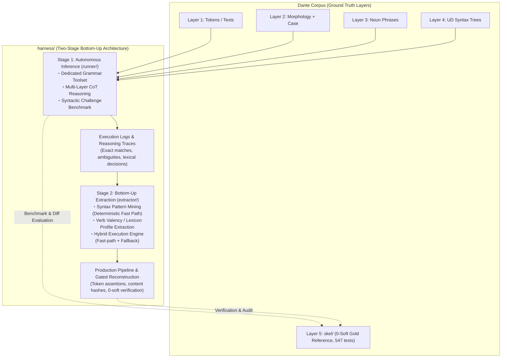

# Grammar Agent Harness: Overall Architecture & Master Plan

## Handoff — resume here

Temporary notes for the next session; durable state lives in **Current Status**
and the **Milestone Ledger** below.

**Next action — Stage 2, milestone 2.5** (gold verification through the
recheck, milestone 2.5 in [`extractor/PLAN.md`](extractor/PLAN.md) §5):
**the inferno-1 pilot is DONE and SANE (2026-08-24, readout in the Ledger).
Stage boundary (positioned 2026-08-24): Stage 2 ends with the recheck —
steps 1–2 below, both OPERATOR-RUN — and what it feeds (transcript
compaction / client-side pacing) plus the 99-canto expansion split off as
Stage 3 (Current Status; §2). When the recheck lands, archive the Stage-2
record to `STAGE2.md` and trim this plan exactly as the Stage-1 split did
([`STAGE1.md`](STAGE1.md)).**

The single streaming log also carries the request-level cost records
(added 2026-08-24 after the pilot): the live fallback appends one
`llm_request`/`llm_response` JSONL pair per backend LLM call — timestamp,
model, session/unit coordinates, transcript position, attempt,
context/new/output UTF-8 byte sizes, duration — closing the pilot's
"turn counts were estimated, not measured" gap; join key
`(session, messages, attempt)`, 429/quality retries inside `Client` stay
with the `wait_retry` counters and correlate by timestamp. They are
canto-scoped like every other record: never replayed into aggregates,
kept by resume compaction exactly for completed cantos. Wall clock rides
the records the same way: every `canto_complete` carries
`elapsed_seconds` and the summary sums them into `wall_clock_seconds`
(idle gaps between resumed attempts never count; the pilot log predates
the key and reads as None).

1. **Shakedown re-run of inferno 1 — the extension's live test.** Same
   single-canto scope as the pilot but a *fresh* `--log` path: the pilot
   log already carries inferno 1's `canto_complete` marker, so reusing it
   would resume-skip the canto:

   ```bash
   uv run python -m harness.extractor.reconstruct --canticle inferno --canto 1 \
       --verify-gold --model google:gemma-4-31b-it \
       --log harness/recon-inf1-recheck.log
   ```

   Pass criteria: the log carries one `llm_request`/`llm_response` pair
   per backend LLM call, every `canto_complete` an `elapsed_seconds`, and
   the summary a summed `wall_clock_seconds`; the aggregate readout
   cross-checks the pilot's (~34 units, ~6.7 ks wall, quota tax ~9.4%,
   verify-gold micro F1 0.78) — a large deviation is an instrumentation
   bug first, a corpus finding only second.
2. **429 readout → compaction decision — gated by the parallel plan.**
   The per-request records make the quota situation measurable per call
   for the first time: context byte sizes + timestamps give the
   single-stream input-token rate, to be set against the `gemma-4-31b`
   16k input-tokens/min ceiling and correlated with the `wait_retry`
   backoffs by timestamp (Current Status operational issue). The
   expansion below runs three canticles in parallel against that one
   shared per-model quota, so the decision rule is concrete: **unless
   measured single-stream rate × 3 fits under 16k tokens/min with
   margin, transcript compaction (or client-side pacing) is *required*
   before launch, not optional.** The pilot's single-stream 9.4%-of-wall
   tax already suggests one stream alone flirts with the ceiling, so
   expect compaction to earn a design. Standing constraint unchanged:
   compaction changes session semantics — designed and adopted *between*
   runs, never mid-run. **This readout is Stage 2's closing measurement;
   the decision and any compaction/pacing design it motivates are Stage
   3's opening act.**
3. **99-canto expansion — Stage 3 deployment, three canticle-parallel
   runs** (live agent fallback; launched only after the Stage-3
   optimization above passes the TPM gate — the serial estimate was
   ~660 ks ≈ 7–8 days; parallel bounds wall clock by the longest canticle,
   ~34 × 6.7 ks ≈ 230 ks ≈ 2.5–3 days, *if* the quota holds). Three
   concurrent operator shells, one per canticle, each with its own log —
   resume stays canto-granular and independent per file:

   ```bash
   uv run python -m harness.extractor.reconstruct --canticle inferno --all \
       --verify-gold --model google:gemma-4-31b-it \
       --log harness/recon-inferno.log
   # likewise --canticle purgatorio → harness/recon-purgatorio.log
   # and    --canticle paradiso  → harness/recon-paradiso.log
   ```

Pilot watch items all closed: (a) 18/34 units gate-pass, all agent-path (the
one fast-routed unit failed — routing "complete" ≠ checker-clean);
(b) `--verify-gold` micro P/R/F1 0.744/0.820/0.78 ≥ the Stage-1 band
(0.711); (c) 15 backoffs / 630 s ≈ 9.4% of wall — consistent with the
unit-benchmark quota tax. `written_cantos == 0`: gates kept the failing canto
unwritten exactly as designed. Full readout in the M2.5-pilot Ledger entry.

1. **Read first**: [`extractor/PLAN.md`](extractor/PLAN.md) (§3–§5), then
   [`../ARCHITECTURE.md`](../ARCHITECTURE.md) §4–§6 (observability + log
   contract; `reconstruct.py` already ships it incl. resume).
   The Stage-1→2 interface stays the trace contract:
   `UnitResult.trace_record()` (`runner/agent.py`) embedded as `"trace"` in
   every benchmark case record. The hybrid seam is callable-level:
   `HybridEngine.run_unit(..., fallback=agent_fallback(model=...))`;
   `reconstruct.main(..., fallback=...)` accepts an injected callable for
   deterministic work.
2. **Mining inputs — four complete 87-case JSONL run logs on disk** (all
   gitignored, disk-only; regenerate rather than re-mine if lost):
   M1.4 originals (`harness/bench-unit.log`, `harness/bench-predicate.log`)
   plus the instrumented re-runs (`harness/bench-unit-retry.log`,
   `harness/bench-predicate-retry.log`; finished 2026-08-24). The engine's
   `mine_artifacts()` regenerates rule table + lexicon from them in seconds;
   no mined artifact needs to be frozen on disk.
3. **Error structure to mine around** (details in
   [`STAGE1.md`](STAGE1.md), M1.4 entries):
   systematic gold-convention divergence on verbless frames dominates
   `historical` misses; bare-`obl` over-assignment (74 fps) and `xcomp`
   over-generation are the top noise sources; `obl:di` / `obl:in` recall
   0.54–0.60 fed lexicon_builder directly (140 frames at 100% consistency
   mined, incl. fare+di / avere+di / sedere+in — see the M2.2 Ledger entry).
   The 31 well-formed unit-side `upstream_feedback` records await HUMAN
   triage — never auto-retag.
4. **Boundaries that hold**: `extractor/` consumes traces + operator-side
   gold (`skel.io`) like `benchmark.py` does; agent-side masking (§4 item 1)
   applies to anything that runs *as* an agent — the engine's execution face
   and `reconstruct.py`'s execution/commit faces never open gold at all
   (adversarially tested), only evaluation faces (`evaluate_fast_path`,
   `--verify-gold`) do; `fixtures/challenge_cases.py` stays data-only. Tests
   live at repo root (`tests/test_harness_*.py`). `skel/` is protected:
   reconstruction writes need the explicit `--write` flag on top of passing
   all three gates, canto-atomically.
5. **Session housekeeping (2026-08-24, later session)**: the M2.5 inferno-1
   pilot ran, read out sane, and is recorded in the Ledger entry below; the
   2.5 milestone text in `extractor/PLAN.md` §5 is restated against measured
   reality. This commit also carries the pilot-motivated observability
   additions to the reconstruct log contract — per-request `llm_request` /
   `llm_response` records riding `--log` (one pair per backend LLM call; see
   the Handoff note above) and canto `elapsed_seconds` summing into summary
   `wall_clock_seconds` — implemented in `runner/agent.py`
   (`llm7shi_generate(request_log=...)` + the `_LLM_REQUEST_CONTEXT`
   contextvar `run_unit` stamps), `extractor/hybrid_engine.py`
   (`agent_fallback(request_log=...)`), and `extractor/reconstruct.py` (shared
   sink wiring, opened after resume compaction). Tests at 833 passed; tree
   starts clean. Next: the inferno-1 shakedown re-run (log-extension live
    test + 429 readout) closes Stage 2 → `STAGE2.md` archive split; Stage 3
    (compaction/pacing optimization + the canticle-parallel 99-canto
    expansion) opens after, operator-run.
 6. **Documentation split (2026-08-24, this session)**: PLAN.md had outgrown
    its master-plan role (~990 lines), so the completed Stage-1 record moved
    out verbatim — milestones 1.1–1.4 + carry-over resolutions to
    [`STAGE1.md`](STAGE1.md), the toolcall ledger entries to
    [`TOOLCALL.md`](TOOLCALL.md) §8. PLAN.md keeps the Handoff, Current
    Status (one archived Stage-1 bullet), the Stage-2 ledger, and the
    standing sections §1–§4; cross-references updated in
    [`README.md`](README.md) and [`runner/PLAN.md`](runner/PLAN.md).
 7. **Stage repositioning (2026-08-24, this session)**: the serial full run
    (~660 ks ≈ 7–8 days) is too long, so the expansion becomes three
    canticle-parallel streams — which triples TPM pressure against the one
    per-model quota. The plan therefore bounds **Stage 2 at the M2.5
    recheck** (Handoff steps 1–2) and positions **Stage 3 — Context
    Optimization & Full-Corpus Scale-Out**: compaction/pacing designed
    *between* runs from the recheck's request-granularity data (launch
    gate 3 × single-stream ≤ 16k tokens/min with margin), then the
    parallel 99-canto expansion + corpus-wide readout (Current Status;
    §2). extractor/PLAN.md §5 milestone 2.5 re-scoped to match; §2
    retitled "Staged Strategy: Bottom-Up Core + Scale-Out". On recheck
    completion: create `STAGE2.md`, split this plan exactly like the
    Stage-1 split, update cross-references incl. README.md. Docs-only
    session; tests untouched at 833 passed.

---

## Current Status

- [x] **Stage 1 — Autonomous Inference & Capability Benchmark: COMPLETE**
      (toolcall T1–T5 + milestones 1.1–1.4 incl. the instrumented re-runs).
      XML protocol adopted as official wire format (probe 0.957 ≥ 0.95,
      parity interop 24/24 twice); 87-case benchmarks run for BOTH workflows
      at quality parity (micro F1 0.711 unit vs 0.708 predicate; default
      `unit`); traces pooled for Stage 2 mining. Record archived 2026-08-24:
      milestones, ledger, and carry-over resolutions in
      [`STAGE1.md`](STAGE1.md); protocol ledger in
      [`TOOLCALL.md`](TOOLCALL.md) §8.
- [ ] **Stage 2 — Rule & Lexicon Extraction** (`harness/extractor/`, milestones
      2.1–2.5 in [`extractor/PLAN.md`](extractor/PLAN.md)).
  - [x] **Milestone 2.1 — Syntax Pattern Miner** (`extractor/syntax_miner.py`)
        — COMPLETE (2026-08-24): row-level supervised UD-topology clustering
        over the pooled traces; 183 fast-path rules at 100% precision, corpus
        gold coverage 31.4%; details in the Ledger entry below.
  - [x] **Milestone 2.2 — Verb Valency Lexicon Builder**
        (`extractor/lexicon_builder.py`) — COMPLETE (2026-08-24): shared
        row-level supervision over the same pooled traces; 140 verb×preposition
        frames over 105 verbs at 100% consistency; details in the Ledger entry
        below.
  - [x] **Milestone 2.3 — Hybrid Engine Router** (`extractor/hybrid_engine.py`)
        — COMPLETE (2026-08-24): attached-pair fast path over rule table +
        lexicon with conflict detection, conservative pro-drop-aware routing,
        and a callable agent-fallback seam; corpus probe: fast-path share 7.0%
        (target ≥80%), derivation P 0.925 / R 0.289; details in the Ledger
        entry below.
  - [x] **Milestone 2.4 — Gated Reconstruction Pipeline**
        (`extractor/reconstruct.py`) — COMPLETE (2026-08-24): whole-canto
        rebuild behind the three §4.1 gates (token-stream assertion, 0 hard /
        0 soft via `validate_unit`, content-hash verified atomic commits);
        deterministic dry probe: 0/100 cantos writable, 43/3,477 units
        checker-clean; details in the Ledger entry below.
  - [ ] **Milestone 2.5 — Gold Verification through the Recheck**
        (operator-run; scope re-bounded 2026-08-24 — the 99-canto
        expansion moved to Stage 3).
        - [x] Pilot (inferno 1, live fallback, 2026-08-24): SANE — 18/34
              units gate-pass, verify-gold micro F1 0.78 ≥ the 0.70–0.71
              Stage-1 band, quota tax 9.4%, `written_cantos == 0`; details in
              the Ledger entry below.
        - [ ] Recheck (inferno 1 re-run — Handoff steps 1–2: log-extension
              live test + request-granularity 429 readout). Completing it
              closes Stage 2 → archive the record to `STAGE2.md`
              ([`STAGE1.md`](STAGE1.md) pattern).
- [ ] **Stage 3 — Context Optimization & Full-Corpus Scale-Out**
      (positioned 2026-08-24; opens when the M2.5 recheck closes Stage 2):
      transcript compaction / client-side pacing designed *between* runs
      from the recheck's per-request data (launch gate: 3 × single-stream
      input rate ≤ 16k tokens/min with margin), then the 99-canto
      expansion as three canticle-parallel runs + the corpus-wide readout
      (Handoff step 3). No code or spec exists yet; the standing constraint
      is that compaction changes session semantics — design first, never
      mid-run.
- Open design question (protocol layer): a dedicated `submit_candidate`
  termination tool — the practical half is resolved by the nudge policy
  ([`STAGE1.md`](STAGE1.md) carry-over 3); tracked as
  [`TOOLCALL.md`](TOOLCALL.md) §7.1.
- Open operational issue (2026-08-23, predicate full run): long agent contexts
  trip the Gemini API's per-model input-token quota (`gemma-4-31b` paid tier:
  16k input tokens/min) — 429 RESOURCE_EXHAUSTED with ~50 s backoffs becomes
  frequent past ~10 turns, because every loop turn resends the whole transcript
  and the predicate workflow accumulates turns fast. Candidate mitigations
  (undecided): local Ollama backend for long sessions (same XML wire format, no
  TPM ceiling — but the ~3× figure was calibrated on short probe/unit-mode
  sessions; with long transcripts every request pays full local prefill, so the
  penalty compounds roughly quadratically with turn count and may far exceed
  3×), client-side pacing, or a transcript-compaction policy (changes session
  semantics — design first, never mid-benchmark). Measurement: llm7shi's
  auto-retry hides these failures from artifacts; since 2026-08-23 the
  `HarnessStatusLine` stream counts them (`api_retries` / `api_retry_seconds`
  in case records and summaries).   `turn_seconds` still absorbs the wait time,
  so quota-affected turns inflate slow-turn counts unless read together with
  the retry counters. Measured on the predicate full run (first instrumented
  run): 103 backoffs / 3,526 s across 40 of 87 cases, worst session 14
   backoffs / 670 s over 19 turns; excluding backoff, its compute matched the
   unit run (~18.8 ks vs 18.7 ks) — the entire +19% wall clock was quota wait.
    Re-measured 2026-08-24 on both instrumented re-runs (Client adapter):
    predicate 103 backoffs / 3,196 s across 47 of 87 cases (14.4% of wall)
    reproduces the tax; the unit side is now measured for the first time at
    55 backoffs / 1,659 s across 36 of 87 cases (8.4%) — half the predicate's
    absolute quota wait, consistent with shorter unit sessions crossing the
    per-minute ceiling less often. Compute-only totals nearly equal: unit
     ≈18.1 ks vs predicate ≈19.0 ks (+5%). Measurement now moves to request
     granularity: the post-extension inferno-1 re-run (Handoff step 1) logs
     per-call context byte sizes, so transcript growth per turn lands
     directly against the per-minute input ceiling and the 429 timestamps —
     the data the compaction-vs-pacing decision has been waiting for. That
     decision is now load-bearing: the expansion is planned as three
     canticle-parallel streams sharing the one per-model quota (Handoff
     step 3), so the launch gate is 3 × single-stream input rate ≤ 16k
     tokens/min with margin.
- Test suite: **833 passed** (547 corpus + 41 `test_harness_tools.py` +
  76 `test_harness_toolcall.py` + 32 `test_harness_agent.py` +
  39 `test_harness_benchmark.py` + 23 `test_harness_syntax_miner.py` +
  17 `test_harness_lexicon_builder.py` + 27 `test_harness_hybrid_engine.py` +
  31 `test_harness_reconstruct.py`).

---

## Milestone Ledger

*Stage-1 records (toolcall T1–T5, milestones 1.1–1.4 + carry-over
resolutions) were split off on 2026-08-24 to [`STAGE1.md`](STAGE1.md)
and [`TOOLCALL.md`](TOOLCALL.md) §8; this ledger carries Stage 2.*

**Milestone 2.1 — Syntax Pattern Miner (`harness/extractor/syntax_miner.py`):
COMPLETE (2026-08-24).** First Stage-2 deliverable: deterministic, no-model
clustering of the pooled Stage-1 traces into executable fast-path rules
(`extractor/PLAN.md` §2.1).

- **Design decision — row-level supervision.** Unit-level 1-shot exact match is
  statistically starved (3/87), so supervision comes from every case record's
  final diff instead: gold − `missing` labels a correct predicted row, each
  `extra` key labels a wrong one *with its wrong role kept*. All four runs pool
  (dedupe by unit + workflow + timestamp; 348 sessions, 0 duplicates) →
  **3,793 correct / 1,542 wrong labeled rows**, plus pro-drop 427/335 and 5
  unresolved positions — counted, never clustered.
- **The mined pattern** is a UD-topology signature per row:
  `(pred_pos_class, pred_deprel, arg_attachment, arg_deprel, arg_pos_class,
  case_lemma)` where `arg_attachment ∈ {direct, conj, other}` walks `conj`
  chains up to the predicate and `case_lemma` reads the argument's `case`
  child (the preposition that separates `obl:a` / `obl:di` / … from bare
  adverbial `obl`). Pro-drop rows are morphology's business, not syntax rules'.
- **Cluster gate**: support ≥ 3 AND precision = ok / total-per-signature ≥ 1.0;
  the denominator spans *every* role ever predicted under the signature, so a
  competing reading poisons the pattern instead of slipping through (the
  bare-`obl` noise suppresses its own clusters). Result: 601 clusters →
  **183 `SyntaxRule`s at 100% precision**, top by support:
  advcl←direct:nsubj[noun]→subj 154/154, advcl←nsubj[pronoun]→subj 113/113,
  root←nsubj[pronoun]→subj 86/86, advcl←obj[pronoun]→obj 60/60,
  ccomp←nsubj[pronoun]→subj 59/59.
- **Deterministic coverage probe** (rule table applied to every gold row of all
  100 cantos): **10,968 / 34,959 gold rows = 31.4% reproduced exactly**;
  356 conflicts (signature known, role differs — genuine ambiguity signal for
  the hybrid engine), 23,635 unmatched (constructions absent from the 87-unit
  trace pool — mining coverage tracks trace coverage), and 5,305 pro-drop rows
  (15.2% of gold) no syntax rule can own → the morphology tier / agent fallback
  owns those.
- **CLI & observability**: batch-scaled per ARCHITECTURE.md §4–§6 — stderr
  phase progress, streaming JSONL `--log` (one `rule` record per rule,
  summary-last completion marker; truncated on startup as a deliberate
  one-shot-experiment choice under §5), durable `--rules-out` rule table JSON,
  dual-face `MineReport`. Deterministic end to end; nothing here touches a
  model, so it runs inside assistant sessions freely.
- Tests: `tests/test_harness_syntax_miner.py` — 23 deterministic tests over
  synthetic run logs + real frozen artifacts: torn-line/dedupe log parsing,
  TP/FP labeling against real gold, topology features (incl. conj-chain walk
  and case-lemma join), cluster gates (purity, support, relaxed precision),
  coverage partition invariants, CLI end-to-end with summary-last marker, and
  a real-log integration test skipped when logs are absent. Suite total
  **755 passed**.

**Milestone 2.2 — Verb Valency Lexicon Builder
(`harness/extractor/lexicon_builder.py`): COMPLETE (2026-08-24).** Second
Stage-2 deliverable: deterministic, no-model aggregation of the pooled Stage-1
traces into executable verb×preposition argument frames
(`extractor/PLAN.md` §2.2) — the direct lever on the M1.4 `obl:di` / `obl:in`
recall gap (0.54–0.60; record in [`STAGE1.md`](STAGE1.md)).

- **Shared loader extracted.** `syntax_miner.iter_labeled_rows` now carries the
  proven session scan (pooled four-run JSONL, dedupe by unit + workflow +
  timestamp, pro-drop counted never yielded, gold-vs-diff row labeling);
  `collect_instances` consumes it unchanged (all 23 miner tests pass untouched)
  and `collect_valency_instances` is the second consumer — one scan, two
  miners.
- **The observation** per labeled `obl:` row is `(verb_lemma at the predicate,
  norm_prep(case child of the argument), role, ok)`; `norm_prep` splits fused
  preposition+article lemmas (`a+il` → `a`, ~1.5k gold rows' largest
  role-vs-case divergence family) and folds spacing/apostrophe variants. The
  key is the UD observable so reconstruction-time lookups need no Layer-5 hint.
- **Pair labeling discipline** (competing readings poison, as in 2.1):
  correct rows agreeing with the case lemma are positives; wrong claims charge
  their own asserted suffix (never the unrelated case lemma the UD showed);
  correct role-vs-case spelling disagreements poison the case-lemma pair.
  Bare-`obl` adjunct verdicts over case-bearing phrases count as negatives but
  barely exist in gold (1 of 872). Out-of-scope rows (subj/obj/ccomp/... and
  bare obl without case child): 4,164 of 5,340 resolved rows — counted, not
  aggregated.
- **Gate**: support ≥ 3 AND consistency = positives / (positives + rejected +
  mismatches + adjuncts) ≥ 1.0. Result: 288 pairs → **140 `ValencyEntry`s
  over 105 verbs at 100% consistency**, top by support: volgere+a 19/19,
  fare+con 14/14, fare+di 13/13, avere+di 12/12, fare+in 11/11; the
  recall-gap targets contribute 44 di/in frames (fare+di, avere+di,
  sedere+in 8/8, apparire+di ...).
- **Deterministic corpus probe** (lexicon looked up for every explicit-argument
  gold `obl:` row of all 100 cantos): **1,381 / 8,889 = 15.5% reproduced**
  (conflict 25, unmatched 7,483 — mining coverage tracks trace coverage, same
  pattern as the rule table's 31.4%; no_preposition 366 rows are the lexicon's
  blind spot by construction; adjunct conflict/unmatched 0/1).
- **CLI & observability**: batch-scaled §4–§6 exactly like the miner — stderr
  phase progress with `[lexicon_builder]` labels, streaming JSONL `--log`
  (one `frame` record per entry, summary-last completion marker, truncated on
  startup as a one-shot experiment under §5), durable `--lexicon-out` lexicon
  JSON, dual-face `LexiconReport`. Deterministic end to end (~1 s full build +
  corpus probe); nothing touches a model.
- Tests: `tests/test_harness_lexicon_builder.py` — 17 deterministic tests:
  prep normalization, in-scope labeling against real inferno-2 gold (incl. the
  wrong-claim-charges-its-own-suffix asymmetry), unresolved counting, frame
  gates (support, poisoned rejected/mismatch/adjunct buckets, relaxed
  consistency), exporter round-trip, coverage partition invariants, report
  faces, CLI end-to-end with summary-last marker, real-log integration
  skipped when logs are absent. Suite total **772 passed**.

**Milestone 2.3 — Hybrid Engine Router
(`harness/extractor/hybrid_engine.py`): COMPLETE (2026-08-24).** Third
Stage-2 deliverable: the two-tier engine of `extractor/PLAN.md` §3 — Tier-1
deterministic derivation from the mined artifacts, Tier-2 routing to the
Stage-1 agent runner through an injected callable.

- **Tier 1 — fast path over attached pairs only.** For every ordered token
  pair inside the parse unit whose argument reaches the predicate via a UD
  edge or a `conj` chain (`RowContext.arg_attachment` direct/conj), the rule
  table decides first and the valency lexicon second (`(verb_lemma,
  norm_prep(case lemma))` → `obl:<prep>`); both sources are consulted
  independently so agreement reinforces (`reinforced_pairs`) and disagreement
  records a `PairConflict` that derives nothing — ambiguity routes upward.
  **Design finding: the mined `other`-attachment rules are not executable.**
  They were learned from gold-row-shaped pairs; on fresh pairs they fire on
  grammatically unrelated tokens — measured P 0.418 all-pairs vs 0.952
  attached-only on inferno 1–5 (840 fps from 18 low-support rules). Their
  signatures stay mining-side ambiguity signals; derivation enumerates
  structurally attached pairs only.
- **Routing — conservative by default** (`RoutePolicy`, checks ordered):
  conflicts → zero derived rows → pro-drop suspects → else fast. A pro-drop
  suspect is a finite personal verb (L2 mood indicative/subjunctive/
  imperative with person) carrying no derived `subj` row — cop/aux heads
  exempt (their subject attaches to the content predicate). Bias is
  deliberately toward the agent: over-routing costs turns, under-routing
  silently loses rows; until the morphology tier exists this keeps fast-path
  output trustworthy.
- **Tier 2 — the fallback seam.** `HybridEngine.run_unit(..., fallback=...)`
  takes any `(canticle=..., canto=..., line_start=..., line_end=...) ->
  UnitResult` callable; open-ended line numbers snap to parse-unit bounds via
  the benchmark's `resolve_unit_bounds`. The agent submission is normalized
  by the benchmark's own `candidate_keys` (malformed / out-of-unit counted),
  so hybrid-scored units are judged exactly like Stage-1 benchmark cases.
  `agent_fallback(model=...)` is the live factory (lazy imports per
  ARCHITECTURE.md §2, one transport/toolkit pair across units);
  `fallback=None` stays dry mode (derivation + decision only).
- **Two gold disciplines in one module.** Execution (`derive_unit`,
  `run_unit`) loads L2/L4 only and never opens a gold artifact — proven
  adversarially by poisoning `load_skel` in both namespaces it could reach;
  evaluation (`evaluate_fast_path` + CLI probe) reads gold operator-side like
  `benchmark.py`. The probe iterates real parse units (`dep.sentence_groups`)
  — the same shape `reconstruct.py` will drive in 2.4.
- **Corpus readout (all 100 cantos, 3,477 units, ~13 s wall)**: fast-path
  share **245 / 3,477 = 7.0%** against the §1 target ≥80% — MISS, honestly
  measured; routing reasons: complete 245, pro-drop suspects 3,041 (87.5% of
  units host at least one), no_rows 185, conflicts 6 corpus-wide (the two
  sources almost never disagree). Derived rows 12,593 at P 0.925 / R 0.289 /
  F1 0.441; tp 11,653 = **33.3% of the 34,959 gold rows** (the miner's 31.4%
  rule coverage plus the lexicon's prepositional frames);
  fast-routed units only: **P 0.968**, R 0.425 — where the router says fast,
  derivation is near-clean. Conclusion recorded for 2.4: agent fallback is
  today's primary path; the fast path is the growing optimization.
- CLI & observability: batch-scaled §4–§6 exactly like the miners — stderr
  phase progress with `[hybrid_engine]` labels, streaming JSONL `--log` (one
  `unit` record per probed parse unit with route/reason + tp/fp/fn, summary
  record last as completion marker, truncated on startup under §5), dual-face
  `EngineReport` whose summary prints the coverage gate
  `(target >= 0.80: PASS|MISS)`. Artifacts load from `--rules-in` /
  `--lexicon-in` or regenerate deterministically via `mine_artifacts()` /
  fresh mining (seconds). Deterministic end to end; nothing here touches a
  model.
- Tests: `tests/test_harness_hybrid_engine.py` — 27 deterministic tests:
  derivation precedence/reinforcement/conflicts on real inferno-2 topology,
  attachment accounting incl. unresolved pairs (stubbed views), pro-drop
  suspect classification (pure + real hosts, cop/aux exemption), routing
  branches and policy toggles, fallback seam (fast path skips the agent,
  agent path normalizes submissions, dry mode, bound snapping),
  masked-gold execution face, artifact mining/loading round-trips, probe
  partition invariants + report faces, CLI end-to-end with summary-last
  marker, capped real-log integration. Suite total **799 passed**.

**Milestone 2.4 — Gated Reconstruction Pipeline
(`harness/extractor/reconstruct.py`): COMPLETE (2026-08-24).** Fourth
Stage-2 deliverable: whole-canto Layer-5 rebuild through
`HybridEngine.run_unit`, every disk write gated on extractor/PLAN.md §4.1's
three criteria.

- **Gate 1 — token-stream assertion.** `build_rows` anchors every accepted
  row key verbatim on the canto's Layer-1 alpha-token stream (predicate and
  argument positions must index it inside the unit bounds); words are taken
  from L1 itself so alignment holds by construction, and bad positions are
  dropped with a report, never raised. Dry corpus probe: 0 assertion errors
  on all 3,477 units — derived rows are always well-anchored.
- **Gate 2 — 0-soft verification.** Each parse unit is checked through the
  proven checker (`skel.validate.validate_unit` running `derive_unit` inside)
  with L2/L3/L4 + the case annex attached, split hard/soft exactly like the
  Phase 5–8 drivers (`driver_ui._classify_violations`: `tag` → soft). A unit
  passes only at **0 hard / 0 soft** — the same standard the committed gold
  meets corpus-wide. This is deliberately stricter than gold comparison:
  candidates must satisfy the *checker*, not merely resemble gold.
- **Gate 3 — content-hash verified commits.** `commit` renders the full-canto
  payload byte-exactly (`render_tsv`, a mirror of `skel.io.write_skel`'s
  format incl. per-line sentinels; parity pinned by a dedicated test),
  digests it *before* writing, lands it through the canonical writer, then
  requires `hashes.canto_hashes()["skel"]` to recompute that digest — proving
  disk now holds byte-for-byte what the gates validated. A mismatch rolls the
  artifact back to its previous bytes (or removes a freshly created file).
  The commit record carries before/after hashes as the audit trail.
- **Design decisions.** (1) Commits are **canto-atomic**: a canto writes only
  when every one of its parse units passes, so an artifact is always wholly
  checker-clean — never a mix of derived and previously-frozen units.
  (2) Writes additionally require explicit `--write`: the plan sketch's bare
  `--all` would have implied writing, but `skel/` is protected gold
  (harness/PLAN.md §3), so the default run reconstructs, verifies, and
  reports without touching disk (`--dry-run` accepted as its explicit
  spelling). (3) Gold discipline mirrors the engine's two faces: execution +
  commit never open a gold artifact (adversarially tested against poisoned
  `load_skel`); `--verify-gold` reads gold operator-side like
  `benchmark.py` and is strictly observational — it never feeds gating or
  writes. (4) The CLI **resumes at canto granularity**: each finished canto
  emits a terminal `canto_complete` marker; on restart completed cantos
  replay into the aggregate and are skipped, and `compact_log` atomically
  strips stale summaries *and* orphaned records of incomplete cantos (so a
  partially-run canto can never double-count after finishing on a later
  attempt) — the M1.4 mid-run-stall lesson applied to Stage 2's longest runs.
  (5) `main(..., fallback=...)` accepts an injected callable, keeping the
  whole pipeline deterministic-testable; without injection it wires the live
  `agent_fallback` factory, so the CLI stays operator-run by construction.
- **Deterministic dry readout (all 100 cantos, 3,477 units, ~18 s, mined
  artifacts, `fallback=None`)**: **0/100 cantos writable today**; 43/3,477
  units pass all gates (1.2%) — all among the 245 fast-routed units, i.e.
  only where rules+lexicon reproduce a unit's whole derivation does the
  checker stay silent; elsewhere 16,874 soft violations (dominated by the
  uncovered-derivation divergences: `missing_tuple` / `missing_arg`) plus 3
  hard. Confirms, at gate granularity, the M2.3 conclusion: agent fallback is
  the primary path, and until engine quality rises the pipeline's honest
  output is protection — gold stays untouched. Milestone 2.5 will measure the
  live-agent variant operator-side.
- **Live-run observability wired (2026-08-24 addendum).** The CLI now carries
  the full §4-item-5 display stack, and this wiring is the standing template
  for every future live entry point: an optional `HarnessStatusLine` Rich bar
  created up front whose numerator counts exactly the canto separators
  (whole-run positions `[offset+i/offset+N]`, resume-aware via
  `progress(total, start=resume_offset)`); *every* human-facing line —
  separators (`toolcall.progress_separator`), per-unit progress inside a
  canto, the artifact-mining notice — routed through its markup-disabled
  stderr console so nothing clobbers the bar; the live fallback's llm7shi
  sink pointed at that same console via the new `agent_fallback(..., file=)`
  parameter, so streamed model output and retry countdowns share one display;
  and auto-retried API backoffs snapshotted/delta'd per unit of work through
  the stream's `wait_retry` hook (`_retry_snapshot` / `_retry_delta`,
  mirroring `runner/benchmark.py`) into `api_retries` / `api_retry_seconds`
  on each `canto_complete` record, aggregated in summary metrics. Untracked
  runs — deterministic injected fallbacks, no rich extra — stay display-free
  and carry none of these keys.
- Tests: `tests/test_harness_reconstruct.py` — 28 deterministic tests: row
  building + token assertions (anchors, out-of-stream/bounds positions, ∅
  subjects), unit partition invariants, gold-validates-clean through the
  pipeline wiring, hard/soft split on crafted breakage, end-to-end pass with
  a gold-serving stub fallback, poisoned-gold execution face, dry-mode
  blocking, refusal to commit blocked cantos, hash-verified write + rollback
  on induced digest mismatch, `render_tsv`↔`write_skel` byte parity, exact /
  degraded gold comparison, report faces incl. record replay, log resume +
   compaction, CLI end-to-end (summary-last, no-write default, refused write
   leaves seed bytes intact), status-line display routing (fake-bar canto
   tracking, resume offset spanning the bar, stderr kept clean), api-retry
   accounting (helpers, report folding, per-canto CLI deltas), capped
    real-artifact integration. Suite total
    **827 passed**.

**Milestone 2.5 pilot — live gated reconstruction, inferno 1 (operator-run):
COMPLETE (2026-08-24, `google:gemma-4-31b-it`, `harness/recon-pilot-inf1.log`,
gitignored disk-only; no `--write`).** First live `reconstruct` run: 34 units /
136 lines, all three watch items from the handoff closed.

- **Routing & gates (watch a).** 33 agent-routed (`pro_drop_suspects`) / 1
  fast (`complete`) — the M2.3 7% fast share holds canto-side. **18/34 units
  passed all gates (52.9%)**, 16 blocked; the canto as a whole failed →
  `written_cantos == 0` — the gates keep every failing canto unwritten,
  exactly the honest-output design. Contrast with the deterministic dry probe
  (1.2% units passing): the live agent is what lifts unit-level pass rates.
  Two structural findings: (1) the single **fast-routed unit failed** —
  routing reason `complete` means "derivation finished", not "checker-clean";
  its missing `obl:a` row is a rule/lexicon coverage gap the router cannot
  see. (2) All 8 hard violations are agent-originated: 6 `dup` ("argument
  cites its own predicate") + 2 `position` (`obj` on (0,0)) — error classes
  invisible to the benchmark's row-key scoring but caught by Gate 2; soft
  violations replay the known M1.4 shapes (bare-`obl` / `obl:<prep>`
  role-mismatch, `subj (0,0)` where gold wants the ∅ convention,
  missing_tuple on skipped predicates).
- **Gold comparison (watch b).** `--verify-gold` micro P/R/F1 =
  **0.744 / 0.820 / 0.78**, exact 2/34 units; gold 389 rows vs 429 predicted
  (tp 319 / fp 110 / fn 70). Exceeds the inherited Stage-1 band (M1.4 unit
  micro F1 0.711, P 0.693 / R 0.729) with both P and R higher — the pipeline
  reproduces its Stage-1 inheritance on this canto. Caveat recorded: the
  challenge-case benchmark is a curated-hard distribution, inferno 1 a normal
  one (and hosted the benchmark's only exact-match units), so this is
  reproduction, not improvement evidence.
- **Quota tax (watch c).** 15 backoffs / 630 s over the canto
  (`api_retries` / `api_retry_seconds` on `canto_complete` as designed);
  fallback sessions totaled 6,068 s (~178 s/unit — consistent with the
  ~215 s/unit M1.4 rate; max unit 985.6 s). Backoff ≈ 9.4% of wall,
  consistent with the unit-benchmark's 8.4%: the single-canto session stream
  shows no new retry pathology.
- **Verdict: pilot sane → expansion sanctioned.** At the pilot rate the
  remaining 99 cantos cost ~660 ks ≈ 7–8 days wall clock (corpus mean ≈ 35
  units/canto, inferno 1 exactly at it); the log resumes at canto granularity
  so the run is freely interruptible. The milestone's original "assert 100%
  equivalence" target stays restated honestly: even at F1 0.78 no canto is
  writable (0 hard / 0 soft per unit is far stricter than gold similarity);
  the expansion's deliverable is the corpus-wide exact/P-R-F1 record plus the
  confirmed `written_cantos == 0` protection, not writes.
- **Post-pilot instrumentation (same day, in response to the pilot's two
  measurement gaps).** The pilot log carried no request counts and no wall
  clock, so both quantities had to be estimated from per-unit fallback
  seconds. The expansion will measure them directly: (1) every backend LLM
  call now appends an `llm_request`/`llm_response` pair to the same `--log`
  (contextvar-stamped with session + unit coordinates from `run_unit`; join
  key `(session, messages, attempt)`), and (2) every `canto_complete`
  carries `elapsed_seconds`, summed into summary `wall_clock_seconds`
  (sum-the-records: resumed attempts fold in per canto, idle gaps never
  count). 6 new deterministic tests; suite 833 passed.

---

## 1. Overview & Paradigm Shift: Generalizable Layer 5 Reconstruction

`harness/` is a dedicated **Grammar Agent Harness for Local LLMs** (e.g., **Gemma 4 31B**), designed to systematically reconstruct Layer 5 predicate-argument skeletons (`skel/`) from multi-layer grammatical contexts (Layer 1 text/tokens, quotes hierarchy, Layer 2 morphology, pronoun case annex, Layer 3 noun phrase spans, and Layer 4 Universal Dependencies syntax trees).

### Motivation & Rationale
1. **Historical Context & Limitations of `skel/`**:
   - Layer 5 (`skel/`) was historically produced by a **small local LLM**
     (`ollama:gemma4:31b-it-qat`, pinned in `model.mk`) driving the driver's
     `--fix` regeneration loop; its residual errors were then triaged through an
     interactive, semi-manual process in which a frontier LLM (Claude Opus 5,
     later switched to Gemini 3.7 Flash at the end of Phase 8) and human
     operators read the outlier positions to formulate 130 deterministic rules
     (Rules A–EI) and hand-apply the corrections recorded in
     [`CORRECTIONS.md`](../skel/CORRECTIONS.md).
   - Throughout, the small model was granted **no autonomy**: it ran on rails
     laid down by the larger model — executing repairs inside a checker/rule
     system it did not shape, with everything beyond those rails escalated to
     the frontier-LLM/human triage loop.
   - Although this successfully produced a 100% clean corpus (**0 hard / 0 soft violations across all 100 cantos**, 547 pytest passing), the **construction methodology itself was ad hoc, bespoke to Dante's Italian, and insufficiently automated**.
   - As a result, the Phase 5–8 methodology cannot be directly generalized to other texts, genres, or languages (such as Latin).
2. **Mission of `harness/`**:
   - The gist of `harness/` is to grant the local model that missing **autonomy**: remove the hand-laid rails and let it reason from linguistic first principles, deciding its own path through multi-layer context and closed tools instead of executing rules handed down by a larger model.
   - `harness/` embeds this autonomous agent in a **reproducible, fully automated, and generalizable reconstruction pipeline**.
   - Preserving `skel/` as an **immutable Gold Standard (Ground Truth)** for benchmark evaluation, `harness/` demonstrates how local LLMs can autonomously project Layer 4 UD syntax onto predicate-argument frames (Stage 1) and empirically induce syntax rules and valency lexicons (Stage 2).



---

## 2. Staged Strategy: Bottom-Up Core + Scale-Out

In contrast to the top-down methodology used in Phases 5–8 — where frontier LLMs deduced abstract rules that the local executor then followed mechanically, without autonomy of its own — `harness/` hands agency to the local model and adopts an empirical **bottom-up strategy (instance-level inference ➔ pattern induction)** across Stages 1–2, with Stage 3 as the operational scale-out.

### Stage 1: Autonomous Local Inference & Capability Benchmark (`harness/runner/`)
- **Approach**: For each parse unit, the agent receives the multi-layer context (L1–L4, quotes, case) and autonomously solves predicate-argument frames on the fly using Chain-of-Thought (CoT) and a dedicated Tool Calling API (`validate_candidate`, etc.).
- **Objectives**:
  - Quantitatively benchmark local LLM capabilities (1-shot exact match rate, multi-turn self-correction convergence rate, role-level F1) against the 0-soft Gold Standard (`skel/`).
  - Capture comprehensive execution logs, successful syntax projections, and lexical decision traces (e.g., argument vs. adjunct discrimination, reflexive pronouns, control verbs).
- **Specification**: [`harness/runner/PLAN.md`](runner/PLAN.md).

### Stage 2: Bottom-Up Rule & Lexicon Extraction (`harness/extractor/`)
- **Approach**: Mine and aggregate the reasoning logs and decision trajectories from Stage 1 to:
  1. Extract stable, deterministic Universal Dependencies patterns as **Syntax Fast-Path Rules**.
  2. Aggregate verb-preposition-case co-occurrences into an empirical **Verb Valency Lexicon**.
  3. Construct a **Hybrid Execution Engine** combining deterministic fast paths (rules + lexicon) with fallback to Stage 1 agent inference for ambiguous or rare contexts.
- **Objectives**:
  - Maximize cross-corpus consistency and reduce inference latency and token overhead (targeting >80% fast-path coverage).
  - Provide a gated production pipeline that reconstructs cantos under strict 0-soft regression verification and content hash updating.
- **Specification**: [`harness/extractor/PLAN.md`](extractor/PLAN.md).

### Stage 3: Context Optimization & Full-Corpus Scale-Out (positioned 2026-08-24)

Outside the two-stage bottom-up induction core — Stage 3 is the
operational scale-out that opens when the M2.5 recheck closes Stage 2:
transcript compaction / client-side pacing adopted from the recheck's
request-granularity measurements (launch gate: 3 × single-stream input
rate ≤ the 16k tokens/min per-model ceiling, with margin), then the
99-canto expansion as three canticle-parallel runs behind the existing
gates, and the corpus-wide readout. Scope and constraints tracked in
Current Status + the Handoff; no code or spec exists yet.

### Beyond Layer 5 (design notes)

Directions that open up **after** the `skel/` reconstruction — a layer swap
(same machinery, different target layer), a vertical whole-stack slice, and the
horizon of reconstructing grammar for a language with no available description
— are kept out of this plan in [`FUTURE.md`](FUTURE.md). None of it is
scheduled work; `PLAN.md` remains the source of truth for status and
milestones.

### Transport & backend policy

Decision record (2026-08-22): measured at roughly 3× the local speed, **XML
(`PromptXmlTransport`) was adopted as the official wire format for Stage 1/2
production runs; native Ollama tool calling (`OllamaNativeTransport`) stays
implemented and gated for comparison experiments** (re-run
`harness.toolcall.parity` when revisiting local-only deployments). Backend
choice remains free: `google:gemma-4-31b-it` when wall clock matters,
`ollama:gemma4:31b-it-qat` for offline/cost-constrained work — both validated
end-to-end over the XML protocol during the T4/T5 gates.

Adapter policy (2026-08-24): the stateful `llm7shi.Client` adapter is the
common model-access specification; the stateless probe/parity adapters and the
skel drivers' disposable-Client pattern are legacy from the trial-and-error
phase. The standing rules live in [`../ARCHITECTURE.md`](../ARCHITECTURE.md)
(§2 Model access, §3 Wire protocol).

---

## 3. Separation of Concerns

The directory map lives in [`README.md`](README.md#directory-structure) —
single source, not duplicated here. The boundaries it encodes:

- **`skel/` is protected, not a dependency.** Gold TSVs, the 130-rule registry,
  and [`CORRECTIONS.md`](../skel/CORRECTIONS.md) are the evaluation reference
  and are masked from agents structurally (§4 item 1); only operator-side
  benchmark code reads them.
- **`toolcall/` is a layer- and task-agnostic protocol library.** It knows
  nothing about grammar: wire format, transports, and the multi-turn loop only.
  Everything grammatical lives in `runner/`.
- **`runner/` (Stage 1) produces traces; `extractor/` (Stage 2) consumes
  them.** The contract between the stages is `UnitResult.trace_record()`, not
  shared internals.
- **`fixtures/` is data, read operator-side only.** Nothing under `runner/`
  imports it, so the agent path cannot see the benchmark's case selection.
- **Tests live at the repo root** (`tests/test_harness_*.py`) alongside the
  corpus suite, so the harness stays inside one pytest run.

---

## Environment & Artifacts (reference)

- **Python always runs through `uv`** (`uv run python ...`, `uv run pytest ...`);
  never invoke a bare `python3`. Every command below follows this.
- **Session division of labor**: assistant sessions execute deterministic,
  LLM-free work only (tests, extraction/mining, artifact inspection); every
  LLM-in-the-loop command (the probe / parity / benchmark / agent /
  reconstruction CLIs) is run by the human operator, not by the assistant.
- Live probe: `uv run python -m harness.toolcall.probe --model <model> --repeat N --log
  harness/probe.log` — streaming JSONL: one scenario record per completed scenario,
  summary record last (a log without the summary line = interrupted run);
  `*.log` is gitignored.
- Migration parity check (T5, live run PASSED 2026-08-22): `uv run python -m
  harness.toolcall.parity
  --model <model> [--repeat N] [--log harness/parity.log]` — same log semantics;
  hard gate = canonical interop on both transports.
- Single-unit session CLI (live smoke tests): `uv run python -m harness.runner.agent
  --canticle inferno --canto 1 --line-start 1 [--line-end N] [--trace trace.jsonl]`.
- Benchmark CLI (milestone 1.3): `uv run python -m harness.runner.benchmark [--category
  C]... [--case-id ID]... [--limit N] [--list] [--log bench.log] [--full-transcript]`.
  An existing `--log` resumes: completed cases reload into the aggregate and are
  skipped; the summary sums per-session durations across all attempts.

---

## 4. Standing Invariants & Disciplines

1. **Strict Masking of Gold Layer 5**:
   - `runner/` agents are strictly forbidden access to gold `skel/*.tsv`, the 130-rule registry, and historical correction records ([`CORRECTIONS.md`](../skel/CORRECTIONS.md)).
2. **No Free-Form Bash Execution**:
   - Agents operate strictly via closed, structured Tool Calling (`tools.py`) without shell execution privileges.
3. **Preservation of the 0-Soft Regression Gate**:
   - Benchmark and evaluation modes operate strictly in-memory or write to scratch buffers; gold TSVs in `skel/` are never overwritten during benchmark runs.
4. **Upstream Discrepancy Channel**:
   - Discrepancies identified in upstream layers (Layer 2 morphology or Layer 4 UD syntax) are emitted as structured `upstream_feedback` records for human audit and triage.
5. **Live-Run Observability & Log Durability**:
   - LLM-in-the-loop runs are inherently slow (minutes per turn on local
     models, hours per benchmark), and an unwatchable run is an unusable run:
     every operator-facing CLI must keep progress **visible by default**, not
     silent-until-finished.
    - The standing specification — stderr streaming, session separators and the
      optional `HarnessStatusLine` status bar, per-turn timings rolled into
      summaries (`turn_seconds`, `slow_turns`, `api_retries`), turn-granularity
      discipline, log durability independent of shell redirection, and the
      streaming JSONL log contract with its summary-last completion marker and
      resume semantics — lives in [`../ARCHITECTURE.md`](../ARCHITECTURE.md)
      (§4 Live-run observability, §5 Streaming JSONL log contract, §6 Reporting
      shape). It is a standing requirement, not a one-off patch: new live entry
      points (Stage 2's `extractor/` CLIs included) must ship it from day one,
      keep the human-facing progress display on stderr by convention (JSONL
      logs go to their own `--log` files, never to redirected console output),
      and any future transport must preserve it.
    - Concrete wiring pattern to copy going forward (as shipped in
      `reconstruct.py`, 2026-08-24): create the optional `HarnessStatusLine`
      up front; name the running position on the bar the way the `skel/`
      drivers do — Canticle Canto Line: one bar per canto labeled
      `{canticle} {canto}`, its numerator the running unit's first line over
      the canto's line total — while the `[index/total]`
      separators keep whole-run, resume-aware positions; route *every*
      human-facing line through
      its console stream (markup disabled); hand that stream to the
      model-access layer (`llm7shi_generate(..., file=...)` via
      `agent_fallback(..., file=...)`) so streamed model output shares the
      display instead of clobbering the bar; and snapshot/delta the stream's
      `wait_retry` counters per unit of work (`_retry_snapshot` /
      `_retry_delta`, as in `runner/benchmark.py` and `reconstruct.py`) so
      silent 429 backoffs land in records and summaries instead of hiding
      inside `turn_seconds`. Deterministic runs (injected fallbacks, tests)
      stay display-silent and untracked.
