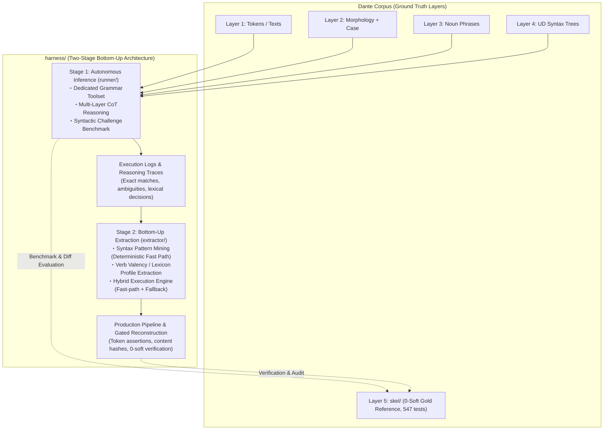

# Grammar Agent Harness: Overall Architecture & Master Plan

## 1. Overview & Paradigm Shift: Generalizable Layer 5 Reconstruction

`harness/` is a dedicated **Grammar Agent Harness for Local LLMs** (e.g., **Gemma 4 31B**), designed to systematically reconstruct Layer 5 predicate-argument skeletons (`skel/`) from multi-layer grammatical contexts (Layer 1 text/tokens, quotes hierarchy, Layer 2 morphology, pronoun case annex, Layer 3 noun phrase spans, and Layer 4 Universal Dependencies syntax trees).

### Motivation & Rationale
1. **Historical Context & Limitations of `skel/`**:
   - Layer 5 (`skel/`) was historically constructed through Phases 5–7 using an interactive, semi-manual process: a frontier LLM (Claude Opus 5, later switched to Gemini 3.7 Flash at the end of Phase 8) and human operators iteratively triaged outlier positions to formulate 130 deterministic rules (Rules A–EI).
   - Although this successfully produced a 100% clean corpus (**0 hard / 0 soft violations across all 100 cantos**, 547 pytest passing), the **construction methodology itself was ad hoc, bespoke to Dante's Italian, and insufficiently automated**.
   - As a result, the Phase 5–8 methodology cannot be directly generalized to other texts, genres, or languages (such as Latin).
2. **Mission of `harness/`**:
   - `harness/` solves this limitation by creating a **reproducible, fully automated, and generalizable reconstruction pipeline**.
   - Preserving `skel/` as an **immutable Gold Standard (Ground Truth)** for benchmark evaluation, `harness/` demonstrates how local LLMs can autonomously project Layer 4 UD syntax onto predicate-argument frames (Stage 1) and empirically induce syntax rules and valency lexicons (Stage 2).



---

## 2. Two-Stage Bottom-Up Strategy

In contrast to the top-down methodology used in Phases 5–8 (where frontier LLMs deduced abstract rules applied top-down in local environments), `harness/` adopts an empirical **bottom-up strategy (instance-level inference ➔ pattern induction)**.

### Stage 1: Autonomous Local Inference & Capability Benchmark (`harness/runner/`)
- **Approach**: For each parse unit, the agent receives the multi-layer context (L1–L4, quotes, case) and autonomously solves predicate-argument frames on the fly using Chain-of-Thought (CoT) and a dedicated Tool Calling API (`validate_candidate`, etc.).
- **Objectives**:
  - Quantitatively benchmark local LLM capabilities (1-shot exact match rate, multi-turn self-correction convergence rate, role-level F1) against the 0-soft Gold Standard (`skel/`).
  - Capture comprehensive execution logs, successful syntax projections, and lexical decision traces (e.g., argument vs. adjunct discrimination, reflexive pronouns, control verbs).
- **Specification**: [`harness/runner/PLAN.md`](runner/PLAN.md).

### Stage 2: Bottom-Up Rule & Lexicon Extraction (`harness/extractor/`)
- **Approach**: Mine and aggregate the reasoning logs and decision trajectories from Stage 1 to:
  1. Extract stable, deterministic Universal Dependencies patterns as **Syntax Fast-Path Rules**.
  2. Aggregate verb-preposition-case co-occurrences into an empirical **Verb Valency Lexicon**.
  3. Construct a **Hybrid Execution Engine** combining deterministic fast paths (rules + lexicon) with fallback to Stage 1 agent inference for ambiguous or rare contexts.
- **Objectives**:
  - Maximize cross-corpus consistency and reduce inference latency and token overhead (targeting >80% fast-path coverage).
  - Provide a gated production pipeline that reconstructs cantos under strict 0-soft regression verification and content hash updating.
- **Specification**: [`harness/extractor/PLAN.md`](extractor/PLAN.md).

---

## 3. Directory Structure & Separation of Concerns

```
dante-corpus/
├── skel/                          # [Protected] Layer 5 Gold TSV & Phase 8 Deterministic Engine
│   ├── RULES.md                   # 130 Deterministic Rule Handbook (Reference)
│   └── ...                        # Active 0-Soft Regression Gate Target
│
├── harness/                       # [Isolated] Grammar Agent Harness & Extraction Lab
│   ├── PLAN.md                    # Master Plan (Architecture & Two-Stage Strategy)
│   │
│   ├── runner/                    # [Stage 1] Autonomous Inference Agent & Benchmark
│   │   ├── PLAN.md                # Stage 1 Specification (Toolset, Agent, Benchmark)
│   │   ├── tools.py               # Dedicated Grammar Tool API (read, search, validate)
│   │   ├── agent.py               # Gemma 4 31B Multi-Turn CoT Loop
│   │   ├── prompts.py             # 5-Step Grammatical Reasoning Protocol Prompts
│   │   └── benchmark.py           # Syntactic Challenge & Historical Case Evaluation Suite
│   │
│   ├── extractor/                 # [Stage 2] Rule & Lexicon Extraction & Hybridization
│   │   ├── PLAN.md                # Stage 2 Specification (Mining, Lexicon, Hybrid Engine)
│   │   ├── syntax_miner.py        # Syntax Pattern Mining Engine
│   │   ├── lexicon_builder.py     # Verb Valency & Lexicon Profile Aggregator
│   │   ├── hybrid_engine.py       # Fast Path (Rules/Lexicon) + Fallback (Agent) Router
│   │   └── reconstruct.py         # Canto-Wide Gated Reconstruction Pipeline
│   │
│   └── fixtures/                  # Benchmark Challenge Fixtures & Historical Case Units
│       └── challenge_cases.py     # Syntactic Challenge Fixtures (Hyperbaton, Control, Quotes)
```

---

## 4. Standing Invariants & Disciplines

1. **Strict Masking of Gold Layer 5**:
   - `runner/` agents are strictly forbidden access to gold `skel/*.tsv`, the 130-rule registry, and historical correction records ([`CORRECTIONS.md`](../skel/CORRECTIONS.md)).
2. **No Free-Form Bash Execution**:
   - Agents operate strictly via closed, structured Tool Calling (`tools.py`) without shell execution privileges.
3. **Preservation of the 0-Soft Regression Gate**:
   - Benchmark and evaluation modes operate strictly in-memory or write to scratch buffers; gold TSVs in `skel/` are never overwritten during benchmark runs.
4. **Upstream Discrepancy Channel**:
   - Discrepancies identified in upstream layers (Layer 2 morphology or Layer 4 UD syntax) are emitted as structured `upstream_feedback` records for human audit and triage.
