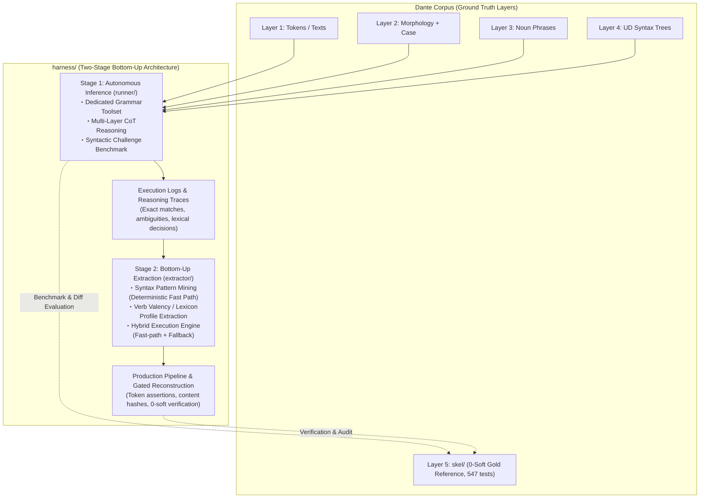

# Grammar Agent Harness: Overall Architecture & Master Plan

## Handoff — resume here

Temporary notes for the next session; durable state lives in **Current Status**
and the **Milestone Ledger** below.

**Next action — Stage 3: write the compaction/pacing design.** Stage 2 is
CLOSED (2026-08-24; recheck readout in [`STAGE2.md`](STAGE2.md)), and the
Stage-3 opening analysis (**record S3.1** in the Milestone Ledger) is
COMPLETE (2026-08-25). Measured headline: corrected input accounting
(additive `context+new`) puts the single stream at 6.0k tok/min average —
**3 × average = 112% of the 16k tok/min ceiling** (the launch gate fails on
averages outright, before peaks: 3 wall-minutes at 107–115% solo, rolling-60s
max 132%, max single call 94% solo). The burst is structural — turn-2
validator-feedback turns (15–20.6 kB tool results atop ~30 kB grown contexts)
sent 0–20 ms after the previous response stack 86–158% of the solo ceiling
into single minutes — while the 7 measured backoffs are stochastic
rolling-window contact, not localizable and not session-length-bound (the
pilot's 9.4% tax was one unit's 800-s episode; Spearman 0.41 run-to-run).
The design's input parameters are therefore fixed by S3.1: unit-context
floor 11.8 kB/call, summary budget ≲ 2 kB, validator-feedback cap ~4 kB
(→ any call ≤ ~28% solo, ×3 average 68–79%), and pacing sized to break the
fast-pair stack (min inter-send 35–60 s per stream or a global ~11k tok/min
bucket across streams; today's gaps are 0–20 ms). Deliverable:
the design + gate re-check (3 × compacted average ≤ 16k tok/min with
margin, peak call ≤ ~30% solo), then the three-parallel-stream launch.
Standing constraint unchanged: compaction changes session semantics —
designed between runs, never mid-run.

The single streaming log also carries the request-level cost records (shipped
post-pilot 2026-08-24, live-proven by the recheck): the fallback appends one
`llm_request`/`llm_response` JSONL pair per backend LLM call — timestamp,
model, session/unit coordinates, attempt, context/new/output UTF-8 byte
sizes, duration — join key `(session, messages, attempt)`; 429/quality
retries inside `Client` stay transparent to the wire records, counted by the
`wait_retry` counters and correlated by timestamp. They are canto-scoped like
every other record: never replayed into aggregates, kept by resume compaction
exactly for completed cantos. Wall clock rides the records the same way:
every `canto_complete` carries `elapsed_seconds` and the summary sums them
into `wall_clock_seconds` (idle gaps between resumed attempts never count).

**99-canto expansion — Stage 3 deployment, three canticle-parallel runs**
(live agent fallback; launched only after the compaction/pacing design passes
the TPM gate — parallel bounds wall clock by the longest canticle, ~34 ×
6.4 ks ≈ 230 ks ≈ 2.5–3 days, *if* the quota holds). Three concurrent
operator shells, one per canticle, each with its own log — resume stays
canto-granular and independent per file:

```bash
uv run python -m harness.extractor.reconstruct --canticle inferno --all \
    --verify-gold --model google:gemma-4-31b-it \
    --log harness/recon-inferno.log
# likewise --canticle purgatorio → harness/recon-purgatorio.log
# and    --canticle paradiso  → harness/recon-paradiso.log
```

Watch items carried from the closed Stage-2 runs (both inferno-1 runs, see
[`STAGE2.md`](STAGE2.md)): the fast-routed unit fails Gate 2 (routing
`complete` ≠ checker-clean); agent-originated hard violations (`dup`
self-citation, `position` (0,0)) surface only through the checker; quota tax
varies run-to-run (9.4% pilot vs 2.5% recheck — burst contact with the TPM
ceiling, not steady pressure).

1. **Read first**: [`extractor/PLAN.md`](extractor/PLAN.md) (§3–§5), then
   [`../ARCHITECTURE.md`](../ARCHITECTURE.md) §4–§6 (observability + log
   contract; `reconstruct.py` already ships it incl. resume).
   The Stage-1→2 interface stays the trace contract:
   `UnitResult.trace_record()` (`runner/agent.py`) embedded as `"trace"` in
   every benchmark case record. The hybrid seam is callable-level:
   `HybridEngine.run_unit(..., fallback=agent_fallback(model=...))`;
   `reconstruct.main(..., fallback=...)` accepts an injected callable for
   deterministic work.
2. **Mining inputs — four complete 87-case JSONL run logs on disk** (all
   gitignored, disk-only; regenerate rather than re-mine if lost):
   M1.4 originals (`harness/bench-unit.log`, `harness/bench-predicate.log`)
   plus the instrumented re-runs (`harness/bench-unit-retry.log`,
   `harness/bench-predicate-retry.log`; finished 2026-08-24). The engine's
   `mine_artifacts()` regenerates rule table + lexicon from them in seconds;
   no mined artifact needs to be frozen on disk.
3. **Error structure to mine around** (details in
   [`STAGE1.md`](STAGE1.md), M1.4 entries):
   systematic gold-convention divergence on verbless frames dominates
   `historical` misses; bare-`obl` over-assignment (74 fps) and `xcomp`
   over-generation are the top noise sources; `obl:di` / `obl:in` recall
   0.54–0.60 fed lexicon_builder directly (140 frames at 100% consistency
   mined, incl. fare+di / avere+di / sedere+in — see [`STAGE2.md`](STAGE2.md),
   M2.2 Ledger entry).
   The 31 well-formed unit-side `upstream_feedback` records await HUMAN
   triage — never auto-retag.
4. **Boundaries that hold**: `extractor/` consumes traces + operator-side
   gold (`skel.io`) like `benchmark.py` does; agent-side masking (§4 item 1)
   applies to anything that runs *as* an agent — the engine's execution face
   and `reconstruct.py`'s execution/commit faces never open gold at all
   (adversarially tested), only evaluation faces (`evaluate_fast_path`,
   `--verify-gold`) do; `fixtures/challenge_cases.py` stays data-only. Tests
   live at repo root (`tests/test_harness_*.py`). `skel/` is protected:
   reconstruction writes need the explicit `--write` flag on top of passing
   all three gates, canto-atomically.
5. **Session housekeeping (2026-08-25, this session)**: assistant session ran
    the Stage-3 opening analysis (S3.1, Milestone Ledger) — deterministic
    log work over `harness/recon-inf1-recheck.log` (+ unit-level pilot
    cross-check), correcting the M2.5 input accounting (additive context+new:
    3 × average = 112% of ceiling), localizing the burst mechanism to the
    turn-2 validator-feedback pairing, and resolving the pilot-vs-recheck
    tax anchor (stochastic bursts; Spearman 0.41). Docs-only; tests
    untouched at 833 passed. (Prior session, 2026-08-24: operator ran the
    M2.5 recheck — readout passed all criteria, reproduced the pilot,
    failed the Stage-3 launch gate; Stage 2 closed and archived to
    [`STAGE2.md`](STAGE2.md), cross-references updated.) Next: Stage 3's
    compaction/pacing design from S3.1's measured parameters.

---

## Current Status

- [x] **Stage 1 — Autonomous Inference & Capability Benchmark: COMPLETE**
      (toolcall T1–T5 + milestones 1.1–1.4 incl. the instrumented re-runs).
      XML protocol adopted as official wire format (probe 0.957 ≥ 0.95,
      parity interop 24/24 twice); 87-case benchmarks run for BOTH workflows
      at quality parity (micro F1 0.711 unit vs 0.708 predicate; default
      `unit`); traces pooled for Stage 2 mining. Record archived 2026-08-24:
      milestones, ledger, and carry-over resolutions in
      [`STAGE1.md`](STAGE1.md); protocol ledger in
      [`TOOLCALL.md`](TOOLCALL.md) §8.
- [x] **Stage 2 — Rule & Lexicon Extraction** (`harness/extractor/`,
      milestones 2.1–2.5): COMPLETE (2026-08-24). Deterministic mining
      delivered 183 fast-path rules at 100% precision (31.4% gold coverage)
      and a 140-frame verb valency lexicon; the hybrid engine's fast path
      covers only 7.0% of units, so agent fallback is the primary path;
      the gated reconstruction pipeline verified live on inferno 1 twice
      (pilot + recheck): 18/34 units gate-pass each run, verify-gold micro
      F1 0.78 / 0.796 ≥ the Stage-1 band, `written_cantos == 0` protection
      confirmed both times. The recheck's request-granularity readout closed
      the quota question and **failed the Stage-3 launch gate**
      (compaction/pacing required). Record archived 2026-08-24:
      milestones, ledger, carry-overs, and the pilot/recheck readouts in
      [`STAGE2.md`](STAGE2.md); spec in [`extractor/PLAN.md`](extractor/PLAN.md).
- [ ] **Stage 3 — Context Optimization & Full-Corpus Scale-Out**
      (OPENED 2026-08-24 when the M2.5 recheck closed Stage 2): first task
      DONE (2026-08-25) — the context-growth × 429 correlation analysis
      (record S3.1 in the Milestone Ledger): corrected accounting puts
      3 × single-stream average at **112%** of the ceiling (gate fails on
      averages outright), the burst is the structural turn-2
      validator-feedback pairing sent back-to-back (0–20 ms gaps), and the
      7 backoffs are stochastic rolling-window contact (pilot's 9.4% = one
      unit's episode; Spearman 0.41). Next: the compaction/pacing design
      from S3.1's measured parameters (floor 11.8 kB/call, summary ≲ 2 kB,
      feedback cap ~4 kB, min inter-send 35–60 s or global ~11k tok/min
      bucket), then the gate re-check, then the 99-canto three-parallel
      expansion + corpus-wide readout (Handoff). The standing constraint
      holds: compaction changes session semantics — design first, never
      mid-run.
- Open design question (protocol layer): a dedicated `submit_candidate`
  termination tool — the practical half is resolved by the nudge policy
  ([`STAGE1.md`](STAGE1.md) carry-over 3); tracked as
  [`TOOLCALL.md`](TOOLCALL.md) §7.1.
- Open operational issue (2026-08-23, predicate full run): long agent contexts
  trip the Gemini API's per-model input-token quota (`gemma-4-31b` paid tier:
  16k input tokens/min) — 429 RESOURCE_EXHAUSTED with ~50 s backoffs becomes
  frequent past ~10 turns, because every loop turn resends the whole transcript
  and the predicate workflow accumulates turns fast. Candidate mitigations
  (undecided): local Ollama backend for long sessions (same XML wire format, no
  TPM ceiling — but the ~3× figure was calibrated on short probe/unit-mode
  sessions; with long transcripts every request pays full local prefill, so the
  penalty compounds roughly quadratically with turn count and may far exceed
  3×), client-side pacing, or a transcript-compaction policy (changes session
  semantics — design first, never mid-benchmark). Measurement: llm7shi's
  auto-retry hides these failures from artifacts; since 2026-08-23 the
  `HarnessStatusLine` stream counts them (`api_retries` / `api_retry_seconds`
  in case records and summaries).   `turn_seconds` still absorbs the wait time,
  so quota-affected turns inflate slow-turn counts unless read together with
  the retry counters. Measured on the predicate full run (first instrumented
  run): 103 backoffs / 3,526 s across 40 of 87 cases, worst session 14
   backoffs / 670 s over 19 turns; excluding backoff, its compute matched the
   unit run (~18.8 ks vs 18.7 ks) — the entire +19% wall clock was quota wait.
     Re-measured 2026-08-24 on both instrumented re-runs (Client adapter):
     predicate 103 backoffs / 3,196 s across 47 of 87 cases (14.4% of wall)
     reproduces the tax; the unit side is now measured for the first time at
     55 backoffs / 1,659 s across 36 of 87 cases (8.4%) — half the predicate's
     absolute quota wait, consistent with shorter unit sessions crossing the
     per-minute ceiling less often. Compute-only totals nearly equal: unit
      ≈18.1 ks vs predicate ≈19.0 ks (+5%). Measured 2026-08-24 at request
      granularity by the post-extension inferno-1 recheck (readout in
      [`STAGE2.md`](STAGE2.md), M2.5-recheck entry): single-stream average
      input ≈ 5.1k tokens/min (32% of ceiling) but bursty — peak minutes
      ≈ 16.3k tokens ≈ 102% of ceiling solo; 61% of input bytes are
      transcript resends; 3 × single-stream exceeds the ceiling even on
      averages — **the launch gate failed: compaction/pacing is required
      before the three-parallel-stream expansion**, and this issue's
      mitigation decision moves from open to Stage 3 design work.
      Stage-3 analysis update (2026-08-25, S3.1): corrected additive
      accounting raises the solo average to 6.0k tok/min (3 × = 112% of
      ceiling), the burst is the structural turn-2 validator-feedback
      pairing (0–20 ms inter-send gaps), and the backoff tax is stochastic
      rolling-window contact — see the Milestone Ledger for the design
      parameters.
- Test suite: **833 passed** (547 corpus + 41 `test_harness_tools.py` +
  76 `test_harness_toolcall.py` + 32 `test_harness_agent.py` +
  39 `test_harness_benchmark.py` + 23 `test_harness_syntax_miner.py` +
  17 `test_harness_lexicon_builder.py` + 27 `test_harness_hybrid_engine.py` +
  31 `test_harness_reconstruct.py`).

---

## Milestone Ledger

*Stage-1 records (toolcall T1–T5, milestones 1.1–1.4 + carry-over
resolutions) live in [`STAGE1.md`](STAGE1.md) and [`TOOLCALL.md`](TOOLCALL.md)
§8; the completed Stage-2 record — milestones 2.1–2.5 incl. the inferno-1
pilot and the closing recheck readout — was split off on 2026-08-24 to
[`STAGE2.md`](STAGE2.md). This plan keeps only status and standing sections;
new milestone records accrue here per stage and move out at each archive
split.*

**Stage 3, record S3.1 — context-growth × 429 correlation analysis over
`recon-inf1-recheck.log`: COMPLETE (2026-08-25, deterministic log work,
assistant-run).** The Stage-3 opening task: localize the recheck's 7 backoffs
(162 s) against transcript growth and minute-bucket rates, and resolve the
pilot-9.4% vs recheck-2.5% anchor. Method: the 103 request/response pairs
joined on `(session, messages, attempt)`; input accounted additively
(`context_bytes + new_bytes`); generation baseline r0 = total output /
compute = 13.9 B/s; rolling-60 s windows alongside wall minutes. Analysis
script ephemeral (deterministic over the gitignored log; method above
re-derives every number).

- **Accounting correction to the M2.5 readout — its gate conclusion
  unchanged, now stronger.** The readout's "input" summed `context_bytes`
  only (1,919.7 kB); the physical request input is additive: **2,239.8 kB**
  total, of which replayed context = **85.7%**. The readout's "61%
  (1,167 kB)" reconciles exactly: Σcontext − Σ final-call contexts =
  1,167.0 kB, the intermediate-call replay share of Σcontext. Corrected
  solo rates: average **21.0 kB/min ≈ 6.0k tok/min ≈ 37%** of the 16k
  ceiling — **3 × average = 112%**: the Stage-3 launch gate fails on
  averages outright, not only peaks. Peaks: 3 wall-minutes over the solo
  ceiling (115 / 113 / 107%), rolling-60 s max **132%**, 14 calls with
  rolling window ≥ 100%, max single call **52.8 kB ≈ 15.1k tok ≈ 94% of the
  ceiling alone**.
- **The burst mechanism is structural, not stochastic.** Intra-session sends
  fire **0–20 ms** after the previous response (raw timestamps: the client
  streams the next request the moment a response lands), and the tripping
  shape is the **turn-2 validator-feedback turn**: its `new_bytes` are the
  run's five largest messages (15.0–20.6 kB; `new` p50 254 B / p90 8.3 kB),
  layered on a grown context (e.g. S24#2: ctx 30.3 kB + new 18.7 kB). All
  **15 calls ≥ 30 kB input are turn-2+ retries**; paired 12→38–53 kB — and
  S10/S24/S29 pairing again at #3 (S10: 53 + 35 kB = 158%) — they stack
  **86–158% of the solo ceiling into single minutes**. Two size levers
  follow: transcript replay *and* validator-feedback size (the tool result
  is harness-generated; its bloat is our choice, not the model's).
- **Backoff non-localization — the honest negative result.** The 7 backoffs
  / 162 s cannot be attributed from wire durations: naive duration-excess
  (duration − output/r0) sums 630 s over the top-10 calls — generation-rate
  variance (per-call rate quartiles 7.6–19.5 B/s) dwarfs the ~23 s/backoff
  quanta. The 14 over-ceiling calls flowed at or above average rate
  (excesses −79…+48 s; the run's three biggest inputs generated at
  16.7–21.8 B/s), and the 11 slow small first-calls (>30 s for ~114 B
  output) sat at 21–81% rolling windows — no quota contact. Pilot anchor
  resolved: Spearman(pilot, recheck unit seconds) = **0.41** over 33 units
  (work-driven floor, run-to-run noise dominant), and the pilot's entire
  +630 s tax is one unit's episode (986 s pilot → 186 s recheck; the +800 s
  outlier). The tax is **stochastic rolling-window burst contact**:
  mitigation is keeping the stream under the ceiling by construction (size +
  spacing), never reacting to 429s.
- **Measured parameters handed to the compaction/pacing design.** Fixed
  per-call floor = unit context **11.8 kB** (irreducible L1–L4 payload).
  Counterfactuals (floor + summary S + `new`): S=0 → ×3 average **77%** of
  ceiling, S=1 82%, S=2 87%, S=4 98% — the summary budget must stay
  ≲ 2 kB. Capping validator feedback at ~4 kB (measured counterfactual:
  Σnew 320 → 147 kB) bounds any call at ~15.8 kB ≈ 4.5k tok ≈ **28% solo**
  and holds ×3 average at **68%** (S=0) to 79% (S=2 with cap). Pacing
  faces measured 0–20 ms inter-send gaps and self-pacing big calls (firsts
  4–91 s, median 23.5; big turn-2s 70–212 s), so it only needs to break the
  fast-pair stack: a min inter-send interval of 35–60 s per stream, or a
  global token bucket (~11k tok/min across 3 streams), trading bounded wall
  clock (median session = 3 calls ⇒ +70–120 s/session worst case) for
  ceiling margin. The design decides; these are its inputs.

---

## 1. Overview & Paradigm Shift: Generalizable Layer 5 Reconstruction

`harness/` is a dedicated **Grammar Agent Harness for Local LLMs** (e.g., **Gemma 4 31B**), designed to systematically reconstruct Layer 5 predicate-argument skeletons (`skel/`) from multi-layer grammatical contexts (Layer 1 text/tokens, quotes hierarchy, Layer 2 morphology, pronoun case annex, Layer 3 noun phrase spans, and Layer 4 Universal Dependencies syntax trees).

### Motivation & Rationale
1. **Historical Context & Limitations of `skel/`**:
   - Layer 5 (`skel/`) was historically produced by a **small local LLM**
     (`ollama:gemma4:31b-it-qat`, pinned in `model.mk`) driving the driver's
     `--fix` regeneration loop; its residual errors were then triaged through an
     interactive, semi-manual process in which a frontier LLM (Claude Opus 5,
     later switched to Gemini 3.7 Flash at the end of Phase 8) and human
     operators read the outlier positions to formulate 130 deterministic rules
     (Rules A–EI) and hand-apply the corrections recorded in
     [`CORRECTIONS.md`](../skel/CORRECTIONS.md).
   - Throughout, the small model was granted **no autonomy**: it ran on rails
     laid down by the larger model — executing repairs inside a checker/rule
     system it did not shape, with everything beyond those rails escalated to
     the frontier-LLM/human triage loop.
   - Although this successfully produced a 100% clean corpus (**0 hard / 0 soft violations across all 100 cantos**, 547 pytest passing), the **construction methodology itself was ad hoc, bespoke to Dante's Italian, and insufficiently automated**.
   - As a result, the Phase 5–8 methodology cannot be directly generalized to other texts, genres, or languages (such as Latin).
2. **Mission of `harness/`**:
   - The gist of `harness/` is to grant the local model that missing **autonomy**: remove the hand-laid rails and let it reason from linguistic first principles, deciding its own path through multi-layer context and closed tools instead of executing rules handed down by a larger model.
   - `harness/` embeds this autonomous agent in a **reproducible, fully automated, and generalizable reconstruction pipeline**.
   - Preserving `skel/` as an **immutable Gold Standard (Ground Truth)** for benchmark evaluation, `harness/` demonstrates how local LLMs can autonomously project Layer 4 UD syntax onto predicate-argument frames (Stage 1) and empirically induce syntax rules and valency lexicons (Stage 2).



---

## 2. Staged Strategy: Bottom-Up Core + Scale-Out

In contrast to the top-down methodology used in Phases 5–8 — where frontier LLMs deduced abstract rules that the local executor then followed mechanically, without autonomy of its own — `harness/` hands agency to the local model and adopts an empirical **bottom-up strategy (instance-level inference ➔ pattern induction)** across Stages 1–2, with Stage 3 as the operational scale-out.

### Stage 1: Autonomous Local Inference & Capability Benchmark (`harness/runner/`)
- **Approach**: For each parse unit, the agent receives the multi-layer context (L1–L4, quotes, case) and autonomously solves predicate-argument frames on the fly using Chain-of-Thought (CoT) and a dedicated Tool Calling API (`validate_candidate`, etc.).
- **Objectives**:
  - Quantitatively benchmark local LLM capabilities (1-shot exact match rate, multi-turn self-correction convergence rate, role-level F1) against the 0-soft Gold Standard (`skel/`).
  - Capture comprehensive execution logs, successful syntax projections, and lexical decision traces (e.g., argument vs. adjunct discrimination, reflexive pronouns, control verbs).
- **Specification**: [`harness/runner/PLAN.md`](runner/PLAN.md).

### Stage 2: Bottom-Up Rule & Lexicon Extraction (`harness/extractor/`)
- **Approach**: Mine and aggregate the reasoning logs and decision trajectories from Stage 1 to:
  1. Extract stable, deterministic Universal Dependencies patterns as **Syntax Fast-Path Rules**.
  2. Aggregate verb-preposition-case co-occurrences into an empirical **Verb Valency Lexicon**.
  3. Construct a **Hybrid Execution Engine** combining deterministic fast paths (rules + lexicon) with fallback to Stage 1 agent inference for ambiguous or rare contexts.
- **Objectives**:
  - Maximize cross-corpus consistency and reduce inference latency and token overhead (targeting >80% fast-path coverage).
  - Provide a gated production pipeline that reconstructs cantos under strict 0-soft regression verification and content hash updating.
- **Specification**: [`harness/extractor/PLAN.md`](extractor/PLAN.md).
- **Status**: COMPLETE (2026-08-24); record archived in
  [`STAGE2.md`](STAGE2.md) — the >80% fast-path target measured MISS at
  7.0%, so agent fallback remains the primary path and the gated pipeline's
  honest output is protection.

### Stage 3: Context Optimization & Full-Corpus Scale-Out (opened 2026-08-24)

Opened when the M2.5 recheck closed Stage 2. First task DONE (2026-08-25):
the context-growth × 429 correlation analysis (record S3.1 in the Milestone
Ledger) — corrected accounting puts 3 × single-stream average at 112% of the
16k tok/min ceiling (launch gate fails on averages outright), the burst is
the structural turn-2 validator-feedback pairing sent back-to-back, and the
backoffs are stochastic rolling-window contact. Next act: the
compaction/pacing design *between* runs from S3.1's measured parameters
(unit-context floor 11.8 kB/call, summary ≲ 2 kB, validator-feedback cap
~4 kB, min inter-send 35–60 s or a global ~11k tok/min bucket), then the
gate re-check, then the 99-canto expansion as three canticle-parallel runs
behind the existing gates, and the corpus-wide readout. Scope and constraints
tracked in Current Status + the Handoff; no code or spec exists yet.

### Beyond Layer 5 (design notes)

Directions that open up **after** the `skel/` reconstruction — a layer swap
(same machinery, different target layer), a vertical whole-stack slice, and the
horizon of reconstructing grammar for a language with no available description
— are kept out of this plan in [`FUTURE.md`](FUTURE.md). None of it is
scheduled work; `PLAN.md` remains the source of truth for status and
milestones.

### Transport & backend policy

Decision record (2026-08-22): measured at roughly 3× the local speed, **XML
(`PromptXmlTransport`) was adopted as the official wire format for Stage 1/2
production runs; native Ollama tool calling (`OllamaNativeTransport`) stays
implemented and gated for comparison experiments** (re-run
`harness.toolcall.parity` when revisiting local-only deployments). Backend
choice remains free: `google:gemma-4-31b-it` when wall clock matters,
`ollama:gemma4:31b-it-qat` for offline/cost-constrained work — both validated
end-to-end over the XML protocol during the T4/T5 gates.

Adapter policy (2026-08-24): the stateful `llm7shi.Client` adapter is the
common model-access specification; the stateless probe/parity adapters and the
skel drivers' disposable-Client pattern are legacy from the trial-and-error
phase. The standing rules live in [`../ARCHITECTURE.md`](../ARCHITECTURE.md)
(§2 Model access, §3 Wire protocol).

---

## 3. Separation of Concerns

The directory map lives in [`README.md`](README.md#directory-structure) —
single source, not duplicated here. The boundaries it encodes:

- **`skel/` is protected, not a dependency.** Gold TSVs, the 130-rule registry,
  and [`CORRECTIONS.md`](../skel/CORRECTIONS.md) are the evaluation reference
  and are masked from agents structurally (§4 item 1); only operator-side
  benchmark code reads them.
- **`toolcall/` is a layer- and task-agnostic protocol library.** It knows
  nothing about grammar: wire format, transports, and the multi-turn loop only.
  Everything grammatical lives in `runner/`.
- **`runner/` (Stage 1) produces traces; `extractor/` (Stage 2) consumes
  them.** The contract between the stages is `UnitResult.trace_record()`, not
  shared internals.
- **`fixtures/` is data, read operator-side only.** Nothing under `runner/`
  imports it, so the agent path cannot see the benchmark's case selection.
- **Tests live at the repo root** (`tests/test_harness_*.py`) alongside the
  corpus suite, so the harness stays inside one pytest run.

---

## Environment & Artifacts (reference)

- **Python always runs through `uv`** (`uv run python ...`, `uv run pytest ...`);
  never invoke a bare `python3`. Every command below follows this.
- **Session division of labor**: assistant sessions execute deterministic,
  LLM-free work only (tests, extraction/mining, artifact inspection); every
  LLM-in-the-loop command (the probe / parity / benchmark / agent /
  reconstruction CLIs) is run by the human operator, not by the assistant.
- Live probe: `uv run python -m harness.toolcall.probe --model <model> --repeat N --log
  harness/probe.log` — streaming JSONL: one scenario record per completed scenario,
  summary record last (a log without the summary line = interrupted run);
  `*.log` is gitignored.
- Migration parity check (T5, live run PASSED 2026-08-22): `uv run python -m
  harness.toolcall.parity
  --model <model> [--repeat N] [--log harness/parity.log]` — same log semantics;
  hard gate = canonical interop on both transports.
- Single-unit session CLI (live smoke tests): `uv run python -m harness.runner.agent
  --canticle inferno --canto 1 --line-start 1 [--line-end N] [--trace trace.jsonl]`.
- Benchmark CLI (milestone 1.3): `uv run python -m harness.runner.benchmark [--category
  C]... [--case-id ID]... [--limit N] [--list] [--log bench.log] [--full-transcript]`.
  An existing `--log` resumes: completed cases reload into the aggregate and are
  skipped; the summary sums per-session durations across all attempts.

---

## 4. Standing Invariants & Disciplines

1. **Strict Masking of Gold Layer 5**:
   - `runner/` agents are strictly forbidden access to gold `skel/*.tsv`, the 130-rule registry, and historical correction records ([`CORRECTIONS.md`](../skel/CORRECTIONS.md)).
2. **No Free-Form Bash Execution**:
   - Agents operate strictly via closed, structured Tool Calling (`tools.py`) without shell execution privileges.
3. **Preservation of the 0-Soft Regression Gate**:
   - Benchmark and evaluation modes operate strictly in-memory or write to scratch buffers; gold TSVs in `skel/` are never overwritten during benchmark runs.
4. **Upstream Discrepancy Channel**:
   - Discrepancies identified in upstream layers (Layer 2 morphology or Layer 4 UD syntax) are emitted as structured `upstream_feedback` records for human audit and triage.
5. **Live-Run Observability & Log Durability**:
   - LLM-in-the-loop runs are inherently slow (minutes per turn on local
     models, hours per benchmark), and an unwatchable run is an unusable run:
     every operator-facing CLI must keep progress **visible by default**, not
     silent-until-finished.
    - The standing specification — stderr streaming, session separators and the
      optional `HarnessStatusLine` status bar, per-turn timings rolled into
      summaries (`turn_seconds`, `slow_turns`, `api_retries`), turn-granularity
      discipline, log durability independent of shell redirection, and the
      streaming JSONL log contract with its summary-last completion marker and
      resume semantics — lives in [`../ARCHITECTURE.md`](../ARCHITECTURE.md)
      (§4 Live-run observability, §5 Streaming JSONL log contract, §6 Reporting
      shape). It is a standing requirement, not a one-off patch: new live entry
      points (Stage 2's `extractor/` CLIs included) must ship it from day one,
      keep the human-facing progress display on stderr by convention (JSONL
      logs go to their own `--log` files, never to redirected console output),
      and any future transport must preserve it.
    - The concrete wiring — status-bar labeling (Canticle Canto Line),
      markup-disabled shared console, the model-access layer sharing that
      stream, `wait_retry` snapshot/delta accounting, and the new-`Client`
      blank-line spacing — is the ARCHITECTURE.md §4 standard itself now, not
      a pattern restated per plan; `reconstruct.py` (2026-08-24) is where it
      first shipped end-to-end and stays the template to copy.
