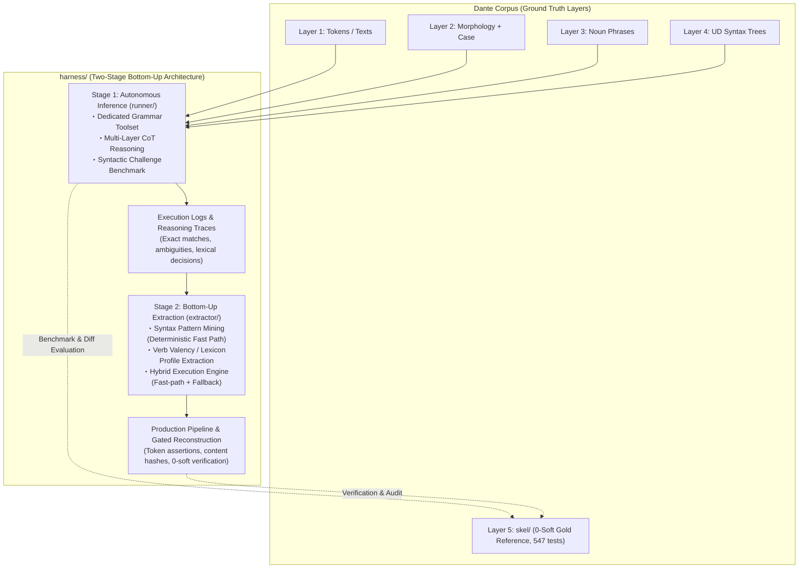

# Grammar Agent Harness: Overall Architecture & Master Plan

## 1. Overview & Paradigm Shift: Generalizable Layer 5 Reconstruction

`harness/` is a dedicated **Grammar Agent Harness for Local LLMs** (e.g., **Gemma 4 31B**), designed to systematically reconstruct Layer 5 predicate-argument skeletons (`skel/`) from multi-layer grammatical contexts (Layer 1 text/tokens, quotes hierarchy, Layer 2 morphology, pronoun case annex, Layer 3 noun phrase spans, and Layer 4 Universal Dependencies syntax trees).

### Motivation & Rationale
1. **Historical Context & Limitations of `skel/`**:
   - Layer 5 (`skel/`) was historically constructed through Phases 5–7 using an interactive, semi-manual process: a frontier LLM (Claude Opus 5, later switched to Gemini 3.7 Flash at the end of Phase 8) and human operators iteratively triaged outlier positions to formulate 130 deterministic rules (Rules A–EI).
   - Although this successfully produced a 100% clean corpus (**0 hard / 0 soft violations across all 100 cantos**, 547 pytest passing), the **construction methodology itself was ad hoc, bespoke to Dante's Italian, and insufficiently automated**.
   - As a result, the Phase 5–8 methodology cannot be directly generalized to other texts, genres, or languages (such as Latin).
2. **Mission of `harness/`**:
   - `harness/` solves this limitation by creating a **reproducible, fully automated, and generalizable reconstruction pipeline**.
   - Preserving `skel/` as an **immutable Gold Standard (Ground Truth)** for benchmark evaluation, `harness/` demonstrates how local LLMs can autonomously project Layer 4 UD syntax onto predicate-argument frames (Stage 1) and empirically induce syntax rules and valency lexicons (Stage 2).



---

## 1.5 Current Status & Handoff (2026-08-22)

### Handoff — read this first

**Where we are.** The Tool Call Protocol sub-project ([`TOOLCALL.md`](TOOLCALL.md)) is
complete (**T1–T5 done, both gates PASSED** — T4 live probe and the T5 live parity run
over `ollama:gemma4:31b-it-qat` with interop 24/24 checks) and is wired into
Stage 1: **Milestone 1.2 (`runner/agent.py` + `runner/prompts.py`) is complete**, so a
full autonomous grammar session runs end-to-end on top of the gated protocol,
**Milestone 1.3 (`runner/benchmark.py` + `fixtures/challenge_cases.py`) is complete**:
the evaluation harness scores finished sessions against the 0-soft Gold Standard with
the §5.2 metric suite over a curated 87-case fixture table.

**Transport policy (2026-08-22).** The Gemini API executes the XML protocol roughly 3x
faster than local Ollama, so **XML (`PromptXmlTransport`) is the officially adopted
wire format for Stage 1/2 production runs; native Ollama tool calling
(`OllamaNativeTransport`) stays implemented and gated but is reserved for comparison
experiments** (re-run `harness.toolcall.parity` when revisiting local-only deployments).
Backend choice remains free: `google:gemma-4-31b-it` when wall clock matters,
`ollama:gemma4:31b-it-qat` for offline/cost-constrained work — both ride the same XML
protocol unchanged.

All live CLIs (`probe` / `parity` / `benchmark` / `runner.agent`) now print one stderr
progress line per model turn (label, turn counter, each call's compact return value via
`toolcall.outcome_brief`, elapsed seconds), announce each session with its
`[index/total]` position (`progress_separator`), and stream the native path's output as
it arrives (`ollama_chat(echo=True)` through llm7shi's `StreamProcessor`, so native
turns show the same 🤔 Thinking / 💡 Answer display as llm7shi does on the XML side);
every JSONL record / trace carries per-turn wall-clock durations (`turn_seconds`) for
post-run profiling. This is codified as standing invariant **§4 item 5** — future live
CLIs (Stage 2 included) inherit it.

**Next action — milestone 1.4 evaluation runs (operator-run):**
> **Session close 2026-08-22 (final):** the Tool Call Protocol sub-project is declared
> **implementation-complete as specified** — T1–T5 done, both live gates PASSED (probe
> 0.957; parity interop 24/24 twice), transport policy recorded (XML official, native
> comparison-only), live-run observability codified as standing invariant §4 item 5.
> No further toolcall work is scheduled. Suite frozen at **711 passed** — nothing below
> needs further implementation; the next session starts
> by running the two pilots, comparing wall-clock/turns/`predicate_first_pass_rate`,
> then committing to a workflow for the full runs. Note `*.log` files are gitignored:
> `harness/bench-strict-validator-baseline.log` and `harness/parity.log` exist on disk
> only.
> **Watch items for milestone 1.4**: (a) the native-only empty-response pattern seen in
> parity run 2 (`validate_candidate#1/#3` native ended on one no-call empty turn) —
> track occurrence rate in benchmark logs; the runner's nudge policy should recover
> these, but they must not silently inflate failure metrics without attribution;
> (b) keep measuring parse success inside benchmark runs per carry-over 2 below.
- **Pilot first, both workflows**: the first live run (interrupted after 4 cases,
  preserved as `harness/bench-strict-validator-baseline.log`) exposed a structural
  validator defect (carry-over 4) and motivated an A/B workflow comparison. Before the
  full 87-case commitment, run a small pilot per mode and compare cost/behavior:
  `uv run python -m harness.runner.benchmark --model ollama:gemma4:31b-it-qat \
   --workflow unit --case-id hist-inf14-124 --case-id hist-inf22-097 --log pilot-unit.log`
  and the same with `--workflow predicate` (expect more turns; give it `--max-turns 24`).
  The predicate mode validates one predicate per call and is scored as each
  predicate's latest submission; its fine-grained signal is the pooled
  `predicate_first_pass_rate`. Unit-level `convergence_rate` keeps its ≤5-turn
  semantics, so multi-predicate predicate-mode sessions legitimately stay below it.
  hist-inf14-124 is the unit whose upstream_feedback complaint exposed carry-over 4;
  under the fixed validator its gold rows validate cleanly, so it doubles as the
  regression check for the fix.
- Then the full runs (one log file per attempt — the CLI truncates on startup;
  roughly 6–9 h per workflow mode on the local 31B model, or ~3x faster via the
  Gemini API under the adopted XML protocol — see Transport policy):
  `uv run python -m harness.runner.benchmark --model <model> --workflow <mode> \
   --log bench-<mode>.log`.
- ~~Optionally, while at it: the T5 live parity check over the same model~~ — DONE,
  twice (2026-08-22). Run 1: interop 24/24 checks PASS, observational names-equal 7/12,
  rows-equal 6/12, xml 29 turns/18 calls vs native 31 turns/19 calls, ~148 min total.
  Run 2 (first with per-turn timings): interop 24/24 again; native +32% wall clock,
  fully explained by extra validation turns rather than transport cost, plus a
  native-only empty-response pattern to watch in milestone 1.4 — details in
  [`TOOLCALL.md`](TOOLCALL.md) T5. Bring-up fix: `parity.resolve_ollama_model` strips
  the provider prefix for the native transport. Outcome: XML adopted as the official
  wire format; native kept for comparison experiments only.
- Keep measuring parse success inside benchmark runs: the T4 gate margin was thin
  (47 turns at 0.957 vs 0.95, wide binomial CI), so treat it as still under
  observation, not permanently closed. Every case record carries per-session
  parse-success turn counts for pooled re-checks.

**Carry-over issues from live probing** (details in [`TOOLCALL.md`](TOOLCALL.md) T4):
1. ~~**Few-shot echo contamination**~~ — RESOLVED in 1.2: `runner/prompts.py` ships its
   own demonstration exchange with deliberately non-colliding content (a foreign-lemma
   search returning an empty hit list); nothing fixture-shaped remains to echo.
2. **Gate margin is thin** — STILL OPEN as a measurement discipline (see next action).
3. ~~**No-call turns happen**~~ — RESOLVED in 1.2 via the nudge policy in
   `agent.run_unit`: a final answer with zero successful `validate_candidate` dispatches
   earns up to one protocol reminder (resuming the same transcript through a fresh loop
   run under the shared turn budget); give-ups *after* failed validations are never
   nudged so convergence metrics stay honest. This resolves the practical half of
   TOOLCALL.md §7.1 for Stage 1 — `validate_candidate` doubles as the acceptance gate;
   a dedicated `submit_candidate` termination tool stays open at the protocol layer.
4. ~~**Validator rejects gold-correct complement rows**~~ — RESOLVED (2026-08-22,
   after the first live run): the interrupted benchmark surfaced a model
   `upstream_feedback` report proving `validate_candidate`'s citation rule rejected
   gold-style rows (`elli ccomp←sai`, `sai ccomp←tondo`, `de' xcomp←addur`). Root
   cause: the implementation applied the NP-head/pronoun requirement to *every*
   argument, while the spec (`runner/PLAN.md` §3.3 item 2, and the agent prompt) scopes
   it to **nominal** arguments. A corpus-wide scan put 71% of all rejections on
   non-nominal roles (ccomp/xcomp/attr anchor on predicate tokens by nature; bare
   `obl` is gold's adverbial marker). Fix: `tools.requires_nominal_anchor()` — the
   requirement now covers only subj/obj/iobj/obl:<prep>; clausal roles and bare obl
   pass with existence checks; `word` anchors became optional (~40% smaller calls).
   Residual: nominal-role rows whose anchors are genuinely non-nominal (clausal
   subjects etc.) still reject — measured at 527 rows / 1.7% of anchored nominal rows,
   touching ~100 of 3477 parse units; these stay documented ceilings funneled through
   upstream_feedback rather than spec-violating over-reach.
5. **Submission granularity** — OPEN as an A/B measurement question: whole-unit
   submission (workflow `unit`) vs per-predicate interleaved validation (workflow
   `predicate`; scored via per-predicate-latest accumulation + `predicate_first_pass_rate`).
   The first live run showed unit-mode sessions carrying long CoT plus one large
   validate call per correction cycle; decide the default from the pilot runs above.

**Environment & artifacts.**
- Wire format: XML protocol (`PromptXmlTransport`) — official for all Stage 1/2 runs
  (see Transport policy above). Native Ollama transport: comparison experiments only.
- Models: `google:gemma-4-31b-it` (Gemini API, ~3x faster — preferred when wall clock
  matters) and `ollama:gemma4:31b-it-qat` (local, offline/cost-constrained); both are
  validated end-to-end over the XML protocol.
- Live probe: `uv run python -m harness.toolcall.probe --model <model> --repeat N --log
  harness/probe.log` — streaming JSONL: one scenario record per completed scenario,
  summary record last (a log without the summary line = interrupted run);
  `*.log` is gitignored.
- Migration parity check (T5, live run PASSED 2026-08-22): `uv run python -m
  harness.toolcall.parity
  --model <model> [--repeat N] [--log harness/parity.log]` — same log semantics; hard
  gate = canonical interop on both transports.
- Single-unit session CLI (live smoke tests): `uv run python -m harness.runner.agent
  --canticle inferno --canto 1 --line-start 1 [--line-end N] [--trace trace.jsonl]`.
- Benchmark CLI (milestone 1.3): `uv run python -m harness.runner.benchmark [--category
  C]... [--case-id ID]... [--limit N] [--list] [--log bench.log] [--full-transcript]`.
- Test suite: **711 passed** (547 pre-existing + 41 `test_harness_tools.py` +
  74 `tests/test_harness_toolcall.py` + 23 `tests/test_harness_agent.py` +
  26 `tests/test_harness_benchmark.py`).

### Milestone ledger

**Milestone 1.1 — Dedicated Grammar Tool API (`runner/tools.py`): COMPLETE.**

- `GrammarToolkit` serves multi-layer context (L1 tokens/texts, quotes hierarchy, L2
  morphology, pronoun case annex, L3 noun phrases, L4 UD trees) through three closed tools,
  with Layer 5 masked **structurally**: `tools.py` never imports `skel.io` / `skel.registry`
  and no code path opens a file under `skel/`.
  - `read_unit`: parse-unit snapping via `dep.sentence_groups` (`MAX_UNIT_LINES = 12`);
    boundary-crossing ranges are rejected with the actual unit bounds.
  - `search_corpus`: conjunctive `word` / `lemma` / `pos` / `deprel` / `case` search with an
    **Anti-Leakage Guard** excluding the active canto (tracked toolkit state, not model-supplied).
  - `validate_candidate`: intrinsic well-formedness — predicate existence + word anchors,
    L3 NP-head / pronoun citations, slot uniqueness with clitic licensing (multi-slot case
    annex rows), frozen role vocabulary — plus an `upstream_feedback` discrepancy log.
  - Tool-call layer: `TOOL_SPECS` / `tool_specs()` (OpenAI-function JSON Schema, prompt-ready)
    and `GrammarToolkit.dispatch()` (accepts dict or JSON-string arguments, coerces numeric
    strings, never raises into the loop — errors return as structured payloads).
- Tests: `tests/test_harness_tools.py` — 36 deterministic tests incl. poisoning
  `skel.io.load_skel` / `skel.registry.rule_active` to prove masking.

**Tool Call Protocol sub-project (`harness/toolcall/`) — T1–T5 COMPLETE, BOTH LIVE GATES
PASSED (T4 probe, T5 parity).**

Gemma cannot use native tool calling on the Gemini API path and its structured output is
unreliable there, so the interim protocol is prompt-instructed `<tool_call>` blocks (one
JSON object per block) converted into OpenAI-compatible tool-call dicts; native Ollama
tool calling is a pure transport swap (`OllamaNativeTransport`, T5). Deliverables:
parser/formatter (`parser.py`), prompt contract + few-shot (`prompts.py`), transports
(`transports.py`), transport-agnostic loop (`loop.py`), live-probe CLI (`probe.py`),
migration-parity CLI (`parity.py`); 74 deterministic tests in
`tests/test_harness_toolcall.py`. Live probing motivated a wire-format simplification
from nested tags to one JSON object per block ([`TOOLCALL.md`](TOOLCALL.md) §3.1);
**final-format pooled run on `google:gemma-4-31b-it` (--repeat 5): 20 scenarios, 47
turns, parse success rate 0.957 ≥ 0.95 gate**, 0 hallucinated tools, 0 dispatch errors,
both observed failure classes benign and prompt-side.

**T5 — Native Transport & Migration Parity (`toolcall/transports.py`,
`toolcall/parity.py`): COMPLETE — live parity run PASSED (2026-08-22).**

- `OllamaNativeTransport` drives an injected chat backend (`(messages, tools) -> message`;
  the library core still never imports ollama — the live adapter lives in
  `parity.ollama_chat` over `ollama.chat(tools=...)`). `normalize_tool_calls` converts
  ollama-style tool-call objects/dicts into canonical dicts with compact JSON-string
  arguments; anything malformed surfaces as a structured error envelope, never a raise.
  Because the loop keeps only assistant *text* in transcripts, the transport re-attaches
  each session turn's calls when rebuilding requests (per-conversation ledger keyed by
  transcript identity; opening-prompt demo turns untouched; nudged resumes start fresh
  transcripts and keep text-only pre-nudge history — documented limitation).
- `parser.format_tool_call(call)` is the canonical→wire inverse; together with
  `parse_tool_calls` it backs the §5.3 interop criterion.
- `parity.py`: runs every probe scenario through both transports (fresh toolkit per
  session; XML side gets contract + demo, native side bare specs). Hard gate = canonical
  round-trip interop on both sides (`ParityReport.parity_pass`); observational =
  call-name sequences + final candidate rows. Streaming JSONL log mirrors the probe.
- **Live verdict (2026-08-22, `ollama:gemma4:31b-it-qat`, `--repeat 3`)**: 12 scenarios,
  interop 24/24 checks — PASS; names-equal 7/12, rows-equal 6/12 (observational);
  xml turns=29/calls=18 vs native turns=31/calls=19, 0 parse errors, 0 exhausted,
  ~148 min wall clock. Bring-up fix: `resolve_ollama_model` strips the CLI provider
  prefix before it reaches the native transport. **Second run** (first with per-turn
  `turn_seconds`): interop 24/24 again; native +32% wall clock fully explained by extra
  validation turns (matched turns are equally fast) plus a native-only empty-response
  pattern; observational equality fluctuates between runs (names 5/12, rows 4/12).
  **Adoption decision: XML is the official wire format (Gemini API ≈3x faster than
  local); native stays for comparison experiments.**
- Tests: 25 new deterministic tests (normalization, history re-attachment, ledger
  isolation, round-trip property, end-to-end stubbed parity); suite total 688 passed.

**Milestone 1.2 — Agent Runner (`harness/runner/agent.py`, `runner/prompts.py`): COMPLETE.**

- `runner/prompts.py`: per-unit system prompt = role intro + skeleton-row conventions +
  the 5-step reasoning protocol (quotes → predicates/agreement → case/UD → NP/control →
  validate & self-correct) + `toolcall.xml_contract_section()` +
  `toolcall.tool_specs_section(TOOL_SPECS)`; `unit_task(...)` opens each session; a
  non-colliding few-shot demo replaces the probe's 'cammin' exchange (T4 carry-over 1).
- `runner/agent.py`: `run_unit(...)` drives one parse-unit session through
  `toolcall.run_tool_loop` over a `PromptXmlTransport` (proven `llm7shi_generate`
  adapter copied from `probe.py`); no-call nudge policy as described in the Handoff;
  `UnitResult` wraps the loop's final text / outcome envelopes / full transcript and
  derives candidate rows (re-parsed from the last `validate_candidate` submission),
  validation outcomes, upstream-feedback records, compliance flags, and a
  Stage-2-ready `trace_record()`; operator CLI (`python -m harness.runner.agent`) for
  live single-unit smoke runs with optional JSONL trace.
- Tests: `tests/test_harness_agent.py` — 18 deterministic tests over `StubTransport` +
  the real toolkit and prompts: prompt assembly, nudge policy (nudge-once-then-converge,
  no nudge on capability give-up or exhaustion, shared turn budget), transcript-derived
  candidate rows, trace round-trip, adapter forwarding.

**Milestone 1.3 — Benchmark Suite (`harness/runner/benchmark.py`,
`harness/fixtures/challenge_cases.py`): COMPLETE.**

- `fixtures/challenge_cases.py`: 87 curated challenge cases, frozen as verbatim data
  (mined deterministically from the corpus at authoring time): 48 **historical** units
  hosting positions from `skel/CORRECTIONS.md` censuses (§P15 residue closure,
  §P13 spurious clausal complements, §P5 verbless speech frames) plus balanced core
  categories across all three canticles — control (`xcomp`), coordination, relative
  chains (≥2 `acl:relcl`), quotes, and hyperbaton (argument cited ≥45 linear tokens
  from its predicate). Coordinates only; no gold rows are stored, and nothing under
  `runner/` reads the fixtures.
- `runner/benchmark.py`: `evaluate_unit` scores a finished session against gold read
  operator-side (`skel.io.load_skel`; agent-side masking untouched) on row keys
  `(line, token, role, arg_line, arg_token)` restricted to unit bounds; per-unit record
  carries exact-first / exact-final / converged (`CONVERGENCE_TURN_BUDGET = 5`),
  missing/extra diffs, malformed and out-of-unit counts, upstream-feedback
  form-validity precision, and probe-style parse-success turn stats.
  `BenchmarkReport` aggregates the §5.2 suite: one-shot exact-match rate, convergence
  rate, role-level P/R/F1 (per-label + micro/macro), upstream feedback precision,
  pooled parse success vs the 0.95 gate, and per-category breakdowns; streaming JSONL
  CLI mirrors `probe.py` log semantics (case records flushed as they complete,
  summary last).
- Agent-side support: `UnitResult` gained `submissions` / `first_candidate_rows`
  (1-shot metric reads the first submission), plus `opening_len` / `session_messages`
  so turn-level consumers skip the few-shot demo exchange in the opening prompt.
- Tests: `tests/test_harness_benchmark.py` — 22 deterministic tests over
  `StubTransport` + real gold data (fixture integrity incl. sentence-group snapping,
  gold comparison, probe-semantics parse stats, metric aggregation, streaming sink);
  suite total 663 passed.

**Remaining milestones**: 1.4 evaluation execution & trace collection (operator-run;
see the Handoff for the exact commands) — the T5 live parity run is done (both protocol
gates PASSED). Open design question:
§7.1 termination tool (practical half resolved by the nudge policy — see Handoff).
After 1.4 traces exist, Stage 2 (`harness/extractor/`, milestones 2.1–2.5 in
[`extractor/PLAN.md`](extractor/PLAN.md)) is next.

---

## 2. Two-Stage Bottom-Up Strategy

In contrast to the top-down methodology used in Phases 5–8 (where frontier LLMs deduced abstract rules applied top-down in local environments), `harness/` adopts an empirical **bottom-up strategy (instance-level inference ➔ pattern induction)**.

### Stage 1: Autonomous Local Inference & Capability Benchmark (`harness/runner/`)
- **Approach**: For each parse unit, the agent receives the multi-layer context (L1–L4, quotes, case) and autonomously solves predicate-argument frames on the fly using Chain-of-Thought (CoT) and a dedicated Tool Calling API (`validate_candidate`, etc.).
- **Objectives**:
  - Quantitatively benchmark local LLM capabilities (1-shot exact match rate, multi-turn self-correction convergence rate, role-level F1) against the 0-soft Gold Standard (`skel/`).
  - Capture comprehensive execution logs, successful syntax projections, and lexical decision traces (e.g., argument vs. adjunct discrimination, reflexive pronouns, control verbs).
- **Specification**: [`harness/runner/PLAN.md`](runner/PLAN.md).

### Stage 2: Bottom-Up Rule & Lexicon Extraction (`harness/extractor/`)
- **Approach**: Mine and aggregate the reasoning logs and decision trajectories from Stage 1 to:
  1. Extract stable, deterministic Universal Dependencies patterns as **Syntax Fast-Path Rules**.
  2. Aggregate verb-preposition-case co-occurrences into an empirical **Verb Valency Lexicon**.
  3. Construct a **Hybrid Execution Engine** combining deterministic fast paths (rules + lexicon) with fallback to Stage 1 agent inference for ambiguous or rare contexts.
- **Objectives**:
  - Maximize cross-corpus consistency and reduce inference latency and token overhead (targeting >80% fast-path coverage).
  - Provide a gated production pipeline that reconstructs cantos under strict 0-soft regression verification and content hash updating.
- **Specification**: [`harness/extractor/PLAN.md`](extractor/PLAN.md).

---

## 3. Directory Structure & Separation of Concerns

```
dante-corpus/
├── skel/                          # [Protected] Layer 5 Gold TSV & Phase 8 Deterministic Engine
│   ├── RULES.md                   # 130 Deterministic Rule Handbook (Reference)
│   └── ...                        # Active 0-Soft Regression Gate Target
│
├── harness/                       # [Isolated] Grammar Agent Harness & Extraction Lab
│   ├── PLAN.md                    # Master Plan (Architecture, Two-Stage Strategy, Handoff)
│   ├── TOOLCALL.md                # Tool Call Protocol Sub-Project (XML interim → native)
│   │
│   ├── toolcall/                  # [Protocol Library] XML interim ↔ canonical tool calls
│   │   ├── parser.py              # parse_tool_calls / format_tool_call / format_tool_result (T1)
│   │   ├── prompts.py             # XML output contract + few-shot exchange (T2)
│   │   ├── transports.py          # Transport interface, PromptXml / OllamaNative / Stub (T5)
│   │   ├── loop.py                # Transport-agnostic loop + turn budget (T3)
│   │   ├── probe.py               # Live-probe CLI for the §5.2 gate (T4, operator-run)
│   │   └── parity.py              # Migration-parity CLI, XML vs native (§5.3/T5, operator-run)
│   │
│   ├── runner/                    # [Stage 1] Autonomous Inference Agent & Benchmark
│   │   ├── PLAN.md                # Stage 1 Specification (Toolset, Agent, Benchmark)
│   │   ├── tools.py               # Dedicated Grammar Tool API — IMPLEMENTED (Milestone 1.1)
│   │   ├── agent.py               # Per-unit session runner over run_tool_loop — IMPLEMENTED (Milestone 1.2)
│   │   ├── prompts.py             # 5-Step Grammatical Reasoning Protocol Prompts — IMPLEMENTED (Milestone 1.2)
│   │   └── benchmark.py           # Gold Comparison & §5.2 Metric Suite — IMPLEMENTED (Milestone 1.3)
│   │
│   ├── extractor/                 # [Stage 2] Rule & Lexicon Extraction & Hybridization
│   │   ├── PLAN.md                # Stage 2 Specification (Mining, Lexicon, Hybrid Engine)
│   │   ├── syntax_miner.py        # Syntax Pattern Mining Engine
│   │   ├── lexicon_builder.py     # Verb Valency & Lexicon Profile Aggregator
│   │   ├── hybrid_engine.py       # Fast Path (Rules/Lexicon) + Fallback (Agent) Router
│   │   └── reconstruct.py         # Canto-Wide Gated Reconstruction Pipeline
│   │
│   └── fixtures/                  # Benchmark Challenge Fixtures & Historical Case Units
│       ├── __init__.py            # Public fixture accessors — IMPLEMENTED (Milestone 1.3)
│       └── challenge_cases.py     # Frozen 87-Case Table (historical/control/coordination/
│                                  #   relative_chain/quotes/hyperbaton) — IMPLEMENTED (1.3)
│
└── tests/
    ├── test_harness_tools.py      # Toolset unit tests (masking, anti-leakage, validation)
    ├── test_harness_toolcall.py   # Tool-call protocol tests (parser, transports, loop)
    ├── test_harness_agent.py      # Runner tests (nudge policy, submissions, traces)
    └── test_harness_benchmark.py  # Benchmark tests (gold comparison, metrics, fixtures)
```

---

## 4. Standing Invariants & Disciplines

1. **Strict Masking of Gold Layer 5**:
   - `runner/` agents are strictly forbidden access to gold `skel/*.tsv`, the 130-rule registry, and historical correction records ([`CORRECTIONS.md`](../skel/CORRECTIONS.md)).
2. **No Free-Form Bash Execution**:
   - Agents operate strictly via closed, structured Tool Calling (`tools.py`) without shell execution privileges.
3. **Preservation of the 0-Soft Regression Gate**:
   - Benchmark and evaluation modes operate strictly in-memory or write to scratch buffers; gold TSVs in `skel/` are never overwritten during benchmark runs.
4. **Upstream Discrepancy Channel**:
   - Discrepancies identified in upstream layers (Layer 2 morphology or Layer 4 UD syntax) are emitted as structured `upstream_feedback` records for human audit and triage.
5. **Live-Run Observability — separators & streaming**:
   - LLM-in-the-loop runs are inherently slow (minutes per turn on local models, hours per benchmark), and an unwatchable run is an unusable run: every operator-facing CLI must keep progress **visible by default**, not silent-until-finished.
   - Concretely (implemented in `toolcall.loop`): stream model output to stderr as it arrives (llm7shi does this natively on the XML path; `parity.ollama_chat(echo=True)` replays it via llm7shi's `StreamProcessor` on the native path); print one stderr progress line per turn with each call's compact return value (`outcome_brief`) and elapsed seconds (`progress_printer`); announce every session with its `[index/total]` position via major `=====` separators and divide named passes inside a session with minor `-----` ones (`progress_separator` / `progress_subseparator`). Per-turn wall-clock durations ride in the JSONL logs (`turn_seconds`) for post-run profiling.
   - This is a standing requirement, not a one-off patch: new live entry points (Stage 2's `extractor/` CLIs included) must ship the same observability from day one, all human-facing output goes to stderr so JSONL logs stay machine-clean, and any future transport must preserve it.
