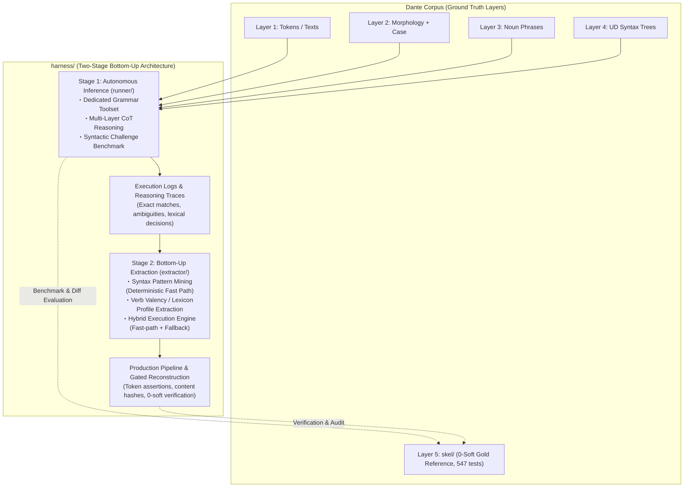

# Grammar Agent Harness: Overall Architecture & Master Plan

## 1. Overview & Paradigm Shift: Generalizable Layer 5 Reconstruction

`harness/` is a dedicated **Grammar Agent Harness for Local LLMs** (e.g., **Gemma 4 31B**), designed to systematically reconstruct Layer 5 predicate-argument skeletons (`skel/`) from multi-layer grammatical contexts (Layer 1 text/tokens, quotes hierarchy, Layer 2 morphology, pronoun case annex, Layer 3 noun phrase spans, and Layer 4 Universal Dependencies syntax trees).

### Motivation & Rationale
1. **Historical Context & Limitations of `skel/`**:
   - Layer 5 (`skel/`) was historically constructed through Phases 5–7 using an interactive, semi-manual process: a frontier LLM (Claude Opus 5, later switched to Gemini 3.7 Flash at the end of Phase 8) and human operators iteratively triaged outlier positions to formulate 130 deterministic rules (Rules A–EI).
   - Although this successfully produced a 100% clean corpus (**0 hard / 0 soft violations across all 100 cantos**, 547 pytest passing), the **construction methodology itself was ad hoc, bespoke to Dante's Italian, and insufficiently automated**.
   - As a result, the Phase 5–8 methodology cannot be directly generalized to other texts, genres, or languages (such as Latin).
2. **Mission of `harness/`**:
   - `harness/` solves this limitation by creating a **reproducible, fully automated, and generalizable reconstruction pipeline**.
   - Preserving `skel/` as an **immutable Gold Standard (Ground Truth)** for benchmark evaluation, `harness/` demonstrates how local LLMs can autonomously project Layer 4 UD syntax onto predicate-argument frames (Stage 1) and empirically induce syntax rules and valency lexicons (Stage 2).



---

## 1.5 Current Status & Handoff (2026-08-22)

### Handoff — read this first

**Where we are.** The Tool Call Protocol sub-project ([`TOOLCALL.md`](TOOLCALL.md)) is
complete through its live-probe gate (**T1–T4 done, GATE PASSED**) and is wired into
Stage 1: **Milestone 1.2 (`runner/agent.py` + `runner/prompts.py`) is complete**, so a
full autonomous grammar session runs end-to-end on top of the gated protocol.

**Next action — milestone 1.3 `runner/benchmark.py`:**
- Consume `UnitResult` from `agent.run_unit(...)`: it already carries everything the
  benchmark needs — final text, outcome envelopes, full transcript, candidate rows
  parsed back from the last `validate_candidate` submission, validation outcomes,
  protocol-compliance flags (`protocol_complete`, `valid_seen`, `nudges`,
  `exhausted`) — plus `trace_record()` for Stage 2 mining.
- Curate the challenge fixtures (`harness/fixtures/challenge_cases.py`) and compare
  candidates against the 0-soft Gold Standard per Stage-1 plan §5.2 metrics
  (1-shot exact match, multi-turn convergence ≤ 5 turns, role-level F1,
  upstream-feedback precision).
- **Keep measuring parse success inside benchmark runs**: the T4 gate margin was thin
  (47 turns at 0.957 vs 0.95, wide binomial CI), so treat it as still under
  observation, not permanently closed.

**Carry-over issues from live probing** (details in [`TOOLCALL.md`](TOOLCALL.md) T4):
1. ~~**Few-shot echo contamination**~~ — RESOLVED in 1.2: `runner/prompts.py` ships its
   own demonstration exchange with deliberately non-colliding content (a foreign-lemma
   search returning an empty hit list); nothing fixture-shaped remains to echo.
2. **Gate margin is thin** — STILL OPEN as a measurement discipline (see next action).
3. ~~**No-call turns happen**~~ — RESOLVED in 1.2 via the nudge policy in
   `agent.run_unit`: a final answer with zero successful `validate_candidate` dispatches
   earns up to one protocol reminder (resuming the same transcript through a fresh loop
   run under the shared turn budget); give-ups *after* failed validations are never
   nudged so convergence metrics stay honest. This resolves the practical half of
   TOOLCALL.md §7.1 for Stage 1 — `validate_candidate` doubles as the acceptance gate;
   a dedicated `submit_candidate` termination tool stays open at the protocol layer.

**Environment & artifacts.**
- Default model: `ollama:gemma4:31b-it-qat` (Gemini path `google:gemma-4-31b-it` also
  validated end-to-end).
- Live probe: `uv run python -m harness.toolcall.probe --model <model> --repeat N --log
  harness/probe.log` — streaming JSONL: one scenario record per completed scenario,
  summary record last (a log without the summary line = interrupted run);
  `*.log` is gitignored.
- Single-unit session CLI (live smoke tests): `uv run python -m harness.runner.agent
  --canticle inferno --canto 1 --line-start 1 [--line-end N] [--trace trace.jsonl]`.
- Test suite: **639 passed** (547 pre-existing + 36 `test_harness_tools.py` +
  38 `tests/test_harness_toolcall.py` + 18 `tests/test_harness_agent.py`).

### Milestone ledger

**Milestone 1.1 — Dedicated Grammar Tool API (`runner/tools.py`): COMPLETE.**

- `GrammarToolkit` serves multi-layer context (L1 tokens/texts, quotes hierarchy, L2
  morphology, pronoun case annex, L3 noun phrases, L4 UD trees) through three closed tools,
  with Layer 5 masked **structurally**: `tools.py` never imports `skel.io` / `skel.registry`
  and no code path opens a file under `skel/`.
  - `read_unit`: parse-unit snapping via `dep.sentence_groups` (`MAX_UNIT_LINES = 12`);
    boundary-crossing ranges are rejected with the actual unit bounds.
  - `search_corpus`: conjunctive `word` / `lemma` / `pos` / `deprel` / `case` search with an
    **Anti-Leakage Guard** excluding the active canto (tracked toolkit state, not model-supplied).
  - `validate_candidate`: intrinsic well-formedness — predicate existence + word anchors,
    L3 NP-head / pronoun citations, slot uniqueness with clitic licensing (multi-slot case
    annex rows), frozen role vocabulary — plus an `upstream_feedback` discrepancy log.
  - Tool-call layer: `TOOL_SPECS` / `tool_specs()` (OpenAI-function JSON Schema, prompt-ready)
    and `GrammarToolkit.dispatch()` (accepts dict or JSON-string arguments, coerces numeric
    strings, never raises into the loop — errors return as structured payloads).
- Tests: `tests/test_harness_tools.py` — 36 deterministic tests incl. poisoning
  `skel.io.load_skel` / `skel.registry.rule_active` to prove masking.

**Tool Call Protocol sub-project (`harness/toolcall/`) — T1–T4 COMPLETE, GATE PASSED.**

Gemma cannot use native tool calling on the Gemini API path and its structured output is
unreliable there, so the interim protocol is prompt-instructed `<tool_call>` blocks (one
JSON object per block) converted into OpenAI-compatible tool-call dicts; native Ollama
tool calling later is a pure transport swap (`OllamaNativeTransport`, T5, deferred).
Deliverables: parser/formatter (`parser.py`), prompt contract + few-shot (`prompts.py`),
transports (`transports.py`), transport-agnostic loop (`loop.py`), live-probe CLI
(`probe.py`); 38 deterministic tests in `tests/test_harness_toolcall.py`. Live probing
motivated a wire-format simplification from nested tags to one JSON object per block
([`TOOLCALL.md`](TOOLCALL.md) §3.1); **final-format pooled run on `google:gemma-4-31b-it`
(--repeat 5): 20 scenarios, 47 turns, parse success rate 0.957 ≥ 0.95 gate**, 0
hallucinated tools, 0 dispatch errors, both observed failure classes benign and
prompt-side.

**Milestone 1.2 — Agent Runner (`harness/runner/agent.py`, `runner/prompts.py`): COMPLETE.**

- `runner/prompts.py`: per-unit system prompt = role intro + skeleton-row conventions +
  the 5-step reasoning protocol (quotes → predicates/agreement → case/UD → NP/control →
  validate & self-correct) + `toolcall.xml_contract_section()` +
  `toolcall.tool_specs_section(TOOL_SPECS)`; `unit_task(...)` opens each session; a
  non-colliding few-shot demo replaces the probe's 'cammin' exchange (T4 carry-over 1).
- `runner/agent.py`: `run_unit(...)` drives one parse-unit session through
  `toolcall.run_tool_loop` over a `PromptXmlTransport` (proven `llm7shi_generate`
  adapter copied from `probe.py`); no-call nudge policy as described in the Handoff;
  `UnitResult` wraps the loop's final text / outcome envelopes / full transcript and
  derives candidate rows (re-parsed from the last `validate_candidate` submission),
  validation outcomes, upstream-feedback records, compliance flags, and a
  Stage-2-ready `trace_record()`; operator CLI (`python -m harness.runner.agent`) for
  live single-unit smoke runs with optional JSONL trace.
- Tests: `tests/test_harness_agent.py` — 18 deterministic tests over `StubTransport` +
  the real toolkit and prompts: prompt assembly, nudge policy (nudge-once-then-converge,
  no nudge on capability give-up or exhaustion, shared turn budget), transcript-derived
  candidate rows, trace round-trip, adapter forwarding.

**Remaining milestones**: 1.3 benchmark suite, 1.4 evaluation runs; deferred T5 native
transport parity check ([`TOOLCALL.md`](TOOLCALL.md) §5.3). Open design question: §7.1
termination tool (practical half resolved by the nudge policy — see Handoff).

---

## 2. Two-Stage Bottom-Up Strategy

In contrast to the top-down methodology used in Phases 5–8 (where frontier LLMs deduced abstract rules applied top-down in local environments), `harness/` adopts an empirical **bottom-up strategy (instance-level inference ➔ pattern induction)**.

### Stage 1: Autonomous Local Inference & Capability Benchmark (`harness/runner/`)
- **Approach**: For each parse unit, the agent receives the multi-layer context (L1–L4, quotes, case) and autonomously solves predicate-argument frames on the fly using Chain-of-Thought (CoT) and a dedicated Tool Calling API (`validate_candidate`, etc.).
- **Objectives**:
  - Quantitatively benchmark local LLM capabilities (1-shot exact match rate, multi-turn self-correction convergence rate, role-level F1) against the 0-soft Gold Standard (`skel/`).
  - Capture comprehensive execution logs, successful syntax projections, and lexical decision traces (e.g., argument vs. adjunct discrimination, reflexive pronouns, control verbs).
- **Specification**: [`harness/runner/PLAN.md`](runner/PLAN.md).

### Stage 2: Bottom-Up Rule & Lexicon Extraction (`harness/extractor/`)
- **Approach**: Mine and aggregate the reasoning logs and decision trajectories from Stage 1 to:
  1. Extract stable, deterministic Universal Dependencies patterns as **Syntax Fast-Path Rules**.
  2. Aggregate verb-preposition-case co-occurrences into an empirical **Verb Valency Lexicon**.
  3. Construct a **Hybrid Execution Engine** combining deterministic fast paths (rules + lexicon) with fallback to Stage 1 agent inference for ambiguous or rare contexts.
- **Objectives**:
  - Maximize cross-corpus consistency and reduce inference latency and token overhead (targeting >80% fast-path coverage).
  - Provide a gated production pipeline that reconstructs cantos under strict 0-soft regression verification and content hash updating.
- **Specification**: [`harness/extractor/PLAN.md`](extractor/PLAN.md).

---

## 3. Directory Structure & Separation of Concerns

```
dante-corpus/
├── skel/                          # [Protected] Layer 5 Gold TSV & Phase 8 Deterministic Engine
│   ├── RULES.md                   # 130 Deterministic Rule Handbook (Reference)
│   └── ...                        # Active 0-Soft Regression Gate Target
│
├── harness/                       # [Isolated] Grammar Agent Harness & Extraction Lab
│   ├── PLAN.md                    # Master Plan (Architecture, Two-Stage Strategy, Handoff)
│   ├── TOOLCALL.md                # Tool Call Protocol Sub-Project (XML interim → native)
│   │
│   ├── toolcall/                  # [Protocol Library] XML interim ↔ canonical tool calls
│   │   ├── parser.py              # parse_tool_calls / format_tool_result (T1)
│   │   ├── prompts.py             # XML output contract + few-shot exchange (T2)
│   │   ├── transports.py          # Transport interface, PromptXml / Stub transports
│   │   ├── loop.py                # Transport-agnostic loop + turn budget (T3)
│   │   └── probe.py               # Live-probe CLI for the §5.2 gate (T4, operator-run)
│   │
│   ├── runner/                    # [Stage 1] Autonomous Inference Agent & Benchmark
│   │   ├── PLAN.md                # Stage 1 Specification (Toolset, Agent, Benchmark)
│   │   ├── tools.py               # Dedicated Grammar Tool API — IMPLEMENTED (Milestone 1.1)
│   │   ├── agent.py               # Per-unit session runner over run_tool_loop — IMPLEMENTED (Milestone 1.2)
│   │   ├── prompts.py             # 5-Step Grammatical Reasoning Protocol Prompts — IMPLEMENTED (Milestone 1.2)
│   │   └── benchmark.py           # Syntactic Challenge & Historical Case Evaluation Suite
│   │
│   ├── extractor/                 # [Stage 2] Rule & Lexicon Extraction & Hybridization
│   │   ├── PLAN.md                # Stage 2 Specification (Mining, Lexicon, Hybrid Engine)
│   │   ├── syntax_miner.py        # Syntax Pattern Mining Engine
│   │   ├── lexicon_builder.py     # Verb Valency & Lexicon Profile Aggregator
│   │   ├── hybrid_engine.py       # Fast Path (Rules/Lexicon) + Fallback (Agent) Router
│   │   └── reconstruct.py         # Canto-Wide Gated Reconstruction Pipeline
│   │
│   └── fixtures/                  # Benchmark Challenge Fixtures & Historical Case Units
│       └── challenge_cases.py     # Syntactic Challenge Fixtures (Hyperbaton, Control, Quotes)
│
└── tests/
    ├── test_harness_tools.py      # Toolset unit tests (masking, anti-leakage, validation)
    └── test_harness_toolcall.py   # Tool-call protocol tests (parser, transports, loop)
```

---

## 4. Standing Invariants & Disciplines

1. **Strict Masking of Gold Layer 5**:
   - `runner/` agents are strictly forbidden access to gold `skel/*.tsv`, the 130-rule registry, and historical correction records ([`CORRECTIONS.md`](../skel/CORRECTIONS.md)).
2. **No Free-Form Bash Execution**:
   - Agents operate strictly via closed, structured Tool Calling (`tools.py`) without shell execution privileges.
3. **Preservation of the 0-Soft Regression Gate**:
   - Benchmark and evaluation modes operate strictly in-memory or write to scratch buffers; gold TSVs in `skel/` are never overwritten during benchmark runs.
4. **Upstream Discrepancy Channel**:
   - Discrepancies identified in upstream layers (Layer 2 morphology or Layer 4 UD syntax) are emitted as structured `upstream_feedback` records for human audit and triage.
