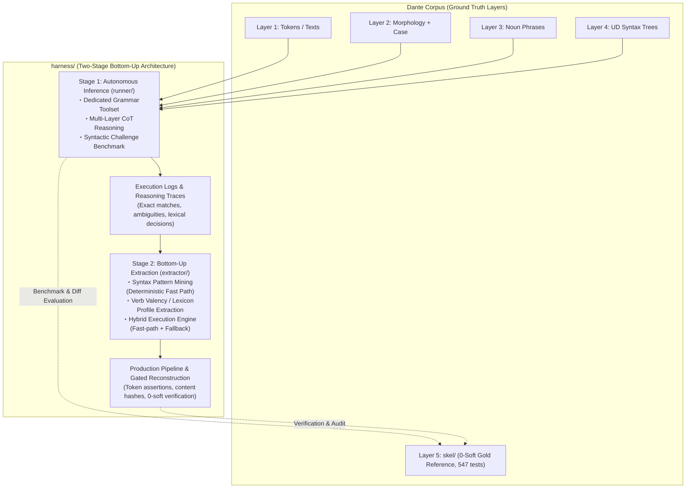

# Grammar Agent Harness: Overall Architecture & Master Plan

## Handoff — resume here

Working notes for the next session only — write what's in flight or about to
start, and clear an entry once it's been acted on. Durable state does not belong
here: it goes to **Current Status** (live numbers), **Orientation for Fresh
Sessions** (context and operational facts that outlive any stage), §2's table
(what a stage settled), or the stage's own `stages/<NN>.md` (everything else).

**STAGE 10 IS CLOSED (2026-09-07) AND IT IS THE LAST STAGE. DEVELOPMENT OF
`harness/` ENDS HERE** (operator, 2026-09-07). The work moves to
[`../layers/PLAN.md`](../layers/PLAN.md), whose subject is the layer structure
rather than one layer's contents; `harness/` becomes a library that `layers/`
drives. **Read `layers/PLAN.md` before anything here.**

**Why, in one line**: S10.4 showed the apparatus is stable, and the session that
read it out then measured the layers and found the *description* undecided at the
positions the next level would have acted on. Both findings are argued in
`layers/PLAN.md` §1; neither is repeated here.

The close itself — what Stage 10 settled, its closing numbers, what carries
forward and what ends — is [`stages/10.md`](stages/10.md) §5. Nothing about the
stage is duplicated in this file any more; §2's table row is the index entry.

### Done 2026-09-07: cut to the run and fix paths

**Before the split, `harness/` was reduced to the minimal implementation the
current `run` and `fix` are actually driven by, and everything else was
deleted** (operator instruction). This is a deletion, not a redesign: no
surviving behaviour changed except where the deletion itself is the change.

What went, and what it costs:

- **The Stage-1 per-unit tool-calling session and the protocol library under
  it** — `toolcall/` entire (parser, transports, loop, prompts, probe, parity),
  `runner/agent.py`, `runner/skills/grammar-agent/`, `tools.py`'s
  `search_corpus` / `tool_specs` / `dispatch`, the `--tool-calling` flag and
  `TOOLCALL=1`. This is §2's "slated for removal" item carried out, and it
  costs what that item said it costs: **the comparison baseline for the mode now
  in use is gone.** `runner/llm.py` is what survives of `agent.py` — the llm7shi
  adapter and the wire log, which the fixed-context loop calls. (It became
  `dante_corpus/harness/llm.py` in the split recorded below.)
- **The Stage-1 benchmark** — `runner/benchmark.py`, `fixtures/`. Its
  `candidate_keys` moved to `extractor/layers.py`, which is the only piece the
  pipeline used.
- **The Stage-2 mined fast path** — `syntax_miner.py`, `lexicon_builder.py`,
  `hybrid_engine.py`, and the `--run-log` / `--min-support` / `--rules-in`
  mining flags. **Every unit now reaches the model.** S5.7 measured the fast
  path at 7% of the corpus, so this is a behaviour change and not only a
  deletion: a fresh generation run would pay for those units in model calls. It
  also ends the startup mining phase, and with it the run path's dependence on
  the four bench logs (Orientation item 2 — the logs are kept, but nothing reads
  them now).
- **Every gold-referenced readout** — `goldeval.py`, `--verify-gold`,
  `recon/agree.py`, and `readout.py`'s F1 sections. **Gold is no longer opened
  anywhere in `harness/`**, which is where `layers/PLAN.md` §3.1 item 2 leaves
  the progress metric anyway.
- **`recon/convert.py`** (no make target since 2026-08-30, destructive over the
  committed corpus) and **`recon/repair.py`** with its `repair` /
  `repair-check` targets.

Unchanged and re-read after the cut: `make check` **0 hard / 2,982 soft**,
`make fix-level FIX=3` **225**, a settled canto still resumes off its TSV with
no model call and rewrites nothing. The suite is **734 passed** — the deleted
modules' tests went with them; no surviving test was weakened to pass.

**Live verification PASSED** (operator, 2026-09-07; read out of the logs at the
start of this session). Everything in the cut itself was deterministic — no
model was called, because assistant sessions do not call one (Environment &
Artifacts) — so what was outstanding was the path that actually reaches the
model. Both halves of it were exercised, on three concurrent streams:

- **`run` (generate)**: `inferno/01` regenerated from scratch with its TSV and
  log deleted first (Orientation item 5). **34 units, all routed `agent` with
  reason `generate`**, 0 token-assertion errors, 0 `api_retries`, 0 hard / 26
  soft, 6,071.7 s. This is the path that had no live evidence at all since S9.6.
- **`fix`**: corpus-wide `make fix` over all 100 cantos — **3,477 units, of
  which 219 reached the model** (`fix`) and the rest resumed off their TSVs with
  no model call (`already settled in the artifact`), 0 hard anywhere, 0
  `api_retries`. **14 cantos' TSVs changed** and are uncommitted in the working
  tree.

So the two seams the cut was most likely to have broken are confirmed live:
`fixedcontext.fixed_fallback` builds its model closure from `runner/llm.py`
(the deleted `runner/agent.py` is not missed; the adapter has since moved to
`dante_corpus/harness/llm.py`), and `reconstruct_canto` calls the
fallback directly rather than through the deleted engine. **The cut is
confirmed; nothing blocks the split below.** Post-run readouts are in Current
Status.

The `.md` files are kept as the record, so several of them now describe code
that is gone: `TOOLCALL.md` entire, `runner/PLAN.md` and `extractor/PLAN.md` in
large part, and every stage document by design. `README.md`'s directory map and
roadmap were brought up to date and carry the removal note; the stage documents
were not touched.

### Done 2026-09-07: the apparatus split out into `dante_corpus/harness/`

**The task, in one line: make `harness/` and the Layer-5-specific implementation
loosely coupled, then separate them** (operator, 2026-09-07), with the generic
half landing in `dante_corpus/harness/` and the tests staying at the repo root
(operator, same day). Done. The premise the split was argued from is the one
measured after the cut: **the apparatus was coupled to Layer 5 by a type it
carried, not by anything it did** — `skel.models.SkelRow` in 8 of 19 modules,
while the loop, the gates' shape, the artifact machinery and the fix verdicts
were indifferent to what a row means.

**The four seams**, which are the answer to open questions 1 and 2 above:

| seam | replaces | defined in | Layer 5's |
|---|---|---|---|
| `RowCodec` | `SkelRow`, `_row_sort_key`, the four copies of the TSV header | `harness/rows.py` | `layers.SKEL_CODEC` |
| `Subject` | `CantoLayers.load` + `candidate_keys` + `build_rows` + `validate_rows` | `harness/pipeline.py` | `layers.SKEL_SUBJECT` |
| `Criteria` | the `fixlevel` module's five entry points | `harness/fixrun.py` | the `fixlevel` module itself |
| `Observer` | `observe_rows` + `render_observations` + the dep cache | `harness/fixedcontext.py` | `observe.SkelObserver` |

Question 1 was settled **for a codec** and against both a row protocol and an
apparatus-owned row type: a protocol carries neither a constructor nor an
ordering, and an apparatus-owned type would have to be converted back at every
crossing into the subject's own code — `validate_unit` and `write_skel` take
`SkelRow` — which is the path gate 3 pins byte-exact. The codec keeps the
subject's row type flowing end to end. Question 2 was settled **injected**: the
subject hands over a validator, and what the gate *says* is untouched, because
S10.2 found those classes to be proxies and freezing them is not this
refactor's business.

**What moved**: `pipeline.py` (the canto loop), `fixedcontext.py`, `fixrun.py`,
`outcome.py`, `artifact.py`, `report.py`, `llm.py`, `skills.py`,
`statusline.py`, plus the new `rows.py`. **What stayed**: `layers.py`,
`fixlevel.py`, `observe.py`, `runner/tools.py`, `runner/prompts.py` and the
`grammar-fixed` skill files, `reconstruct.py` (gate 3, the CLI, the wiring), and
`recon/` entire. `artifact.py`, `fixrun.py` and `fixedcontext.py` survive in
`extractor/` as one-line bindings, which is what keeps every call site and test
signature unchanged — including `python -m harness.extractor.reconstruct`, whose
re-export surface is untouched, so `recon/Makefile` never learned about any of
this.

**The rule that makes it real**: nothing under `dante_corpus/harness/` imports
anything else from `dante_corpus`. `tests/test_harness_boundary.py` reads the
source with `ast` rather than checking `sys.modules`, because the imports that
would break it are function-local (`fixed_fallback`'s lazy adapter import,
`commit`'s lazy `hashes`), and because importing the package at all runs
`dante_corpus/__init__.py`. It also holds the reverse: no other `dante_corpus`
module imports the apparatus, so `llm7shi` stays off the corpus package's import
path.

**Answers to the remaining open questions above.** 3: `recon/` **stayed**, and so
did `recon/readout.py` — it has no `dante_corpus` import but hard-codes
`CANTICLE_COUNTS` and this operator's `STREAM_TPM_LIMIT`, which makes it this
corpus's readout rather than apparatus. 4: **a package in this project**, not a
separate distribution — `dante_corpus/harness/` ships with the wheel (hatchling
picks it up implicitly, `pyproject.toml` needed no change) and top-level
`harness/` deliberately does not. 5: tests stayed at the root, no file renamed,
imports rewritten, one file added. 6: still open — this document is still called
a plan.

**Read out after the split, all unchanged**: `make check` **0 hard / 2,964
soft**, `make fix-level` **0 / 0 / 210**, no committed TSV moved a byte, and a
settled canto still resumes off its TSV in 0.6 s with **zero** `llm_request`
records. The suite is **739 passed** (734 + the five boundary tests).

### Done 2026-09-08: the split is live-verified

**`run` and `fix` were both exercised on the split apparatus and PASSED**
(operator, 2026-09-07 UTC; read out of the logs at the start of the 09-08
session). This was the one thing outstanding — the deterministic half was
already proven (739 tests, the readouts above, a resume with zero `llm_request`
records), and what no test could cover was the live closure the split rewired:
the injected **system prompt**, **observer** and **toolkit**, all three bound in
`extractor/fixedcontext.py`, plus the dep cache's move into
`observe.SkelObserver`. **None of the three was broken.**

The four checks the previous session set, in its order:

1. **`skill_digest` is `ee6f1a46…` on all 101 `canto_complete` records** — one
   value, no other. $P$ is byte-identical across the split, so Standing
   Invariant §6 held and the prompt assembly did not move.
2. **The observer is live**: 240 units ran 346 iterations (174 settled on
   iteration 1, 43 took 2, 6 took 3, 17 hit the cap), and **76 units carried 162
   observations** across them — a silently empty observer would have shown as
   346 = 240 with no observation anywhere. Stop reasons: 135 `settled`, 98
   `fixed_point`, 7 `budget`.
3. **Routes are exactly as specified.** Generate: `agent` ×34, reason
   `generate` ×34. Fix: `agent`/`fix` ×206 plus `tsv`/`already settled in the
   artifact` ×3,271.
4. **0 `token_assertion_errors`, 0 hard violations, and no canto ended worse
   than it started** — checked per canto on the `fix` block's
   `soft_before`/`soft_after` and `findings_before`/`findings_after`, zero
   regressions.

The two runs themselves:

- **`run` (generate)**: `inferno/01` from scratch — 34 units, 25 soft, 0 hard,
  1 `api_retry` (15.0 s), 5,999.0 s.
- **`fix`**: corpus-wide, all 100 cantos, **3,477 units of which 206 reached the
  model**; 87 cantos carried a level-3 `fix` block, findings **211 → 206**, and
  over the units touched soft **403 → 393** — verdicts 5 `accepted`, 3
  `new_class`, 198 `no_improvement`, 7 `api_retries`.
- **Concurrency**: 46,983 s of summed `wall_clock_seconds` inside a 5.86 h span
  = **2.23×** on three streams, consistent with S10.4's 2.50× and still not a
  measurement of where contention starts (§2's open item 1). Largest request
  7,007 `input_tokens`, unchanged as the standing high-water mark (open item 2).

**Five TSVs are uncommitted** as of the readout: `inferno/01` (regenerated),
`inferno/07`, `inferno/14`, `paradiso/02`, `paradiso/19`. Post-run readouts are
in Current Status.

**`harness/` is now both deterministically and live verified, and its
development is closed.** The next piece of work is
[`../layers/PLAN.md`](../layers/PLAN.md); nothing is in flight here.

*(The "one thing not to lose in a move" caution that stood here — the four
87-case benchmark run logs, gitignored, disk-only and no longer regenerable — is
cleared: the move is done and did not touch them. Orientation item 2 carries it
durably.)*

## Current Status

Every stage's status, dates and outcome are in §2's table.

**No stage is open. Stages 1–10 are closed and there is no Stage 11.**

*The numbers below were re-read on 2026-09-08 after the post-split live
verification run (Handoff), which is what the corpus was last touched by — the
`inferno/01` regeneration plus the corpus-wide `make fix`. They are the
harness's final readouts, and
they are readouts — per `layers/PLAN.md` §3.1 item 3 a soft count measures the
artifact against the current description, which is itself under review, so none
of these is a target.*

- **Corpus** (the harness's own recon TSVs, not gold): **0 hard / 2,954 soft**,
  `make check` exits 0, `make fix-level` **0 at levels 1 and 2** — the condition
  Stage 9 closed on, unchanged by any run since — and **206 at level 3**, the
  residue the split's verification run left and did not intend to chase (2,982
  soft / 225 after S10.4, 2,964 / 210 after the cut's run, 2,954 / 206 after
  this one; the 206 units this fix run reached moved it). **Five TSVs are
  uncommitted** as of the readout.
- **Gold agreement** (readout only, Standing Invariant §1): **0.7628**
  corpus-wide — inferno 0.7672, purgatorio 0.7607, paradiso 0.7605. **This is
  the last measurement and cannot be re-taken**: `recon/agree.py` was deleted on
  2026-09-07 and nothing in `harness/` opens gold any more. Read it as a closing
  number, not a current one.
- **Test suite**: **739 passed** (re-read 2026-09-08; unchanged since the
  apparatus split added
  `tests/test_harness_boundary.py`'s five; it was 734 after the cut and 1,029
  before it). Its composition and full history live in
  [`stages/04.md`](stages/04.md)'s pre-launch note, which is where that
  arithmetic has always been kept.

---

## Orientation for Fresh Sessions

Durable context for picking up mining/extraction work cold — not tied to
any one session, so it survives across Handoff clearings.

1. **Read first**: [`extractor/PLAN.md`](extractor/PLAN.md), then
   [`runner/PLAN.md`](runner/PLAN.md) — between them they specify Layer 5's
   side, and each names which of its modules moved to `dante_corpus/harness/`
   (the apparatus, whose own contract is `dante_corpus/harness/__init__.py`'s
   docstring and the four seams in §3) — then [`../ARCHITECTURE.md`](../ARCHITECTURE.md) §4–§6
   (observability + log contract; `reconstruct.py` already ships it incl.
   resume). The seam a caller reaches for is callable-level:
   `reconstruct.main(..., fallback=...)` and `reconstruct_canto(...,
   fallback=...)` accept an injected callable, which is how every deterministic
   test runs the pipeline without a model. The live one is
   `fixedcontext.fixed_fallback(model=...)`.
2. **The four 87-case JSONL run logs on disk** — M1.4 originals
   (`harness/bench-unit.log`, `harness/bench-predicate.log`) plus the
   instrumented re-runs (`harness/bench-unit-retry.log`,
   `harness/bench-predicate-retry.log`; finished 2026-08-24), all gitignored and
   disk-only. They were Stage 2's mining inputs. **Nothing reads them since the
   miners were deleted (2026-09-07), and the benchmark that produced them is
   gone too, so they are no longer regenerable at all.** Kept deliberately
   (operator, 2026-09-07): they are the only copy of what Stage 1 measured
   beyond what `stages/01.md` records in prose.
3. **Error structure the traces showed** (details in
   [`stages/01.md`](stages/01.md), M1.4 entries) — a record of where the model
   was weak, not a work list any more:
   systematic gold-convention divergence on verbless frames dominates
   `historical` misses; bare-`obl` over-assignment (74 fps) and `xcomp`
   over-generation are the top noise sources; `obl:di` / `obl:in` recall
   0.54–0.60 fed the (since deleted) lexicon builder directly — 140 frames at
   100% consistency mined, incl. fare+di / avere+di / sedere+in, see
   [`stages/02.md`](stages/02.md), M2.2 Ledger entry.
   The 31 well-formed unit-side `upstream_feedback` records await HUMAN
   triage — never auto-retag.
4. **Boundaries that hold**: agent-side masking (§4 item 1 of Standing
   Invariants below) applies to anything that runs *as* an agent — and since
   2026-09-07 **nothing in `harness/` opens gold at all**, evaluation faces
   included, so the boundary is now the whole package rather than a line inside
   it. Tests live at repo root (`tests/test_harness_*.py`). `skel/` is
   protected: reconstruction writes need the explicit `--write` flag on top of
   passing all three gates, canto-atomically.
5. **Wire/cost instrumentation** (shipped across Stages 2–3, live-proven on
   every run): the fallback appends one `llm_request`/`llm_response` JSONL
   pair per backend LLM call — timestamps, model, session/unit coordinates,
   attempt, context/new/output/thought byte sizes, provider token counts
   (`input/output/thought/total_tokens`), duration, `paced_seconds`,
   `max_length_retries`; join key `(session, messages, attempt)`;
   429/quality retries inside `Client` stay transparent to the wire records,
   counted by the `wait_retry` counters. Every `canto_complete` carries
   `elapsed_seconds`, summed into the summary's `wall_clock_seconds`. All
   canto-scoped like every other record. Since S5.5 the log is **write-only
   within a run** — resume state is the canto's TSV, and `unit` records
   (`row_keys`, `adopted_invalid`, gate verdicts) are read afterwards for
   analysis, not replayed. **Appending is for resuming a run that failed
   part-way, not a durability rule**: a re-run under a changed implementation
   deletes the log first, so that the file holds one implementation's
   behaviour rather than two spliced together. **Delete the canto's `.tsv` at
   the same time**, for the same reason from the other side: a surviving TSV is
   the run's resume state, so its units would be read as settled and never
   re-run.
   **The quota these numbers are spent against is 16K TPM** — tokens per
   minute, aggregated across concurrent work (operator, 2026-09-05). The scarce
   quantity when planning a run is therefore *total tokens per unit of wall
   clock*, not the size of any single request: read a mode's cost as
   `total_tokens ÷ elapsed_seconds`, and read what a token saving buys as
   parallel streams. S9.5 in [`stages/09.md`](stages/09.md) does that division
   for both execution modes.
6. **Running a `--fix` level.** Standing operational facts from every level-1,
   level-2 and level-3 run. No further level will be defined here (Stage 10 was
   the last), so read these as properties of the machinery rather than as
   preparation for a next run. They belong here rather than under a stage because
   they held across Stages 6, 8 and 10 alike:
   - **A `--fix` run cannot leave the corpus worse than it found it.** Only the
     level's own findings are selectable, and a unit whose answer fails the
     acceptance test keeps its recorded rows — confirmed on repeat passes (S6.5,
     S6.9) and again across level 2's two corpus-wide runs (S8.2, S8.4), with no
     canto and no unit ending worse than it started.
   - **Repeating `make fix` corpus-wide is cheap; re-asking one unit is what
     costs** (S8.4). A canto with no finding at the level makes no model call and
     closes in 0.1 s, so ten whole-corpus passes came to ~2 h wall and 127
     requests. Budget a residue by the units in it, not by the cantos swept.
   - **Repeated identical refusals do not mean a residue is out of reach**
     (S8.5). They bound its per-attempt success rate from above, never at zero —
     one unit settled on its eleventh attempt after ten identical answers. Only
     a mechanism argument (a row the splice cannot take, a gate that refuses what
     a level asks) establishes unreachability.
   - **Sweep the per-canto logs before each corpus-wide fix run**, deliberately,
     so the run's telemetry is unambiguous (S6.7's logs mixed two runs and had to
     be reconstructed from timestamps). Dedupe `unit` records by `(canticle,
     canto, line_start, line_end)` across the whole file, keeping the last — the
     rule that survives both a clean single-segment log and a relaunched one with
     duplicate spans — and key the dedup by the log's *path*, not its basename
     (`01.log` exists in all three canticles). An unswept log can still be read:
     it segments cleanly at its `summary` records (S8.4).
   - **`make check` exits 0** — the corpus has been hard-clean since S5.7, so a
     non-zero `make check` from here on is a regression signal, not an expected
     state (through S5.6 the checker's contract kept it red by design).
   - **A closed level does not stay closed.** The level table is a standing
     selection, not a one-time sweep, so any later live run over a canto may
     re-open positions at either level (S8.1's regression note). Read
     `make fix-level` at every level after a pass, not just the one you ran.
   - The **S5.3-era standing discipline for any rule** (gold-benchmark-not-target,
     schema/derivation authority, read positions before aggregates) is unchanged
     and lives in [`stages/05.md`](stages/05.md) §5 and §4 below — not repeated
     here. Its `make agree`-as-readout-only clause has no subject any more: the
     readout was deleted on 2026-09-07 and gold is not opened at all.
7. **The execution mode.** Since S9.6 (2026-09-05) the fixed-context loop is the
   default, and since the tool-calling session was deleted (2026-09-07) it is the
   **only** mode: there is no flag, and nothing to tell apart any more.

   ```
   cd harness/recon
   make inferno/01.tsv                     # one canto
                                           # + FIXED_ITERATIONS=n to change the cap
   make fix                                # the same loop over committed artifacts
   ```

   `FIXED_ITERATIONS` deliberately keeps its S9.4-era name — a renamed make
   variable fails silently. What a healthy live run looks like in its first
   seconds: the configuration line reads `reconstruct: fixed context, 4
   iteration(s) max, …`, per-unit `[fixed] … iter 1: N row(s), accepted` lines
   follow, and the canto's `skill_digest` is `ee6f1a46…`. The standing readout
   commands, so any session starts from the same place:

   ```
   cd harness/recon && make check                     # 0 hard / 2,954 soft
   make fix-level FIX=1 && make fix-level FIX=2       # both 0
   make fix-level FIX=3                               # 206, after the 09-08 run
   cd ../.. && uv run pytest -q                       # 739
   ```

---

## Milestone Ledger

**There is no ledger in this file.** Every stage's records live in its own
`stages/<NN>.md` — §2's table is the index. What stays here are the four
conventions that still bind:

1. **A stage writes into its own document from the moment it opens** (decided
   2026-08-29, as this file had grown too large), rather than accumulating here
   and splitting off at close — the pattern Stages 1–4 used. PLAN.md is the
   overall plan: basic architecture, standing rules, and the outlook. Per-stage
   detail is not duplicated here.
2. **File layout** (2026-09-03, as the stage count approached two digits): the
   documents live in `harness/stages/` as zero-padded `<NN>.md`, which keeps the
   growing archive out of `harness/`'s top level and keeps `01.md` … `10.md` in
   reading order. Record IDs stay **unpadded** (`S7.2`, and `S10.1` when it
   comes): they are cited in prose over a hundred times and padding buys them
   nothing.
3. **Cite a stage document with its directory** — `stages/07.md` from
   `harness/`, `../stages/07.md` from a subpackage — even where the shorter link
   would resolve, because `07.md` is not a distinctive string to grep for.
4. **A close is performed by opening the successor's document.** True of every
   stage but 7, whose close had to wait on the rename into `stages/`; Stage 8's
   close restored the convention. **Stage 10's close keeps it with the successor
   outside `stages/`**: there is no Stage 11, and the document that opened is
   [`../layers/PLAN.md`](../layers/PLAN.md).
5. **There is no append-only rule for these documents** (operator, 2026-09-05:
   "間違った主張が残っていると誤読される"). A claim later found wrong is
   **corrected where it stands**, with the ledger recording what changed and
   why — not left in the body with the correction filed only in a record. A
   withdrawn proposal is kept struck through rather than deleted, so the
   ledger's account of it still has its subject. Nothing in this project is
   append-only in that sense: the run logs append only across a resume after a
   mid-run failure, and a re-run under a changed implementation deletes the log
   first (Orientation item 5).

*Stage 1's records are the one split across two files: the toolcall gates T1–T5
have their protocol ledger in [`TOOLCALL.md`](TOOLCALL.md) §8, alongside
milestones 1.1–1.4 in [`stages/01.md`](stages/01.md).*

---

## 1. Overview & Paradigm Shift: Generalizable Layer 5 Reconstruction

`harness/` is a dedicated **Grammar Agent Harness for Local LLMs** (e.g., **Gemma 4 31B**), designed to systematically reconstruct Layer 5 predicate-argument skeletons (`skel/`) from multi-layer grammatical contexts (Layer 1 text/tokens, quotes hierarchy, Layer 2 morphology, pronoun case annex, Layer 3 noun phrase spans, and Layer 4 Universal Dependencies syntax trees).

### Motivation & Rationale
1. **Historical Context & Limitations of `skel/`**:
   - Layer 5 (`skel/`) was historically produced by a **small local LLM**
     (`ollama:gemma4:31b-it-qat`, pinned in `model.mk`) driving the driver's
     `--fix` regeneration loop; its residual errors were then triaged through an
     interactive, semi-manual process in which a frontier LLM (Claude Opus 5,
     later switched to Gemini 3.7 Flash at the end of Phase 8) and human
     operators read the outlier positions to formulate 130 deterministic rules
     (Rules A–EI) and hand-apply the corrections recorded in
     [`CORRECTIONS.md`](../skel/CORRECTIONS.md).
   - Throughout, the small model was granted **no autonomy**: it ran on rails
     laid down by the larger model — executing repairs inside a checker/rule
     system it did not shape, with everything beyond those rails escalated to
     the frontier-LLM/human triage loop.
   - Although this successfully produced a 100% clean corpus (**0 hard / 0 soft violations across all 100 cantos**, 547 pytest passing), the **construction methodology itself was ad hoc, bespoke to Dante's Italian, and insufficiently automated**.
   - As a result, the Phase 5–8 methodology cannot be directly generalized to other texts, genres, or languages (such as Latin).
2. **Mission of `harness/`**:
   - The gist of `harness/` is to grant the local model that missing **autonomy**: remove the hand-laid rails and let it reason from linguistic first principles, deciding its own path through multi-layer context and closed tools instead of executing rules handed down by a larger model.
   - `harness/` embeds this autonomous agent in a **reproducible, fully automated, and generalizable reconstruction pipeline**.
   - Preserving `skel/` as a ~~**immutable Gold Standard (Ground Truth)**~~
     **Gold Standard held fixed for the duration of this work** — gold was never
     written to, and the immutability was an operating assumption of `harness/`,
     not a property of the corpus (operator, 2026-09-07: gold is the product of
     ad hoc work and carries no authority; see
     [`../layers/PLAN.md`](../layers/PLAN.md) §2) — `harness/` demonstrates how local LLMs can autonomously project Layer 4 UD syntax onto predicate-argument frames (Stage 1) and empirically induce syntax rules and valency lexicons (Stage 2).



---

## 2. Staged Strategy: Bottom-Up Core + Scale-Out

In contrast to the top-down methodology used in Phases 5–8 — where frontier LLMs
deduced abstract rules that the local executor then followed mechanically,
without autonomy of its own — `harness/` hands agency to the local model and
adopts an empirical **bottom-up strategy (instance-level inference ➔ pattern
induction)** across Stages 1–2, then scales it out and holds it to the layer's
own contract in the stages that follow.

**Stages 1–10 are closed, and 10 was the last.** Each row's document holds the
design work, the running detail and the milestone ledger; none of it is repeated
here.

| Stage | Period | What it settled | Record |
|---|---|---|---|
| **1** Autonomous inference & benchmark (`runner/`) | – 2026-08-24 | XML wire protocol adopted (probe 0.957, parity 24/24 twice); 87-case benchmarks at quality parity, micro F1 0.711 unit vs 0.708 predicate; traces pooled for Stage 2 | [`stages/01.md`](stages/01.md), [`TOOLCALL.md`](TOOLCALL.md) §8 |
| **2** Rule & lexicon extraction (`extractor/`) | – 2026-08-24 | The >80% fast-path target measured **MISS at 7.0%**, so agent fallback stays the primary path and the gated pipeline's honest output is protection | [`stages/02.md`](stages/02.md) |
| **3** Context optimization | 08-24 → 08-25 | Transcript compaction **cut** from the design (0.5% of the wire, at the cost of the model's own history); the byte reduction moved into the prompt instead (10,706 → 8,954 B); pacing + a 6,000-char generation cap; confirmation re-run passed every criterion | [`stages/03.md`](stages/03.md) |
| **4** Full-corpus verification | 08-25 → 08-29 | The 99-canto scale-out on three canticle-parallel streams, behind every Stage-3 gate; verify-gold micro F1 **0.7219** corpus-wide | [`stages/04.md`](stages/04.md) |
| **5** Corpus durability | 08-29 → 08-30 | The recon TSV becomes the committed artifact *and* the run's resume state; the corpus's 897 hard violations turn out to be exactly the three schema checks the agent's own gate was missing, which move into the session → **0 hard** | [`stages/05.md`](stages/05.md) |
| **6** Soft divergence reduction | 08-30 → 09-02 | The graded `--fix <level>` run, the one sanctioned in-session exception to S5.5; level 1 **377 → 0** over five corpus-wide runs, closed by S6.10 finding the agent's gate narrower than the contract it transcribed | [`stages/06.md`](stages/06.md) |
| **7** Refactoring | 09-02 → 09-03 | The agent's knowledge moves from Python literals to skill files (byte-exact, digested); `reconstruct.py`'s 1,934 lines split into seven modules, putting gold behind a **file** boundary. Also: Warp's improver half refused, on Standing Invariant §1 | [`stages/07.md`](stages/07.md) |
| **8** Soft level 2 | 09-03 → 09-05 | Level 2 = `omitted_l4_argument`, argued from `derive.py` with gold unopened; **1,128 → 0** findings, corpus **4,624 → 3,138** soft, gold agreement 0.7389 → 0.7607; `salvage_by_row` added as a third acceptance scope | [`stages/08.md`](stages/08.md) |
| **9** Fixed-context execution | 09-05 → 09-06 | The per-unit tool-calling session replaced by a bounded step whose request size is a function of the unit, not the iteration — and made the default; $O$ admissible by argument (registry-free), $P$ 10,082 → 4,685 B all under the digest; better answers on half the requests and −40% tokens; the binding quantity re-read as a **rate** (16K TPM), not a per-request size | [`stages/09.md`](stages/09.md) |
| **10** Soft level 3 — **the last stage** | 09-06 → 09-07 | Level 3 = `unregistered_predicate`, alignment measured before the run rather than after four; **334 → 225** findings, corpus **3,126 → 2,982** soft, `FixClass.exempts` live-proven at exactly its three argued units; the first concurrent run (3 streams, **2.50×**, 0 `api_retries`). And S10.2: `membership`'s three candidate authorities are three proxies for a judgement the token-indexed layers cannot record — **the frame ends, not the level** | [`stages/10.md`](stages/10.md) |

**Reading any soft number**: the count is a conformance measure against
derivation-plus-registry, not a quality one — gold itself clears the bar only
because 88 of the 130 registry rules excuse the 3,250 positions where gold
diverges from `derive_unit`, and those tolerances were fitted by measuring that
diff. It is not even a distance: it double-counts relocated arguments and *rises*
when a missing predicate is registered. S6.1 established this and it governs
every later stage; the evidence is in [`SOFT.md`](SOFT.md) and
[`stages/06.md`](stages/06.md).

### What the stage sequence left open

Three items, all of them properties of the **apparatus** rather than of any
level, so they survive the sequence ending. [`stages/10.md`](stages/10.md) §2
carries each in full and §5 says where it goes.

1. **How wide concurrency can go.** S10.4 made the first concurrent run — three
   streams, measured **2.50×**, 0 `api_retries`, ≈ 8,800 tokens/min against the
   16K TPM quota. The headroom suggests a fourth and fifth stream; nothing
   measures where contention starts.
2. **The per-request ceiling is unmeasured**, so the fixed-context loop's
   $|P| + |\Sigma| + |O|$ budget ([`stages/09.md`](stages/09.md) §5) cannot be
   sized. Largest requests to date 5,093, 4,085 and 7,007 `input_tokens`, every
   one far from a refusal.
3. ~~**The tool-calling session is slated for removal**, deferred rather than
   scheduled.~~ **Done 2026-09-07** (Handoff), and it cost what this item said it
   would: the only comparison baseline for the mode now in use is gone.

### Beyond Layer 5 (design notes)

Directions that open up **after** the `skel/` reconstruction — a layer swap
(same machinery, different target layer), a vertical whole-stack slice, and the
horizon of reconstructing grammar for a language with no available description
— are kept out of this plan in [`FUTURE.md`](FUTURE.md), which carries a
standing correction of its own as of 2026-09-07: the notes assumed the layer
structure given, and that assumption is dropped. This file stays the source of
truth for **what the harness did**; [`../layers/PLAN.md`](../layers/PLAN.md) is
the source of truth for what happens next.

### Transport & backend policy

Decision record (2026-08-22), now **historical**: measured at roughly 3× the
local speed, XML (`PromptXmlTransport`) was adopted as the official wire format
for Stage 1/2 production runs, with native Ollama tool calling
(`OllamaNativeTransport`) kept implemented and gated for comparison experiments.
Both transports, and the parity check that compared them, were deleted on
2026-09-07 — **there is no wire protocol to choose any more**: the fixed-context
loop sends prose and reads back one `<rows>` block. The decision and its
measurements stay readable in [`TOOLCALL.md`](TOOLCALL.md).

Backend choice remains free and is the live part of this record:
`google:gemma-4-31b-it` when wall clock matters, `ollama:gemma4:31b-it-qat` for
offline/cost-constrained work — `recon/Makefile`'s `MODEL` selects it.

Adapter policy (2026-08-24): the stateful `llm7shi.Client` adapter is the
common model-access specification, and since the stateless probe/parity adapters
were deleted it is the only one — `dante_corpus/harness/llm.py` is where it
lives, on the apparatus's side of the split. The standing rules live in [`../ARCHITECTURE.md`](../ARCHITECTURE.md) (§2 Model
access, §3 Wire protocol).

---

## 3. Separation of Concerns

The directory map lives in [`README.md`](README.md#directory-structure) —
single source, not duplicated here. The boundaries it encodes:

- **`skel/` is protected, and since 2026-09-07 it is not read at all.** Gold
  TSVs, the 130-rule registry and [`CORRECTIONS.md`](../skel/CORRECTIONS.md)
  were the evaluation reference, masked from agents structurally (§4 item 1);
  with every gold-referenced readout deleted, no code path in `harness/` opens
  them. The masking boundary is now the package edge.
- **`dante_corpus/harness/` is the apparatus; `harness/` is Layer 5.** Since
  2026-09-07 the boundary is a package edge, not a convention: **nothing under
  `dante_corpus/harness/` imports anything else from `dante_corpus`**, and
  `tests/test_harness_boundary.py` reads the source to enforce it. The
  apparatus holds the canto loop, the bounded step, the `--fix` machinery, the
  artifact and resume machinery, the outcome records, the report, the model
  adapter, the status bar and the skill loader. `harness/` holds what those
  cannot know: the gates' content, the levels, the verdict, the toolset, the
  skill files, the CLI and `recon/`.
- **The four seams.** The apparatus asks a subject for exactly four things, and
  the split is the list: `RowCodec` (the row type, its order, its columns —
  `layers.SKEL_CODEC`), `Subject` (the frozen layers plus gates 1-2 —
  `layers.SKEL_SUBJECT`), `Criteria` (the finding levels — the `fixlevel`
  module, passed as itself), and `Observer` (the per-iteration verdict —
  `observe.SkelObserver`). The callable-level fallback seam —
  `(canticle, canto, line_start, line_end) -> result`, which every
  deterministic test injects at — is unchanged and is a fifth.
- **`runner/` is what touches the model; `extractor/` is what drives it.**
  `runner/` owns the evidence (`read_unit`), the gate (`validate_candidate`)
  and the prompt; `extractor/` owns the subject bindings and gate 3. The model
  adapter itself is the apparatus's (`dante_corpus.harness.llm`).
- **Tests live at the repo root** (`tests/test_harness_*.py`) alongside the
  corpus suite, so the harness stays inside one pytest run — the apparatus's
  tests included, since it is a subpackage of the same project.

---

## Environment & Artifacts (reference)

- **Python always runs through `uv`** (`uv run python ...`, `uv run pytest ...`);
  never invoke a bare `python3`. Every command below follows this.
- **Session division of labor**: assistant sessions execute deterministic,
  LLM-free work only (tests, artifact inspection, log readouts); every
  LLM-in-the-loop command is run by the human operator, not by the assistant.
  This is why both of 2026-09-07's changes — the cut and the apparatus split —
  shipped deterministically verified, each with its live `run`/`fix` verification
  run by the operator and read out by the following session (Handoff).
- **There is one live entry point left**: `harness.extractor.reconstruct`, run
  through [`recon/Makefile`](recon/Makefile). The probe, parity, single-unit
  session and benchmark CLIs were deleted with the code under them; their
  invocations are recorded in [`TOOLCALL.md`](TOOLCALL.md) and
  [`stages/01.md`](stages/01.md) for reading, not for running.
- Streaming JSONL log semantics are unchanged and standing: one record per
  event, `summary` last as the completion marker (a log without it = interrupted
  run), `*.log` gitignored. Resume state is the canto's TSV, never the log
  (Orientation item 5).

---

## 4. Standing Invariants & Disciplines

1. **Strict Masking of Gold Layer 5**:
   - `runner/` agents are strictly forbidden access to gold `skel/*.tsv`, the 130-rule registry, and historical correction records ([`CORRECTIONS.md`](../skel/CORRECTIONS.md)).
   - **Gold is the benchmark, never the target — and that binds operator-side
     work too** (added 2026-08-29 on the operator's correction during S5.3;
     rationale in [`stages/05.md`](stages/05.md) §5). Structural masking keeps gold
     out of the *agent's* inputs; this keeps it out of the *pipeline's
     construction* at every level. No deterministic rule, repair, threshold,
     or heuristic anywhere in `harness/` may be chosen by reading gold and
     matching it — that is teaching to the test: it voids every
     gold-referenced number the project reports (Stage 1's micro F1, S4.3's
     verify-gold readout, `recon/agree.py` — all three since deleted, with
     their closing values in Current Status) and reinstates the top-down
     rails methodology §1 says `harness/` exists to replace. Rules derive
     from the layer's own published contract instead —
     `dante_corpus/skel/validate.py`'s schema invariants and `derive.py`'s
     L1–L4 derivation. Gold-referenced scores are **readouts taken
     afterwards**, never acceptance criteria.
   - **The substitute authority is provisional as of 2026-09-07.** The
     prohibition on fitting to gold is unchanged and binds anything built here.
     What changed is the standing of the contract it points at: S10.2's
     resolution found `validate.py` encoding a judgement it has no vocabulary
     for, so the contract is the *current description* rather than an authority.
     Rules are decided by linguistic argument from the primary text, and the
     argument is recorded — [`../layers/PLAN.md`](../layers/PLAN.md) §2 and §3.1
     item 1 carry the successor.
2. **No Free-Form Bash Execution**:
   - Agents operate strictly via closed, structured Tool Calling (`tools.py`) without shell execution privileges.
3. **Preservation of the 0-Soft Regression Gate**:
   - Benchmark and evaluation modes operate strictly in-memory or write to scratch buffers; gold TSVs in `skel/` are never overwritten during benchmark runs.
4. **Upstream Discrepancy Channel**:
   - Discrepancies identified in upstream layers (Layer 2 morphology or Layer 4 UD syntax) are emitted as structured `upstream_feedback` records for human audit and triage.
5. **Live-Run Observability & Log Durability**:
   - LLM-in-the-loop runs are inherently slow (minutes per turn on local
     models, hours per benchmark), and an unwatchable run is an unusable run:
     every operator-facing CLI must keep progress **visible by default**, not
     silent-until-finished.
    - The standing specification — stderr streaming, session separators and the
      optional `HarnessStatusLine` status bar, per-turn timings rolled into
      summaries (`turn_seconds`, `slow_turns`, `api_retries`), turn-granularity
      discipline, log durability independent of shell redirection, and the
      streaming JSONL log contract with its summary-last completion marker and
      resume semantics — lives in [`../ARCHITECTURE.md`](../ARCHITECTURE.md)
      (§4 Live-run observability, §5 Streaming JSONL log contract, §6 Reporting
      shape). It is a standing requirement, not a one-off patch: new live entry
      points (Stage 2's `extractor/` CLIs included) must ship it from day one,
      keep the human-facing progress display on stderr by convention — the
      status bar's shared console excepted, since it carries streamed model
      output too — (JSONL logs go to their own `--log` files, never to
      redirected console output), and any future transport must preserve it.
    - The concrete wiring — status-bar labeling (Canticle Canto Line), the
      shared console the model-access layer streams into (markup parsing off,
      llm7shi's own default since 0.15.0), the run clock threaded in as
      `progress(started_at=...)`, `wait_retry` snapshot/delta accounting, and
      the new-`Client` blank-line spacing — is the ARCHITECTURE.md §4 standard
      itself now, not a pattern restated per plan; `reconstruct.py`
      (2026-08-24) is where it first shipped end-to-end and stays the template
      to copy.
6. **Session Semantics Stability**:
   - Session semantics (prompt wording, tool schema, protocol behavior) may
     change *between* runs but never *mid-run*: a live run's semantics stay
     fixed for its whole duration once launched. Established during Stage 3's
     launch hardening, standing for every later stage.
