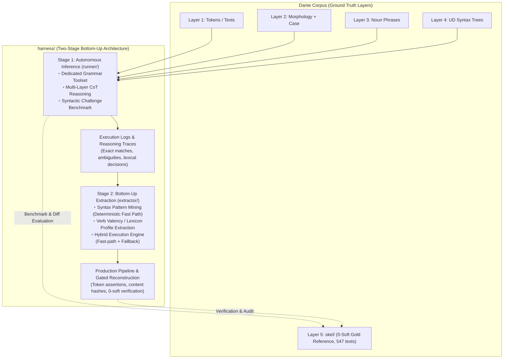

# Grammar Agent Harness: Overall Architecture & Master Plan

## Handoff — resume here

Temporary notes for the next session; durable state lives in **Current Status**
and the **Milestone Ledger** below.

**Next action — Stage 3: the OPERATOR decides the launch configuration and
runs the three canticle-parallel runs (command shape below).** Confirmation
re-run #2 ran clean end-to-end and its readout is COMPLETE (record S3.9,
2026-08-25): every quality criterion passed, the ×3 average gate passed for
the first time (87%), and reactive-only pacing measured a 1.50% retry tax
unpaced — equal to run #1's paced 1.6%. Readout-recommended launch
configuration: `--min-send-interval` default 0 + the shared TokenBucket on
all three shells (inter-stream coordination; solo peaks reach 81% of the
key's ceiling on one call and 96% within a rolling minute, uncoordinated).
One measurement closed since the readout: `/tmp/opencode/spec_indent_tokens.py`
(ephemeral, operator-run) settles S3.7's open question — the −1,752 B/call
renders as **−410 real tokens** (marginal 4.27 B/tok for the removed
whitespace; 82% of the naive 3.5-convention value), with exact validation
against this run's records (byte parity 33/33; offline opening count 2,436 tok
= logged first-call median 2,436, delta +0). State at handoff (all records in
[`STAGE3.md`](STAGE3.md), ledger S3.4–S3.9, 2026-08-25):

- Run #1 (`recon-inf1-compact.log`, compact R1 + interval 35) read out: F1
  **0.7867** → R1 kept, 19/34 units, ×3 average 72%, peak call 34%, retry
  tax 1.6% — solo rolling-60 **76% vs ≤65%**, root-caused to a wiring bug
  (`agent_fallback` built a fresh generate closure per unit, so pacing state
  never spanned sessions); fixed + regression-tested.
- Operator decisions since: `--min-send-interval` defaults **0**
  (reactive-only, S3.4); S3.5/S3.6 narrowed the wire view; **record S3.7
  removed transcript compaction outright.** Measured over run #1's own
  records, the digest bought 7.6 kB of 1,464 kB (**0.5%**) — and spent it in
  the 4-call repair sessions, deleting the earlier submission the validator
  feedback refers to. The continuation prompt went with it (changing what a
  resend contains destabilizes behaviour). The reduction now comes from the
  **system prompt itself**: the tool-specs JSON is rendered flat instead of
  `indent=2`, which is 1,752 B/call of pure whitespace — 10,706 → **8,954 B**
  with not one word of instruction removed, on *every* call. Net: verbatim
  transcripts + slim prompt ≈ 1,287 kB over run #1's traffic vs the compacted
  run's 1,290.7 kB — same wire, full session visibility. Gone:
  `runner/compact.py`, `--no-compact`, `--continuation-prompt`,
  `llm_request.uncompacted_bytes`. Kept: `--payload-tier` (R1), pacing
  (`--min-send-interval`, `--token-bucket`), `paced_seconds`. Tests 871 → 855
  (`test_harness_compact.py` → `test_harness_pacing.py`, 16 tests).
- **Record S3.8 (2026-08-25, last change before the run): the wire records
  now carry the backend's own token counts.** Every Stage-3 token figure so
  far was bytes ÷ 3.5; the counts were never unavailable, only
  provider-specific, and llm7shi keeps the raw stream chunks on
  `Response.chunks`. `token_usage()` (`runner/agent.py`) normalizes Gemini
  `usage_metadata` and Ollama eval counts into `input_tokens` /
  `output_tokens` / `thought_tokens` / `total_tokens` on every
  `llm_response` record — all-`None` for an unreporting backend, never
  raising. A live two-turn preflight confirmed the path (input 17 → 37
  across the resend; **3.53 B/token**, against the 3.5 convention, on short
  Italian plain text) and exposed what the byte records had hidden:
  **`thought_tokens` 139/203 vs `output_tokens` 14/7** — thinking is an
  order of magnitude larger than the answer and never reaches
  `response.text`, so `output_bytes` never counted the bulk of what a call
  generates. Hence `thought_bytes` on the same record. Thinking bills as
  output, so the 16k *input* tok/min ceiling and all pacing are untouched.
  Tests 855 → 860. `BYTES_PER_TOKEN = 3.5` deliberately unchanged: pacing
  parameters move between runs, and the bucket must estimate before the
  send, where only bytes exist.
- **Record S3.9 (2026-08-25): re-run #2 read out — quality held, the ×3
  average gate passed for the first time, and the token questions are
  settled.** F1 0.7728 (band 0.744–0.796; run #1 0.7867), gate-pass 18/34,
  empty responses 0/104; first-call `context_bytes` 9,769 B = design's
  −1,750 B confirmed live. Solo average 29% of ceiling → ×3 = **87% PASS**;
  rolling-60 max 96% with zero minutes ≥100%; api-retry tax **1.50%
  unpaced** (≈ run #1's paced 1.6%) — reactive-only validated solo; wall
  5,275.5 s vs run #1's 5,761.8 paced (−8%). Provider tokens landed on all
  104 responses: `context_bytes/input_tokens` median 3.56 / aggregate 3.44
  vs the 3.5 convention (bucket debits accurate; constant unchanged);
  thought = 71% of generated tokens; duration tracks total_tokens r=+0.97 —
  per-call duration is thinking time, closing S3.1's non-localizable-backoff
  negative result (r0 was mis-specified). Open measurement closed: the
  −1,752 B/call measures **−410 real tokens** (marginal 4.27 B/tok for the
  removed whitespace; 82% survival vs the 3.5 convention — bucket debits are
  conservative in the safe direction), validated exactly against the log.

Standing constraint unchanged: compaction changes session semantics —
designed between runs, never mid-run.

**Side note (2026-08-25, this session, deterministic code only): unit-level
resume shipped for `reconstruct.py`.** Operator report: `--canto N` resume
after an interruption restarted the whole canto from scratch — resume was
canto-granular only (`completed_cantos`/`prepare_resume` keyed on
`canto_complete`), so a single-canto run got no benefit at all. Fixed:
`unit` log records now carry `row_keys`; `prepare_resume` returns a third
`pending_units` map (canto → already-logged units for a canto still in
`remaining`); `reconstruct_canto` accepts `skip_units` and rebuilds those
units from the log instead of re-invoking the fallback; `compact_log` no
longer drops incomplete-canto records (only the superseded `summary` is
ever stripped). No compatibility shim needed: no pre-fix log survives on
disk (the operator's errored first re-run attempt predates this fix and was
deleted; re-run #2 started clean on the new schema and is what record S3.9
read out). Tests 860 → 861
(`test_harness_reconstruct.py` 32 → 33). No model touched.

The single streaming log also carries the request-level cost records (shipped
post-pilot 2026-08-24, live-proven by the recheck): the fallback appends one
`llm_request`/`llm_response` JSONL pair per backend LLM call — timestamp,
model, session/unit coordinates, attempt, context/new/output UTF-8 byte
sizes, duration — join key `(session, messages, attempt)`; 429/quality
retries inside `Client` stay transparent to the wire records, counted by the
`wait_retry` counters and correlated by timestamp. They are canto-scoped like
every other record: never replayed into aggregates, kept by resume compaction
exactly for completed cantos. Wall clock rides the records the same way:
every `canto_complete` carries `elapsed_seconds` and the summary sums them
into `wall_clock_seconds` (idle gaps between resumed attempts never count).

**99-canto expansion — Stage 3 deployment, three canticle-parallel runs**
(live agent fallback; the TPM gate now passes on re-run #2's measured
quantities — parallel bounds wall clock by the longest canticle, measured
~155 s/unit → ≈180 ks ≈ 2.1 days compute-only, under the earlier 2.5–3 day
estimate even with bucket contention, *if* the quota holds). Three concurrent
operator shells, one per canticle, each with its own log — resume stays
canto-granular and independent per file; commands show the readout-recommended
configuration (interval default 0 + shared bucket):

```bash
uv run python -m harness.extractor.reconstruct --canticle inferno --all \
       --verify-gold --model google:gemma-4-31b-it \
       --token-bucket harness/tokbucket.state \
       --log harness/recon-inferno.log
# likewise --canticle purgatorio → harness/recon-purgatorio.log
# and    --canticle paradiso  → harness/recon-paradiso.log
```

**Launch configuration — RESOLVED on the re-run #2 readout (2026-08-25,
record S3.9): recommended interval 0 (the S3.4 default) + shared TokenBucket
(defaults R = 12k tok/min / D = 6.5k tok) on all three shells.** Reactive-only
won solo: unpaced retry tax 1.50% ≈ run #1's paced 1.6%, ×3 average 87%,
rolling-60 max 96% with zero ceiling-minutes. But a single call peaked at 81%
of the key's ceiling alone — with three streams sharing one TPM key and zero
inter-stream coordination, independent per-Client backoff timers can
re-collide inside the same rolling minute, which only the shared bucket
prevents (sustained aggregate ≤75% by construction; no cost while headroom
exists). Final call is the operator's at launch; run #1's counterfactuals
stand as the recorded A/B.

Watch items carried from the closed Stage-2 runs (both inferno-1 runs, see
[`STAGE2.md`](STAGE2.md)): the fast-routed unit fails Gate 2 (routing
`complete` ≠ checker-clean); agent-originated hard violations (`dup`
self-citation, `position` (0,0)) surface only through the checker; quota tax
varies run-to-run (9.4% pilot vs 2.5% recheck — burst contact with the TPM
ceiling, not steady pressure).

**Open design notes from the re-run #2 session (2026-08-25) — decision
pending operator; recorded before any code change.**

1. **Generation-side runaway cap (`Client(max_length=...)`) — recommended
   threshold 12,000 chars.** Motivation: re-run #2's peak context trace
   (37.3 kB ≈ 13k tok, 81% of ceiling alone) traces to one runaway first
   response (session 11: **17,739 B / 7,089 output tokens**, near-zero
   thinking) that then rode history through the session's remaining sends.
   llm7shi mechanics (verified in the installed source):
   `max_length` counts **answer-text characters only** (thinking excluded);
   crossing it makes `should_retry` fail the turn and the Client's quality-
   retry loop **regenerates automatically**, printing one stderr warning.
   Measured output-size distribution over all three inferno-1 runs (308
   responses): median ~750 B, p90 ≤ 2.6 kB, legitimate cross-run max
   **6,295 B**, the runaway at **17,739 B** — a ~3× natural gap. 12k chars
   sits ≥ 1.9× above the legitimate maximum (headroom for corpus units
   heavier than inferno-1) and cuts the observed runaway at 68% of its size;
   a false positive costs one regeneration (~0.8 kB median re-bill), a miss
   costs the full resend tail — asymmetric in favor of the lower line.
   Counterfactual on this run's log: capping outputs > 4 kB at 400 B would
   have held max context at 22.3 kB (60%) with 2 triggers; the cap prevents
   the bloat at the source instead. Caveats: thinking-only runaways are not
   caught (they bill but never enter history — acceptable); after retries
   exhaust, a truncated reply could enter history (practically unreachable
   at this threshold); implementation seam is `llm7shi_generate`'s
   `Client(...)` construction, currently `max_length=None`.
2. **Interim convention health check — tool calls answered by injecting
   return values (`<tool_result>` user messages): no malfunction signal,
   bloat already treated at the source.** Measured over the two instrumented
   benchmark logs (176 cases, 624 turns, 905 dispatched calls): parse
   failures **2 / 1,248 turns (0.16%)**, dispatch errors **1 / 905**,
   `read_unit` served **exactly once per session** (174/174 — no
   re-dispatch pathology), and the INVALID→feedback→repair cycle worked as
   designed (**42 / 726 = 5.8%** of validations returned INVALID and were
   resubmitted). Size side: the heavyweight is the *return value* of
   `read_unit` (pre-R1: median **12.5 kB**, p90 24 kB, max 27.9 kB per
   serve, Σ 2.2 MB over 174 serves) — precisely what payload tier R1
   already cut (p50 2.7 kB; corpus wire 27.4 → 11.3 MB, record S3.3);
   `validate_candidate` verdicts are tiny (median **183 B**); assistant
   `<tool_call>` bodies ride inside output text (median 784 B total) and
   their pathological tail is design note 1's subject. Conclusion: no
   action warranted on the convention itself; the remaining lever is the
   generation cap above.

1. **Read first**: [`extractor/PLAN.md`](extractor/PLAN.md) (§3–§5), then
   [`../ARCHITECTURE.md`](../ARCHITECTURE.md) §4–§6 (observability + log
   contract; `reconstruct.py` already ships it incl. resume).
   The Stage-1→2 interface stays the trace contract:
   `UnitResult.trace_record()` (`runner/agent.py`) embedded as `"trace"` in
   every benchmark case record. The hybrid seam is callable-level:
   `HybridEngine.run_unit(..., fallback=agent_fallback(model=...))`;
   `reconstruct.main(..., fallback=...)` accepts an injected callable for
   deterministic work.
2. **Mining inputs — four complete 87-case JSONL run logs on disk** (all
   gitignored, disk-only; regenerate rather than re-mine if lost):
   M1.4 originals (`harness/bench-unit.log`, `harness/bench-predicate.log`)
   plus the instrumented re-runs (`harness/bench-unit-retry.log`,
   `harness/bench-predicate-retry.log`; finished 2026-08-24). The engine's
   `mine_artifacts()` regenerates rule table + lexicon from them in seconds;
   no mined artifact needs to be frozen on disk.
3. **Error structure to mine around** (details in
   [`STAGE1.md`](STAGE1.md), M1.4 entries):
   systematic gold-convention divergence on verbless frames dominates
   `historical` misses; bare-`obl` over-assignment (74 fps) and `xcomp`
   over-generation are the top noise sources; `obl:di` / `obl:in` recall
   0.54–0.60 fed lexicon_builder directly (140 frames at 100% consistency
   mined, incl. fare+di / avere+di / sedere+in — see [`STAGE2.md`](STAGE2.md),
   M2.2 Ledger entry).
   The 31 well-formed unit-side `upstream_feedback` records await HUMAN
   triage — never auto-retag.
4. **Boundaries that hold**: `extractor/` consumes traces + operator-side
   gold (`skel.io`) like `benchmark.py` does; agent-side masking (§4 item 1)
   applies to anything that runs *as* an agent — the engine's execution face
   and `reconstruct.py`'s execution/commit faces never open gold at all
   (adversarially tested), only evaluation faces (`evaluate_fast_path`,
   `--verify-gold`) do; `fixtures/challenge_cases.py` stays data-only. Tests
   live at repo root (`tests/test_harness_*.py`). `skel/` is protected:
   reconstruction writes need the explicit `--write` flag on top of passing
   all three gates, canto-atomically.
5. **Session housekeeping (2026-08-25, latest assistant session)**: read out
   confirmation re-run #2 into record S3.9 ([`STAGE3.md`](STAGE3.md)) —
   quality held (F1 0.7728, 18/34, zero empties), ×3 average **87% PASS**
   unpaced (first pass of that gate), reactive-only validated solo (retry
   tax 1.50%), provider tokens landed on all 104 responses (B/token 3.44–3.56,
   convention stands), and per-call duration tracks thinking (total_tokens
   r=+0.97), closing S3.1's non-localizable-backoff negative result. On those
   numbers the launch-configuration decision moved to RESOLVED-with-
   recommendation (interval default 0 + shared bucket), and S3.7's open
   whitespace→token question was **closed** by an operator-run offline probe
   (`/tmp/opencode/spec_indent_tokens.py`, ephemeral; method recorded in
   S3.9): −1,752 B/call = **−410 real tokens** (marginal 4.27 B/tok, 82%
   survival vs the 3.5 convention — bucket debits conservative in the safe
   direction), validated exactly against the log (byte parity 33/33; offline
   opening count 2,436 tok = logged median 2,436). No code changed this
   session — tests stand at 861 and the tree carries only PLAN/STAGE3 doc
   updates. (Earlier 2026-08-25 sessions: the unit-level-resume fix (side
   note above); S3.8 token records + live preflight; S3.5–S3.7 removals;
   S3.2 design + gate re-check; S3.3 implementation; S3.1 analysis; run #1
   wiring fix. 2026-08-24: the M2.5 recheck closed Stage 2.)
   **Nothing is in flight on the assistant side — the next session starts
   from the operator's launch call and the three canticle-parallel runs,
   not from code.** Two open design notes below (the generation-side
   `max_length` cap with its 12k-char recommendation, and the interim-
   convention health check) await the operator's decision; neither blocks
   the launch.

---

## Current Status

- [x] **Stage 1 — Autonomous Inference & Capability Benchmark: COMPLETE**
      (toolcall T1–T5 + milestones 1.1–1.4 incl. the instrumented re-runs).
      XML protocol adopted as official wire format (probe 0.957 ≥ 0.95,
      parity interop 24/24 twice); 87-case benchmarks run for BOTH workflows
      at quality parity (micro F1 0.711 unit vs 0.708 predicate; default
      `unit`); traces pooled for Stage 2 mining. Record archived 2026-08-24:
      milestones, ledger, and carry-over resolutions in
      [`STAGE1.md`](STAGE1.md); protocol ledger in
      [`TOOLCALL.md`](TOOLCALL.md) §8.
- [x] **Stage 2 — Rule & Lexicon Extraction** (`harness/extractor/`,
      milestones 2.1–2.5): COMPLETE (2026-08-24). Deterministic mining
      delivered 183 fast-path rules at 100% precision (31.4% gold coverage)
      and a 140-frame verb valency lexicon; the hybrid engine's fast path
      covers only 7.0% of units, so agent fallback is the primary path;
      the gated reconstruction pipeline verified live on inferno 1 twice
      (pilot + recheck): 18/34 units gate-pass each run, verify-gold micro
      F1 0.78 / 0.796 ≥ the Stage-1 band, `written_cantos == 0` protection
      confirmed both times. The recheck's request-granularity readout closed
      the quota question and **failed the Stage-3 launch gate**
      (compaction/pacing required). Record archived 2026-08-24:
      milestones, ledger, carry-overs, and the pilot/recheck readouts in
      [`STAGE2.md`](STAGE2.md); spec in [`extractor/PLAN.md`](extractor/PLAN.md).
- [ ] **Stage 3 — Context Optimization & Full-Corpus Scale-Out**
      (OPENED 2026-08-24 when the M2.5 recheck closed Stage 2): the S3.1
      correlation analysis (2026-08-25; two accounting points corrected by
      S3.2), the **compaction/pacing design + deterministic gate re-check
      (record S3.2)**, and **the implementation (record S3.3, 2026-08-25)**
      are all COMPLETE — design, gate verdicts, implementation map,
      deviations, and the stage ledger live in [`STAGE3.md`](STAGE3.md).
      Shipped and still live: positional `read_unit` serving (tier R1 with
      S1 fallback), adapter fingerprint sync, 35 s min-send interval +
      shared fcntl `TokenBucket` (12k tok/min / 6.5k tok defaults),
      `reconstruct` CLI flags (`--payload-tier`, `--min-send-interval`,
      `--token-bucket`/`--bucket-rate`/`--bucket-depth`) with the
      configuration announced in the header; `llm_request` records gained
      `paced_seconds`. Measured wire (S3.3): R1 11.3 MB corpus-wide (41% of
      the old wire), max unit 10.7 kB. **Record S3.4 (2026-08-25)**:
      confirmation run #1 read out — F1 0.7867 (R1 kept), 19/34 units,
      ×3 average 72%, peak call 34%, retry tax 1.6%, but solo rolling-60
      **76% vs ≤65%**; root cause was a wiring bug (`agent_fallback` built
      a fresh generate closure per unit, so pacing state never spanned
      sessions) — fixed with a regression test, and the operator set
      `--min-send-interval` default to 0. **Records S3.5–S3.6 (same day)**
      narrowed the transcript wire view twice; **record S3.7 (same day)
      removed it entirely** — measured over run #1's own records the
      digest bought 0.5% of the wire while deleting, in repair sessions,
      the very submission the validator feedback refers to; the
      continuation prompt fell with it (changing what a resend contains
      destabilizes behaviour). The reduction moved into the **system
      prompt**: tool specs rendered flat instead of `indent=2` = −1,752 B
      on every call, 10,706 → **8,954 B**, no wording touched. Gone:
      `runner/compact.py`, `--no-compact`, `--continuation-prompt`,
      `llm_request.uncompacted_bytes`. **Record S3.8 (same day)** answers
      S3.7's token caveat at the source: `llm_response` records now carry
      the provider's own token counts (`token_usage()` over llm7shi's raw
      stream chunks — Gemini `usage_metadata`, Ollama eval counts,
      all-`None` when unreported), so the re-run's TPM readout is measured
      rather than derived from the 3.5 B/token convention; a live preflight
      confirmed the path (3.53 B/token on plain Italian) and exposed
      thinking at 10× the answer tokens, so `thought_bytes` joins the
      record — `output_bytes` never counted the bulk of what a call
      generates, which is what S3.1's duration analysis lacked. **Record
      S3.9 (same day)** read out re-run #2 (`recon-inf1-verbatim.log`,
      verbatim transcripts, interval 0, no bucket): F1 0.7728 in band,
      gate-pass 18/34, empty responses 0/104; the prompt reduction confirmed
      live (first call 11,519 → 9,769 B = design's −1,750 B); solo average
      29% → ×3 = **87% PASS**, rolling-60 max 96% with zero ceiling-minutes,
      api-retry tax **1.50% unpaced** (≈ run #1's paced 1.6%);
      `context_bytes/input_tokens` measured median 3.56 / aggregate 3.44 —
      the 3.5 convention stands; thought = 71% of generated tokens and
      duration tracks total_tokens r=+0.97, closing S3.1's
      non-localizable-backoff negative result. Remaining acts: the 99-canto
      expansion as three canticle-parallel runs behind the existing gates
      (launch configuration recommended on S3.9: interval default 0 + shared
      bucket), then the corpus-wide readout. The standing constraint holds:
      session semantics change between runs, never mid-run.
- Open decision, Stage 3 launch pacing (2026-08-25, raised while the live
  confirmation run was in flight): **proactive vs reactive-only.** The
  operator challenged the designed proactive interval (`[pace] send
  interval: waiting 26.3s`) on the correct observation that 429s carry no
  account penalty: if waiting is only ever needed *after* a 429 lands,
  reactive-only (`--min-send-interval 0`, riding the proven Client
  auto-retry backstop) may beat a deterministic +4.4% wall-clock tax.
  Analysis held on both sides: (i) solo, reactive-only plausibly wins —
  the unpaced tax is stochastic (2.5–9.4% run-to-run) and R1 compaction
  already cuts the physical wire to 41%, lowering burst-contact
  probability further; (ii) the three-parallel launch shares one
  per-API-key ceiling and reactive-only has **no inter-stream
  coordination** — independent per-Client backoff timers can re-collide
  inside the same rolling minute, which is what the shared `TokenBucket`
  exists to prevent (sustained aggregate ≤ 75% by construction);
  (iii) 429 waits surface only as `wait_retry` / `turn_seconds`, never
  `paced_seconds`, so the deliberate-vs-forced wait separation on the
  wire records is lost. This reopens STAGE3.md §2.D's "no reacting to
  429s" rejection **for the launch configuration only**. **Update (same
   day, S3.4):** partially resolved — the operator set the interval default
   to 0 and the re-run exercises reactive-only; run #1's counterfactuals
   recorded for comparison (interval ≈0 → ×3 average 84% > G1's 80% by
   construction; interval-35 enforced globally → all gates pass). **Update
   (re-run #2 readout, S3.9): settled solo for reactive** — the unpaced tax
   measured 1.50%, matching run #1's paced 1.6%, while ×3 average hit 87%
   with zero ceiling-minutes. Argument (ii) survives as the reason the
   launch still carries the shared bucket: solo rolling-60 peaked at 96% of
   the key's ceiling with zero coordination, so three streams sharing one
   key need the bucket's inter-stream coordination — giving the recommended
   configuration interval 0 + shared bucket (final call: operator, at
   launch).
- Open design question (protocol layer): a dedicated `submit_candidate`
  termination tool — the practical half is resolved by the nudge policy
  ([`STAGE1.md`](STAGE1.md) carry-over 3); tracked as
  [`TOOLCALL.md`](TOOLCALL.md) §7.1.
- Open operational issue (2026-08-23, predicate full run): long agent contexts
  trip the Gemini API's per-model input-token quota (`gemma-4-31b` paid tier:
  16k input tokens/min) — 429 RESOURCE_EXHAUSTED with ~50 s backoffs becomes
  frequent past ~10 turns, because every loop turn resends the whole transcript
  and the predicate workflow accumulates turns fast. Candidate mitigations
  (undecided): local Ollama backend for long sessions (same XML wire format, no
  TPM ceiling — but the ~3× figure was calibrated on short probe/unit-mode
  sessions; with long transcripts every request pays full local prefill, so the
  penalty compounds roughly quadratically with turn count and may far exceed
  3×), client-side pacing, or a transcript-compaction policy (changes session
  semantics — design first, never mid-benchmark). Measurement: llm7shi's
  auto-retry hides these failures from artifacts; since 2026-08-23 the
  `HarnessStatusLine` stream counts them (`api_retries` / `api_retry_seconds`
  in case records and summaries).   `turn_seconds` still absorbs the wait time,
  so quota-affected turns inflate slow-turn counts unless read together with
  the retry counters. Measured on the predicate full run (first instrumented
  run): 103 backoffs / 3,526 s across 40 of 87 cases, worst session 14
   backoffs / 670 s over 19 turns; excluding backoff, its compute matched the
   unit run (~18.8 ks vs 18.7 ks) — the entire +19% wall clock was quota wait.
     Re-measured 2026-08-24 on both instrumented re-runs (Client adapter):
     predicate 103 backoffs / 3,196 s across 47 of 87 cases (14.4% of wall)
     reproduces the tax; the unit side is now measured for the first time at
     55 backoffs / 1,659 s across 36 of 87 cases (8.4%) — half the predicate's
     absolute quota wait, consistent with shorter unit sessions crossing the
     per-minute ceiling less often. Compute-only totals nearly equal: unit
      ≈18.1 ks vs predicate ≈19.0 ks (+5%). Measured 2026-08-24 at request
      granularity by the post-extension inferno-1 recheck (readout in
      [`STAGE2.md`](STAGE2.md), M2.5-recheck entry): single-stream average
      input ≈ 5.1k tokens/min (32% of ceiling) but bursty — peak minutes
      ≈ 16.3k tokens ≈ 102% of ceiling solo; 61% of input bytes are
      transcript resends; 3 × single-stream exceeds the ceiling even on
      averages — **the launch gate failed: compaction/pacing is required
      before the three-parallel-stream expansion**, and this issue's
      mitigation decision moves from open to Stage 3 design work.
      Stage-3 analysis update (2026-08-25, S3.1, **corrected same day by
      S3.2** — see [`STAGE3.md`](STAGE3.md) §1): the physical input is
      `context_bytes` (it already includes the newest message), so the solo
      average is 5.13k tok/min and ×3 = 96% (zero margin, gate still fails);
      the 15–20.6 kB turn-2 messages are `read_unit` payloads, not validator
      feedback (≤ 0.5 kB); the burst mechanism (fast response + next big send
      sharing a rolling minute) and the stochastic-backoff conclusion stand.
      The mitigation decision is S3.2's design: see the Stage-3 bullet above.
- Test suite: **861 passed** (547 corpus + 46 `test_harness_tools.py` +
   76 `test_harness_toolcall.py` + 37 `test_harness_agent.py` +
   39 `test_harness_benchmark.py` + 23 `test_harness_syntax_miner.py` +
   17 `test_harness_lexicon_builder.py` + 27 `test_harness_hybrid_engine.py` +
   33 `test_harness_reconstruct.py` (unit-level resume, side note above) +
   16 `test_harness_pacing.py`).

---

## Milestone Ledger

*Stage-1 records (toolcall T1–T5, milestones 1.1–1.4 + carry-over
resolutions) live in [`STAGE1.md`](STAGE1.md) and [`TOOLCALL.md`](TOOLCALL.md)
§8; the completed Stage-2 record — milestones 2.1–2.5 incl. the inferno-1
pilot and the closing recheck readout — was split off on 2026-08-24 to
[`STAGE2.md`](STAGE2.md). From Stage 3 on (2026-08-25) records accrue in
[`STAGE3.md`](STAGE3.md)'s own ledger; this plan keeps only the S3.1 record
below for its historical readout, with its corrections noted.*

**Stage 3, record S3.1 — context-growth × 429 correlation analysis over
`recon-inf1-recheck.log`: COMPLETE (2026-08-25, deterministic log work,
assistant-run). Two accounting points superseded the same day by S3.2
([`STAGE3.md`](STAGE3.md) §1: the additive `context+new` double-counts the
newest message — true solo average 5.13k tok/min, ×3 = 96%; the 15–20.6 kB
turn-2 messages are `read_unit` payloads, not validator feedback); the gate
conclusion (launch fails at zero margin) and the mechanism findings stand.** The Stage-3 opening task: localize the recheck's 7 backoffs
(162 s) against transcript growth and minute-bucket rates, and resolve the
pilot-9.4% vs recheck-2.5% anchor. Method: the 103 request/response pairs
joined on `(session, messages, attempt)`; input accounted additively
(`context_bytes + new_bytes`); generation baseline r0 = total output /
compute = 13.9 B/s; rolling-60 s windows alongside wall minutes. Analysis
script ephemeral (deterministic over the gitignored log; method above
re-derives every number).

- **Accounting correction to the M2.5 readout — its gate conclusion
  unchanged, now stronger.** The readout's "input" summed `context_bytes`
  only (1,919.7 kB); the physical request input is additive: **2,239.8 kB**
  total, of which replayed context = **85.7%**. The readout's "61%
  (1,167 kB)" reconciles exactly: Σcontext − Σ final-call contexts =
  1,167.0 kB, the intermediate-call replay share of Σcontext. Corrected
  solo rates: average **21.0 kB/min ≈ 6.0k tok/min ≈ 37%** of the 16k
  ceiling — **3 × average = 112%**: the Stage-3 launch gate fails on
  averages outright, not only peaks. Peaks: 3 wall-minutes over the solo
  ceiling (115 / 113 / 107%), rolling-60 s max **132%**, 14 calls with
  rolling window ≥ 100%, max single call **52.8 kB ≈ 15.1k tok ≈ 94% of the
  ceiling alone**.
- **The burst mechanism is structural, not stochastic.** Intra-session sends
  fire **0–20 ms** after the previous response (raw timestamps: the client
  streams the next request the moment a response lands), and the tripping
  shape is the **turn-2 validator-feedback turn**: its `new_bytes` are the
  run's five largest messages (15.0–20.6 kB; `new` p50 254 B / p90 8.3 kB),
  layered on a grown context (e.g. S24#2: ctx 30.3 kB + new 18.7 kB). All
  **15 calls ≥ 30 kB input are turn-2+ retries**; paired 12→38–53 kB — and
  S10/S24/S29 pairing again at #3 (S10: 53 + 35 kB = 158%) — they stack
  **86–158% of the solo ceiling into single minutes**. Two size levers
  follow: transcript replay *and* validator-feedback size (the tool result
  is harness-generated; its bloat is our choice, not the model's).
- **Backoff non-localization — the honest negative result.** The 7 backoffs
  / 162 s cannot be attributed from wire durations: naive duration-excess
  (duration − output/r0) sums 630 s over the top-10 calls — generation-rate
  variance (per-call rate quartiles 7.6–19.5 B/s) dwarfs the ~23 s/backoff
  quanta. The 14 over-ceiling calls flowed at or above average rate
  (excesses −79…+48 s; the run's three biggest inputs generated at
  16.7–21.8 B/s), and the 11 slow small first-calls (>30 s for ~114 B
  output) sat at 21–81% rolling windows — no quota contact. Pilot anchor
  resolved: Spearman(pilot, recheck unit seconds) = **0.41** over 33 units
  (work-driven floor, run-to-run noise dominant), and the pilot's entire
  +630 s tax is one unit's episode (986 s pilot → 186 s recheck; the +800 s
  outlier). The tax is **stochastic rolling-window burst contact**:
  mitigation is keeping the stream under the ceiling by construction (size +
  spacing), never reacting to 429s.
- **Measured parameters handed to the compaction/pacing design.** Fixed
  per-call floor = unit context **11.8 kB** (irreducible L1–L4 payload).
  Counterfactuals (floor + summary S + `new`): S=0 → ×3 average **77%** of
  ceiling, S=1 82%, S=2 87%, S=4 98% — the summary budget must stay
  ≲ 2 kB. Capping validator feedback at ~4 kB (measured counterfactual:
  Σnew 320 → 147 kB) bounds any call at ~15.8 kB ≈ 4.5k tok ≈ **28% solo**
  and holds ×3 average at **68%** (S=0) to 79% (S=2 with cap). Pacing
  faces measured 0–20 ms inter-send gaps and self-pacing big calls (firsts
  4–91 s, median 23.5; big turn-2s 70–212 s), so it only needs to break the
  fast-pair stack: a min inter-send interval of 35–60 s per stream, or a
  global token bucket (~11k tok/min across 3 streams), trading bounded wall
  clock (median session = 3 calls ⇒ +70–120 s/session worst case) for
  ceiling margin. The design decides; these are its inputs.

---

## 1. Overview & Paradigm Shift: Generalizable Layer 5 Reconstruction

`harness/` is a dedicated **Grammar Agent Harness for Local LLMs** (e.g., **Gemma 4 31B**), designed to systematically reconstruct Layer 5 predicate-argument skeletons (`skel/`) from multi-layer grammatical contexts (Layer 1 text/tokens, quotes hierarchy, Layer 2 morphology, pronoun case annex, Layer 3 noun phrase spans, and Layer 4 Universal Dependencies syntax trees).

### Motivation & Rationale
1. **Historical Context & Limitations of `skel/`**:
   - Layer 5 (`skel/`) was historically produced by a **small local LLM**
     (`ollama:gemma4:31b-it-qat`, pinned in `model.mk`) driving the driver's
     `--fix` regeneration loop; its residual errors were then triaged through an
     interactive, semi-manual process in which a frontier LLM (Claude Opus 5,
     later switched to Gemini 3.7 Flash at the end of Phase 8) and human
     operators read the outlier positions to formulate 130 deterministic rules
     (Rules A–EI) and hand-apply the corrections recorded in
     [`CORRECTIONS.md`](../skel/CORRECTIONS.md).
   - Throughout, the small model was granted **no autonomy**: it ran on rails
     laid down by the larger model — executing repairs inside a checker/rule
     system it did not shape, with everything beyond those rails escalated to
     the frontier-LLM/human triage loop.
   - Although this successfully produced a 100% clean corpus (**0 hard / 0 soft violations across all 100 cantos**, 547 pytest passing), the **construction methodology itself was ad hoc, bespoke to Dante's Italian, and insufficiently automated**.
   - As a result, the Phase 5–8 methodology cannot be directly generalized to other texts, genres, or languages (such as Latin).
2. **Mission of `harness/`**:
   - The gist of `harness/` is to grant the local model that missing **autonomy**: remove the hand-laid rails and let it reason from linguistic first principles, deciding its own path through multi-layer context and closed tools instead of executing rules handed down by a larger model.
   - `harness/` embeds this autonomous agent in a **reproducible, fully automated, and generalizable reconstruction pipeline**.
   - Preserving `skel/` as an **immutable Gold Standard (Ground Truth)** for benchmark evaluation, `harness/` demonstrates how local LLMs can autonomously project Layer 4 UD syntax onto predicate-argument frames (Stage 1) and empirically induce syntax rules and valency lexicons (Stage 2).



---

## 2. Staged Strategy: Bottom-Up Core + Scale-Out

In contrast to the top-down methodology used in Phases 5–8 — where frontier LLMs deduced abstract rules that the local executor then followed mechanically, without autonomy of its own — `harness/` hands agency to the local model and adopts an empirical **bottom-up strategy (instance-level inference ➔ pattern induction)** across Stages 1–2, with Stage 3 as the operational scale-out.

### Stage 1: Autonomous Local Inference & Capability Benchmark (`harness/runner/`)
- **Approach**: For each parse unit, the agent receives the multi-layer context (L1–L4, quotes, case) and autonomously solves predicate-argument frames on the fly using Chain-of-Thought (CoT) and a dedicated Tool Calling API (`validate_candidate`, etc.).
- **Objectives**:
  - Quantitatively benchmark local LLM capabilities (1-shot exact match rate, multi-turn self-correction convergence rate, role-level F1) against the 0-soft Gold Standard (`skel/`).
  - Capture comprehensive execution logs, successful syntax projections, and lexical decision traces (e.g., argument vs. adjunct discrimination, reflexive pronouns, control verbs).
- **Specification**: [`harness/runner/PLAN.md`](runner/PLAN.md).

### Stage 2: Bottom-Up Rule & Lexicon Extraction (`harness/extractor/`)
- **Approach**: Mine and aggregate the reasoning logs and decision trajectories from Stage 1 to:
  1. Extract stable, deterministic Universal Dependencies patterns as **Syntax Fast-Path Rules**.
  2. Aggregate verb-preposition-case co-occurrences into an empirical **Verb Valency Lexicon**.
  3. Construct a **Hybrid Execution Engine** combining deterministic fast paths (rules + lexicon) with fallback to Stage 1 agent inference for ambiguous or rare contexts.
- **Objectives**:
  - Maximize cross-corpus consistency and reduce inference latency and token overhead (targeting >80% fast-path coverage).
  - Provide a gated production pipeline that reconstructs cantos under strict 0-soft regression verification and content hash updating.
- **Specification**: [`harness/extractor/PLAN.md`](extractor/PLAN.md).
- **Status**: COMPLETE (2026-08-24); record archived in
  [`STAGE2.md`](STAGE2.md) — the >80% fast-path target measured MISS at
  7.0%, so agent fallback remains the primary path and the gated pipeline's
  honest output is protection.

### Stage 3: Context Optimization & Full-Corpus Scale-Out (opened 2026-08-24)

Opened when the M2.5 recheck closed Stage 2. Done so far: the S3.1 correlation
analysis (2026-08-25; two accounting points corrected by S3.2 — see the
Milestone Ledger note), **the compaction/pacing design + deterministic gate
re-check (2026-08-25, record S3.2)**, and **the implementation (2026-08-25,
record S3.3)** — spec, gate verdicts, implementation map, measured
deviations, confirmation protocol, and the stage ledger live in
[`STAGE3.md`](STAGE3.md): corrected headline ×3 average = 96% of the 16k
tok/min ceiling (zero margin, gate fails); the design's three levers were
positional `read_unit` serving (tier R1), transcript compaction, and pacing
(35 s min inter-send + shared 12k tok/min token bucket). **Record S3.7
(2026-08-25) cut the middle one**: measured against run #1's own records,
transcript compaction bought 0.5% of the wire and cost the model its own
session history, so it was removed together with the continuation prompt,
and the byte reduction moved into the system prompt itself (tool specs
rendered flat: 10,706 → 8,954 B on every call, no wording changed). Live
levers now: R1 payload serving + prompt size + pacing. **Record S3.9
(2026-08-25) read out the confirmation run: every criterion passed, ×3
average 87% unpaced — first pass of that gate.** Remaining acts: the
99-canto expansion as three canticle-parallel runs behind the existing gates
(recommended configuration: interval default 0 + shared bucket), then the
corpus-wide readout. Scope and constraints tracked in Current Status + the Handoff.

### Beyond Layer 5 (design notes)

Directions that open up **after** the `skel/` reconstruction — a layer swap
(same machinery, different target layer), a vertical whole-stack slice, and the
horizon of reconstructing grammar for a language with no available description
— are kept out of this plan in [`FUTURE.md`](FUTURE.md). None of it is
scheduled work; `PLAN.md` remains the source of truth for status and
milestones.

### Transport & backend policy

Decision record (2026-08-22): measured at roughly 3× the local speed, **XML
(`PromptXmlTransport`) was adopted as the official wire format for Stage 1/2
production runs; native Ollama tool calling (`OllamaNativeTransport`) stays
implemented and gated for comparison experiments** (re-run
`harness.toolcall.parity` when revisiting local-only deployments). Backend
choice remains free: `google:gemma-4-31b-it` when wall clock matters,
`ollama:gemma4:31b-it-qat` for offline/cost-constrained work — both validated
end-to-end over the XML protocol during the T4/T5 gates.

Adapter policy (2026-08-24): the stateful `llm7shi.Client` adapter is the
common model-access specification; the stateless probe/parity adapters and the
skel drivers' disposable-Client pattern are legacy from the trial-and-error
phase. The standing rules live in [`../ARCHITECTURE.md`](../ARCHITECTURE.md)
(§2 Model access, §3 Wire protocol).

---

## 3. Separation of Concerns

The directory map lives in [`README.md`](README.md#directory-structure) —
single source, not duplicated here. The boundaries it encodes:

- **`skel/` is protected, not a dependency.** Gold TSVs, the 130-rule registry,
  and [`CORRECTIONS.md`](../skel/CORRECTIONS.md) are the evaluation reference
  and are masked from agents structurally (§4 item 1); only operator-side
  benchmark code reads them.
- **`toolcall/` is a layer- and task-agnostic protocol library.** It knows
  nothing about grammar: wire format, transports, and the multi-turn loop only.
  Everything grammatical lives in `runner/`.
- **`runner/` (Stage 1) produces traces; `extractor/` (Stage 2) consumes
  them.** The contract between the stages is `UnitResult.trace_record()`, not
  shared internals.
- **`fixtures/` is data, read operator-side only.** Nothing under `runner/`
  imports it, so the agent path cannot see the benchmark's case selection.
- **Tests live at the repo root** (`tests/test_harness_*.py`) alongside the
  corpus suite, so the harness stays inside one pytest run.

---

## Environment & Artifacts (reference)

- **Python always runs through `uv`** (`uv run python ...`, `uv run pytest ...`);
  never invoke a bare `python3`. Every command below follows this.
- **Session division of labor**: assistant sessions execute deterministic,
  LLM-free work only (tests, extraction/mining, artifact inspection); every
  LLM-in-the-loop command (the probe / parity / benchmark / agent /
  reconstruction CLIs) is run by the human operator, not by the assistant.
- Live probe: `uv run python -m harness.toolcall.probe --model <model> --repeat N --log
  harness/probe.log` — streaming JSONL: one scenario record per completed scenario,
  summary record last (a log without the summary line = interrupted run);
  `*.log` is gitignored.
- Migration parity check (T5, live run PASSED 2026-08-22): `uv run python -m
  harness.toolcall.parity
  --model <model> [--repeat N] [--log harness/parity.log]` — same log semantics;
  hard gate = canonical interop on both transports.
- Single-unit session CLI (live smoke tests): `uv run python -m harness.runner.agent
  --canticle inferno --canto 1 --line-start 1 [--line-end N] [--trace trace.jsonl]`.
- Benchmark CLI (milestone 1.3): `uv run python -m harness.runner.benchmark [--category
  C]... [--case-id ID]... [--limit N] [--list] [--log bench.log] [--full-transcript]`.
  An existing `--log` resumes: completed cases reload into the aggregate and are
  skipped; the summary sums per-session durations across all attempts.

---

## 4. Standing Invariants & Disciplines

1. **Strict Masking of Gold Layer 5**:
   - `runner/` agents are strictly forbidden access to gold `skel/*.tsv`, the 130-rule registry, and historical correction records ([`CORRECTIONS.md`](../skel/CORRECTIONS.md)).
2. **No Free-Form Bash Execution**:
   - Agents operate strictly via closed, structured Tool Calling (`tools.py`) without shell execution privileges.
3. **Preservation of the 0-Soft Regression Gate**:
   - Benchmark and evaluation modes operate strictly in-memory or write to scratch buffers; gold TSVs in `skel/` are never overwritten during benchmark runs.
4. **Upstream Discrepancy Channel**:
   - Discrepancies identified in upstream layers (Layer 2 morphology or Layer 4 UD syntax) are emitted as structured `upstream_feedback` records for human audit and triage.
5. **Live-Run Observability & Log Durability**:
   - LLM-in-the-loop runs are inherently slow (minutes per turn on local
     models, hours per benchmark), and an unwatchable run is an unusable run:
     every operator-facing CLI must keep progress **visible by default**, not
     silent-until-finished.
    - The standing specification — stderr streaming, session separators and the
      optional `HarnessStatusLine` status bar, per-turn timings rolled into
      summaries (`turn_seconds`, `slow_turns`, `api_retries`), turn-granularity
      discipline, log durability independent of shell redirection, and the
      streaming JSONL log contract with its summary-last completion marker and
      resume semantics — lives in [`../ARCHITECTURE.md`](../ARCHITECTURE.md)
      (§4 Live-run observability, §5 Streaming JSONL log contract, §6 Reporting
      shape). It is a standing requirement, not a one-off patch: new live entry
      points (Stage 2's `extractor/` CLIs included) must ship it from day one,
      keep the human-facing progress display on stderr by convention (JSONL
      logs go to their own `--log` files, never to redirected console output),
      and any future transport must preserve it.
    - The concrete wiring — status-bar labeling (Canticle Canto Line),
      markup-disabled shared console, the model-access layer sharing that
      stream, `wait_retry` snapshot/delta accounting, and the new-`Client`
      blank-line spacing — is the ARCHITECTURE.md §4 standard itself now, not
      a pattern restated per plan; `reconstruct.py` (2026-08-24) is where it
      first shipped end-to-end and stays the template to copy.
