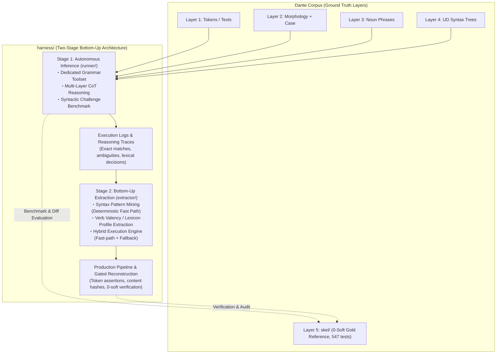

# Grammar Agent Harness: Overall Architecture & Master Plan

## Handoff — resume here

Working notes for the next session only — write what's in flight or about
to start, and clear an entry once it's been acted on (folded into Current
Status, §2, a stage document, or Orientation for Fresh Sessions). Durable
state that should survive indefinitely does not belong here: it belongs in
**Current Status**, **Orientation for Fresh Sessions**, the **Milestone
Ledger**, or §2's per-stage records.

**Next action — the operator's inferno-1 live experiment.** Record S5.5
(2026-08-30) changed where divergence gets fixed. Auditing
`runner/tools.py`'s `validate_candidate` against
`dante_corpus/skel/validate.py` showed the corpus's hard population is
*exactly* the gap between the agent-side gate and the admission checker:
486 self-argument + 341 null-position + 70 clausal = the 897 S5.2 measured,
with no other source. All three missing checks are closed-world, so they
went into the gate — the model is now told, inside its own session, that a
row is schema-impossible and given both admissible repairs, instead of a
post-hoc rule deciding on its behalf. With it, the gold-format TSV became
the run's artifact *and* its resume state (`--tsv`, written unit by unit),
and the log dropped to an append-only debug record.

**IN FLIGHT: the operator is regenerating inferno 1 right now and will
report the results at the start of the next session.** Everything S5.5 needs
is committed and tested (925 passed); the live run is the measurement, and
only the operator runs it (Environment & Artifacts, session division of
labor). **So the next session opens by receiving those numbers and reading
them — not by re-running anything, and not by starting new work first.**

What the operator is running (from `harness/recon`, and the readout it
produces — full rationale in [`STAGE5.md`](STAGE5.md) record S5.5):

1. Baseline off the committed `inferno/01.tsv` — that file is the Stage-4
   output and git keeps it, so `git show HEAD:harness/recon/inferno/01.tsv`
   recovers it for comparison at any time. No manual backup was needed.
2. `rm inferno/01.{tsv,log}` then `make inferno/01.tsv`.
3. `make check` / `make stats` / `make agree`, plus the run's own log.

**How to read the results when they arrive** — the experiment's question is
*how much does in-session correction buy*, so the numbers that answer it,
in order:

- **`adopted_invalid` in the log's `unit` records** — units whose session
  ended on rows its own gate had rejected (provisional adoption at the turn
  cap). This is the primary metric: it is exactly the population the new
  checks could not talk the model out of.
- **`make check` on inferno 1**: the two row-local classes (`dup`
  self-argument, `position` null-position) should be **0 by construction** —
  if either is non-zero, the gate has a hole and that is the finding. The
  `clausal` count against inferno 1's share of the old 70 is what
  in-session correction actually bought.
- **Cost of the correction**: turns and wall clock per unit against S4.3's
  numbers. More gate errors means more turns; whether that is affordable at
  99-canto scale is a real question this run answers.
- **`make agree` afterwards, never as a criterion** (discipline 4 below).
  These gate checks are transcriptions of `validate.py` written gold-closed,
  so this is the first honest chance to see whether schema-driven correction
  converges on gold — the claim S5.3 could not earn.
- **`make repair-check` on inferno 1**: the same question from the other
  side. S5.3 deleted 827 rows of two classes that should now be unreachable
  at the source.

Two mechanism checks worth doing while the canto is in hand (cheap, and they
exercise paths only tests have covered so far): mid-run Ctrl+C then re-run →
only unsettled units re-run; delete a middle unit's lines from the TSV then
re-run → that unit alone regenerates, file back in line order.

**Then decide** — the results choose the next move, so do not pre-commit to
one: if in-session correction largely works, the question becomes what to do
about the other 99 cantos, whose logs cannot be re-run (164 h of live model
time) and whose clausal class therefore still needs a deterministic pass or
an explicit decision to leave it. If it does not, the next lever is
prompt-side teaching (`runner/prompts.py`), deliberately left untouched so
this run measures the gate alone.

**Still queued behind all of it — the soft bulk, where the mass actually
is**: `extra_arg` 2,075, `missing_arg` 1,653, `role_mismatch` 567,
`missing_tuple` 501. The top mismatch pairs are bare `obl` where the
derivation yields `obl:di` (130), `obl:in` (82), `obl:come` (68) — the same
bare-`obl` over-assignment Stage 1 measured in M1.4 (Orientation §3 below),
so a preposition-driven `obl:X` refinement is the obvious next candidate,
and `derive.py` already specifies the mapping. Note that S5.5's result may
change its shape too: soft findings are *not* reported into the session (they
carry the derivation's own answer, [`STAGE5.md`](STAGE5.md) S5.5), so unlike
the hard classes this one has no in-session route and stays deterministic
work over the committed TSVs.

**Standing discipline for any rule, established by S5.3's two operator
corrections** ([`STAGE5.md`](STAGE5.md) §5):

1. `check.py`'s counts *select* the work but never decide it. Gold scores
   0/0 under the same checker, so the bar is calibrated — but every hard
   class clears by deleting rows, so the counter rewards deletion.
2. **Gold decides nothing either.** It is `harness/`'s benchmark, not its
   target; fitting rules to it is teaching to the test, voids every
   gold-referenced number the project reports, and reinstates the very
   top-down methodology `harness/` exists to replace (§1). Design each rule
   with gold unopened.
3. A rule's authority comes from the layer's own contract —
   `dante_corpus/skel/validate.py`'s schema invariants and `derive.py`'s
   derivation. Admissible when the schema declares the current row
   impossible *and* the contract determines what may stand in its place;
   where it is silent, withdraw the void assertion rather than invent one;
   where a derivable alternative exists, deletion is wrong.
4. `make agree` is a **readout run afterwards**, never an acceptance
   criterion.
5. Read positions, not aggregates, before writing the rule — the same
   discipline Phase 5 learned the hard way
   ([`../skel/PHASE5.md`](../skel/PHASE5.md) §1.3, §5.2).

**Ordering constraint**: `repair` edits the committed TSVs in place, so it
runs *after* `convert`, never before — re-running `make convert` regenerates
from the logs and rolls the repairs back.

**State at the S5.5 session's close (2026-08-30).** The S5.5 code is
committed and the tree was clean at the handoff. **No committed artifact was
touched** — the 100 TSVs are exactly as S5.3 left them, so `inferno/01.tsv`
changing is the operator's live run, not a code side effect.

- **`make check` exits 1 by design** while the 70 clausal hard violations
  stand — that is the checker's contract (non-zero on any hard violation),
  not a broken build. Do not treat a red `make check` as a regression signal
  without reading the count. Corpus-wide it will keep failing on the 99
  cantos regardless of how inferno 1 turns out; read inferno 1's own
  numbers, not the total.
- **`make convert` must not be run corpus-wide any more.** It regenerates
  TSVs from the Stage-4 logs, which would roll back S5.3's repairs (the
  standing ordering constraint above) *and*, for any canto re-run since
  S5.5, produce a partial file — after a TSV resume the log holds only the
  newly run units. It survives for the legacy Stage-4 logs only.
- **Carry-over caveat on S5.3's own two rules** ([`STAGE5.md`](STAGE5.md)
  §5): they satisfy discipline 2–3 above and `repair.py` opens no gold file,
  but gold *was* consulted while they were being designed, before the
  operator's correction landed. Their agreement gain is therefore a
  consistency check, not independent evidence that schema-driven repair
  converges on gold. S5.5's gate checks are transcriptions of
  `validate.py`, so they are gold-closed by construction — the inferno-1
  run is the first chance to earn that convergence claim honestly.
- **Process note, still standing**: applying anything to the committed
  corpus is a separate act from designing and implementing it, and needs its
  own go-ahead. A reduction pass can always be measured without writing —
  show those numbers first.

Two things a fresh session should still know before touching
`harness/recon/`:

- The Stage-4 logs are still on this machine, gitignored. They are the only
  copy of the run's telemetry (cost accounting, per-unit routing and gate
  detail), which by §2's decision is accepted as ephemeral — the headline
  numbers survive only as prose in [`STAGE5.md`](STAGE5.md) S5.1 and
  [`STAGE4.md`](STAGE4.md) S4.3. `recon/readout.py` still reads them while
  they exist.
- `make <canticle>` is TSV-goaled and **will not re-run a canto whose TSV
  exists with no log beside it** — the normal state after a fresh clone.
  Since S5.5 the TSV is also the resume state, so a canto whose TSV is
  complete costs no model calls even when its log is present. Deleting a TSV
  (or a stretch of its lines) is how you ask for that canto back; do it
  deliberately, since a full canticle is tens of hours of live model time.
  Work on the other 99 cantos should still read/edit the committed TSVs
  directly, not relaunch the model.

## Current Status

Stages 1–4 are COMPLETE/CLOSED; their status, dates, and record pointers
live in §2's per-stage subsections below, not repeated here. This section
holds only what's still open.

- [ ] **Stage 5 — Corpus Durability, now also Divergence Reduction**
      (OPENED 2026-08-29 by operator, on Stage 4's close). Deliverable 1
      shipped on record S5.1: `harness/recon/convert.py` converts each
      per-canto log into a gold-format `NN.tsv` beside it (idempotent,
      `make convert` / `make convert-check`); the full corpus converted
      clean — 100 cantos, 3,477 units, 43,549 rows, 0 incomplete logs, 0
      dropped row keys. Deliverable 2 (a committed format for the logs'
      non-corpus content) was CUT: run telemetry does not belong in the
      repository, so the wire/cost and routing detail stays ephemeral in
      the logs. Record S5.2 ported gold's `--check`/`--stats` to the recon
      corpus (`harness/recon/check.py`, `make check` / `make stats`) and
      read out **897 hard, 5,267 soft** violations corpus-wide — on that
      number, the operator reopened the stage's scope to reducing it
      (§4), informed by but not replaying `skel/PHASE5.md`'s methodology.
      Record S5.3 is the first reduction pass: `harness/recon/repair.py`
      (two deterministic deletion rules) plus `harness/recon/agree.py`
      (row-level P/R/F1 against gold, a readout only) took the corpus to
      **70 hard, 4,988 soft** at gold-agreement F1 0.7235 → 0.7307, recall
      unchanged. Two operator corrections set the method and are now
      standing discipline (§4 item 1, Handoff): the violation counter
      selects work but is gameable by deletion, and **gold may not be the
      gate either** — rules derive from the layer's own schema/derivation
      contract with gold unopened. Record S5.4 audited the classification
      behind the residual 70 ([`HARD.md`](HARD.md)); record S5.5 then found
      the corpus's whole hard population to be *exactly* the three checks
      `validate_candidate` was missing (486 + 341 + 70 = 897), moved them
      into the agent's own session, and made the gold-format TSV the run's
      artifact and its resume state (`--tsv`, written unit by unit; the log
      demoted to an append-only debug record). Remaining: the operator's
      inferno-1 live experiment (Handoff), then the clausal class over the
      other 99 cantos and the soft bulk.
      Design decisions, the conversion contract, the divergence-reduction
      direction (§4), what the violation count is and is not (§5), and the
      stage ledger (S5.1–S5.5) in [`STAGE5.md`](STAGE5.md).
- Test suite: **925 passed** (876 + 11 from S5.1 + 8 from S5.2 + 21 from
  S5.3 + 9 from S5.5).
  Composition and history (TokenBucket removal,
  mid-canto kill resilience, the readout tool's own tests) in
  [`STAGE4.md`](STAGE4.md)'s pre-launch note and record S4.3.

---

## Orientation for Fresh Sessions

Durable context for picking up mining/extraction work cold — not tied to
any one session, so it survives across Handoff clearings.

1. **Read first**: [`extractor/PLAN.md`](extractor/PLAN.md) (§3–§5), then
   [`../ARCHITECTURE.md`](../ARCHITECTURE.md) §4–§6 (observability + log
   contract; `reconstruct.py` already ships it incl. resume).
   The Stage-1→2 interface stays the trace contract:
   `UnitResult.trace_record()` (`runner/agent.py`) embedded as `"trace"` in
   every benchmark case record. The hybrid seam is callable-level:
   `HybridEngine.run_unit(..., fallback=agent_fallback(model=...))`;
   `reconstruct.main(..., fallback=...)` accepts an injected callable for
   deterministic work.
2. **Mining inputs — four complete 87-case JSONL run logs on disk** (all
   gitignored, disk-only; regenerate rather than re-mine if lost):
   M1.4 originals (`harness/bench-unit.log`, `harness/bench-predicate.log`)
   plus the instrumented re-runs (`harness/bench-unit-retry.log`,
   `harness/bench-predicate-retry.log`; finished 2026-08-24). The engine's
   `mine_artifacts()` regenerates rule table + lexicon from them in seconds;
   no mined artifact needs to be frozen on disk.
3. **Error structure to mine around** (details in
   [`STAGE1.md`](STAGE1.md), M1.4 entries):
   systematic gold-convention divergence on verbless frames dominates
   `historical` misses; bare-`obl` over-assignment (74 fps) and `xcomp`
   over-generation are the top noise sources; `obl:di` / `obl:in` recall
   0.54–0.60 fed lexicon_builder directly (140 frames at 100% consistency
   mined, incl. fare+di / avere+di / sedere+in — see [`STAGE2.md`](STAGE2.md),
   M2.2 Ledger entry).
   The 31 well-formed unit-side `upstream_feedback` records await HUMAN
   triage — never auto-retag.
4. **Boundaries that hold**: `extractor/` consumes traces + operator-side
   gold (`skel.io`) like `benchmark.py` does; agent-side masking (§4 item 1
   of Standing Invariants below) applies to anything that runs *as* an
   agent — the engine's execution face and `reconstruct.py`'s
   execution/commit faces never open gold at all (adversarially tested),
   only evaluation faces (`evaluate_fast_path`, `--verify-gold`) do;
   `fixtures/challenge_cases.py` stays data-only. Tests live at repo root
   (`tests/test_harness_*.py`). `skel/` is protected: reconstruction writes
   need the explicit `--write` flag on top of passing all three gates,
   canto-atomically.
5. **Wire/cost instrumentation** (shipped across Stages 2–3, live-proven on
   every run): the fallback appends one `llm_request`/`llm_response` JSONL
   pair per backend LLM call — timestamps, model, session/unit coordinates,
   attempt, context/new/output/thought byte sizes, provider token counts
   (`input/output/thought/total_tokens`), duration, `paced_seconds`,
   `max_length_retries`; join key `(session, messages, attempt)`;
   429/quality retries inside `Client` stay transparent to the wire records,
   counted by the `wait_retry` counters. Every `canto_complete` carries
   `elapsed_seconds`, summed into the summary's `wall_clock_seconds`. All
   canto-scoped like every other record. Since S5.5 the log is **append-only
   and never read back** — resume state is the canto's TSV, and `unit`
   records (`row_keys`, `adopted_invalid`, gate verdicts) are read afterwards
   for analysis, not replayed.

---

## Milestone Ledger

*Documentation convention (from Stage 5 on, decided 2026-08-29 as PLAN.md
grew too large): each stage now writes design work, running detail, and
its milestone ledger directly into its own `STAGE<N>.md` from the moment
it opens, rather than accumulating in PLAN.md and splitting off at close
(the pattern Stages 1–4 used, kept below for their archived records).
PLAN.md stays the overall plan — Handoff and Current Status are kept
current every session; per-stage detail is not duplicated here.*

*Stage-1 records (toolcall T1–T5, milestones 1.1–1.4 + carry-over
resolutions) live in [`STAGE1.md`](STAGE1.md) and [`TOOLCALL.md`](TOOLCALL.md)
§8; the completed Stage-2 record — milestones 2.1–2.5 incl. the inferno-1
pilot and the closing recheck readout — was split off on 2026-08-24 to
[`STAGE2.md`](STAGE2.md). All Stage-3 records S3.1–S3.11 live in
[`STAGE3.md`](STAGE3.md)'s ledger (S3.1 moved there verbatim at stage close,
2026-08-25; stage closed on S3.11); all Stage-4 records S4.1–S4.3 live in
[`STAGE4.md`](STAGE4.md)'s ledger (stage closed 2026-08-29 on S4.3);
Stage-5 records accrue directly in [`STAGE5.md`](STAGE5.md)'s ledger from
the start.*

---

## 1. Overview & Paradigm Shift: Generalizable Layer 5 Reconstruction

`harness/` is a dedicated **Grammar Agent Harness for Local LLMs** (e.g., **Gemma 4 31B**), designed to systematically reconstruct Layer 5 predicate-argument skeletons (`skel/`) from multi-layer grammatical contexts (Layer 1 text/tokens, quotes hierarchy, Layer 2 morphology, pronoun case annex, Layer 3 noun phrase spans, and Layer 4 Universal Dependencies syntax trees).

### Motivation & Rationale
1. **Historical Context & Limitations of `skel/`**:
   - Layer 5 (`skel/`) was historically produced by a **small local LLM**
     (`ollama:gemma4:31b-it-qat`, pinned in `model.mk`) driving the driver's
     `--fix` regeneration loop; its residual errors were then triaged through an
     interactive, semi-manual process in which a frontier LLM (Claude Opus 5,
     later switched to Gemini 3.7 Flash at the end of Phase 8) and human
     operators read the outlier positions to formulate 130 deterministic rules
     (Rules A–EI) and hand-apply the corrections recorded in
     [`CORRECTIONS.md`](../skel/CORRECTIONS.md).
   - Throughout, the small model was granted **no autonomy**: it ran on rails
     laid down by the larger model — executing repairs inside a checker/rule
     system it did not shape, with everything beyond those rails escalated to
     the frontier-LLM/human triage loop.
   - Although this successfully produced a 100% clean corpus (**0 hard / 0 soft violations across all 100 cantos**, 547 pytest passing), the **construction methodology itself was ad hoc, bespoke to Dante's Italian, and insufficiently automated**.
   - As a result, the Phase 5–8 methodology cannot be directly generalized to other texts, genres, or languages (such as Latin).
2. **Mission of `harness/`**:
   - The gist of `harness/` is to grant the local model that missing **autonomy**: remove the hand-laid rails and let it reason from linguistic first principles, deciding its own path through multi-layer context and closed tools instead of executing rules handed down by a larger model.
   - `harness/` embeds this autonomous agent in a **reproducible, fully automated, and generalizable reconstruction pipeline**.
   - Preserving `skel/` as an **immutable Gold Standard (Ground Truth)** for benchmark evaluation, `harness/` demonstrates how local LLMs can autonomously project Layer 4 UD syntax onto predicate-argument frames (Stage 1) and empirically induce syntax rules and valency lexicons (Stage 2).

---

## 2. Staged Strategy: Bottom-Up Core + Scale-Out

In contrast to the top-down methodology used in Phases 5–8 — where frontier LLMs deduced abstract rules that the local executor then followed mechanically, without autonomy of its own — `harness/` hands agency to the local model and adopts an empirical **bottom-up strategy (instance-level inference ➔ pattern induction)** across Stages 1–2, with Stage 3 as context optimization + launch hardening (closed 2026-08-25), Stage 4 as the operational scale-out (closed 2026-08-29), and Stage 5 opening the corpus-durability track (converting the run's ephemeral logs into committable, `skel/`-compatible artifacts).

### Stage 1: Autonomous Local Inference & Capability Benchmark (`harness/runner/`)
- **Approach**: For each parse unit, the agent receives the multi-layer context (L1–L4, quotes, case) and autonomously solves predicate-argument frames on the fly using Chain-of-Thought (CoT) and a dedicated Tool Calling API (`validate_candidate`, etc.).
- **Objectives**:
  - Quantitatively benchmark local LLM capabilities (1-shot exact match rate, multi-turn self-correction convergence rate, role-level F1) against the 0-soft Gold Standard (`skel/`).
  - Capture comprehensive execution logs, successful syntax projections, and lexical decision traces (e.g., argument vs. adjunct discrimination, reflexive pronouns, control verbs).
- **Specification**: [`harness/runner/PLAN.md`](runner/PLAN.md).
- **Status**: COMPLETE (2026-08-24); record archived in [`STAGE1.md`](STAGE1.md)
  — XML wire protocol adopted (probe 0.957 ≥ 0.95, parity interop 24/24
  twice), 87-case benchmarks at quality parity for both workflows (micro F1
  0.711 unit vs 0.708 predicate), traces pooled for Stage 2 mining. Protocol
  ledger in [`TOOLCALL.md`](TOOLCALL.md) §8.

### Stage 2: Bottom-Up Rule & Lexicon Extraction (`harness/extractor/`)
- **Approach**: Mine and aggregate the reasoning logs and decision trajectories from Stage 1 to:
  1. Extract stable, deterministic Universal Dependencies patterns as **Syntax Fast-Path Rules**.
  2. Aggregate verb-preposition-case co-occurrences into an empirical **Verb Valency Lexicon**.
  3. Construct a **Hybrid Execution Engine** combining deterministic fast paths (rules + lexicon) with fallback to Stage 1 agent inference for ambiguous or rare contexts.
- **Objectives**:
  - Maximize cross-corpus consistency and reduce inference latency and token overhead (targeting >80% fast-path coverage).
  - Provide a gated production pipeline that reconstructs cantos under strict 0-soft regression verification and content hash updating.
- **Specification**: [`harness/extractor/PLAN.md`](extractor/PLAN.md).
- **Status**: COMPLETE (2026-08-24); record archived in
  [`STAGE2.md`](STAGE2.md) — the >80% fast-path target measured MISS at
  7.0%, so agent fallback remains the primary path and the gated pipeline's
  honest output is protection.

### Stage 3: Context Optimization (opened 2026-08-24, CLOSED 2026-08-25)

Closed on record S3.11 with the full-corpus expansion re-scoped out into
Stage 4. The arc: the S3.1 correlation analysis (two accounting points
corrected by S3.2 — [`STAGE3.md`](STAGE3.md) §1), **the compaction/pacing
design + deterministic gate re-check (record S3.2)**, and **the
implementation (record S3.3)** — spec, gate verdicts, implementation map,
measured deviations, and the stage ledger live in [`STAGE3.md`](STAGE3.md).
**Record S3.7 cut transcript compaction from the design**: measured against
run #1's own records it bought 0.5% of the wire and cost the model its own
session history; the byte reduction moved into the system prompt itself
(tool specs rendered flat: 10,706 → 8,954 B on every call, no wording
changed). Live levers at close: R1 payload serving + prompt size + pacing.
**Record S3.9 read out confirmation re-run #2: every criterion passed, ×3
average 87% unpaced — first pass of that gate**; **S3.10 added the
generation-side runaway cap (6,000 chars default)**; **S3.11 read out the
cap experiment — every criterion PASS — and closed the stage.**

### Stage 4: Full-Corpus Verification (opened 2026-08-25, CLOSED 2026-08-29)

The 99-canto scale-out as its own stage: three canticle-parallel streams
(inferno / purgatorio / paradiso) driven by `harness/recon/Makefile`,
behind every Stage-3 gate, gold immutable, launch configuration carried
from S3.9/S3.11 (interval default 0 + cap 6000, reactive-only — the shared
`TokenBucket` was removed 2026-08-26). Closed on record S4.3: corpus-wide
readout (`harness/recon/readout.py`) gave verify-gold micro F1 inferno
0.7269 / purgatorio 0.7186 / paradiso 0.7201 / corpus-wide 0.7219, with
inferno falling just under the 0.744–0.796 confirmation-run band — operator
decision was to accept and close, scope held to the full-corpus run itself.
Commands, watch items, full readout criteria/results, and the stage ledger
(S4.1–S4.3) live in [`STAGE4.md`](STAGE4.md).

### Stage 5: Corpus Durability (OPENED 2026-08-29 by operator, on Stage 4's close)

The Stage-4 corpus run's 100 per-canto logs (`harness/recon/<canticle>/
NN.log`) are gitignored, disk-only, and will eventually be lost. Opening
scope: a script converting their settled reconstruction output into
`skel/`-compatible, committable form, plus a separate format for whatever
doesn't map into that shape, so nothing is silently dropped. Record S5.1
ships the first as `<canticle>/NN.tsv` written beside each log, in gold's
byte-exact TSV format (so a plain `diff` against `skel/` is the run's
divergence readout); deterministic, LLM-free and idempotent, so it is a
repeatable step after any future corpus run rather than a one-time
migration. `recon/Makefile`'s per-canto goal moved from the log to the TSV
with it (reconstruct → convert in one target — since S5.5 reconstruct writes
the TSV itself and the conversion step is gone), and a canto whose TSV exists
with no log beside it is left alone, so a fresh checkout never re-runs the
corpus for output it already has. The second deliverable was cut on operator
review: the logs' remaining content is run telemetry, not corpus content,
and stays out of the repository — accepted as ephemeral. The stage's scope
then extended to **divergence reduction** on S5.2's 897-hard/5,267-soft
readout: S5.3's two deterministic rules brought that to 70 hard / 4,988
soft. The method that record settled matters more than the number — the
violation count is gameable by deletion, and gold is the benchmark rather
than the target, so a rule's authority comes from the layer's own schema and
derivation contract, with `make agree`'s gold score read only afterwards.
Record S5.5 then relocated the work itself: the corpus's 897 hard violations
are *exactly* the three schema checks the agent-side gate
(`validate_candidate`) was missing, so those checks moved into the model's
own session — it corrects its analysis with the unit in front of it, instead
of a downstream rule deciding on its behalf — and the gold-format TSV became
the run's artifact and its resume state, written unit by unit, with deleting
a stretch's lines as the fix gesture. Design decisions, the conversion
contract, and the stage ledger live in
[`STAGE5.md`](STAGE5.md) — the first stage to write directly into its own
document as work happens, rather than accruing here first.

### Beyond Layer 5 (design notes)

Directions that open up **after** the `skel/` reconstruction — a layer swap
(same machinery, different target layer), a vertical whole-stack slice, and the
horizon of reconstructing grammar for a language with no available description
— are kept out of this plan in [`FUTURE.md`](FUTURE.md). None of it is
scheduled work; `PLAN.md` remains the source of truth for status and
milestones.

### Transport & backend policy

Decision record (2026-08-22): measured at roughly 3× the local speed, **XML
(`PromptXmlTransport`) was adopted as the official wire format for Stage 1/2
production runs; native Ollama tool calling (`OllamaNativeTransport`) stays
implemented and gated for comparison experiments** (re-run
`harness.toolcall.parity` when revisiting local-only deployments). Backend
choice remains free: `google:gemma-4-31b-it` when wall clock matters,
`ollama:gemma4:31b-it-qat` for offline/cost-constrained work — both validated
end-to-end over the XML protocol during the T4/T5 gates.

Adapter policy (2026-08-24): the stateful `llm7shi.Client` adapter is the
common model-access specification; the stateless probe/parity adapters and the
skel drivers' disposable-Client pattern are legacy from the trial-and-error
phase. The standing rules live in [`../ARCHITECTURE.md`](../ARCHITECTURE.md)
(§2 Model access, §3 Wire protocol).

---

## 3. Separation of Concerns

The directory map lives in [`README.md`](README.md#directory-structure) —
single source, not duplicated here. The boundaries it encodes:

- **`skel/` is protected, not a dependency.** Gold TSVs, the 130-rule registry,
  and [`CORRECTIONS.md`](../skel/CORRECTIONS.md) are the evaluation reference
  and are masked from agents structurally (§4 item 1); only operator-side
  benchmark code reads them.
- **`toolcall/` is a layer- and task-agnostic protocol library.** It knows
  nothing about grammar: wire format, transports, and the multi-turn loop only.
  Everything grammatical lives in `runner/`.
- **`runner/` (Stage 1) produces traces; `extractor/` (Stage 2) consumes
  them.** The contract between the stages is `UnitResult.trace_record()`, not
  shared internals.
- **`fixtures/` is data, read operator-side only.** Nothing under `runner/`
  imports it, so the agent path cannot see the benchmark's case selection.
- **Tests live at the repo root** (`tests/test_harness_*.py`) alongside the
  corpus suite, so the harness stays inside one pytest run.

---

## Environment & Artifacts (reference)

- **Python always runs through `uv`** (`uv run python ...`, `uv run pytest ...`);
  never invoke a bare `python3`. Every command below follows this.
- **Session division of labor**: assistant sessions execute deterministic,
  LLM-free work only (tests, extraction/mining, artifact inspection); every
  LLM-in-the-loop command (the probe / parity / benchmark / agent /
  reconstruction CLIs) is run by the human operator, not by the assistant.
- Live probe: `uv run python -m harness.toolcall.probe --model <model> --repeat N --log
  harness/probe.log` — streaming JSONL: one scenario record per completed scenario,
  summary record last (a log without the summary line = interrupted run);
  `*.log` is gitignored.
- Migration parity check (T5, live run PASSED 2026-08-22): `uv run python -m
  harness.toolcall.parity
  --model <model> [--repeat N] [--log harness/parity.log]` — same log semantics;
  hard gate = canonical interop on both transports.
- Single-unit session CLI (live smoke tests): `uv run python -m harness.runner.agent
  --canticle inferno --canto 1 --line-start 1 [--line-end N] [--trace trace.jsonl]`.
- Benchmark CLI (milestone 1.3): `uv run python -m harness.runner.benchmark [--category
  C]... [--case-id ID]... [--limit N] [--list] [--log bench.log] [--full-transcript]`.
  An existing `--log` resumes: completed cases reload into the aggregate and are
  skipped; the summary sums per-session durations across all attempts.

---

## 4. Standing Invariants & Disciplines

1. **Strict Masking of Gold Layer 5**:
   - `runner/` agents are strictly forbidden access to gold `skel/*.tsv`, the 130-rule registry, and historical correction records ([`CORRECTIONS.md`](../skel/CORRECTIONS.md)).
   - **Gold is the benchmark, never the target — and that binds operator-side
     work too** (added 2026-08-29 on the operator's correction during S5.3;
     rationale in [`STAGE5.md`](STAGE5.md) §5). Structural masking keeps gold
     out of the *agent's* inputs; this keeps it out of the *pipeline's
     construction* at every level. No deterministic rule, repair, threshold,
     or heuristic anywhere in `harness/` may be chosen by reading gold and
     matching it — that is teaching to the test: it voids every
     gold-referenced number the project reports (Stage 1's micro F1, S4.3's
     verify-gold readout, `recon/agree.py`) and reinstates the top-down
     rails methodology §1 says `harness/` exists to replace. Rules derive
     from the layer's own published contract instead —
     `dante_corpus/skel/validate.py`'s schema invariants and `derive.py`'s
     L1–L4 derivation. Gold-referenced scores are **readouts taken
     afterwards**, never acceptance criteria.
2. **No Free-Form Bash Execution**:
   - Agents operate strictly via closed, structured Tool Calling (`tools.py`) without shell execution privileges.
3. **Preservation of the 0-Soft Regression Gate**:
   - Benchmark and evaluation modes operate strictly in-memory or write to scratch buffers; gold TSVs in `skel/` are never overwritten during benchmark runs.
4. **Upstream Discrepancy Channel**:
   - Discrepancies identified in upstream layers (Layer 2 morphology or Layer 4 UD syntax) are emitted as structured `upstream_feedback` records for human audit and triage.
5. **Live-Run Observability & Log Durability**:
   - LLM-in-the-loop runs are inherently slow (minutes per turn on local
     models, hours per benchmark), and an unwatchable run is an unusable run:
     every operator-facing CLI must keep progress **visible by default**, not
     silent-until-finished.
    - The standing specification — stderr streaming, session separators and the
      optional `HarnessStatusLine` status bar, per-turn timings rolled into
      summaries (`turn_seconds`, `slow_turns`, `api_retries`), turn-granularity
      discipline, log durability independent of shell redirection, and the
      streaming JSONL log contract with its summary-last completion marker and
      resume semantics — lives in [`../ARCHITECTURE.md`](../ARCHITECTURE.md)
      (§4 Live-run observability, §5 Streaming JSONL log contract, §6 Reporting
      shape). It is a standing requirement, not a one-off patch: new live entry
      points (Stage 2's `extractor/` CLIs included) must ship it from day one,
      keep the human-facing progress display on stderr by convention (JSONL
      logs go to their own `--log` files, never to redirected console output),
      and any future transport must preserve it.
    - The concrete wiring — status-bar labeling (Canticle Canto Line),
      markup-disabled shared console, the model-access layer sharing that
      stream, `wait_retry` snapshot/delta accounting, and the new-`Client`
      blank-line spacing — is the ARCHITECTURE.md §4 standard itself now, not
      a pattern restated per plan; `reconstruct.py` (2026-08-24) is where it
      first shipped end-to-end and stays the template to copy.
6. **Session Semantics Stability**:
   - Session semantics (prompt wording, tool schema, protocol behavior) may
     change *between* runs but never *mid-run*: a live run's semantics stay
     fixed for its whole duration once launched. Established during Stage 3's
     launch hardening, standing for every later stage.
