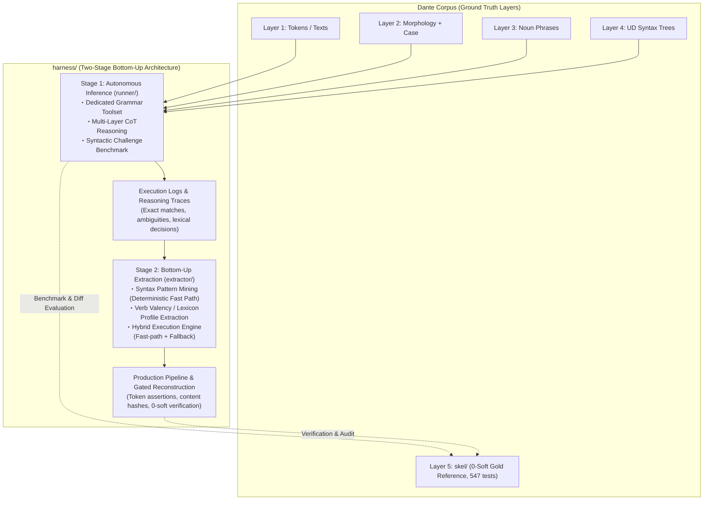

# Grammar Agent Harness: Overall Architecture & Master Plan

## Handoff — resume here

Working notes for the next session only — write what's in flight or about to
start, and clear an entry once it's been acted on. Durable state does not belong
here: it goes to **Current Status** (live numbers), **Orientation for Fresh
Sessions** (context and operational facts that outlive any stage), §2's table
(what a stage settled), or the stage's own `stages/<NN>.md` (everything else).

**STAGE 9 IS CLOSED AND STAGE 10 IS OPEN (2026-09-06).** The close was performed
the usual way, by opening [`stages/10.md`](stages/10.md); Stage 9's own close is
[`stages/09.md`](stages/09.md) §9, and its seven records S9.1–S9.7 are §8 of the
same document. The gates were re-read before closing on them, not carried over
from the previous session — the numbers are in Current Status below. Nothing
from Stage 9 is repeated here.

**IN FLIGHT: the operator is running level 3's first corpus-wide `--fix`
(handed off 2026-09-06).** The level shipped in S10.1 and this commit is the
tree it runs against: `unregistered_predicate`, selection **334**, levels 1 and
2 at 0, suite 1,029, `make check` 0 hard / 3,126 soft, **no committed artifact
touched yet**. The next session reads the result and writes it up as **S10.4** in
[`stages/10.md`](stages/10.md).

**Read the result this way** — the numbers first, then the two things this run is
the first live test of:

1. **Every level after the pass, not just the one that ran** (S8.1): `make check`,
   `make fix-level FIX=1`, `FIX=2`, `FIX=3`, then `make agree` as a readout taken
   afterwards and never as the criterion, then `uv run pytest -q`.
2. **The soft count is expected to RISE, and that is not a regression.**
   Registering a predicate exposes its frame — S6.1 measured 2+ new `missing_arg`
   at 227 of the then-490 `missing_tuple` positions — so the number that says
   whether the run worked is level 3's own finding count falling from 334, not
   the corpus total. Report both, and say which is which.
3. **`FixClass.exempts` has never run live.** S10.1 narrowed `fix_verdict`'s
   new-class refusal so that a divergence at a predicate *this level itself
   registered* counts as arithmetic rather than a traded class; without it the
   correct answers would have been refused. Check in the per-canto logs that it
   actually fired — accepted units whose `soft` rose at the registered predicate —
   and that no `new_class:` refusal names a class at some *other* predicate that
   should have been caught. If the exemption turns out to be wider than argued,
   that is a mechanism finding, not a corpus one.
4. **No unit may end worse than it started.** The standing guarantee is unchanged
   by S10.1 and the per-canto records carry the mechanism (reopened, accepted vs
   reverted, findings and soft before/after) to confirm it.

Sweep the per-canto logs before the run and delete a canto's `.log` with its
`.tsv` if anything is re-run under a changed implementation (Orientation items 5
and 6) — the acceptance test changed in this commit, so a log spanning both sides
of it would not be one implementation's behaviour.

**Not in flight, and not to be acted on without a decision** — both came out of
S10.1's design pass and are recorded in [`stages/10.md`](stages/10.md):
**S10.2** — the session gate never checks anchors for bare `obl`, where
`validate.py` does; all 133 `membership` violations are that shape, closing the
hole costs 0 false refusals corpus-wide, but 3 named positions would then
deadlock under a level-1 run, so the change is the operator's to schedule and it
changes live-run semantics (Standing Invariant §6).
**S10.3** — levels 1 and 2 have no reachable residue; the 26 findings their
classes still match are declined correctly and are not a to-do list.

## Current Status

Every stage's status, dates and outcome are in §2's table; this section holds
the open stage and the live numbers only.

- [ ] **Stage 10 — Soft Level 3** — the open stage (**OPENED 2026-09-06**;
      opening it closed Stage 9). Level 3 is **designed and implemented but not
      run** (S10.1): `unregistered_predicate`, the clause head Layer 4 names and
      the artifact never registers, argued from `derive.py`'s predicate census
      with gold unopened, gate/level alignment measured before the run rather
      than after four, and selecting **334** of the 401 `missing_tuple`
      findings. Levels are cumulative, so it adds to levels 1–2. It also
      inherits two unfinished Stage 9 items — never close
      conditions for that stage and not done: **no concurrent run has ever been
      made** (the ≈ 1.7× throughput is a projection from serial runs), and
      **the per-request ceiling is unmeasured**, so the fixed-context loop's
      budget cannot be sized. [`stages/10.md`](stages/10.md) carries both, and
      §2 below has the prose.

*Every number below was re-read on 2026-09-06 as Stage 9's close condition,
against a corpus last touched by S9.7's `--fix` sweep (2026-09-05).*

- **Corpus** (the harness's own recon TSVs, not gold): **0 hard / 3,126 soft**,
  `make check` exits 0, `make fix-level` **0 at levels 1 and 2** — the condition
  Stage 9 closed on — and **334 at level 3**, which S10.1 added and no run has
  yet acted on.
- **Gold agreement** (readout only, Standing Invariant §1): **0.7610**
  corpus-wide — inferno 0.7651, purgatorio 0.7592, paradiso 0.7586.
- **Test suite**: **1,029 passed** (S9.4 added 21 for the fixed-context loop,
  S9.6 one for the mode default, S10.1 six for level 3). Its composition and
  full history live in
  [`stages/04.md`](stages/04.md)'s pre-launch note, which is where that
  arithmetic has always been kept.

---

## Orientation for Fresh Sessions

Durable context for picking up mining/extraction work cold — not tied to
any one session, so it survives across Handoff clearings.

1. **Read first**: [`extractor/PLAN.md`](extractor/PLAN.md) (§3–§5), then
   [`../ARCHITECTURE.md`](../ARCHITECTURE.md) §4–§6 (observability + log
   contract; `reconstruct.py` already ships it incl. resume).
   The Stage-1→2 interface stays the trace contract:
   `UnitResult.trace_record()` (`runner/agent.py`) embedded as `"trace"` in
   every benchmark case record. The hybrid seam is callable-level:
   `HybridEngine.run_unit(..., fallback=agent_fallback(model=...))`;
   `reconstruct.main(..., fallback=...)` accepts an injected callable for
   deterministic work.
2. **Mining inputs — four complete 87-case JSONL run logs on disk** (all
   gitignored, disk-only; regenerate rather than re-mine if lost):
   M1.4 originals (`harness/bench-unit.log`, `harness/bench-predicate.log`)
   plus the instrumented re-runs (`harness/bench-unit-retry.log`,
   `harness/bench-predicate-retry.log`; finished 2026-08-24). The engine's
   `mine_artifacts()` regenerates rule table + lexicon from them in seconds;
   no mined artifact needs to be frozen on disk.
3. **Error structure to mine around** (details in
   [`stages/01.md`](stages/01.md), M1.4 entries):
   systematic gold-convention divergence on verbless frames dominates
   `historical` misses; bare-`obl` over-assignment (74 fps) and `xcomp`
   over-generation are the top noise sources; `obl:di` / `obl:in` recall
   0.54–0.60 fed lexicon_builder directly (140 frames at 100% consistency
   mined, incl. fare+di / avere+di / sedere+in — see [`stages/02.md`](stages/02.md),
   M2.2 Ledger entry).
   The 31 well-formed unit-side `upstream_feedback` records await HUMAN
   triage — never auto-retag.
4. **Boundaries that hold**: `extractor/` consumes traces + operator-side
   gold (`skel.io`) like `benchmark.py` does; agent-side masking (§4 item 1
   of Standing Invariants below) applies to anything that runs *as* an
   agent — the engine's execution face and `reconstruct.py`'s
   execution/commit faces never open gold at all (adversarially tested),
   only evaluation faces (`evaluate_fast_path`, `--verify-gold`) do;
   `fixtures/challenge_cases.py` stays data-only. Tests live at repo root
   (`tests/test_harness_*.py`). `skel/` is protected: reconstruction writes
   need the explicit `--write` flag on top of passing all three gates,
   canto-atomically.
5. **Wire/cost instrumentation** (shipped across Stages 2–3, live-proven on
   every run): the fallback appends one `llm_request`/`llm_response` JSONL
   pair per backend LLM call — timestamps, model, session/unit coordinates,
   attempt, context/new/output/thought byte sizes, provider token counts
   (`input/output/thought/total_tokens`), duration, `paced_seconds`,
   `max_length_retries`; join key `(session, messages, attempt)`;
   429/quality retries inside `Client` stay transparent to the wire records,
   counted by the `wait_retry` counters. Every `canto_complete` carries
   `elapsed_seconds`, summed into the summary's `wall_clock_seconds`. All
   canto-scoped like every other record. Since S5.5 the log is **write-only
   within a run** — resume state is the canto's TSV, and `unit` records
   (`row_keys`, `adopted_invalid`, gate verdicts) are read afterwards for
   analysis, not replayed. **Appending is for resuming a run that failed
   part-way, not a durability rule**: a re-run under a changed implementation
   deletes the log first, so that the file holds one implementation's
   behaviour rather than two spliced together. **Delete the canto's `.tsv` at
   the same time**, for the same reason from the other side: a surviving TSV is
   the run's resume state, so its units would be read as settled and never
   re-run.
   **The quota these numbers are spent against is 16K TPM** — tokens per
   minute, aggregated across concurrent work (operator, 2026-09-05). The scarce
   quantity when planning a run is therefore *total tokens per unit of wall
   clock*, not the size of any single request: read a mode's cost as
   `total_tokens ÷ elapsed_seconds`, and read what a token saving buys as
   parallel streams. S9.5 in [`stages/09.md`](stages/09.md) does that division
   for both execution modes.
6. **Running a `--fix` level.** Standing operational facts from every level-1
   and level-2 run, for whichever level runs next. They belong here rather than
   under a stage because they held across Stages 6 and 8 alike:
   - **A `--fix` run cannot leave the corpus worse than it found it.** Only the
     level's own findings are selectable, and a unit whose answer fails the
     acceptance test keeps its recorded rows — confirmed on repeat passes (S6.5,
     S6.9) and again across level 2's two corpus-wide runs (S8.2, S8.4), with no
     canto and no unit ending worse than it started.
   - **Repeating `make fix` corpus-wide is cheap; re-asking one unit is what
     costs** (S8.4). A canto with no finding at the level makes no model call and
     closes in 0.1 s, so ten whole-corpus passes came to ~2 h wall and 127
     requests. Budget a residue by the units in it, not by the cantos swept.
   - **Repeated identical refusals do not mean a residue is out of reach**
     (S8.5). They bound its per-attempt success rate from above, never at zero —
     one unit settled on its eleventh attempt after ten identical answers. Only
     a mechanism argument (a row the splice cannot take, a gate that refuses what
     a level asks) establishes unreachability.
   - **Sweep the per-canto logs before each corpus-wide fix run**, deliberately,
     so the run's telemetry is unambiguous (S6.7's logs mixed two runs and had to
     be reconstructed from timestamps). Dedupe `unit` records by `(canticle,
     canto, line_start, line_end)` across the whole file, keeping the last — the
     rule that survives both a clean single-segment log and a relaunched one with
     duplicate spans — and key the dedup by the log's *path*, not its basename
     (`01.log` exists in all three canticles). An unswept log can still be read:
     it segments cleanly at its `summary` records (S8.4).
   - **The tool-result console echo is on by default** (400 payload chars,
     `reconstruct.py --tool-result-chars`, 0 = off); `recon/Makefile`'s `%.tsv`
     recipe does not pass the flag, so changing it for corpus runs means editing
     the recipe.
   - **`make check` exits 0** — the corpus has been hard-clean since S5.7, so a
     non-zero `make check` from here on is a regression signal, not an expected
     state (through S5.6 the checker's contract kept it red by design).
   - **A closed level does not stay closed.** The level table is a standing
     selection, not a one-time sweep, so any later live run over a canto may
     re-open positions at either level (S8.1's regression note). Read
     `make fix-level` at every level after a pass, not just the one you ran.
   - The **S5.3-era standing discipline for any rule** (gold-benchmark-not-target,
     schema/derivation authority, `make agree` as readout-only, read positions
     before aggregates) is unchanged and lives in [`stages/05.md`](stages/05.md)
     §5 and §4 below — not repeated here.
7. **The execution mode, and how to tell which one is running.** Since S9.6
   (2026-09-05) the **fixed-context loop is the default**: every generation and
   fix target runs the bounded step with no flag at all. The per-unit
   tool-calling session is the opt-in one and is slated for removal.

   ```
   cd harness/recon
   make inferno/01.tsv                     # fixed context, no flag needed
                                           # + FIXED_ITERATIONS=n to change the cap
   make fix                                # the same loop over committed artifacts
   make inferno/01.tsv TOOLCALL=1          # the old session, for comparison only
   ```

   `FIXED_ITERATIONS` deliberately keeps its S9.4-era name — a renamed make
   variable fails silently. Three ways to see which mode is running from the
   first seconds, worth knowing in both directions now that the default has
   flipped: the configuration line reads `reconstruct: fixed context, 4
   iteration(s) max, …` rather than `transcripts verbatim, …`; **no
   `<tool_call>` block ever appears**, and per-unit `[fixed] … iter 1: N row(s),
   accepted` lines do; and the log's `skill_digest` is `ee6f1a46…` rather than
   `b16c0639…`. The standing readout commands, so any session starts from the
   same place:

   ```
   cd harness/recon && make check                     # 0 hard / 3,126 soft
   make fix-level FIX=1 && make fix-level FIX=2       # both 0
   make fix-level FIX=3                               # 334, never run
   make agree                                         # readout only, never a target
   cd ../.. && uv run pytest -q                       # 1,029
   ```

---

## Milestone Ledger

**There is no ledger in this file.** Every stage's records live in its own
`stages/<NN>.md` — §2's table is the index. What stays here are the four
conventions that still bind:

1. **A stage writes into its own document from the moment it opens** (decided
   2026-08-29, as this file had grown too large), rather than accumulating here
   and splitting off at close — the pattern Stages 1–4 used. PLAN.md is the
   overall plan: basic architecture, standing rules, and the outlook. Per-stage
   detail is not duplicated here.
2. **File layout** (2026-09-03, as the stage count approached two digits): the
   documents live in `harness/stages/` as zero-padded `<NN>.md`, which keeps the
   growing archive out of `harness/`'s top level and keeps `01.md` … `10.md` in
   reading order. Record IDs stay **unpadded** (`S7.2`, and `S10.1` when it
   comes): they are cited in prose over a hundred times and padding buys them
   nothing.
3. **Cite a stage document with its directory** — `stages/07.md` from
   `harness/`, `../stages/07.md` from a subpackage — even where the shorter link
   would resolve, because `07.md` is not a distinctive string to grep for.
4. **A close is performed by opening the successor's document.** True of every
   stage but 7, whose close had to wait on the rename into `stages/`; Stage 8's
   close restored the convention.
5. **There is no append-only rule for these documents** (operator, 2026-09-05:
   "間違った主張が残っていると誤読される"). A claim later found wrong is
   **corrected where it stands**, with the ledger recording what changed and
   why — not left in the body with the correction filed only in a record. A
   withdrawn proposal is kept struck through rather than deleted, so the
   ledger's account of it still has its subject. Nothing in this project is
   append-only in that sense: the run logs append only across a resume after a
   mid-run failure, and a re-run under a changed implementation deletes the log
   first (Orientation item 5).

*Stage 1's records are the one split across two files: the toolcall gates T1–T5
have their protocol ledger in [`TOOLCALL.md`](TOOLCALL.md) §8, alongside
milestones 1.1–1.4 in [`stages/01.md`](stages/01.md).*

---

## 1. Overview & Paradigm Shift: Generalizable Layer 5 Reconstruction

`harness/` is a dedicated **Grammar Agent Harness for Local LLMs** (e.g., **Gemma 4 31B**), designed to systematically reconstruct Layer 5 predicate-argument skeletons (`skel/`) from multi-layer grammatical contexts (Layer 1 text/tokens, quotes hierarchy, Layer 2 morphology, pronoun case annex, Layer 3 noun phrase spans, and Layer 4 Universal Dependencies syntax trees).

### Motivation & Rationale
1. **Historical Context & Limitations of `skel/`**:
   - Layer 5 (`skel/`) was historically produced by a **small local LLM**
     (`ollama:gemma4:31b-it-qat`, pinned in `model.mk`) driving the driver's
     `--fix` regeneration loop; its residual errors were then triaged through an
     interactive, semi-manual process in which a frontier LLM (Claude Opus 5,
     later switched to Gemini 3.7 Flash at the end of Phase 8) and human
     operators read the outlier positions to formulate 130 deterministic rules
     (Rules A–EI) and hand-apply the corrections recorded in
     [`CORRECTIONS.md`](../skel/CORRECTIONS.md).
   - Throughout, the small model was granted **no autonomy**: it ran on rails
     laid down by the larger model — executing repairs inside a checker/rule
     system it did not shape, with everything beyond those rails escalated to
     the frontier-LLM/human triage loop.
   - Although this successfully produced a 100% clean corpus (**0 hard / 0 soft violations across all 100 cantos**, 547 pytest passing), the **construction methodology itself was ad hoc, bespoke to Dante's Italian, and insufficiently automated**.
   - As a result, the Phase 5–8 methodology cannot be directly generalized to other texts, genres, or languages (such as Latin).
2. **Mission of `harness/`**:
   - The gist of `harness/` is to grant the local model that missing **autonomy**: remove the hand-laid rails and let it reason from linguistic first principles, deciding its own path through multi-layer context and closed tools instead of executing rules handed down by a larger model.
   - `harness/` embeds this autonomous agent in a **reproducible, fully automated, and generalizable reconstruction pipeline**.
   - Preserving `skel/` as an **immutable Gold Standard (Ground Truth)** for benchmark evaluation, `harness/` demonstrates how local LLMs can autonomously project Layer 4 UD syntax onto predicate-argument frames (Stage 1) and empirically induce syntax rules and valency lexicons (Stage 2).



---

## 2. Staged Strategy: Bottom-Up Core + Scale-Out

In contrast to the top-down methodology used in Phases 5–8 — where frontier LLMs
deduced abstract rules that the local executor then followed mechanically,
without autonomy of its own — `harness/` hands agency to the local model and
adopts an empirical **bottom-up strategy (instance-level inference ➔ pattern
induction)** across Stages 1–2, then scales it out and holds it to the layer's
own contract in the stages that follow.

**Stages 1–9 are closed.** Each row's document holds the design work, the
running detail and the milestone ledger; none of it is repeated here.

| Stage | Period | What it settled | Record |
|---|---|---|---|
| **1** Autonomous inference & benchmark (`runner/`) | – 2026-08-24 | XML wire protocol adopted (probe 0.957, parity 24/24 twice); 87-case benchmarks at quality parity, micro F1 0.711 unit vs 0.708 predicate; traces pooled for Stage 2 | [`stages/01.md`](stages/01.md), [`TOOLCALL.md`](TOOLCALL.md) §8 |
| **2** Rule & lexicon extraction (`extractor/`) | – 2026-08-24 | The >80% fast-path target measured **MISS at 7.0%**, so agent fallback stays the primary path and the gated pipeline's honest output is protection | [`stages/02.md`](stages/02.md) |
| **3** Context optimization | 08-24 → 08-25 | Transcript compaction **cut** from the design (0.5% of the wire, at the cost of the model's own history); the byte reduction moved into the prompt instead (10,706 → 8,954 B); pacing + a 6,000-char generation cap; confirmation re-run passed every criterion | [`stages/03.md`](stages/03.md) |
| **4** Full-corpus verification | 08-25 → 08-29 | The 99-canto scale-out on three canticle-parallel streams, behind every Stage-3 gate; verify-gold micro F1 **0.7219** corpus-wide | [`stages/04.md`](stages/04.md) |
| **5** Corpus durability | 08-29 → 08-30 | The recon TSV becomes the committed artifact *and* the run's resume state; the corpus's 897 hard violations turn out to be exactly the three schema checks the agent's own gate was missing, which move into the session → **0 hard** | [`stages/05.md`](stages/05.md) |
| **6** Soft divergence reduction | 08-30 → 09-02 | The graded `--fix <level>` run, the one sanctioned in-session exception to S5.5; level 1 **377 → 0** over five corpus-wide runs, closed by S6.10 finding the agent's gate narrower than the contract it transcribed | [`stages/06.md`](stages/06.md) |
| **7** Refactoring | 09-02 → 09-03 | The agent's knowledge moves from Python literals to skill files (byte-exact, digested); `reconstruct.py`'s 1,934 lines split into seven modules, putting gold behind a **file** boundary. Also: Warp's improver half refused, on Standing Invariant §1 | [`stages/07.md`](stages/07.md) |
| **8** Soft level 2 | 09-03 → 09-05 | Level 2 = `omitted_l4_argument`, argued from `derive.py` with gold unopened; **1,128 → 0** findings, corpus **4,624 → 3,138** soft, gold agreement 0.7389 → 0.7607; `salvage_by_row` added as a third acceptance scope | [`stages/08.md`](stages/08.md) |
| **9** Fixed-context execution | 09-05 → 09-06 | The per-unit tool-calling session replaced by a bounded step whose request size is a function of the unit, not the iteration — and made the default; $O$ admissible by argument (registry-free), $P$ 10,082 → 4,685 B all under the digest; better answers on half the requests and −40% tokens; the binding quantity re-read as a **rate** (16K TPM), not a per-request size | [`stages/09.md`](stages/09.md) |

**Reading any soft number**: the count is a conformance measure against
derivation-plus-registry, not a quality one — gold itself clears the bar only
because 88 of the 130 registry rules excuse the 3,250 positions where gold
diverges from `derive_unit`, and those tolerances were fitted by measuring that
diff. It is not even a distance: it double-counts relocated arguments and *rises*
when a missing predicate is registered. S6.1 established this and it governs
every later stage; the evidence is in [`SOFT.md`](SOFT.md) and
[`stages/06.md`](stages/06.md).

### Stage 10: Soft Level 3 (OPENED 2026-09-06)

**The open stage**, and the only one with prose here. Opening it closed Stage 9.

**The scope, fixed by S10.1 (2026-09-06): level 3 is `unregistered_predicate`** —
the predicate Layer 4 makes the head of a clause and the artifact never
registers. Authority: `derive.py`'s step 1 promotes every token whose **own**
deprel is in `CLAUSE_HEAD_DEPRELS`, so the evidence is one tree edge and the two
registry `missing_tuple` tolerances (CS, AV) have already declined the position —
S6.1's outcome 1. It selects **334** of the 401 `missing_tuple` findings; the 67
it declines are reached by the census's `conj` chain walk (58) or by a second
pass needing a Layer-2 `pos` the class cannot see (9), the same restriction level
2 makes against the propagated subject. It is also the continuation level 2 asked
for: the 52 `xcomp`/`ccomp` `missing_arg` findings level 2 deferred as "a
compound repair whose second half is `missing_tuple`'s unargued question" become
reachable once that question is argued.

**Two things a reader of the numbers must know.** The gate carries **no**
level-3 bar — the only one it could carry demands 1,715 positions where the level
selects 334 — so the ask lives in the notice, as at level 2. And the **soft count
is expected to rise** on this level: registering a predicate exposes its frame
(S6.1 measured 2+ new `missing_arg` at 227 of the then-490 positions), which is
why `fix_verdict`'s new-class refusal now consults `FixClass.exempts` and treats
a divergence at a predicate the level itself registered as arithmetic rather than
a traded class. Every other refusal is unchanged and the standing guarantee
holds: a fix run cannot leave the artifact worse than it found it.

**It has never been run.** S10.1 ships the level the way S6.2 shipped level 1 —
mechanism only, no committed artifact touched.

**What the residue looks like after S10.1**, for whichever level comes next.
Level 3 takes 334 of the 3,126; most of the rest have never been inside any
level, which is not the same as being wrong — that is what S6.1's three outcomes
are for, and two of them were resolved in the same pass without becoming a level:

- **`extra_arg`'s 714 `advcl`-as-`obl` — outcome 2, declined on principle.** The
  largest single population. `advcl` is not in `ARG_DEPRELS`, so `derive.py` is
  silent and the only authority that speaks is registry rule T, a tolerance
  fitted on gold; qualifying those obliques to satisfy it would derive a repair
  rule from a fit to gold, which Standing Invariant §1 forbids.
- **`membership`'s 133 — arguable, deferred.** The strongest authority available
  (`validate.py`'s own anchor rule, not a diff), but 87 of them have an honest
  outcome-2 competitor in rules J and R, which would leave the class at ~46.
  Deferred to a later level; the gate defect it exposed is **S10.2**.

Levels are cumulative, so level 3 adds to what 1–2 close rather than replacing
it. And per **S10.3**, levels 1 and 2 have no reachable residue: the 26 findings
their classes still match are declined correctly, so `make fix-level` at 0 is a
complete readout of what a level can still do.

**What it inherits from Stage 9, unfinished and never that stage's close
conditions** (details in [`stages/10.md`](stages/10.md) §2):

1. **No concurrent run has ever been made.** The ≈ 1.7× corpus throughput the
   fixed-context mode was adopted on is one canto's `total_tokens ÷
   elapsed_seconds` divided into the 16K TPM quota (2.4 → 4.3 streams).
   Contention, per-stream 429s and the pacing interval are unmeasured, so it is
   a projection from serial runs.
2. **The per-request ceiling is unmeasured**, and until it is, the fixed-context
   loop's $|P| + |\Sigma| + |O|$ budget ([`stages/09.md`](stages/09.md) §5)
   cannot be sized. Every Stage 9 run moved away from it — largest requests
   5,093 and 4,085 `input_tokens` — so this needs a deliberate run at token
   volumes this corpus's disk-only logs have never reached, and its own log
   sweep first. S9.2's worst-case unit (`purgatorio 10:82-93`, 12,199 B of
   evidence alone) is why the answer is substantive.
3. **The tool-calling session is slated for removal**, deferred rather than
   scheduled. Removing it deletes the only comparison baseline this project has
   for the mode it now runs on, so it is a decision rather than a cleanup.

**One question from Stage 6 is still open and is the operator's**: whether
`dante_corpus/skel/repairs.py` is an admissible authority. Stage 8 answered it
**on scope, not on principle** — 297 of its 299 remaining positions lay outside
level 2's selection — so it becomes live again the moment a level proposes to
select that population. **Level 3 does not**: `repairs.py`'s two rewrites are
`role_label` and `null_subject`, neither of which registers a predicate, so the
question stays where Stage 8 left it.

### Beyond Layer 5 (design notes)

Directions that open up **after** the `skel/` reconstruction — a layer swap
(same machinery, different target layer), a vertical whole-stack slice, and the
horizon of reconstructing grammar for a language with no available description
— are kept out of this plan in [`FUTURE.md`](FUTURE.md). None of it is
scheduled work; `PLAN.md` remains the source of truth for status and
milestones.

### Transport & backend policy

Decision record (2026-08-22): measured at roughly 3× the local speed, **XML
(`PromptXmlTransport`) was adopted as the official wire format for Stage 1/2
production runs; native Ollama tool calling (`OllamaNativeTransport`) stays
implemented and gated for comparison experiments** (re-run
`harness.toolcall.parity` when revisiting local-only deployments). Backend
choice remains free: `google:gemma-4-31b-it` when wall clock matters,
`ollama:gemma4:31b-it-qat` for offline/cost-constrained work — both validated
end-to-end over the XML protocol during the T4/T5 gates.

Adapter policy (2026-08-24): the stateful `llm7shi.Client` adapter is the
common model-access specification; the stateless probe/parity adapters and the
skel drivers' disposable-Client pattern are legacy from the trial-and-error
phase. The standing rules live in [`../ARCHITECTURE.md`](../ARCHITECTURE.md)
(§2 Model access, §3 Wire protocol).

---

## 3. Separation of Concerns

The directory map lives in [`README.md`](README.md#directory-structure) —
single source, not duplicated here. The boundaries it encodes:

- **`skel/` is protected, not a dependency.** Gold TSVs, the 130-rule registry,
  and [`CORRECTIONS.md`](../skel/CORRECTIONS.md) are the evaluation reference
  and are masked from agents structurally (§4 item 1); only operator-side
  benchmark code reads them.
- **`toolcall/` is a layer- and task-agnostic protocol library.** It knows
  nothing about grammar: wire format, transports, and the multi-turn loop only.
  Everything grammatical lives in `runner/`.
- **`runner/` (Stage 1) produces traces; `extractor/` (Stage 2) consumes
  them.** The contract between the stages is `UnitResult.trace_record()`, not
  shared internals.
- **`fixtures/` is data, read operator-side only.** Nothing under `runner/`
  imports it, so the agent path cannot see the benchmark's case selection.
- **Tests live at the repo root** (`tests/test_harness_*.py`) alongside the
  corpus suite, so the harness stays inside one pytest run.

---

## Environment & Artifacts (reference)

- **Python always runs through `uv`** (`uv run python ...`, `uv run pytest ...`);
  never invoke a bare `python3`. Every command below follows this.
- **Session division of labor**: assistant sessions execute deterministic,
  LLM-free work only (tests, extraction/mining, artifact inspection); every
  LLM-in-the-loop command (the probe / parity / benchmark / agent /
  reconstruction CLIs) is run by the human operator, not by the assistant.
- Live probe: `uv run python -m harness.toolcall.probe --model <model> --repeat N --log
  harness/probe.log` — streaming JSONL: one scenario record per completed scenario,
  summary record last (a log without the summary line = interrupted run);
  `*.log` is gitignored.
- Migration parity check (T5, live run PASSED 2026-08-22): `uv run python -m
  harness.toolcall.parity
  --model <model> [--repeat N] [--log harness/parity.log]` — same log semantics;
  hard gate = canonical interop on both transports.
- Single-unit session CLI (live smoke tests): `uv run python -m harness.runner.agent
  --canticle inferno --canto 1 --line-start 1 [--line-end N] [--trace trace.jsonl]`.
- Benchmark CLI (milestone 1.3): `uv run python -m harness.runner.benchmark [--category
  C]... [--case-id ID]... [--limit N] [--list] [--log bench.log] [--full-transcript]`.
  An existing `--log` resumes: completed cases reload into the aggregate and are
  skipped; the summary sums per-session durations across all attempts.

---

## 4. Standing Invariants & Disciplines

1. **Strict Masking of Gold Layer 5**:
   - `runner/` agents are strictly forbidden access to gold `skel/*.tsv`, the 130-rule registry, and historical correction records ([`CORRECTIONS.md`](../skel/CORRECTIONS.md)).
   - **Gold is the benchmark, never the target — and that binds operator-side
     work too** (added 2026-08-29 on the operator's correction during S5.3;
     rationale in [`stages/05.md`](stages/05.md) §5). Structural masking keeps gold
     out of the *agent's* inputs; this keeps it out of the *pipeline's
     construction* at every level. No deterministic rule, repair, threshold,
     or heuristic anywhere in `harness/` may be chosen by reading gold and
     matching it — that is teaching to the test: it voids every
     gold-referenced number the project reports (Stage 1's micro F1, S4.3's
     verify-gold readout, `recon/agree.py`) and reinstates the top-down
     rails methodology §1 says `harness/` exists to replace. Rules derive
     from the layer's own published contract instead —
     `dante_corpus/skel/validate.py`'s schema invariants and `derive.py`'s
     L1–L4 derivation. Gold-referenced scores are **readouts taken
     afterwards**, never acceptance criteria.
2. **No Free-Form Bash Execution**:
   - Agents operate strictly via closed, structured Tool Calling (`tools.py`) without shell execution privileges.
3. **Preservation of the 0-Soft Regression Gate**:
   - Benchmark and evaluation modes operate strictly in-memory or write to scratch buffers; gold TSVs in `skel/` are never overwritten during benchmark runs.
4. **Upstream Discrepancy Channel**:
   - Discrepancies identified in upstream layers (Layer 2 morphology or Layer 4 UD syntax) are emitted as structured `upstream_feedback` records for human audit and triage.
5. **Live-Run Observability & Log Durability**:
   - LLM-in-the-loop runs are inherently slow (minutes per turn on local
     models, hours per benchmark), and an unwatchable run is an unusable run:
     every operator-facing CLI must keep progress **visible by default**, not
     silent-until-finished.
    - The standing specification — stderr streaming, session separators and the
      optional `HarnessStatusLine` status bar, per-turn timings rolled into
      summaries (`turn_seconds`, `slow_turns`, `api_retries`), turn-granularity
      discipline, log durability independent of shell redirection, and the
      streaming JSONL log contract with its summary-last completion marker and
      resume semantics — lives in [`../ARCHITECTURE.md`](../ARCHITECTURE.md)
      (§4 Live-run observability, §5 Streaming JSONL log contract, §6 Reporting
      shape). It is a standing requirement, not a one-off patch: new live entry
      points (Stage 2's `extractor/` CLIs included) must ship it from day one,
      keep the human-facing progress display on stderr by convention — the
      status bar's shared console excepted, since it carries streamed model
      output too — (JSONL logs go to their own `--log` files, never to
      redirected console output), and any future transport must preserve it.
    - The concrete wiring — status-bar labeling (Canticle Canto Line), the
      shared console the model-access layer streams into (markup parsing off,
      llm7shi's own default since 0.15.0), the run clock threaded in as
      `progress(started_at=...)`, `wait_retry` snapshot/delta accounting, and
      the new-`Client` blank-line spacing — is the ARCHITECTURE.md §4 standard
      itself now, not a pattern restated per plan; `reconstruct.py`
      (2026-08-24) is where it first shipped end-to-end and stays the template
      to copy.
6. **Session Semantics Stability**:
   - Session semantics (prompt wording, tool schema, protocol behavior) may
     change *between* runs but never *mid-run*: a live run's semantics stay
     fixed for its whole duration once launched. Established during Stage 3's
     launch hardening, standing for every later stage.
