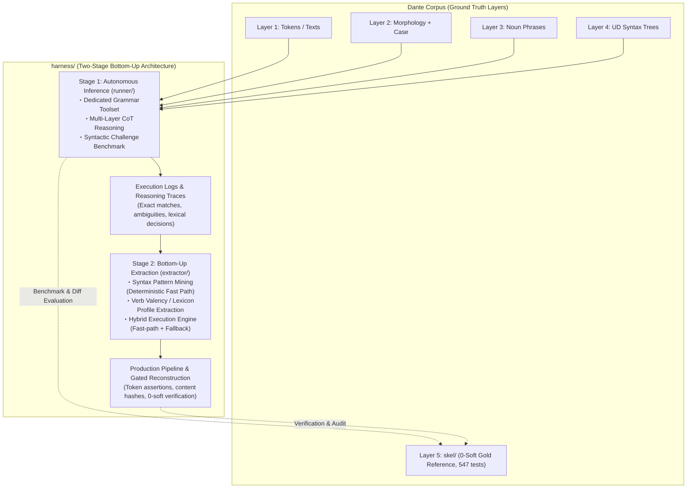

# Grammar Agent Harness: Overall Architecture & Master Plan

## Handoff — resume here

Temporary notes for the next session; durable state lives in **Current Status**
and the **Milestone Ledger** below.

**Next action — Stage 4: the OPERATOR launches the full-corpus (100-canto)
verification with `make -f harness/recon/Makefile -j3 inferno purgatorio
paradiso` — three canticle-parallel streams; commands and contract in
[`STAGE4.md`](STAGE4.md) — then the corpus-wide readout closes the stage.
Nothing is in flight on the assistant side.**

Stage 3 CLOSED 2026-08-25 on record S3.11 ([`STAGE3.md`](STAGE3.md)): the
inferno-1 cap experiment (`harness/recon-inf1-cap6k.log`) passed every S3.10
criterion — F1 0.7600 in band, one cap trigger regenerating to the expected
114 B opener, peak context 21.7 kB vs re-run #2's 37.3 kB (−42%), pressure
margins widened across the board (×3 average 71%, peak call 46% solo,
rolling-60 93%, api-retry tax 0.24%) — with two honestly-recorded flags:
gate-pass 14/34 vs the usual 18–19 (four soft-tag-only flips in chronically
volatile units; cap causally excluded; row-level quality in band — pass
counts are the noisy instrument) and wall +19% (one thinking-heavy episode
on L106–108, 816 s vs 124 s; median call time fell; not quota). Full
decomposition, including the cross-run fp-drift observation
(100→103→116→125, confounded with config changes), in S3.11.

**Scope change (operator decision, 2026-08-25): the 99-canto expansion moved
out of Stage 3 into its own Stage 4.** Stage 3 delivered and closed: the
design (S3.2), the implementation (S3.3), confirmation runs #1/#2
(S3.4/S3.9), the compaction removals (S3.5–S3.7), the provider token records
(S3.8), the generation-side runaway cap (S3.10), and the closing
cap-experiment readout (S3.11). Launch configuration carried into Stage 4 as
recommended on S3.9/S3.11: `--min-send-interval` default 0 (reactive-only) +
the shared TokenBucket (`harness/tokbucket.state`) on all three shells +
`--max-length` default 6000 chars — final call remains the operator's, at
launch. Standing constraint holds: session semantics change between runs,
never mid-run.

Watch items carried into Stage 4 (from all four inferno-1 logs): the
fast-routed unit fails Gate 2 (routing `complete` ≠ checker-clean);
agent-originated hard violations surface only through the checker; quota tax
varies run-to-run (measured range 0.24%–9.4%); 0-soft unit pass counts
fluctuate ±4–5 between runs while row-level F1 holds the band — judge quality
by verify-gold F1, treat gate-pass counts as noisy; bucket-under-contention
is measured here for the first time.

Orientation for fresh sessions (durable):

1. **Read first**: [`extractor/PLAN.md`](extractor/PLAN.md) (§3–§5), then
   [`../ARCHITECTURE.md`](../ARCHITECTURE.md) §4–§6 (observability + log
   contract; `reconstruct.py` already ships it incl. resume).
   The Stage-1→2 interface stays the trace contract:
   `UnitResult.trace_record()` (`runner/agent.py`) embedded as `"trace"` in
   every benchmark case record. The hybrid seam is callable-level:
   `HybridEngine.run_unit(..., fallback=agent_fallback(model=...))`;
   `reconstruct.main(..., fallback=...)` accepts an injected callable for
   deterministic work.
2. **Mining inputs — four complete 87-case JSONL run logs on disk** (all
   gitignored, disk-only; regenerate rather than re-mine if lost):
   M1.4 originals (`harness/bench-unit.log`, `harness/bench-predicate.log`)
   plus the instrumented re-runs (`harness/bench-unit-retry.log`,
   `harness/bench-predicate-retry.log`; finished 2026-08-24). The engine's
   `mine_artifacts()` regenerates rule table + lexicon from them in seconds;
   no mined artifact needs to be frozen on disk.
3. **Error structure to mine around** (details in
   [`STAGE1.md`](STAGE1.md), M1.4 entries):
   systematic gold-convention divergence on verbless frames dominates
   `historical` misses; bare-`obl` over-assignment (74 fps) and `xcomp`
   over-generation are the top noise sources; `obl:di` / `obl:in` recall
   0.54–0.60 fed lexicon_builder directly (140 frames at 100% consistency
   mined, incl. fare+di / avere+di / sedere+in — see [`STAGE2.md`](STAGE2.md),
   M2.2 Ledger entry).
   The 31 well-formed unit-side `upstream_feedback` records await HUMAN
   triage — never auto-retag.
4. **Boundaries that hold**: `extractor/` consumes traces + operator-side
   gold (`skel.io`) like `benchmark.py` does; agent-side masking (§4 item 1)
   applies to anything that runs *as* an agent — the engine's execution face
   and `reconstruct.py`'s execution/commit faces never open gold at all
   (adversarially tested), only evaluation faces (`evaluate_fast_path`,
   `--verify-gold`) do; `fixtures/challenge_cases.py` stays data-only. Tests
   live at repo root (`tests/test_harness_*.py`). `skel/` is protected:
   reconstruction writes need the explicit `--write` flag on top of passing
   all three gates, canto-atomically.
5. **Wire/cost instrumentation** (shipped across Stages 2–3, live-proven on
   every run): the fallback appends one `llm_request`/`llm_response` JSONL
   pair per backend LLM call — timestamps, model, session/unit coordinates,
   attempt, context/new/output/thought byte sizes, provider token counts
   (`input/output/thought/total_tokens`), duration, `paced_seconds`,
   `max_length_retries`; join key `(session, messages, attempt)`;
   429/quality retries inside `Client` stay transparent to the wire records,
   counted by the `wait_retry` counters. `unit` records carry `row_keys`
   (unit-level resume); every `canto_complete` carries `elapsed_seconds`,
   summed into the summary's `wall_clock_seconds`. All canto-scoped like
   every other record.
6. **Prior-session notes preserved from earlier handoffs** (full narratives
   in the stage ledgers): unit-level resume shipped for `reconstruct.py`
   (2026-08-25; `prepare_resume` returns `pending_units`,
   `reconstruct_canto` accepts `skip_units`, per-record flush); the interim
   convention health check (2026-08-25, informational, no action warranted:
   parse failures 2 / 1,248 turns (0.16%), dispatch errors 1 / 905,
   `read_unit` served exactly once per session (174/174), INVALID→repair
   42 / 726 = 5.8%; the heavyweight was the pre-R1 `read_unit` return value —
   already cut); ARCHITECTURE §0 implementation checklist added 2026-08-25;
   Stage-3 session history 2026-08-24 → 2026-08-25 in
   [`STAGE3.md`](STAGE3.md)'s ledger (S3.1–S3.11).

**Session housekeeping (2026-08-25, closing assistant session): the cap
experiment read out into record S3.11 and STAGE 3 CLOSED on it; the
99-canto expansion re-scoped into Stage 4** ([`STAGE4.md`](STAGE4.md), new):
launch configuration table, three-shell commands, watch items, corpus-wide
readout criteria, empty S4.x ledger. Docs restructure: PLAN.md's Milestone
Ledger no longer carries any full Stage-3 record — S3.1 moved verbatim into
[`STAGE3.md`](STAGE3.md)'s ledger (with inline pointers to its later
corrections), and PLAN.md keeps only summaries + pointers, mirroring the
Stage-1/2 treatment. Open parked decisions carried visibly: the benchmark
stays uncapped until its own `--max-length` decision (S3.10);
`submit_candidate` protocol question at [`TOOLCALL.md`](TOOLCALL.md) §7.1;
31 `upstream_feedback` records await HUMAN triage (item 3). Readout tooling:
ephemeral `/tmp/opencode/cap_readout.py`, validated to reproduce S3.9
exactly before use (methods recorded in S3.11 and STAGE4.md §5 — recreate
if lost). **Nothing is in flight on the assistant side; the operator's
Stage-4 launch is the next act.**

**Session housekeeping (2026-08-26, closing assistant session): pre-launch
operation change shipped per operator request — record S4.1 in
[`STAGE4.md`](STAGE4.md)'s ledger.** `harness/recon/Makefile` is now the
launch interface: one streaming JSONL log per canto at
`harness/recon/<canticle>/NN.log`, and the completion gate is each log's
own summary record evaluated inside the recipe (`FORCE` prerequisite —
make timestamps play no role), so resume is always "re-run the same
command"; model override via `MODEL=`, single canto via full-path target.
Verified LLM-free end to end (help text; 100-target expansion 34/33/33
with sequential canto numbers; skip branch live-tested against a real
complete log; run branch against a `uv` shim — the assistant executed no
LLM CLI). Known hairline, accepted and documented in the Makefile: a
summary line truncated mid-write by a crash could read as complete; the
corpus-wide readout catches it. STAGE4.md §1/§3 rewritten around the
driver; §5 gained the readout input contract — session numbers repeat
across files, so joins are namespaced per file before any merge, and TPM
pressure is only measurable from the cross-file timestamp merge; hygiene
now requires all 100 logs present with parseable summaries. **The
corpus-wide readout script does not exist yet** — recreate it ephemerally
per the §5 method note when the runs land, validating against a complete
single-canto file first. Nothing else pending on the assistant side; the
operator's launch remains the next act.

---

## Current Status

- [x] **Stage 1 — Autonomous Inference & Capability Benchmark: COMPLETE**
      (toolcall T1–T5 + milestones 1.1–1.4 incl. the instrumented re-runs).
      XML protocol adopted as official wire format (probe 0.957 ≥ 0.95,
      parity interop 24/24 twice); 87-case benchmarks run for BOTH workflows
      at quality parity (micro F1 0.711 unit vs 0.708 predicate; default
      `unit`); traces pooled for Stage 2 mining. Record archived 2026-08-24:
      milestones, ledger, and carry-over resolutions in
      [`STAGE1.md`](STAGE1.md); protocol ledger in
      [`TOOLCALL.md`](TOOLCALL.md) §8.
- [x] **Stage 2 — Rule & Lexicon Extraction** (`harness/extractor/`,
      milestones 2.1–2.5): COMPLETE (2026-08-24). Deterministic mining
      delivered 183 fast-path rules at 100% precision (31.4% gold coverage)
      and a 140-frame verb valency lexicon; the hybrid engine's fast path
      covers only 7.0% of units, so agent fallback is the primary path;
      the gated reconstruction pipeline verified live on inferno 1 twice
      (pilot + recheck): 18/34 units gate-pass each run, verify-gold micro
      F1 0.78 / 0.796 ≥ the Stage-1 band, `written_cantos == 0` protection
      confirmed both times. The recheck's request-granularity readout closed
      the quota question and **failed the Stage-3 launch gate**
      (compaction/pacing required). Record archived 2026-08-24:
      milestones, ledger, carry-overs, and the pilot/recheck readouts in
      [`STAGE2.md`](STAGE2.md); spec in [`extractor/PLAN.md`](extractor/PLAN.md).
- [x] **Stage 3 — Context Optimization: COMPLETE (2026-08-25, closed on
      record S3.11)** — opened 2026-08-24 when the M2.5 recheck closed
      Stage 2; re-scoped just before the close (operator decision): the
      full-corpus expansion moved out into **Stage 4**, so the delivered
      scope is context optimization + launch hardening. Shipped and live:
      positional `read_unit` serving (tier R1 with S1 fallback), verbatim
      transcripts (compaction removed, S3.7), flat tool-spec JSON in the
      system prompt, pacing instruments (`--min-send-interval`, shared fcntl
      `TokenBucket`, `paced_seconds`), provider token counts +
      `thought_bytes` on every `llm_response` (S3.8), and the
      generation-side runaway cap (`--max-length`, default 6000 chars,
      durable `max_length_retries`, S3.10). Confirmation arc: run #1 (S3.4)
      caught the fallback-wiring bug → fixed with regression test; re-run #2
      (S3.9) passed every criterion unpaced (F1 0.7728 in band, ×3 average
      87% = first pass of that gate, retry tax 1.50%); the cap experiment
      (S3.11) passed every S3.10 criterion (F1 0.7600 in band, one trigger
      regenerating to the expected 114 B opener, peak context −42%, ×3
      average 71%, tax 0.24%) — flags investigated and characterized:
      gate-pass 14/34 is soft-tag noise in chronically volatile units (cap
      causally excluded; row-level quality in band), wall +19% is one
      thinking-heavy episode. Launch pacing settled: reactive-only wins solo
      (unpaced 1.50% ≈ run #1's paced 1.6%; ×3 = 87–71% across the two
      unpaced runs); the shared bucket carries the three-stream launch for
      inter-stream coordination. Records S3.1–S3.11 in
      [`STAGE3.md`](STAGE3.md). Standing constraint holds: session semantics
      change between runs, never mid-run.
- [ ] **Stage 4 — Full-Corpus Verification (99-canto scale-out)**
      (OPENED 2026-08-25 by operator re-scope as Stage 3 closed): the gated
      pipeline runs over all cantos as three canticle-parallel streams
      (inferno / purgatorio / paradiso) driven by
      [`harness/recon/Makefile`](recon/Makefile) — one log per canto
      (`harness/recon/<canticle>/NN.log`), each log's summary record gates
      completion, resume is unit-level within a canto via re-running the
      same command — behind every Stage-3 gate, gold
      immutable (`--write` stays off, `written_cantos == 0` expected).
      Launch configuration carried from S3.9/S3.11: interval default 0 +
      shared TokenBucket (`harness/tokbucket.state`) + cap 6000 — final
      call: operator, at launch. Commands, watch items, and readout
      criteria live in [`STAGE4.md`](STAGE4.md); wall-clock projection
      ≈ 180 ks ≈ 2.1 days compute-only for the longest canticle. Closing
      act: the corpus-wide readout into STAGE4.md records (per-canticle F1
      baselines — inferno against the 0.744–0.796 band, purgatorio /
      paradiso establishing their own; gate-pass rates per canto; TPM
      pressure under genuine three-stream bucket contention, measured here
      for the first time).
- Open design question (protocol layer): a dedicated `submit_candidate`
  termination tool — the practical half is resolved by the nudge policy
  ([`STAGE1.md`](STAGE1.md) carry-over 3); tracked as
  [`TOOLCALL.md`](TOOLCALL.md) §7.1.
- Closed operational issue (2026-08-23, predicate full run): long agent
  contexts tripped the Gemini API's per-model input-token quota — the
  measurement trail lives in [`STAGE2.md`](STAGE2.md)'s M2.5-recheck entry
  and the corrected accounting + burst mechanism in
  [`STAGE3.md`](STAGE3.md) §1. Resolved through Stage 3: R1 payload
  serving, slim system prompt, reactive-only pacing with the proven Client
  auto-retry backstop, and the shared bucket for parallel launches.
  Historical quota-tax measurements: predicate 103 backoffs / 3,196 s =
  14.4% of wall vs unit 55 / 1,659 s = 8.4% (2026-08-24 instrumented
  re-runs); live-run range across all four inferno-1 confirmation logs
  0.24%–9.4%.
- Test suite: **864 passed** (547 corpus + 46 `test_harness_tools.py` +
   76 `test_harness_toolcall.py` + 39 `test_harness_agent.py` +
   39 `test_harness_benchmark.py` + 23 `test_harness_syntax_miner.py` +
   17 `test_harness_lexicon_builder.py` + 27 `test_harness_hybrid_engine.py` +
   34 `test_harness_reconstruct.py` + 16 `test_harness_pacing.py`).

---

## Milestone Ledger

*Stage-1 records (toolcall T1–T5, milestones 1.1–1.4 + carry-over
resolutions) live in [`STAGE1.md`](STAGE1.md) and [`TOOLCALL.md`](TOOLCALL.md)
§8; the completed Stage-2 record — milestones 2.1–2.5 incl. the inferno-1
pilot and the closing recheck readout — was split off on 2026-08-24 to
[`STAGE2.md`](STAGE2.md). All Stage-3 records S3.1–S3.11 live in
[`STAGE3.md`](STAGE3.md)'s ledger (S3.1 moved there verbatim at stage close,
2026-08-25; stage closed on S3.11); Stage-4 records accrue in
[`STAGE4.md`](STAGE4.md)'s ledger.*

---

## 1. Overview & Paradigm Shift: Generalizable Layer 5 Reconstruction

`harness/` is a dedicated **Grammar Agent Harness for Local LLMs** (e.g., **Gemma 4 31B**), designed to systematically reconstruct Layer 5 predicate-argument skeletons (`skel/`) from multi-layer grammatical contexts (Layer 1 text/tokens, quotes hierarchy, Layer 2 morphology, pronoun case annex, Layer 3 noun phrase spans, and Layer 4 Universal Dependencies syntax trees).

### Motivation & Rationale
1. **Historical Context & Limitations of `skel/`**:
   - Layer 5 (`skel/`) was historically produced by a **small local LLM**
     (`ollama:gemma4:31b-it-qat`, pinned in `model.mk`) driving the driver's
     `--fix` regeneration loop; its residual errors were then triaged through an
     interactive, semi-manual process in which a frontier LLM (Claude Opus 5,
     later switched to Gemini 3.7 Flash at the end of Phase 8) and human
     operators read the outlier positions to formulate 130 deterministic rules
     (Rules A–EI) and hand-apply the corrections recorded in
     [`CORRECTIONS.md`](../skel/CORRECTIONS.md).
   - Throughout, the small model was granted **no autonomy**: it ran on rails
     laid down by the larger model — executing repairs inside a checker/rule
     system it did not shape, with everything beyond those rails escalated to
     the frontier-LLM/human triage loop.
   - Although this successfully produced a 100% clean corpus (**0 hard / 0 soft violations across all 100 cantos**, 547 pytest passing), the **construction methodology itself was ad hoc, bespoke to Dante's Italian, and insufficiently automated**.
   - As a result, the Phase 5–8 methodology cannot be directly generalized to other texts, genres, or languages (such as Latin).
2. **Mission of `harness/`**:
   - The gist of `harness/` is to grant the local model that missing **autonomy**: remove the hand-laid rails and let it reason from linguistic first principles, deciding its own path through multi-layer context and closed tools instead of executing rules handed down by a larger model.
   - `harness/` embeds this autonomous agent in a **reproducible, fully automated, and generalizable reconstruction pipeline**.
   - Preserving `skel/` as an **immutable Gold Standard (Ground Truth)** for benchmark evaluation, `harness/` demonstrates how local LLMs can autonomously project Layer 4 UD syntax onto predicate-argument frames (Stage 1) and empirically induce syntax rules and valency lexicons (Stage 2).

---

## 2. Staged Strategy: Bottom-Up Core + Scale-Out

In contrast to the top-down methodology used in Phases 5–8 — where frontier LLMs deduced abstract rules that the local executor then followed mechanically, without autonomy of its own — `harness/` hands agency to the local model and adopts an empirical **bottom-up strategy (instance-level inference ➔ pattern induction)** across Stages 1–2, with Stage 3 as context optimization + launch hardening (closed 2026-08-25) and Stage 4 as the operational scale-out.

### Stage 1: Autonomous Local Inference & Capability Benchmark (`harness/runner/`)
- **Approach**: For each parse unit, the agent receives the multi-layer context (L1–L4, quotes, case) and autonomously solves predicate-argument frames on the fly using Chain-of-Thought (CoT) and a dedicated Tool Calling API (`validate_candidate`, etc.).
- **Objectives**:
  - Quantitatively benchmark local LLM capabilities (1-shot exact match rate, multi-turn self-correction convergence rate, role-level F1) against the 0-soft Gold Standard (`skel/`).
  - Capture comprehensive execution logs, successful syntax projections, and lexical decision traces (e.g., argument vs. adjunct discrimination, reflexive pronouns, control verbs).
- **Specification**: [`harness/runner/PLAN.md`](runner/PLAN.md).

### Stage 2: Bottom-Up Rule & Lexicon Extraction (`harness/extractor/`)
- **Approach**: Mine and aggregate the reasoning logs and decision trajectories from Stage 1 to:
  1. Extract stable, deterministic Universal Dependencies patterns as **Syntax Fast-Path Rules**.
  2. Aggregate verb-preposition-case co-occurrences into an empirical **Verb Valency Lexicon**.
  3. Construct a **Hybrid Execution Engine** combining deterministic fast paths (rules + lexicon) with fallback to Stage 1 agent inference for ambiguous or rare contexts.
- **Objectives**:
  - Maximize cross-corpus consistency and reduce inference latency and token overhead (targeting >80% fast-path coverage).
  - Provide a gated production pipeline that reconstructs cantos under strict 0-soft regression verification and content hash updating.
- **Specification**: [`harness/extractor/PLAN.md`](extractor/PLAN.md).
- **Status**: COMPLETE (2026-08-24); record archived in
  [`STAGE2.md`](STAGE2.md) — the >80% fast-path target measured MISS at
  7.0%, so agent fallback remains the primary path and the gated pipeline's
  honest output is protection.

### Stage 3: Context Optimization (opened 2026-08-24, CLOSED 2026-08-25)

Closed on record S3.11 with the full-corpus expansion re-scoped out into
Stage 4. The arc: the S3.1 correlation analysis (two accounting points
corrected by S3.2 — [`STAGE3.md`](STAGE3.md) §1), **the compaction/pacing
design + deterministic gate re-check (record S3.2)**, and **the
implementation (record S3.3)** — spec, gate verdicts, implementation map,
measured deviations, and the stage ledger live in [`STAGE3.md`](STAGE3.md).
**Record S3.7 cut transcript compaction from the design**: measured against
run #1's own records it bought 0.5% of the wire and cost the model its own
session history; the byte reduction moved into the system prompt itself
(tool specs rendered flat: 10,706 → 8,954 B on every call, no wording
changed). Live levers at close: R1 payload serving + prompt size + pacing.
**Record S3.9 read out confirmation re-run #2: every criterion passed, ×3
average 87% unpaced — first pass of that gate**; **S3.10 added the
generation-side runaway cap (6,000 chars default)**; **S3.11 read out the
cap experiment — every criterion PASS — and closed the stage.**

### Stage 4: Full-Corpus Verification (opened 2026-08-25)

The 99-canto scale-out as its own stage: three canticle-parallel streams
(inferno / purgatorio / paradiso) driven by `harness/recon/Makefile`,
behind every Stage-3 gate, gold immutable,
launch configuration carried from S3.9/S3.11 (interval default 0 + shared
TokenBucket + cap 6000). Commands, watch items, readout criteria, and the
stage ledger live in [`STAGE4.md`](STAGE4.md); scope and constraints tracked
in Current Status + the Handoff.

### Beyond Layer 5 (design notes)

Directions that open up **after** the `skel/` reconstruction — a layer swap
(same machinery, different target layer), a vertical whole-stack slice, and the
horizon of reconstructing grammar for a language with no available description
— are kept out of this plan in [`FUTURE.md`](FUTURE.md). None of it is
scheduled work; `PLAN.md` remains the source of truth for status and
milestones.

### Transport & backend policy

Decision record (2026-08-22): measured at roughly 3× the local speed, **XML
(`PromptXmlTransport`) was adopted as the official wire format for Stage 1/2
production runs; native Ollama tool calling (`OllamaNativeTransport`) stays
implemented and gated for comparison experiments** (re-run
`harness.toolcall.parity` when revisiting local-only deployments). Backend
choice remains free: `google:gemma-4-31b-it` when wall clock matters,
`ollama:gemma4:31b-it-qat` for offline/cost-constrained work — both validated
end-to-end over the XML protocol during the T4/T5 gates.

Adapter policy (2026-08-24): the stateful `llm7shi.Client` adapter is the
common model-access specification; the stateless probe/parity adapters and the
skel drivers' disposable-Client pattern are legacy from the trial-and-error
phase. The standing rules live in [`../ARCHITECTURE.md`](../ARCHITECTURE.md)
(§2 Model access, §3 Wire protocol).

---

## 3. Separation of Concerns

The directory map lives in [`README.md`](README.md#directory-structure) —
single source, not duplicated here. The boundaries it encodes:

- **`skel/` is protected, not a dependency.** Gold TSVs, the 130-rule registry,
  and [`CORRECTIONS.md`](../skel/CORRECTIONS.md) are the evaluation reference
  and are masked from agents structurally (§4 item 1); only operator-side
  benchmark code reads them.
- **`toolcall/` is a layer- and task-agnostic protocol library.** It knows
  nothing about grammar: wire format, transports, and the multi-turn loop only.
  Everything grammatical lives in `runner/`.
- **`runner/` (Stage 1) produces traces; `extractor/` (Stage 2) consumes
  them.** The contract between the stages is `UnitResult.trace_record()`, not
  shared internals.
- **`fixtures/` is data, read operator-side only.** Nothing under `runner/`
  imports it, so the agent path cannot see the benchmark's case selection.
- **Tests live at the repo root** (`tests/test_harness_*.py`) alongside the
  corpus suite, so the harness stays inside one pytest run.

---

## Environment & Artifacts (reference)

- **Python always runs through `uv`** (`uv run python ...`, `uv run pytest ...`);
  never invoke a bare `python3`. Every command below follows this.
- **Session division of labor**: assistant sessions execute deterministic,
  LLM-free work only (tests, extraction/mining, artifact inspection); every
  LLM-in-the-loop command (the probe / parity / benchmark / agent /
  reconstruction CLIs) is run by the human operator, not by the assistant.
- Live probe: `uv run python -m harness.toolcall.probe --model <model> --repeat N --log
  harness/probe.log` — streaming JSONL: one scenario record per completed scenario,
  summary record last (a log without the summary line = interrupted run);
  `*.log` is gitignored.
- Migration parity check (T5, live run PASSED 2026-08-22): `uv run python -m
  harness.toolcall.parity
  --model <model> [--repeat N] [--log harness/parity.log]` — same log semantics;
  hard gate = canonical interop on both transports.
- Single-unit session CLI (live smoke tests): `uv run python -m harness.runner.agent
  --canticle inferno --canto 1 --line-start 1 [--line-end N] [--trace trace.jsonl]`.
- Benchmark CLI (milestone 1.3): `uv run python -m harness.runner.benchmark [--category
  C]... [--case-id ID]... [--limit N] [--list] [--log bench.log] [--full-transcript]`.
  An existing `--log` resumes: completed cases reload into the aggregate and are
  skipped; the summary sums per-session durations across all attempts.

---

## 4. Standing Invariants & Disciplines

1. **Strict Masking of Gold Layer 5**:
   - `runner/` agents are strictly forbidden access to gold `skel/*.tsv`, the 130-rule registry, and historical correction records ([`CORRECTIONS.md`](../skel/CORRECTIONS.md)).
2. **No Free-Form Bash Execution**:
   - Agents operate strictly via closed, structured Tool Calling (`tools.py`) without shell execution privileges.
3. **Preservation of the 0-Soft Regression Gate**:
   - Benchmark and evaluation modes operate strictly in-memory or write to scratch buffers; gold TSVs in `skel/` are never overwritten during benchmark runs.
4. **Upstream Discrepancy Channel**:
   - Discrepancies identified in upstream layers (Layer 2 morphology or Layer 4 UD syntax) are emitted as structured `upstream_feedback` records for human audit and triage.
5. **Live-Run Observability & Log Durability**:
   - LLM-in-the-loop runs are inherently slow (minutes per turn on local
     models, hours per benchmark), and an unwatchable run is an unusable run:
     every operator-facing CLI must keep progress **visible by default**, not
     silent-until-finished.
    - The standing specification — stderr streaming, session separators and the
      optional `HarnessStatusLine` status bar, per-turn timings rolled into
      summaries (`turn_seconds`, `slow_turns`, `api_retries`), turn-granularity
      discipline, log durability independent of shell redirection, and the
      streaming JSONL log contract with its summary-last completion marker and
      resume semantics — lives in [`../ARCHITECTURE.md`](../ARCHITECTURE.md)
      (§4 Live-run observability, §5 Streaming JSONL log contract, §6 Reporting
      shape). It is a standing requirement, not a one-off patch: new live entry
      points (Stage 2's `extractor/` CLIs included) must ship it from day one,
      keep the human-facing progress display on stderr by convention (JSONL
      logs go to their own `--log` files, never to redirected console output),
      and any future transport must preserve it.
    - The concrete wiring — status-bar labeling (Canticle Canto Line),
      markup-disabled shared console, the model-access layer sharing that
      stream, `wait_retry` snapshot/delta accounting, and the new-`Client`
      blank-line spacing — is the ARCHITECTURE.md §4 standard itself now, not
      a pattern restated per plan; `reconstruct.py` (2026-08-24) is where it
      first shipped end-to-end and stays the template to copy.
