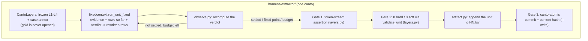

# `harness/extractor/`: the reconstruction pipeline

The bounded loop that solves one parse unit, the gates around it, and the
durable artifact it writes. What it *shows* the model is
[`../runner/PLAN.md`](../runner/PLAN.md); this document specifies the pipeline.

**What this file is now.** It opened as the Stage-2 plan for a bottom-up
extraction pipeline: mine deterministic rules and a valency lexicon from Stage-1
traces, run a two-tier engine that derives what it can without a model call, and
fall back to the agent for the rest. Stage 2 built all of it and **measured the
fast path's own target as MISS** — >80% unit coverage was the goal, 7% was the
outcome (`../stages/02.md` M2.3), so agent fallback stayed the primary path for
every stage after it. On 2026-09-07 the miners and the router were deleted and
every unit now reaches the model (`../PLAN.md` Handoff). What Stage 2 built and
measured is recorded in [`../stages/02.md`](../stages/02.md), which is untouched.

The pipeline that remains is Stage 2's fourth deliverable — the gated
reconstruction — running Stage 9's execution mode.

**The apparatus moved out.** The machinery below is `dante_corpus.harness`,
which imports nothing else from `dante_corpus` and knows what a row means only
through the `RowCodec` it is handed. What stays here is Layer 5's: the gates'
content, the levels, the verdict, and the wiring that hands all three over.

| Module | Holds | Whose |
|---|---|---|
| `reconstruct.py` | Gate 3 (`commit`), the CLI, and the subject wiring | Layer 5 |
| `layers.py` | `CantoLayers` (frozen L1-L4 + case annex), gates 1-2, `SKEL_CODEC` / `SKEL_SUBJECT` | Layer 5 |
| `observe.py` | [Stage 9] The verdict: frozen-layer observations on the rows so far; `SkelObserver` | Layer 5 |
| `fixlevel.py` | [Stage 6/8/10] The soft-finding levels and their selection — the apparatus's `Criteria` | Layer 5 |
| `artifact.py`, `fixrun.py`, `fixedcontext.py` | One-line bindings of the apparatus modules of the same name | Layer 5 |
| `harness.pipeline` | The canto loop over the parse units, gates 1-2 applied | apparatus |
| `harness.fixedcontext` | [Stage 9] The bounded per-unit step and its live model closure | apparatus |
| `harness.outcome` | `UnitOutcome` / `CantoReconstruction` + unit-level resume | apparatus |
| `harness.artifact` | `render_tsv` + `TsvArtifact`: the run's durable artifact | apparatus |
| `harness.fixrun` | [Stage 6] `--fix`: plan, verdict, salvage, revert | apparatus |
| `harness.report` | `ReconstructReport` + `load_log` | apparatus |



---

## 1. The bounded step (`fixedcontext.py`, `observe.py`)

One request per iteration, whose size is a function of the unit rather than of
the iteration count: specification $P$ + frozen-layer evidence + the unit's rows
so far + the verdict on them, in and one `<rows>` block out. The runtime
iterates; the model does not hold a transcript. The argument for it, and the
measurements, are [`../stages/09.md`](../stages/09.md) §2–§5.

**Generation and repair are one loop, differing only in the rows the first step
is given**: empty for a fresh unit, the artifact's recorded rows under `--fix`.
A unit settles when the verdict comes back empty, when its rows come back
unchanged (fixed point), or when `--fixed-iterations` runs out — a cost cap, not
a target.

## 2. The soft repair levels (`fixlevel.py`, `fixrun.py`)

A level names a soft-finding class argued from the layer's own contract, never
from reading gold. `fixlevel` selects the units carrying a finding and builds
the notice the model is shown — the invariant and the frozen-layer evidence
only, never the derivation's answer. `fixrun` judges what comes back: an answer
that is not hard-clean, does not reduce the level's findings, or introduces a
new violation class is retried at position scope and otherwise refused, and the
recorded rows stand. Levels 1–3 are closed; the design work is in
[`../stages/06.md`](../stages/06.md), [`08.md`](../stages/08.md) and
[`10.md`](../stages/10.md), and no further level will be defined.

---

## 3. Gated TSV commits (`reconstruct.py`)

Candidate skeleton rows must satisfy all three criteria before disk write:

1. **Token Stream Assertion**: exact token-for-token alignment with Layer 1;
   each row's word anchor is taken verbatim from that stream.
2. **0-Soft Regression Gate**: `skel.validate.validate_unit` (which runs
   `derive_unit` inside it) over the assembled rows with all four frozen layers
   attached, split hard/soft as the drivers do (`tag` → soft), required at
   **0 hard / 0 soft**.
3. **Content Hash Verification**: the bytes are digested before the write, and
   `hashes.canto_hashes()["skel"]` must recompute that digest afterwards — a
   mismatch rolls the artifact back.

Commits are **canto-atomic** (every unit must pass) and need an explicit
`--write`; the default run reconstructs, verifies and reports without touching
disk. Resume state is the canto's TSV, not the log: a unit whose lines are
already present is not re-run, so deleting a stretch's lines and re-running is
the gesture that asks for that unit back.

**Gold is not opened anywhere in this pipeline.** The evaluation face that used
to sit beside the gates (`goldeval.py`, `--verify-gold`) was removed on
2026-09-07 with the rest of the gold-referenced readouts
([`../../layers/PLAN.md`](../../layers/PLAN.md) §3.1 item 2).

### 3.1 CLI usage

```bash
# Dry-run inspection on a single canto
uv run python -m harness.extractor.reconstruct --canticle inferno --canto 1 --dry-run

# One canto, writing its artifact and resuming off it
uv run python -m harness.extractor.reconstruct --canticle inferno --canto 1 \
    --log inferno/01.log --tsv inferno/01.tsv

# Reopen that canto's units carrying a level-3 soft finding
uv run python -m harness.extractor.reconstruct --canticle inferno --canto 1 \
    --fix 3 --log inferno/01.log --tsv inferno/01.tsv
```

[`../recon/Makefile`](../recon/Makefile) is how these are actually run — it owns
the corpus-wide targets, the launch configuration and the readouts.

---

## 4. Record

Stage 2's milestones 2.1–2.5 — the syntax pattern miner, the valency lexicon
builder, the hybrid engine router, this gated pipeline, and the gold
verification through the recheck — are recorded in full in
[`../stages/02.md`](../stages/02.md), kept as written. Of what they delivered,
`reconstruct.py` survives; `syntax_miner.py`, `lexicon_builder.py` and
`hybrid_engine.py` do not.
