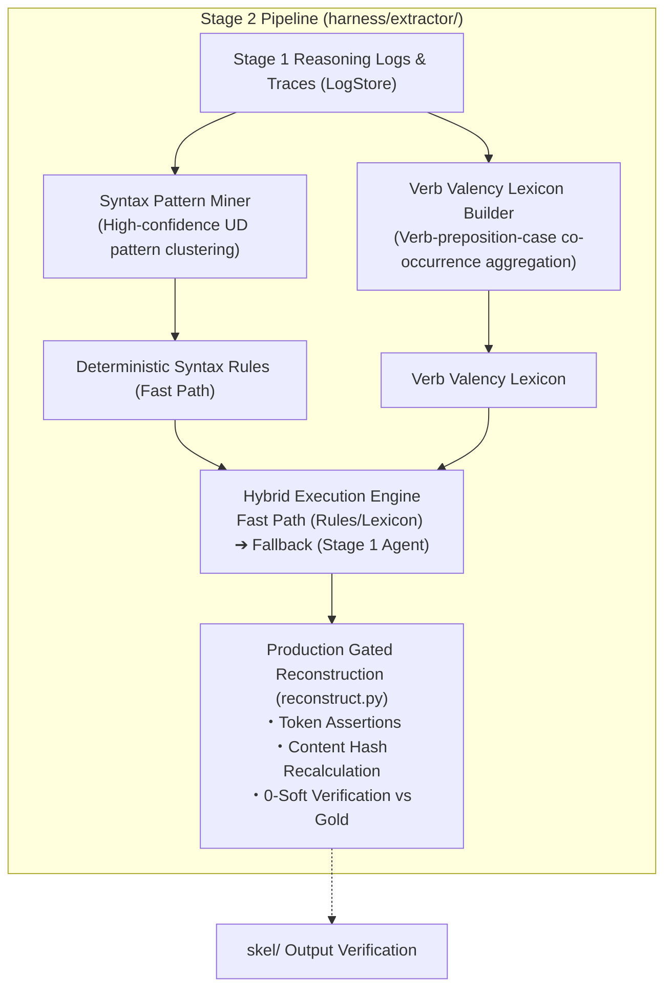

# Stage 2 Plan: Bottom-Up Extraction & Hybrid Engine (`harness/extractor/`)

## 1. Overview & Objectives

Stage 2 implements the bottom-up pattern extraction and hybridization pipeline. It ingests the inference traces, exact-match logs, and lexical disambiguation histories collected in Stage 1 (`harness/runner/`) to empirically synthesize:
1. **Deterministic Syntax Fast-Path Rules**: Universal Dependencies patterns that consistently yield 100% precision.
2. **Verb Valency Lexicon**: Empirical argument-vs-adjunct profiles for verbs and prepositional complements (`obl:<prep>`).
3. **High-Speed Hybrid Execution Engine**: Combining fast-path rules/lexicon (>80% unit coverage) with fallback to Stage 1 agent inference.
4. **Production Reconstruction Pipeline**: Gated full-canto build with token assertions, content hash recalculation, and 0-soft verification against the Gold Standard.



---

## 2. Extraction Components

### 2.1 Syntax Pattern Miner (`harness/extractor/syntax_miner.py`)
- **Objective**: Identify recurring UD subtrees (combinations of `deprel`, `pos`, and `head` relations) where the local model achieved 100% 1-shot exact match without ambiguity (e.g., standard direct objects, explicit nominal subjects, unaccusative structures).
- **Capabilities**:
  1. Cluster successful 1-shot logs by Universal Dependencies topology.
  2. Emit high-confidence derivation rules as executable Python predicates.
  3. Compute deterministic coverage across the entire corpus.

### 2.2 Verb Valency Lexicon Builder (`harness/extractor/lexicon_builder.py`)
- **Objective**: Resolve lexical ambiguities by aggregating decisions on verb complementation (e.g., whether `obl:di`, `obl:a`, `obl:in`, or `obl:per` functions as an argument `arg` or an adjunct modifier) and reflexive `si` classifications.
- **Capabilities**:
  1. Aggregate verb-lemma co-occurrences with prepositional dependents across all cantos.
  2. Formulate empirical valency frames with confidence thresholds.
  3. Normalize lexical interpretations across the entire corpus.

---

## 3. Hybrid Execution Engine (`harness/extractor/hybrid_engine.py`)

A two-tier execution engine optimizing latency, cost, and consistency:

1. **Tier 1: Fast Path (Deterministic Rules + Valency Lexicon)**
   - Units matching mined syntax patterns and registered lexical frames are derived deterministically in sub-millisecond time without LLM calls.
2. **Tier 2: Agent Fallback (Stage 1 Gemma 4 Runner)**
   - Unregistered lemmas, ambiguous polysemous contexts, or structural conflicts are routed to the Stage 1 autonomous CoT agent.
3. **Benefits**:
   - Reduces total LLM token consumption and runtime by >80%.
   - Ensures strict reproducibility for canonical constructions while preserving agentic reasoning for complex poetic syntax.

---

## 4. Production Pipeline & Gated Reconstruction (`harness/extractor/reconstruct.py`)

Provides a unified CLI for single-unit debugging and full-canto reconstruction under strict safety gates:

### 4.1 Gated TSV Commits
- Candidate skeleton rows must satisfy all three criteria before disk write:
  1. **Token Stream Assertion**: Exact token-for-token alignment with Layer 1.
  2. **0-Soft Regression Gate**: Verified at 0 hard and 0 soft violations via `derive_unit` and intrinsic validators.
  3. **Content Hash Verification**: Automatic hash recomputation matching `dante_corpus.hashes`.

### 4.2 CLI Usage
```bash
# Dry-run inspection on a single canto
uv run python -m harness.extractor.reconstruct --canticle inferno --canto 1 --dry-run

# Full-corpus reconstruction and gold verification
uv run python -m harness.extractor.reconstruct --all --verify-gold
```

---

## 5. Implementation Milestones

- [x] **2.1 Pattern Mining Module (`syntax_miner.py`)**: Implement log parsing and UD
      subtree clustering. — **COMPLETE (2026-08-24)**; readout in the
      [`../PLAN.md`](../PLAN.md) Milestone Ledger. Supervision is row-level: the four
      pooled run logs' `missing`/`extra` diffs label every predicted row, sessions are
      deduped by (unit, workflow, timestamp), and each row becomes a UD-topology
      signature `(pred_pos_class, pred_deprel, arg_attachment, arg_deprel,
      arg_pos_class, case_lemma)`. Clusters pass a support + precision gate
      (`ok / total-per-signature`, so competing readings poison the pattern) and emit
      as executable `SyntaxRule.matches(ctx)` predicates; deterministic corpus-wide
      gold coverage closes the report.
- [x] **2.2 Valency Lexicon Builder (`lexicon_builder.py`)**: Build verb-preposition
      co-occurrence aggregator and frame exporter. — **COMPLETE (2026-08-24)**;
      readout in the [`../PLAN.md`](../PLAN.md) Milestone Ledger. Shares the miner's
      pooled row-level supervision through the new `syntax_miner.iter_labeled_rows`
      loader; each labeled `obl:` row becomes a `(verb_lemma, norm_prep(case_child))`
      observation where positives come from correct rows agreeing with the UD case
      lemma, wrong claims poison their own asserted suffix, and role-vs-case spelling
      mismatches poison the case-lemma pair (fused `a+il`-style lemmas normalize away,
      ~1.5k gold rows). Pairs pass a support + consistency gate into executable
      `ValencyEntry`s; a deterministic corpus-wide gold probe closes the report.
      Reflexive `si` profiling stays open — in the data `si` surfaces as an ordinary
      argument across many roles, so its classification needs clitic-licensing
      context rather than co-occurrence counts.
- [x] **2.3 Hybrid Engine Router (`hybrid_engine.py`)**: Implement fast-path execution with seamless Stage 1 agent fallback. —
      **COMPLETE (2026-08-24)**; readout in the [`../PLAN.md`](../PLAN.md)
      Milestone Ledger. The fast path enumerates only UD-attached pairs
      (direct / conj-chain) of a parse unit and decides them from the rule
      table first, the valency lexicon second (`obl:<prep>` frames); pairs
      where both sources disagree are recorded as conflicts and derive
      nothing. The mined `other`-attachment rules are *not* executable here —
      measured P 0.42 all-pairs vs 0.95 attached on inferno 1–5, they fire on
      grammatically unrelated fresh pairs and stay ambiguity signals for
      mining. Routing defaults conservative: conflicts → no rows → pro-drop
      suspects (finite personal verb without a derived subj, cop/aux heads
      exempt) each route the unit to the Stage-1 agent; `run_unit(...,
      fallback=...)` accepts any unit-coordinate callable (its submission is
      normalized with the benchmark's own `candidate_keys`),
      `agent_fallback(model=...)` is the lazy live factory, `fallback=None`
      stays dry mode. Execution never reads gold (adversarially tested);
      `evaluate_fast_path` + CLI probe score it operator-side corpus-wide.
- [x] **2.4 Gated Reconstruction Pipeline (`reconstruct.py`)**: Implement full CLI with hash validation and token assertions. —
      **COMPLETE (2026-08-24)**; readout in the [`../PLAN.md`](../PLAN.md)
      Milestone Ledger. Drives `HybridEngine.run_unit` over every parse unit of
      whole cantos and gates each canto on the three §4.1 criteria: rows are
      anchored verbatim on the Layer-1 token stream (assertion errors reported,
      never raised), every unit is verified through `skel.validate.validate_unit`
      with all four frozen layers attached and split hard/soft like the drivers
      (`tag` → soft) at a required **0 hard / 0 soft**, and commits render the
      payload byte-exactly, digest it *before* writing, and require
      `hashes.canto_hashes()["skel"]` to recompute that digest after
      `write_skel` lands it — mismatch rolls back. Commits are canto-atomic
      (every unit must pass) and need explicit `--write`; the default run never
      touches disk. Execution stays gold-blind (adversarially tested);
      `--verify-gold` compares accepted rows against gold observationally. The
      JSONL log resumes at canto granularity (`canto_complete` markers,
      atomic compaction of stale summaries *and* orphaned partial-canto
      records). Dry readout: 0/100 cantos writable today, 43/3,477 units
      checker-clean — see the Ledger entry.
- [ ] **2.5 Full-Corpus Gold Verification**: Reconstruct all 100 cantos through the hybrid engine and assert 100% equivalence with `skel/`.
