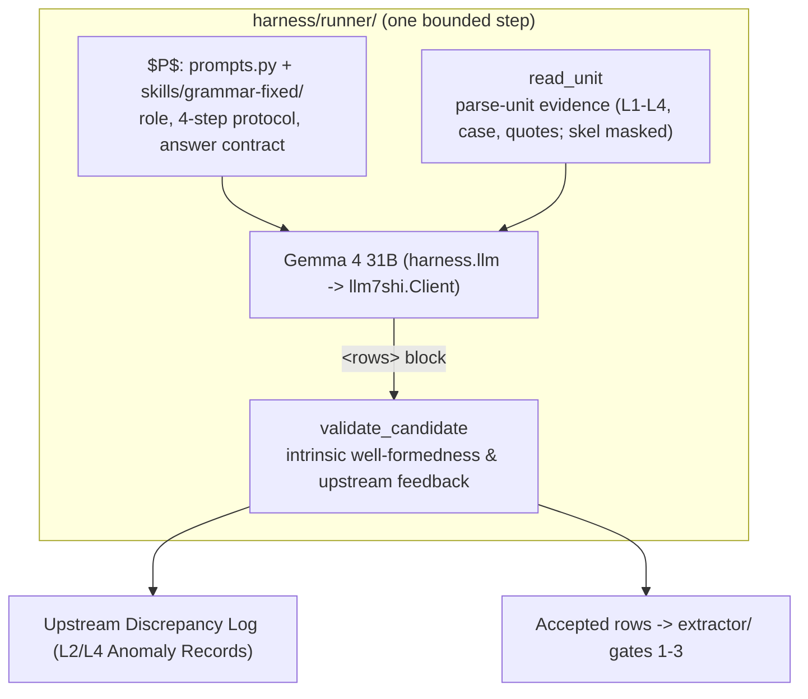

# `harness/runner/`: the model-facing half

## 1. Overview

The evidence the model is shown, the wording it is shown it in, the gate its
answer must pass, and the adapter that carries the request. What *drives* those
pieces is [`../extractor/PLAN.md`](../extractor/PLAN.md)'s bounded loop; this
document specifies the pieces themselves.

**What this file is now.** It opened as the Stage-1 plan for an autonomous
multi-turn agent, and Stage 1 delivered exactly that. Stage 9 replaced the
session with a bounded fixed-context step, and on 2026-09-07 the session, its
protocol library and its benchmark were deleted (`../PLAN.md` Handoff). This
document was cut back to what still exists; the record of what Stage 1 built and
measured is [`../stages/01.md`](../stages/01.md), which is untouched and stays
the place to read it.

| Module | Holds |
|---|---|
| `tools.py` | `read_unit` (the evidence) and `validate_candidate` (the gate) |
| `prompts.py` | Assembly of $P$ from the skill files — no grammatical wording of its own |
| `skills/grammar-fixed/` | The domain knowledge, as reviewable files under one digest |

Model access and the status bar are no longer here: `llm.py` and `statusline.py`
are `dante_corpus.harness.llm` and `.statusline`, and the skill *loader* is
`dante_corpus.harness.skills` — none of the three knows a layer. What stays is
what is Layer 5's: the evidence, the gate, and the wording.

---

## 2. Input Context Boundaries & Masking Policy

All multi-layer grammatical data is served via `dante_corpus.skel.models.GrammarContext` and `dante_corpus.api`:

| Layer / Component | Scope & Content Provided | Masking Policy |
| :--- | :--- | :--- |
| **Layer 1: Tokens / Texts** | Verse text, line numbers, alpha token streams | **Provided** |
| **Quotes Hierarchy** | Direct speech spans, speaker bounds, quote hierarchy | **Provided** |
| **Layer 2: Morphology** | Lemma, POS, inflectional features (person, number, gender, tense, mood) | **Provided** |
| **Case Annex** | Pronominal and clitic grammatical case labels (`nom`, `acc`, `dat`, etc.) | **Provided** |
| **Layer 3: Noun Phrases** | Explicit NP spans, head token indices, nested phrase containment | **Provided** |
| **Layer 4: UD Syntax** | Universal Dependencies trees, head attachments, deprel labels | **Provided (Authoritative Baseline)** |
| **Layer 5: Skeleton (Target)** | `skel/<canticle>/NN.tsv` | **STRICTLY MASKED (Inference Target)** |
| **Grammar Rule Registry** | Rules A–EI (`skel/RULES.md`) | **STRICTLY MASKED (Hidden)** |
| **Manual Corrections** | `skel/CORRECTIONS.md` | **STRICTLY MASKED (Evaluation Reference)** |

---

## 3. Dedicated Grammar Tool API (`harness/runner/tools.py`)

Free-form bash execution is strictly disabled: the model never calls anything.
The runtime calls these two on its behalf — `read_unit` to build the evidence
block of each request, `validate_candidate` to judge the rows that come back.
A third tool, `search_corpus` (scoped cross-canto pattern search behind an
anti-leakage guard), existed only because a *session* could elect it, and went
with the session on 2026-09-07.

### 3.1 `read_unit(canticle: str, canto: int, line_start: int, line_end: int = None) -> dict`
- Bounded by `dep.sentence_groups` (`MAX_UNIT_LINES = 12`): returns the complete multi-layer grammatical context covering the requested parse unit.
- Layer 5 skeleton rows and rule annotations are strictly masked out.

### 3.2 `validate_candidate(canticle: str, canto: int, line_start: int, candidate_rows: list[dict], upstream_feedback: list[dict] = None) -> dict`
- Validates **intrinsic syntactic well-formedness** against candidate rows (`SkelRow.to_dict()` format):
  1. All predicate tokens must exist in Layer 1 (word anchors optional, matched when given).
  2. Nominal argument tokens (`subj`, `obj`, `iobj`, `obl:<prep>`) must cite valid Layer 3 NP heads or Layer 1 pronouns. Clausal / predicative roles (`attr`, `ccomp`, `xcomp`) and bare `obl` are exempt — complements cite their clause's own predicate head by nature, and bare `obl` is the adverbial-oblique marker; holding them to the nominal rule rejects correct analyses. *(Implemented as such after the first live run proved otherwise: see carry-over 4 in `harness/stages/01.md`. Residual documented ceilings: nominal-role rows with genuinely non-nominal anchors ≈1.7% of anchored rows, ~100/3477 units.)*
  3. Enforces slot uniqueness per predicate (no duplicate arguments without clitic licensing).
  4. Enforces valid role vocabulary (`subj`, `obj`, `iobj`, `attr`, `xcomp`, `ccomp`, `obl`, `obl:<prep>`).
- Accepts `upstream_feedback` records when the model identifies irreconcilable upstream defects in L2 or L4.
- Returns: `{"valid": bool, "errors": [...], "diagnostics": "..."}`.

---

## 4. The prompt $P$ (`harness/runner/prompts.py` + `skills/grammar-fixed/`)

**No grammatical wording lives in Python.** `fixed_system_prompt()` concatenates
three files and nothing else, so `fixed_skill_digest()` fingerprints every byte
of $P$ — which is what Standing Invariant §6 (session semantics fixed for a
run's duration) is checked against after the fact.

| File | Section |
|---|---|
| `SKILL.md` | Role framing + the skeleton row conventions |
| `protocol.md` | The 4-step reasoning protocol |
| `answer.md` | The answer contract: one `<rows>` block, the whole unit, every time |

The protocol is grammatical reasoning only, with no tool step:

1. **Step 1: Discourse & Quote Boundaries (Quotes Hierarchy)**
   - Identify direct speech spans and speaker boundaries to distinguish vocatives from clausal complementation.
2. **Step 2: Predicates, Agreement & Voice (Layer 2 Morphology)**
   - Check finite verb person/number against candidate arguments to identify explicit subjects vs. pro-drop (`(0, 0)`). Identify passive constructions and reflexive `si`.
3. **Step 3: Case & Core Argument Discrimination (Case Annex + Layer 4 UD)**
   - Resolve clitic arguments using explicit morphological case (`nom`, `acc`, `dat`). Map UD relations (`nsubj`, `obj`, `obl:<prep>`) to skeleton role tuples.
4. **Step 4: NP Heads, Clausal Complements & Control (Layer 3 NPs + Layer 4 Clauses)**
   - Ensure nominal arguments cite exact Layer 3 phrase heads. Trace subject control and infinitival complement propagation (`xcomp`, `ccomp`).

Where a fifth step used to stand — *call `validate_candidate`, read the errors,
iterate to convergence* — the runtime now does the iterating: it recomputes the
verdict from the frozen layers between steps and hands it back with the rows
(`../extractor/observe.py`, `../stages/09.md` §2). Self-correction did not go
away; it moved out of the model's turn budget.

---

## 5. Model access & observability (`dante_corpus.harness.llm` / `.statusline`)

`llm7shi_generate(model, ...)` is the one send point: it keeps a stateful
`llm7shi.Client` in sync with the transcript by content fingerprint, paces sends
by `min_send_interval`, caps generation length, and appends one
`llm_request` / `llm_response` JSONL pair per backend call — timestamps, model,
session/unit coordinates, attempt, byte sizes, provider token counts, duration.
The join key is `(session, messages, attempt)`; the fixed-context loop takes a
fresh session id per iteration, because each request there *is* an independent
single-turn session. HTTP 429 backoff stays inside `Client` and is counted
through the status line's `wait_retry` hook.

The standing specification for all of this is
[`../../ARCHITECTURE.md`](../../ARCHITECTURE.md) §2 and §4–§6; it is not
restated here.

---

## 6. Record

Stage 1's milestones 1.1–1.4 — the toolset, the agent runner, the benchmark
suite, and the 87-case evaluation that produced Stage 2's mining inputs — are
recorded in full in [`../stages/01.md`](../stages/01.md), with the tool-call
protocol gates T1–T5 in [`../TOOLCALL.md`](../TOOLCALL.md) §8. Both are kept as
written. Of what they delivered, `tools.py` and `prompts.py` survive (with the
changes above); `agent.py`, `benchmark.py`, `fixtures/` and the whole
`toolcall/` library do not.
