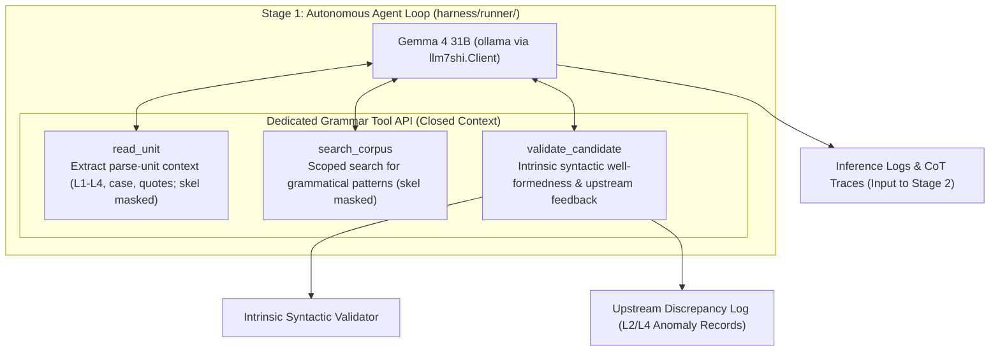

# Stage 1 Plan: Autonomous Inference Agent & Benchmark (`harness/runner/`)

## 1. Overview & Objectives

Stage 1 implements an autonomous execution environment where a local LLM (**Gemma 4 31B** via `llm7shi.Client`) receives multi-layer grammatical context (Layer 1 tokens/text, quotes hierarchy, Layer 2 morphology, pronoun case annex, Layer 3 noun phrases, and Layer 4 UD syntax trees) and autonomously solves Layer 5 predicate-argument skeletons on the fly.

### Primary Objectives
1. **Dedicated Context & Tool Calling API (`tools.py`)**: Expose multi-layer syntax while strictly masking gold Layer 5 data and the 130-rule registry.
2. **Multi-Turn CoT Reasoning Loop (`agent.py`)**: Execute an interactive, self-correcting 5-step grammatical reasoning protocol without free-form bash execution.
3. **Syntactic Benchmark Suite (`benchmark.py`)**: Benchmark the local model against curated syntactic challenge fixtures and historical outlier units, logging detailed reasoning traces for Stage 2.

---

## 2. Input Context Boundaries & Masking Policy

All multi-layer grammatical data is served via `dante_corpus.skel.models.GrammarContext` and `dante_corpus.api`:

| Layer / Component | Scope & Content Provided | Masking Policy |
| :--- | :--- | :--- |
| **Layer 1: Tokens / Texts** | Verse text, line numbers, alpha token streams | **Provided** |
| **Quotes Hierarchy** | Direct speech spans, speaker bounds, quote hierarchy | **Provided** |
| **Layer 2: Morphology** | Lemma, POS, inflectional features (person, number, gender, tense, mood) | **Provided** |
| **Case Annex** | Pronominal and clitic grammatical case labels (`nom`, `acc`, `dat`, etc.) | **Provided** |
| **Layer 3: Noun Phrases** | Explicit NP spans, head token indices, nested phrase containment | **Provided** |
| **Layer 4: UD Syntax** | Universal Dependencies trees, head attachments, deprel labels | **Provided (Authoritative Baseline)** |
| **Layer 5: Skeleton (Target)** | `skel/<canticle>/NN.tsv` | **STRICTLY MASKED (Inference Target)** |
| **Grammar Rule Registry** | Rules A–EI (`skel/RULES.md`) | **STRICTLY MASKED (Hidden)** |
| **Manual Corrections** | `skel/CORRECTIONS.md` | **STRICTLY MASKED (Evaluation Reference)** |

---

## 3. Dedicated Grammar Tool Calling API (`harness/runner/tools.py`)

Free-form bash execution is strictly disabled. The agent interacts exclusively through closed JSON/Python Function Calling:

### 3.1 `read_unit(canticle: str, canto: int, line_start: int, line_end: int = None) -> dict`
- Bounded by `dep.sentence_groups` (`MAX_UNIT_LINES = 12`): returns the complete multi-layer grammatical context covering the requested parse unit.
- Layer 5 skeleton rows and rule annotations are strictly masked out.

### 3.2 `search_corpus(query: dict, limit: int = 10) -> list[dict]`
- Scoped search for analogous grammatical and case constructions (e.g., matching `lemma`, `pos`, `deprel`) across other cantos.
- Anti-Leakage Guard: strictly excludes the current canto and target unit, and excludes Layer 5 data.

### 3.3 `validate_candidate(canticle: str, canto: int, line_start: int, candidate_rows: list[dict], upstream_feedback: list[dict] = None) -> dict`
- Validates **intrinsic syntactic well-formedness** against candidate rows (`SkelRow.to_dict()` format):
  1. All predicate tokens must exist in Layer 1 (word anchors optional, matched when given).
  2. Nominal argument tokens (`subj`, `obj`, `iobj`, `obl:<prep>`) must cite valid Layer 3 NP heads or Layer 1 pronouns. Clausal / predicative roles (`attr`, `ccomp`, `xcomp`) and bare `obl` are exempt — complements cite their clause's own predicate head by nature, and bare `obl` is the adverbial-oblique marker; holding them to the nominal rule rejects correct analyses. *(Implemented as such after the first live run proved otherwise: see carry-over 4 in the `harness/PLAN.md` Milestone Ledger. Residual documented ceilings: nominal-role rows with genuinely non-nominal anchors ≈1.7% of anchored rows, ~100/3477 units.)*
  3. Enforces slot uniqueness per predicate (no duplicate arguments without clitic licensing).
  4. Enforces valid role vocabulary (`subj`, `obj`, `iobj`, `attr`, `xcomp`, `ccomp`, `obl`, `obl:<prep>`).
- Accepts `upstream_feedback` records when the model identifies irreconcilable upstream defects in L2 or L4.
- Returns: `{"valid": bool, "errors": [...], "diagnostics": "..."}`.

---

## 4. Autonomous 5-Step CoT Protocol (`harness/runner/prompts.py`)

The agent follows an interactive 5-step reasoning protocol:

1. **Step 1: Discourse & Quote Boundaries (Quotes Hierarchy)**
   - Identify direct speech spans and speaker boundaries to distinguish vocatives from clausal complementation.
2. **Step 2: Predicate Agreement & Voice (Layer 2 Morphology)**
   - Check finite verb person/number against candidate arguments to identify explicit subjects vs. pro-drop (`(0, 0)`). Identify passive constructions and reflexive `si`.
3. **Step 3: Case & Core Argument Discrimination (Case Annex + Layer 4 UD)**
   - Resolve clitic arguments using explicit morphological case (`nom`, `acc`, `dat`). Map UD relations (`nsubj`, `obj`, `obl:<prep>`) to skeleton role tuples.
4. **Step 4: NP Heads, Clausal Complements & Control (Layer 3 NPs + Layer 4 Clauses)**
   - Ensure nominal arguments cite exact Layer 3 phrase heads. Trace subject control and infinitival complement propagation (`xcomp`, `ccomp`).
5. **Step 5: Intrinsic Validation & Self-Correction**
   - Call `validate_candidate`. If validation errors are returned, interpret diagnostic feedback and iterate to convergence.

---

## 5. Syntactic Benchmark & Evaluation Suite (`harness/runner/benchmark.py`)

### 5.1 Datasets
- **Core Challenge Fixtures (50–100 units)**:
  - Long-distance hyperbaton, coordinated predicates, control verbs, embedded quotes, relative clause chains.
- **Historical Case Units**:
  - Historical outlier cases documented in [`skel/CORRECTIONS.md`](../../skel/CORRECTIONS.md).

### 5.2 Metrics
- **1-Shot Exact Match Rate**: Percentage of units exactly matching the 0-soft Gold Standard on the first candidate submission.
- **Autonomous Convergence Rate**: Percentage of units achieving 0 divergence after multi-turn self-correction (≤ 5 turns).
- **Role-Level F1**: Precision, Recall, and F1 across argument roles (`subj`, `obj`, `obl:<prep>`, `xcomp`, `ccomp`).
- **Upstream Feedback Precision**: Accuracy and validity of model-reported `upstream_feedback` anomalies.

Operational definitions (implemented in Milestone 1.3):
- Row identity for comparison is `(line, token, role, arg_line, arg_token)`; word anchors are verification-only and excluded. Both sides are restricted to the parse unit's line range (out-of-unit submissions are counted separately).
- *Converged* = final submission exactly matches gold ∧ the session did not exhaust its turn budget ∧ total turns ≤ `CONVERGENCE_TURN_BUDGET` (5). *1-shot* uses the first submission only.
- **Workflow granularity** (added after the first live run): `--workflow unit` keeps the definitions above; `--workflow predicate` validates one predicate per call and is scored with `accumulate=True` — each gold predicate is compared to its *latest* submission's rows (a repaired frame replaces its earlier attempt), plus a pooled **predicate first-pass rate**: fraction of gold predicates whose FIRST coverage (earliest submission touching them) matched gold exactly for that predicate. Unit-level convergence keeps its ≤5-turn semantics, so multi-predicate predicate-mode sessions legitimately fall below it — the per-predicate rate is this workflow's fine-grained convergence signal.
- Role-level P/R/F1 is computed per role label over pooled row keys, plus micro-averaged P/R/F1 and macro-F1 across labels.
- *Upstream feedback precision* measures form-validity (dict record naming a layer plus a description/issue); semantic correctness of the reported defects still requires human triage.
- Parse success is measured inside every benchmark run with the probe's per-turn classification (T4 gate kept under observation — see the `harness/PLAN.md` Handoff watch items).

---

## 6. Implementation Milestones

- [x] **1.1 Toolset Implementation (`harness/runner/tools.py`)**: Implement and unit-test `read_unit`, `search_corpus`, and `validate_candidate`. *(Complete 2026-08-22: `GrammarToolkit` with structural Layer-5 masking, Anti-Leakage Guard, `TOOL_SPECS` + `dispatch`; 36 tests, suite 583 passed.)*
- [x] **1.2 Gemma 4 Runner Implementation (`harness/runner/agent.py`)**: Multi-turn agent loop using `llm7shi.Client` and `ollama:gemma4:31b-it-qat`. *(Complete 2026-08-22: `run_unit(...)` drives one parse-unit session through `toolcall.run_tool_loop` over `PromptXmlTransport` with the proven `llm7shi_generate` adapter; per-unit system prompt in new `prompts.py` = role intro + row conventions + 5-step protocol + wire contract + tool specs; no-call nudge policy (one reminder only when zero successful validations happened) resolves the practical half of TOOLCALL.md §7.1; `UnitResult.trace_record()` is the Stage 2 trace contract; operator CLI `python -m harness.runner.agent`; 18 deterministic tests, suite 639 passed.)*
- [x] **1.3 Benchmark Suite Implementation (`harness/runner/benchmark.py`)**: Evaluation harness with gold comparison and trace logging. *(Complete 2026-08-22: `evaluate_unit` scores a finished `UnitResult` against the gold artifact — row keys are `(line, token, role, arg_line, arg_token)`, word anchors excluded as verification-only — reporting exact-first/exact-final/converged (`CONVERGENCE_TURN_BUDGET = 5`, not exhausted), per-role P/R/F1 via `BenchmarkReport.role_table` + micro/macro aggregates, upstream-feedback form-validity precision, and probe-style per-turn parse success measured from `UnitResult.session_messages` (T4 gate kept under observation); curated fixture table in `harness/fixtures/challenge_cases.py` — 87 cases (48 historical from CORRECTIONS.md censuses §P15/§P13/§P5, plus control/coordination/relative_chain/quotes/hyperbaton balanced across all three canticles), frozen verbatim data validated at test time against sentence groups and gold; streaming JSONL CLI `python -m harness.runner.benchmark` (`--category/--case-id/--limit/--list/--log/--full-transcript`) mirroring probe.py log semantics; `agent.UnitResult` gained `submissions` / `first_candidate_rows` / `opening_len` / `session_messages` for the 1-shot metric; 22 deterministic tests, suite 663 passed.)*
- [ ] **1.4 Evaluation Execution & Trace Collection**: Benchmark Gemma 4 across challenge fixtures and persist structured inference traces for Stage 2. *(First attempt 2026-08-22 interrupted after 4 cases: exposed the validator citation defect (carry-over 4 in the `harness/PLAN.md` Milestone Ledger, since fixed) and motivated the `--workflow` A/B; the partial log is preserved as `harness/bench-strict-validator-baseline.log`. Re-run after a pilot comparing both workflows.)*
