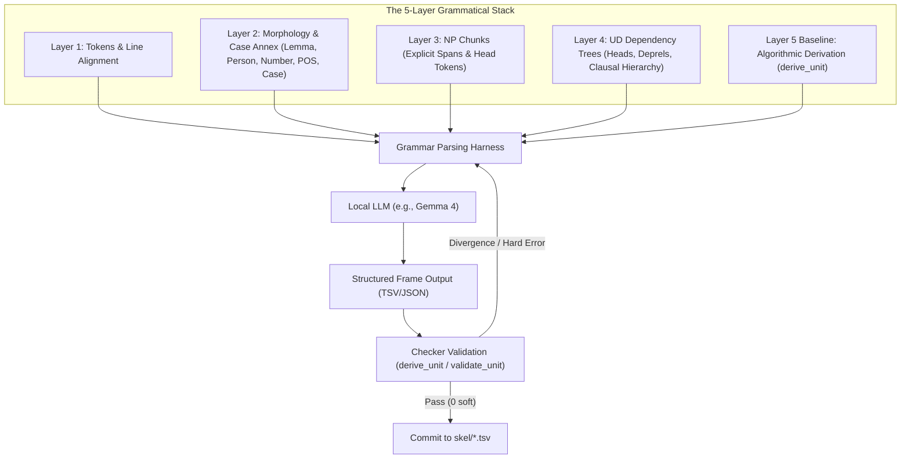

# skel — Grammatical Parsing Harness Specification (for Local LLMs like Gemma 4)

## 1. Overview & Motivation

In Phase 7 of the Dante Corpus project, the final residue of 87 Layer-5 divergence violations was driven down to **0 hard / 0 soft violations across all 100 cantos**.

A key post-mortem finding was:
- The previous automated driver (`skel/skel.py --fix`) stalled (achieving only 0.028 yield/call and a 45% refusal rate across Rounds 8–10).
- However, when the assistant (an LLM) was presented with the integrated multi-layer diagnostic view (`skel/read.py`), the assistant was able to evaluate the grammatical constraints and resolve 100% of the positions correctly.

**Core Thesis**: What the assistant did in the final push is not magic; in principle, a modern local LLM (such as **Gemma 4**) can perform the same autonomous analysis and self-correction if provided with a **specialized grammatical parsing harness** rather than a blind, masked quiz format.

This document defines what that harness requires, why the previous framework failed, and how to structure the harness architecture.

---

## 2. Root Cause Analysis: Why `--fix` Stalled

### 2.1 The "False Independence" Blindness Trap
The original `--fix` driver was designed around a strict *Independence Rule*:
> *"To ensure Layer 5 acts as an independent validator of Layer 4, the model must not be shown the Layer 4 dependency tree or derived arguments during generation."*

To enforce this, `--fix` systematically withheld:
- **Layer 2 Morphology**: Verb person/number, mood/tense, noun gender/number, apocope/archaic notes, and case labels.
- **Layer 4 UD Syntax**: Dependency heads, relations (`nsubj`, `obj`, `iobj`, `obl`, `advcl`, `xcomp`, `ccomp`), and clausal hierarchy.

The model was given only raw 14th-century poetic text lines and asked a single-token question (e.g., *“In line 27, what is the subject of facevan (27.4)?”*).

### 2.2 Why This Broke on Dante's Poetic Italian
1. **Severe Hyperbaton & Inverted Word Order**: In lines like *«facevan l'aura»* or *«fé vergogna le sue minacce»*, Italian surface word order strongly mimics Subject-Verb-Object (*l'aura* appears directly after *facevan*).
2. **Agreement Disconnect**: Without seeing that *facevan* is `3pl` and *l'aura* is `f.sg`, a text-only LLM naturally concludes that *l'aura* is the subject and repeatedly answers `keep` (refusal).
3. **Single-Slot Tunnel Vision**: Poetic argument structures cannot be resolved one slot at a time. Flipping a subject often requires simultaneously adjusting the object, recognizing a causative/control infinitive, or binding an antecedent two lines above.

---

## 3. What the LLM Actually Needs: The Integrated Context

When the assistant successfully diagnosed and resolved all 87 positions, it relied on the multi-layer output generated by `skel/read.py`. A grammatical harness must feed this exact structured context to the local LLM:



---

## 4. Harness Architecture & Functional Components

### 4.1 Context Packager (Input Representation)
The harness must format each parse unit into a structured, easily consumable prompt containing:

1. **Source Lines**: Line numbers and raw text.
2. **Morphological Table**:
   ```tsv
   line.tok  word       lemma        pos   features
   27.1      l'         il           det   f. sg.
   27.3      aura       aura         noun  f. sg.
   27.4      facevan    fare         verb  pl. 3 imperfect ind.
   ```
3. **Syntactic Tree Summary (UD Relations)**:
   ```
   27.1 che (rel. pronoun, pl.) <--nsubj-- 27.4 facevan (verb, pl.3)
   27.3 aura (noun, f.sg.)       <--obj---- 27.4 facevan (verb, pl.3)
   ```
4. **Current Candidate Frame vs. Derived Frame**: Highlighting exact points of divergence (e.g. `missing_arg: obj (27, 3)` or `role_mismatch`).

---

### 4.2 Autonomous Reasoning Protocol (Chain-of-Thought Verification)
The harness instructs the local LLM to follow a strict 4-step grammatical reasoning protocol:

- **Step 1: Agreement & Voice Analysis**
  - Check verb person, number, and voice (active/passive/reflexive).
  - Assert agreement constraint: *"Verb is 3pl -> Subject MUST be a 3pl nominal or pronoun."*
- **Step 2: Argument Selection & Head Resolution**
  - For reciprocal/comparative phrases (e.g. *una con una*), cite the syntactic head token (`32.5 una`), not prepositional dependents.
  - For coordinate verbs, identify shared subjects across conjuncts.
  - For perception/causative verbs (*veggio*, *fare*), recognize `xcomp` infinitive complements and control subjects.
- **Step 3: Oblique & Clausal Complements**
  - Distinguish adverbial modifier clauses (`advcl`, consecutive `sì che`, temporal `quand'`) from true complement clauses (`ccomp`).
  - Capture long-distance locative/temporal obliques spanning across line breaks.
- **Step 4: Full-Unit Frame Generation**
  - Emit the complete, coherent argument frame for all predicates in the unit at once (avoiding partial/fragmented slot updates).

---

### 4.3 Interactive Validation & Self-Correction Loop
The harness wraps the model in an automated validation feedback loop:

1. **Generation**: Gemma 4 emits the TSV rows for the parse unit.
2. **Deterministic Check**: The harness immediately executes `dante_corpus.skel.validate_unit(data, morph_rows, np_rows, dep_rows, case_rows)`.
3. **Feedback on Error**:
   - If `hard violations` (e.g., non-NP argument, invalid token index) or `soft violations` remain:
   - The harness returns the exact diagnostic string (e.g., `role_mismatch: 27.4 'obj' vs 'subj'` or `xcomp argument (81, 6) is not a predicate`) with the violating lines highlighted.
4. **Self-Correction**: Gemma 4 receives the feedback, re-checks the agreement table, and produces a corrected frame.
5. **Gated Acceptance**: Only frames achieving **0 hard / 0 soft violations** (or verified legitimate exceptions) are committed.

---

## 5. Structured Prompt Template for the Harness

```markdown
You are an expert philologist and computational linguist specializing in 14th-century Dantean Italian syntax and Universal Dependencies.

### TASK
Analyze the parse unit below and output the exact predicate-argument skeleton table (Layer 5).

### CONTEXT
#### 1. Text
[Numbered lines of the tercet]

#### 2. Morphological Analysis (Layer 2)
[Token, Lemma, POS, Morphology Features (Person/Number/Gender)]

#### 3. Syntactic Dependency Tree (Layer 4)
[UD heads, relations: nsubj, obj, iobj, obl, xcomp, ccomp, conj, advcl]

#### 4. Discrepancy Diagnostics
[Current derived baseline vs candidate divergences]

### GRAMMATICAL RULES TO ENFORCE
1. **Subject-Verb Agreement**: The subject must strictly match the verb's person and number. Inverted subjects post-verb must not be confused with direct objects.
2. **Head Token Citation**: For prepositional phrases and reciprocal constructions (*una con una*), cite the phrase head token, not dependents.
3. **Control & Causatives**: Infinitives governed by *vedere*, *udire*, *fare* take `xcomp`, with the causee/perceived entity as controller.
4. **Speech Verbs**: Quoted speech objects take `obj` or `ccomp`.

### OUTPUT FORMAT
Output the corrected argument rows in clean TSV format:
```tsv
line	token	word	role	arg_line	arg_token
```
```

---

## 6. Implementation Roadmap

| Phase | Milestone | Goal |
|---|---|---|
| **Phase A** | **Codebase Clean-Up (`PORTABILITY.md`)** | Refactor `dante_corpus/skel.py` into a Rule Registry with decoupled language constants and fixture tests. |
| **Phase B** | **Harness Driver (`skel/harness.py`)** | Build the CLI harness that packages Layer 1–4 context and wraps the LLM in an agreement-checking execution loop. |
| **Phase C** | **Local LLM Benchmarking (Gemma 4)** | Evaluate Gemma 4 on the historical Phase 7 test corpus (the 87 hard/soft divergence cases) to benchmark zero-shot and few-shot autonomous accuracy. |
| **Phase D** | **Full Corpus Portability** | Apply the autonomous grammatical harness to other canticles, poets (Petrarca, Boccaccio), and Italian UD corpora. |
