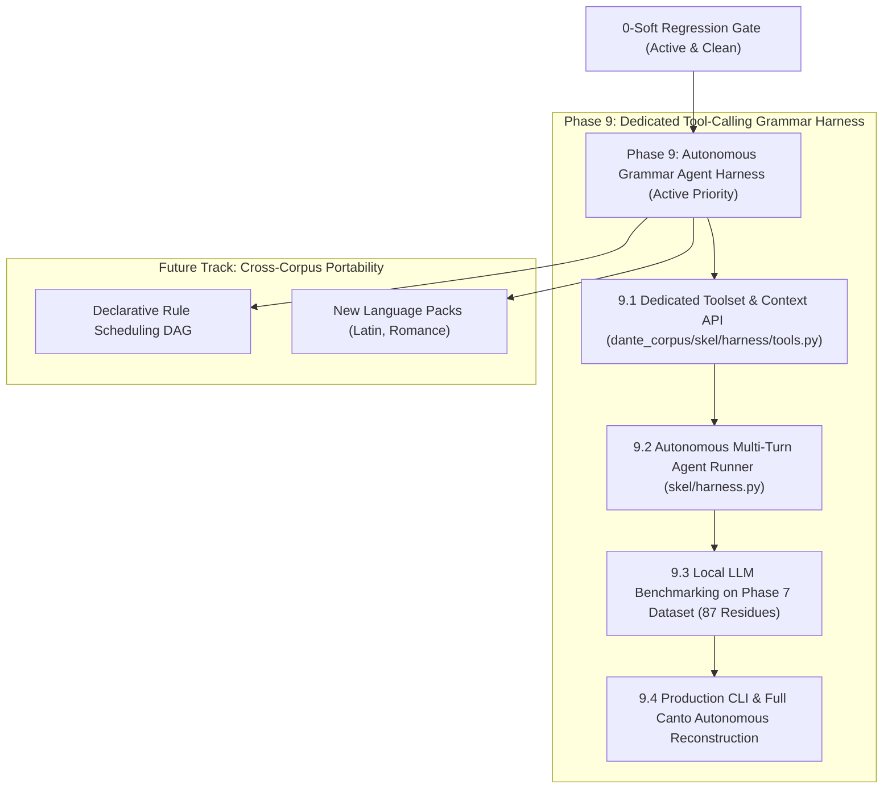
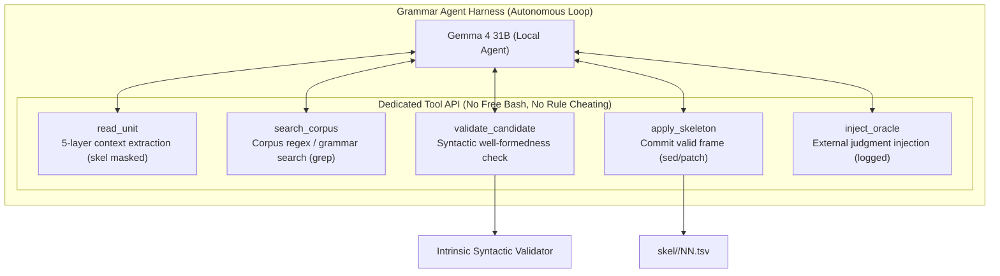

# skel — Layer 5 Plan: Grammatical Agent Harness & Future Architecture

## Status & Baseline

- **Current State**: `make -C skel check` reports **0 hard, 0 soft** violations across all 100 cantos — **100% CLEAN** across the entire corpus (Inferno 0, Purgatorio 0, Paradiso 0; 0 `dual_role`, 0 `extra_tuple`, 0 `missing_tuple`, 0 `argument heads no NP`, 0 divergence residue).
- **All Layers & Tests**: `dep --check` 0/0, `case --check` 0, `np --check` 0/0, `morph --check` 0/0, `pytest` **547 passed**.
- **Historical Phase Retrospectives (Closed)**:
  - **Phase 5**: 5,919 → 2,084 soft violations ([`PHASE5.md`](PHASE5.md)).
  - **Phase 6**: 2,084 → 160 soft violations ([`PHASE6.md`](PHASE6.md)).
  - **Phase 7**: 160 → 0 soft violations (100% clean corpus-wide) ([`PHASE7.md`](PHASE7.md)).
  - **Phase 8**: Codebase Restructuring & Modular Portability ([`PHASE8.md`](PHASE8.md)).
- **Grammar Specification**: Full 130-rule handbook with dynamic census metrics in [`RULES.md`](RULES.md) (Japanese edition: [`RULES-ja.md`](RULES-ja.md)).
- **Long-Term Portability Vision**: [`PORTABILITY.md`](PORTABILITY.md).

---

## Strategic Focus: Upcoming Phases

---

## Active Priority: Phase 9 — Grammatical Agent Harness for Local LLMs (Gemma 4)

### 1. Overview & Paradigm Shift

In Phase 7 of the Dante Corpus project, the final residue of 87 Layer-5 divergence violations was resolved to **0 hard / 0 soft violations across all 100 cantos**.

A crucial architectural post-mortem revealed:
- **Limitations of Static Scripts**: Previous automated scripts (`skel/driver_fix.py` / `skel.py --fix`) forced LLMs into pre-determined, rigid Q&A single-slot templates (e.g., `Q1: ...` parsed with regex). This prevented LLMs from exercising multi-layer reasoning (hyperbaton, control, agreement, and clausal complements must be resolved holistically, not one slot at a time).
- **Agentic Breakthrough**: In contrast, Gemini 3.7 Flash resolved the entire residue when operating as an autonomous agent with free access to multi-layer context and interactive verification.
- **Hypothesis for Local Models**: In principle, modern open-weights models like **Gemma 4 31B** can perform the same autonomous analysis and self-correction if embedded in an agent loop.
- **Why a Dedicated Grammar Harness?**: A standard general-purpose coding agent harness (with free bash execution and arbitrary file operations) is suboptimal for grammatical parsing. Grammatical parsing is not programming: giving the model free bash leads to wasted tokens on shell scripts and off-track exploration. Instead, the model should be equipped with a **dedicated grammatical toolset (Tool Calling / Function Calling)** providing search (grep), editing (sed/patch), context inspection, and deterministic validation.

---

### 2. Input Context Boundaries & Strict Masking Policy

All input data provided to the harness is mediated through [`dante_corpus/api.py`](../dante_corpus/api.py):

| Layer / Component | `api.py` Accessor | Scope & Contents Provided to Harness |
| :--- | :--- | :--- |
| **Layer 1: Text & Tokens** | `canto.lines()`, `Line.tokens` | Verse text, line numbers, alpha token streams |
| **Quotes Hierarchy** | `canto.quotes()`, `QuoteSpan` | Nested speaker/quote trees, start/end bounds, markers |
| **Layer 2: Morphology** | `canto.morph()`, `MorphRow` | Lemma, POS, inflection (person, number, gender, tense, mood, notes) |
| **Case Annex** | `canto.case()`, `CaseRow` | Pronominal and clitic grammatical case labels (`nom`, `acc`, `dat`, etc.) |
| **Layer 3: Noun Phrases** | `canto.np()`, `NPSpan` | Explicit noun phrase boundaries, head token indices, nested forest |
| **Layer 4: UD Syntax** | `canto.dep()`, `DepRow` | Universal Dependencies trees, head attachments, deprel labels (`nsubj`, `obj`, `obl`, `ccomp`, `xcomp`, `advcl`, etc.) |
| **Layer 5: Skeleton (Target)** | `canto.skel()`, `SkelTuple` | **RESTRICTED / MASKED** (Generation target; see below) |
| **Grammar Rule Registry** | Rules A–EG (`skel/RULES.md`) | **STRICTLY EXCLUDED / MASKED** (Reconstruction target; see below) |
| **Manual Corrections & Exceptions** | [`skel/CORRECTIONS.md`](CORRECTIONS.md) | **STRICTLY EXCLUDED / MASKED** (Reconstruction/evaluation target; see below) |

#### 2.1 Restriction on Layer 5 Reference, Rule Registry & Correction History
- **Layer 5 Skeleton Masking**: Because Layer 5 is the target of autonomous reconstruction, direct reading of `canto.skel()` is restricted during generation to prevent trivial copying.
- **Rule Registry & Correction History Exclusion**:
  - The 130 handcrafted/derived rules ([`RULES.md`](RULES.md)) and the record of manual corrections / structural outlier exceptions ([`CORRECTIONS.md`](CORRECTIONS.md)) are **strictly excluded** from the harness prompts and toolset.
  - The entries in `CORRECTIONS.md` represent grammatical phenomena that could not be handled by static deterministic rules, but which an autonomous agent with multi-layer reasoning (morphological agreement, clausal hierarchy, hyperbaton) has the potential to resolve on its own. They must not be referenced as cheat-sheets.
  - The model must reason directly from linguistic first principles (Italian syntax, morphological agreement, UD relations).
- **Evaluation vs Runtime Validation**:
  - **Runtime Validation (`validate_candidate`)**: Checks intrinsic syntactic well-formedness (valid token bounds, NP head citation, slot uniqueness, basic UD consistency).
  - **Offline Comparative Benchmark**: The full Rule Registry, `CORRECTIONS.md`, and 0-soft derivation engine act as the external ground-truth benchmark to evaluate the model's autonomous reasoning and self-resolution capabilities post-generation.

#### 2.2 External Oracle Escape Hatch (Logged Exception)
- If the agent reaches its maximum retry budget (e.g. 5 turns) or becomes deadlocked on a genuinely ambiguous or corrupted unit, external human judgment or reference annotations may be injected via `inject_oracle`.
- **Invariant**: Any injection is formally logged as an **Exception Record** in the benchmark audit log, ensuring transparency in autonomous yield metrics.

---

### 3. Dedicated Grammar Tool Calling API

Instead of arbitrary command execution (`bash`), the harness provides a focused set of structured tools via JSON/Python Function Calling:

#### 3.1 Tool Definitions

1. `read_unit(canticle: str, canto: int, line_start: int, line_end: int = None) -> dict`
   - Returns the complete 5-layer context (Text, Quotes, Morphology, Case, NP, UD tree) for the parse unit covering the requested line range. `skel` artifact rows and rule annotations are withheld.

2. `search_corpus(canticle: str = None, lemma: str = None, pos: str = None, deprel: str = None, word: str = None) -> list[dict]`
   - Searches the corpus for similar syntactic patterns across cantos (equivalent to a structured `grep`), allowing the model to look up precedent usage in Dante's poetry.

3. `validate_candidate(canticle: str, canto: int, line_start: int, candidate_rows: list[dict]) -> dict`
   - Executes intrinsic syntactic validation against the candidate frame (valid token indices, NP heads for nominal arguments, valid UD roles, slot consistency).
   - Returns `{"valid": bool, "errors": [...], "diagnostics": "..."}`.

4. `apply_skeleton(canticle: str, canto: int, line_start: int, candidate_rows: list[dict]) -> dict`
   - Gated commit tool: asserts that `validate_candidate` passes without errors, then writes the approved rows into the canto's TSV file.

5. `inject_oracle(canticle: str, canto: int, line_start: int, reason: str, rows: list[dict]) -> dict`
   - Fallback tool for manual / reference intervention when the autonomous agent exhausts its retry budget. Logs an exception entry with `reason`.

---

### 4. Autonomous Reasoning Protocol (Agentic CoT)

The agent operates in an interactive multi-turn loop guided by a 4-step grammatical reasoning protocol:

1. **Step 1: Morphological Agreement & Voice**
   - Check verb person, number, and voice (active / passive / reflexive `si`).
   - Match nominative agreement (`3pl` verb requires `3pl` nominal/pronoun).
2. **Step 2: Head Token & NP Citation**
   - Distinguish phrase heads from prepositional dependents and modifiers using Layer 3 NP spans.
   - For coordinate verbs, link shared subjects across conjuncts.
3. **Step 3: Complement vs. Adjunct Discrimination**
   - Distinguish adverbial clauses (`advcl`, `sì che`) from true complement clauses (`ccomp`, `xcomp`).
   - Identify causative/perception control structures (*fare*, *vedere*, *udire*).
4. **Step 4: Interactive Verification & Self-Correction**
   - Call `validate_candidate`. If structural errors are returned, interpret the diagnostic feedback and refine the candidate rows until clean.

---

### 5. Implementation Roadmap (Phase 9)

| Phase | Milestone | Deliverable / Goal |
|---|---|---|
| **Phase 9.1** | **Grammar Toolset & Context API** | Implement `dante_corpus/skel/harness/tools.py` with `read_unit`, `search_corpus`, `validate_candidate`, `apply_skeleton`, and `inject_oracle` (with skel and rule masking). |
| **Phase 9.2** | **Gemma 4 Autonomous Agent Runner** | Build `skel/harness.py` supporting local LLM tool calling (via Ollama / vLLM / `llm7shi`), multi-turn retry loops, and prompt templates. |
| **Phase 9.3** | **Historical Phase 7 Residue Benchmark** | Evaluate Gemma 4 31B on the 87 historical divergence positions against the 0-soft ground truth. Measure 1-shot accuracy, autonomous convergence rate, and oracle exception rate. |
| **Phase 9.4** | **Production CLI & Full-Canto Pipeline** | Support interactive single-unit debugging and full-canto autonomous batch parsing. |

---

## Future Track: Cross-Corpus Portability & Long-Term Extensions

See [`PORTABILITY.md`](PORTABILITY.md) for architectural details.

1. **Declarative Rule Scheduling DAG**:
   - Transition procedural `rules.py` execution into a declarative dependency graph with explicit precedence declarations (`precedes`, `requires`).
2. **Additional Language Packs**:
   - Construct language packs for Latin, Old French, and Modern Italian based on the abstract `LanguagePack` class.
3. **Standalone Linter Mode**:
   - Decouple intrinsic well-formedness validation (duplicate argument slots, cycle checks) from comparative derivation auditing.

---

## Standing Invariants & Disciplines

1. **0-Soft Regression Gate**: Any refactoring or layer update must preserve **0 hard / 0 soft violations** corpus-wide and pass all 547 unit tests.
2. **Mutation Testing for Rules**: Every rule in the registry must have at least one test fixture that fails when the rule is disabled.
3. **UD-General vs. Language-Specific Separation**: Do not allow Italian lexical forms to leak into general UD dependency algorithms.
4. **Deterministic Authority**: Ground all LLM interactions on deterministic derivation (`derive_unit`) and multi-layer validation checks.

---

## Next Session Handover / Action Items

### Immediate Priority: Phase 9.1 (Dedicated Toolset & Context API)
- [ ] Create `dante_corpus/skel/harness/tools.py` with `read_unit`, `search_corpus`, `inspect_rule`, `validate_candidate`, `apply_skeleton`, `inject_oracle`.
- [ ] Implement `skel/harness.py` agent loop with Function Calling integration for local LLMs (Gemma 4 31B).
- [ ] Build the Phase 7 benchmark suite (87 test fixtures from historical divergence positions).
- [ ] Run benchmark with Gemma 4 31B and evaluate autonomous convergence rate.
