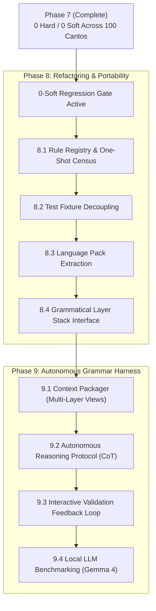

# skel — Layer 5 Plan: Post-Zero Refactoring, Portability & Grammar Harness

## Status

- **Current State**: `make -C skel check` reports **0 hard, 0 soft** violations across all 100
  cantos — **100% CLEAN** across the entire corpus (0 hard, 0 soft, 0 `dual_role`, 0 `extra_tuple`,
  0 `missing_tuple`, 0 `argument heads no NP`, 0 divergence residue). Per canticle: inferno 0, purgatorio 0,
  paradiso 0.
- **Other Layers**: `dep --check` **0 hard / 0 soft**, `case --check` 0 hard, `np --check` 0/0,
  `morph --check` 0/0, `pytest` **544 passed**.
- **Completed Phases**:
  - **Phase 5**: Complete and closed — 5,919 → 2,084 soft. Full retrospective in [`PHASE5.md`](PHASE5.md).
  - **Phase 6**: Complete and closed — 2,084 → 160 soft, with seven user-run `--fix` rounds (−1,157)
    and a per-position read of all 100 cantos in nineteen batches (rules AG–EH, −793, at zero model cost).
    Full retrospective in [`PHASE6.md`](PHASE6.md).
  - **Phase 7**: Complete and closed — **160 → 0 soft violations** (100% clean corpus-wide).
    Refusal census audit, outlier elimination, upstream retags, and six assistant-side read censuses (§P1–§P15).
    Full retrospective in [`PHASE7.md`](PHASE7.md).

---

## Overview & Next Strategic Directions

With **0 hard / 0 soft violations achieved across the entire *Divina Commedia***, the 0-soft count functions as an active **regression gate**. The project shifts from manual residue elimination to:

1. **Phase 8: Codebase Restructuring & Portability** ([`PORTABILITY.md`](PORTABILITY.md)) — Refactoring `dante_corpus/skel.py` (4,500+ lines, 84 rule letters) into a data-driven rule registry, decoupling tests into self-contained fixtures, isolating the 7 Italian language constants into a language pack, and establishing a clean layer stack interface.
2. **Phase 9: Grammatical Parsing Harness for Local LLMs** ([`HARNESS.md`](HARNESS.md)) — Developing an autonomous multi-layer grammar harness (`skel/harness.py`) that equips local models (e.g., Gemma 4) with integrated morphology, syntax trees, and self-correcting validation loops.

---

## Phase 8: Codebase Restructuring & Portability

See [`PORTABILITY.md`](PORTABILITY.md) for detailed technical specifications and background metrics.

### 8.1 Rule Registry & One-Shot Census (Completed)
- **Implemented**: Formal `RuleRegistry` in `dante_corpus/skel.py` (`Rule`, `RuleRegistry`, `RULES`, `rule_active`).
- **Census Tool**: `skel/census_rules.py` executed across all 100 cantos (3,477 parse units) in-memory.
- **Results**:
  - 130 registered rules: 82 directly active (`count_on_removal > 0`), 5 auxiliary/structural, 43 dormant/subsumed.
  - Complete census table documented in [`PORTABILITY.md`](PORTABILITY.md).
  - Standing discipline preserved: 0 hard / 0 soft violations across all 100 cantos; 544 tests passed.

### 8.2 Decouple Driver Tests from Live Corpus Data (Completed)
- **Implemented**: Created `tests/fixtures/skel_fixtures.py` providing self-contained, frozen parse unit fixtures (`make_purgatorio_1_adverb_fixture()`, `make_inferno_5_arg_slot_fixture()`).
- **Decoupled**: Rewrote driver tests in `tests/test_skel_fix.py` to run purely on fixtures; added explicit live integration test `test_live_canto_integration()`.

### 8.3 Extract Language Pack (`ItalianLanguagePack`) (Completed)
- **Implemented**: Extracted 7 language-specific constants into `LanguagePack` and `ItalianLanguagePack` in `dante_corpus/skel.py`:
  - `prep_lemma_norm`, `rel_pronoun_words`, `relative_pronouns`, `relativizers`, `comparative_particles`, `comparative_lemmas`, `locative_relative_lemmas`.
- **Verified**: Added unit tests in `tests/test_skel.py` (`test_language_pack_italian`), all 546 tests passing.

### 8.4 Grammatical Layer Stack Interface (Completed)
- **Implemented**: Created `GrammarContext` class in `dante_corpus/skel.py` encapsulating Layers 1–4 annotations (morphology, syntax, case, NP spans).
- **Interface**: Structured query helpers (`ctx.dep_at()`, `ctx.morph_at()`, `ctx.head_of()`, `ctx.deprel_of()`, `ctx.is_verb()`, `ctx.is_pronoun()`, `ctx.case_slot()`).
- **Verified**: Added test `test_grammar_context` in `tests/test_skel.py`, verified all 547 unit tests and whole-corpus `--check` produce 0 hard / 0 soft violations.

---

## Phase 9: Grammatical Parsing Harness for Local LLMs

See [`HARNESS.md`](HARNESS.md) for architectural diagrams and prompt templates.

### 9.1 Multi-Layer Context Packager (`skel/harness.py`)
- Package source text, Layer 2 morphology + case features, and Layer 4 UD dependency trees into structured markdown/JSON prompts.
- Present exact candidate discrepancies without withholding syntax, avoiding the blind "Independence Rule" trap that caused `--fix` to stall.

### 9.2 Autonomous Reasoning Protocol
- Instruct the local LLM (e.g., Gemma 4) to follow a 4-step chain-of-thought protocol:
  1. **Agreement & Voice Analysis**: Strict verb-subject number/person matching.
  2. **Head Token Citation**: Disambiguating heads from dependents in complex idioms.
  3. **Oblique & Clausal Complements**: Disambiguating `advcl` from `ccomp` and capturing long-distance obliques.
  4. **Full-Unit Frame Generation**: Emitting coherent multi-predicate TSV frames.

### 9.3 Interactive Validation & Self-Correction Feedback Loop
- Harness automatically executes `validate_unit()` on LLM-generated frames.
- If hard/soft violations occur, feed exact diagnostic strings back to the LLM for self-correction.
- Accept and commit only frames achieving 0 hard / 0 soft violations.

### 9.4 Gemma 4 Benchmark & Evaluation
- Benchmark Gemma 4 against the 87 historical Phase 7 divergence positions.
- Evaluate autonomous convergence rate, token efficiency, and error recovery capability.

---

## Standing Invariants & Disciplines

1. **0-Soft Regression Gate**: All refactoring, rule reordering, or modularization must maintain **0 hard / 0 soft violations** corpus-wide.
2. **Mutation Testing for Rules**: Every rule in the registry must have at least one test fixture that fails when the rule is disabled.
3. **UD-General vs. Language-Specific Separation**: Do not allow Italian lexical forms to leak into general UD dependency algorithms.
4. **Deterministic Authority**: Ground all LLM interactions on deterministic derivation (`derive_unit`) and multi-layer validation checks.
