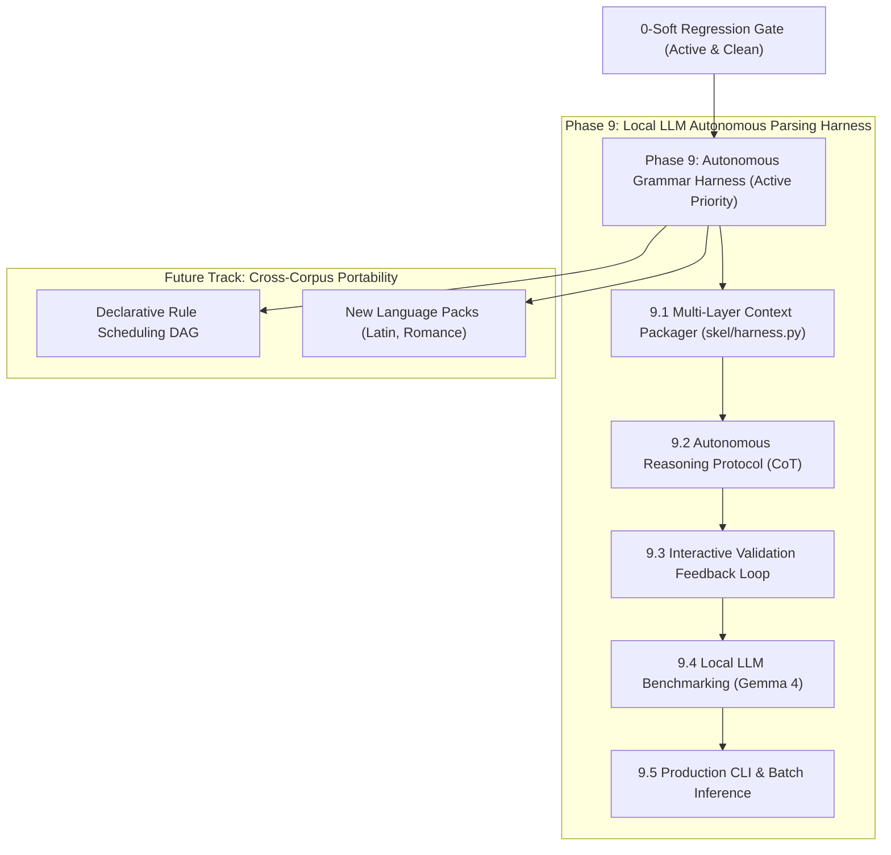

# skel — Layer 5 Plan: Post-Zero Grammar Parsing Harness & Future Architecture

## Status & Baseline

- **Current State**: `make -C skel check` reports **0 hard, 0 soft** violations across all 100 cantos — **100% CLEAN** across the entire corpus (Inferno 0, Purgatorio 0, Paradiso 0; 0 `dual_role`, 0 `extra_tuple`, 0 `missing_tuple`, 0 `argument heads no NP`, 0 divergence residue).
- **All Layers & Tests**: `dep --check` 0/0, `case --check` 0, `np --check` 0/0, `morph --check` 0/0, `pytest` **547 passed**.
- **Historical Phase Retrospectives (Closed)**:
  - **Phase 5**: 5,919 → 2,084 soft violations ([`PHASE5.md`](PHASE5.md)).
  - **Phase 6**: 2,084 → 160 soft violations ([`PHASE6.md`](PHASE6.md)).
  - **Phase 7**: 160 → 0 soft violations (100% clean corpus-wide) ([`PHASE7.md`](PHASE7.md)).
  - **Phase 8**: Codebase Restructuring & Modular Portability ([`PHASE8.md`](PHASE8.md)).
- **Grammar Specification**: Full 130-rule handbook with dynamic census metrics in [`RULES.md`](RULES.md) (Japanese edition: [`RULES-ja.md`](RULES-ja.md)).
- **Long-Term Portability Vision**: [`PORTABILITY.md`](PORTABILITY.md).

---

## Strategic Focus: Upcoming Phases

---

## Active Priority: Phase 9 — Grammatical Parsing Harness for Local LLMs

See [`HARNESS.md`](HARNESS.md) for detailed architectural designs, prompt structures, and evaluation benchmarks.

### 9.1 Multi-Layer Context Packager (`skel/harness.py`)
- **Objective**: Implement context extraction and packaging module providing local models (e.g. **Gemma 4**) with structured 5-layer diagnostic context.
- **Components**:
  - Extract source Italian verse, Layer 2 morphology (POS, inflection), pronoun case annex, Layer 3 noun phrases, and Layer 4 UD syntax trees for any target parse unit.
  - Render compact markdown/JSON prompts that expose full syntactic evidence (eliminating the blind "Independence Rule" trap that caused earlier `--fix` rounds to stall).

### 9.2 Autonomous Reasoning Protocol (CoT)
- **Objective**: Implement structured chain-of-thought prompt templates guiding local LLMs through a systematic 4-step grammatical reasoning workflow:
  1. **Morphological Agreement & Voice**: Match subject person/number with finite verbs; identify passive/reflexive `si`.
  2. **Head Token Citation**: Distinguish heads from modifiers in idioms and prepositional clusters.
  3. **Complement vs. Adjunct Discrimination**: Correctly classify `ccomp`, `xcomp`, and long-distance `obl` arguments.
  4. **Full Frame Generation**: Emit clean, well-formed markdown/TSV proposition tables.

### 9.3 Interactive Validation & Self-Correction Feedback Loop
- **Objective**: Build an automated interactive refinement loop between the local LLM and `validate_unit()`.
- **Workflow**:
  1. Local LLM proposes candidate proposition rows.
  2. Harness runs deterministic `validate_unit(unit, candidate_rows)` in-process.
  3. If violations occur (hard or soft), extract precise diagnostic violation strings (e.g., `role_mismatch`, `missing_arg`) and pass them back to the LLM as targeted correction turns.
  4. Terminate when 0 hard / 0 soft violations are achieved or retry budget is exhausted.

### 9.4 Local LLM Benchmarking & Evaluation
- **Objective**: Evaluate Gemma 4 (and other open-weights models) on historical grammatical parsing tasks.
- **Evaluation Dataset**:
  - Benchmark against the **87 historical Phase 7 divergence positions** and representative parse units across all three canticles.
  - Metrics: One-shot accuracy, multi-turn convergence rate, token efficiency, and violation resolution distribution.

### 9.5 Production CLI & Batch Inference
- **Objective**: Expose the harness via a clean CLI interface (`skel/harness.py`) with support for single unit debugging, whole canto evaluation, and automated batch processing.

---

## Future Track: Cross-Corpus Portability & Long-Term Extensions

See [`PORTABILITY.md`](PORTABILITY.md) for architectural details.

1. **Declarative Rule Scheduling DAG**:
   - Transition procedural `rules.py` execution into a declarative dependency graph with explicit precedence declarations (`precedes`, `requires`).
2. **Additional Language Packs**:
   - Construct language packs for Latin, Old French, and Modern Italian based on the abstract `LanguagePack` class.
3. **Standalone Linter Mode**:
   - Decouple intrinsic well-formedness validation (duplicate argument slots, cycle checks) from comparative derivation auditing.

---

## Standing Invariants & Disciplines

1. **0-Soft Regression Gate**: Any refactoring or layer update must preserve **0 hard / 0 soft violations** corpus-wide and pass all 547 unit tests.
2. **Mutation Testing for Rules**: Every rule in the registry must have at least one test fixture that fails when the rule is disabled.
3. **UD-General vs. Language-Specific Separation**: Do not allow Italian lexical forms to leak into general UD dependency algorithms.
4. **Deterministic Authority**: Ground all LLM interactions on deterministic derivation (`derive_unit`) and multi-layer validation checks.

---

## Next Session Handover / Action Items

### Immediate Priority: Phase 9.1 (`skel/harness.py` Context Packager)
- [ ] Create `skel/harness.py` with multi-layer parse unit context builder.
- [ ] Implement markdown formatting for 5-layer diagnostic prompts (text + morph + case + dep + candidate frame).
- [ ] Integrate with local LLM client runner (via `llm7shi` / Ollama / local inference).
- [ ] Implement the `validate_unit` self-correction feedback loop.
- [ ] Run initial benchmark against historical Phase 7 divergence cases.
