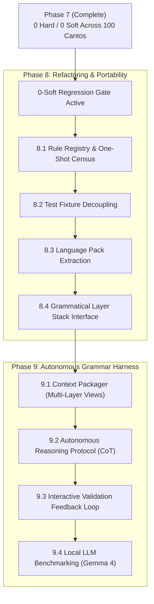

# skel — Layer 5 Plan: Post-Zero Refactoring, Portability & Grammar Harness

## Status

- **Current State**: `make -C skel check` reports **0 hard, 0 soft** violations across all 100
  cantos — **100% CLEAN** across the entire corpus (0 hard, 0 soft, 0 `dual_role`, 0 `extra_tuple`,
  0 `missing_tuple`, 0 `argument heads no NP`, 0 divergence residue). Per canticle: inferno 0, purgatorio 0,
  paradiso 0.
- **Other Layers**: `dep --check` **0 hard / 0 soft**, `case --check` 0 hard, `np --check` 0/0,
  `morph --check` 0/0, `pytest` **544 passed**.
- **Completed Phases**:
  - **Phase 5**: Complete and closed — 5,919 → 2,084 soft. Full retrospective in [`PHASE5.md`](PHASE5.md).
  - **Phase 6**: Complete and closed — 2,084 → 160 soft, with seven user-run `--fix` rounds (−1,157)
    and a per-position read of all 100 cantos in nineteen batches (rules AG–EH, −793, at zero model cost).
    Full retrospective in [`PHASE6.md`](PHASE6.md).
  - **Phase 7**: Complete and closed — **160 → 0 soft violations** (100% clean corpus-wide).
    Refusal census audit, outlier elimination, upstream retags, and six assistant-side read censuses (§P1–§P15).
    Full retrospective in [`PHASE7.md`](PHASE7.md).

---

## Overview & Next Strategic Directions

With **0 hard / 0 soft violations achieved across the entire *Divina Commedia***, the 0-soft count functions as an active **regression gate**. The project shifts from manual residue elimination to:

1. **Phase 8: Codebase Restructuring & Portability** ([`PORTABILITY.md`](PORTABILITY.md)) — Refactoring `dante_corpus/skel.py` (4,500+ lines, 84 rule letters) into a data-driven rule registry, decoupling tests into self-contained fixtures, isolating the 7 Italian language constants into a language pack, and establishing a clean layer stack interface.
2. **Phase 9: Grammatical Parsing Harness for Local LLMs** ([`HARNESS.md`](HARNESS.md)) — Developing an autonomous multi-layer grammar harness (`skel/harness.py`) that equips local models (e.g., Gemma 4) with integrated morphology, syntax trees, and self-correcting validation loops.

---

## Phase 8: Codebase Restructuring & Portability

See [`PORTABILITY.md`](PORTABILITY.md) for detailed technical specifications and background metrics.

### 8.1 Rule Registry & One-Shot Census
- **Problem**: 84 rule letters (A through EI) exist solely as inline `# rule XX:` comments within large `if ... continue` chains in `dante_corpus/skel.py`. Dead/subsumed rules cannot be identified, and rule ordering is implicit.
- **Action**:
  1. Define a structured `@rule` registry / data model recording rule ID, description, target violation class, and execution function.
  2. Implement an automated single-pass census script (`skel/census_rules.py`) that disables each rule individually, runs `--check` across all 100 cantos, and outputs:
     `rule_id -> population -> newly_flagged_count_on_removal`.
  3. Identify and prune dead rules (rules where removal produces 0 new flags) or consolidate subsumed rules.

### 8.2 Decouple Driver Tests from Live Corpus Data
- **Problem**: Tests in `tests/test_skel_fix.py` make assertions against live canto TSVs (e.g., `purgatorio 1`), causing test drift whenever live data is cleaned.
- **Action**:
  1. Create self-contained, hand-crafted test fixture parse units checked directly into `tests/fixtures/skel_fixtures.py`.
  2. Rewrite behavioral driver tests to run against fixtures.
  3. Retain 1–2 explicitly marked live-corpus integration tests to verify end-to-end I/O compatibility.

### 8.3 Extract Language Pack (`ItalianLanguagePack`)
- **Problem**: Out of 4,500+ lines, only 7 constants are Italian-specific; the rest are UD-general logic.
- **Action**:
  1. Extract the 7 constants into a dedicated `ItalianLanguagePack` class/module:
     - `_PREP_LEMMA_NORM` (preposition normalization)
     - `_REL_PRONOUN_WORDS` (NP-head relative pronouns)
     - `_RELATIVE_PRONOUNS` (clausal relative pronouns for rules CE/DC/DK)
     - `_RELATIVIZERS` (clause-relativizing tokens for rule DP)
     - `_COMPARATIVE_PARTICLES` (comparison markers in `case` slots)
     - `_COMPARATIVE_LEMMAS` (comparison markers by lemma)
     - `_LOCATIVE_RELATIVE_LEMMAS` (relative locatives by lemma)
  2. Inject the language pack into `derive_unit` and checker routines to make the core engine language-agnostic.

### 8.4 Grammatical Layer Stack Interface
- **Problem**: Rules take individual derived maps (`dep_index_by_pos`, `morph_pos_by_position`, `case_children`, etc.) as raw arguments, creating fragile positional signatures.
- **Action**:
  1. Encapsulate multi-layer access behind a formal `GrammarContext` object providing structured query helpers (`ctx.has_clitic()`, `ctx.get_head()`, `ctx.case_slot()`).
  2. Standardize `validate_unit` and rule signatures around `GrammarContext`.

---

## Phase 9: Grammatical Parsing Harness for Local LLMs

See [`HARNESS.md`](HARNESS.md) for architectural diagrams and prompt templates.

### 9.1 Multi-Layer Context Packager (`skel/harness.py`)
- Package source text, Layer 2 morphology + case features, and Layer 4 UD dependency trees into structured markdown/JSON prompts.
- Present exact candidate discrepancies without withholding syntax, avoiding the blind "Independence Rule" trap that caused `--fix` to stall.

### 9.2 Autonomous Reasoning Protocol
- Instruct the local LLM (e.g., Gemma 4) to follow a 4-step chain-of-thought protocol:
  1. **Agreement & Voice Analysis**: Strict verb-subject number/person matching.
  2. **Head Token Citation**: Disambiguating heads from dependents in complex idioms.
  3. **Oblique & Clausal Complements**: Disambiguating `advcl` from `ccomp` and capturing long-distance obliques.
  4. **Full-Unit Frame Generation**: Emitting coherent multi-predicate TSV frames.

### 9.3 Interactive Validation & Self-Correction Feedback Loop
- Harness automatically executes `validate_unit()` on LLM-generated frames.
- If hard/soft violations occur, feed exact diagnostic strings back to the LLM for self-correction.
- Accept and commit only frames achieving 0 hard / 0 soft violations.

### 9.4 Gemma 4 Benchmark & Evaluation
- Benchmark Gemma 4 against the 87 historical Phase 7 divergence positions.
- Evaluate autonomous convergence rate, token efficiency, and error recovery capability.

---

## Standing Invariants & Disciplines

1. **0-Soft Regression Gate**: All refactoring, rule reordering, or modularization must maintain **0 hard / 0 soft violations** corpus-wide.
2. **Mutation Testing for Rules**: Every rule in the registry must have at least one test fixture that fails when the rule is disabled.
3. **UD-General vs. Language-Specific Separation**: Do not allow Italian lexical forms to leak into general UD dependency algorithms.
4. **Deterministic Authority**: Ground all LLM interactions on deterministic derivation (`derive_unit`) and multi-layer validation checks.
