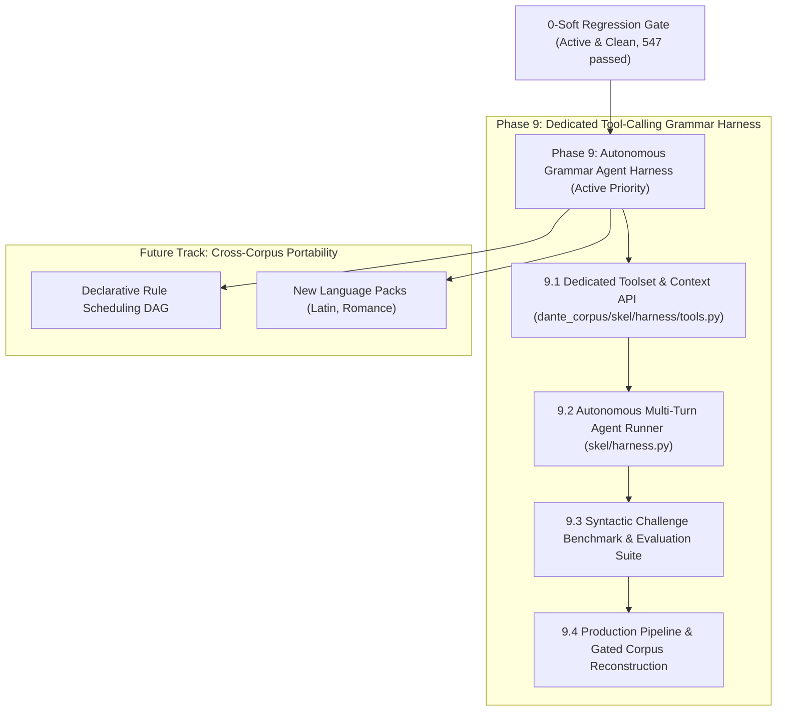
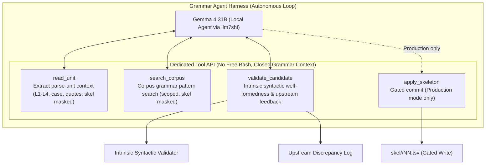

# skel — Layer 5 Plan: Grammatical Agent Harness & Future Architecture

## Status & Baseline

- **Current State**: `make -C skel check` reports **0 hard, 0 soft** violations across all 100 cantos — **100% CLEAN** across the entire corpus (Inferno 0, Purgatorio 0, Paradiso 0; 0 `dual_role`, 0 `extra_tuple`, 0 `missing_tuple`, 0 `argument heads no NP`, 0 divergence residue).
- **All Layers & Tests**: `dep --check` 0/0, `case --check` 0, `np --check` 0/0, `morph --check` 0/0, `pytest` **547 passed**.
- **Historical Phase Retrospectives (Closed)**:
  - **Phase 5**: 5,919 → 2,084 soft violations ([`PHASE5.md`](PHASE5.md)).
  - **Phase 6**: 2,084 → 160 soft violations ([`PHASE6.md`](PHASE6.md)).
  - **Phase 7**: 160 → 0 soft violations (100% clean corpus-wide, §P1–§P15) ([`PHASE7.md`](PHASE7.md)).
  - **Phase 8**: Codebase Restructuring & Modular Portability (Rules A–EI, 130 rules) ([`PHASE8.md`](PHASE8.md)).
- **Grammar Specification**: Full 130-rule handbook with dynamic census metrics in [`RULES.md`](RULES.md) (Japanese edition: [`RULES-ja.md`](RULES-ja.md)).
- **Long-Term Portability Vision**: [`PORTABILITY.md`](PORTABILITY.md).

---

## Strategic Focus: Upcoming Phases

---

## Active Priority: Phase 9 — Grammatical Agent Harness for Local LLMs (Gemma 4)

### 1. Overview & Paradigm Shift

In Phase 7 of the Dante Corpus project, soft violations were systematically driven down from 160 to **0 hard / 0 soft violations across all 100 cantos**.

A crucial architectural post-mortem revealed:
- **Limitations of Static Single-Slot Scripts (§P1–§P9)**: Automated scripts (`skel/driver_fix.py` / `skel.py --fix`) forced LLMs into narrow, single-slot Q&A templates parsed with regex. Across rounds 8–10, this yielded only 0.028–0.074 violations removed per call, because isolated single-slot questions cannot capture multi-layer grammatical phenomena (hyperbaton, control, agreement, and clausal complements).
- **Multi-Layer Holistic Diagnosis (§P10–§P15)**: In contrast, when the assistant (Gemini 3.7 Flash) was equipped with the multi-layer inspection tool ([`skel/read.py`](read.py)) — surveying verse text, morphology, pronoun case, NP spans, and UD syntax simultaneously — all remaining 112 complex positions were resolved down to 0 at zero model call cost.
- **Goal for Local Models (Gemma 4 31B)**: To package this multi-layer reasoning process into a standardized, autonomous **Grammar Agent Harness (`skel/harness.py`)**. Rather than giving the model an unconstrained bash environment (which wastes tokens on shell scripts and off-track file edits), the harness equips the model with a **closed, dedicated grammatical toolset (Tool Calling / Function Calling)** and a structured reasoning protocol.

---

### 2. Input Context Boundaries, Masking Policy & Feedback Architecture

All grammatical data provided to the harness is mediated through Phase 8's [`GrammarContext`](../dante_corpus/skel/models.py) and [`dante_corpus/api.py`](../dante_corpus/api.py):

| Layer / Component | `GrammarContext` / `api.py` Accessor | Scope & Contents Provided to Harness |
| :--- | :--- | :--- |
| **Layer 1: Text & Tokens** | `ctx.texts`, `Line.tokens` | Verse text, line numbers, alpha token streams |
| **Quotes Hierarchy** | `canto.quotes()`, `QuoteSpan` | Nested speaker/quote trees, start/end bounds, markers |
| **Layer 2: Morphology** | `ctx.morph_rows`, `MorphRow` | Lemma, POS, inflection (person, number, gender, tense, mood, notes) |
| **Case Annex** | `ctx.case_rows`, `CaseRow` | Pronominal and clitic grammatical case labels (`nom`, `acc`, `dat`, etc.) |
| **Layer 3: Noun Phrases** | `ctx.np_rows`, `NPSpan` | Explicit noun phrase boundaries, head token indices, nested spans |
| **Layer 4: UD Syntax** | `ctx.dep_rows`, `DepRow` | Universal Dependencies trees, head attachments, deprel labels (`nsubj`, `obj`, `obl`, `ccomp`, `xcomp`, `advcl`, etc.) |
| **Layer 5: Skeleton (Target)** | `canto.skel()`, `SkelTuple` | **RESTRICTED / MASKED** (Generation target) |
| **Grammar Rule Registry** | Rules A–EI (`skel/RULES.md`) | **STRICTLY EXCLUDED / MASKED** (Generation target) |
| **Manual Corrections & History** | [`skel/CORRECTIONS.md`](CORRECTIONS.md) | **STRICTLY EXCLUDED / MASKED** (Evaluation reference) |

#### 2.1 Layer 4 Status & Multi-Layer Projection
- **Authoritative Input Layer**: Now that Layer 4 has been audited across all 100 cantos and verified at 0/0 violations, UD syntax trees are provided to the model as an authoritative input layer alongside Layers 1–3 and the case annex.
- **Task Definition**: The agent's task is **multi-layer syntactic-to-skeleton projection**: synthesizing UD trees, morphology, pronoun cases, and NP heads into valid predicate-argument frames (`SkelRow`) without relying on hardcoded derivation rules (Rules A–EI) or gold skeleton tables.

#### 2.2 Upstream Discrepancy Feedback Channel (Cross-Layer Audit)
- **Standing Reality**: While all layers are currently clean under the 0-soft gate, upstream layers (Layer 2 morphology, Layer 3 NPs, Layer 4 UD syntax) are not 100% infallible. Poetic edge cases or subtle mis-tags may still exist.
- **Feedback Mechanism**: If the agent detects an irreconcilable upstream defect (e.g. an incorrect head attachment or person mismatch in Layer 4 that contradicts the verse text), it can emit structured `upstream_feedback` alongside or instead of candidate rows.
- **Triage & Logging**: The harness captures `upstream_feedback` in an **Upstream Discrepancy Log**. Operators can review flagged units via `skel/read.py`, apply corrections upstream (`dep/`, `morph/`), document them in `*/CORRECTIONS.md`, and verify the 0-soft gate.

#### 2.3 Strict Mode Separation: Benchmark vs. Production
To protect the active 0-soft regression gate, execution modes are strictly decoupled:

1. **Benchmark Mode (Evaluation & Self-Correction)**:
   - `validate_candidate` checks **intrinsic syntactic well-formedness** only (valid token ranges, NP head citation, slot uniqueness, basic argument consistency).
   - **Zero Disk Writes**: Operates entirely in memory / scratch buffers. `skel/*.tsv` is never touched.
   - **Offline Evaluation**: Candidate outputs are compared post-run against `derive_unit` and gold TSVs to measure exact match rates, role F1, and autonomous convergence.
2. **Production / Repair Mode (Gated Build Pipeline)**:
   - Uses `derive_unit` diagnostics to assist targeted repairs.
   - `apply_skeleton` executes only after passing token assertions, 0-soft verification, and content hash updates (`dante_corpus/hashes.py`).

#### 2.4 Harness-Side Operator Oracle
- `inject_oracle` is **not** exposed to the LLM as a tool (preventing the model from abandoning difficult units).
- Oracle intervention is an operator-level mechanism within the benchmark harness, invoked only when the agent exhausts its retry budget (e.g. 5 turns) and logged in benchmark audit reports.

---

### 3. Dedicated Grammar Tool Calling API

Instead of arbitrary shell execution (`bash`), the harness provides a closed, structured toolset via JSON/Python Function Calling:

#### 3.1 Tool Definitions (`dante_corpus/skel/harness/tools.py`)

1. `read_unit(canticle: str, canto: int, line_start: int, line_end: int = None) -> dict`
   - Bounded by `dep.sentence_groups` (`MAX_UNIT_LINES = 12`): returns the complete multi-layer context covering the entire sentence unit containing the requested line range.
   - Returns Text (L1), Quotes, Morphology (L2), Case Annex, NP Spans (L3), and UD Trees (L4).
   - Layer 5 skeleton rows and rule annotations are strictly masked.

2. `search_corpus(query: dict, limit: int = 10) -> list[dict]`
   - Allows searching across cantos for similar grammatical constructions (e.g. searching by `lemma`, `pos`, `deprel`).
   - Strict Anti-Leakage Guards: Excludes Layer 5 rows and Rule annotations. Automatically excludes the target unit and canto being parsed. Capped at `limit` results.

3. `validate_candidate(canticle: str, canto: int, line_start: int, candidate_rows: list[dict], upstream_feedback: list[dict] = None) -> dict`
   - Evaluates intrinsic syntactic well-formedness against candidate rows conforming to `SkelRow.to_dict()` (`line`, `token`, `word`, `role`, `arg_line`, `arg_token`).
   - Checks:
     - All predicate tokens exist in L1.
     - Nominal arguments cite valid L3 NP heads or L1 pronouns.
     - Slot uniqueness per predicate (no duplicate arguments without clitic licensing).
     - Valid role vocabulary (`subj`, `obj`, `iobj`, `attr`, `xcomp`, `ccomp`, `obl:<prep>`).
   - Logs `upstream_feedback` entries if the model reports anomalies in L2/L3/L4.
   - Returns `{"valid": bool, "errors": [...], "diagnostics": "..."}`.

4. `apply_skeleton(canticle: str, canto: int, line_start: int, candidate_rows: list[dict]) -> dict`
   - *Production/Repair mode only*: Asserts intrinsic validity, verifies 0-soft derivation consistency, and commits rows to the canto TSV with hash updates. Disabled in Benchmark mode.

---

### 4. Autonomous Multi-Layer Reasoning Protocol (CoT)

The agent operates in an interactive multi-turn loop guided by a 5-step grammatical reasoning protocol:

1. **Step 1: Discourse & Quote Boundaries (Quotes Hierarchy)**
   - Identify direct speech spans and speaker/addressee boundaries to distinguish vocatives from clausal complementation.
2. **Step 2: Predicate Agreement & Voice (Layer 2 Morphology)**
   - Check finite verb person/number against candidates to determine explicit subjects vs. pro-drop (`(0, 0)`).
   - Identify passive constructions and reflexive `si`.
3. **Step 3: Case & Core Argument Discrimination (Case Annex + Layer 4 UD)**
   - Adjudicate clitic arguments using explicit morphological case (`nom`, `acc`, `dat`).
   - Map UD grammatical relations (`nsubj`, `obj`, `iobj`, `obl:<prep>`) to skeleton role tuples.
4. **Step 4: NP Heads, Clausal Complements & Control (Layer 3 NPs + Layer 4 Clauses)**
   - Verify that all nominal arguments cite exact Layer 3 phrase heads rather than modifiers or prepositions.
   - Trace control and infinitival complement propagation (`xcomp`, `ccomp`, coordinate verbs).
5. **Step 5: Intrinsic Validation & Self-Correction**
   - Call `validate_candidate`. If errors are returned, interpret diagnostic feedback and refine.
   - If an upstream layer defect is identified, supply structured `upstream_feedback`.

---

### 5. Implementation Roadmap (Phase 9)

| Phase | Milestone | Deliverable / Goal |
|---|---|---|
| **Phase 9.1** | **Grammar Toolset & Context API** | Implement `dante_corpus/skel/harness/tools.py` using `GrammarContext` with `read_unit`, `search_corpus`, `validate_candidate`, `apply_skeleton` (L5/rule masking, upstream feedback logging). |
| **Phase 9.2** | **Gemma 4 Autonomous Agent Runner** | Build `skel/harness.py` using `llm7shi.Client` and `model.mk` (`ollama:gemma4:31b-it-qat`). Initial spike: verify Gemma 4 Function Calling stability under QAT quantization. |
| **Phase 9.3** | **Syntactic Challenge & Evaluation Suite** | Benchmark Gemma 4 on curated syntactic challenge fixtures (pro-drop, control, hyperbaton, quotes) and historical test cases against the 0-soft ground truth. Measure 1-shot accuracy, multi-turn convergence, role F1, and upstream feedback logs. |
| **Phase 9.4** | **Production CLI & Full-Canto Pipeline** | Support single-unit debugging CLI and full-canto autonomous batch reconstruction with gated token assertions and hash recalculation. |

---

### 6. Phase 9.3 Benchmark Specification

- **Evaluation Dataset**:
  - **Core Challenge Fixtures (50–100 units)**: Curated parse units representing key syntactic challenges (long-distance hyperbaton, coordinated predicates, control verbs, embedded direct quotes, relative clause chains).
  - **Historical Case Units**: Units corresponding to historical outlier resolutions documented in [`skel/CORRECTIONS.md`](CORRECTIONS.md).
- **Evaluation Metrics**:
  - **1-Shot Exact Match Rate**: Percentage of units matching `derive_unit` on the first candidate turn.
  - **Autonomous Convergence Rate**: Percentage of units achieving 0 divergence after multi-turn self-correction (≤ 5 turns).
  - **Role-Level F1**: Precision, Recall, and F1 across argument roles (`subj`, `obj`, `obl:<prep>`, `xcomp`, `ccomp`).
  - **Upstream Feedback Precision**: Analysis of emitted `upstream_feedback` entries (verified upstream defects vs. model misconceptions).
- **Pass Criteria**:
  - Exact match ≥ 90% across the challenge fixture set with multi-turn self-correction.
  - Zero crashes or unhandled tool-call serialization exceptions.

---

### 7. Future Track: Cross-Corpus Portability & Long-Term Extensions

See [`PORTABILITY.md`](PORTABILITY.md) for architectural details.

1. **Declarative Rule Scheduling DAG**:
   - Transition procedural `rules.py` execution into a declarative dependency graph with explicit precedence declarations (`precedes`, `requires`).
2. **Additional Language Packs**:
   - Construct language packs for Latin, Old French, and Modern Italian based on the abstract `LanguagePack` class.
3. **Standalone Linter Mode**:
   - Decouple intrinsic well-formedness validation (duplicate argument slots, cycle checks) from comparative derivation auditing.

---

### 8. Standing Invariants & Disciplines

1. **0-Soft Regression Gate**: Any refactoring or layer update must preserve **0 hard / 0 soft violations** corpus-wide and pass all 547 unit tests.
2. **Cross-Layer Hygiene & Feedback**: Upstream layers are treated as authoritative but falsifiable baselines; model-reported discrepancies are triaged and corrected in upstream artifacts (`dep/`, `morph/`).
3. **No Unchecked TSV Writes**: Benchmark mode writes exclusively to memory/scratch buffers. Production writes require full 0-soft validation, token assertions, and hash updates.
4. **Deterministic Authority**: All evaluations are grounded in deterministic derivation (`derive_unit`).

---

## Action Items & Next Steps

### Phase 9.1: Dedicated Toolset & Context API
- [ ] Implement `dante_corpus/skel/harness/tools.py` backed by `GrammarContext`:
  - `read_unit` (sentence-group bounded, L5/rule masked)
  - `search_corpus` (scoped grammar search, anti-leakage guards)
  - `validate_candidate` (intrinsic syntactic well-formedness, `upstream_feedback` capture)
  - `apply_skeleton` (production mode gated commit)
- [ ] Add unit tests for tool functions in `tests/test_skel_harness.py`.

### Phase 9.2: Gemma 4 Autonomous Runner
- [ ] Run Function Calling reliability spike on `ollama:gemma4:31b-it-qat` via `llm7shi.Client`.
- [ ] Implement multi-turn agent loop in `skel/harness.py` with 5-step CoT prompt templates.

### Phase 9.3: Syntactic Challenge Benchmark
- [ ] Curate the syntactic challenge fixture set and historical case units.
- [ ] Implement benchmark scoring harness and run evaluation against Gemma 4 31B.

### Phase 9.4: Production CLI
- [ ] Implement interactive CLI and full-canto reconstruction pipeline with 0-soft gated writes.
