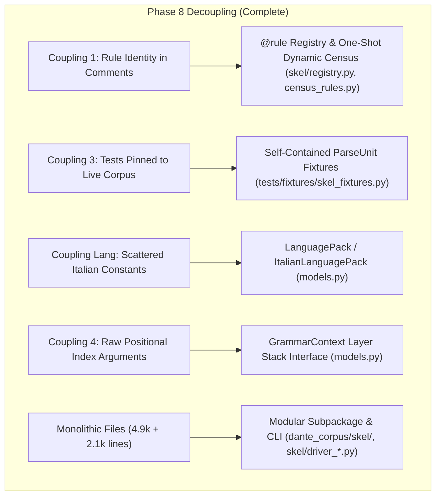

# skel — Layer 5 Portability & Cross-Lingual Generalization Architecture

**Status: Architectural Reference & Future Design Guide.**
This document outlines the architectural principles, achieved decouplings, and open long-term horizons for generalizing the Layer-5 (predicate-argument skeleton) derivation and validation engine across different languages and corpora.

- **Phase 8 Milestone (Completed)**: Internal codebase restructuring, rule registry census, test fixture decoupling, `ItalianLanguagePack` extraction, `GrammarContext` interface, and modular decomposition are complete and verified at 0 hard / 0 soft violations corpus-wide. See [`PHASE8.md`](PHASE8.md) for the closed retrospective.
- **Active Development Plan**: See [`PLAN.md`](PLAN.md).
- **Rule Specification & Census**: See [`RULES.md`](RULES.md) (or [`RULES-ja.md`](RULES-ja.md)).

---

## 1. The Portability Goal & Architectural Seams

The Layer-5 engine parses and validates propositions citing token positions based on Universal Dependencies (UD). The core design goal is to separate:
1. **Universal Dependencies (UD) General Logic**: Core predicate-argument relations, clausal complement attachments (`ccomp`/`xcomp`), adverbial modifiers (`advmod`/`advcl`), and nominal argument slots (`nsubj`/`obj`/`iobj`/`obl`).
2. **Grammar & Corpus Representation**: Layered abstractions for tokens, morphology, noun phrases, dependency trees, and pronoun case features.
3. **Language-Specific Surface Syntax**: Language-bound prepositions, relative pronouns, comparative particles, and idioms.

---

## 2. Decouplings Completed in Phase 8

The initial refactoring roadmap identified four primary couplings in the original monolithic engine. Phase 8 systematically decoupled them within `dante-corpus`:

### 2.1 Rule Identity & Introspection (Resolved)
- **Previous state**: 84 rule letters existed solely in code comments within procedural `if ... continue` chains. Dead or subsumed rules were invisible.
- **Current state**: All 130 rules are formally registered via `@rule` in `dante_corpus/skel/registry.py`. `skel/census_rules.py` measures the exact population and removal impact of every rule in-memory across the corpus in ~2 seconds (82 active, 5 auxiliary, 43 dormant).

### 2.2 Test Fixture Decoupling (Resolved)
- **Previous state**: Driver unit tests ran directly against live canto TSVs (`purgatorio 1`, `inferno 5`), breaking when valid corpus edits cleared flagged positions.
- **Current state**: Unit tests run against static, synthetic fixtures in `tests/fixtures/skel_fixtures.py`, with live-corpus integration preserved in a single dedicated test.

### 2.3 Language Pack Isolation (Resolved)
- **Previous state**: 7 language-specific constants were hardcoded directly inside derivation and validation helpers.
- **Current state**: Extracted into `LanguagePack` / `ItalianLanguagePack` (`dante_corpus/skel/models.py`):
  1. `prep_lemma_norm`: Italian preposition lemma normalizations and article contractions.
  2. `rel_pronoun_words`: Relative pronoun surface forms for Layer-3 NP head acceptance.
  3. `relative_pronouns`: Relative pronoun forms for control and antecedent linking.
  4. `relativizers`: Broader relativizing particles for negative clausal gates.
  5. `comparative_particles`: Comparison markers in Layer-4 `case` slots.
  6. `comparative_lemmas`: Comparison markers by Layer-2 lemma.
  7. `locative_relative_lemmas`: Locative relative markers by lemma.

### 2.4 Grammatical Layer Stack Encapsulation (Resolved)
- **Previous state**: Functions accepted long positional parameter lists of dictionaries and lists (`dep_index_by_pos`, `morph_pos_by_position`, `case_by_position`, etc.).
- **Current state**: Encapsulated in `GrammarContext` providing unified methods (`ctx.dep_at()`, `ctx.morph_at()`, `ctx.head_of()`, `ctx.deprel_of()`, `ctx.is_verb()`, `ctx.is_pronoun()`, `ctx.case_slot()`).

---

## 3. Future Portability Horizons & Long-Term Concepts

While Phase 8 established clean internal seams, broad portability across other languages and corpora involves several long-term architectural questions:

### 3.1 Declarative Rule Ordering & Execution Graph (Coupling 2 Horizon)
- **Current state**: Rules execute sequentially in the order defined in `dante_corpus/skel/rules.py`. Rule ordering has historically resolved edge-case shadowing (e.g. Rules AQ′, DG, DS, DT, BO, BZ, CZ).
- **Future design**:
  - Model rules as a directed acyclic graph (DAG) or categorized priority pipeline (Normalization → Subject Authority → Tuple Validation → Argument Validation → Role Mismatch).
  - Explicitly declare precedence prerequisites (e.g. `@rule(precedes=["rule_d"], requires=["rule_ai"])`) to eliminate procedural ordering hazards when importing new rules for other corpora.

### 3.2 Cross-Lingual Adaptation & New Language Packs
- **Current state**: The engine runs with `ItalianLanguagePack`.
- **Future design**:
  - Instantiate language packs for other literary traditions (e.g., `LatinLanguagePack`, `MiddleEnglishLanguagePack`, `OldFrenchLanguagePack`, `ModernItalianLanguagePack`).
  - Account for fundamental typological differences:
    - **Pro-Drop vs. Non-Pro-Drop**: Italian licenses `subj=(0,0)` pro-drop null subjects. English and French require overt expletive or pronominal subjects.
    - **Inflected Case vs. Prepositional Case**: Classical Latin encodes case arguments directly in morphology (`nom`, `acc`, `dat`, `abl`) without auxiliary `obl:<prep>` markers.
    - **Clitic Doubling & Reflexive Voice**: Romance pronominal verbs vs. Germanic separable verb prefixes.

### 3.3 Authority Model & Genre Syntax Generalization
- **Current state**: `derive_unit` embeds syntactic assumptions optimized for 14th-century poetic Italian:
  - Subject propagation across coordinate finite verb chains (`conj`).
  - Control subject inheritance along non-finite head chains (Rule V).
  - Gapped-clause remnant assignment (Rule AN/CZ/DH).
  - Verbless speech act parataxis (Rule EA).
- **Future design**:
  - Parameterize syntactic derivation strategies so different genres (prose, verse, dialogic scripts) can configure coordination inheritance depth, control candidate chains, and ellipsis tolerances without rewriting `derive_unit`.

### 3.4 Decoupling Comparative Validation from Intrinsic Consistency
- **Current state**: Most Layer-5 checks compare LLM candidate tuples against `derive_unit` (differential validation). Rule EG (`dual_role`) is an exception that evaluates artifact self-consistency without consulting `derive_unit`.
- **Future design**:
  - Formally divide the validation engine into:
    1. **Intrinsic Syntactic Well-Formedness**: Checks that evaluate an artifact on its own graph properties (no duplicate argument slots, no cycle in control chains, valid token boundaries).
    2. **Comparative Derivation Auditing**: Checks that evaluate an artifact against deterministic UD derivation.
  - This allows using the intrinsic checker as a standalone linter for external UD skeletons where no deterministic derivative engine exists.

---

## 4. Summary of Language Surface vs. UD General Surface

The lexical surface of the Layer-5 engine is confined to the 7 language constants:

| Category | Constant | Scope / Purpose |
| :--- | :--- | :--- |
| **Prepositions** | `prep_lemma_norm` | Lemma normalization, article mergers, apocopes |
| **Relative Pronouns** | `rel_pronoun_words` | Word forms admitted as NP heads |
| **Relative Pronouns** | `relative_pronouns` | Core relative pronouns for control chains |
| **Relativizers** | `relativizers` | Full set of clausal relativizers (negative gate) |
| **Comparatives** | `comparative_particles` | Comparison markers in `case` slots |
| **Comparatives** | `comparative_lemmas` | Comparison markers by lemma |
| **Locatives** | `locative_relative_lemmas` | Relative locative lemmas (`dove`, `onde`, `ove`) |

All other logic—Universal Dependencies relations (`nsubj`, `obj`, `iobj`, `xcomp`, `ccomp`, `advcl`, `obl`), the 5-layer stack interface, and deterministic derivation—are language-agnostic frameworks suitable for cross-corpus generalization.
