# 第5層 文法ハンドブック＆統語規則仕様書 (`skel/RULES-ja.md`)

**ダンテ・コーパス — 第5層 述語・項構造スケルトン規則体系**

> **検証状況**: 『神曲』全100歌において **ハード違反 0 件 / ソフト違反 0 件** を達成（`pytest` **547 件パス**）。  
> **ルールカタログ**: 正式登録規則 全130件（直接稼働中: 82件、補助・構造規則: 5件、休眠・統合済: 43件）。

---

## 目次＆統語階層ツリー (Grammatical Hierarchy Tree)

```mermaid
graph TD
    ROOT[第5層 統語規則エンジン]
    ROOT --> B1[1. 述語同定と節トポロジー]
    ROOT --> B2[2. 主語認可と統語的権威モデル]
    ROOT --> B3[3. 中核的結合価と補部構造]
    ROOT --> B4[4. 斜格と付加詞]
    ROOT --> B5[5. 等位構造・空所化・比較構文]
    ROOT --> B6[6. 表層スパン正規化と階層整合性]
    B1 --> B1_1[1.1 述語主要部の選択: 1, 2, BN, AN]
    B1 --> B1_2[1.2 助動詞・繋辞述語構文: I, Y, BF, BS, CT, AV]
    B1 --> B1_3[1.3 二次述語および縮約述語構文: AA, AU, R, DX, AZ, BX, DW, AY, CH, EA, CS, DA]
    B2 --> B2_1[2.1 主語脱落とゼロ主語: BH, CN, CU, DU]
    B2 --> B2_2[2.2 等位構文における主語継承: BZ, AT, AG, DO, AH, EF, AP, BE, CD, DE, AC, BU]
    B2 --> B2_3[2.3 コントロール理論と繰り上げ構文: V, CL, BB, BI, DN, AX, CF, CJ, CE, DF]
    B2 --> B2_4[2.4 非人称構文と変位主語: DQ, BA]
    B3 --> B3_1[3.1 直接・間接目的語と接語代名詞: N, AB, AW, BD, AL, AS, EH]
    B3 --> B3_2[3.2 節補部: P, Q, CQ, CY, CK]
    B3 --> B3_3[3.3 述語補部と繋辞構造: M, DB, DL, AD, X]
    B4 --> B4_1[4.1 前置詞斜格: L, O, S, CB, DV, D]
    B4 --> B4_2[4.2 副詞的斜格と場所表現: J, BC, DD, DY]
    B4 --> B4_3[4.3 副詞節と関係節: T, AE, BT, DP, DK, CX, DJ, DC]
    B5 --> B5_1[5.1 等位接続詞と項の共有: A, C, DG, AJ, DZ, CA, CC]
    B5 --> B5_2[5.2 空所化と残余要素: CZ, DH, CW, DI, CG]
    B5 --> B5_3[5.3 比較構文: AK, AR, BK, BL, DM, DR, EB, EC, ED]
    B6 --> B6_1[6.1 名詞句主要部と複合表現の正規化: AI, BO, BR, EI, BV, EE, BJ, BQ, AQ, BP]
    B6 --> B6_2[6.2 形態統語論と格アネックスの整合: U, W, CM, CP, BM]
    B6 --> B6_3[6.3 統語スロットの認容性と無矛盾性: AF, DS, BW, Z, DT, EG]
```



- [1. 述語同定と節トポロジー](#1-述語同定と節トポロジー)
  - [1.1 述語主要部の選択](#11-述語主要部の選択)
  - [1.2 助動詞・繋辞述語構文](#12-助動詞繋辞述語構文)
  - [1.3 二次述語および縮約述語構文](#13-二次述語および縮約述語構文)
- [2. 主語認可と統語的権威モデル](#2-主語認可と統語的権威モデル)
  - [2.1 主語脱落とゼロ主語](#21-主語脱落とゼロ主語)
  - [2.2 等位構文における主語継承](#22-等位構文における主語継承)
  - [2.3 コントロール理論と繰り上げ構文](#23-コントロール理論と繰り上げ構文)
  - [2.4 非人称構文と変位主語](#24-非人称構文と変位主語)
- [3. 中核的結合価と補部構造](#3-中核的結合価と補部構造)
  - [3.1 直接・間接目的語と接語代名詞](#31-直接間接目的語と接語代名詞)
  - [3.2 節補部](#32-節補部)
  - [3.3 述語補部と繋辞構造](#33-述語補部と繋辞構造)
- [4. 斜格と付加詞](#4-斜格と付加詞)
  - [4.1 前置詞斜格](#41-前置詞斜格)
  - [4.2 副詞的斜格と場所表現](#42-副詞的斜格と場所表現)
  - [4.3 副詞節と関係節](#43-副詞節と関係節)
- [5. 等位構造・空所化・比較構文](#5-等位構造空所化比較構文)
  - [5.1 等位接続詞と項の共有](#51-等位接続詞と項の共有)
  - [5.2 空所化と残余要素](#52-空所化と残余要素)
  - [5.3 比較構文](#53-比較構文)
- [6. 表層スパン正規化と階層整合性](#6-表層スパン正規化と階層整合性)
  - [6.1 名詞句主要部と複合表現の正規化](#61-名詞句主要部と複合表現の正規化)
  - [6.2 形態統語論と格アネックスの整合](#62-形態統語論と格アネックスの整合)
  - [6.3 統語スロットの認容性と無矛盾性](#63-統語スロットの認容性と無矛盾性)
- [実行パイプラインと処理段階](#実行パイプラインと処理段階)
- [総合ルール索引 (Master Rule Index)](#総合ルール索引-master-rule-index)

---

## 1. 述語同定と節トポロジー

節の根（Root）、従属節主要部、助動詞・繋辞の周辺構文、および二次述語構文の同定を司る規則群です。

### 1.1 述語主要部の選択

Universal Dependencies (UD) の依存関係ラベル（`deprel`）および品詞（POS）タグに基づき、節の主要部および独立した言明述語を特定する統語的基準を定めます。

#### Rule `1`: `clause_head_predicate`

- **種別**: `derivation` | **状態**: **dormant** | **適用数**: 0 件 | **除去時影響**: 0 違反
- **文法概要**: 節主要部トークンを述語として同定
- **UD 統語定式化**: ``deprel in CLAUSE_HEAD_DEPRELS``
- **言語学的根拠と実装**:
  > 節主要部トークンを述語とする規則。節主要部の依存関係ラベル（`root`, `ccomp`, `xcomp`, `csubj`, `csubj:pass`, `advcl`, `acl`, `acl:relcl`, `parataxis`）を持つすべてのトークンを、言明を行う述語として導出します。
- **代表的テキスト用例**:
  > *Inferno* 1:1 `Nel mezzo del cammin di nostra vita / mi **ritrovai**...` （我らの人生の道の半ばで、私は気がついた……）  
  > → `ritrovai`（root）が (2, 2) の述語として導出される。

#### Rule `2`: `verb_with_dependent_predicate`

- **種別**: `derivation` | **状態**: **dormant** | **適用数**: 0 件 | **除去時影響**: 0 違反
- **文法概要**: 項従属節を持つ非助動詞の動詞を述語として同定
- **UD 統語定式化**: ``deprel not in _AUX_DEPRELS and has argument child``
- **言語学的根拠と実装**:
  > 項を従える非助動詞を述語とする規則。助動詞（`aux`, `aux:pass`, `cop`）以外の動詞で、中核項または斜格項を支配しているトークンを述語として導出します。
- **代表的テキスト用例**:
  > *Inferno* 1:4 `Ahi quanto a **dir** qual era è cosa dura...` （ああ、それがどのようなものであったかを語るのは、なんと困難なことか……）  
  > → `dir`（`ccomp` 従属節 `era` を取る動詞）が述語として導出される。

#### Rule `BN`: `conjunction_clause_head_predicate`

- **種別**: `derivation` | **状態**: **auxiliary** | **適用数**: 4 件 | **除去時影響**: 0 違反
- **文法概要**: 項を持たずに節主要部として付加された接続詞の除外
- **UD 統語定式化**: ``advcl`/`root` conjunction without argument children`
- **言語学的根拠と実装**:
  > 項を伴わない接続詞の述語化を阻止する規則。`advcl` や `root` として係留されている接続詞であっても、項となる従属要素を持たない場合は述語への昇格を拒否します。
- **代表的テキスト用例**:
  > *Inferno* 29:124 `**Onde** ... rispuose` （そこで……答えた）  
  > → 接続語 `Onde` は項を持たないため述語昇格が阻止される。

#### Rule `AN`: `gapped_conjunct_remnant`

- **種別**: `derivation` | **状態**: **auxiliary** | **適用数**: 2 件 | **除去時影響**: 0 違反
- **文法概要**: 孤立要素（orphan）を持つ空所化等位項による述語スロットの補完
- **UD 統語定式化**: ``orphan` deprel on coordinate conjunct`
- **言語学的根拠と実装**:
  > `orphan` 子要素を持つ等位項は空所化（動詞省略）節の主要部となり、その残余要素が等位構造主要部の項スロットを満たします。
- **代表的テキスト用例**:
  > *Inferno* 15:96 `però giri **Fortuna** **la sua rota** ..., e 'l **villan** **la sua marra**` （それゆえ運命は自らの車輪を回すがよい……、農夫は自らの鍬を［回すがよい］）  
  > → `villan` と `marra` が残余要素として `giri` の項スロットを満たす。

---

### 1.2 助動詞・繋辞述語構文

繋辞述語、助動詞連鎖、名詞述語、および倒置された繋辞補部の処理を行います。

#### Rule `I`: `auxiliary_host_head`

- **種別**: `extra_tuple` | **状態**: **auxiliary** | **適用数**: 193 件 | **除去時影響**: 0 違反
- **文法概要**: aux/cop によって付加された語彙的述語主要部の同定
- **UD 統語定式化**: ``head` of `aux` / `cop` token`
- **言語学的根拠と実装**:
  > `aux`, `aux:pass`, `cop` のエッジを有界探索し、支配関係にある語彙的述語主要部を特定します。
- **代表的テキスト用例**:
  > *Inferno* 1:3 `ché la diritta via **era** **smarrita**` （正しき道が見失われていたのだから）  
  > → 助動詞 `era` が語彙的述語主要部 `smarrita` に対応づけられる。

#### Rule `Y`: `copular_nominal_predication`

- **種別**: `extra_tuple` | **状態**: **active** | **適用数**: 203 件 | **除去時影響**: 202 違反
- **文法概要**: 名詞系 deprel の下に付加された繋辞名詞述語の認可
- **UD 統語定式化**: `Copular clause nominal predicate`
- **言語学的根拠と実装**:
  > 省略のない繋辞節において、`attr` または `root` の下に係留された名詞句・形容詞述語を受容します。
- **代表的テキスト用例**:
  > *Inferno* 1:4 `è **cosa** dura` （［語ることは］困難なことである）  
  > → 名詞 `cosa` が繋辞名詞述語として認可される。

#### Rule `BF`: `inverted_copula_complement`

- **種別**: `extra_arg` | **状態**: **active** | **適用数**: 8 件 | **除去時影響**: 7 違反
- **文法概要**: 倒置された繋辞依存構造の調停
- **UD 統語定式化**: `Inverted `cop` dependency structure`
- **言語学的根拠と実装**:
  > 第4層において繋辞 `essere` が述語名詞の上位主要部として係留された倒置繋辞依存関係を調停します。
- **代表的テキスト用例**:
  > *Inferno* 11:25 `d'ogne malizia ... **ingiuria** **è** 'l **fine**` （あらゆる悪意の……終極の目的は不正を加えることである）  
  > → 倒置された繋辞補部。

#### Rule `BS`: `copular_predication_via_aux`

- **種別**: `extra_tuple` | **状態**: **dormant** | **適用数**: 0 件 | **除去時影響**: 0 違反
- **文法概要**: 繋辞トークンによって命名された繋辞述語の調停
- **UD 統語定式化**: `Copula token naming nominal predication`
- **言語学的根拠と実装**:
  > モデルが名詞述語ではなく助動詞・繋辞トークン側を述語として命名した場合に調停します。
- **代表的テキスト用例**:
  > `**è**` によって指定された繋辞述語の調停。

#### Rule `CT`: `copula_under_its_complement`

- **種別**: `extra_arg` | **状態**: **active** | **適用数**: 2 件 | **除去時影響**: 2 違反
- **文法概要**: 自身の述語補部の下位に付加された繋辞の調停
- **UD 統語定式化**: `Copula attached under complement`
- **言語学的根拠と実装**:
  > 繋辞 `essere` が自身の述部補部の下位に係留された倒置ツリー構造を調停します。
- **代表的テキスト用例**:
  > *Inferno* 1:4 `**cosa** dura` / `**è**` （［語ることは］困難なことである）  
  > → `è` が `cosa` の下位に係留された構造を調停。

#### Rule `AV`: `named_by_its_auxiliary`

- **種別**: `missing_tuple` | **状態**: **active** | **適用数**: 5 件 | **除去時影響**: 5 違反
- **文法概要**: LLM 出力において助動詞位置で命名された導出述語の受容
- **UD 統語定式化**: `Auxiliary token naming lexical predicate`
- **言語学的根拠と実装**:
  > 導出された語彙的述語が、モデル出力においてその助動詞トークンの位置で引用された場合に受容します。
- **代表的テキスト用例**:
  > *Inferno* 1:3 `**era** **smarrita**` （見失われていた）  
  > → 述語が助動詞 `era` の行・トークン位置で引用された場合に認可。

---

### 1.3 二次述語および縮約述語構文

形容詞・副詞的二次述語、描写小節（depictive small clauses）、項補部を伴う形容詞句、縮約関係節分詞、および発話行為名詞構文を扱います。

#### Rule `AA`: `perception_depictive_small_clause`

- **種別**: `extra_arg` | **状態**: **active** | **適用数**: 34 件 | **除去時影響**: 29 違反
- **文法概要**: 知覚動詞構文または描写小節における二次述語
- **UD 統語定式化**: ``xcomp` / `acl` secondary predicate over argument`
- **言語学的根拠と実装**:
  > 知覚動詞構文などにおいて、直接目的語または主語に係留された二次述語（小節）を受容します。
- **代表的テキスト用例**:
  > *Inferno* 4:118 `Vidi **Elettra** **con molti compagni**` （私は多くの道連れを連れたエレクトラを見た）  
  > → 描写二次述語（小節）。

#### Rule `AU`: `adjective_secondary_predicate`

- **種別**: `extra_arg` | **状態**: **dormant** | **適用数**: 0 件 | **除去時影響**: 0 違反
- **文法概要**: 項に amod として付加され二次述語として機能する形容詞
- **UD 統語定式化**: ``amod` adjective functioning as secondary predicate`
- **言語学的根拠と実装**:
  > 項名詞に `amod` として係留された描写二次述語形容詞を受容します。
- **代表的テキスト用例**:
  > *Inferno* 6:24 `urlavan per la pioggia **come cani**` （彼らは雨に打たれ犬のように吠えていた）  
  > → 描写的な二次述語表現。

#### Rule `R`: `predicative_advmod`

- **種別**: `extra_arg` | **状態**: **active** | **適用数**: 96 件 | **除去時影響**: 90 違反
- **文法概要**: advmod または二次述語として付加された述語的形容詞・副詞
- **UD 統語定式化**: ``advmod` with adjective POS`
- **言語学的根拠と実装**:
  > 第4層で形容詞・副詞が `advmod` として係留されている場合、`xcomp`（述語補部）としての解釈を受容します。
- **代表的テキスト用例**:
  > *Inferno* 1:7 `Tant' è **amara** che poco è più morte` （それはあまりに苦く、死もそれ以上に苦しいことはほとんどないほどだ）  
  > → `advmod` として付加された形容詞 `amara` を述語補部として認可。

#### Rule `DX`: `predicative_advmod_adjective`

- **種別**: `extra_arg` | **状態**: **dormant** | **適用数**: 0 件 | **除去時影響**: 0 違反
- **文法概要**: advmod として付加された述語形容詞
- **UD 統語定式化**: ``advmod` predicative adjective`
- **言語学的根拠と実装**:
  > `advmod` として付加された述語形容詞を二次述語スロットにおいて受容します。
- **代表的テキスト用例**:
  > *Inferno* 1:7 `Tant' è **amara**` （あまりに苦い）  
  > → `amara` の述語的 `advmod`。

#### Rule `AZ`: `depictive_bare_oblique`

- **種別**: `role_mismatch` | **状態**: **active** | **適用数**: 25 件 | **除去時影響**: 22 違反
- **文法概要**: 単独斜格（bare obl）として付加された描写形容詞の attr/xcomp 照合
- **UD 統語定式化**: `Bare `obl` with adjective POS vs `xcomp``
- **言語学的根拠と実装**:
  > 第4層で単独斜格（bare `obl`）として係留された描写形容詞を、`attr` または `xcomp` に対して受容します。
- **代表的テキスト用例**:
  > *Inferno* 12:83 `ch'i' son **soletto**` （私はただ一人であるので）  
  > → 描写単独斜格 `soletto` を認可。

#### Rule `BX`: `depictive_bare_oblique_omitted`

- **種別**: `missing_arg` | **状態**: **active** | **適用数**: 10 件 | **除去時影響**: 10 違反
- **文法概要**: LLM 解釈で省略された描写単独斜格の受容
- **UD 統語定式化**: `Depictive bare oblique omission`
- **言語学的根拠と実装**:
  > 述語に内在する描写単独斜格がモデル解釈で省略された場合に受容します。
- **代表的テキスト用例**:
  > *Inferno* 12:83 `ch'i' son **soletto**` （私はただ一人であるので）  
  > → 描写単独斜格 `soletto` の省略を認可。

#### Rule `DW`: `depictive_attr_omitted`

- **種別**: `missing_arg` | **状態**: **active** | **適用数**: 2 件 | **除去時影響**: 2 違反
- **文法概要**: LLM 解釈で省略された描写 attr の受容
- **UD 統語定式化**: `Depictive `attr` omission`
- **言語学的根拠と実装**:
  > 第4層で `attr` スロットに置かれた描写形容詞がモデル解釈で省略された場合に受容します。
- **代表的テキスト用例**:
  > *Inferno* 12:83 `ch'i' son **soletto**` （私はただ一人であるので）  
  > → 描写形容詞 `soletto` の `attr` 省略を認可。

#### Rule `AY`: `complemented_adjective_phrase`

- **種別**: `extra_tuple` | **状態**: **active** | **適用数**: 6 件 | **除去時影響**: 6 違反
- **文法概要**: 項を支配する形容詞句の述語昇格
- **UD 統語定式化**: ``amod` adjective phrase with argument dependent`
- **言語学的根拠と実装**:
  > `amod` として付加され、かつ項補部を支配している形容詞句を独立した言明述語として受容します。
- **代表的テキスト用例**:
  > *Inferno* 28:115 `un **busto** **sanza capo** **andar** sì come andavan li altri` （首のない胴体が、他の者たちが歩くように歩んでいくの［を見た］）  
  > → 項を伴う形容詞句 `sanza capo` を認可。

#### Rule `CH`: `verb_in_adnominal_slot`

- **種別**: `extra_tuple` | **状態**: **active** | **適用数**: 3 件 | **除去時影響**: 3 違反
- **文法概要**: 縮約関係節として機能する amod/acl スロットの分詞・動詞
- **UD 統語定式化**: ``amod` / `acl` participle / reduced relative verb`
- **言語学的根拠と実装**:
  > `amod` または `acl` として付加された分詞または動詞を、独立した言明述語として受容します。
- **代表的テキスト用例**:
  > *Inferno* 1:15 `le sue spalle **vestite** già de' raggi del pianeta` （その肩がすでに遊星の光で装われているのを［見た］）  
  > → 分詞 `vestite` を独立述語として認可。

#### Rule `EA`: `speech_act_nominal`

- **種別**: `extra_arg` | **状態**: **active** | **適用数**: 1 件 | **除去時影響**: 1 違反
- **文法概要**: 代名詞にかかる発話動詞省略並列構文における単独 ∅ 主語の言明
- **UD 統語定式化**: `Paratactic speech-act nominal predication`
- **言語学的根拠と実装**:
  > 代名詞に対する並列構造において発話動詞が省略されている場合、単独の主語脱落（pro-drop ∅）主語を言明します。
- **代表的テキスト用例**:
  > *Inferno* 11:15 `Ed **elli**: «**Vedi**...»` （すると彼は「見よ……」と［言った］）  
  > → ∅ 主語を言明する発話行為名詞構文。

#### Rule `CS`: `empty_derived_tuple`

- **種別**: `missing_tuple` | **状態**: **active** | **適用数**: 12 件 | **除去時影響**: 12 違反
- **文法概要**: 項を持たない空の導出述語タプルの非言明扱い
- **UD 統語定式化**: `Empty derived predicate tuple`
- **言語学的根拠と実装**:
  > 項を持たない空の導出述語タプルが LLM 出力に存在しない場合、非言明的なものとして受容します。
- **代表的テキスト用例**:
  > *Inferno* 29:124 `**Onde** ...` （そこで……）  
  > → 空の導出接続語タプル。

#### Rule `DA`: `empty_derived_predicate_non_subj`

- **種別**: `extra_arg` | **状態**: **active** | **適用数**: 20 件 | **除去時影響**: 20 違反
- **文法概要**: 空の導出述語による非主語項の矛盾禁止
- **UD 統語定式化**: `Empty derived predicate non-subject compatibility`
- **言語学的根拠と実装**:
  > 空の導出述語は、LLM 側の解釈で提示された非主語項（目的語や斜格など）と矛盾しないものとして妥当性を認めます。
- **代表的テキスト用例**:
  > 空の導出述語における項妥当性の検証。

---

## 2. 主語認可と統語的権威モデル

主語性の定義、主語脱落（Pro-drop）の解決、等位構文における主語継承、形態論的一致制約、およびコントロール／繰り上げ構文を司る規則群です。

### 2.1 主語脱落とゼロ主語

主語脱落（∅）ゼロ主語の生成機構、明示的指示対象の昇格、および連鎖境界による切断条件を規定します。

#### Rule `BH`: `displaced_subject_pro_drop`

- **種別**: `extra_arg` | **状態**: **active** | **適用数**: 14 件 | **除去時影響**: 14 違反
- **文法概要**: 主語が他所で表現されている場合の変位 pro-drop 主語
- **UD 統語定式化**: `Displaced pro-drop ∅ subject`
- **言語学的根拠と実装**:
  > 具象主語が `xcomp` 補部側に割り当てられた際に、母動詞側に残された pro-drop ∅ 主語を受容します。
- **代表的テキスト用例**:
  > *Inferno* 1:4 `**è** **cosa dura**` （［語ることは］困難なことである）  
  > → `è` 上の ∅ 主語を調停。

#### Rule `CN`: `pro_drop_queue_back`

- **種別**: `derivation` | **状態**: **auxiliary** | **適用数**: 13 件 | **除去時影響**: 0 違反
- **文法概要**: pro-drop ゼロ主語スロットの優先順位キュー最後尾配置
- **UD 統語定式化**: `Pro-drop ∅ ranking queue positioning`
- **言語学的根拠と実装**:
  > 空所化残余要素の割り当て時において、pro-drop ∅ ゼロ主語を項順位キューの最後尾に配置します。
- **代表的テキスト用例**:
  > 空所化残余要素の割り当て順序付け。

#### Rule `CU`: `pro_drop_and_concrete_double_listing`

- **種別**: `subject_authority` | **状態**: **active** | **適用数**: 2 件 | **除去時影響**: 2 違反
- **文法概要**: pro-drop ∅ と具象主語の二重列挙の受容
- **UD 統語定式化**: `Double listing of ∅ and concrete subject`
- **言語学的根拠と実装**:
  > 同一述語に対して LLM が pro-drop ∅ と具象導出主語トークンの双方を列挙した場合に受容します。
- **代表的テキスト用例**:
  > *Inferno* 1:2 `mi **ritrovai**` （私は気がついた）  
  > → (0,0) と明示的主語の二重列挙を受容。

#### Rule `DU`: `conj_subject_chain_cut_by_pro_drop`

- **種別**: `derivation` | **状態**: **active** | **適用数**: 2 件 | **除去時影響**: 2 違反
- **文法概要**: 明示的 pro-drop ∅ による等位主語連鎖の切断
- **UD 統語定式化**: `Explicit pro-drop ∅ cutoff in `conj` chain`
- **言語学的根拠と実装**:
  > 介在する等位項が明示的な pro-drop ∅ を持つ場合、等位主語の継承連鎖を停止します。
- **代表的テキスト用例**:
  > *Purgatorio* 1:105 `l'altra **seconda**` （もう一つがそれに続く）  
  > → 明示的 pro-drop ∅ による切断。

---

### 2.2 等位構文における主語継承

等位項連鎖（`conj` 連鎖）を介した主語の伝播、形態的一致フィルター、および姉妹項境界による切断条件を扱います。

#### Rule `BZ`: `finite_verb_conj_chain_walk`

- **種別**: `derivation` | **状態**: **active** | **適用数**: 3477 件 | **除去時影響**: 2 違反
- **文法概要**: 定形動詞に限定された conj 連鎖主語伝播
- **UD 統語定式化**: `Finite verb restriction on `conj` walk`
- **言語学的根拠と実装**:
  > 等位主語の継承が、定形動詞の等位項連鎖のみをトラバースするように制約します。
- **代表的テキスト用例**:
  > *Inferno* 10:111 `e io dissi ... e rispuose` → 等位定形動詞連鎖のトラバース。

#### Rule `AT`: `verb_only_conj_subject_inheritance`

- **種別**: `derivation` | **状態**: **active** | **適用数**: 125 件 | **除去時影響**: 20 違反
- **文法概要**: conj 連鎖における動詞のみの主語継承
- **UD 統語定式化**: ``is_verb_pos` gate on `conj` subject inheritance`
- **言語学的根拠と実装**:
  > 等位主語の継承を定形動詞等位項に限定し、名詞等位項が誤って主語を継承することを防ぎます。
- **代表的テキスト用例**:
  > *Purgatorio* 9:58 `**Sordel** **rimase** e **l'altre genti**...` （ソルデッロは留まり、他の者たちも……）  
  > → 名詞等位項 `genti` への主語継承を阻止。

#### Rule `AG`: `conj_subject_person_mismatch`

- **種別**: `subject_authority` | **状態**: **active** | **適用数**: 58 件 | **除去時影響**: 2 違反
- **文法概要**: 人称・数不一致時における conj 継承主語のドロップ
- **UD 統語定式化**: ``conj` subject agreement filter`
- **言語学的根拠と実装**:
  > 対象動詞の形態素特徴が主語候補と一致しない場合、等位接続を跨いだ主語の伝播を遮断します。
- **代表的テキスト用例**:
  > *Inferno* 10:111 `e **io** **dissi** ... e **rispuose**` （そして私は言った……そして［彼は］答えた）  
  > → 1人称単数主語 `io` の3人称単数動詞 `rispuose` への伝播を遮断。

#### Rule `DO`: `donor_predicate_disagrees`

- **種別**: `subject_authority` | **状態**: **active** | **適用数**: 4 件 | **除去時影響**: 5 違反
- **文法概要**: 供与述語の人称・数不一致による継承遮断
- **UD 統語定式化**: `Donor predicate agreement clash gate`
- **言語学的根拠と実装**:
  > 供与側述語の形態素人称・数が目標動詞と矛盾する場合、等位主語の継承を遮断します。
- **代表的テキスト用例**:
  > *Inferno* 10:111 `**gridò** e **disse**` （叫び、そして言った）  
  > → 供与述語の一致検証。

#### Rule `AH`: `silent_derivation_after_subject_drop`

- **種別**: `subject_authority` | **状態**: **active** | **適用数**: 43 件 | **除去時影響**: 43 違反
- **文法概要**: 主語ドロップ後の導出の沈黙保持
- **UD 統語定式化**: `Derivation silence post-Rule AG subject drop`
- **言語学的根拠と実装**:
  > 規則 AG により一致不一致で等位主語が棄却された場合、誤った ∅ を言明するのではなく主語スロットを空（沈黙）のまま保持します。
- **代表的テキスト用例**:
  > *Inferno* 10:111 `... e **rispuose**` （……そして答えた）  
  > → `io` がドロップされた後、`rispuose` の主語スロットを沈黙のまま維持。

#### Rule `EF`: `conj_subject_sibling_cut`

- **種別**: `derivation` | **状態**: **active** | **適用数**: 36 件 | **除去時影響**: 5 違反
- **文法概要**: 主語を持つ姉妹項到達時における conj 主語継承探索の停止
- **UD 統語定式化**: `Sibling subject cutoff in `conj` walk`
- **言語学的根拠と実装**:
  > 既に自身の明示的主語を持つ姉妹等位項に到達した時点で、等位主語の継承探索を打ち切ります。
- **代表的テキスト用例**:
  > *Inferno* 10:111 → 姉妹項主語による探索切断。

#### Rule `AP`: `coordination_head_walk`

- **種別**: `normalization` | **状態**: **dormant** | **適用数**: 0 件 | **除去時影響**: 0 違反
- **文法概要**: 等位構造主要部を同定するための conj 連鎖探索
- **UD 統語定式化**: ``conj` / `appos` traversal`
- **言語学的根拠と実装**:
  > `conj` および `appos` エッジを有界トラバースし、等位構造の根となる主要部を特定します。
- **代表的テキスト用例**:
  > 同格語を伴う等位名詞句の主要ホストへの写像。

#### Rule `BE`: `coordination_head_cycle_guard`

- **種別**: `normalization` | **状態**: **dormant** | **適用数**: 0 件 | **除去時影響**: 0 違反
- **文法概要**: 等位主要部探索における循環防止ガード
- **UD 統語定式化**: ``flat` / `conj` cycle guard`
- **言語学的根拠と実装**:
  > 多語 `flat` や循環的な `conj` エッジを走査する際の無限ループを防止します。
- **代表的テキスト用例**:
  > 等位構造走査中の循環保護。

#### Rule `CD`: `coordination_head_termination`

- **種別**: `normalization` | **状態**: **dormant** | **適用数**: 0 件 | **除去時影響**: 0 違反
- **文法概要**: 等位主要部探索の終了境界条件
- **UD 統語定式化**: `Coordination head walk bounding`
- **言語学的根拠と実装**:
  > 節境界を跨ぐ際に等位主要部探索を終了させる有界条件を規定します。
- **代表的テキスト用例**:
  > 等位構造探索の境界条件。

#### Rule `DE`: `head_names_own_role`

- **種別**: `normalization` | **状態**: **dormant** | **適用数**: 0 件 | **除去時影響**: 0 違反
- **文法概要**: 等位主要部による独自の役割命名の独立性
- **UD 統語定式化**: `Coordination head independent role assignment`
- **言語学的根拠と実装**:
  > 等位構造主要部が明示的に引用された場合、主要部自身の統語的役割を保持します。
- **代表的テキスト用例**:
  > *Inferno* 1:5 `selva **selvaggia** e **aspra**` （荒々しく険しい森）  
  > → 主要部 `selvaggia` が自身の役割を命名。

#### Rule `AC`: `inherited_subject_not_independent`

- **種別**: `subject_authority` | **状態**: **active** | **適用数**: 16 件 | **除去時影響**: 23 違反
- **文法概要**: conj 継承主語の非独立言明扱い
- **UD 統語定式化**: ``conj` inherited subject vs coordination head subject`
- **言語学的根拠と実装**:
  > 等位構文を介して継承された主語が等位主要部の明示的主語と同一である場合、重複する言明を剪定します。
- **代表的テキスト用例**:
  > *Inferno* 1:2-3 → 等位動詞項の主語を等位主要部と照合して剪定。

#### Rule `BU`: `coordination_last_conjunct_subject`

- **種別**: `subject_authority` | **状態**: **active** | **適用数**: 6 件 | **除去時影響**: 2 違反
- **文法概要**: 等位構文の最終等位項から供給される主語
- **UD 統語定式化**: `Last conjunct subject backward propagation`
- **言語学的根拠と実装**:
  > 統語的主語が最終等位項上にのみ表現されている場合、主語を主節主要部へ逆方向に伝播させます。
- **代表的テキスト用例**:
  > *Inferno* 10:111 `**gridò** e **disse** **il duca**` （案内者は叫び、そして言った）  
  > → `disse` 上の `il duca` を `gridò` に供給。

---

### 2.3 コントロール理論と繰り上げ構文

非定形節（不定詞、ジェルンディオ、分詞）の主語継承、統制パートナー間の項共有、繰り上げ構造、および統制要素の抽出を扱います。

#### Rule `V`: `control_subject_inheritance`

- **種別**: `subject_authority` | **状態**: **active** | **適用数**: 3237 件 | **除去時影響**: 2137 違反
- **文法概要**: 主要部連鎖に沿った非定形動詞のコントロール主語継承
- **UD 統語定式化**: ``xcomp` / `advcl` non-finite head chain walk`
- **言語学的根拠と実装**:
  > 非定形動詞（不定詞、ジェルンディオ、分詞）は、支配する主節述語または統制要素（controller）から主語を継承します。
- **代表的テキスト用例**:
  > *Inferno* 1:4 `Ahi quanto a **dir** qual era è cosa dura` （ああ、それがどのようなものであったかを語るのは……）  
  > → `dir` が主節の統制要素から主語を継承。

#### Rule `CL`: `fallback_control_subject_after_ag`

- **種別**: `subject_authority` | **状態**: **active** | **適用数**: 19 件 | **除去時影響**: 3 違反
- **文法概要**: 規則 AG による主語ドロップ後のコントロール主語へのフォールバック
- **UD 統語定式化**: `Control fallback post-Rule AG subject drop`
- **言語学的根拠と実装**:
  > 規則 AG によって等位主語が棄却された場合、コントロール連鎖の候補探索へとフォールバックします。
- **代表的テキスト用例**:
  > *Inferno* 10:111 → 一致不一致による主語ドロップ後のコントロール主語フォールバック。

#### Rule `BB`: `coordinate_control_subjects`

- **種別**: `subject_authority` | **状態**: **dormant** | **適用数**: 0 件 | **除去時影響**: 0 違反
- **文法概要**: 等位統制要素の全等位項の受容
- **UD 統語定式化**: `Coordinate controller conjuncts`
- **言語学的根拠と実装**:
  > 統制要素が名詞の等位構文である場合、そのいずれの等位項も正当なコントロール主語として受容します。
- **代表的テキスト用例**:
  > 非定形補部へ写像される等位コントロール主語。

#### Rule `BI`: `accusative_and_infinitive`

- **種別**: `extra_arg` | **状態**: **active** | **適用数**: 11 件 | **除去時影響**: 11 違反
- **文法概要**: 対格不定詞構文（AcI）における主語・目的語の共有
- **UD 統語定式化**: `Accusative-and-infinitive construction (`obj` = `subj`)`
- **言語学的根拠と実装**:
  > 知覚動詞・使役動詞の直接目的語（`obj`）と、不定詞補部の意味上の主語（`subj`）の間で共有される名詞を調停します。
- **代表的テキスト用例**:
  > *Inferno* 4:118 `Vidi **Elettra** ... **andar**` （私はエレクトラが……歩むのを見た）  
  > → `Elettra` が主節の `obj` かつ不定詞の `subj` として機能。

#### Rule `DN`: `raised_infinitive_subject`

- **種別**: `missing_arg` | **状態**: **active** | **適用数**: 1 件 | **除去時影響**: 1 違反
- **文法概要**: 第4層で周辺句内に記述された繰り上げ主語
- **UD 統語定式化**: `Raised infinitive subject inside periphrasis`
- **言語学的根拠と実装**:
  > 非定形周辺構文の内部に置かれた繰り上げ主語を、母動詞上の主語として受容します。
- **代表的テキスト用例**:
  > *Inferno* 5:94 `Di quel che ... vi **piace**` （あなた方がお望みになることについて）  
  > → 周辺句内の繰り上げ主語。

#### Rule `AX`: `xcomp_control_partner_hosted`

- **種別**: `extra_arg` | **状態**: **active** | **適用数**: 12 件 | **除去時影響**: 12 違反
- **文法概要**: xcomp エッジの反対側に対称係留された項の共有
- **UD 統語定式化**: ``xcomp` control partner argument sharing`
- **言語学的根拠と実装**:
  > 主節動詞に係留された項が非定形 `xcomp` 補部上で引用された場合（またはその逆）に受容します。
- **代表的テキスト用例**:
  > *Inferno* 1:4 `**puote** **aver** **vita**` （命を持つことができる）  
  > → 法助動詞的動詞 `puote` と不定詞 `aver` の間で共有される項。

#### Rule `CF`: `fused_clitic_controller`

- **種別**: `subject_authority` | **状態**: **dormant** | **適用数**: 0 件 | **除去時影響**: 0 違反
- **文法概要**: 融合接語代名詞内に内在する統制要素の抽出
- **UD 統語定式化**: `Controller extraction from fused clitic`
- **言語学的根拠と実装**:
  > 融合接語代名詞（例：`tenerla` → `la`）から統制要素名詞を抽出します。
- **代表的テキスト用例**:
  > *Inferno* 10:55 `anzi ad **aprir** ch'a **tenerla** **serrata**` （それを閉ざしておくよりむしろ開くために）  
  > → `la` を統制要素として抽出。

#### Rule `CJ`: `oblique_controller`

- **種別**: `subject_authority` | **状態**: **dormant** | **適用数**: 0 件 | **除去時影響**: 0 違反
- **文法概要**: コントロール候補探索における第4層 obl スロットの統制要素
- **UD 統語定式化**: ``obl` controller in control candidate walk`
- **言語学的根拠と実装**:
  > コントロール候補生成時において、斜格統制要素（動作主斜格や与格経験者）を認容します。
- **代表的テキスト用例**:
  > *Inferno* 3:10 `**parve** **a me**` （私には思われた）  
  > → 斜格経験者 `me` を統制要素として同定。

#### Rule `CE`: `relative_pronoun_antecedent`

- **種別**: `subject_authority` | **状態**: **dormant** | **適用数**: 0 件 | **除去時影響**: 0 違反
- **文法概要**: コントロール連鎖内における関係代名詞と先行詞の同一指示
- **UD 統語定式化**: `Relative pronoun antecedent co-indexing`
- **言語学的根拠と実装**:
  > コントロール主語候補の生成において、関係代名詞とその先行詞を同一指示（co-indexing）として扱います。
- **代表的テキスト用例**:
  > *Inferno* 1:3 `la diritta via era smarrita / **che**...` （正しき道が見失われていた、その道が……）  
  > → `che` と先行詞の同一指示。

#### Rule `DF`: `control_candidate_np_normalization`

- **種別**: `subject_authority` | **状態**: **dormant** | **適用数**: 0 件 | **除去時影響**: 0 違反
- **文法概要**: コントロール候補に対する規則 AI 名詞句主要部正規化の適用
- **UD 統語定式化**: `NP head normalization in control candidate set`
- **言語学的根拠と実装**:
  > 第3層の名詞句主要部等価性を用いて、コントロール主語候補を正規化します。
- **代表的テキスト用例**:
  > コントロール候補の名詞句主要部正規化。

---

### 2.4 非人称構文と変位主語

従属節を主語とする非人称動詞、および複数主語候補の曖昧性解消を扱います。

#### Rule `DQ`: `impersonal_clausal_subject`

- **種別**: `missing_arg` | **状態**: **active** | **適用数**: 5 件 | **除去時影響**: 5 違反
- **文法概要**: 従属 che 節自身を主語とする非人称動詞
- **UD 統語定式化**: `Impersonal verb with clausal subject (`ccomp` = `subj`)`
- **言語学的根拠と実装**:
  > 非人称動詞（例：`parve`, `convenne`）において、その従属 `che` 節（`ccomp`）が主語として機能している構文を調停します。
- **代表的テキスト用例**:
  > *Inferno* 1:12 `Tant' **era pien di sonno** su quel point / **che la verace via abbandonai**` （その時私はあまりに眠気に満ちていたので、真実の道を離れてしまった）  
  > → 非人称の節主語。

#### Rule `BA`: `undecided_subject_slot`

- **種別**: `missing_arg` | **状態**: **active** | **適用数**: 29 件 | **除去時影響**: 18 違反
- **文法概要**: 曖昧性解消を経ずに2つの主語を導出した場合の調停
- **UD 統語定式化**: `Dual derived subject candidates`
- **言語学的根拠と実装**:
  > 空所化節などにおいて導出が2つの主語候補を生成した場合、LLM がそのいずれを選択していても受容します。
- **代表的テキスト用例**:
  > *Inferno* 15:96 `però giri **Fortuna** **la sua rota**, e 'l **villan** **la sua marra**` （運命は車輪を、農夫は鍬を回すがよい）  
  > → 二重主語候補の解決。

---

## 3. 中核的結合価と補部構造

直接目的語、間接目的語、接語代名詞、二重役割融合接語、節補部、および述語補部を司る規則群です。

### 3.1 直接・間接目的語と接語代名詞

直接・間接目的語の同定、代名動詞における再帰接語、および二重の役割を果たす融合接語の処理を行います。

#### Rule `N`: `case_marked_object`

- **種別**: `role_mismatch` | **状態**: **active** | **適用数**: 39 件 | **除去時影響**: 39 違反
- **文法概要**: 直接目的語・主語に対する格標識付き斜格の受容
- **UD 統語定式化**: ``obl:<lemma>` vs `obj` with matching `case` child`
- **言語学的根拠と実装**:
  > 項が対応する `case` マーカーを持つ場合に、提示された `obl:<lemma>` を導出された `obj`/`subj` に対して受容します。
- **代表的テキスト用例**:
  > *Inferno* 21:130 `noi **prendemmo** **la via**` （我らは道を取った／進んだ）  
  > → 格標識を伴う補部の揺れを受容。

#### Rule `AB`: `reflexive_clitic_argument`

- **種別**: `extra_arg` | **状態**: **active** | **適用数**: 74 件 | **除去時影響**: 74 違反
- **文法概要**: 代名動詞の再帰接語項
- **UD 統語定式化**: ``expl` clitic pronoun with pronominal/reflexive verb`
- **言語学的根拠と実装**:
  > `expl` として付加された代名動詞・再帰接語代名詞（`si`, `mi`, `ti`, `ci`, `vi`）を中核項スロットにおいて受容します。
- **代表的テキスト用例**:
  > *Inferno* 1:2 `**mi** **ritrovai** per una selva oscura` （私は暗い森の中で自分に気がついた）  
  > → `mi`（expl）を `obj`/項として認可。

#### Rule `AW`: `pronominal_verb_clitic_omitted`

- **種別**: `missing_arg` | **状態**: **active** | **適用数**: 21 件 | **除去時影響**: 21 違反
- **文法概要**: LLM 解釈で省略された代名動詞接語
- **UD 統語定式化**: `Reflexive clitic omitted on pronominal verb`
- **言語学的根拠と実装**:
  > 代名動詞に本質的な再帰接語が、モデル側の解釈で省略された場合に受容します。
- **代表的テキスト用例**:
  > *Inferno* 1:2 `**ritrovarsi**` （我に返る／居合わせる）  
  > → 再帰代名詞 `mi` の省略を認可。

#### Rule `BD`: `pronominal_verb_clitic_mismatch`

- **種別**: `role_mismatch` | **状態**: **active** | **適用数**: 3 件 | **除去時影響**: 3 違反
- **文法概要**: 代名動詞再帰接語における微小な役割の差異
- **UD 統語定式化**: `Reflexive clitic role discrepancy`
- **言語学的根拠と実装**:
  > 代名動詞の再帰接語における微小な役割の差異（`obj` vs `iobj` vs `obl`）を調停します。
- **代表的テキスト用例**:
  > *Inferno* 9:101 `**si** **volse**` （彼は向き直った）  
  > → 再帰接語上の `obj` vs `iobj` の差異を調停。

#### Rule `AL`: `fused_clitic_dual_role`

- **種別**: `role_mismatch` | **状態**: **active** | **適用数**: 3 件 | **除去時影響**: 3 違反
- **文法概要**: 2つの項スロットを正当に満たす融合接語代名詞
- **UD 統語定式化**: `Fused clitic token (`pronoun+pronoun`)`
- **言語学的根拠と実装**:
  > 複数要素からなる融合接語（例：`gliel'`, `dammelo`, `cen`）が、直接目的語と間接目的語の双方のスロットを同時に満たすことを正当と認めます。
- **代表的テキスト用例**:
  > *Purgatorio* 2:42 `**fac**-**cel** **grazioso**` （それを我らに快いものにしてください）  
  > → `cel`（`ci` + `lo`）が `iobj` と `obj` を同時に満たす。

#### Rule `AS`: `fused_clitic_role_widening`

- **種別**: `role_mismatch` | **状態**: **dormant** | **適用数**: 0 件 | **除去時影響**: 0 違反
- **文法概要**: 融合接語結合における役割ゲートの拡張
- **UD 統語定式化**: `Fused clitic case slot combination`
- **言語学的根拠と実装**:
  > 融合接語結合において双方の格スロットが占有されている場合に、役割照合ゲートを拡張します。
- **代表的テキスト用例**:
  > 融合接語代名詞の役割照合拡張。

#### Rule `EH`: `fused_clitic_lemma_alignment`

- **種別**: `role_mismatch` | **状態**: **dormant** | **適用数**: 0 件 | **除去時影響**: 0 違反
- **文法概要**: 融合接語の位置整列された見出し語要素
- **UD 統語定式化**: `Fused clitic positional lemma alignment`
- **言語学的根拠と実装**:
  > 融合接語結合において、位置的に整列された見出し語（lemma）構成要素を照合します。
- **代表的テキスト用例**:
  > 融合接語の見出し語整列。

---

### 3.2 節補部

従属節項（`ccomp` vs `xcomp`）、前置詞付き不定詞補部、および標識（接続詞）で命名された節の処理を行います。

#### Rule `P`: `clausal_complement_flavor`

- **種別**: `role_mismatch` | **状態**: **active** | **適用数**: 42 件 | **除去時影響**: 42 違反
- **文法概要**: ccomp と xcomp 間の節種別（flavor）不一致の受容
- **UD 統語定式化**: ``ccomp` vs `xcomp``
- **言語学的根拠と実装**:
  > 節補部の種別の差異（定形節 `ccomp` vs 非定形節 `xcomp`）を受容します。
- **代表的テキスト用例**:
  > *Inferno* 1:4 `a dir **qual era**` （それが何であったかを語る）  
  > → `qual era` に対する `ccomp` vs `xcomp` の差異を受容。

#### Rule `Q`: `clausal_object`

- **種別**: `role_mismatch` | **状態**: **active** | **適用数**: 38 件 | **除去時影響**: 38 違反
- **文法概要**: 動詞トークンを項とする導出直接目的語・主語に対する節 ccomp の照合
- **UD 統語定式化**: ``ccomp` vs `obj` on verb token`
- **言語学的根拠と実装**:
  > 名詞化された動詞や不定詞動詞項を調停します。
- **代表的テキスト用例**:
  > *Inferno* 5:94 `Di quel che **udire** e che **parlar** vi piace` （あなた方が聞くこと、語ることをお望みなら）  
  > → `obj` として導出された `udire` を `ccomp` として受容。

#### Rule `CQ`: `marked_complement_clause`

- **種別**: `role_mismatch` | **状態**: **active** | **適用数**: 3 件 | **除去時影響**: 3 違反
- **文法概要**: xcomp としての受容を認める前置詞付き不定詞補部節
- **UD 統語定式化**: `Prepositional infinitive complement `xcomp` vs `obl``
- **言語学的根拠と実装**:
  > 前置詞付き不定詞補部節（例：`a + inf`）を `obl:<prep>` に対して `xcomp` として受容します。
- **代表的テキスト用例**:
  > *Inferno* 1:4 `**a dir** qual era` （それが何であったかを語る）  
  > → `a dir` に対する `xcomp` vs `obl:a` を受容。

#### Rule `CY`: `clausal_complement_aux_double_listing`

- **種別**: `missing_arg` | **状態**: **active** | **適用数**: 858 件 | **除去時影響**: 834 違反
- **文法概要**: 助動詞の下に二重列挙された節補部
- **UD 統語定式化**: `Clausal complement double-listing on `aux``
- **言語学的根拠と実装**:
  > 助動詞と語彙的述語主要部の双方に二重列挙された節補部を受容します。
- **代表的テキスト用例**:
  > *Inferno* 1:4 `**puote** **aver** **vita**` （命を持つことができる）  
  > → 節補部の二重列挙を受容。

#### Rule `CK`: `clause_named_by_marker`

- **種別**: `missing_arg` | **状態**: **active** | **適用数**: 5 件 | **除去時影響**: 4 違反
- **文法概要**: 標識／補文導入詞によって引用された従属節
- **UD 統語定式化**: ``mark` complementizer naming subordinate clause`
- **言語学的根拠と実装**:
  > 従属節項が、その節頭補文導入詞（`che`, `come`, `se`）によって引用された場合に受容します。
- **代表的テキスト用例**:
  > *Inferno* 1:3 `**ché** la diritta via...` （正しき道が……なのだから）  
  > → `ché` の位置で引用された従属節を受容。

---

### 3.3 述語補部と繋辞構造

述語補部（`xcomp`/`attr`）と直接目的語の差異、前置詞付き繋辞補部、および繋辞場所副詞補部を扱います。

#### Rule `M`: `predicative_complement`

- **種別**: `role_mismatch` | **状態**: **active** | **適用数**: 142 件 | **除去時影響**: 133 違反
- **文法概要**: 導出 obj/subj に対する述語補部 xcomp の受容
- **UD 統語定式化**: ``xcomp` vs `obj` / `subj``
- **言語学的根拠と実装**:
  > 繋辞節または二次述語において、導出が直接目的語または主語として同定した従属要素に対し、提示された `xcomp` を受容します。
- **代表的テキスト用例**:
  > *Inferno* 1:4 `è **cosa** dura` （［語ることは］困難なことである）  
  > → 導出された `obj`/`attr` と `xcomp` の照合。

#### Rule `DB`: `prepositional_copular_complement`

- **種別**: `role_mismatch` | **状態**: **active** | **適用数**: 9 件 | **除去時影響**: 9 違反
- **文法概要**: 前置詞標識を伴う繋辞補部
- **UD 統語定式化**: `Prepositional copular complement `xcomp` vs `obl``
- **言語学的根拠と実装**:
  > 前置詞標識を伴う繋辞述語補部（例：`è di pietra`）を、`obl` に対して `xcomp` として受容します。
- **代表的テキスト用例**:
  > *Inferno* 3:10 `parole **di colore oscuro**` （暗い色の言葉）  
  > → `essere` 上の前置詞付き補部。

#### Rule `DL`: `prepositional_copular_gate_pruning`

- **種別**: `role_mismatch` | **状態**: **dormant** | **適用数**: 0 件 | **除去時影響**: 0 違反
- **文法概要**: 前置詞付き繋辞補部における冗長ゲートの剪定
- **UD 統語定式化**: `Prepositional copular gate pruning`
- **言語学的根拠と実装**:
  > 前置詞付き繋辞補部分類における冗長な判定ゲートを剪定します。
- **代表的テキスト用例**:
  > 前置詞付き繋辞補部ゲート。

#### Rule `AD`: `copular_adverb_complement`

- **種別**: `extra_arg` | **状態**: **active** | **適用数**: 14 件 | **除去時影響**: 14 違反
- **文法概要**: 述語的修飾要素として受容される繋辞副詞補部
- **UD 統語定式化**: ``advmod` on copula `essere``
- **言語学的根拠と実装**:
  > `essere` に `advmod` として付加された副詞を、述語補部 `xcomp` として受容します。
- **代表的テキスト用例**:
  > *Inferno* 7:84 `là dove **è** **il male**` （そこに悪がある）  
  > → `essere` 上の場所副詞を受容。

#### Rule `X`: `copular_hosted_argument`

- **種別**: `extra_arg` | **状態**: **active** | **適用数**: 63 件 | **除去時影響**: 6 違反
- **文法概要**: 繋辞補部上と主節述語上で相互引用される項
- **UD 統語定式化**: `Copular complement host transfer`
- **言語学的根拠と実装**:
  > 繋辞補部（`attr`/`xcomp`）に付加された項が母動詞である繋辞上で引用された場合（またはその逆）に受容します。
- **代表的テキスト用例**:
  > *Inferno* 1:4 `**è** **cosa dura**` （［語ることは］困難なことである）  
  > → `cosa` 上の項を `è` に対しても受容。

---

## 4. 斜格と付加詞

前置詞句、副詞句、場所表現、および副詞節・関係節を司る規則群です。

### 4.1 前置詞斜格

見出し語修飾前置詞斜格（`obl:<prep>`）、単独斜格と修飾斜格の差異、共起前置詞、および名詞修飾語（`nmod`）斜格を扱います。

#### Rule `L`: `oblique_lemma_refinement`

- **種別**: `role_mismatch` | **状態**: **active** | **適用数**: 341 件 | **除去時影響**: 340 違反
- **文法概要**: 単独 obl と見出し語修飾 obl:<prep> 間の詳細化
- **UD 統語定式化**: ``obl` vs `obl:<lemma>``
- **言語学的根拠と実装**:
  > 項が格マーカーを持たない場合に、導出された単独 `obl` と LLM の見出し語修飾 `obl:per`, `obl:a`, `obl:di` 等との差異を受容します。
- **代表的テキスト用例**:
  > *Inferno* 1:2 `**per una selva oscura**` （暗い森を通って）  
  > → 導出 `obl` と LLM の `obl:per` を照合。

#### Rule `O`: `co_present_preposition`

- **種別**: `role_mismatch` | **状態**: **active** | **適用数**: 127 件 | **除去時影響**: 127 違反
- **文法概要**: 単一項に対する共起前置詞バリアント
- **UD 統語定式化**: ``obl:<lemma1>` vs `obl:<lemma2>``
- **言語学的根拠と実装**:
  > 複数の格小詞を帯びる同一項に対して、2つの異なる `obl:<lemma>` ラベル（例：`obl:a` vs `obl:in`）の共存を調停します。
- **代表的テキスト用例**:
  > *Purgatorio* 1:100 `**intorno ad imo** **ad imo**` （最下部の周りをぐるりと）  
  > → 前置詞バリアント `obl:a` vs `obl:ad` を調停。

#### Rule `S`: `nmod_complement_of_predicate`

- **種別**: `extra_arg` | **状態**: **active** | **適用数**: 66 件 | **除去時影響**: 43 違反
- **文法概要**: 述語に直接付加された前置詞付き nmod
- **UD 統語定式化**: ``nmod` child of predicate with `case` marker`
- **言語学的根拠と実装**:
  > 述語自身に直接係留され、かつ一致する `case` 子要素を持つ `nmod` 子要素を `obl:<lemma>` として受容します。
- **代表的テキスト用例**:
  > *Inferno* 1:102 `porta **di giunchi**` （藺草の帯を［締める］）  
  > → `nmod` として係留された `giunchi` を `obl:di` として受容。

#### Rule `CB`: `stranded_on_underived_complement`

- **種別**: `extra_arg` | **状態**: **dormant** | **適用数**: 0 件 | **除去時影響**: 0 違反
- **文法概要**: 第5層で未導出の述語補部に付加された項
- **UD 統語定式化**: `Oblique attached to underived `attr`/`xcomp` complement`
- **言語学的根拠と実装**:
  > 未導出の述語補部からぶら下がっている斜格項を受容します。
- **代表的テキスト用例**:
  > 未導出補部上の斜格の解決。

#### Rule `DV`: `stranded_underived_via_au_host`

- **種別**: `extra_arg` | **状態**: **dormant** | **適用数**: 0 件 | **除去時影響**: 0 違反
- **文法概要**: 規則 AU 形容詞ホストを介して読み取られる浮遊補部
- **UD 統語定式化**: `Stranded complement on adjective host`
- **言語学的根拠と実装**:
  > 規則 AU の形容詞ホストを介して読み取られる浮遊補部項を受容します。
- **代表的テキスト用例**:
  > 形容詞ホストを介した浮遊補部の解決。

#### Rule `D`: `drop_nmod_obliques`

- **種別**: `normalization` | **状態**: **active** | **適用数**: 18323 件 | **除去時影響**: 142 違反
- **文法概要**: 親名詞が項として引用されている nmod 斜格のドロップ
- **UD 統語定式化**: ``nmod` child of derived argument nominal`
- **言語学的根拠と実装**:
  > 導出された名詞項に係留されている名詞修飾前置詞句（`nmod`）が、主節動詞の斜格として引用された場合に受容（ドロップ）します。
- **代表的テキスト用例**:
  > *Inferno* 1:1 `Nel **mezzo** del **cammin** di nostra vita` （人生の道の半ばで）  
  > → `cammin` は `mezzo` の `nmod`；`mezzo` が `obl` として引用された際、`cammin` は違反を出さずにドロップされる。

---

### 4.2 副詞的斜格と場所表現

場所・方向スロットにおける副詞的斜格、関係場所副詞、および品詞分類を扱います。

#### Rule `J`: `adverbial_oblique`

- **種別**: `extra_arg` | **状態**: **active** | **適用数**: 189 件 | **除去時影響**: 179 違反
- **文法概要**: 場所・方向スロットにおける副詞的斜格
- **UD 統語定式化**: ``advmod` attached to predicate with adverb/noun POS`
- **言語学的根拠と実装**:
  > 同一述語に `advmod` として係留されている副詞（'quivi', 'là', 'dinanzi' 等）を項とする `obl` または `obl:<prep>` を受容します。
- **代表的テキスト用例**:
  > *Purgatorio* 1:101 `là giù **colà** dove la batte l'onda` （遥か彼方、波が打ち寄せるあそこへ）  
  > → `colà`（advmod）を場所斜格スロットにおいて受容。

#### Rule `BC`: `adverbial_oblique_pos_filter`

- **種別**: `extra_arg` | **状態**: **dormant** | **適用数**: 0 件 | **除去時影響**: 0 違反
- **文法概要**: 第2層品詞による副詞的斜格のフィルタリング
- **UD 統語定式化**: `POS filtering for adverbial obliques`
- **言語学的根拠と実装**:
  > 副詞的斜格の認識を、第2層で副詞・名詞・代名詞としてタグ付けされたトークンに制限します。
- **代表的テキスト用例**:
  > 副詞的斜格の品詞妥当性検証。

#### Rule `DD`: `relative_locative_adverb`

- **種別**: `extra_arg` | **状態**: **active** | **適用数**: 5 件 | **除去時影響**: 5 違反
- **文法概要**: 節上に case として付加された関係場所副詞
- **UD 統語定式化**: ``dove`/`ove`/`onde` relative locative adverb`
- **言語学的根拠と実装**:
  > 節上に `case` として付加された関係場所副詞（`dove`, `ove`, `onde`）を、場所斜格として受容します。
- **代表的テキスト用例**:
  > *Inferno* 5:97 `**dove** **nata fui**` （私が生まれた場所）  
  > → `dove` を場所斜格スロットで受容。

#### Rule `DY`: `relative_locative_lemmas`

- **種別**: `extra_arg` | **状態**: **dormant** | **適用数**: 0 件 | **除去時影響**: 0 違反
- **文法概要**: 第2層見出し語によって同定される関係場所標識
- **UD 統語定式化**: `Relative locative lemma identification`
- **言語学的根拠と実装**:
  > 第2層見出し語（'dove', 'ove', 'onde', 'donde'）によって関係場所標識を同定します。
- **代表的テキスト用例**:
  > *Inferno* 5:97 `**dove**` → 見出し語による同定。

---

### 4.3 副詞節と関係節

前置詞付き不定詞副詞節（`advcl`）、自由関係節、関係代名詞と先行詞の照合、および節頭疑問詞を扱います。

#### Rule `T`: `marked_adverbial_clause`

- **種別**: `extra_arg` | **状態**: **active** | **適用数**: 27 件 | **除去時影響**: 27 違反
- **文法概要**: advcl として付加された前置詞付き不定詞副詞節
- **UD 統語定式化**: ``advcl` with prepositional `mark``
- **言語学的根拠と実装**:
  > `mark`/`case` 前置詞を伴う述語の `advcl` 子要素を項とする `obl:<lemma>` を受容します。
- **代表的テキスト用例**:
  > *Inferno* 5:99 `**per aver pace** co' seguaci sui` （自らに従う者たちとともに安らぎを得るために）  
  > → `per` を伴う `advcl` として付加された `aver` を `obl:per` として受容。

#### Rule `AE`: `free_relative_head`

- **種別**: `extra_arg` | **状態**: **active** | **適用数**: 3 件 | **除去時影響**: 3 違反
- **文法概要**: 関係代名詞ではなく動詞によって引用された自由関係節
- **UD 統語定式化**: `Free relative clause head verb in argument slot`
- **言語学的根拠と実装**:
  > 自由関係節が、導入関係代名詞（`chi`, `che`）ではなくその述語主要部によって引用された場合に受容します。
- **代表的テキスト用例**:
  > *Inferno* 3:34 `e vidi le genti **ch'eran là**` （そして私はそこにいた人々を見た）  
  > → 自由関係節の解決。

#### Rule `BT`: `free_relative_matrix_head`

- **種別**: `extra_arg` | **状態**: **active** | **適用数**: 2 件 | **除去時影響**: 1 違反
- **文法概要**: 主節述語の下に付加された自由関係節
- **UD 統語定式化**: `Free relative clause attached to matrix pronoun`
- **言語学的根拠と実装**:
  > 主節動詞の下の代名詞に `acl:relcl` として付加された自由関係節を調停します。
- **代表的テキスト用例**:
  > *Inferno* 3:34 `vidi **le genti**...` （人びとを見た）  
  > → 主節代名詞に付加された自由関係節。

#### Rule `DP`: `relative_clause_relativizer_gate`

- **種別**: `extra_arg` | **状態**: **dormant** | **適用数**: 0 件 | **除去時影響**: 0 違反
- **文法概要**: 否定ゲート: 非代名詞小詞によって関係節化された節
- **UD 統語定式化**: `Clausal relativizer negative gate`
- **言語学的根拠と実装**:
  > 非代名詞小詞によって関係節化された節が、関係代名詞項として扱われないことを保証する除外ゲートです。
- **代表的テキスト用例**:
  > 関係節標識の除外ゲート。

#### Rule `DK`: `antecedent_for_relative_pronoun`

- **種別**: `extra_arg` | **状態**: **active** | **適用数**: 6 件 | **除去時影響**: 6 違反
- **文法概要**: 導出が関係代名詞を指す位置で引用された先行詞
- **UD 統語定式化**: `Antecedent nominal vs relative pronoun`
- **言語学的根拠と実装**:
  > 導出が関係代名詞（`che`, `cui`）を命名している位置で、先行詞名詞が引用された場合に受容します。
- **代表的テキスト用例**:
  > *Inferno* 1:3 `la diritta **via** era smarrita / **che**...` （正しき道が見失われていた、その道が……）  
  > → `che` の位置で `via` が引用された場合の受容。

#### Rule `CX`: `wh_word_of_derived_clause`

- **種別**: `extra_arg` | **状態**: **dormant** | **適用数**: 0 件 | **除去時影響**: 0 違反
- **文法概要**: 従属節を導く節頭疑問詞
- **UD 統語定式化**: `Interrogative wh-word naming clause`
- **言語学的根拠と実装**:
  > 従属節が、その節頭疑問詞（`chi`, `qual`, `dove`）によって引用された場合に受容します。
- **代表的テキスト用例**:
  > *Inferno* 1:4 `qual era` → `qual` で指定された従属節。

#### Rule `DJ`: `wh_word_identical_role`

- **種別**: `extra_arg` | **状態**: **dormant** | **適用数**: 0 件 | **除去時影響**: 0 違反
- **文法概要**: 同一の役割を持つ節頭疑問詞
- **UD 統語定式化**: `Wh-word identical role assignment`
- **言語学的根拠と実装**:
  > 同一の統語的役割を担う節頭疑問詞による従属節の引用を調停します。
- **代表的テキスト用例**:
  > 疑問詞による従属節引用。

#### Rule `DC`: `host_position_relative_resolution`

- **種別**: `extra_arg` | **状態**: **dormant** | **適用数**: 0 件 | **除去時影響**: 0 違反
- **文法概要**: 関係代名詞同一性を通じたホスト位置の解決
- **UD 統語定式化**: `Relative pronoun host position resolution`
- **言語学的根拠と実装**:
  > 関係代名詞の同一指示関係を通じて項のホスト位置を解決します。
- **代表的テキスト用例**:
  > 関係代名詞ホスト位置の同定。

---

## 5. 等位構造・空所化・比較構文

等位構造、空所化（Gapping）、孤立残余要素（Orphan remnants）、および無動詞比較節を司る規則群です。

### 5.1 等位接続詞と項の共有

等位項の主要部への写像、等位項間での項の共有、および名詞等位項の述語昇格を扱います。

#### Rule `A`: `coordination_collapse_base`

- **種別**: `normalization` | **状態**: **dormant** | **適用数**: 0 件 | **除去時影響**: 0 違反
- **文法概要**: 等位主要部への基本的な等位項写像
- **UD 統語定式化**: ``conj` edge walk`
- **言語学的根拠と実装**:
  > 等位項を等位主要部へ写像する基礎プロトタイプ規則です（規則 C に包含）。
- **代表的テキスト用例**:
  > 等位項写像の基本プロトタイプ。

#### Rule `C`: `coordination_collapse`

- **種別**: `normalization` | **状態**: **active** | **適用数**: 18323 件 | **除去時影響**: 705 違反
- **文法概要**: conj エッジを跨ぐ項引用の等位主要部への写像
- **UD 統語定式化**: ``conj` / `appos` / `flat` chains`
- **言語学的根拠と実装**:
  > 項が等位項に付加されている場合、または項自身が等位関係にある場合、その引用位置を等位構造主要部（`_coordination_head`）へ正規化します。
- **代表的テキスト用例**:
  > *Inferno* 1:5 `esta selva **selvaggia** e **aspra** e **forte**` （この荒々しく、険しく、強固な森）  
  > → `aspra` と `forte` が等位主要部 `selvaggia` に写像される。

#### Rule `DG`: `membership_coordination_normalization`

- **種別**: `membership` | **状態**: **active** | **適用数**: 1 件 | **除去時影響**: 1 違反
- **文法概要**: 生のメンバーシップ検証における等位縮約の適用
- **UD 統語定式化**: `Raw membership coordination normalization`
- **言語学的根拠と実装**:
  > 生のトークン項メンバーシップ検証時において、等位構造の縮約を適用します。
- **代表的テキスト用例**:
  > 等位構造を跨いだ生メンバーシップ検証。

#### Rule `AJ`: `conj_shared_argument`

- **種別**: `extra_arg` | **状態**: **active** | **適用数**: 58 件 | **除去時影響**: 53 違反
- **文法概要**: 等位項間で共有される項
- **UD 統語定式化**: ``conj` shared non-subject argument`
- **言語学的根拠と実装**:
  > 一方の等位項にのみ表現されている項（直接目的語など）が、等位関係にある兄弟動詞側で引用された場合に受容します。
- **代表的テキスト用例**:
  > *Inferno* 5:95 `noi **udiremo** e **parleremo** **a voi**` （我らはあなた方の言うことを聞き、あなた方に語りかけよう）  
  > → `a voi` が等位動詞 `udiremo` と `parleremo` の双方で共有される。

#### Rule `DZ`: `conjunct_named_by_phrase_head`

- **種別**: `extra_arg` | **状態**: **dormant** | **適用数**: 0 件 | **除去時影響**: 0 違反
- **文法概要**: 規則 C 等位縮約を通じて読み取られる規則 AI 名詞句主要部等価性
- **UD 統語定式化**: `NP head equivalence through coordination collapse`
- **言語学的根拠と実装**:
  > 等位縮約を通じて、等位項の引用を名詞句主要部へ再キー付与します。
- **代表的テキスト用例**:
  > 等位縮約を介した名詞句主要部等価性。

#### Rule `CA`: `non_verb_conj_argument_test`

- **種別**: `derivation` | **状態**: **active** | **適用数**: 177 件 | **除去時影響**: 1 違反
- **文法概要**: 項子要素を伴う非動詞等位項の述語昇格
- **UD 統語定式化**: ``conj` nominal promotion argument test`
- **言語学的根拠と実装**:
  > 名詞・形容詞等位項は、明示的な項または繋辞を伴っている場合にのみ述語へと昇格させます。
- **代表的テキスト用例**:
  > *Inferno* 11:15 `Ed **elli**: «**Vedi**...»` （すると彼は「見よ……」と［言った］）  
  > → `ccomp` 発話節を伴う名詞等位項が述語へ昇格。

#### Rule `CC`: `promoted_conjunct_argument`

- **種別**: `extra_arg` | **状態**: **dormant** | **適用数**: 0 件 | **除去時影響**: 0 違反
- **文法概要**: スロットを持たない述語上の conj に昇格された等位名詞
- **UD 統語定式化**: `Promoted coordinate nominal argument acceptance`
- **言語学的根拠と実装**:
  > 述語レベルへ昇格された等位名詞がモデルの項スロットで提示された場合に受容します。
- **代表的テキスト用例**:
  > 昇格された等位名詞項スロットの解決。

---

### 5.2 空所化と残余要素

孤立子要素（orphan）を持つ空所化等位節、格アネックスによる残余要素への格付与、および多項空所化比較構文を扱います。

#### Rule `CZ`: `gapped_remnant_case_annex_slot`

- **種別**: `derivation` | **状態**: **active** | **適用数**: 13 件 | **除去時影響**: 2 違反
- **文法概要**: 第2層格アネックスを用いた空所化残余要素への格スロット付与
- **UD 統語定式化**: `Case annex slot assignment for gapped remnants`
- **言語学的根拠と実装**:
  > 第2層格アネックスの値（主格 nominative、対格 accusative、与格 dative）を用いて、空所化残余要素に項スロットを割り当てます。
- **代表的テキスト用例**:
  > *Inferno* 15:96 `il **villan**` （主格 → subj）、`la sua **marra**` （対格 → obj）。

#### Rule `DH`: `gapped_first_term_argument`

- **種別**: `missing_arg` | **状態**: **active** | **適用数**: 1 件 | **除去時影響**: 1 違反
- **文法概要**: 空所化比較節の第1項
- **UD 統語定式化**: `First term of gapped comparison`
- **言語学的根拠と実装**:
  > 省略・空所化された比較節の第1項に属する斜格項を受容します。
- **代表的テキスト用例**:
  > *Inferno* 15:96 `Fortuna la sua **rota**` （運命はその車輪を）  
  > → 第1項の項 `rota`。

#### Rule `CW`: `gapped_second_term_argument`

- **種別**: `missing_arg` | **状態**: **active** | **適用数**: 5 件 | **除去時影響**: 5 違反
- **文法概要**: 空所化比較節の第2項
- **UD 統語定式化**: `Second term of gapped comparison`
- **言語学的根拠と実装**:
  > 空所化比較節の第2項に属する斜格項を受容します。
- **代表的テキスト用例**:
  > *Inferno* 15:96 `e 'l villan la sua **marra**` （農夫はその鍬を）  
  > → 第2項の項 `marra`。

#### Rule `DI`: `gapped_clause_read_as_predicate`

- **種別**: `missing_arg` | **状態**: **active** | **適用数**: 2 件 | **除去時影響**: 2 違反
- **文法概要**: 残余要素を主要部として読解された空所化節の述語受容
- **UD 統語定式化**: `Gapped clause orphan remnant as predicate`
- **言語学的根拠と実装**:
  > 孤立残余要素を主要部とする空所化節が独立した言明述語として提案された場合に受容します。
- **代表的テキスト用例**:
  > *Inferno* 15:96 `'l **villan**` が空所化節の述語主要部として受容される。

#### Rule `CG`: `gapped_coordinate_oblique`

- **種別**: `extra_arg` | **状態**: **dormant** | **適用数**: 0 件 | **除去時影響**: 0 違反
- **文法概要**: 修飾語によってのみ引用可能な省略された等位斜格
- **UD 統語定式化**: `Elided coordinate oblique modifier citation`
- **言語学的根拠と実装**:
  > 限定詞や修飾語を介して引用された省略等位斜格を受容します。
- **代表的テキスト用例**:
  > 省略された等位斜格の解決。

---

### 5.3 比較構文

無動詞比較節（`come`, `che`, `quasi`）、相関構文（`sì come`）、および比較小詞の処理を行います。

#### Rule `AK`: `comparative_come_complement`

- **種別**: `role_mismatch` | **状態**: **active** | **適用数**: 12 件 | **除去時影響**: 8 違反
- **文法概要**: 述語補部としての comparative come 句
- **UD 統語定式化**: ``come` comparative phrase with `xcomp` role`
- **言語学的根拠と実装**:
  > `come` によって導入される比較句を述語補部 `xcomp` として受容します。
- **代表的テキスト用例**:
  > *Inferno* 1:15 `guardai in alto e vidi le sue **spalle** **vestite** già de' raggi del pianeta...` （見上げると、その肩がすでに遊星の光で装われているのが見えた）  
  > → 比較補部を受容。

#### Rule `AR`: `comparative_come_adjunct`

- **種別**: `missing_arg` | **状態**: **active** | **適用数**: 24 件 | **除去時影響**: 19 違反
- **文法概要**: 付加詞スロットにおける無動詞比較節名詞
- **UD 統語定式化**: `Verbless comparative clause with `come`/`quasi` marker`
- **言語学的根拠と実装**:
  > `come`, `quasi`, `che` によって導入される無動詞比較節から導出された斜格項を受容します。
- **代表的テキスト用例**:
  > *Inferno* 29:83 `**come** **coltel** **le scaglie**` （小刀が［魚の］鱗を［剥ぎ取る］ように）  
  > → 比較節名詞を付加詞スロットへ写像。

#### Rule `BK`: `comparative_che_marker`

- **種別**: `missing_arg` | **状態**: **dormant** | **適用数**: 0 件 | **除去時影響**: 0 違反
- **文法概要**: che で標識された無動詞比較節
- **UD 統語定式化**: ``che` comparative marker`
- **言語学的根拠と実装**:
  > 無動詞比較付加詞における比較節標識 `che` を受容します。
- **代表的テキスト用例**:
  > *Inferno* 1:7 `poco è più morte **che**...` （死もそれ以上に苦しいことはほとんどない、……に比べれば）  
  > → `che` 比較節。

#### Rule `BL`: `comparative_si_come_marker`

- **種別**: `missing_arg` | **状態**: **dormant** | **適用数**: 0 件 | **除去時影響**: 0 違反
- **文法概要**: sì come で標識された無動詞比較節
- **UD 統語定式化**: ``sì come` comparative marker`
- **言語学的根拠と実装**:
  > 無動詞比較付加詞における比較節標識 `sì come` を受容します。
- **代表的テキスト用例**:
  > *Inferno* 28:115 `**sì come** **andavan** li altri` （他の者たちが歩んでいたように）  
  > → `sì come` 比較標識。

#### Rule `DM`: `comparative_particles_in_case_slot`

- **種別**: `role_mismatch` | **状態**: **dormant** | **適用数**: 0 件 | **除去時影響**: 0 違反
- **文法概要**: 第4層 case スロットにおける比較小詞
- **UD 統語定式化**: `Comparison marker in `case` slot`
- **言語学的根拠と実装**:
  > 第4層の `case` スロットに置かれた比較標識（`come`, `quanto`）を調停します。
- **代表的テキスト用例**:
  > *Inferno* 1:4 `**quanto** a dir` （語るのがいかに……であるか）  
  > → case スロット内の比較小詞。

#### Rule `DR`: `comparative_quasi_marker`

- **種別**: `missing_arg` | **状態**: **dormant** | **適用数**: 0 件 | **除去時影響**: 0 違反
- **文法概要**: quasi で標識された無動詞比較
- **UD 統語定式化**: ``quasi` comparative marker`
- **言語学的根拠と実装**:
  > `quasi` で標識された無動詞比較から導出された斜格項を受容します。
- **代表的テキスト用例**:
  > *Inferno* 4:110 `**quasi** **di fiamme**` （あたかも炎であるかのように）  
  > → `quasi` 無動詞比較。

#### Rule `EB`: `comparative_come_phrase_boundary`

- **種別**: `missing_arg` | **状態**: **dormant** | **適用数**: 0 件 | **除去時影響**: 0 違反
- **文法概要**: comparative come 句の境界検証
- **UD 統語定式化**: `Comparative `come` phrase boundary check`
- **言語学的根拠と実装**:
  > 比較 `come` 句が構文解析単位の境界内に収まっていることを保証する境界チェックです。
- **代表的テキスト用例**:
  > *Inferno* 29:83 `**come** **coltel**...` の境界検証。

#### Rule `EC`: `comparative_come_correlative`

- **種別**: `missing_arg` | **状態**: **dormant** | **適用数**: 0 件 | **除去時影響**: 0 違反
- **文法概要**: comparative come 句における相関比較標識
- **UD 統語定式化**: ``sì ... come` correlative comparison`
- **言語学的根拠と実装**:
  > 比較 `come` 構文における相関標識（`sì`, `così`）を調停します。
- **代表的テキスト用例**:
  > *Inferno* 28:115 `**sì** **come** andavan li altri` → 相関比較構文。

#### Rule `ED`: `comparison_clause_host`

- **種別**: `extra_arg` | **状態**: **active** | **適用数**: 1 件 | **除去時影響**: 1 違反
- **文法概要**: 主節動詞の付加詞として係留された come 比較節
- **UD 統語定式化**: `Comparison clause attached as matrix adjunct`
- **言語学的根拠と実装**:
  > `come` を主要部とし、主節動詞の付加詞として係留された比較節を受容します。
- **代表的テキスト用例**:
  > *Inferno* 5:96 `**come fa**, **ci tace**` （［風が］休まるように、我らに対して黙する）  
  > → 比較節ホスト。

---

## 6. 表層スパン正規化と階層整合性

表層スパンの調和、多語結合（クラスター）、第2層格アネックスとの形態統語的整列、およびスロットの正当性を司る規則群です。

### 6.1 名詞句主要部と複合表現の正規化

第3層名詞句（NP）主要部等価性、入れ子句の解決、遊離数量詞、前置詞連鎖、および副詞・前置詞クラスターを扱います。

#### Rule `AI`: `np_head_equivalence`

- **種別**: `normalization` | **状態**: **active** | **適用数**: 18323 件 | **除去時影響**: 33 違反
- **文法概要**: 同一第3層名詞句内での導出引用への再キー付与
- **UD 統語定式化**: `Layer-3 NP span head equivalence`
- **言語学的根拠と実装**:
  > 同一の第3層名詞句スパン内部において、統語主要部と修飾語・限定詞との間の引用位置を正規化します。
- **代表的テキスト用例**:
  > *Inferno* 1:5 `**esta** **selva** selvaggia` （この荒々しい森）  
  > → `esta` または `selva` 上の引用を名詞句主要部 `selva` へ統合。

#### Rule `BO`: `ordering_ai_before_d`

- **種別**: `normalization` | **状態**: **dormant** | **適用数**: 0 件 | **除去時影響**: 0 違反
- **文法概要**: 順序ゲート: 規則 D の前に規則 AI を実行
- **UD 統語定式化**: `Rule execution ordering constraint`
- **言語学的根拠と実装**:
  > 名詞修飾斜格（nmod）のドロップ（規則 D）を実行する前に、第3層名詞句主要部正規化（規則 AI）を先行実行させます。
- **代表的テキスト用例**:
  > パイプライン実行順序の強制（AI → D）。

#### Rule `BR`: `nested_in_named_phrase`

- **種別**: `missing_arg` | **状態**: **active** | **適用数**: 19 件 | **除去時影響**: 6 違反
- **文法概要**: LLM が命名したより大きな第3層名詞句内に入れ子にされた項
- **UD 統語定式化**: `Layer-3 NP span nesting containment`
- **言語学的根拠と実装**:
  > モデル解釈で命名されたより広い名詞句スパンの内部に入れ子になっている導出項を受容します。
- **代表的テキスト用例**:
  > *Inferno* 1:1 `il **cammin** **di nostra vita**` （我らの人生の道）  
  > → 完全な名詞句スパン内に内包される `cammin` を受容。

#### Rule `EI`: `floating_quantifier_citation_merge`

- **種別**: `normalization` | **状態**: **active** | **適用数**: 18323 件 | **除去時影響**: 4 違反
- **文法概要**: 導出名詞主要部への遊離数量詞引用の統合
- **UD 統語定式化**: `Floating quantifier citation merge (`_FLOATING_QUANTIFIERS`)`
- **言語学的根拠と実装**:
  > 項スロットにおいて引用された遊離数量詞（'tutti', 'ambo', 'amendue', 'ciascuno' 等）を、導出された名詞主要部へ統合します。
- **代表的テキスト用例**:
  > *Paradiso* 10:136 `**tutti** **quanti**` （すべての者たちが）  
  > → 遊離数量詞 `tutti` を名詞主要部に統合。

#### Rule `BV`: `prep_stack_nominal`

- **種別**: `normalization` | **状態**: **active** | **適用数**: 18323 件 | **除去時影響**: 6 違反
- **文法概要**: 名詞主要部への多語前置詞 fixed/case トークンの正規化
- **UD 統語定式化**: ``fixed` edge walk to nominal head`
- **言語学的根拠と実装**:
  > 多語前置詞の構成要素（`fixed` エッジ）を、支配名詞項主要部へ写像します。
- **代表的テキスト用例**:
  > *Inferno* 1:1 `Nel mezzo **del** **cammin**` （道の半ばで）  
  > → `del` の固定子要素を `cammin` へ写像。

#### Rule `EE`: `prep_stack_fixed_child`

- **種別**: `normalization` | **状態**: **dormant** | **適用数**: 0 件 | **除去時影響**: 0 違反
- **文法概要**: 多語前置詞連鎖における固定子要素
- **UD 統語定式化**: ``fixed` child preposition stack normalization`
- **言語学的根拠と実装**:
  > 多語前置詞結合における固定子要素を支配主要部へと正規化します。
- **代表的テキスト用例**:
  > 前置詞スタックの固定子要素正規化。

#### Rule `BJ`: `adverb_preposition_cluster`

- **種別**: `normalization` | **状態**: **active** | **適用数**: 18323 件 | **除去時影響**: 30 違反
- **文法概要**: 多語副詞・前置詞クラスター引用の統合
- **UD 統語定式化**: `Multi-word adverb-preposition cluster`
- **言語学的根拠と実装**:
  > 多語副詞・前置詞の組み合わせ（'davanti a', 'dentro di', 'intorno a' 等）を、単一の斜格主要部へと正規化します。
- **代表的テキスト用例**:
  > *Purgatorio* 1:100 `**intorno** **ad** **imo**` （最下部の周りに）  
  > → `intorno a` クラスターを正規化。

#### Rule `BQ`: `adverb_cluster_orders`

- **種別**: `normalization` | **状態**: **dormant** | **適用数**: 0 件 | **除去時影響**: 0 違反
- **文法概要**: 副詞・前置詞クラスターにおける異順語順のサポート
- **UD 統語定式化**: `Split adverb-preposition cluster word order`
- **言語学的根拠と実装**:
  > 副詞・前置詞クラスターにおける倒置語順や分離語順のバリアントを正規化します。
- **代表的テキスト用例**:
  > 倒置副詞クラスターの正規化。

#### Rule `AQ`: `auxiliary_citation_merge`

- **種別**: `normalization` | **状態**: **active** | **適用数**: 18323 件 | **除去時影響**: 14 違反
- **文法概要**: aux/cop に着地した項引用の語彙主要部への写像
- **UD 統語定式化**: `Argument citation re-keying from `aux`/`cop` to lexical head`
- **言語学的根拠と実装**:
  > 助動詞・繋辞トークンを対象とする項引用を、支配関係にある語彙動詞へと再キー付与します。
- **代表的テキスト用例**:
  > *Inferno* 1:3 `**era** **smarrita**` （見失われていた）  
  > → `era` 上の項を `smarrita` へ写像。

#### Rule `BP`: `hosts_child_aux_normalization`

- **種別**: `normalization` | **状態**: **dormant** | **適用数**: 0 件 | **除去時影響**: 0 違反
- **文法概要**: 子ホスト検証における aux/cop 依存関係の正規化
- **UD 統語定式化**: ``_hosts_child` through `aux`/`cop``
- **言語学的根拠と実装**:
  > 親子ホスト関係を検証する際、`aux`/`cop` 主要部を透過して語彙動詞へと読み通します。
- **代表的テキスト用例**:
  > 助動詞周辺句を介したホスト検証。

---

### 6.2 形態統語論と格アネックスの整合

第2層格アネックス（主格、対格、与格、場所格）による役割割り当ての裏付け、代名詞の選別、および接続詞の処理を行います。

#### Rule `U`: `case_corroborated_role`

- **種別**: `role_mismatch` | **状態**: **active** | **適用数**: 153 件 | **除去時影響**: 144 違反
- **文法概要**: 第2層格アネックスにより裏付けられた役割不一致の受容
- **UD 統語定式化**: `Pronoun token with Layer-2 case annex value`
- **言語学的根拠と実装**:
  > 導出と LLM の間で代名詞の役割が不一致となった場合、第2層の格値が LLM の割り当てを一意に裏付ける場合に受容します。
- **代表的テキスト用例**:
  > *Inferno* 5:90 `**noi** **che tignemmo il mondo**` （世界を［血で］染めた我ら）  
  > → `noi` が `nominative`（主格）と検証され、`subj` として認可。

#### Rule `W`: `case_corroborated_swap`

- **種別**: `role_mismatch` | **状態**: **active** | **適用数**: 26 件 | **除去時影響**: 26 違反
- **文法概要**: 格裏付け役割割り当ての交換ペア
- **UD 統語定式化**: `Reciprocal partner of Rule U pronoun role swap`
- **言語学的根拠と実装**:
  > 規則 U が2つの代名詞間での役割交換を正当と認めた場合、その相互ペアとなる代名詞を受容します。
- **代表的テキスト用例**:
  > *Inferno* 10:44 `**onde** **li** **piacque**` （そこで彼が望むままに）  
  > → 接語代名詞の格交換ペアを受容。

#### Rule `CM`: `clitic_case_slot_mapping`

- **種別**: `role_mismatch` | **状態**: **dormant** | **適用数**: 0 件 | **除去時影響**: 0 違反
- **文法概要**: 接語代名詞の格アネックススロットへの写像
- **UD 統語定式化**: `Clitic pronoun case annex mapping`
- **言語学的根拠と実装**:
  > 接語代名詞の位置を第2層格アネックスのスロット文字列へと写像するヘルパーです。
- **代表的テキスト用例**:
  > 接語の格スロット写像。

#### Rule `CP`: `nominal_pos_classification`

- **種別**: `extra_arg` | **状態**: **dormant** | **適用数**: 0 件 | **除去時影響**: 0 違反
- **文法概要**: 二次述語のための形容詞・名詞品詞の同定
- **UD 統語定式化**: `Nominal POS classification helper`
- **言語学的根拠と実装**:
  > 描写・二次述語分類のために形容詞および名詞の品詞（POS）を同定するヘルパーです。
- **代表的テキスト用例**:
  > 二次述語の名詞系品詞フィルター。

#### Rule `BM`: `conjunction_oblique`

- **種別**: `missing_arg` | **状態**: **active** | **適用数**: 12 件 | **除去時影響**: 11 違反
- **文法概要**: 第4層で付加詞スロットに置かれた接続詞
- **UD 統語定式化**: ``obl` with conjunction POS`
- **言語学的根拠と実装**:
  > 第4層で `obl` として係留された等位・従属接続詞トークンを調停します。
- **代表的テキスト用例**:
  > *Inferno* 29:124 `**Onde** **l'altro lebbroso**...` （そこで、もう一人のらい病者が……）  
  > → 斜格スロット内の `Onde`。

---

### 6.3 統語スロットの認容性と無矛盾性

スケルトン項としての UD 項ラベルの認容性、項スロット内の動詞、規則順序制約、および自己矛盾的な二重役割違反の検出を扱います。

#### Rule `AF`: `dep_argument_membership`

- **種別**: `membership` | **状態**: **active** | **適用数**: 80 件 | **除去時影響**: 80 違反
- **文法概要**: 第5層項として認容可能な第4層項 deprel 位置
- **UD 統語定式化**: ``deprel in ARG_DEPRELS``
- **言語学的根拠と実装**:
  > 第4層で中核項または斜格項の依存関係ラベルを持つトークンは、第3層名詞句の主要部でない場合でも第5層項として認容されます。
- **代表的テキスト用例**:
  > *Inferno* 5:96 `**ci** **tace**` （［風が］我らに対して黙する）  
  > → 接語項位置の認容性を検証。

#### Rule `DS`: `membership_marker_slot_normalization`

- **種別**: `membership` | **状態**: **active** | **適用数**: 1 件 | **除去時影響**: 1 違反
- **文法概要**: 生のメンバーシップ検証における標識スロット項の正規化
- **UD 統語定式化**: `Raw membership marker slot normalization`
- **言語学的根拠と実装**:
  > 生のトークンメンバーシップ検証時において、標識スロット項を正規化します。
- **代表的テキスト用例**:
  > 標識スロット項のメンバーシップ検証。

#### Rule `BW`: `marker_slot_argument`

- **種別**: `extra_arg` | **状態**: **active** | **適用数**: 12 件 | **除去時影響**: 12 違反
- **文法概要**: 項スロットを満たす疑問・関係標識トークン
- **UD 統語定式化**: ``mark` slot carrying interrogative/relative pronoun`
- **言語学的根拠と実装**:
  > `mark` スロットに置かれた疑問・関係標識（`chi`, `che`, `dove`）を項として受容します。
- **代表的テキスト用例**:
  > *Inferno* 1:4 `**qual** **era**` （それがどのようなものであったか）  
  > → 標識スロット内の `qual` を項として受容。

#### Rule `Z`: `verb_in_argument_slot`

- **種別**: `extra_tuple` | **状態**: **active** | **適用数**: 70 件 | **除去時影響**: 69 違反
- **文法概要**: 述語として提案された項・付加詞スロット内の動詞
- **UD 統語定式化**: ``deprel in _NOMINAL_SLOT_DEPRELS` with verb POS`
- **言語学的根拠と実装**:
  > 名詞項スロット（`nsubj`, `obj`, `obl`）に配置された従属動詞が、独立した言明述語として提案された場合に受容します。
- **代表的テキスト用例**:
  > *Inferno* 3:10 `parole **di colore oscuro**` （暗い色の言葉）  
  > → 項位置に置かれた従属動詞を認可。

#### Rule `DT`: `ordering_constraint_audit`

- **種別**: `normalization` | **状態**: **dormant** | **適用数**: 0 件 | **除去時影響**: 0 違反
- **文法概要**: 分類規則間の適用順序制約監査
- **UD 統語定式化**: `Rule ordering constraint audit`
- **言語学的根拠と実装**:
  > 分類チェック間で適切な実行シーケンスを保証するための順序制約監査です。
- **代表的テキスト用例**:
  > 分類規則実行順序の監査。

#### Rule `EG`: `dual_role_artifact_contradiction`

- **種別**: `dual_role` | **状態**: **auxiliary** | **適用数**: 3477 件 | **除去時影響**: 0 違反
- **文法概要**: 単一述語において両立不能な2つの役割を占有する単一トークン
- **UD 統語定式化**: `Dual-role self-contradiction check across artifact rows`
- **言語学的根拠と実装**:
  > 厳格な意味論的制約: 単一のトークンが、同一述語に対して両立不能な2つの役割（例：`subj` と `obj`）を同時に満たすことはできません。
- **代表的テキスト用例**:
  > *Purgatorio* 1 → 二重役割違反ゲート（全コーパスで違反 0 件）。

---

## 実行パイプラインと処理段階

### 1. 述語導出エンジン (`derive_unit`)

決定論的なスケルトン導出エンジンは、以下の厳格な9段階のステージで動作します:

1. **節主要部述語の選定 (Clause-Head Predicates)**: 規則 `1`（`CLAUSE_HEAD_DEPRELS` に属する主要部を抽出）、規則 `BN`（項を持たない接続詞を除外）、規則 `AN`（孤立要素を持つ空所化主要部）。
2. **非助動詞の動詞 (Non-Auxiliary Verbs)**: 規則 `2`（項従属要素を持つ動詞を抽出）。
3. **等位項の昇格 (Conjunct Promotion)**: 規則 `CA`（非動詞の項検証）および規則 `AT`（定形動詞限定）。
4. **コントロール連鎖と継承 (Control Chain & Inheritance)**: 規則 `V`（非定形動詞のコントロール連鎖走査）、規則 `BB`（等位統制要素）、規則 `CE`（関係代名詞同一指示）、規則 `CF`（融合接語統制要素）、規則 `CJ`（斜格統制要素）、規則 `DF`（名詞句主要部正規化）。
5. **等位項の縮約 (Coordination Argument Collapse)**: 規則 `C`（`conj` エッジの縮約）、規則 `AP`（同格語）、規則 `BE`（多語 flat）、規則 `CD`（終了条件）、規則 `DE`（主要部独立役割）。
6. **一致制約を伴う主語継承 (Subject Inheritance with Agreement)**: 規則 `BZ`（定形動詞）、規則 `AG` / `DO`（一致不一致ゲート）、規則 `AH`（沈黙フォールバック）、規則 `CL`（コントロール主語フォールバック）、規則 `EF`（姉妹項切断）、規則 `DU`（pro-drop 切断）。
7. **Pro-Drop ゼロ主語キュー (Pro-Drop Null Subject Queue)**: 規則 `CN`（∅ を優先順位キューの最後尾に配置）。
8. **空所化残余要素の割り当て (Gapped Remnant Assignment)**: 規則 `AN`（孤立残余要素によるスロット補完）および規則 `CZ`（格アネックス割り当て）。
9. **浮遊項の収集 (Stranded Argument Collection)**: 規則 `AM`（`cop`/`aux` 従属要素に係留された項を収集）。

### 2. 正規化パイプライン (Normalization Pipeline)

解釈の乖離判定に先立ち、項の引用位置は以下の厳格な線形正規化カスケードを通過します:

```text
AQ（助動詞引用統合） 
  → BV（前置詞スタック fixed 子要素） 
  → BJ（副詞・前置詞クラスター） 
  → C（等位構造縮約） 
  → AI（第3層名詞句主要部等価性） 
  → EI（遊離数量詞統合） 
  → D（名詞修飾 nmod 斜格ドロップ）
```

### 3. 主語認可ワークフロー (Subject Authority Workflow)

主語の割り当て妥当性は、`_apply_subj_authority` における以下の権威プロトコルによって評価されます:

1. **規則 CU**: pro-drop ∅ と具象主語が二重列挙されている場合 → ∅ を剪定。
2. **Pro-Drop の解決**: 導出が ∅ を主張している場合、モデルが提案した具象主語を受容。
3. **非定形述語**: 導出が主語を持たない場合、規則 `V` のコントロール連鎖によって到達可能な主語候補を受容。
4. **一致の不一致**: 等位継承主語の人称・数が目標動詞と衝突する場合、規則 `AG` / `DO` が継承主語をドロップし、規則 `AH` が導出を沈黙に保つか、または規則 `CL` がコントロール主語へとフォールバック。
5. **非独立言明**: 規則 `AC` が等位主要部と一致する等位主語を剪定し、規則 `BU` が最終等位項から供給された主語を受容。

---

## 総合ルール索引 (Master Rule Index)

| Rule ID | ルール名 | 規則種別 | 分類 | 適用数 | 除去時違反数 | 状態 | 概要説明 |
| :--- | :--- | :--- | :--- | :--- | :--- | :--- | :--- |
| `1` | `clause_head_predicate` | `derivation` | 1.1 | 0 | 0 | **dormant** | 節主要部トークンを述語として同定 |
| `2` | `verb_with_dependent_predicate` | `derivation` | 1.1 | 0 | 0 | **dormant** | 項従属節を持つ非助動詞の動詞を述語として同定 |
| `A` | `coordination_collapse_base` | `normalization` | 5.1 | 0 | 0 | **dormant** | 等位主要部への基本的な等位項写像 |
| `C` | `coordination_collapse` | `normalization` | 5.1 | 18323 | 705 | **active** | conj エッジを跨ぐ項引用の等位主要部への写像 |
| `D` | `drop_nmod_obliques` | `normalization` | 4.1 | 18323 | 142 | **active** | 親名詞が項として引用されている nmod 斜格のドロップ |
| `I` | `auxiliary_host_head` | `extra_tuple` | 1.2 | 193 | 0 | **auxiliary** | aux/cop によって付加された語彙的述語主要部の同定 |
| `J` | `adverbial_oblique` | `extra_arg` | 4.2 | 189 | 179 | **active** | 場所・方向スロットにおける副詞的斜格 |
| `L` | `oblique_lemma_refinement` | `role_mismatch` | 4.1 | 341 | 340 | **active** | 単独 obl と見出し語修飾 obl:<prep> 間の詳細化 |
| `M` | `predicative_complement` | `role_mismatch` | 3.3 | 142 | 133 | **active** | 導出 obj/subj に対する述語補部 xcomp の受容 |
| `N` | `case_marked_object` | `role_mismatch` | 3.1 | 39 | 39 | **active** | 直接目的語・主語に対する格標識付き斜格の受容 |
| `O` | `co_present_preposition` | `role_mismatch` | 4.1 | 127 | 127 | **active** | 単一項に対する共起前置詞バリアント |
| `P` | `clausal_complement_flavor` | `role_mismatch` | 3.2 | 42 | 42 | **active** | ccomp と xcomp 間の節種別不一致の受容 |
| `Q` | `clausal_object` | `role_mismatch` | 3.2 | 38 | 38 | **active** | 動詞トークンを項とする導出直接目的語・主語に対する節 ccomp の照合 |
| `R` | `predicative_advmod` | `extra_arg` | 1.3 | 96 | 90 | **active** | advmod または二次述語として付加された述語的形容詞・副詞 |
| `S` | `nmod_complement_of_predicate` | `extra_arg` | 4.1 | 66 | 43 | **active** | 述語に直接付加された前置詞付き nmod |
| `T` | `marked_adverbial_clause` | `extra_arg` | 4.3 | 27 | 27 | **active** | advcl として付加された前置詞付き不定詞副詞節 |
| `U` | `case_corroborated_role` | `role_mismatch` | 6.2 | 153 | 144 | **active** | 第2層格アネックスにより裏付けられた役割不一致の受容 |
| `V` | `control_subject_inheritance` | `subject_authority` | 2.3 | 3237 | 2137 | **active** | 主要部連鎖に沿った非定形動詞のコントロール主語継承 |
| `W` | `case_corroborated_swap` | `role_mismatch` | 6.2 | 26 | 26 | **active** | 格裏付け役割割り当ての交換ペア |
| `X` | `copular_hosted_argument` | `extra_arg` | 3.3 | 63 | 6 | **active** | 繋辞補部上と主節述語上で相互引用される項 |
| `Y` | `copular_nominal_predication` | `extra_tuple` | 1.2 | 203 | 202 | **active** | 名詞系 deprel の下に付加された繋辞名詞述語の認可 |
| `Z` | `verb_in_argument_slot` | `extra_tuple` | 6.3 | 70 | 69 | **active** | 述語として提案された項・付加詞スロット内の動詞 |
| `AA` | `perception_depictive_small_clause` | `extra_arg` | 1.3 | 34 | 29 | **active** | 知覚動詞構文または描写小節における二次述語 |
| `AB` | `reflexive_clitic_argument` | `extra_arg` | 3.1 | 74 | 74 | **active** | 代名動詞の再帰接語項 |
| `AC` | `inherited_subject_not_independent` | `subject_authority` | 2.2 | 16 | 23 | **active** | conj 継承主語の非独立言明扱い |
| `AD` | `copular_adverb_complement` | `extra_arg` | 3.3 | 14 | 14 | **active** | 述語的修飾要素として受容される繋辞副詞補部 |
| `AE` | `free_relative_head` | `extra_arg` | 4.3 | 3 | 3 | **active** | 関係代名詞ではなく動詞によって引用された自由関係節 |
| `AF` | `dep_argument_membership` | `membership` | 6.3 | 80 | 80 | **active** | 第5層項として認容可能な第4層項 deprel 位置 |
| `AG` | `conj_subject_person_mismatch` | `subject_authority` | 2.2 | 58 | 2 | **active** | 人称・数不一致時における conj 継承主語のドロップ |
| `AH` | `silent_derivation_after_subject_drop` | `subject_authority` | 2.2 | 43 | 43 | **active** | 主語ドロップ後の導出の沈黙保持 |
| `AI` | `np_head_equivalence` | `normalization` | 6.1 | 18323 | 33 | **active** | 同一第3層名詞句内での導出引用への再キー付与 |
| `AJ` | `conj_shared_argument` | `extra_arg` | 5.1 | 58 | 53 | **active** | 等位項間で共有される項 |
| `AK` | `comparative_come_complement` | `role_mismatch` | 5.3 | 12 | 8 | **active** | 述語補部としての comparative come 句 |
| `AL` | `fused_clitic_dual_role` | `role_mismatch` | 3.1 | 3 | 3 | **active** | 2つの項スロットを正当に満たす融合接語代名詞 |
| `AM` | `cop_aux_stranded_arguments` | `derivation` | - | 18340 | 33 | **active** | cop/aux 従属要素に係留された項の収集 |
| `AN` | `gapped_conjunct_remnant` | `derivation` | 1.1 | 2 | 0 | **auxiliary** | 孤立要素を持つ空所化等位項による述語スロットの補完 |
| `AP` | `coordination_head_walk` | `normalization` | 2.2 | 0 | 0 | **dormant** | 等位構造主要部を同定するための conj 連鎖探索 |
| `AQ` | `auxiliary_citation_merge` | `normalization` | 6.1 | 18323 | 14 | **active** | aux/cop に着地した項引用の語彙主要部への写像 |
| `AR` | `comparative_come_adjunct` | `missing_arg` | 5.3 | 24 | 19 | **active** | 付加詞スロットにおける無動詞比較節名詞 |
| `AS` | `fused_clitic_role_widening` | `role_mismatch` | 3.1 | 0 | 0 | **dormant** | 融合接語結合における役割ゲートの拡張 |
| `AT` | `verb_only_conj_subject_inheritance` | `derivation` | 2.2 | 125 | 20 | **active** | conj 連鎖における動詞のみの主語継承 |
| `AU` | `adjective_secondary_predicate` | `extra_arg` | 1.3 | 0 | 0 | **dormant** | 項に amod として付加され二次述語として機能する形容詞 |
| `AV` | `named_by_its_auxiliary` | `missing_tuple` | 1.2 | 5 | 5 | **active** | LLM 出力において助動詞位置で命名された導出述語の受容 |
| `AW` | `pronominal_verb_clitic_omitted` | `missing_arg` | 3.1 | 21 | 21 | **active** | LLM 解釈で省略された代名動詞接語 |
| `AX` | `xcomp_control_partner_hosted` | `extra_arg` | 2.3 | 12 | 12 | **active** | xcomp エッジの反対側に対称係留された項の共有 |
| `AY` | `complemented_adjective_phrase` | `extra_tuple` | 1.3 | 6 | 6 | **active** | 項を支配する形容詞句の述語昇格 |
| `AZ` | `depictive_bare_oblique` | `role_mismatch` | 1.3 | 25 | 22 | **active** | 単独斜格として付加された描写形容詞の attr/xcomp 照合 |
| `BA` | `undecided_subject_slot` | `missing_arg` | 2.4 | 29 | 18 | **active** | 曖昧性解消を経ずに2つの主語を導出した場合の調停 |
| `BB` | `coordinate_control_subjects` | `subject_authority` | 2.3 | 0 | 0 | **dormant** | 等位統制要素の全等位項の受容 |
| `BC` | `adverbial_oblique_pos_filter` | `extra_arg` | 4.2 | 0 | 0 | **dormant** | 第2層品詞による副詞的斜格のフィルタリング |
| `BD` | `pronominal_verb_clitic_mismatch` | `role_mismatch` | 3.1 | 3 | 3 | **active** | 代名動詞再帰接語における微小な役割の差異 |
| `BE` | `coordination_head_cycle_guard` | `normalization` | 2.2 | 0 | 0 | **dormant** | 等位主要部探索における循環防止ガード |
| `BF` | `inverted_copula_complement` | `extra_arg` | 1.2 | 8 | 7 | **active** | 倒置された繋辞依存構造の調停 |
| `BH` | `displaced_subject_pro_drop` | `extra_arg` | 2.1 | 14 | 14 | **active** | 主語が他所で表現されている場合の変位 pro-drop 主語 |
| `BI` | `accusative_and_infinitive` | `extra_arg` | 2.3 | 11 | 11 | **active** | 対格不定詞構文における主語・目的語の共有 |
| `BJ` | `adverb_preposition_cluster` | `normalization` | 6.1 | 18323 | 30 | **active** | 多語副詞・前置詞クラスター引用の統合 |
| `BK` | `comparative_che_marker` | `missing_arg` | 5.3 | 0 | 0 | **dormant** | che で標識された無動詞比較節 |
| `BL` | `comparative_si_come_marker` | `missing_arg` | 5.3 | 0 | 0 | **dormant** | sì come で標識された無動詞比較節 |
| `BM` | `conjunction_oblique` | `missing_arg` | 6.2 | 12 | 11 | **active** | 第4層で付加詞スロットに置かれた接続詞 |
| `BN` | `conjunction_clause_head_predicate` | `derivation` | 1.1 | 4 | 0 | **auxiliary** | 項を持たずに節主要部として付加された接続詞の除外 |
| `BO` | `ordering_ai_before_d` | `normalization` | 6.1 | 0 | 0 | **dormant** | 順序ゲート: 規則 D の前に規則 AI を実行 |
| `BP` | `hosts_child_aux_normalization` | `normalization` | 6.1 | 0 | 0 | **dormant** | 子ホスト検証における aux/cop 依存関係の正規化 |
| `BQ` | `adverb_cluster_orders` | `normalization` | 6.1 | 0 | 0 | **dormant** | 副詞・前置詞クラスターにおける異順語順のサポート |
| `BR` | `nested_in_named_phrase` | `missing_arg` | 6.1 | 19 | 6 | **active** | LLM が命名したより大きな第3層名詞句内に入れ子にされた項 |
| `BS` | `copular_predication_via_aux` | `extra_tuple` | 1.2 | 0 | 0 | **dormant** | 繋辞トークンによって命名された繋辞述語の調停 |
| `BT` | `free_relative_matrix_head` | `extra_arg` | 4.3 | 2 | 1 | **active** | 主節述語の下に付加された自由関係節 |
| `BU` | `coordination_last_conjunct_subject` | `subject_authority` | 2.2 | 6 | 2 | **active** | 等位構文の最終等位項から供給される主語 |
| `BV` | `prep_stack_nominal` | `normalization` | 6.1 | 18323 | 6 | **active** | 名詞主要部への多語前置詞 fixed/case トークンの正規化 |
| `BW` | `marker_slot_argument` | `extra_arg` | 6.3 | 12 | 12 | **active** | 項スロットを満たす疑問・関係標識トークン |
| `BX` | `depictive_bare_oblique_omitted` | `missing_arg` | 1.3 | 10 | 10 | **active** | LLM 解釈で省略された描写単独斜格の受容 |
| `BY` | `auxiliary_host_argument` | `missing_arg` | - | 7 | 7 | **active** | 述語自身の aux/cop 周辺構文に係留された項 |
| `BZ` | `finite_verb_conj_chain_walk` | `derivation` | 2.2 | 3477 | 2 | **active** | 定形動詞に限定された conj 連鎖主語伝播 |
| `CA` | `non_verb_conj_argument_test` | `derivation` | 5.1 | 177 | 1 | **active** | 項子要素を伴う非動詞等位項の述語昇格 |
| `CB` | `stranded_on_underived_complement` | `extra_arg` | 4.1 | 0 | 0 | **dormant** | 第5層で未導出の述語補部に付加された項 |
| `CC` | `promoted_conjunct_argument` | `extra_arg` | 5.1 | 0 | 0 | **dormant** | スロットを持たない述語上の conj に昇格された等位名詞 |
| `CD` | `coordination_head_termination` | `normalization` | 2.2 | 0 | 0 | **dormant** | 等位主要部探索の終了境界条件 |
| `CE` | `relative_pronoun_antecedent` | `subject_authority` | 2.3 | 0 | 0 | **dormant** | コントロール連鎖内における関係代名詞と先行詞の同一指示 |
| `CF` | `fused_clitic_controller` | `subject_authority` | 2.3 | 0 | 0 | **dormant** | 融合接語代名詞内に内在する統制要素の抽出 |
| `CG` | `gapped_coordinate_oblique` | `extra_arg` | 5.2 | 0 | 0 | **dormant** | 修飾語によってのみ引用可能な省略された等位斜格 |
| `CH` | `verb_in_adnominal_slot` | `extra_tuple` | 1.3 | 3 | 3 | **active** | 縮約関係節として機能する amod/acl スロットの分詞・動詞 |
| `CI` | `host_position_coordination_resolution` | `extra_arg` | - | 0 | 0 | **dormant** | 等位縮約を通じたホスト位置の解決 |
| `CJ` | `oblique_controller` | `subject_authority` | 2.3 | 0 | 0 | **dormant** | コントロール候補探索における第4層 obl スロットの統制要素 |
| `CK` | `clause_named_by_marker` | `missing_arg` | 3.2 | 5 | 4 | **active** | 標識／補文導入詞によって引用された従属節 |
| `CL` | `fallback_control_subject_after_ag` | `subject_authority` | 2.3 | 19 | 3 | **active** | 規則 AG による主語ドロップ後のコントロール主語へのフォールバック |
| `CM` | `clitic_case_slot_mapping` | `role_mismatch` | 6.2 | 0 | 0 | **dormant** | 接語代名詞の格アネックススロットへの写像 |
| `CN` | `pro_drop_queue_back` | `derivation` | 2.1 | 13 | 0 | **auxiliary** | pro-drop ゼロ主語スロットの優先順位キュー最後尾配置 |
| `CP` | `nominal_pos_classification` | `extra_arg` | 6.2 | 0 | 0 | **dormant** | 二次述語のための形容詞・名詞品詞の同定 |
| `CQ` | `marked_complement_clause` | `role_mismatch` | 3.2 | 3 | 3 | **active** | xcomp としての受容を認める前置詞付き不定詞補部節 |
| `CS` | `empty_derived_tuple` | `missing_tuple` | 1.3 | 12 | 12 | **active** | 項を持たない空の導出述語タプルの非言明扱い |
| `CT` | `copula_under_its_complement` | `extra_arg` | 1.2 | 2 | 2 | **active** | 自身の述語補部の下位に付加された繋辞の調停 |
| `CU` | `pro_drop_and_concrete_double_listing` | `subject_authority` | 2.1 | 2 | 2 | **active** | pro-drop ∅ と具象主語の二重列挙の受容 |
| `CW` | `gapped_second_term_argument` | `missing_arg` | 5.2 | 5 | 5 | **active** | 空所化比較節の第2項 |
| `CX` | `wh_word_of_derived_clause` | `extra_arg` | 4.3 | 0 | 0 | **dormant** | 従属節を導く節頭疑問詞 |
| `CY` | `clausal_complement_aux_double_listing` | `missing_arg` | 3.2 | 858 | 834 | **active** | 助動詞の下に二重列挙された節補部 |
| `CZ` | `gapped_remnant_case_annex_slot` | `derivation` | 5.2 | 13 | 2 | **active** | 第2層格アネックスを用いた空所化残余要素への格スロット付与 |
| `DA` | `empty_derived_predicate_non_subj` | `extra_arg` | 1.3 | 20 | 20 | **active** | 空の導出述語による非主語項の矛盾禁止 |
| `DB` | `prepositional_copular_complement` | `role_mismatch` | 3.3 | 9 | 9 | **active** | 前置詞標識を伴う繋辞補部 |
| `DC` | `host_position_relative_resolution` | `extra_arg` | 4.3 | 0 | 0 | **dormant** | 関係代名詞同一性を通じたホスト位置の解決 |
| `DD` | `relative_locative_adverb` | `extra_arg` | 4.2 | 5 | 5 | **active** | 節上に case として付加された関係場所副詞 |
| `DE` | `head_names_own_role` | `normalization` | 2.2 | 0 | 0 | **dormant** | 等位主要部による独自の役割命名の独立性 |
| `DF` | `control_candidate_np_normalization` | `subject_authority` | 2.3 | 0 | 0 | **dormant** | コントロール候補に対する規則 AI 名詞句主要部正規化の適用 |
| `DG` | `membership_coordination_normalization` | `membership` | 5.1 | 1 | 1 | **active** | 生のメンバーシップ検証における等位縮約の適用 |
| `DH` | `gapped_first_term_argument` | `missing_arg` | 5.2 | 1 | 1 | **active** | 空所化比較節の第1項 |
| `DI` | `gapped_clause_read_as_predicate` | `missing_arg` | 5.2 | 2 | 2 | **active** | 残余要素を主要部として読解された空所化節の述語受容 |
| `DJ` | `wh_word_identical_role` | `extra_arg` | 4.3 | 0 | 0 | **dormant** | 同一の役割を持つ節頭疑問詞 |
| `DK` | `antecedent_for_relative_pronoun` | `extra_arg` | 4.3 | 6 | 6 | **active** | 導出が関係代名詞を指す位置で引用された先行詞 |
| `DL` | `prepositional_copular_gate_pruning` | `role_mismatch` | 3.3 | 0 | 0 | **dormant** | 前置詞付き繋辞補部における冗長ゲートの剪定 |
| `DM` | `comparative_particles_in_case_slot` | `role_mismatch` | 5.3 | 0 | 0 | **dormant** | 第4層 case スロットにおける比較小詞 |
| `DN` | `raised_infinitive_subject` | `missing_arg` | 2.3 | 1 | 1 | **active** | 第4層で周辺句内に記述された繰り上げ主語 |
| `DO` | `donor_predicate_disagrees` | `subject_authority` | 2.2 | 4 | 5 | **active** | 供与述語の人称・数不一致による継承遮断 |
| `DP` | `relative_clause_relativizer_gate` | `extra_arg` | 4.3 | 0 | 0 | **dormant** | 否定ゲート: 非代名詞小詞によって関係節化された節 |
| `DQ` | `impersonal_clausal_subject` | `missing_arg` | 2.4 | 5 | 5 | **active** | 従属 che 節自身を主語とする非人称動詞 |
| `DR` | `comparative_quasi_marker` | `missing_arg` | 5.3 | 0 | 0 | **dormant** | quasi で標識された無動詞比較 |
| `DS` | `membership_marker_slot_normalization` | `membership` | 6.3 | 1 | 1 | **active** | 生のメンバーシップ検証における標識スロット項の正規化 |
| `DT` | `ordering_constraint_audit` | `normalization` | 6.3 | 0 | 0 | **dormant** | 分類規則間の適用順序制約監査 |
| `DU` | `conj_subject_chain_cut_by_pro_drop` | `derivation` | 2.1 | 2 | 2 | **active** | 明示的 pro-drop ∅ による等位主語連鎖の切断 |
| `DV` | `stranded_underived_via_au_host` | `extra_arg` | 4.1 | 0 | 0 | **dormant** | 規則 AU 形容詞ホストを介して読み取られる浮遊補部 |
| `DW` | `depictive_attr_omitted` | `missing_arg` | 1.3 | 2 | 2 | **active** | LLM 解釈で省略された描写 attr の受容 |
| `DX` | `predicative_advmod_adjective` | `extra_arg` | 1.3 | 0 | 0 | **dormant** | advmod として付加された述語形容詞 |
| `DY` | `relative_locative_lemmas` | `extra_arg` | 4.2 | 0 | 0 | **dormant** | 第2層見出し語によって同定される関係場所標識 |
| `DZ` | `conjunct_named_by_phrase_head` | `extra_arg` | 5.1 | 0 | 0 | **dormant** | 規則 C 等位縮約を通じて読み取られる規則 AI 名詞句主要部等価性 |
| `EA` | `speech_act_nominal` | `extra_arg` | 1.3 | 1 | 1 | **active** | 代名詞にかかる発話動詞省略並列構文における単独 ∅ 主語の言明 |
| `EB` | `comparative_come_phrase_boundary` | `missing_arg` | 5.3 | 0 | 0 | **dormant** | comparative come 句の境界検証 |
| `EC` | `comparative_come_correlative` | `missing_arg` | 5.3 | 0 | 0 | **dormant** | comparative come 句における相関比較標識 |
| `ED` | `comparison_clause_host` | `extra_arg` | 5.3 | 1 | 1 | **active** | 主節動詞の付加詞として係留された come 比較節 |
| `EE` | `prep_stack_fixed_child` | `normalization` | 6.1 | 0 | 0 | **dormant** | 多語前置詞連鎖における固定子要素 |
| `EF` | `conj_subject_sibling_cut` | `derivation` | 2.2 | 36 | 5 | **active** | 主語を持つ姉妹項到達時における conj 主語継承探索の停止 |
| `EG` | `dual_role_artifact_contradiction` | `dual_role` | 6.3 | 3477 | 0 | **auxiliary** | 単一述語において両立不能な2つの役割を占有する単一トークン |
| `EH` | `fused_clitic_lemma_alignment` | `role_mismatch` | 3.1 | 0 | 0 | **dormant** | 融合接語の位置整列された見出し語要素 |
| `EI` | `floating_quantifier_citation_merge` | `normalization` | 6.1 | 18323 | 4 | **active** | 導出名詞主要部への遊離数量詞引用の統合 |
