# Layer 5 Grammar Handbook & Rule Specification (`skel/RULES.md`)

**Dante Corpus — Layer 5 Predicate-Argument Skeleton Rules**

> **Status**: Verified at **0 hard / 0 soft violations** across all 100 cantos of the *Divina Commedia* (`pytest` **547 passed**).
> **Rule Catalog**: 130 formally registered rules (82 directly active, 5 auxiliary/structural, 43 dormant/subsumed).

---

## Table of Contents & Grammatical Hierarchy Tree

```mermaid
graph TD
    ROOT[Layer 5 Grammatical Rules Engine]
    ROOT --> B1[1. Predicate & Clausal Topology]
    ROOT --> B2[2. Subject Licensing & Authority]
    ROOT --> B3[3. Core Valency & Complementation]
    ROOT --> B4[4. Obliques & Adjuncts]
    ROOT --> B5[5. Coordination, Ellipsis & Comparison]
    ROOT --> B6[6. Citation Normalization & Layer Harmony]
    B1 --> B1_1[1.1 Predicate Head Selection: 1, 2, BN, AN]
    B1 --> B1_2[1.2 Aux / Copula Predications: I, Y, BF, BS, CT, AV]
    B1 --> B1_3[1.3 Secondary & Reduced Predications: AA, AU, R, DX, AZ, BX, DW, AY, CH, EA, CS, DA]
    B2 --> B2_1[2.1 Pro-Drop & Null Subjects: BH, CN, CU, DU]
    B2 --> B2_2[2.2 Coordinate Subject Inheritance: BZ, AT, AG, DO, AH, EF, AP, BE, CD, DE, AC, BU]
    B2 --> B2_3[2.3 Control & Raising: V, CL, BB, BI, DN, AX, CF, CJ, CE, DF]
    B2 --> B2_4[2.4 Impersonal & Displaced Subjects: DQ, BA]
    B3 --> B3_1[3.1 Objects & Pronominal Clitics: N, AB, AW, BD, AL, AS, EH]
    B3 --> B3_2[3.2 Clausal Complements: P, Q, CQ, CY, CK]
    B3 --> B3_3[3.3 Predicative Complements: M, DB, DL, AD, X]
    B4 --> B4_1[4.1 Prepositional Obliques: L, O, S, CB, DV, D]
    B4 --> B4_2[4.2 Adverbial & Locative Obliques: J, BC, DD, DY]
    B4 --> B4_3[4.3 Adverbial & Relative Clauses: T, AE, BT, DP, DK, CX, DJ, DC]
    B5 --> B5_1[5.1 Coordinate Conjuncts: A, C, DG, AJ, DZ, CA, CC]
    B5 --> B5_2[5.2 Gapping & Orphan Remnants: CZ, DH, CW, DI, CG]
    B5 --> B5_3[5.3 Comparative Constructions: AK, AR, BK, BL, DM, DR, EB, EC, ED]
    B6 --> B6_1[6.1 NP Head & Cluster Normalization: AI, BO, BR, EI, BV, EE, BJ, BQ, AQ, BP]
    B6 --> B6_2[6.2 Morphosyntactic & Case Annex Alignment: U, W, CM, CP, BM]
    B6 --> B6_3[6.3 Syntactic Slot Admissibility & Consistency: AF, DS, BW, Z, DT, EG]
```



- [1. Predicate Identification & Clausal Topology](#1-predicate-identification--clausal-topology)
  - [1.1 Predicate Head Selection](#11-predicate-head-selection)
  - [1.2 Auxiliary & Copula Predications](#12-auxiliary--copula-predications)
  - [1.3 Secondary & Reduced Predications](#13-secondary--reduced-predications)
- [2. Subject Licensing & Authority Model](#2-subject-licensing--authority-model)
  - [2.1 Pro-Drop & Null Subjects](#21-pro-drop--null-subjects)
  - [2.2 Coordinate Subject Inheritance](#22-coordinate-subject-inheritance)
  - [2.3 Control & Raising Theory](#23-control--raising-theory)
  - [2.4 Impersonal & Displaced Subjects](#24-impersonal--displaced-subjects)
- [3. Core Valency & Complementation](#3-core-valency--complementation)
  - [3.1 Direct & Indirect Objects, Pronominal Clitics](#31-direct--indirect-objects-pronominal-clitics)
  - [3.2 Clausal Complements](#32-clausal-complements)
  - [3.3 Predicative Complements & Copular Structures](#33-predicative-complements--copular-structures)
- [4. Obliques & Adjuncts](#4-obliques--adjuncts)
  - [4.1 Prepositional Obliques](#41-prepositional-obliques)
  - [4.2 Adverbial Obliques & Locatives](#42-adverbial-obliques--locatives)
  - [4.3 Adverbial & Relative Clauses](#43-adverbial--relative-clauses)
- [5. Coordination, Ellipsis & Comparative Constructions](#5-coordination-ellipsis--comparative-constructions)
  - [5.1 Coordinate Conjuncts & Shared Arguments](#51-coordinate-conjuncts--shared-arguments)
  - [5.2 Gapping & Orphan Remnants](#52-gapping--orphan-remnants)
  - [5.3 Comparative Constructions](#53-comparative-constructions)
- [6. Citation Normalization & Layer Stack Harmony](#6-citation-normalization--layer-stack-harmony)
  - [6.1 NP Head & Cluster Normalization](#61-np-head--cluster-normalization)
  - [6.2 Morphosyntactic & Case Annex Alignment](#62-morphosyntactic--case-annex-alignment)
  - [6.3 Syntactic Slot Admissibility & Consistency](#63-syntactic-slot-admissibility--consistency)
- [Execution Pipelines & Cascades](#execution-pipelines--cascades)
- [Master Rule Index](#master-rule-index)

---

## 1. Predicate Identification & Clausal Topology

Rules governing the identification of clause roots, subordinate clause heads, auxiliary/copular periphrases, and secondary predications.

### 1.1 Predicate Head Selection

Syntactic criteria for designating clause heads and independent predications from UD deprels and POS tags.

#### Rule `1`: `clause_head_predicate`

- **Kind**: `derivation` | **Status**: **dormant** | **Population**: 0 hits | **Removal Impact**: 0 violations
- **Grammatical Summary**: Clause head token is a predicate
- **Universal Dependencies Formulation**: ``deprel in CLAUSE_HEAD_DEPRELS``
- **Linguistic Rationale & Implementation**:
  > Clause head token is a predicate. Every token with a clause-head deprel (`root`, `ccomp`, `xcomp`, `csubj`, `csubj:pass`, `advcl`, `acl`, `acl:relcl`, `parataxis`) is derived as an asserting predicate.
- **Archetypal Text Example**:
  > *Inferno* 1:1 `Nel mezzo del cammin di nostra vita / mi ritrovai...` -> `ritrovai` (root) derived as predicate at (2, 2).

#### Rule `2`: `verb_with_dependent_predicate`

- **Kind**: `derivation` | **Status**: **dormant** | **Population**: 0 hits | **Removal Impact**: 0 violations
- **Grammatical Summary**: Non-auxiliary verb carrying argument dependent is a predicate
- **Universal Dependencies Formulation**: ``deprel not in _AUX_DEPRELS and has argument child``
- **Linguistic Rationale & Implementation**:
  > Non-auxiliary verb carrying argument dependent is a predicate. Any verb that is not an auxiliary (`aux`, `aux:pass`, `cop`) but governs a core or oblique argument is derived as a predicate.
- **Archetypal Text Example**:
  > *Inferno* 1:4 `Ahi quanto a dir qual era è cosa dura...` -> `dir` (verb taking `ccomp` dependent `era`) derived as predicate.

#### Rule `BN`: `conjunction_clause_head_predicate`

- **Kind**: `derivation` | **Status**: **auxiliary** | **Population**: 4 hits | **Removal Impact**: 0 violations
- **Grammatical Summary**: Filter out conjunctions attached as clause heads without arguments
- **Universal Dependencies Formulation**: ``advcl`/`root` conjunction without argument children`
- **Linguistic Rationale & Implementation**:
  > Filter out conjunctions attached as clause heads without arguments. Refuses to promote conjunctions attached as `advcl`/`root` when they carry no argument dependents.
- **Archetypal Text Example**:
  > *Inferno* 29:124 `Onde ... rispuose` -> connective `Onde` blocked from predicate promotion.

#### Rule `AN`: `gapped_conjunct_remnant`

- **Kind**: `derivation` | **Status**: **auxiliary** | **Population**: 2 hits | **Removal Impact**: 0 violations
- **Grammatical Summary**: Gapped conjunct carrying orphan fills predicate slots as remnants
- **Universal Dependencies Formulation**: ``orphan` deprel on coordinate conjunct`
- **Linguistic Rationale & Implementation**:
  > Gapped conjunct carrying orphan fills predicate slots as remnants. A conjunct carrying an `orphan` child heads a gapped clause; its remnants fill the coordination head's argument slots.
- **Archetypal Text Example**:
  > *Inferno* 15:96 `però giri Fortuna la sua rota ..., e 'l villan la sua marra` -> `villan` and `marra` fill `giri`'s slots as remnants.

### 1.2 Auxiliary & Copula Predications

Handling copular predicates, auxiliary chains, nominal predications, and inverted copula complements.

#### Rule `I`: `auxiliary_host_head`

- **Kind**: `extra_tuple` | **Status**: **auxiliary** | **Population**: 193 hits | **Removal Impact**: 0 violations
- **Grammatical Summary**: Lexical head attached by aux/cop is the predicate head
- **Universal Dependencies Formulation**: ``head` of `aux` / `cop` token`
- **Linguistic Rationale & Implementation**:
  > Lexical head attached by `aux`/`cop` is the predicate head. Bounded walk through `aux`, `aux:pass`, and `cop` edges to identify the governing lexical predicate.
- **Archetypal Text Example**:
  > *Inferno* 1:3 `ché la diritta via era smarrita` -> `era` (aux) maps to `smarrita` (lexical head).

#### Rule `Y`: `copular_nominal_predication`

- **Kind**: `extra_tuple` | **Status**: **active** | **Population**: 203 hits | **Removal Impact**: 202 violations
- **Grammatical Summary**: Copular nominal clause head attached under nominal deprel
- **Universal Dependencies Formulation**: `Copular clause nominal predicate`
- **Linguistic Rationale & Implementation**:
  > Copular nominal clause head attached under nominal deprel. Accepts nominal/adjectival predicates in copular clauses attached under `attr` or `root` without elision.
- **Archetypal Text Example**:
  > *Inferno* 1:4 `è cosa dura` -> `cosa` accepted as copular nominal predication.

#### Rule `BF`: `inverted_copula_complement`

- **Kind**: `extra_arg` | **Status**: **active** | **Population**: 8 hits | **Removal Impact**: 7 violations
- **Grammatical Summary**: Inverted copula dependency structure
- **Universal Dependencies Formulation**: `Inverted `cop` dependency structure`
- **Linguistic Rationale & Implementation**:
  > Inverted copula dependency structure. Reconciles inverted copular dependencies where Layer 4 attached copula `essere` as head over predicate noun.
- **Archetypal Text Example**:
  > *Inferno* 11:25 `d'ogne malizia ... ingiuria è 'l fine` -> inverted copula complement.

#### Rule `BS`: `copular_predication_via_aux`

- **Kind**: `extra_tuple` | **Status**: **dormant** | **Population**: 0 hits | **Removal Impact**: 0 violations
- **Grammatical Summary**: Copular predication named by copula token
- **Universal Dependencies Formulation**: `Copula token naming nominal predication`
- **Linguistic Rationale & Implementation**:
  > Copular predication named by copula token. Reconciles copular predications when the model names the auxiliary/copula token instead of the nominal predicate.
- **Archetypal Text Example**:
  > Copular predication named by `è`.

#### Rule `CT`: `copula_under_its_complement`

- **Kind**: `extra_arg` | **Status**: **active** | **Population**: 2 hits | **Removal Impact**: 2 violations
- **Grammatical Summary**: Copula attached under its own predicate complement
- **Universal Dependencies Formulation**: `Copula attached under complement`
- **Linguistic Rationale & Implementation**:
  > Copula attached under its own predicate complement. Reconciles inverted tree structure where copula `essere` is attached under its own predicate complement.
- **Archetypal Text Example**:
  > *Inferno* 1:4 `cosa dura` -> `è` attached under `cosa`.

#### Rule `AV`: `named_by_its_auxiliary`

- **Kind**: `missing_tuple` | **Status**: **active** | **Population**: 5 hits | **Removal Impact**: 5 violations
- **Grammatical Summary**: Derived predicate named by auxiliary in LLM output
- **Universal Dependencies Formulation**: `Auxiliary token naming lexical predicate`
- **Linguistic Rationale & Implementation**:
  > Derived predicate named by auxiliary in LLM output. Derived lexical predicate accepted when named by its auxiliary token in model output.
- **Archetypal Text Example**:
  > *Inferno* 1:3 `era smarrita` -> predicate cited at line/token of `era`.

### 1.3 Secondary & Reduced Predications

Adjectival/adverbial secondary predicates, depictive small clauses, complemented adjective phrases, reduced relative participles, and speech-act nominals.

#### Rule `AA`: `perception_depictive_small_clause`

- **Kind**: `extra_arg` | **Status**: **active** | **Population**: 34 hits | **Removal Impact**: 29 violations
- **Grammatical Summary**: Perception or depictive small clause secondary predicate
- **Universal Dependencies Formulation**: ``xcomp` / `acl` secondary predicate over argument`
- **Linguistic Rationale & Implementation**:
  > Perception or depictive small clause secondary predicate. Secondary predicate hung on a direct object or subject in perception verb constructions.
- **Archetypal Text Example**:
  > *Inferno* 4:118 `Vidi Elettra con molti compagni` -> depictive secondary predication.

#### Rule `AU`: `adjective_secondary_predicate`

- **Kind**: `extra_arg` | **Status**: **dormant** | **Population**: 0 hits | **Removal Impact**: 0 violations
- **Grammatical Summary**: Adjective attached amod to argument acting as secondary predicate
- **Universal Dependencies Formulation**: ``amod` adjective functioning as secondary predicate`
- **Linguistic Rationale & Implementation**:
  > Adjective attached `amod` to argument acting as secondary predicate. Secondary predicate adjective attached as `amod` to an argument nominal.
- **Archetypal Text Example**:
  > *Inferno* 6:24 `urlavan per la pioggia come cani` -> depictive adjective predication.

#### Rule `R`: `predicative_advmod`

- **Kind**: `extra_arg` | **Status**: **active** | **Population**: 96 hits | **Removal Impact**: 90 violations
- **Grammatical Summary**: Predicative adjective or adverb attached as advmod or secondary predicate
- **Universal Dependencies Formulation**: ``advmod` with adjective POS`
- **Linguistic Rationale & Implementation**:
  > Predicative adjective or adverb attached as `advmod` or secondary predicate. Accepts `xcomp` when Layer 4 hung an adjective/adverb as `advmod`.
- **Archetypal Text Example**:
  > *Inferno* 1:7 `Tant' è amara che poco è più morte` -> `amara` attached as `advmod`, accepted as predicative.

#### Rule `DX`: `predicative_advmod_adjective`

- **Kind**: `extra_arg` | **Status**: **dormant** | **Population**: 0 hits | **Removal Impact**: 0 violations
- **Grammatical Summary**: Predicative adjective attached as advmod
- **Universal Dependencies Formulation**: ``advmod` predicative adjective`
- **Linguistic Rationale & Implementation**:
  > Predicative adjective attached as `advmod`. Predicative adjective attached as `advmod` accepted in secondary predication slot.
- **Archetypal Text Example**:
  > *Inferno* 1:7 `amara` predicative advmod.

#### Rule `AZ`: `depictive_bare_oblique`

- **Kind**: `role_mismatch` | **Status**: **active** | **Population**: 25 hits | **Removal Impact**: 22 violations
- **Grammatical Summary**: Depictive adjective attached as bare obl vs attr/xcomp
- **Universal Dependencies Formulation**: `Bare `obl` with adjective POS vs `xcomp``
- **Linguistic Rationale & Implementation**:
  > Depictive adjective attached as bare `obl` vs `attr`/`xcomp`. Depictive adjective hung as bare `obl` in Layer 4 accepted against `attr` or `xcomp`.
- **Archetypal Text Example**:
  > *Inferno* 12:83 `ch'i' son soletto` -> depictive bare oblique accepted.

#### Rule `BX`: `depictive_bare_oblique_omitted`

- **Kind**: `missing_arg` | **Status**: **active** | **Population**: 10 hits | **Removal Impact**: 10 violations
- **Grammatical Summary**: Depictive bare oblique omitted in LLM reading
- **Universal Dependencies Formulation**: `Depictive bare oblique omission`
- **Linguistic Rationale & Implementation**:
  > Depictive bare oblique omitted in LLM reading. Inherent depictive bare oblique accepted when omitted in model reading.
- **Archetypal Text Example**:
  > *Inferno* 12:83 `soletto` depictive omission accepted.

#### Rule `DW`: `depictive_attr_omitted`

- **Kind**: `missing_arg` | **Status**: **active** | **Population**: 2 hits | **Removal Impact**: 2 violations
- **Grammatical Summary**: Depictive attr omitted in LLM reading
- **Universal Dependencies Formulation**: `Depictive `attr` omission`
- **Linguistic Rationale & Implementation**:
  > Depictive `attr` omitted in LLM reading. Depictive adjective placed in `attr` slot in Layer 4 accepted when omitted in model reading.
- **Archetypal Text Example**:
  > *Inferno* 12:83 `soletto` depictive attr omission.

#### Rule `AY`: `complemented_adjective_phrase`

- **Kind**: `extra_tuple` | **Status**: **active** | **Population**: 6 hits | **Removal Impact**: 6 violations
- **Grammatical Summary**: Adjective phrase governing an argument proposed as predicate
- **Universal Dependencies Formulation**: ``amod` adjective phrase with argument dependent`
- **Linguistic Rationale & Implementation**:
  > Adjective phrase governing an argument proposed as predicate. Adjective attached as `amod` governing an argument complement accepted as an independent predication.
- **Archetypal Text Example**:
  > *Inferno* 28:115 `un busto sanza capo andar sì come andavan li altri` -> complemented adjective phrase.

#### Rule `CH`: `verb_in_adnominal_slot`

- **Kind**: `extra_tuple` | **Status**: **active** | **Population**: 3 hits | **Removal Impact**: 3 violations
- **Grammatical Summary**: Participle or verb in amod/acl slot acting as reduced relative
- **Universal Dependencies Formulation**: ``amod` / `acl` participle / reduced relative verb`
- **Linguistic Rationale & Implementation**:
  > Participle or verb in `amod`/`acl` slot acting as reduced relative. Participle or verb attached as `amod` or `acl` accepted as an independent predication.
- **Archetypal Text Example**:
  > *Inferno* 1:15 `vestite già de' raggi del pianeta` -> participle `vestite` accepted as predicate.

#### Rule `EA`: `speech_act_nominal`

- **Kind**: `extra_arg` | **Status**: **active** | **Population**: 1 hits | **Removal Impact**: 1 violations
- **Grammatical Summary**: Elided speech verb parataxis on pronoun asserts lone ∅ subject
- **Universal Dependencies Formulation**: `Paratactic speech-act nominal predication`
- **Linguistic Rationale & Implementation**:
  > Elided speech verb parataxis on pronoun asserts lone ∅ subject. Elided speech verb in paratactic structure on pronoun asserts a lone pro-drop ∅ subject.
- **Archetypal Text Example**:
  > *Inferno* 11:15 `Ed elli: «Vedi...»` -> speech-act parataxis asserting ∅ subject.

#### Rule `CS`: `empty_derived_tuple`

- **Kind**: `missing_tuple` | **Status**: **active** | **Population**: 12 hits | **Removal Impact**: 12 violations
- **Grammatical Summary**: Role-less empty derived tuple treated as non-asserting
- **Universal Dependencies Formulation**: `Empty derived predicate tuple`
- **Linguistic Rationale & Implementation**:
  > Role-less empty derived tuple treated as non-asserting. Empty derived predicate tuple with no arguments treated as non-asserting when absent in LLM output.
- **Archetypal Text Example**:
  > *Inferno* 29:124 -> empty derived connective tuple.

#### Rule `DA`: `empty_derived_predicate_non_subj`

- **Kind**: `extra_arg` | **Status**: **active** | **Population**: 20 hits | **Removal Impact**: 20 violations
- **Grammatical Summary**: Empty derived predicate cannot contradict non-subject arguments
- **Universal Dependencies Formulation**: `Empty derived predicate non-subject compatibility`
- **Linguistic Rationale & Implementation**:
  > Empty derived predicate cannot contradict non-subject arguments. An empty derived predicate cannot contradict non-subject arguments proposed in LLM reading.
- **Archetypal Text Example**:
  > Empty derived predicate argument validation.

---

## 2. Subject Licensing & Authority Model

Rules defining subjecthood, pro-drop resolution, coordinate subject inheritance, agreement constraints, and control/raising structures.

### 2.1 Pro-Drop & Null Subjects

Mechanisms for pro-drop (∅) null subjects, overt referent promotion, and chain boundary cutoffs.

#### Rule `BH`: `displaced_subject_pro_drop`

- **Kind**: `extra_arg` | **Status**: **active** | **Population**: 14 hits | **Removal Impact**: 14 violations
- **Grammatical Summary**: Displaced pro-drop subject when subject is expressed elsewhere
- **Universal Dependencies Formulation**: `Displaced pro-drop ∅ subject`
- **Linguistic Rationale & Implementation**:
  > Displaced pro-drop subject when subject is expressed elsewhere. Accepts pro-drop ∅ subject left behind when the concrete subject is assigned to an `xcomp` complement.
- **Archetypal Text Example**:
  > *Inferno* 1:4 `è cosa dura` -> ∅ subject on `è` reconciled.

#### Rule `CN`: `pro_drop_queue_back`

- **Kind**: `derivation` | **Status**: **auxiliary** | **Population**: 13 hits | **Removal Impact**: 0 violations
- **Grammatical Summary**: Pro-drop null subject slot placed at back of queue
- **Universal Dependencies Formulation**: `Pro-drop ∅ ranking queue positioning`
- **Linguistic Rationale & Implementation**:
  > Pro-drop null subject slot placed at back of queue. Places pro-drop ∅ null subject at the back of the argument ranking queue during gapped remnant assignment.
- **Archetypal Text Example**:
  > Gapped remnant pro-drop ranking queue order.

#### Rule `CU`: `pro_drop_and_concrete_double_listing`

- **Kind**: `subject_authority` | **Status**: **active** | **Population**: 2 hits | **Removal Impact**: 2 violations
- **Grammatical Summary**: Accept double listing of pro-drop ∅ and concrete subject
- **Universal Dependencies Formulation**: `Double listing of ∅ and concrete subject`
- **Linguistic Rationale & Implementation**:
  > Accept double listing of pro-drop ∅ and concrete subject. Accepts LLM listing both pro-drop ∅ and the concrete derived subject token for the same predicate.
- **Archetypal Text Example**:
  > *Inferno* 1:2 `ritrovai` -> double listing of (0,0) and overt subject.

#### Rule `DU`: `conj_subject_chain_cut_by_pro_drop`

- **Kind**: `derivation` | **Status**: **active** | **Population**: 2 hits | **Removal Impact**: 2 violations
- **Grammatical Summary**: Conj subject chain cut by explicit pro-drop ∅
- **Universal Dependencies Formulation**: `Explicit pro-drop ∅ cutoff in `conj` chain`
- **Linguistic Rationale & Implementation**:
  > Conj subject chain cut by explicit pro-drop ∅. Coordinate subject inheritance stops when an intervening conjunct carries an explicit pro-drop ∅.
- **Archetypal Text Example**:
  > *Purgatorio* 1:105 `seconda` -> explicit pro-drop ∅ cut.

### 2.2 Coordinate Subject Inheritance

Subject propagation across coordinate conjuncts (conj chains), morphological agreement gates, and sibling cutoffs.

#### Rule `BZ`: `finite_verb_conj_chain_walk`

- **Kind**: `derivation` | **Status**: **active** | **Population**: 3477 hits | **Removal Impact**: 2 violations
- **Grammatical Summary**: Conj chain subject propagation restricted to finite verbs
- **Universal Dependencies Formulation**: `Finite verb restriction on `conj` walk`
- **Linguistic Rationale & Implementation**:
  > Conj chain subject propagation restricted to finite verbs. Ensures coordinate subject inheritance only walks through finite verb conjuncts.
- **Archetypal Text Example**:
  > *Inferno* 10:111 -> coordinate finite verb chain traversal.

#### Rule `AT`: `verb_only_conj_subject_inheritance`

- **Kind**: `derivation` | **Status**: **active** | **Population**: 125 hits | **Removal Impact**: 20 violations
- **Grammatical Summary**: Only verbs inherit subjects across conj chains
- **Universal Dependencies Formulation**: ``is_verb_pos` gate on `conj` subject inheritance`
- **Linguistic Rationale & Implementation**:
  > Only verbs inherit subjects across `conj` chains. Restricts coordinate subject inheritance to finite verb conjuncts, preventing nominal conjuncts from receiving inherited subjects.
- **Archetypal Text Example**:
  > *Purgatorio* 9:58 `Sordel rimase e l'altre genti...` -> nominal conjunct `genti` blocked from inheriting subject.

#### Rule `AG`: `conj_subject_person_mismatch`

- **Kind**: `subject_authority` | **Status**: **active** | **Population**: 58 hits | **Removal Impact**: 2 violations
- **Grammatical Summary**: Drop conj-inherited subject when person/number disagrees
- **Universal Dependencies Formulation**: ``conj` subject agreement filter`
- **Linguistic Rationale & Implementation**:
  > Drop `conj`-inherited subject when person/number disagrees. Propagation of subjects across coordinate conjuncts is blocked when the target verb's morphological features disagree with the candidate subject.
- **Archetypal Text Example**:
  > *Inferno* 10:111 `e io dissi ... e rispuose` -> 1sg subject `io` blocked from propagating to 3sg `rispuose`.

#### Rule `DO`: `donor_predicate_disagrees`

- **Kind**: `subject_authority` | **Status**: **active** | **Population**: 4 hits | **Removal Impact**: 5 violations
- **Grammatical Summary**: Donor predicate disagrees in person/number with target
- **Universal Dependencies Formulation**: `Donor predicate agreement clash gate`
- **Linguistic Rationale & Implementation**:
  > Donor predicate disagrees in person/number with target. Blocks coordinate subject inheritance when donor predicate's morphological person/number contradicts target verb.
- **Archetypal Text Example**:
  > *Inferno* 10:111 `gridò e disse` -> donor predicate agreement validation.

#### Rule `AH`: `silent_derivation_after_subject_drop`

- **Kind**: `subject_authority` | **Status**: **active** | **Population**: 43 hits | **Removal Impact**: 43 violations
- **Grammatical Summary**: Derivation remains silent when inherited subject is dropped
- **Universal Dependencies Formulation**: `Derivation silence post-Rule AG subject drop`
- **Linguistic Rationale & Implementation**:
  > Derivation remains silent when inherited subject is dropped. When Rule AG drops a coordinate subject due to agreement clash, derivation leaves the subject slot empty rather than asserting an erroneous ∅.
- **Archetypal Text Example**:
  > *Inferno* 10:111 -> `rispuose` left with silent subject slot after `io` dropped.

#### Rule `EF`: `conj_subject_sibling_cut`

- **Kind**: `derivation` | **Status**: **active** | **Population**: 36 hits | **Removal Impact**: 5 violations
- **Grammatical Summary**: Conj subject inheritance walk stops at sibling with subject
- **Universal Dependencies Formulation**: `Sibling subject cutoff in `conj` walk`
- **Linguistic Rationale & Implementation**:
  > Conj subject inheritance walk stops at sibling with subject. Coordinate subject inheritance stops at any sibling conjunct that has already supplied its own overt subject.
- **Archetypal Text Example**:
  > *Inferno* 10:111 -> sibling subject cutoff.

#### Rule `AP`: `coordination_head_walk`

- **Kind**: `normalization` | **Status**: **dormant** | **Population**: 0 hits | **Removal Impact**: 0 violations
- **Grammatical Summary**: Walk conj chain to find coordination head
- **Universal Dependencies Formulation**: ``conj` / `appos` traversal`
- **Linguistic Rationale & Implementation**:
  > Walk `conj` chain to find coordination head. Bounded traversal across `conj` and `appos` edges to locate the root head of a coordination structure.
- **Archetypal Text Example**:
  > Coordinate noun phrases with apposition mapped to primary host.

#### Rule `BE`: `coordination_head_cycle_guard`

- **Kind**: `normalization` | **Status**: **dormant** | **Population**: 0 hits | **Removal Impact**: 0 violations
- **Grammatical Summary**: Cycle protection in coordination head walk
- **Universal Dependencies Formulation**: ``flat` / `conj` cycle guard`
- **Linguistic Rationale & Implementation**:
  > Cycle protection in coordination head walk. Prevents infinite loops when traversing multiword `flat` or cyclic `conj` edges.
- **Archetypal Text Example**:
  > Cycle protection during coordination traversal.

#### Rule `CD`: `coordination_head_termination`

- **Kind**: `normalization` | **Status**: **dormant** | **Population**: 0 hits | **Removal Impact**: 0 violations
- **Grammatical Summary**: Coordination head search termination condition
- **Universal Dependencies Formulation**: `Coordination head walk bounding`
- **Linguistic Rationale & Implementation**:
  > Coordination head search termination condition. Bounding condition terminating coordination head search when crossing clause boundaries.
- **Archetypal Text Example**:
  > Coordination search boundary condition.

#### Rule `DE`: `head_names_own_role`

- **Kind**: `normalization` | **Status**: **dormant** | **Population**: 0 hits | **Removal Impact**: 0 violations
- **Grammatical Summary**: Coordination head names its own role independently
- **Universal Dependencies Formulation**: `Coordination head independent role assignment`
- **Linguistic Rationale & Implementation**:
  > Coordination head names its own role independently. When coordination head is explicitly cited, preserves the head's own syntactic role.
- **Archetypal Text Example**:
  > *Inferno* 1:5 `selva selvaggia e aspra` -> head `selvaggia` names its own role.

#### Rule `AC`: `inherited_subject_not_independent`

- **Kind**: `subject_authority` | **Status**: **active** | **Population**: 16 hits | **Removal Impact**: 23 violations
- **Grammatical Summary**: Inherited subject across conj is not an independent assertion
- **Universal Dependencies Formulation**: ``conj` inherited subject vs coordination head subject`
- **Linguistic Rationale & Implementation**:
  > Inherited subject across `conj` is not an independent assertion. An inherited subject across coordination is pruned when identical to the coordination head's given subject.
- **Archetypal Text Example**:
  > *Inferno* 1:2-3 -> coordinate verb conjunct subject pruned against coordination head.

#### Rule `BU`: `coordination_last_conjunct_subject`

- **Kind**: `subject_authority` | **Status**: **active** | **Population**: 6 hits | **Removal Impact**: 2 violations
- **Grammatical Summary**: Subject supplied by the last conjunct of a coordination
- **Universal Dependencies Formulation**: `Last conjunct subject backward propagation`
- **Linguistic Rationale & Implementation**:
  > Subject supplied by the last conjunct of a coordination. When the subject is syntactically expressed on the final conjunct, propagates subject backward to matrix head.
- **Archetypal Text Example**:
  > *Inferno* 10:111 `gridò e disse il duca` -> `il duca` on `disse` supplied to `gridò`.

### 2.3 Control & Raising Theory

Subject inheritance for non-finite clauses (infinitive, gerund, participle), control partner argument sharing, raising structures, and controller extraction.

#### Rule `V`: `control_subject_inheritance`

- **Kind**: `subject_authority` | **Status**: **active** | **Population**: 3237 hits | **Removal Impact**: 2137 violations
- **Grammatical Summary**: Non-finite verb control subject inheritance along head chain
- **Universal Dependencies Formulation**: ``xcomp` / `advcl` non-finite head chain walk`
- **Linguistic Rationale & Implementation**:
  > Non-finite verb control subject inheritance along head chain. Non-finite verbs (infinitives, gerunds, participles) inherit subjects from their governing matrix predicate or controller.
- **Archetypal Text Example**:
  > *Inferno* 1:4 `a dir qual era` -> `dir` inherits subject from matrix clause controller.

#### Rule `CL`: `fallback_control_subject_after_ag`

- **Kind**: `subject_authority` | **Status**: **active** | **Population**: 19 hits | **Removal Impact**: 3 violations
- **Grammatical Summary**: Fall back to control subject when rule AG drops inherited subject
- **Universal Dependencies Formulation**: `Control fallback post-Rule AG subject drop`
- **Linguistic Rationale & Implementation**:
  > Fall back to control subject when Rule AG drops inherited subject. When Rule AG drops a coordinate subject, falls back to control chain candidate search.
- **Archetypal Text Example**:
  > *Inferno* 10:111 -> control subject fallback after agreement mismatch drop.

#### Rule `BB`: `coordinate_control_subjects`

- **Kind**: `subject_authority` | **Status**: **dormant** | **Population**: 0 hits | **Removal Impact**: 0 violations
- **Grammatical Summary**: Accept all conjuncts of a coordinate controller
- **Universal Dependencies Formulation**: `Coordinate controller conjuncts`
- **Linguistic Rationale & Implementation**:
  > Accept all conjuncts of a coordinate controller. When a controller is a coordination of nominals, accepts any conjunct as valid control subject.
- **Archetypal Text Example**:
  > Coordinate control subjects mapped onto non-finite complement.

#### Rule `BI`: `accusative_and_infinitive`

- **Kind**: `extra_arg` | **Status**: **active** | **Population**: 11 hits | **Removal Impact**: 11 violations
- **Grammatical Summary**: Accusative-and-infinitive subject/object sharing
- **Universal Dependencies Formulation**: `Accusative-and-infinitive construction (`obj` = `subj`)`
- **Linguistic Rationale & Implementation**:
  > Accusative-and-infinitive subject/object sharing. Reconciles nominal shared between matrix perception/causative verb (`obj`) and infinitive complement (`subj`).
- **Archetypal Text Example**:
  > *Inferno* 4:118 `Vidi Elettra ... andar` -> `Elettra` as matrix `obj` and infinitive `subj`.

#### Rule `DN`: `raised_infinitive_subject`

- **Kind**: `missing_arg` | **Status**: **active** | **Population**: 1 hits | **Removal Impact**: 1 violations
- **Grammatical Summary**: Subject written inside periphrasis by Layer 4
- **Universal Dependencies Formulation**: `Raised infinitive subject inside periphrasis`
- **Linguistic Rationale & Implementation**:
  > Subject written inside periphrasis by Layer 4. Raised subject placed inside non-finite periphrasis accepted on matrix verb.
- **Archetypal Text Example**:
  > *Inferno* 5:94 `vi piace` -> raised subject inside periphrasis.

#### Rule `AX`: `xcomp_control_partner_hosted`

- **Kind**: `extra_arg` | **Status**: **active** | **Population**: 12 hits | **Removal Impact**: 12 violations
- **Grammatical Summary**: Argument hung on opposite end of xcomp edge
- **Universal Dependencies Formulation**: ``xcomp` control partner argument sharing`
- **Linguistic Rationale & Implementation**:
  > Argument hung on opposite end of `xcomp` edge. Argument attached to matrix verb accepted when cited on non-finite `xcomp` complement or vice versa.
- **Archetypal Text Example**:
  > *Inferno* 1:4 `puote aver vita` -> arguments shared between modal `puote` and infinitive `aver`.

#### Rule `CF`: `fused_clitic_controller`

- **Kind**: `subject_authority` | **Status**: **dormant** | **Population**: 0 hits | **Removal Impact**: 0 violations
- **Grammatical Summary**: Extract controller hidden inside fused clitic pronoun
- **Universal Dependencies Formulation**: `Controller extraction from fused clitic`
- **Linguistic Rationale & Implementation**:
  > Extract controller hidden inside fused clitic pronoun. Extracts controller nominal from fused clitic pronouns (e.g. `tenerla` -> `la`).
- **Archetypal Text Example**:
  > *Inferno* 10:55 `anzi ad aprir ch'a tenerla serrata` -> `la` extracted as controller.

#### Rule `CJ`: `oblique_controller`

- **Kind**: `subject_authority` | **Status**: **dormant** | **Population**: 0 hits | **Removal Impact**: 0 violations
- **Grammatical Summary**: Controller in Layer 4 obl slot in control candidate walk
- **Universal Dependencies Formulation**: ``obl` controller in control candidate walk`
- **Linguistic Rationale & Implementation**:
  > Controller in Layer 4 `obl` slot in control candidate walk. Allows oblique controllers (e.g. agent or dative controller) during control candidate generation.
- **Archetypal Text Example**:
  > *Inferno* 3:10 `parve a me` -> oblique experiencer `me` as controller.

#### Rule `CE`: `relative_pronoun_antecedent`

- **Kind**: `subject_authority` | **Status**: **dormant** | **Population**: 0 hits | **Removal Impact**: 0 violations
- **Grammatical Summary**: Relative pronoun and antecedent co-indexing in control chain
- **Universal Dependencies Formulation**: `Relative pronoun antecedent co-indexing`
- **Linguistic Rationale & Implementation**:
  > Relative pronoun and antecedent co-indexing in control chain. Co-indexes relative pronoun with its antecedent during control subject candidate generation.
- **Archetypal Text Example**:
  > *Inferno* 1:3 `che la diritta via...` -> `che` co-indexed with antecedent.

#### Rule `DF`: `control_candidate_np_normalization`

- **Kind**: `subject_authority` | **Status**: **dormant** | **Population**: 0 hits | **Removal Impact**: 0 violations
- **Grammatical Summary**: Apply rule AI NP-head normalization to control candidates
- **Universal Dependencies Formulation**: `NP head normalization in control candidate set`
- **Linguistic Rationale & Implementation**:
  > Apply rule AI NP-head normalization to control candidates. Normalizes control subject candidates using Layer-3 NP head equivalence.
- **Archetypal Text Example**:
  > Control candidate NP head normalization.

### 2.4 Impersonal & Displaced Subjects

Impersonal verbs with clausal subjects and multi-candidate subject disambiguation.

#### Rule `DQ`: `impersonal_clausal_subject`

- **Kind**: `missing_arg` | **Status**: **active** | **Population**: 5 hits | **Removal Impact**: 5 violations
- **Grammatical Summary**: Impersonal verb whose subject is its own che-clause
- **Universal Dependencies Formulation**: `Impersonal verb with clausal subject (`ccomp` = `subj`)`
- **Linguistic Rationale & Implementation**:
  > Impersonal verb whose subject is its own `che`-clause. Reconciles impersonal verbs (e.g. `parve`, `convenne`) whose subject is their subordinate `che`-clause (`ccomp`).
- **Archetypal Text Example**:
  > *Inferno* 1:12 `Tant' era pien di sonno su quel punto / che la verace via abbandonai` -> impersonal clausal subject.

#### Rule `BA`: `undecided_subject_slot`

- **Kind**: `missing_arg` | **Status**: **active** | **Population**: 29 hits | **Removal Impact**: 18 violations
- **Grammatical Summary**: Derivation produced two subjects without disambiguating
- **Universal Dependencies Formulation**: `Dual derived subject candidates`
- **Linguistic Rationale & Implementation**:
  > Derivation produced two subjects without disambiguating. When derivation produces two candidate subjects (e.g. in gapped clauses), accepts LLM selection of either.
- **Archetypal Text Example**:
  > *Inferno* 15:96 `però giri Fortuna la sua rota, e 'l villan la sua marra` -> dual subject resolution.

---

## 3. Core Valency & Complementation

Rules governing direct/indirect objects, pronominal clitics, fused clitic pronouns, clausal complements, and predicative complements.

### 3.1 Direct & Indirect Objects, Pronominal Clitics

Direct and indirect object identification, reflexive clitics in pronominal verbs, and dual-role fused clitics.

#### Rule `N`: `case_marked_object`

- **Kind**: `role_mismatch` | **Status**: **active** | **Population**: 39 hits | **Removal Impact**: 39 violations
- **Grammatical Summary**: Case-marked oblique against direct object/subject
- **Universal Dependencies Formulation**: ``obl:<lemma>` vs `obj` with matching `case` child`
- **Linguistic Rationale & Implementation**:
  > Case-marked oblique against direct object/subject. A given `obl:<lemma>` against a derived `obj`/`subj` when the argument carries a corresponding `case` marker.
- **Archetypal Text Example**:
  > *Inferno* 21:130 `noi prendemmo la via` -> case-marked complement variation accepted.

#### Rule `AB`: `reflexive_clitic_argument`

- **Kind**: `extra_arg` | **Status**: **active** | **Population**: 74 hits | **Removal Impact**: 74 violations
- **Grammatical Summary**: Reflexive clitic argument of pronominal verb
- **Universal Dependencies Formulation**: ``expl` clitic pronoun with pronominal/reflexive verb`
- **Linguistic Rationale & Implementation**:
  > Reflexive clitic argument of pronominal verb. Pronominal/reflexive clitic pronoun (`si`, `mi`, `ti`, `ci`, `vi`) attached as `expl` accepted in core argument slot.
- **Archetypal Text Example**:
  > *Inferno* 1:2 `mi ritrovai per una selva oscura` -> `mi` (expl) accepted as `obj`/argument.

#### Rule `AW`: `pronominal_verb_clitic_omitted`

- **Kind**: `missing_arg` | **Status**: **active** | **Population**: 21 hits | **Removal Impact**: 21 violations
- **Grammatical Summary**: Pronominal verb clitic omitted in LLM reading
- **Universal Dependencies Formulation**: `Reflexive clitic omitted on pronominal verb`
- **Linguistic Rationale & Implementation**:
  > Pronominal verb clitic omitted in LLM reading. Inherent reflexive clitic in pronominal verbs accepted when omitted in model reading.
- **Archetypal Text Example**:
  > *Inferno* 1:2 `ritrovarsi` -> omission of reflexive `mi` accepted.

#### Rule `BD`: `pronominal_verb_clitic_mismatch`

- **Kind**: `role_mismatch` | **Status**: **active** | **Population**: 3 hits | **Removal Impact**: 3 violations
- **Grammatical Summary**: Reflexive clitics in pronominal verbs with minor role discrepancy
- **Universal Dependencies Formulation**: `Reflexive clitic role discrepancy`
- **Linguistic Rationale & Implementation**:
  > Reflexive clitics in pronominal verbs with minor role discrepancy. Reconciles minor role discrepancies (`obj` vs `iobj` vs `obl`) for reflexive clitics in pronominal verbs.
- **Archetypal Text Example**:
  > *Inferno* 9:101 `si volse` -> `obj` vs `iobj` on reflexive clitic.

#### Rule `AL`: `fused_clitic_dual_role`

- **Kind**: `role_mismatch` | **Status**: **active** | **Population**: 3 hits | **Removal Impact**: 3 violations
- **Grammatical Summary**: Fused clitic pronoun legitimately filling two argument slots
- **Universal Dependencies Formulation**: `Fused clitic token (`pronoun+pronoun`)`
- **Linguistic Rationale & Implementation**:
  > Fused clitic pronoun legitimately filling two argument slots. Multi-component fused clitic (e.g. `gliel'`, `dammelo`, `cen`) legitimately fills both direct and indirect object slots.
- **Archetypal Text Example**:
  > *Purgatorio* 2:42 `faccel grazioso` -> `cel` (`ci` + `lo`) filling `iobj` and `obj` simultaneously.

#### Rule `AS`: `fused_clitic_role_widening`

- **Kind**: `role_mismatch` | **Status**: **dormant** | **Population**: 0 hits | **Removal Impact**: 0 violations
- **Grammatical Summary**: Widen role gate for fused clitic combinations
- **Universal Dependencies Formulation**: `Fused clitic case slot combination`
- **Linguistic Rationale & Implementation**:
  > Widen role gate for fused clitic combinations. Widens role matching gate for fused clitic combinations when both case slots are occupied.
- **Archetypal Text Example**:
  > Fused clitic pronoun role matching extension.

#### Rule `EH`: `fused_clitic_lemma_alignment`

- **Kind**: `role_mismatch` | **Status**: **dormant** | **Population**: 0 hits | **Removal Impact**: 0 violations
- **Grammatical Summary**: Positionally aligned lemma components for fused clitics
- **Universal Dependencies Formulation**: `Fused clitic positional lemma alignment`
- **Linguistic Rationale & Implementation**:
  > Positionally aligned lemma components for fused clitics. Matches positionally aligned lemma components for fused clitic combinations.
- **Archetypal Text Example**:
  > Fused clitic lemma alignment.

### 3.2 Clausal Complements

Subordinate clausal arguments (ccomp vs xcomp), prepositional infinitive complements, and marker-named clauses.

#### Rule `P`: `clausal_complement_flavor`

- **Kind**: `role_mismatch` | **Status**: **active** | **Population**: 42 hits | **Removal Impact**: 42 violations
- **Grammatical Summary**: Flavor mismatch between ccomp and xcomp
- **Universal Dependencies Formulation**: ``ccomp` vs `xcomp``
- **Linguistic Rationale & Implementation**:
  > Flavor mismatch between `ccomp` and `xcomp`. Accepts clausal complement flavor discrepancies (finite `ccomp` vs non-finite `xcomp`).
- **Archetypal Text Example**:
  > *Inferno* 1:4 `a dir qual era` -> `qual era` as `ccomp` vs `xcomp`.

#### Rule `Q`: `clausal_object`

- **Kind**: `role_mismatch` | **Status**: **active** | **Population**: 38 hits | **Removal Impact**: 38 violations
- **Grammatical Summary**: Clausal ccomp against derived direct object/subject
- **Universal Dependencies Formulation**: ``ccomp` vs `obj` on verb token`
- **Linguistic Rationale & Implementation**:
  > Clausal `ccomp` against derived direct object/subject whose argument is a verb. Reconciles nominalized/infinitive verb arguments.
- **Archetypal Text Example**:
  > *Inferno* 5:94 `Di quel che udire e che parlar vi piace` -> `udire` derived as `obj`, accepted as `ccomp`.

#### Rule `CQ`: `marked_complement_clause`

- **Kind**: `role_mismatch` | **Status**: **active** | **Population**: 3 hits | **Removal Impact**: 3 violations
- **Grammatical Summary**: Prepositional infinitive complement clause as xcomp
- **Universal Dependencies Formulation**: `Prepositional infinitive complement `xcomp` vs `obl``
- **Linguistic Rationale & Implementation**:
  > Prepositional infinitive complement clause as `xcomp`. Prepositional infinitive complement clause (e.g. `a + inf`) accepted as `xcomp` vs `obl:<prep>`.
- **Archetypal Text Example**:
  > *Inferno* 1:4 `a dir qual era` -> `a dir` as `xcomp` vs `obl:a`.

#### Rule `CY`: `clausal_complement_aux_double_listing`

- **Kind**: `missing_arg` | **Status**: **active** | **Population**: 858 hits | **Removal Impact**: 834 violations
- **Grammatical Summary**: Clausal complement double-listed under auxiliary
- **Universal Dependencies Formulation**: `Clausal complement double-listing on `aux``
- **Linguistic Rationale & Implementation**:
  > Clausal complement double-listed under auxiliary. Accepts clausal complement double-listed on both auxiliary and lexical head.
- **Archetypal Text Example**:
  > *Inferno* 1:4 `puote aver vita` -> clausal complement double-listing.

#### Rule `CK`: `clause_named_by_marker`

- **Kind**: `missing_arg` | **Status**: **active** | **Population**: 5 hits | **Removal Impact**: 4 violations
- **Grammatical Summary**: Subordinate clause cited by its marker/complementizer
- **Universal Dependencies Formulation**: ``mark` complementizer naming subordinate clause`
- **Linguistic Rationale & Implementation**:
  > Subordinate clause cited by its marker/complementizer. Accepts a subordinate clause argument cited by its opening complementizer (`che`, `come`, `se`).
- **Archetypal Text Example**:
  > *Inferno* 1:3 `ché la diritta via...` -> subordinate clause cited at `ché`.

### 3.3 Predicative Complements & Copular Structures

Predicative complements (xcomp/attr) vs direct objects, prepositional copular complements, and copular adverb complements.

#### Rule `M`: `predicative_complement`

- **Kind**: `role_mismatch` | **Status**: **active** | **Population**: 142 hits | **Removal Impact**: 133 violations
- **Grammatical Summary**: Predicative complement xcomp against derived obj/subj
- **Universal Dependencies Formulation**: ``xcomp` vs `obj` / `subj``
- **Linguistic Rationale & Implementation**:
  > Predicative complement `xcomp` against derived `obj`/`subj`. Accepts a given `xcomp` when derivation identified the dependent as a direct object or subject in copular/secondary predication.
- **Archetypal Text Example**:
  > *Inferno* 1:4 `è cosa dura` -> derived `obj`/`attr` matched with `xcomp`.

#### Rule `DB`: `prepositional_copular_complement`

- **Kind**: `role_mismatch` | **Status**: **active** | **Population**: 9 hits | **Removal Impact**: 9 violations
- **Grammatical Summary**: Copular complement carrying prepositional marker
- **Universal Dependencies Formulation**: `Prepositional copular complement `xcomp` vs `obl``
- **Linguistic Rationale & Implementation**:
  > Copular complement carrying prepositional marker. Copular predicate complement carrying a prepositional marker (e.g. `è di pietra`) accepted as `xcomp` vs `obl`.
- **Archetypal Text Example**:
  > *Inferno* 3:10 `parole di colore oscuro` -> prepositional complement on `essere`.

#### Rule `DL`: `prepositional_copular_gate_pruning`

- **Kind**: `role_mismatch` | **Status**: **dormant** | **Population**: 0 hits | **Removal Impact**: 0 violations
- **Grammatical Summary**: Pruned redundant gate in prepositional copular complement
- **Universal Dependencies Formulation**: `Prepositional copular gate pruning`
- **Linguistic Rationale & Implementation**:
  > Pruned redundant gate in prepositional copular complement. Pruned redundant gate in prepositional copular complement classification.
- **Archetypal Text Example**:
  > Prepositional copular complement gate.

#### Rule `AD`: `copular_adverb_complement`

- **Kind**: `extra_arg` | **Status**: **active** | **Population**: 14 hits | **Removal Impact**: 14 violations
- **Grammatical Summary**: Copular adverb complement accepted as predicative modifier
- **Universal Dependencies Formulation**: ``advmod` on copula `essere``
- **Linguistic Rationale & Implementation**:
  > Copular adverb complement accepted as predicative modifier. Adverb attached as `advmod` to `essere` accepted as predicative complement `xcomp`.
- **Archetypal Text Example**:
  > *Inferno* 7:84 `là dove è il male` -> locative adverb on `essere` accepted.

#### Rule `X`: `copular_hosted_argument`

- **Kind**: `extra_arg` | **Status**: **active** | **Population**: 63 hits | **Removal Impact**: 6 violations
- **Grammatical Summary**: Argument cited on copula complement vs matrix predicate
- **Universal Dependencies Formulation**: `Copular complement host transfer`
- **Linguistic Rationale & Implementation**:
  > Argument cited on copula complement vs matrix predicate. Argument attached to copular complement (`attr`/`xcomp`) accepted when cited on the matrix copula or vice versa.
- **Archetypal Text Example**:
  > *Inferno* 1:4 `è cosa dura` -> arguments on `cosa` accepted for `è`.

---

## 4. Obliques & Adjuncts

Rules governing prepositional phrases, adverbials, locatives, and adverbial/relative clauses.

### 4.1 Prepositional Obliques

Lemma-qualified prepositional obliques (obl:<prep>), bare vs qualified obliques, co-present prepositions, and adnominal nmod obliques.

#### Rule `L`: `oblique_lemma_refinement`

- **Kind**: `role_mismatch` | **Status**: **active** | **Population**: 341 hits | **Removal Impact**: 340 violations
- **Grammatical Summary**: Refinement between bare obl and lemma-qualified obl:<prep>
- **Universal Dependencies Formulation**: ``obl` vs `obl:<lemma>``
- **Linguistic Rationale & Implementation**:
  > Refinement between bare `obl` and lemma-qualified `obl:<prep>`. Accepts divergence between derived bare `obl` and LLM lemma-qualified `obl:per`, `obl:a`, `obl:di`, etc., when argument has no case child.
- **Archetypal Text Example**:
  > *Inferno* 1:2 `per una selva oscura` -> derived `obl` matched with LLM `obl:per`.

#### Rule `O`: `co_present_preposition`

- **Kind**: `role_mismatch` | **Status**: **active** | **Population**: 127 hits | **Removal Impact**: 127 violations
- **Grammatical Summary**: Co-present prepositional variants for one argument
- **Universal Dependencies Formulation**: ``obl:<lemma1>` vs `obl:<lemma2>``
- **Linguistic Rationale & Implementation**:
  > Co-present prepositional variants for one argument. Two different `obl:<lemma>` labels (e.g. `obl:a` vs `obl:in`) for the same argument carrying multiple case particles.
- **Archetypal Text Example**:
  > *Purgatorio* 1:100 `intorno ad imo ad imo` -> prepositional variants `obl:a` vs `obl:ad` reconciled.

#### Rule `S`: `nmod_complement_of_predicate`

- **Kind**: `extra_arg` | **Status**: **active** | **Population**: 66 hits | **Removal Impact**: 43 violations
- **Grammatical Summary**: Prepositional nmod attached directly to predicate
- **Universal Dependencies Formulation**: ``nmod` child of predicate with `case` marker`
- **Linguistic Rationale & Implementation**:
  > Prepositional `nmod` attached directly to predicate. A given `obl:<lemma>` whose argument is an `nmod` child of the predicate itself with a matching `case` child.
- **Archetypal Text Example**:
  > *Inferno* 1:102 `porta di giunchi` -> `giunchi` attached as `nmod`, accepted as `obl:di`.

#### Rule `CB`: `stranded_on_underived_complement`

- **Kind**: `extra_arg` | **Status**: **dormant** | **Population**: 0 hits | **Removal Impact**: 0 violations
- **Grammatical Summary**: Argument attached to predicative complement underived in Layer 5
- **Universal Dependencies Formulation**: `Oblique attached to underived `attr`/`xcomp` complement`
- **Linguistic Rationale & Implementation**:
  > Argument attached to predicative complement underived in Layer 5. Accepts oblique argument hanging off an underived predicative complement.
- **Archetypal Text Example**:
  > Oblique on underived complement resolution.

#### Rule `DV`: `stranded_underived_via_au_host`

- **Kind**: `extra_arg` | **Status**: **dormant** | **Population**: 0 hits | **Removal Impact**: 0 violations
- **Grammatical Summary**: Stranded complement read through rule AU adjective host
- **Universal Dependencies Formulation**: `Stranded complement on adjective host`
- **Linguistic Rationale & Implementation**:
  > Stranded complement read through rule AU adjective host. Stranded complement argument read through Rule AU adjective host.
- **Archetypal Text Example**:
  > Stranded complement resolution via adjective host.

#### Rule `D`: `drop_nmod_obliques`

- **Kind**: `normalization` | **Status**: **active** | **Population**: 18323 hits | **Removal Impact**: 142 violations
- **Grammatical Summary**: Drop nmod obliques whose parent nominal is cited as argument
- **Universal Dependencies Formulation**: ``nmod` child of derived argument nominal`
- **Linguistic Rationale & Implementation**:
  > Drop nmod obliques whose parent nominal is cited as argument. An adnominal prepositional phrase (`nmod`) hanging off a derived nominal argument is accepted when cited as an oblique of the matrix verb.
- **Archetypal Text Example**:
  > *Inferno* 1:1 `Nel mezzo del cammin di nostra vita` -> `cammin` is an `nmod` of `mezzo`; when `mezzo` is cited as `obl`, `cammin` is dropped without flagging.

### 4.2 Adverbial Obliques & Locatives

Adverbial obliques in locative/directional slots, relative locative adverbs, and POS classification.

#### Rule `J`: `adverbial_oblique`

- **Kind**: `extra_arg` | **Status**: **active** | **Population**: 189 hits | **Removal Impact**: 179 violations
- **Grammatical Summary**: Adverbial oblique in locative/directional slot
- **Universal Dependencies Formulation**: ``advmod` attached to predicate with adverb/noun POS`
- **Linguistic Rationale & Implementation**:
  > Adverbial oblique in locative/directional slot. A given `obl` or `obl:<prep>` whose argument is an adverb attached to that same predicate as `advmod` ('quivi', 'là', 'dinanzi').
- **Archetypal Text Example**:
  > *Purgatorio* 1:101 `là giù colà dove la batte l'onda` -> `colà` (advmod) accepted in locative oblique slot.

#### Rule `BC`: `adverbial_oblique_pos_filter`

- **Kind**: `extra_arg` | **Status**: **dormant** | **Population**: 0 hits | **Removal Impact**: 0 violations
- **Grammatical Summary**: Filter adverbial obliques by Layer-2 POS
- **Universal Dependencies Formulation**: `POS filtering for adverbial obliques`
- **Linguistic Rationale & Implementation**:
  > Filter adverbial obliques by Layer-2 POS. Restricts adverbial oblique recognition to tokens tagged as adverb, noun, or pronoun in Layer 2.
- **Archetypal Text Example**:
  > Adverbial oblique POS validation.

#### Rule `DD`: `relative_locative_adverb`

- **Kind**: `extra_arg` | **Status**: **active** | **Population**: 5 hits | **Removal Impact**: 5 violations
- **Grammatical Summary**: Relative locative adverb attached as case on clause
- **Universal Dependencies Formulation**: ``dove`/`ove`/`onde` relative locative adverb`
- **Linguistic Rationale & Implementation**:
  > Relative locative adverb attached as `case` on clause. Relative locative adverb (`dove`, `ove`, `onde`) attached as `case` on clause accepted as locative oblique.
- **Archetypal Text Example**:
  > *Inferno* 5:97 `dove nata fui` -> `dove` in locative oblique slot.

#### Rule `DY`: `relative_locative_lemmas`

- **Kind**: `extra_arg` | **Status**: **dormant** | **Population**: 0 hits | **Removal Impact**: 0 violations
- **Grammatical Summary**: Relative locative markers identified by Layer-2 lemma
- **Universal Dependencies Formulation**: `Relative locative lemma identification`
- **Linguistic Rationale & Implementation**:
  > Relative locative markers identified by Layer-2 lemma. Identifies relative locative markers by Layer-2 lemma ('dove', 'ove', 'onde', 'donde').
- **Archetypal Text Example**:
  > *Inferno* 5:97 `dove` identified by lemma.

### 4.3 Adverbial & Relative Clauses

Prepositional infinitive adverbial clauses (advcl), free relative clauses, relative pronouns vs antecedents, and interrogative wh-words.

#### Rule `T`: `marked_adverbial_clause`

- **Kind**: `extra_arg` | **Status**: **active** | **Population**: 27 hits | **Removal Impact**: 27 violations
- **Grammatical Summary**: Prepositional infinitive adverbial clause attached as advcl
- **Universal Dependencies Formulation**: ``advcl` with prepositional `mark``
- **Linguistic Rationale & Implementation**:
  > Prepositional infinitive adverbial clause attached as `advcl`. A given `obl:<lemma>` whose argument is an `advcl` child of the predicate carrying a `mark`/`case` preposition.
- **Archetypal Text Example**:
  > *Inferno* 5:99 `per aver pace co' seguaci sui` -> `aver` attached as `advcl` with `per`, accepted as `obl:per`.

#### Rule `AE`: `free_relative_head`

- **Kind**: `extra_arg` | **Status**: **active** | **Population**: 3 hits | **Removal Impact**: 3 violations
- **Grammatical Summary**: Free relative clause cited by verb rather than relative pronoun
- **Universal Dependencies Formulation**: `Free relative clause head verb in argument slot`
- **Linguistic Rationale & Implementation**:
  > Free relative clause cited by verb rather than relative pronoun. Free relative clause cited by its predicate head rather than the introductory relative pronoun (`chi`, `che`).
- **Archetypal Text Example**:
  > *Inferno* 3:34 `e vidi le genti ch'eran là` -> free relative clause resolution.

#### Rule `BT`: `free_relative_matrix_head`

- **Kind**: `extra_arg` | **Status**: **active** | **Population**: 2 hits | **Removal Impact**: 1 violations
- **Grammatical Summary**: Free relative clause attached under matrix predicate
- **Universal Dependencies Formulation**: `Free relative clause attached to matrix pronoun`
- **Linguistic Rationale & Implementation**:
  > Free relative clause attached under matrix predicate. Reconciles free relative clauses attached as `acl:relcl` to pronoun under matrix verb.
- **Archetypal Text Example**:
  > *Inferno* 3:34 `vidi le genti...` -> free relative clause attached to matrix pronoun.

#### Rule `DP`: `relative_clause_relativizer_gate`

- **Kind**: `extra_arg` | **Status**: **dormant** | **Population**: 0 hits | **Removal Impact**: 0 violations
- **Grammatical Summary**: Negative gate: clause relativized by non-pronoun particle
- **Universal Dependencies Formulation**: `Clausal relativizer negative gate`
- **Linguistic Rationale & Implementation**:
  > Negative gate: clause relativized by non-pronoun particle. Negative gate ensuring clause relativized by non-pronoun particle is not treated as a relative pronoun argument.
- **Archetypal Text Example**:
  > Relative clause relativizer negative gate.

#### Rule `DK`: `antecedent_for_relative_pronoun`

- **Kind**: `extra_arg` | **Status**: **active** | **Population**: 6 hits | **Removal Impact**: 6 violations
- **Grammatical Summary**: Antecedent cited where derivation names relative pronoun
- **Universal Dependencies Formulation**: `Antecedent nominal vs relative pronoun`
- **Linguistic Rationale & Implementation**:
  > Antecedent cited where derivation names relative pronoun. Accepts antecedent nominal cited where derivation names relative pronoun (`che`, `cui`).
- **Archetypal Text Example**:
  > *Inferno* 1:3 `la diritta via era smarrita / che...` -> `via` cited for `che`.

#### Rule `CX`: `wh_word_of_derived_clause`

- **Kind**: `extra_arg` | **Status**: **dormant** | **Population**: 0 hits | **Removal Impact**: 0 violations
- **Grammatical Summary**: Interrogative wh-word opening a subordinate clause
- **Universal Dependencies Formulation**: `Interrogative wh-word naming clause`
- **Linguistic Rationale & Implementation**:
  > Interrogative wh-word opening a subordinate clause. Accepts subordinate clause cited by its opening interrogative wh-word (`chi`, `qual`, `dove`).
- **Archetypal Text Example**:
  > *Inferno* 1:4 `qual era` -> clause cited by `qual`.

#### Rule `DJ`: `wh_word_identical_role`

- **Kind**: `extra_arg` | **Status**: **dormant** | **Population**: 0 hits | **Removal Impact**: 0 violations
- **Grammatical Summary**: Wh-word opening clause with identical role
- **Universal Dependencies Formulation**: `Wh-word identical role assignment`
- **Linguistic Rationale & Implementation**:
  > Wh-word opening clause with identical role. Reconciles wh-word opening subordinate clause when carrying identical role.
- **Archetypal Text Example**:
  > Wh-word subordinate clause citation.

#### Rule `DC`: `host_position_relative_resolution`

- **Kind**: `extra_arg` | **Status**: **dormant** | **Population**: 0 hits | **Removal Impact**: 0 violations
- **Grammatical Summary**: Resolve host position through relative pronoun identity
- **Universal Dependencies Formulation**: `Relative pronoun host position resolution`
- **Linguistic Rationale & Implementation**:
  > Resolve host position through relative pronoun identity. Helper resolving host position through relative pronoun co-indexing.
- **Archetypal Text Example**:
  > Relative pronoun host position identity.

---

## 5. Coordination, Ellipsis & Comparative Constructions

Rules resolving coordinate structures, gapping, orphan remnants, and verbless comparative clauses.

### 5.1 Coordinate Conjuncts & Shared Arguments

Coordination argument mapping onto head, shared arguments across conjuncts, and nominal conjunct promotion.

#### Rule `A`: `coordination_collapse_base`

- **Kind**: `normalization` | **Status**: **dormant** | **Population**: 0 hits | **Removal Impact**: 0 violations
- **Grammatical Summary**: Basic coordination argument mapping onto coordination head
- **Universal Dependencies Formulation**: ``conj` edge walk`
- **Linguistic Rationale & Implementation**:
  > Basic coordination argument mapping onto coordination head. Net-zero prototype rule for mapping conjunct arguments onto coordination head (subsumed by Rule C).
- **Archetypal Text Example**:
  > Coordinate argument mapping base prototype (subsumed by Rule C).

#### Rule `C`: `coordination_collapse`

- **Kind**: `normalization` | **Status**: **active** | **Population**: 18323 hits | **Removal Impact**: 705 violations
- **Grammatical Summary**: Map argument citations across conj edges onto coordination head
- **Universal Dependencies Formulation**: ``conj` / `appos` / `flat` chains`
- **Linguistic Rationale & Implementation**:
  > Map argument citations across `conj` edges onto coordination head. When an argument is attached to a conjunct or when an argument is coordinate, normalize its citation onto the coordination head (`_coordination_head`).
- **Archetypal Text Example**:
  > *Inferno* 1:5 `esta selva selvaggia e aspra e forte` -> `aspra` and `forte` map onto coordination head `selvaggia`.

#### Rule `DG`: `membership_coordination_normalization`

- **Kind**: `membership` | **Status**: **active** | **Population**: 1 hits | **Removal Impact**: 1 violations
- **Grammatical Summary**: Apply coordination collapse in raw membership check
- **Universal Dependencies Formulation**: `Raw membership coordination normalization`
- **Linguistic Rationale & Implementation**:
  > Apply coordination collapse in raw membership check. Applies coordination collapse during raw token argument membership verification.
- **Archetypal Text Example**:
  > Raw membership check across coordination.

#### Rule `AJ`: `conj_shared_argument`

- **Kind**: `extra_arg` | **Status**: **active** | **Population**: 58 hits | **Removal Impact**: 53 violations
- **Grammatical Summary**: Argument shared across coordinate conjuncts
- **Universal Dependencies Formulation**: ``conj` shared non-subject argument`
- **Linguistic Rationale & Implementation**:
  > Argument shared across coordinate conjuncts. An argument (e.g. direct object) expressed only on one conjunct is accepted when cited on coordinate sibling verbs.
- **Archetypal Text Example**:
  > *Inferno* 5:95 `noi udiremo e parleremo a voi` -> `a voi` shared across coordinate verbs `udiremo` and `parleremo`.

#### Rule `DZ`: `conjunct_named_by_phrase_head`

- **Kind**: `extra_arg` | **Status**: **dormant** | **Population**: 0 hits | **Removal Impact**: 0 violations
- **Grammatical Summary**: Rule AI NP-head equivalence read through rule C coordination collapse
- **Universal Dependencies Formulation**: `NP head equivalence through coordination collapse`
- **Linguistic Rationale & Implementation**:
  > Rule AI NP-head equivalence read through rule C coordination collapse. Re-keys conjunct argument citations onto NP head through coordinate collapse.
- **Archetypal Text Example**:
  > NP head equivalence read through coordination collapse.

#### Rule `CA`: `non_verb_conj_argument_test`

- **Kind**: `derivation` | **Status**: **active** | **Population**: 177 hits | **Removal Impact**: 1 violations
- **Grammatical Summary**: Non-verb conjunct promoted only if it carries argument child
- **Universal Dependencies Formulation**: ``conj` nominal promotion argument test`
- **Linguistic Rationale & Implementation**:
  > Non-verb conjunct promoted only if it carries argument child. Nominal/adjectival conjuncts are promoted to predicates only if they carry explicit arguments or a copula.
- **Archetypal Text Example**:
  > *Inferno* 11:15 `Ed elli: «Vedi...»` -> nominal conjunct with `ccomp` speech promoted.

#### Rule `CC`: `promoted_conjunct_argument`

- **Kind**: `extra_arg` | **Status**: **dormant** | **Population**: 0 hits | **Removal Impact**: 0 violations
- **Grammatical Summary**: Coordinate nominal promoted to conj on predicate without slot
- **Universal Dependencies Formulation**: `Promoted coordinate nominal argument acceptance`
- **Linguistic Rationale & Implementation**:
  > Coordinate nominal promoted to `conj` on predicate without slot. Coordinate nominal promoted to predicate level accepted in model argument slot.
- **Archetypal Text Example**:
  > Promoted conjunct nominal argument slot resolution.

### 5.2 Gapping & Orphan Remnants

Gapped conjuncts with orphan children, remnant case assignment via case annex, and multi-term gapped comparisons.

#### Rule `CZ`: `gapped_remnant_case_annex_slot`

- **Kind**: `derivation` | **Status**: **active** | **Population**: 13 hits | **Removal Impact**: 2 violations
- **Grammatical Summary**: Gapped remnant case assignment via Layer-2 case annex
- **Universal Dependencies Formulation**: `Case annex slot assignment for gapped remnants`
- **Linguistic Rationale & Implementation**:
  > Gapped remnant case assignment via Layer-2 case annex. Uses Layer-2 case annex values (nominative, accusative, dative) to assign argument slots to gapped remnants.
- **Archetypal Text Example**:
  > *Inferno* 15:96 `il villan` (nominative -> subj), `la sua marra` (accusative -> obj).

#### Rule `DH`: `gapped_first_term_argument`

- **Kind**: `missing_arg` | **Status**: **active** | **Population**: 1 hits | **Removal Impact**: 1 violations
- **Grammatical Summary**: First term of gapped comparison clause
- **Universal Dependencies Formulation**: `First term of gapped comparison`
- **Linguistic Rationale & Implementation**:
  > First term of gapped comparison clause. Oblique argument belonging to the first term of an elided comparison clause.
- **Archetypal Text Example**:
  > *Inferno* 15:96 `Fortuna la sua rota` -> `rota` as first term argument.

#### Rule `CW`: `gapped_second_term_argument`

- **Kind**: `missing_arg` | **Status**: **active** | **Population**: 5 hits | **Removal Impact**: 5 violations
- **Grammatical Summary**: Second term of gapped comparison clause
- **Universal Dependencies Formulation**: `Second term of gapped comparison`
- **Linguistic Rationale & Implementation**:
  > Second term of gapped comparison clause. Oblique argument belonging to the second term of a gapped comparison clause.
- **Archetypal Text Example**:
  > *Inferno* 15:96 `e 'l villan la sua marra` -> `marra` as second term argument.

#### Rule `DI`: `gapped_clause_read_as_predicate`

- **Kind**: `missing_arg` | **Status**: **active** | **Population**: 2 hits | **Removal Impact**: 2 violations
- **Grammatical Summary**: Gapped clause headed on remnant read as predicate
- **Universal Dependencies Formulation**: `Gapped clause orphan remnant as predicate`
- **Linguistic Rationale & Implementation**:
  > Gapped clause headed on remnant read as predicate. Gapped clause headed on orphan remnant accepted when proposed as an independent predication.
- **Archetypal Text Example**:
  > *Inferno* 15:96 `villan` accepted as gapped clause predicate head.

#### Rule `CG`: `gapped_coordinate_oblique`

- **Kind**: `extra_arg` | **Status**: **dormant** | **Population**: 0 hits | **Removal Impact**: 0 violations
- **Grammatical Summary**: Elided coordinate oblique citable only by modifier
- **Universal Dependencies Formulation**: `Elided coordinate oblique modifier citation`
- **Linguistic Rationale & Implementation**:
  > Elided coordinate oblique citable only by modifier. Accepts elided coordinate oblique cited through its determiner or modifier.
- **Archetypal Text Example**:
  > Elided coordinate oblique resolution.

### 5.3 Comparative Constructions

Verbless comparative clauses (come, che, quasi), correlatives (sì come), and comparative particle handling.

#### Rule `AK`: `comparative_come_complement`

- **Kind**: `role_mismatch` | **Status**: **active** | **Population**: 12 hits | **Removal Impact**: 8 violations
- **Grammatical Summary**: Comparative come phrase as predicative complement
- **Universal Dependencies Formulation**: ``come` comparative phrase with `xcomp` role`
- **Linguistic Rationale & Implementation**:
  > Comparative `come` phrase as predicative complement. Comparative phrase introduced by `come` accepted as predicative complement `xcomp`.
- **Archetypal Text Example**:
  > *Inferno* 1:15 `guardai in alto e vidi le sue spalle vestite già de' raggi del pianeta...` -> comparative complement.

#### Rule `AR`: `comparative_come_adjunct`

- **Kind**: `missing_arg` | **Status**: **active** | **Population**: 24 hits | **Removal Impact**: 19 violations
- **Grammatical Summary**: Verbless comparative clause nominal in adjunct slot
- **Universal Dependencies Formulation**: `Verbless comparative clause with `come`/`quasi` marker`
- **Linguistic Rationale & Implementation**:
  > Verbless comparative clause nominal in adjunct slot. Oblique argument derived from a verbless comparison clause introduced by `come`, `quasi`, or `che`.
- **Archetypal Text Example**:
  > *Inferno* 29:83 `come coltel le scaglie` -> comparative clause nominals mapped to adjunct slot.

#### Rule `BK`: `comparative_che_marker`

- **Kind**: `missing_arg` | **Status**: **dormant** | **Population**: 0 hits | **Removal Impact**: 0 violations
- **Grammatical Summary**: Verbless comparative clause marked by che
- **Universal Dependencies Formulation**: ``che` comparative marker`
- **Linguistic Rationale & Implementation**:
  > Verbless comparative clause marked by `che`. Comparative clause marker `che` in verbless comparative adjunct.
- **Archetypal Text Example**:
  > *Inferno* 1:7 `poco è più morte che...` -> `che` comparative clause.

#### Rule `BL`: `comparative_si_come_marker`

- **Kind**: `missing_arg` | **Status**: **dormant** | **Population**: 0 hits | **Removal Impact**: 0 violations
- **Grammatical Summary**: Verbless comparative clause marked by sì come
- **Universal Dependencies Formulation**: ``sì come` comparative marker`
- **Linguistic Rationale & Implementation**:
  > Verbless comparative clause marked by `sì come`. Comparative clause marker `sì come` in verbless comparative adjunct.
- **Archetypal Text Example**:
  > *Inferno* 28:115 `sì come andavan li altri` -> `sì come` comparison marker.

#### Rule `DM`: `comparative_particles_in_case_slot`

- **Kind**: `role_mismatch` | **Status**: **dormant** | **Population**: 0 hits | **Removal Impact**: 0 violations
- **Grammatical Summary**: Comparison markers in Layer-4 case slot
- **Universal Dependencies Formulation**: `Comparison marker in `case` slot`
- **Linguistic Rationale & Implementation**:
  > Comparison markers in Layer-4 `case` slot. Reconciles comparison markers (`come`, `quanto`) placed in Layer-4 `case` slot.
- **Archetypal Text Example**:
  > *Inferno* 1:4 `quanto a dir` -> comparison particle in case slot.

#### Rule `DR`: `comparative_quasi_marker`

- **Kind**: `missing_arg` | **Status**: **dormant** | **Population**: 0 hits | **Removal Impact**: 0 violations
- **Grammatical Summary**: Verbless comparison marked by quasi
- **Universal Dependencies Formulation**: ``quasi` comparison marker`
- **Linguistic Rationale & Implementation**:
  > Verbless comparison marked by `quasi`. Oblique argument derived from a verbless comparison marked by `quasi`.
- **Archetypal Text Example**:
  > *Inferno* 4:110 `quasi di fiamme` -> `quasi` verbless comparison.

#### Rule `EB`: `comparative_come_phrase_boundary`

- **Kind**: `missing_arg` | **Status**: **dormant** | **Population**: 0 hits | **Removal Impact**: 0 violations
- **Grammatical Summary**: Boundary check for comparative come phrases
- **Universal Dependencies Formulation**: `Comparative `come` phrase boundary check`
- **Linguistic Rationale & Implementation**:
  > Boundary check for comparative `come` phrases. Bounding check ensuring comparative `come` phrases stay within parse unit boundaries.
- **Archetypal Text Example**:
  > *Inferno* 29:83 `come coltel...` boundary validation.

#### Rule `EC`: `comparative_come_correlative`

- **Kind**: `missing_arg` | **Status**: **dormant** | **Population**: 0 hits | **Removal Impact**: 0 violations
- **Grammatical Summary**: Correlative comparison marker in comparative come phrases
- **Universal Dependencies Formulation**: ``sì ... come` correlative comparison`
- **Linguistic Rationale & Implementation**:
  > Correlative comparison marker in comparative `come` phrases. Reconciles correlative markers (`sì`, `così`) in comparative `come` constructions.
- **Archetypal Text Example**:
  > *Inferno* 28:115 `sì come andavan li altri` -> correlative comparison.

#### Rule `ED`: `comparison_clause_host`

- **Kind**: `extra_arg` | **Status**: **active** | **Population**: 1 hits | **Removal Impact**: 1 violations
- **Grammatical Summary**: Comparison clause headed on come with adjunct on matrix verb
- **Universal Dependencies Formulation**: `Comparison clause attached as matrix adjunct`
- **Linguistic Rationale & Implementation**:
  > Comparison clause headed on `come` with adjunct on matrix verb. Comparison clause headed on `come` attached as adjunct on matrix verb.
- **Archetypal Text Example**:
  > *Inferno* 5:96 `come fa, ci tace` -> comparison clause host.

---

## 6. Citation Normalization & Layer Stack Harmony

Rules for surface span harmonization, multi-word clusters, morphosyntactic alignment with Layer 2/case annex, and slot validity.

### 6.1 NP Head & Cluster Normalization

Layer-3 NP head equivalence, nested phrase resolution, floating quantifiers, preposition stacks, and adverb-preposition clusters.

#### Rule `AI`: `np_head_equivalence`

- **Kind**: `normalization` | **Status**: **active** | **Population**: 18323 hits | **Removal Impact**: 33 violations
- **Grammatical Summary**: Re-key given citation onto derived citation for same Layer-3 NP
- **Universal Dependencies Formulation**: `Layer-3 NP span head equivalence`
- **Linguistic Rationale & Implementation**:
  > Re-key given citation onto derived citation for same Layer-3 NP. Normalizes citations between the syntactic head and modifiers/determiners within the same Layer-3 noun phrase span.
- **Archetypal Text Example**:
  > *Inferno* 1:5 `esta selva selvaggia` -> citation on `esta` or `selva` merged onto NP head.

#### Rule `BO`: `ordering_ai_before_d`

- **Kind**: `normalization` | **Status**: **dormant** | **Population**: 0 hits | **Removal Impact**: 0 violations
- **Grammatical Summary**: Ordering gate: rule AI runs before rule D
- **Universal Dependencies Formulation**: `Rule execution ordering constraint`
- **Linguistic Rationale & Implementation**:
  > Ordering gate: rule AI runs before rule D. Ensures Layer-3 NP head normalization executes before adnominal nmod oblique dropping.
- **Archetypal Text Example**:
  > Pipeline execution order enforcement (AI -> D).

#### Rule `BR`: `nested_in_named_phrase`

- **Kind**: `missing_arg` | **Status**: **active** | **Population**: 19 hits | **Removal Impact**: 6 violations
- **Grammatical Summary**: Argument nested inside a larger Layer-3 noun phrase named by LLM
- **Universal Dependencies Formulation**: `Layer-3 NP span nesting containment`
- **Linguistic Rationale & Implementation**:
  > Argument nested inside a larger Layer-3 noun phrase named by LLM. Accepts a derived argument when nested inside a broader NP span named in model reading.
- **Archetypal Text Example**:
  > *Inferno* 1:1 `il cammin di nostra vita` -> `cammin` nested inside full NP span.

#### Rule `EI`: `floating_quantifier_citation_merge`

- **Kind**: `normalization` | **Status**: **active** | **Population**: 18323 hits | **Removal Impact**: 4 violations
- **Grammatical Summary**: Re-key given floating quantifier citation onto derived nominal head
- **Universal Dependencies Formulation**: `Floating quantifier citation merge (`_FLOATING_QUANTIFIERS`)`
- **Linguistic Rationale & Implementation**:
  > Re-key given floating quantifier citation onto derived nominal head. Floating quantifiers ('tutti', 'ambo', 'amendue', 'ciascuno') cited in argument slots are merged onto the derived nominal head.
- **Archetypal Text Example**:
  > *Paradiso* 10:136 `tutti quanti` -> floating quantifier `tutti` merged onto nominal head.

#### Rule `BV`: `prep_stack_nominal`

- **Kind**: `normalization` | **Status**: **active** | **Population**: 18323 hits | **Removal Impact**: 6 violations
- **Grammatical Summary**: Normalize multi-word preposition fixed/case tokens onto nominal head
- **Universal Dependencies Formulation**: ``fixed` edge walk to nominal head`
- **Linguistic Rationale & Implementation**:
  > Normalize multi-word preposition fixed/case tokens onto nominal head. Maps multi-word preposition components (`fixed` edges) onto the governing nominal argument head.
- **Archetypal Text Example**:
  > *Inferno* 1:1 `Nel mezzo del cammin` -> `del` fixed child mapped to `cammin`.

#### Rule `EE`: `prep_stack_fixed_child`

- **Kind**: `normalization` | **Status**: **dormant** | **Population**: 0 hits | **Removal Impact**: 0 violations
- **Grammatical Summary**: Fixed child in multiword preposition stack
- **Universal Dependencies Formulation**: ``fixed` child preposition stack normalization`
- **Linguistic Rationale & Implementation**:
  > Fixed child in multiword preposition stack. Normalizes fixed children in multiword preposition combinations onto governing head.
- **Archetypal Text Example**:
  > Preposition stack fixed child normalization.

#### Rule `BJ`: `adverb_preposition_cluster`

- **Kind**: `normalization` | **Status**: **active** | **Population**: 18323 hits | **Removal Impact**: 30 violations
- **Grammatical Summary**: Merge multi-word adverb-preposition cluster citations
- **Universal Dependencies Formulation**: `Multi-word adverb-preposition cluster`
- **Linguistic Rationale & Implementation**:
  > Merge multi-word adverb-preposition cluster citations. Normalizes multi-word adverb-preposition combinations ('davanti a', 'dentro di', 'intorno a') onto single oblique head.
- **Archetypal Text Example**:
  > *Purgatorio* 1:100 `intorno ad imo` -> `intorno a` cluster normalized.

#### Rule `BQ`: `adverb_cluster_orders`

- **Kind**: `normalization` | **Status**: **dormant** | **Population**: 0 hits | **Removal Impact**: 0 violations
- **Grammatical Summary**: Support alternative word orders in adverb-preposition clusters
- **Universal Dependencies Formulation**: `Split adverb-preposition cluster word order`
- **Linguistic Rationale & Implementation**:
  > Support alternative word orders in adverb-preposition clusters. Normalizes inverted or split word order variants in adverb-preposition clusters.
- **Archetypal Text Example**:
  > Inverted adverbial cluster normalization.

#### Rule `AQ`: `auxiliary_citation_merge`

- **Kind**: `normalization` | **Status**: **active** | **Population**: 18323 hits | **Removal Impact**: 14 violations
- **Grammatical Summary**: Map argument citations landing on aux/cop onto lexical head
- **Universal Dependencies Formulation**: `Argument citation re-keying from `aux`/`cop` to lexical head`
- **Linguistic Rationale & Implementation**:
  > Map argument citations landing on `aux`/`cop` onto lexical head. Re-keys argument citations targeting auxiliary/copula tokens onto the governing lexical verb.
- **Archetypal Text Example**:
  > *Inferno* 1:3 `era smarrita` -> argument on `era` mapped to `smarrita`.

#### Rule `BP`: `hosts_child_aux_normalization`

- **Kind**: `normalization` | **Status**: **dormant** | **Population**: 0 hits | **Removal Impact**: 0 violations
- **Grammatical Summary**: Normalize aux/cop dependencies in child host checks
- **Universal Dependencies Formulation**: ``_hosts_child` through `aux`/`cop``
- **Linguistic Rationale & Implementation**:
  > Normalize `aux`/`cop` dependencies in child host checks. Helper reading `aux`/`cop` heads through to their lexical verb when checking parent-child hosting.
- **Archetypal Text Example**:
  > Host validation through auxiliary periphrasis.

### 6.2 Morphosyntactic & Case Annex Alignment

Corroboration of role assignments via Layer-2 case annex (nominative, accusative, dative, locative), pronoun filtering, and conjunction handling.

#### Rule `U`: `case_corroborated_role`

- **Kind**: `role_mismatch` | **Status**: **active** | **Population**: 153 hits | **Removal Impact**: 144 violations
- **Grammatical Summary**: Role mismatch corroborated by Layer-2 case annex
- **Universal Dependencies Formulation**: `Pronoun token with Layer-2 case annex value`
- **Linguistic Rationale & Implementation**:
  > Role mismatch corroborated by Layer-2 case annex. When derivation and LLM disagree on pronoun role, accept if Layer-2 case value uniquely corroborates the LLM assignment.
- **Archetypal Text Example**:
  > *Inferno* 5:90 `noi che tignemmo il mondo` -> `noi` verified as `nominative` -> `subj`.

#### Rule `W`: `case_corroborated_swap`

- **Kind**: `role_mismatch` | **Status**: **active** | **Population**: 26 hits | **Removal Impact**: 26 violations
- **Grammatical Summary**: Swap partner of a case-corroborated role assignment
- **Universal Dependencies Formulation**: `Reciprocal partner of Rule U pronoun role swap`
- **Linguistic Rationale & Implementation**:
  > Swap partner of a case-corroborated role assignment. When Rule U validates a role swap between two pronouns, accept the reciprocal partner.
- **Archetypal Text Example**:
  > *Inferno* 10:44 `onde li piacque` -> clitic pronoun case swap partner accepted.

#### Rule `CM`: `clitic_case_slot_mapping`

- **Kind**: `role_mismatch` | **Status**: **dormant** | **Population**: 0 hits | **Removal Impact**: 0 violations
- **Grammatical Summary**: Map clitic pronoun to case annex slot
- **Universal Dependencies Formulation**: `Clitic pronoun case annex mapping`
- **Linguistic Rationale & Implementation**:
  > Map clitic pronoun to case annex slot. Helper mapping clitic pronoun position to Layer-2 case annex slot string.
- **Archetypal Text Example**:
  > Clitic case slot mapping.

#### Rule `CP`: `nominal_pos_classification`

- **Kind**: `extra_arg` | **Status**: **dormant** | **Population**: 0 hits | **Removal Impact**: 0 violations
- **Grammatical Summary**: Identify adjective and noun POS for secondary predication
- **Universal Dependencies Formulation**: `Nominal POS classification helper`
- **Linguistic Rationale & Implementation**:
  > Identify adjective and noun POS for secondary predication. Helper identifying adjective and noun POS for depictive/secondary predication classification.
- **Archetypal Text Example**:
  > Secondary predication nominal POS filter.

#### Rule `BM`: `conjunction_oblique`

- **Kind**: `missing_arg` | **Status**: **active** | **Population**: 12 hits | **Removal Impact**: 11 violations
- **Grammatical Summary**: Connective conjunction parked by Layer 4 in adjunct slot
- **Universal Dependencies Formulation**: ``obl` with conjunction POS`
- **Linguistic Rationale & Implementation**:
  > Connective conjunction parked by Layer 4 in adjunct slot. Reconciles coordinating/subordinating conjunction tokens attached as `obl` in Layer 4.
- **Archetypal Text Example**:
  > *Inferno* 29:124 `Onde l'altro lebbroso...` -> `Onde` in oblique slot.

### 6.3 Syntactic Slot Admissibility & Consistency

Admissibility of UD argument deprels as skeleton arguments, verbs in argument slots, rule ordering audit, and self-contradictory dual-role violations.

#### Rule `AF`: `dep_argument_membership`

- **Kind**: `membership` | **Status**: **active** | **Population**: 80 hits | **Removal Impact**: 80 violations
- **Grammatical Summary**: Layer-4 argument deprel position admissible as Layer-5 argument
- **Universal Dependencies Formulation**: ``deprel in ARG_DEPRELS``
- **Linguistic Rationale & Implementation**:
  > Layer-4 argument deprel position admissible as Layer-5 argument. A token carrying a core/oblique argument deprel in Layer 4 is admissible in Layer 5 even if not heading a Layer-3 NP.
- **Archetypal Text Example**:
  > *Inferno* 5:96 `ci tace` -> clitic argument position verified admissible.

#### Rule `DS`: `membership_marker_slot_normalization`

- **Kind**: `membership` | **Status**: **active** | **Population**: 1 hits | **Removal Impact**: 1 violations
- **Grammatical Summary**: Marker slot argument normalization in raw membership check
- **Universal Dependencies Formulation**: `Raw membership marker slot normalization`
- **Linguistic Rationale & Implementation**:
  > Marker slot argument normalization in raw membership check. Normalizes marker slot arguments during raw token membership validation.
- **Archetypal Text Example**:
  > Marker slot argument membership verification.

#### Rule `BW`: `marker_slot_argument`

- **Kind**: `extra_arg` | **Status**: **active** | **Population**: 12 hits | **Removal Impact**: 12 violations
- **Grammatical Summary**: Interrogative or relative marker token filling an argument slot
- **Universal Dependencies Formulation**: ``mark` slot carrying interrogative/relative pronoun`
- **Linguistic Rationale & Implementation**:
  > Interrogative or relative marker token filling an argument slot. Accepts interrogative or relative markers (`chi`, `che`, `dove`) parked in `mark` slot as arguments.
- **Archetypal Text Example**:
  > *Inferno* 1:4 `qual era` -> `qual` in marker slot accepted as argument.

#### Rule `Z`: `verb_in_argument_slot`

- **Kind**: `extra_tuple` | **Status**: **active** | **Population**: 70 hits | **Removal Impact**: 69 violations
- **Grammatical Summary**: Verb in argument/adjunct slot proposed as predicate
- **Universal Dependencies Formulation**: ``deprel in _NOMINAL_SLOT_DEPRELS` with verb POS`
- **Linguistic Rationale & Implementation**:
  > Verb in argument/adjunct slot proposed as predicate. A subordinate verb placed in a nominal argument slot (`nsubj`, `obj`, `obl`) accepted when proposed as an independent predication.
- **Archetypal Text Example**:
  > *Inferno* 3:10 `parole di colore oscuro` -> subordinate verb in argument position.

#### Rule `DT`: `ordering_constraint_audit`

- **Kind**: `normalization` | **Status**: **dormant** | **Population**: 0 hits | **Removal Impact**: 0 violations
- **Grammatical Summary**: Ordering constraint between classification rules
- **Universal Dependencies Formulation**: `Rule ordering constraint audit`
- **Linguistic Rationale & Implementation**:
  > Ordering constraint between classification rules. Ordering constraint audit ensuring proper sequence among classification checks.
- **Archetypal Text Example**:
  > Classification rule execution order audit.

#### Rule `EG`: `dual_role_artifact_contradiction`

- **Kind**: `dual_role` | **Status**: **auxiliary** | **Population**: 3477 hits | **Removal Impact**: 0 violations
- **Grammatical Summary**: One token filling two incompatible roles of one predicate
- **Universal Dependencies Formulation**: `Dual-role self-contradiction check across artifact rows`
- **Linguistic Rationale & Implementation**:
  > One token filling two incompatible roles of one predicate. Hard semantic constraint: one token cannot fill two incompatible roles (e.g. `subj` and `obj`) of the same predicate.
- **Archetypal Text Example**:
  > *Purgatorio* 1 -> dual role violation gate (0 corpus-wide).

---

## Execution Pipelines & Cascades

### 1. Derivation Engine (`derive_unit`)

The deterministic skeleton derivation engine operates in 9 strict stages:
1. **Clause-Head Predicates**: Rule `1` (identifies heads in `CLAUSE_HEAD_DEPRELS`), filtered by Rule `BN` (conjunction without arguments) and Rule `AN` (gapped orphan head).
2. **Non-Auxiliary Verbs**: Rule `2` (identifies verbs with argument dependents).
3. **Conjunct Promotion**: Rule `CA` (non-verb argument test) and Rule `AT` (finite verb restriction).
4. **Control Chain & Inheritance**: Rule `V` (non-finite verb control chain walk), Rule `BB` (coordinate controllers), Rule `CE` (relative pronoun co-indexing), Rule `CF` (fused clitic controller), Rule `CJ` (oblique controller), and Rule `DF` (NP-head normalization).
5. **Coordination Argument Collapse**: Rule `C` (collapses `conj` edges), Rule `AP` (appositions), Rule `BE` (flat multiword), Rule `CD` (termination condition), and Rule `DE` (head independent role).
6. **Subject Inheritance with Agreement**: Rule `BZ` (finite verbs), Rule `AG` / `DO` (agreement mismatch gates), Rule `AH` (silent fallback), Rule `CL` (control subject fallback), Rule `EF` (sibling cutoff), and Rule `DU` (pro-drop cutoff).
7. **Pro-Drop Null Subject Queue**: Rule `CN` (places ∅ at back of rank queue).
8. **Gapped Remnant Assignment**: Rule `AN` (orphan remnants fill head slots) and Rule `CZ` (case annex assignment).
9. **Stranded Argument Collection**: Rule `AM` (collects arguments attached to `cop`/`aux` dependents).

### 2. Normalization Pipeline

Before divergence checking, argument citations undergo a strict linear normalization cascade:
```text
AQ (auxiliary citation merge) -> BV (preposition stack fixed children) -> BJ (adverb-preposition clusters) -> C (coordination collapse) -> AI (Layer-3 NP head equivalence) -> EI (floating quantifiers) -> D (drop adnominal nmod obliques)
```

### 3. Subject Authority Workflow

Subject assignment is evaluated via the authority protocol in `_apply_subj_authority`:
1. **Rule CU**: Double listing of pro-drop ∅ and concrete subject -> prune ∅.
2. **Pro-Drop Resolution**: When derivation asserts ∅, concrete subject proposed by model is accepted.
3. **Non-Finite Predicates**: When derivation asserts no subject, candidate subjects reachable by Rule `V` control chain are accepted.
4. **Agreement Discordance**: When coordinate inherited subject clashes in person/number with target verb, Rule `AG` / `DO` drops the inherited subject; Rule `AH` keeps derivation silent or Rule `CL` falls back to control subject.
5. **Non-Independent Assertion**: Rule `AC` prunes coordinate subjects matching the coordination head; Rule `BU` accepts subject supplied by the last conjunct.

---

## Master Rule Index

| Rule ID | Name | Kind | Branch | Population | Removal Violations | Status | Description |
| :--- | :--- | :--- | :--- | :--- | :--- | :--- | :--- |
| `1` | `clause_head_predicate` | `derivation` | 1.1 | 0 | 0 | **dormant** | Clause head token is a predicate |
| `2` | `verb_with_dependent_predicate` | `derivation` | 1.1 | 0 | 0 | **dormant** | Non-auxiliary verb carrying argument dependent is a predicate |
| `A` | `coordination_collapse_base` | `normalization` | 5.1 | 0 | 0 | **dormant** | Basic coordination argument mapping onto coordination head |
| `C` | `coordination_collapse` | `normalization` | 5.1 | 18323 | 705 | **active** | Map argument citations across conj edges onto coordination head |
| `D` | `drop_nmod_obliques` | `normalization` | 4.1 | 18323 | 142 | **active** | Drop nmod obliques whose parent nominal is cited as argument |
| `I` | `auxiliary_host_head` | `extra_tuple` | 1.2 | 193 | 0 | **auxiliary** | Lexical head attached by aux/cop is the predicate head |
| `J` | `adverbial_oblique` | `extra_arg` | 4.2 | 189 | 179 | **active** | Adverbial oblique in locative/directional slot |
| `L` | `oblique_lemma_refinement` | `role_mismatch` | 4.1 | 341 | 340 | **active** | Refinement between bare obl and lemma-qualified obl:<prep> |
| `M` | `predicative_complement` | `role_mismatch` | 3.3 | 142 | 133 | **active** | Predicative complement xcomp against derived obj/subj |
| `N` | `case_marked_object` | `role_mismatch` | 3.1 | 39 | 39 | **active** | Case-marked oblique against direct object/subject |
| `O` | `co_present_preposition` | `role_mismatch` | 4.1 | 127 | 127 | **active** | Co-present prepositional variants for one argument |
| `P` | `clausal_complement_flavor` | `role_mismatch` | 3.2 | 42 | 42 | **active** | Flavor mismatch between ccomp and xcomp |
| `Q` | `clausal_object` | `role_mismatch` | 3.2 | 38 | 38 | **active** | Clausal ccomp against derived direct object/subject |
| `R` | `predicative_advmod` | `extra_arg` | 1.3 | 96 | 90 | **active** | Predicative adjective or adverb attached as advmod or secondary predicate |
| `S` | `nmod_complement_of_predicate` | `extra_arg` | 4.1 | 66 | 43 | **active** | Prepositional nmod attached directly to predicate |
| `T` | `marked_adverbial_clause` | `extra_arg` | 4.3 | 27 | 27 | **active** | Prepositional infinitive adverbial clause attached as advcl |
| `U` | `case_corroborated_role` | `role_mismatch` | 6.2 | 153 | 144 | **active** | Role mismatch corroborated by Layer-2 case annex |
| `V` | `control_subject_inheritance` | `subject_authority` | 2.3 | 3237 | 2137 | **active** | Non-finite verb control subject inheritance along head chain |
| `W` | `case_corroborated_swap` | `role_mismatch` | 6.2 | 26 | 26 | **active** | Swap partner of a case-corroborated role assignment |
| `X` | `copular_hosted_argument` | `extra_arg` | 3.3 | 63 | 6 | **active** | Argument cited on copula complement vs matrix predicate |
| `Y` | `copular_nominal_predication` | `extra_tuple` | 1.2 | 203 | 202 | **active** | Copular nominal clause head attached under nominal deprel |
| `Z` | `verb_in_argument_slot` | `extra_tuple` | 6.3 | 70 | 69 | **active** | Verb in argument/adjunct slot proposed as predicate |
| `AA` | `perception_depictive_small_clause` | `extra_arg` | 1.3 | 34 | 29 | **active** | Perception or depictive small clause secondary predicate |
| `AB` | `reflexive_clitic_argument` | `extra_arg` | 3.1 | 74 | 74 | **active** | Reflexive clitic argument of pronominal verb |
| `AC` | `inherited_subject_not_independent` | `subject_authority` | 2.2 | 16 | 23 | **active** | Inherited subject across conj is not an independent assertion |
| `AD` | `copular_adverb_complement` | `extra_arg` | 3.3 | 14 | 14 | **active** | Copular adverb complement accepted as predicative modifier |
| `AE` | `free_relative_head` | `extra_arg` | 4.3 | 3 | 3 | **active** | Free relative clause cited by verb rather than relative pronoun |
| `AF` | `dep_argument_membership` | `membership` | 6.3 | 80 | 80 | **active** | Layer-4 argument deprel position admissible as Layer-5 argument |
| `AG` | `conj_subject_person_mismatch` | `subject_authority` | 2.2 | 58 | 2 | **active** | Drop conj-inherited subject when person/number disagrees |
| `AH` | `silent_derivation_after_subject_drop` | `subject_authority` | 2.2 | 43 | 43 | **active** | Derivation remains silent when inherited subject is dropped |
| `AI` | `np_head_equivalence` | `normalization` | 6.1 | 18323 | 33 | **active** | Re-key given citation onto derived citation for same Layer-3 NP |
| `AJ` | `conj_shared_argument` | `extra_arg` | 5.1 | 58 | 53 | **active** | Argument shared across coordinate conjuncts |
| `AK` | `comparative_come_complement` | `role_mismatch` | 5.3 | 12 | 8 | **active** | Comparative come phrase as predicative complement |
| `AL` | `fused_clitic_dual_role` | `role_mismatch` | 3.1 | 3 | 3 | **active** | Fused clitic pronoun legitimately filling two argument slots |
| `AM` | `cop_aux_stranded_arguments` | `derivation` | - | 18340 | 33 | **active** | Collect arguments stranded on cop/aux dependents |
| `AN` | `gapped_conjunct_remnant` | `derivation` | 1.1 | 2 | 0 | **auxiliary** | Gapped conjunct carrying orphan fills predicate slots as remnants |
| `AP` | `coordination_head_walk` | `normalization` | 2.2 | 0 | 0 | **dormant** | Walk conj chain to find coordination head |
| `AQ` | `auxiliary_citation_merge` | `normalization` | 6.1 | 18323 | 14 | **active** | Map argument citations landing on aux/cop onto lexical head |
| `AR` | `comparative_come_adjunct` | `missing_arg` | 5.3 | 24 | 19 | **active** | Verbless comparative clause nominal in adjunct slot |
| `AS` | `fused_clitic_role_widening` | `role_mismatch` | 3.1 | 0 | 0 | **dormant** | Widen role gate for fused clitic combinations |
| `AT` | `verb_only_conj_subject_inheritance` | `derivation` | 2.2 | 125 | 20 | **active** | Only verbs inherit subjects across conj chains |
| `AU` | `adjective_secondary_predicate` | `extra_arg` | 1.3 | 0 | 0 | **dormant** | Adjective attached amod to argument acting as secondary predicate |
| `AV` | `named_by_its_auxiliary` | `missing_tuple` | 1.2 | 5 | 5 | **active** | Derived predicate named by auxiliary in LLM output |
| `AW` | `pronominal_verb_clitic_omitted` | `missing_arg` | 3.1 | 21 | 21 | **active** | Pronominal verb clitic omitted in LLM reading |
| `AX` | `xcomp_control_partner_hosted` | `extra_arg` | 2.3 | 12 | 12 | **active** | Argument hung on opposite end of xcomp edge |
| `AY` | `complemented_adjective_phrase` | `extra_tuple` | 1.3 | 6 | 6 | **active** | Adjective phrase governing an argument proposed as predicate |
| `AZ` | `depictive_bare_oblique` | `role_mismatch` | 1.3 | 25 | 22 | **active** | Depictive adjective attached as bare obl vs attr/xcomp |
| `BA` | `undecided_subject_slot` | `missing_arg` | 2.4 | 29 | 18 | **active** | Derivation produced two subjects without disambiguating |
| `BB` | `coordinate_control_subjects` | `subject_authority` | 2.3 | 0 | 0 | **dormant** | Accept all conjuncts of a coordinate controller |
| `BC` | `adverbial_oblique_pos_filter` | `extra_arg` | 4.2 | 0 | 0 | **dormant** | Filter adverbial obliques by Layer-2 POS |
| `BD` | `pronominal_verb_clitic_mismatch` | `role_mismatch` | 3.1 | 3 | 3 | **active** | Reflexive clitics in pronominal verbs with minor role discrepancy |
| `BE` | `coordination_head_cycle_guard` | `normalization` | 2.2 | 0 | 0 | **dormant** | Cycle protection in coordination head walk |
| `BF` | `inverted_copula_complement` | `extra_arg` | 1.2 | 8 | 7 | **active** | Inverted copula dependency structure |
| `BH` | `displaced_subject_pro_drop` | `extra_arg` | 2.1 | 14 | 14 | **active** | Displaced pro-drop subject when subject is expressed elsewhere |
| `BI` | `accusative_and_infinitive` | `extra_arg` | 2.3 | 11 | 11 | **active** | Accusative-and-infinitive subject/object sharing |
| `BJ` | `adverb_preposition_cluster` | `normalization` | 6.1 | 18323 | 30 | **active** | Merge multi-word adverb-preposition cluster citations |
| `BK` | `comparative_che_marker` | `missing_arg` | 5.3 | 0 | 0 | **dormant** | Verbless comparative clause marked by che |
| `BL` | `comparative_si_come_marker` | `missing_arg` | 5.3 | 0 | 0 | **dormant** | Verbless comparative clause marked by sì come |
| `BM` | `conjunction_oblique` | `missing_arg` | 6.2 | 12 | 11 | **active** | Connective conjunction parked by Layer 4 in adjunct slot |
| `BN` | `conjunction_clause_head_predicate` | `derivation` | 1.1 | 4 | 0 | **auxiliary** | Filter out conjunctions attached as clause heads without arguments |
| `BO` | `ordering_ai_before_d` | `normalization` | 6.1 | 0 | 0 | **dormant** | Ordering gate: rule AI runs before rule D |
| `BP` | `hosts_child_aux_normalization` | `normalization` | 6.1 | 0 | 0 | **dormant** | Normalize aux/cop dependencies in child host checks |
| `BQ` | `adverb_cluster_orders` | `normalization` | 6.1 | 0 | 0 | **dormant** | Support alternative word orders in adverb-preposition clusters |
| `BR` | `nested_in_named_phrase` | `missing_arg` | 6.1 | 19 | 6 | **active** | Argument nested inside a larger Layer-3 noun phrase named by LLM |
| `BS` | `copular_predication_via_aux` | `extra_tuple` | 1.2 | 0 | 0 | **dormant** | Copular predication named by copula token |
| `BT` | `free_relative_matrix_head` | `extra_arg` | 4.3 | 2 | 1 | **active** | Free relative clause attached under matrix predicate |
| `BU` | `coordination_last_conjunct_subject` | `subject_authority` | 2.2 | 6 | 2 | **active** | Subject supplied by the last conjunct of a coordination |
| `BV` | `prep_stack_nominal` | `normalization` | 6.1 | 18323 | 6 | **active** | Normalize multi-word preposition fixed/case tokens onto nominal head |
| `BW` | `marker_slot_argument` | `extra_arg` | 6.3 | 12 | 12 | **active** | Interrogative or relative marker token filling an argument slot |
| `BX` | `depictive_bare_oblique_omitted` | `missing_arg` | 1.3 | 10 | 10 | **active** | Depictive bare oblique omitted in LLM reading |
| `BY` | `auxiliary_host_argument` | `missing_arg` | - | 7 | 7 | **active** | Argument hung on this predicate's own aux/cop periphrasis |
| `BZ` | `finite_verb_conj_chain_walk` | `derivation` | 2.2 | 3477 | 2 | **active** | Conj chain subject propagation restricted to finite verbs |
| `CA` | `non_verb_conj_argument_test` | `derivation` | 5.1 | 177 | 1 | **active** | Non-verb conjunct promoted only if it carries argument child |
| `CB` | `stranded_on_underived_complement` | `extra_arg` | 4.1 | 0 | 0 | **dormant** | Argument attached to predicative complement underived in Layer 5 |
| `CC` | `promoted_conjunct_argument` | `extra_arg` | 5.1 | 0 | 0 | **dormant** | Coordinate nominal promoted to conj on predicate without slot |
| `CD` | `coordination_head_termination` | `normalization` | 2.2 | 0 | 0 | **dormant** | Coordination head search termination condition |
| `CE` | `relative_pronoun_antecedent` | `subject_authority` | 2.3 | 0 | 0 | **dormant** | Relative pronoun and antecedent co-indexing in control chain |
| `CF` | `fused_clitic_controller` | `subject_authority` | 2.3 | 0 | 0 | **dormant** | Extract controller hidden inside fused clitic pronoun |
| `CG` | `gapped_coordinate_oblique` | `extra_arg` | 5.2 | 0 | 0 | **dormant** | Elided coordinate oblique citable only by modifier |
| `CH` | `verb_in_adnominal_slot` | `extra_tuple` | 1.3 | 3 | 3 | **active** | Participle or verb in amod/acl slot acting as reduced relative |
| `CI` | `host_position_coordination_resolution` | `extra_arg` | - | 0 | 0 | **dormant** | Resolve host positions through coordination collapse |
| `CJ` | `oblique_controller` | `subject_authority` | 2.3 | 0 | 0 | **dormant** | Controller in Layer 4 obl slot in control candidate walk |
| `CK` | `clause_named_by_marker` | `missing_arg` | 3.2 | 5 | 4 | **active** | Subordinate clause cited by its marker/complementizer |
| `CL` | `fallback_control_subject_after_ag` | `subject_authority` | 2.3 | 19 | 3 | **active** | Fall back to control subject when rule AG drops inherited subject |
| `CM` | `clitic_case_slot_mapping` | `role_mismatch` | 6.2 | 0 | 0 | **dormant** | Map clitic pronoun to case annex slot |
| `CN` | `pro_drop_queue_back` | `derivation` | 2.1 | 13 | 0 | **auxiliary** | Pro-drop null subject slot placed at back of queue |
| `CP` | `nominal_pos_classification` | `extra_arg` | 6.2 | 0 | 0 | **dormant** | Identify adjective and noun POS for secondary predication |
| `CQ` | `marked_complement_clause` | `role_mismatch` | 3.2 | 3 | 3 | **active** | Prepositional infinitive complement clause as xcomp |
| `CS` | `empty_derived_tuple` | `missing_tuple` | 1.3 | 12 | 12 | **active** | Role-less empty derived tuple treated as non-asserting |
| `CT` | `copula_under_its_complement` | `extra_arg` | 1.2 | 2 | 2 | **active** | Copula attached under its own predicate complement |
| `CU` | `pro_drop_and_concrete_double_listing` | `subject_authority` | 2.1 | 2 | 2 | **active** | Accept double listing of pro-drop ∅ and concrete subject |
| `CW` | `gapped_second_term_argument` | `missing_arg` | 5.2 | 5 | 5 | **active** | Second term of gapped comparison clause |
| `CX` | `wh_word_of_derived_clause` | `extra_arg` | 4.3 | 0 | 0 | **dormant** | Interrogative wh-word opening a subordinate clause |
| `CY` | `clausal_complement_aux_double_listing` | `missing_arg` | 3.2 | 858 | 834 | **active** | Clausal complement double-listed under auxiliary |
| `CZ` | `gapped_remnant_case_annex_slot` | `derivation` | 5.2 | 13 | 2 | **active** | Gapped remnant case assignment via Layer-2 case annex |
| `DA` | `empty_derived_predicate_non_subj` | `extra_arg` | 1.3 | 20 | 20 | **active** | Empty derived predicate cannot contradict non-subject arguments |
| `DB` | `prepositional_copular_complement` | `role_mismatch` | 3.3 | 9 | 9 | **active** | Copular complement carrying prepositional marker |
| `DC` | `host_position_relative_resolution` | `extra_arg` | 4.3 | 0 | 0 | **dormant** | Resolve host position through relative pronoun identity |
| `DD` | `relative_locative_adverb` | `extra_arg` | 4.2 | 5 | 5 | **active** | Relative locative adverb attached as case on clause |
| `DE` | `head_names_own_role` | `normalization` | 2.2 | 0 | 0 | **dormant** | Coordination head names its own role independently |
| `DF` | `control_candidate_np_normalization` | `subject_authority` | 2.3 | 0 | 0 | **dormant** | Apply rule AI NP-head normalization to control candidates |
| `DG` | `membership_coordination_normalization` | `membership` | 5.1 | 1 | 1 | **active** | Apply coordination collapse in raw membership check |
| `DH` | `gapped_first_term_argument` | `missing_arg` | 5.2 | 1 | 1 | **active** | First term of gapped comparison clause |
| `DI` | `gapped_clause_read_as_predicate` | `missing_arg` | 5.2 | 2 | 2 | **active** | Gapped clause headed on remnant read as predicate |
| `DJ` | `wh_word_identical_role` | `extra_arg` | 4.3 | 0 | 0 | **dormant** | Wh-word opening clause with identical role |
| `DK` | `antecedent_for_relative_pronoun` | `extra_arg` | 4.3 | 6 | 6 | **active** | Antecedent cited where derivation names relative pronoun |
| `DL` | `prepositional_copular_gate_pruning` | `role_mismatch` | 3.3 | 0 | 0 | **dormant** | Pruned redundant gate in prepositional copular complement |
| `DM` | `comparative_particles_in_case_slot` | `role_mismatch` | 5.3 | 0 | 0 | **dormant** | Comparison markers in Layer-4 case slot |
| `DN` | `raised_infinitive_subject` | `missing_arg` | 2.3 | 1 | 1 | **active** | Subject written inside periphrasis by Layer 4 |
| `DO` | `donor_predicate_disagrees` | `subject_authority` | 2.2 | 4 | 5 | **active** | Donor predicate disagrees in person/number with target |
| `DP` | `relative_clause_relativizer_gate` | `extra_arg` | 4.3 | 0 | 0 | **dormant** | Negative gate: clause relativized by non-pronoun particle |
| `DQ` | `impersonal_clausal_subject` | `missing_arg` | 2.4 | 5 | 5 | **active** | Impersonal verb whose subject is its own che-clause |
| `DR` | `comparative_quasi_marker` | `missing_arg` | 5.3 | 0 | 0 | **dormant** | Verbless comparison marked by quasi |
| `DS` | `membership_marker_slot_normalization` | `membership` | 6.3 | 1 | 1 | **active** | Marker slot argument normalization in raw membership check |
| `DT` | `ordering_constraint_audit` | `normalization` | 6.3 | 0 | 0 | **dormant** | Ordering constraint between classification rules |
| `DU` | `conj_subject_chain_cut_by_pro_drop` | `derivation` | 2.1 | 2 | 2 | **active** | Conj subject chain cut by explicit pro-drop ∅ |
| `DV` | `stranded_underived_via_au_host` | `extra_arg` | 4.1 | 0 | 0 | **dormant** | Stranded complement read through rule AU adjective host |
| `DW` | `depictive_attr_omitted` | `missing_arg` | 1.3 | 2 | 2 | **active** | Depictive attr omitted in LLM reading |
| `DX` | `predicative_advmod_adjective` | `extra_arg` | 1.3 | 0 | 0 | **dormant** | Predicative adjective attached as advmod |
| `DY` | `relative_locative_lemmas` | `extra_arg` | 4.2 | 0 | 0 | **dormant** | Relative locative markers identified by Layer-2 lemma |
| `DZ` | `conjunct_named_by_phrase_head` | `extra_arg` | 5.1 | 0 | 0 | **dormant** | Rule AI NP-head equivalence read through rule C coordination collapse |
| `EA` | `speech_act_nominal` | `extra_arg` | 1.3 | 1 | 1 | **active** | Elided speech verb parataxis on pronoun asserts lone ∅ subject |
| `EB` | `comparative_come_phrase_boundary` | `missing_arg` | 5.3 | 0 | 0 | **dormant** | Boundary check for comparative come phrases |
| `EC` | `comparative_come_correlative` | `missing_arg` | 5.3 | 0 | 0 | **dormant** | Correlative comparison marker in comparative come phrases |
| `ED` | `comparison_clause_host` | `extra_arg` | 5.3 | 1 | 1 | **active** | Comparison clause headed on come with adjunct on matrix verb |
| `EE` | `prep_stack_fixed_child` | `normalization` | 6.1 | 0 | 0 | **dormant** | Fixed child in multiword preposition stack |
| `EF` | `conj_subject_sibling_cut` | `derivation` | 2.2 | 36 | 5 | **active** | Conj subject inheritance walk stops at sibling with subject |
| `EG` | `dual_role_artifact_contradiction` | `dual_role` | 6.3 | 3477 | 0 | **auxiliary** | One token filling two incompatible roles of one predicate |
| `EH` | `fused_clitic_lemma_alignment` | `role_mismatch` | 3.1 | 0 | 0 | **dormant** | Positionally aligned lemma components for fused clitics |
| `EI` | `floating_quantifier_citation_merge` | `normalization` | 6.1 | 18323 | 4 | **active** | Re-key given floating quantifier citation onto derived nominal head |
